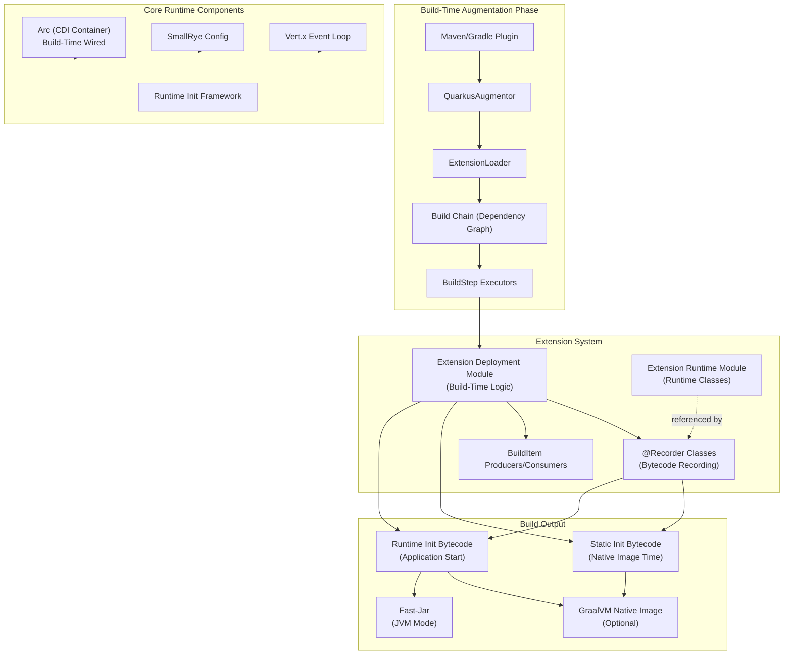
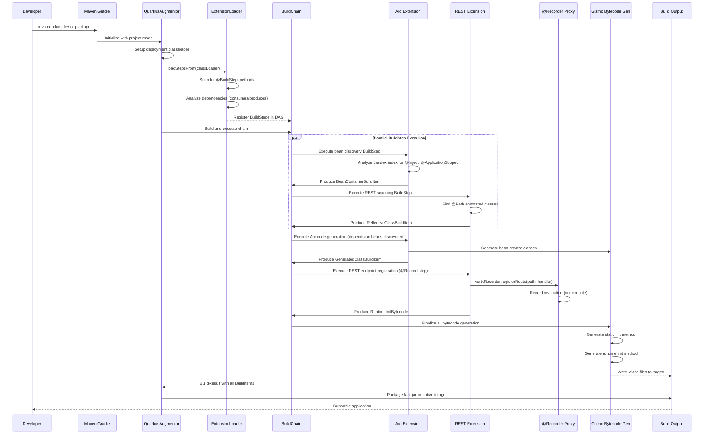
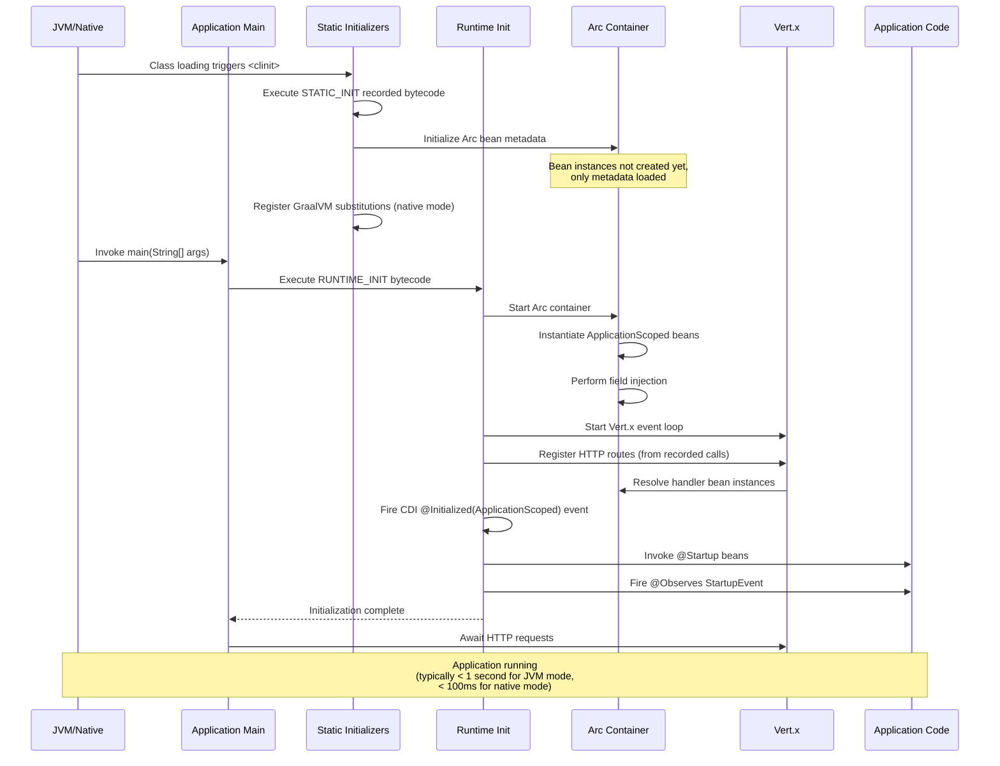
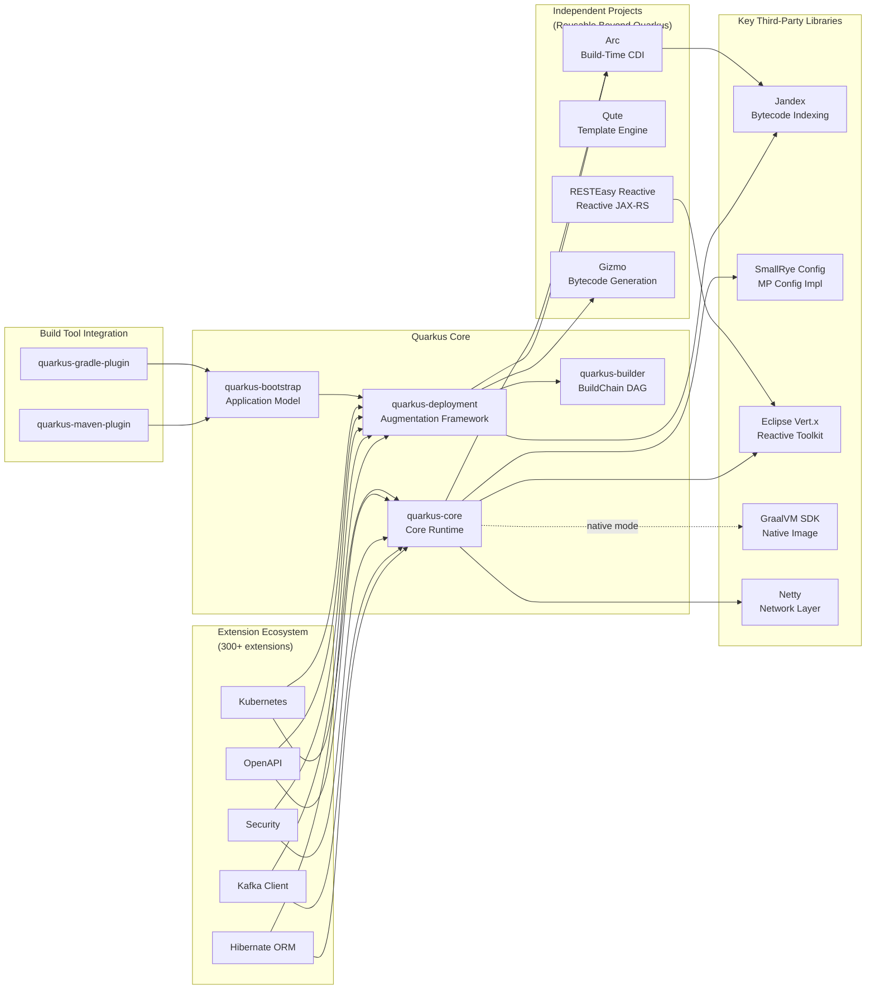

# Quarkus

> Supersonic Subatomic Java - A Cloud Native, Container First framework for writing Java applications

| Metadata | |
|---|---|
| Repository | https://github.com/quarkusio/quarkus |
| License | Apache-2.0 |
| Primary Language | Java |
| Category | Web Framework |
| Analyzed Release | `3.31.2` (2026-02-04) |
| Stars (approx.) | 15,453 |
| Generated by | Claude Sonnet 4.5 (Anthropic) |
| Generated on | 2026-02-08 |

## Overview

Quarkus is a Kubernetes-native Java framework designed for GraalVM and OpenJDK HotSpot. Built from the ground up with container-first principles, it optimizes Java specifically for cloud-native environments by shifting extensive framework processing from runtime to build time, resulting in dramatically reduced memory footprint and startup times.

Problems it solves:

- Traditional Java frameworks perform extensive class scanning, annotation processing, and dependency injection at runtime, resulting in slow startup times (10+ seconds) and high memory consumption, making them unsuitable for serverless and containerized environments
- Existing Java applications struggle with GraalVM native compilation due to reflection, dynamic class loading, and runtime proxy generation, requiring extensive manual configuration
- Microservices need fast iteration cycles, but traditional Java development requires full rebuilds and restarts, slowing developer productivity

Positioning:

Quarkus competes directly with Spring Boot in the enterprise Java space but differentiates through its build-time optimization architecture. While Spring Boot 3 added native image support via Spring Native, Quarkus was designed from inception for ahead-of-time compilation. Adopted by Red Hat as the recommended framework for OpenShift and integrated into Red Hat's middleware portfolio. Key differentiators include sub-second startup time in native mode, unified imperative and reactive programming models, and live reload capability that rivals Node.js development experience.

## Architecture Overview

Quarkus employs a unique three-phase architecture: build-time augmentation, static initialization, and runtime execution. The framework shifts as much processing as possible to the augmentation phase, where extensions analyze bytecode, perform dependency injection wiring, and generate optimized runtime code. This build-time processing is orchestrated through a dependency graph of BuildSteps that execute in parallel when dependencies allow.

## Core Components

### QuarkusAugmentor (`core/deployment/src/main/java/io/quarkus/deployment/QuarkusAugmentor.java`)

- Responsibility: Entry point and orchestrator for the entire build-time augmentation process
- Key files: `QuarkusAugmentor.java`, `QuarkusAugmentor.Builder`
- Design patterns: Builder pattern for configuration, Template Method pattern for orchestration

QuarkusAugmentor serves as the main controller for the build process, coordinating the execution of all build steps. It receives configuration from the build tool (Maven/Gradle), initializes the deployment classloader with all extension deployment modules, and constructs the BuildChain that will execute build steps in dependency order. The `run()` method initiates the augmentation process by calling `ExtensionLoader.loadStepsFrom()` to discover all BuildSteps from extensions, then constructs and executes the BuildChain. The augmentor manages multiple classloaders: a deployment classloader for build-time logic and a runtime classloader for the application code being built.

### ExtensionLoader (`core/deployment/src/main/java/io/quarkus/deployment/ExtensionLoader.java`)

- Responsibility: Discovery and registration of BuildSteps from extensions using reflection and annotation processing
- Key files: `ExtensionLoader.java`
- Design patterns: Service Provider Interface (SPI) pattern, Dependency Injection via reflection

ExtensionLoader scans the deployment classloader for classes annotated with `@BuildStep` or `@BuildSteps`, analyzes their method signatures to determine BuildItem dependencies (parameters = consume, return type/BuildProducer = produce), and registers them with the BuildChainBuilder. It performs sophisticated reflection to understand parameter types: `SimpleBuildItem` or `List<MultiBuildItem>` indicates consumption, `BuildProducer<T>`, `Consumer<T>`, or return type indicates production. The loader also handles conditional BuildSteps through `@BuildStep(onlyIf/onlyIfNot)` attributes, allowing extensions to register steps that only execute when certain conditions (BooleanSupplier implementations) are met.

### BuildChain and BuildSteps (`core/builder/src/main/java/io/quarkus/builder/`)

- Responsibility: Execution of build-time processing steps in correct dependency order with parallelization
- Key files: `BuildChain.java`, `BuildChainBuilder.java`, `BuildStep.java` (interface), `BuildContext.java`
- Design patterns: Directed Acyclic Graph (DAG) for dependency resolution, Producer-Consumer pattern

The BuildChain is a dependency graph of BuildSteps where each step declares what BuildItems it consumes and produces. The chain builder analyzes these dependencies to create a DAG, topologically sorts it to determine execution order, and executes steps in parallel when there are no dependencies between them. Each BuildStep receives a BuildContext through which it can consume previously produced BuildItems and produce new ones. The immutability of BuildItems is critical - they cannot be modified after production, ensuring thread-safety during parallel execution. The build system includes cycle detection to prevent circular dependencies and can generate detailed metrics showing which steps took the longest.

### Extension System (Deployment and Runtime modules)

- Responsibility: Modular addition of capabilities through separate deployment-time and runtime-time logic
- Key files: Extension deployment modules under `extensions/*/deployment/`, runtime modules under `extensions/*/runtime/`
- Design patterns: Two-module pattern (deployment/runtime separation), Plugin architecture

Quarkus extensions follow a strict two-module structure. The deployment module contains build-time logic (classes with `@BuildStep` methods, configuration readers, bytecode analyzers) and has dependencies on Quarkus deployment APIs. The runtime module contains only classes needed at runtime (REST endpoints, CDI beans, runtime configuration) and has minimal dependencies. This separation ensures that build-time dependencies (like Jandex indexing, bytecode manipulation libraries) never leak into the final application. Extensions communicate through BuildItems - deployment modules produce BuildItems consumed by other extensions, creating a composable ecosystem where extensions can build upon each other without tight coupling.

### Arc CDI Container (`independent-projects/arc/`)

- Responsibility: Build-time optimized CDI (Contexts and Dependency Injection) implementation
- Key files: `arc/processor/src/main/java/io/quarkus/arc/processor/BeanProcessor.java`, `arc/runtime/`
- Design patterns: Compile-time dependency resolution, Proxy pattern for lazy initialization

Arc is Quarkus's custom CDI implementation that performs all bean discovery, dependency resolution, and proxy generation at build time rather than runtime. During augmentation, Arc's BeanProcessor analyzes the application's Jandex index to find all CDI beans, validates injection points, detects circular dependencies, and generates bytecode for bean producers and dependency injection wiring. At runtime, Arc containers hold pre-wired references rather than performing resolution, resulting in near-zero overhead dependency injection. Arc supports the full CDI specification including interceptors, decorators, and events, but processes them through build-time analysis. The build-time wiring is critical for GraalVM native images, which cannot handle runtime reflection and dynamic proxy generation.

### Recorder and Bytecode Recording (`core/deployment/src/main/java/io/quarkus/deployment/recording/`)

- Responsibility: Capturing build-time method invocations and serializing them to bytecode for runtime execution
- Key files: `BytecodeRecorderImpl.java`, `RecorderContext.java`, `ObjectLoader.java`
- Design patterns: Proxy pattern for invocation recording, Command pattern for deferred execution

The recording mechanism is Quarkus's most distinctive feature. BuildSteps annotated with `@Record(STATIC_INIT)` or `@Record(RUNTIME_INIT)` receive proxy instances of @Recorder classes. When build-time code invokes methods on these proxies, the invocations are not executed immediately but instead recorded as bytecode that will be generated into the application's static initializer or main method. The BytecodeRecorderImpl uses JDK proxies to intercept method calls, serializes the method signature and parameters, and generates equivalent bytecode using Gizmo (Quarkus's bytecode generation library). Objects passed as parameters are either serialized directly (primitives, String, Class) or transformed using ObjectSubstitution to create runtime-equivalent objects. RuntimeValue<T> wrappers allow passing objects between recorder invocations while maintaining build-time/runtime separation.

### Configuration System (`core/runtime/src/main/java/io/quarkus/runtime/configuration/`)

- Responsibility: Build-time and runtime configuration reading with type-safe mapping
- Key files: `QuarkusConfigFactory.java`, `core/deployment/src/main/java/io/quarkus/deployment/configuration/BuildTimeConfigurationReader.java`
- Design patterns: Factory pattern for config creation, Mapping pattern for type conversion

Quarkus uses SmallRye Config but extends it with build-time/runtime phase separation. Configuration properties are annotated with `@ConfigRoot(phase = ConfigPhase.BUILD_TIME)` or `ConfigPhase.RUN_TIME`. Build-time config is read during augmentation and can influence which BuildSteps execute and how code is generated. Runtime config is embedded in the generated application but can be overridden at startup via environment variables or system properties. The BuildTimeConfigurationReader creates SmallRyeConfig instances, maps configuration to type-safe objects using interface proxies or POJO mapping, and validates that runtime config isn't accessed at build time (which would bake in values that should be dynamic). This separation is crucial for container environments where the same built artifact is deployed to multiple environments with different configurations.

## Data Flow

### Application Build and Augmentation Process

### Runtime Startup Sequence

## Key Design Decisions

### 1. Build-Time Augmentation Architecture

- Choice: Shift framework processing from runtime to build time through a BuildStep dependency graph
- Rationale: Traditional Java frameworks spend significant time at startup performing classpath scanning, annotation processing, proxy generation, and dependency injection wiring. By moving these operations to build time, applications start in milliseconds rather than seconds. This architecture is essential for serverless environments where cold start time directly impacts cost and user experience. Build-time processing also enables aggressive dead code elimination - if a feature isn't used, its BuildSteps don't run and its code isn't included
- Trade-offs: Longer build times (30-60 seconds for full builds vs 5-10 seconds for traditional Java). Configuration split into build-time and runtime phases adds complexity - developers must understand which config can change at runtime and which is baked in. Changes require full rebuilds rather than just restarts. However, the dev mode with live reload mitigates this during development

### 2. Two-Module Extension Pattern (Deployment/Runtime)

- Choice: Every extension consists of two Maven modules - deployment (build-time) and runtime (runtime classes only)
- Rationale: Prevents build-time dependencies from leaking into the runtime application. Build-time modules use heavy libraries like Jandex for bytecode indexing, ASM for bytecode manipulation, and Gizmo for code generation. Including these in the runtime classpath would bloat the application by 10-20MB and violate native image constraints. The strict separation is enforced through Maven dependency scopes - deployment modules depend on runtime modules but not vice versa. This also enables tree-shaking: if an extension's runtime module isn't used, neither is its deployment module
- Trade-offs: Doubles the number of modules (400+ modules in the Quarkus repository). Developers must carefully decide which code belongs in which module. Communication between modules is restricted to BuildItems and recorded bytecode, not direct method calls. However, this architectural discipline pays dividends in maintainability and clear separation of concerns

### 3. Bytecode Recording Mechanism

- Choice: Record build-time method invocations on @Recorder proxies and serialize them to bytecode for runtime execution
- Rationale: Allows build-time code to configure runtime behavior without serializing complex object graphs or requiring DSLs. Extensions can use normal Java code to configure runtime services (e.g., `vertxRecorder.registerRoute(path, handler)`) and have this automatically translated to bytecode. The recording system handles object serialization through substitution - build-time objects are transformed into simpler runtime-equivalent objects. This is the bridge between augmentation and runtime, enabling build-time decisions to materialize as runtime behavior
- Trade-offs: Debugging can be challenging - recorded invocations appear in stack traces as generated bytecode rather than source code. Limited to serializable parameters (primitives, Strings, Classes, substitutable objects). Complex object graphs require manual substitution registration. Runtime introspection of recorded config is difficult since it's compiled into bytecode rather than stored as data. However, the approach is more type-safe and performant than configuration files or reflection-based approaches

### 4. Arc Build-Time CDI Container

- Choice: Implement a custom CDI container that performs all bean discovery and wiring at build time
- Rationale: Standard CDI implementations (Weld, OpenWebBeans) rely heavily on runtime reflection, dynamic proxies, and classpath scanning - all incompatible with GraalVM native images. By performing bean analysis at build time using Jandex indexes, Arc can generate concrete classes for dependency injection rather than using reflection. Validation errors (missing dependencies, ambiguous beans) are caught at build time rather than runtime. The build-time approach enables unused beans to be eliminated from the final binary
- Trade-offs: Not fully CDI spec compliant - some advanced features like portable extensions are adapted to Quarkus's build-time model. Bean discovery is limited to indexed classes (manual registration required for third-party libraries). Dynamic bean registration at runtime is not supported. However, Arc covers 95% of common CDI usage and the build-time validation catches errors earlier than standard CDI

### 5. BuildItem Immutability and DAG-Based Execution

- Choice: BuildItems are immutable value objects; BuildSteps form a directed acyclic graph executed in dependency order with parallelization
- Rationale: Immutability ensures thread-safety during parallel BuildStep execution - multiple steps can consume the same BuildItem simultaneously without synchronization. The DAG model provides deterministic execution order while maximizing parallelism. BuildSteps with no dependencies run immediately; subsequent steps run as soon as their dependencies complete. This declarative dependency model is more maintainable than imperative ordering and enables optimizations like memoization (if inputs haven't changed, skip execution)
- Trade-offs: BuildSteps cannot modify existing BuildItems - they must produce new ones. This can lead to many small BuildItem classes (200+ in core). Circular dependencies are impossible to express, requiring workarounds like weak dependencies or split steps. Debugging the execution order requires understanding the entire dependency graph. However, the immutability eliminates entire classes of concurrency bugs and the parallel execution significantly speeds up builds

## Dependencies

## Testing Strategy

Quarkus employs a comprehensive multi-layered testing approach optimized for its build-time architecture.

Unit tests: Each module has extensive unit tests under `src/test/java`. Build-time logic (processors, BuildSteps) is tested by mocking BuildItems and verifying produced outputs. The `@QuarkusTest` annotation enables integration-style unit tests that trigger full augmentation and run tests against the resulting application. Tests use JUnit 5 with custom extensions for CDI injection and configuration.

Integration tests: The `integration-tests/` directory contains 200+ Maven modules testing various extension combinations. Each integration test builds a minimal Quarkus application with specific extensions and verifies behavior. Tests run in both JVM mode and native mode (when `-Dnative` is set), ensuring GraalVM compatibility. The native tests use Testcontainers to build native images in containers and verify startup time and memory footprint.

Dev mode tests: Specialized tests verify live reload functionality by modifying source files during test execution and checking that changes are reflected without full rebuilds. These tests validate the incremental compilation and class replacement mechanisms.

Build system: Maven-based with extensive use of profiles for different test scenarios (JVM/Native, different JDK versions, different OS). The `mvnw` wrapper ensures consistent Maven versions. Develocity (formerly Gradle Enterprise) provides build caching and performance metrics. The main build parallelizes module builds with `mvn -T 1C` (one thread per CPU core).

CI/CD: GitHub Actions with matrix builds testing multiple Java versions (17, 21, 25), operating systems (Linux, macOS, Windows), and native/JVM modes. Pull requests trigger incremental builds that only test affected modules. The `ci-actions-incremental.yml` workflow uses change detection to skip unaffected tests. Native image builds are resource-intensive (16GB RAM, 30+ minutes) so they run only on main branch commits. Releases are automated with signing via Sigstore and publication to Maven Central.

## Key Takeaways

1. Build-time optimization as first principle: Quarkus demonstrates that moving framework processing from runtime to build time can achieve order-of-magnitude improvements in startup time and memory usage. This approach is increasingly relevant as cloud pricing models charge for resource consumption and serverless platforms penalize slow cold starts. The principle extends beyond Java - any framework performing expensive initialization could benefit from build-time analysis

2. Dependency graph for build orchestration: Using a DAG of BuildSteps with automatic parallelization provides a declarative, maintainable way to coordinate complex build processes. The producer-consumer model with immutable BuildItems eliminates synchronization concerns. This pattern is applicable to any multi-step build or data processing pipeline where steps have dependencies but can otherwise run in parallel

3. Strict module separation for different execution phases: The deployment/runtime two-module pattern prevents build-time dependencies from bloating the runtime artifact. This architectural discipline is valuable for any system where build-time and runtime have different requirements - the clear separation makes it impossible to accidentally mix concerns. The pattern could be applied to code generators, compilers, or frameworks with distinct compilation and execution phases

4. Bytecode recording for configuration: Recording method invocations at build time and replaying them as bytecode at runtime provides a type-safe, performant alternative to configuration files or reflection. This technique bridges build-time decision-making and runtime execution without runtime overhead. The approach is applicable to any scenario where configuration must be captured and later executed deterministically

5. Native image compatibility through ahead-of-time processing: GraalVM native images impose strict constraints (no dynamic class loading, limited reflection, closed-world assumption). Quarkus shows that these constraints are not insurmountable if framework design accounts for them from the start. Processing metadata at build time, generating concrete classes instead of dynamic proxies, and eliminating reflection enable full framework functionality in native mode. This demonstrates that native compilation is viable for complex frameworks if architecture is adapted accordingly

6. Extension ecosystem through BuildItem contracts: BuildItems serve as the interface contract between extensions, enabling a large ecosystem (300+ extensions) without tight coupling. Extensions communicate through well-defined BuildItem types rather than direct dependencies. This plugin architecture allows extensions to compose - one extension can consume BuildItems produced by another without knowing the producer. The pattern is applicable to any extensible system where plugins need to interact

## References

- [Quarkus Official Documentation](https://quarkus.io/)
- [Build-Time Brilliance: How Quarkus Achieves Its Lightning-Fast Performance](https://www.the-main-thread.com/p/quarkus-build-time-optimizations-performance-guide)
- [Quarkus Extensions Give Java Dependencies Superpowers](https://developers.redhat.com/articles/2023/09/06/introduction-quarkus-extensions-java-dependencies)
- [Kubernetes Native Java with Quarkus - InfoQ](https://www.infoq.com/articles/native-java-quarkus/)
- [DeepWiki - quarkusio/quarkus](https://deepwiki.com/quarkusio/quarkus)
- [Quarkus GitHub Repository - CONTRIBUTING.md](https://github.com/quarkusio/quarkus/blob/main/CONTRIBUTING.md)
- [GraalVM Native Image Documentation](https://www.graalvm.org/native-image/)
