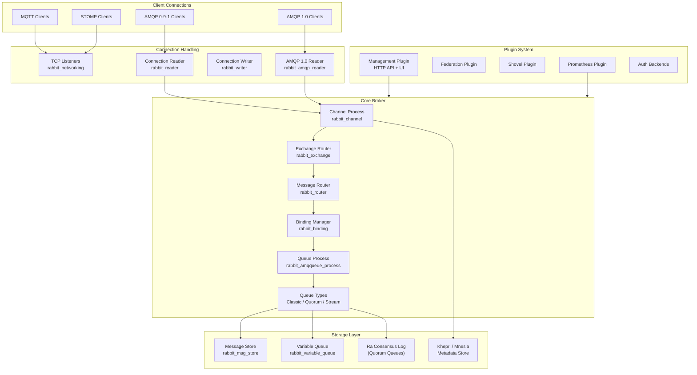
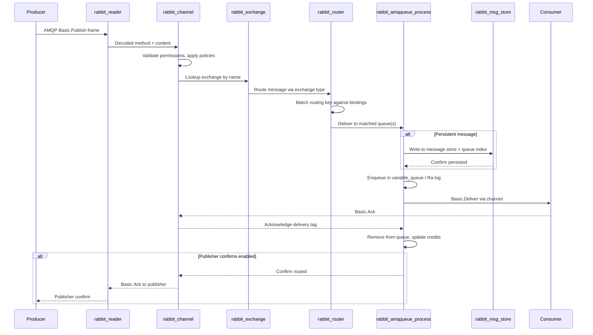
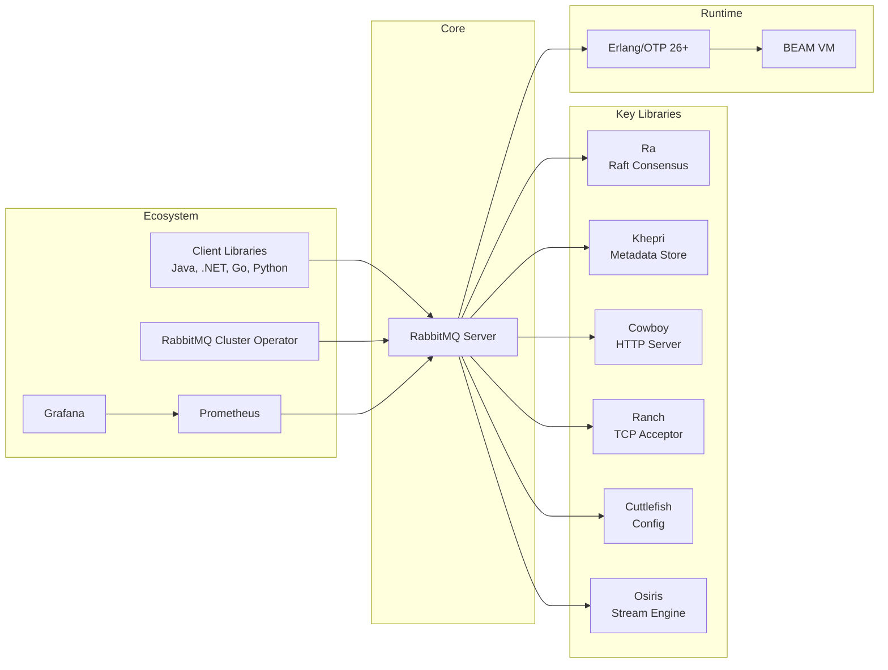

# RabbitMQ

> Open-source message broker implementing AMQP, MQTT, and STOMP protocols for reliable asynchronous messaging

| Metadata | |
|---|---|
| Repository | https://github.com/rabbitmq/rabbitmq-server |
| License | MPL-2.0 |
| Primary Language | Erlang |
| Category | Data Processing |
| Analyzed Release | `v4.1.8` (2026-01-22) |
| Stars (approx.) | 13,000+ |
| Generated by | Claude Opus 4.6 (Anthropic) |
| Generated on | 2026-02-09 |

## Overview

RabbitMQ is a feature-rich, multi-protocol message broker built on the Erlang/OTP platform. It implements the Advanced Message Queuing Protocol (AMQP) 0-9-1 as its primary protocol, with additional support for AMQP 1.0, MQTT, and STOMP through built-in plugins. The broker enables reliable asynchronous communication between distributed applications by receiving messages from producers, routing them through exchanges to queues, and delivering them to consumers.

Problems it solves:

- Tight coupling between microservices that need to communicate asynchronously without direct dependencies
- Message loss in distributed systems where producers and consumers operate at different speeds or availability levels
- Complex routing requirements where messages must be directed to multiple consumers based on topic patterns, headers, or other criteria
- Need for protocol translation between applications using different messaging standards (AMQP, MQTT, STOMP)
- Difficulty achieving reliable message delivery with at-least-once or exactly-once semantics in distributed environments

Positioning:

RabbitMQ is one of the most widely deployed open-source message brokers, competing with Apache Kafka, Apache Pulsar, and NATS. Unlike Kafka (which focuses on log-based streaming with high throughput), RabbitMQ excels at traditional message queuing with flexible routing, per-message acknowledgment, and priority queues. Compared to NATS (which prioritizes simplicity), RabbitMQ offers richer protocol support and more sophisticated routing. The Erlang/OTP foundation provides built-in clustering, fault tolerance through supervision trees, and the ability to handle millions of concurrent connections through lightweight Erlang processes.

## Architecture Overview

RabbitMQ is architected as an Erlang/OTP application organized into a monorepo containing the core broker and dozens of tier-1 plugins. The core broker manages connections, channels, exchanges, queues, and bindings. Messages flow from connections through channels to exchanges, which route them to bound queues. The system uses Erlang's actor model extensively: each connection, channel, and queue is an independent Erlang process communicating through message passing. Clustering relies on Erlang distribution for inter-node communication and Khepri/Mnesia for metadata replication.

## Core Components

### Connection and Channel Management (`deps/rabbit/src/rabbit_reader.erl`, `deps/rabbit/src/rabbit_channel.erl`)

- Responsibility: Accepting TCP connections, parsing AMQP frames, managing channel multiplexing within connections
- Key files: `deps/rabbit/src/rabbit_reader.erl`, `deps/rabbit/src/rabbit_channel.erl`, `deps/rabbit/src/rabbit_channel_sup.erl`, `deps/rabbit/src/rabbit_networking.erl`, `deps/rabbit/src/rabbit_writer.erl`
- Design patterns: Erlang gen_server/gen_statem for connection state machine, Supervisor tree for process lifecycle, Process-per-connection isolation

Each TCP connection is handled by a rabbit_reader process that implements the AMQP connection state machine (start, secure, tune, open, close). Within each connection, multiple channels can be multiplexed, each managed by an independent rabbit_channel process. The channel process handles AMQP method dispatch (basic.publish, basic.consume, queue.declare, etc.), enforces access control, manages consumer registrations, and coordinates with the exchange/queue subsystem. A dedicated rabbit_writer process handles outbound frame serialization, allowing the channel to continue processing without blocking on I/O.

### Exchange and Routing Engine (`deps/rabbit/src/rabbit_exchange.erl`, `deps/rabbit/src/rabbit_router.erl`)

- Responsibility: Routing messages from producers to queues based on exchange type and binding rules
- Key files: `deps/rabbit/src/rabbit_exchange.erl`, `deps/rabbit/src/rabbit_exchange_type_direct.erl`, `deps/rabbit/src/rabbit_exchange_type_topic.erl`, `deps/rabbit/src/rabbit_exchange_type_fanout.erl`, `deps/rabbit/src/rabbit_exchange_type_headers.erl`, `deps/rabbit/src/rabbit_router.erl`, `deps/rabbit/src/rabbit_binding.erl`
- Design patterns: Strategy pattern for exchange types, Behavior callbacks for custom exchange implementations, Trie-based matching for topic routing

The exchange subsystem implements the AMQP routing model. Each exchange type (direct, topic, fanout, headers) is a module implementing the rabbit_exchange_type behavior. Direct exchanges route by exact routing key match. Topic exchanges use a trie data structure for wildcard pattern matching (using * and # wildcards). Fanout exchanges broadcast to all bound queues. Headers exchanges match on message header values. The routing engine resolves bindings from Khepri/Mnesia at publish time and can be extended through exchange decorators and custom exchange type plugins (consistent hash, delayed message, etc.).

### Queue Subsystem (`deps/rabbit/src/rabbit_amqqueue_process.erl`, `deps/rabbit/src/rabbit_fifo.erl`)

- Responsibility: Storing messages, managing consumer delivery, handling acknowledgments, and implementing different queue semantics
- Key files: `deps/rabbit/src/rabbit_amqqueue.erl`, `deps/rabbit/src/rabbit_amqqueue_process.erl`, `deps/rabbit/src/rabbit_variable_queue.erl`, `deps/rabbit/src/rabbit_fifo.erl`, `deps/rabbit/src/rabbit_queue_type.erl`, `deps/rabbit/src/rabbit_priority_queue.erl`, `deps/rabbit/src/rabbit_msg_store.erl`
- Design patterns: Process-per-queue actor model, State machine for message lifecycle, Pluggable queue types via behavior

RabbitMQ supports three queue types. Classic queues (rabbit_amqqueue_process) use a single Erlang process per queue with rabbit_variable_queue managing the paging strategy between RAM and disk (rabbit_msg_store). Quorum queues (rabbit_fifo) use the Ra library implementing the Raft consensus protocol for replicated, fault-tolerant queues across cluster nodes. Stream queues provide an append-only log abstraction similar to Kafka topics. The queue_type abstraction (rabbit_queue_type) provides a unified interface that the channel layer uses regardless of the underlying queue implementation. Each queue manages its own consumer set, delivery tracking, and acknowledgment handling.

### Clustering and Metadata (`deps/rabbit/src/rabbit_khepri.erl`, `deps/rabbit/src/rabbit_nodes.erl`)

- Responsibility: Forming clusters, replicating metadata, coordinating node discovery, and managing schema
- Key files: `deps/rabbit/src/rabbit_khepri.erl`, `deps/rabbit/src/rabbit_mnesia.erl`, `deps/rabbit/src/rabbit_nodes.erl`, `deps/rabbit/src/rabbit_db.erl`, `deps/rabbit/src/rabbit_autoheal.erl`
- Design patterns: Distributed database for metadata (Khepri/Mnesia), Network partition detection and recovery, Peer discovery plugins

RabbitMQ clustering involves multiple nodes forming an Erlang distribution cluster. Metadata (exchange definitions, queue declarations, bindings, users, permissions, policies) is replicated across all nodes using Khepri (the new Raft-based metadata store replacing Mnesia in RabbitMQ 4.x). Khepri provides stronger consistency guarantees than Mnesia's transaction model. The rabbit_db module provides an abstraction layer that routes metadata operations to the active backend. Network partition handling is configurable with strategies including pause-minority, autoheal, and ignore. Peer discovery plugins enable automatic cluster formation in cloud environments (AWS, Kubernetes, Consul, etcd).

### Plugin System (`deps/rabbitmq_*/`)

- Responsibility: Extending broker functionality through a modular plugin architecture
- Key files: `deps/rabbitmq_management/`, `deps/rabbitmq_mqtt/`, `deps/rabbitmq_stomp/`, `deps/rabbitmq_prometheus/`, `deps/rabbitmq_federation/`, `deps/rabbitmq_shovel/`
- Design patterns: OTP application-based plugins, Boot step registration for startup ordering, Behavior callbacks for extension points

RabbitMQ's plugin system is built on the Erlang/OTP application model. Each plugin is an OTP application with defined dependencies and boot steps. The management plugin (rabbitmq_management) provides an HTTP API and web UI for monitoring and administration. Protocol plugins (MQTT, STOMP, AMQP 1.0) extend the broker to handle additional messaging protocols. Federation and Shovel plugins enable cross-cluster message forwarding. Authentication plugins support LDAP, OAuth2, HTTP-based auth, and certificate-based auth. The plugin system uses Erlang's code loading capabilities to activate/deactivate plugins without full broker restarts.

## Data Flow

### Message Publish and Consume Flow

## Key Design Decisions

### 1. Erlang/OTP as Foundation

- Choice: Build the broker on the Erlang/OTP platform rather than JVM, Go, or C++
- Rationale: Erlang's lightweight processes (millions per node), preemptive scheduling, built-in distribution protocol, and supervision trees provide the exact concurrency and fault-tolerance primitives a message broker needs. Pattern matching enables elegant protocol parsing
- Trade-offs: Smaller developer community and talent pool compared to JVM or Go. Raw throughput for CPU-bound operations is lower than C++ or Rust. Erlang's learning curve can deter contributors. Hot code loading complexity

### 2. Process-per-Entity Actor Model

- Choice: Model each connection, channel, and queue as an independent Erlang process
- Rationale: Provides natural isolation (one slow consumer cannot block another), independent garbage collection, and straightforward concurrency without shared mutable state. Failures in one entity do not cascade to others
- Trade-offs: High message volume to a single queue creates a bottleneck at the queue process. Inter-process message copying adds overhead. Process mailbox growth under backpressure requires flow control mechanisms (credit-based flow control)

### 3. Multiple Queue Types (Classic, Quorum, Stream)

- Choice: Support three distinct queue implementations with different consistency and performance characteristics
- Rationale: Different use cases require different trade-offs. Classic queues optimize for single-node performance. Quorum queues (Raft-based) provide data safety through replication. Streams provide Kafka-like append-only semantics
- Trade-offs: Three implementations increase maintenance burden and user decision complexity. Migration between queue types requires queue recreation. Feature parity across types is not always achievable (e.g., priority queues only for classic)

### 4. Khepri Replacing Mnesia for Metadata

- Choice: Migrate from Mnesia to Khepri (a Raft-based metadata store) starting in RabbitMQ 4.x
- Rationale: Mnesia's network partition handling was a persistent source of data loss and operator confusion. Khepri provides stronger consistency guarantees through Raft consensus, well-defined behavior during partitions, and a tree-structured data model that better fits RabbitMQ's metadata
- Trade-offs: Major migration effort. Dual-backend support during transition period adds complexity. Khepri's Raft overhead may be higher than Mnesia for small clusters. Operational tooling must be updated

### 5. Monorepo with Plugin Architecture

- Choice: Organize the entire project (core + 40+ plugins) as a single monorepo rather than separate repositories
- Rationale: Ensures atomic commits across core and plugins. Simplifies integration testing. Guarantees version compatibility between core and plugins. Reduces the coordination overhead of multi-repo releases
- Trade-offs: Repository is large, increasing clone and CI times. Contributors working on a single plugin must deal with the full repository. Build system complexity increases

## Dependencies

## Testing Strategy

RabbitMQ uses a comprehensive testing approach leveraging Erlang's built-in testing tools and custom infrastructure.

Unit tests: Each OTP application (core and plugins) contains unit tests using EUnit and Common Test (CT). These test individual modules like exchange routing logic, queue operations, and protocol parsing in isolation. Property-based testing with PropEr is used for certain components.

Integration tests: The `deps/rabbitmq_ct_helpers/` module provides a Common Test helper framework for spinning up multi-node RabbitMQ clusters within tests. Integration tests verify cross-node behaviors, plugin interactions, protocol compliance, and clustering scenarios. Protocol-level tests verify AMQP, MQTT, and STOMP compliance using real client connections.

CI/CD: RabbitMQ uses GitHub Actions with a matrix of Erlang/OTP versions. The CI pipeline runs unit tests, integration tests, and cross-platform builds. The `deps/rabbitmq_ct_helpers/` framework manages test environments including multi-node cluster setup and teardown. Release builds include packaging for multiple platforms (Debian, RPM, Docker, generic Unix).

## Key Takeaways

1. Erlang's actor model maps naturally to message broker entities: Each connection, channel, and queue being an independent process provides isolation, fault tolerance, and natural concurrency without locks. This demonstrates how choosing a runtime whose concurrency model matches the domain problem dramatically simplifies the architecture.

2. Multiple queue types address diverse workloads: Rather than forcing one-size-fits-all queue semantics, RabbitMQ offers classic (performance), quorum (safety), and stream (log) queue types. This pluggable approach lets users choose the right trade-off for each use case and is a pattern applicable to any storage system serving diverse workloads.

3. Monorepo plugin architecture enables coordinated evolution: Keeping 40+ plugins in a single repository with the core broker ensures atomic changes across the stack, simplifies integration testing, and guarantees version compatibility. This is a practical lesson for projects where plugin compatibility with the core is critical.

4. Metadata store migration illustrates long-term architecture evolution: The Mnesia-to-Khepri migration shows how fundamental infrastructure decisions (metadata storage) may need revisiting as scale and reliability requirements grow. Building an abstraction layer (rabbit_db) early enabled this migration without rewriting the entire broker.

## References

- [RabbitMQ Official Documentation](https://www.rabbitmq.com/docs)
- [RabbitMQ Internals Repository](https://github.com/rabbitmq/internals)
- [Design and Architecture of RabbitMQ - CloudAMQP](https://www.cloudamqp.com/blog/a-walk-through-of-the-design-and-architecture-of-rabbitmq.html)
- [RabbitMQ Internals - Compile N Run](https://www.compilenrun.com/docs/middleware/rabbitmq/rabbitmq-advanced-topics/rabbitmq-internals/)
- [RabbitMQ GitHub Repository](https://github.com/rabbitmq/rabbitmq-server)
- [Ra - Raft Consensus Library](https://github.com/rabbitmq/ra)
