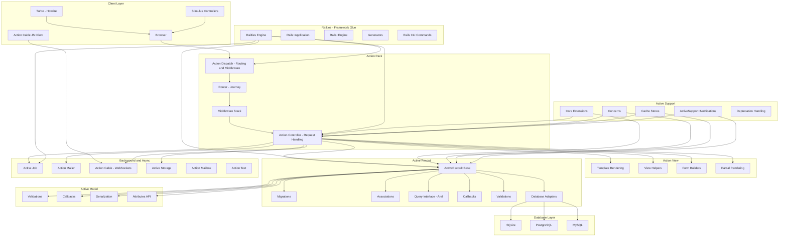
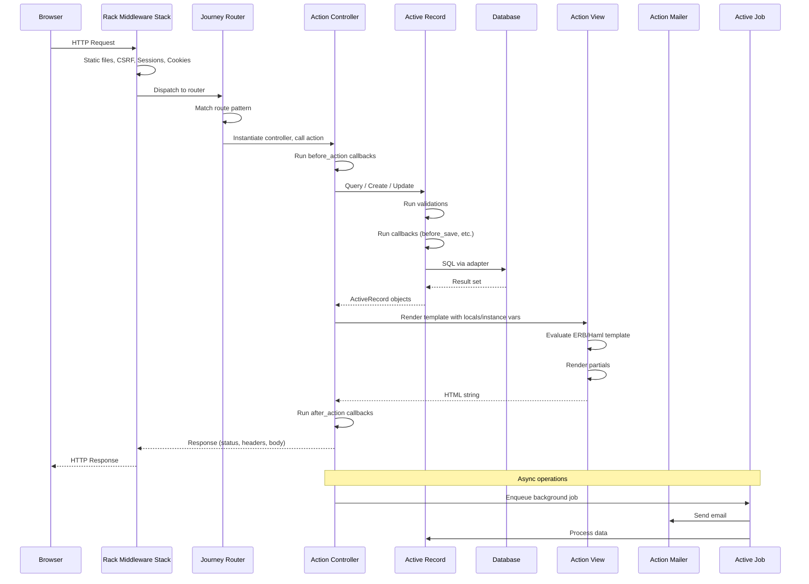
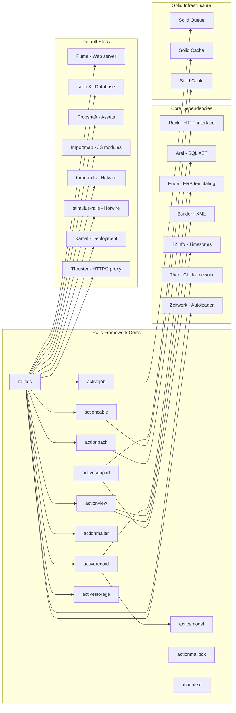

# Ruby on Rails

> Full-stack web application framework with convention over configuration

| Metadata | |
|---|---|
| Repository | https://github.com/rails/rails |
| License | MIT |
| Primary Language | Ruby |
| Category | Web Framework |
| Analyzed Release | `v8.1.2` (2026-01-08) |
| Stars (approx.) | 58,000+ |
| Generated by | Claude Opus 4.6 (Anthropic) |
| Generated on | 2026-02-08 |

## Overview

Ruby on Rails (commonly "Rails") is a full-stack web application framework created by David Heinemeier Hansson (DHH) in 2004, extracted from the Basecamp application. It is arguably the most influential web framework ever built, having pioneered patterns and conventions that were later adopted by virtually every modern web framework: convention over configuration, MVC architecture, database migrations, RESTful routing, built-in testing, and "batteries included" philosophy.

Rails solves the problem of building database-backed web applications quickly without sacrificing code quality or maintainability. Its core thesis is that most web applications share common needs (routing, ORM, templating, mailers, jobs, storage, WebSockets), and a single, cohesive framework that provides all of these with sensible defaults is more productive than assembling disparate libraries.

Rails 8 represents the "no-build" era of Rails, emphasizing:
- Importmap-based JavaScript without Node.js or bundlers
- Propshaft for asset pipeline (replacing Sprockets)
- Solid Queue, Solid Cache, and Solid Cable for SQLite-backed infrastructure
- Kamal 2 for deployment
- Thruster for HTTP/2 and asset compression
- Authentication generator built-in

Rails positions itself as the "one-person framework" -- a tool productive enough that a single developer can build and maintain a complete web application, from database to deployment.

---

## Architecture Overview



---

## Core Components

### 1. Railties -- Framework Kernel

Responsibility: Bootstrap the Rails application, load all framework components, manage the Railtie/Engine plugin system, and provide the CLI interface.

Key files:
- `railties/lib/rails/application.rb` -- Rails::Application class (inherits from Engine)
- `railties/lib/rails/engine.rb` -- Rails::Engine base class for mountable components
- `railties/lib/rails/railtie.rb` -- Railtie base class for framework component registration
- `railties/lib/rails/application/configuration.rb` -- Application configuration
- `railties/lib/rails/application/bootstrap.rb` -- Boot sequence initializers
- `railties/lib/rails/application/finisher.rb` -- Post-boot finalizers
- `railties/lib/rails/application/default_middleware_stack.rb` -- Middleware stack assembly
- `railties/lib/rails/application/routes_reloader.rb` -- Route reloading
- `railties/lib/rails/commands/` -- CLI commands (console, server, generate, db, etc.)

Design patterns:
- Kernel/Microkernel pattern: Railties defines the boot sequence; each component (ActiveRecord, ActionPack, etc.) registers itself as a Railtie
- Template Method pattern: Engine defines the initialization sequence; Application customizes it
- Registry pattern: Railties self-register via inherited() hook, collected by Rails::Railtie.subclasses
- Command pattern: CLI commands encapsulate actions (server, console, generate, migrate)

The boot sequence:
1. `config/boot.rb` sets up Bundler
2. `config/application.rb` loads Rails components and creates the Application class
3. `config/environment.rb` calls `Rails.application.initialize!`
4. Railties are sorted by dependency order and each runs its initializers
5. Middleware stack is assembled, routes are loaded, eager loading is performed

### 2. Action Pack (Action Dispatch + Action Controller)

Responsibility: HTTP request routing, middleware pipeline management, and controller-based request handling.

Key files:
- `actionpack/lib/action_dispatch/routing/mapper.rb` -- DSL for defining routes
- `actionpack/lib/action_dispatch/routing/route_set.rb` -- Route collection and matching
- `actionpack/lib/action_dispatch/journey/` -- Journey router implementation
- `actionpack/lib/action_controller/base.rb` -- Full controller with all modules
- `actionpack/lib/action_controller/api.rb` -- Lightweight API-only controller
- `actionpack/lib/action_controller/metal.rb` -- Minimal controller base class
- `actionpack/lib/action_controller/metal/strong_parameters.rb` -- Parameter whitelisting
- `actionpack/lib/action_controller/metal/rendering.rb` -- Response rendering
- `actionpack/lib/action_controller/metal/redirecting.rb` -- Redirect handling
- `actionpack/lib/action_controller/metal/request_forgery_protection.rb` -- CSRF protection
- `actionpack/lib/action_dispatch/http/` -- Request/Response objects

Design patterns:
- Front Controller pattern: All requests enter through the middleware stack to a single dispatcher
- Chain of Responsibility: Middleware stack processes requests through ordered handlers
- Strategy pattern: Different response formats (HTML, JSON, XML) handled by different renderers
- Decorator pattern: ActionController::Base includes modules that add capabilities (Authentication, Caching, CSRF, etc.)
- Builder pattern: Route DSL builds route set using `resources`, `get`, `post`, `namespace`, `scope`

The controller hierarchy:
- `ActionController::Metal` -- Bare minimum (a Rack endpoint)
- `ActionController::API` -- Metal + API-relevant modules (rendering, strong params, URL generation)
- `ActionController::Base` -- Full-featured controller (adds views, cookies, flash, CSRF, caching)

### 3. Active Record -- ORM and Database Abstraction

Responsibility: Object-relational mapping, database schema management, query interface, and data validation.

Key files:
- `activerecord/lib/active_record/base.rb` -- ActiveRecord::Base entry point
- `activerecord/lib/active_record/associations/` -- has_many, belongs_to, has_one, HABTM
- `activerecord/lib/active_record/associations/builder/` -- Association DSL builders
- `activerecord/lib/active_record/relation.rb` -- Chainable query interface
- `activerecord/lib/active_record/relation/query_methods.rb` -- where, joins, includes, etc.
- `activerecord/lib/active_record/migration.rb` -- Database migration system
- `activerecord/lib/active_record/connection_adapters/` -- Database-specific adapters
- `activerecord/lib/active_record/callbacks.rb` -- Lifecycle callbacks
- `activerecord/lib/active_record/validations.rb` -- Data validation

Design patterns:
- Active Record pattern (Martin Fowler): Objects carry both data and database access logic
- Repository pattern (partial): `ActiveRecord::Relation` acts as a composable query builder
- Adapter pattern: Database adapters abstract SQL dialect differences
- Observer pattern: Callbacks (before_save, after_create, etc.) notify on lifecycle events
- Strategy pattern: Different connection adapters for SQLite, PostgreSQL, MySQL
- Builder pattern: Chainable query interface (where().joins().order().limit())

The query interface is particularly notable:

```ruby
User.where(active: true)
    .joins(:posts)
    .where(posts: { published: true })
    .order(created_at: :desc)
    .limit(10)
```

Each method returns a new `Relation` object. The SQL is only generated and executed when results are actually needed (lazy evaluation). The underlying SQL generation uses Arel, a relational algebra library that produces database-agnostic SQL ASTs.

### 4. Active Support -- Ruby Extensions and Utilities

Responsibility: Extend the Ruby language with utility methods, provide framework-wide concerns (caching, instrumentation, deprecation), and offer common patterns.

Key files:
- `activesupport/lib/active_support/core_ext/` -- Ruby core class extensions (String, Array, Hash, Integer, Date, Time, etc.)
- `activesupport/lib/active_support/concern.rb` -- Module mixin pattern helper
- `activesupport/lib/active_support/notifications.rb` -- Instrumentation pub/sub system
- `activesupport/lib/active_support/cache.rb` -- Caching abstraction
- `activesupport/lib/active_support/callbacks.rb` -- Callback framework used by AR and AC
- `activesupport/lib/active_support/inflector/` -- Pluralization, singularization, camelCase, etc.
- `activesupport/lib/active_support/encrypted_configuration.rb` -- Encrypted credentials

Design patterns:
- Mixin pattern: Core extensions add methods to Ruby's built-in classes (controversial but powerful)
- Pub/Sub pattern: ActiveSupport::Notifications provides framework-wide instrumentation
- Strategy pattern: Multiple cache store implementations (memory, file, Redis, Memcached)
- Facade pattern: `ActiveSupport::Concern` simplifies Ruby's mixin complexity

Notable extensions include:
- `String#pluralize`, `#singularize`, `#camelize`, `#underscore`, `#titleize`
- `Integer#days`, `#hours`, `#minutes` (e.g., `3.days.ago`)
- `Hash#deep_merge`, `#symbolize_keys`, `#slice`, `#except`
- `Object#blank?`, `#present?`, `#try`

### 5. Action Cable, Active Job, and Active Storage -- Async and File Handling

Responsibility: WebSocket communication, background job processing, and file upload management.

Key files:
- `actioncable/lib/action_cable/connection/base.rb` -- WebSocket connection management
- `actioncable/lib/action_cable/channel/base.rb` -- Channel pub/sub abstraction
- `actioncable/lib/action_cable/subscription_adapter/` -- Redis, PostgreSQL, async adapters
- `activejob/lib/active_job/base.rb` -- Job base class
- `activejob/lib/active_job/queue_adapters/` -- Adapter for Sidekiq, Solid Queue, etc.
- `activestorage/lib/active_storage/blob.rb` -- File blob metadata
- `activestorage/lib/active_storage/service/` -- Storage backends (disk, S3, GCS, Azure)

Design patterns:
- Pub/Sub pattern: Action Cable channels broadcast messages to subscribers
- Adapter pattern: Active Job and Active Storage abstract backend differences
- Command pattern: Jobs encapsulate work units to be executed asynchronously
- Strategy pattern: Storage services (S3, GCS, disk) are interchangeable strategies

Rails 8 introduced "Solid" adapters:
- Solid Queue -- Active Job adapter backed by SQLite/PostgreSQL (replaces Redis-based queues)
- Solid Cache -- Cache store backed by the database
- Solid Cable -- Action Cable adapter backed by the database

These eliminate the operational dependency on Redis for many applications, simplifying deployment.

---

## Data Flow



---

## Key Design Decisions

### 1. Convention Over Configuration

Choice: Define standard directory structures, naming patterns, and defaults that work without explicit configuration. Database table names are pluralized model names. Controller actions map to view templates. URL patterns follow RESTful conventions.

Rationale: Developers spend enormous time on configuration in flexible frameworks. By establishing strong conventions, Rails eliminates bike-shedding decisions and makes every Rails project immediately navigable by any Rails developer. The convention approach also enables powerful metaprogramming -- Rails can infer relationships, routes, and file locations from names alone.

Trade-offs: Conventions can be hard to discover for beginners ("where does this behavior come from?"). Deviating from conventions requires more configuration than a convention-free framework. Some conventions (e.g., pluralized table names) clash with existing database schemas. The "magic" can make debugging harder.

### 2. Monolithic Framework with Modular Gems

Choice: Ship a complete framework (ORM, routing, views, mailer, jobs, WebSockets, storage) as a collection of gems that work together seamlessly but can be used independently.

Rationale: Web applications need all of these features. By designing them together, Rails ensures they work harmoniously -- Active Record callbacks trigger Active Job tasks that send Action Mailer emails. The integrated approach eliminates version compatibility issues and configuration glue code that plagues microlib ecosystems.

Trade-offs: Heavier initial footprint than minimal frameworks. Harder to swap individual components (e.g., replacing Active Record with Sequel). Framework upgrades affect all components simultaneously. Some applications only need a subset of features.

### 3. Active Record Pattern (Not Data Mapper)

Choice: Use the Active Record pattern where model objects contain both data and persistence logic, rather than the Data Mapper pattern that separates them.

Rationale: The Active Record pattern is simpler and more intuitive for most CRUD applications. `user.save`, `User.find(1)`, `user.update(name: "new")` read naturally. The pattern enables a rich DSL for associations (`has_many :posts`) and validations (`validates :email, presence: true`) that define the entire data layer concisely.

Trade-offs: Models can become bloated with persistence, validation, business logic, and callback concerns. Testing requires database interaction (or careful mocking). Complex domain logic can outgrow the pattern. The tight coupling between objects and database structure limits flexibility.

### 4. Hotwire as the Default Frontend

Choice: Replace SPA-style JavaScript with Turbo (Turbo Drive, Turbo Frames, Turbo Streams) and Stimulus for interactivity, sending HTML over the wire rather than JSON.

Rationale: Most Rails applications are server-rendered. Hotwire extends this model with AJAX-like partial page updates while keeping the server as the single source of truth. This aligns with Rails' server-centric philosophy and eliminates the need for a separate JavaScript build pipeline, API layer, and client-side state management.

Trade-offs: Rich client-side interactions (complex forms, drag-and-drop, real-time collaboration) are harder to implement. The JavaScript ecosystem's tooling and component libraries are not directly usable. Developers accustomed to React/Vue find the paradigm shift challenging.

### 5. Database-Backed Infrastructure (Solid Trifecta)

Choice: In Rails 8, default to SQLite/database-backed implementations for job queues (Solid Queue), caching (Solid Cache), and WebSocket pub/sub (Solid Cable) instead of requiring Redis.

Rationale: Redis adds operational complexity -- another service to provision, monitor, and maintain. For many applications, the database is sufficient for these workloads. SQLite in particular enables single-server deployments with zero external dependencies, supporting the "one-person framework" vision.

Trade-offs: Database-backed queues have higher latency than Redis for high-throughput scenarios. SQLite has write concurrency limitations. Large-scale applications still need Redis or equivalent. The Solid adapters are newer and less battle-tested than Redis-based alternatives.

---

## Dependencies



Rails is composed of many gems that depend on each other. Active Support is the foundation used by all other components. Railties glues everything together. The default stack in Rails 8 emphasizes minimal external dependencies (SQLite, Puma, no Redis, no Node.js).

---

## Testing Strategy

Rails has one of the most comprehensive testing cultures in the open-source world:

- Framework tests: Each Rails gem has its own `test/` directory with Minitest-based tests
- Test types: Unit tests, functional tests (controllers), integration tests (multi-request flows), system tests (browser-based via Capybara/Selenium)
- Generated tests: `rails generate` commands create corresponding test files
- Fixtures: YAML-based test data fixtures for database seeding
- Parallel testing: Built-in support for running tests in parallel with database-per-worker
- CI matrix: Tests run against multiple Ruby versions and multiple databases (SQLite, PostgreSQL, MySQL)

Testing philosophy:
- Every feature PR must include tests
- Tests run against real database adapters, not mocks
- System tests use headless Chrome for JavaScript-dependent features
- The `test/` directory structure mirrors `app/` (test/models/, test/controllers/, test/system/)

Rails also provides:
- `ActiveSupport::TestCase` base class with assertion helpers
- `ActionDispatch::IntegrationTest` for multi-request test scenarios
- `ActionCable::TestCase` for WebSocket channel testing
- `ActiveJob::TestHelper` for job assertion helpers
- `ActionMailer::TestHelper` for email assertions

---

## Key Takeaways

1. Convention over configuration as a scaling strategy -- Rails proved that a framework with strong conventions does not limit developer productivity; it amplifies it. By eliminating thousands of micro-decisions, Rails allows developers to focus on domain logic. This insight has been adopted by every major framework since (Nuxt, Next.js, SvelteKit, Astro). The convention approach also makes projects navigable -- any Rails developer can understand any Rails project.

2. The integrated framework provides compound benefits -- Rails' monolithic architecture means its components are designed to work together. Active Record callbacks trigger Active Job tasks that send Action Mailer emails that arrive via Action Mailbox. This integration is only possible when components share a common design philosophy. The alternative -- assembling individual libraries -- requires extensive glue code and creates compatibility maintenance burden.

3. Active Record as the dominant ORM pattern -- Despite debates about Active Record vs. Data Mapper, Rails' Active Record pattern has proven remarkably productive for the vast majority of web applications. The expressive DSL for associations, validations, and queries (`User.where(active: true).includes(:posts).order(:name)`) demonstrates that domain-specific languages built on metaprogramming can dramatically reduce boilerplate.

4. Server-rendered HTML is making a comeback -- Rails 8's embrace of Hotwire (Turbo + Stimulus) and the broader trend toward htmx-style development validates Rails' long-standing server-centric architecture. The framework was ahead of its time in arguing that most web applications do not need a JavaScript SPA, and the industry is circling back to this position.

5. Eliminating infrastructure dependencies -- The Solid trifecta (Queue, Cache, Cable backed by the database) represents a philosophical commitment to reducing operational complexity. By making SQLite a viable production database for many applications and eliminating the Redis requirement, Rails 8 makes single-server deployment realistic again. This "one-person framework" vision is a direct response to the operational complexity explosion of the microservices era.

---

## References

- [Ruby on Rails Official Guides](https://guides.rubyonrails.org/)
- [GitHub Repository - rails/rails](https://github.com/rails/rails)
- [Rails API Documentation](https://api.rubyonrails.org/)
- [Rails DeepWiki](https://deepwiki.com/rails/rails)
- [Ruby on Rails Architectural Design - Adrian Mejia](https://adrianmejia.com/ruby-on-rails-architectural-design/)
- [Component-Based Rails Architecture](https://cbra.info/)
- [Rails 8 Release Blog](https://rubyonrails.org/2024/11/7/rails-8-no-paas-required)
