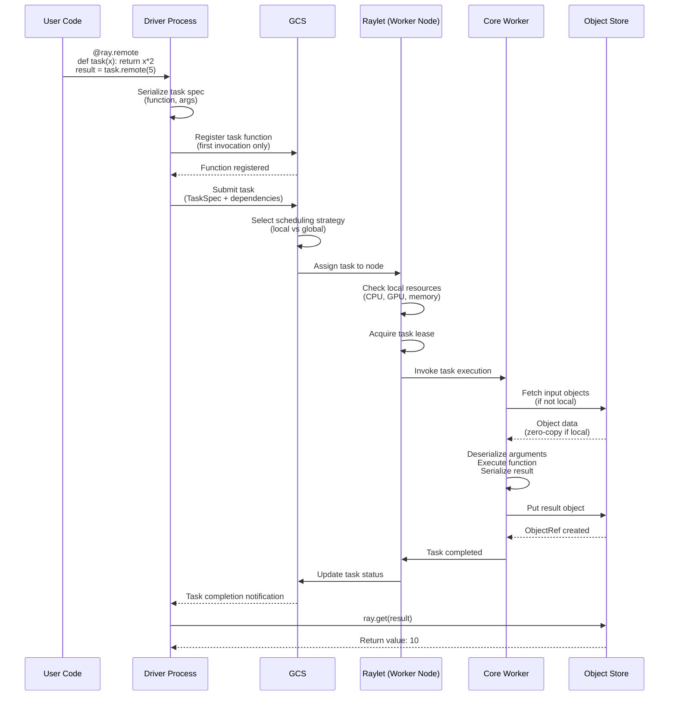
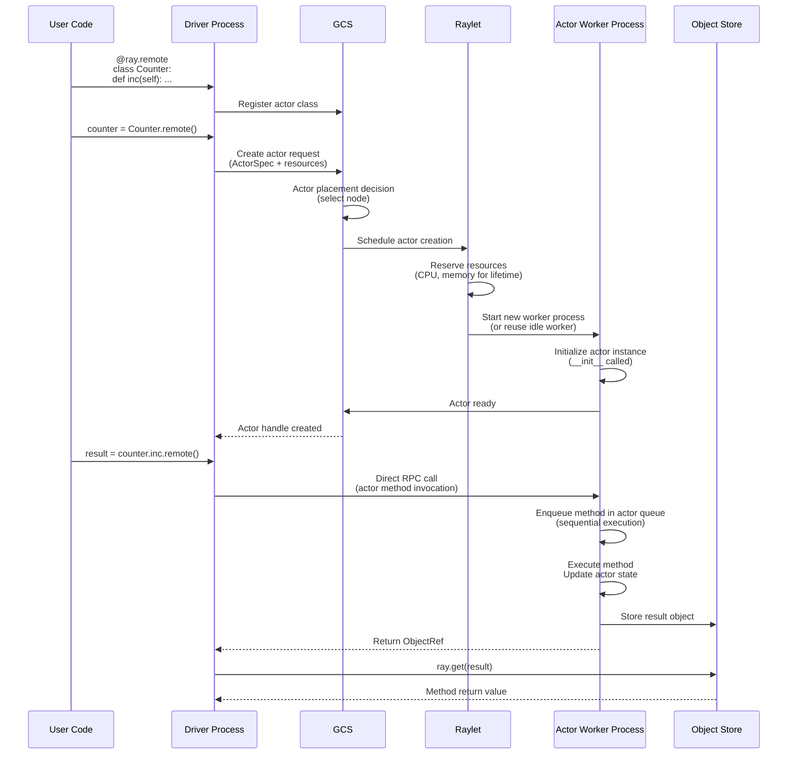
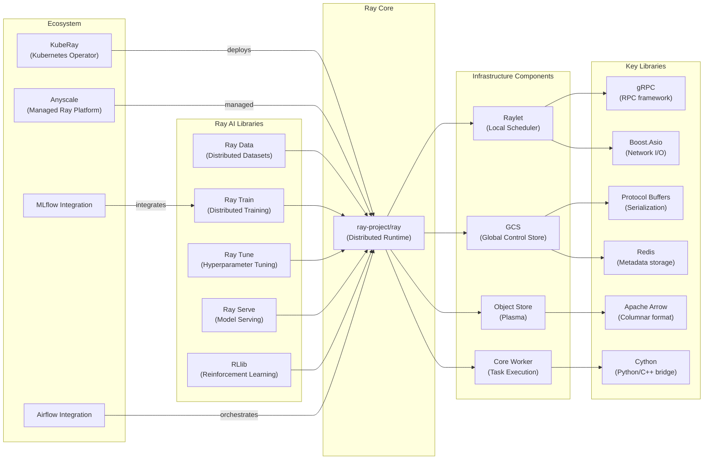

# Ray

> A unified framework for scaling AI and Python applications with distributed computing

| Metadata | |
|---|---|
| Repository | https://github.com/ray-project/ray |
| License | Apache-2.0 |
| Primary Language | Python |
| Analyzed Release | `Ray-2.53.0` (2025-12-20) |
| Stars (approx.) | 41,000+ |
| Generated by | Claude Sonnet 4.5 (Anthropic) |
| Generated on | 2026-02-08 |

## Overview

Ray is an open-source unified compute framework developed for scaling AI and Python applications. It provides a core distributed runtime and a comprehensive set of AI libraries for accelerating ML workloads including data processing, training, hyperparameter tuning, reinforcement learning, and model serving.

Problems it solves:

- Scaling Python applications from laptops to clusters without infrastructure complexity
- Unified execution of diverse ML workloads (data preprocessing, training, serving) on a single platform
- Efficient distributed computing for AI applications with millisecond-level task scheduling
- Resource management and fault tolerance for long-running ML pipelines

Positioning:

Ray has established itself as the de facto distributed computing framework for Python-based AI/ML applications. It competes with Spark for data processing, Dask for parallel computing, and Kubernetes for orchestration, but differentiates itself by providing AI-native abstractions (Tasks, Actors, Objects) and integrated ML libraries. Major companies including OpenAI, Uber, Amazon, and Alibaba use Ray for production ML workloads.

## Architecture Overview

Ray employs a hybrid distributed architecture combining a centralized control plane (GCS) with decentralized data plane (Raylets). The head node runs the Global Control Store for cluster metadata, while each worker node runs a Raylet for local scheduling and an Object Store for shared-memory object management.

```mermaid
graph TB
    subgraph HeadNode["Head Node"]
        GCS["GCS (Global Control Store)<br/>src/ray/gcs"]
        GCSStorage["GCS Storage<br/>(Redis/Persistent KV)"]
        Driver["Driver Process<br/>(User Application)"]
        Dashboard["Ray Dashboard<br/>python/ray/dashboard"]
        Autoscaler["Autoscaler<br/>python/ray/autoscaler"]
    end

    subgraph WorkerNode1["Worker Node"]
        Raylet1["Raylet<br/>src/ray/raylet<br/>(Local Scheduler)"]
        ObjectStore1["Object Store<br/>(Plasma)<br/>src/ray/object_manager"]
        Worker1A["Core Worker 1<br/>src/ray/core_worker"]
        Worker1B["Core Worker 2"]
        ObjectStore1 -.->|Shared Memory| Worker1A
        ObjectStore1 -.->|Shared Memory| Worker1B
    end

    subgraph WorkerNode2["Worker Node"]
        Raylet2["Raylet<br/>(Local Scheduler)"]
        ObjectStore2["Object Store<br/>(Plasma)"]
        Worker2A["Core Worker 3"]
        Worker2B["Core Worker 4"]
        ObjectStore2 -.->|Shared Memory| Worker2A
        ObjectStore2 -.->|Shared Memory| Worker2B
    end

    subgraph PythonLayer["Python API Layer (python/ray)"]
        RayInit["ray.init()"]
        RemoteFunc["@ray.remote<br/>(Tasks)"]
        ActorClass["Actor Classes"]
        RayLibs["AI Libraries<br/>(Train/Tune/Serve/RLlib/Data)"]
    end

    Driver -->|Submit Tasks| GCS
    GCS -->|Cluster Metadata| GCSStorage
    GCS -->|Heartbeat/Registration| Raylet1
    GCS -->|Heartbeat/Registration| Raylet2

    Raylet1 -->|Local Scheduling| Worker1A
    Raylet1 -->|Local Scheduling| Worker1B
    Raylet2 -->|Local Scheduling| Worker2A
    Raylet2 -->|Local Scheduling| Worker2B

    Worker1A <-->|Object Transfer<br/>(gRPC)| Worker2A
    ObjectStore1 <-->|Object Replication| ObjectStore2

    RayInit -->|Connects to| GCS
    RemoteFunc -->|Task Submission| Driver
    ActorClass -->|Actor Creation| Driver
    RayLibs -->|Built on| RemoteFunc
```

## Core Components

### GCS (Global Control Store) (`src/ray/gcs`)

- Responsibility: Centralized cluster metadata management and coordination
- Key files: `src/ray/gcs/gcs_node_manager.h`, `src/ray/gcs/gcs_actor_manager.h`, `src/ray/gcs/gcs_task_manager.h`
- Design patterns: Pub/Sub pattern, Service-oriented architecture

The Global Control Store (GCS) is the control plane of Ray, running on the head node. It maintains cluster-wide metadata including node registration, actor lifecycle, task specifications, and object locations. The GCS uses a pub/sub mechanism (`src/ray/pubsub`) to propagate state changes to all nodes. It stores persistent data in Redis or another KV store and provides gRPC services for node management, actor management, and placement group operations. The GCS is designed for high availability with leader election and state replication.

GCS components include:
- GcsNodeManager: Handles node registration, heartbeats, and failure detection
- GcsActorManager: Manages actor lifecycle (creation, reconstruction, deletion)
- GcsTaskManager: Tracks task specifications and execution status
- GcsPlacementGroupManager: Coordinates placement group scheduling

### Raylet (`src/ray/raylet`)

- Responsibility: Per-node local scheduling, resource management, and task execution coordination
- Key files: `src/ray/raylet/scheduling/cluster_resource_scheduler.h`, `src/ray/raylet/scheduling/local_resource_manager.h`
- Design patterns: Two-level scheduling, locality-aware scheduling

The Raylet is a C++ daemon process running on each worker node, serving as the local scheduler and resource manager. It implements a bottom-up distributed scheduling architecture where tasks are first attempted to be scheduled locally, and only escalated to the global scheduler if local resources are insufficient. The Raylet maintains local resource state, manages worker processes, and coordinates with the Object Store for data locality optimization.

Key scheduling features:
- Hybrid scheduling policy: Combines local-first and global scheduling strategies
- Resource-aware scheduling: Considers CPU, GPU, memory, and custom resources
- Locality optimization: Prefers scheduling tasks where input data already exists
- Gang scheduling: Supports placement groups for distributed training

The ClusterResourceScheduler (`src/ray/raylet/scheduling/cluster_resource_scheduler.h`) implements the core scheduling logic, selecting nodes based on resource availability, data locality, and node labels.

### Object Store (`src/ray/object_manager/plasma`)

- Responsibility: Distributed shared-memory object storage for immutable data
- Key files: `src/ray/object_manager/plasma/object_store.h`, `src/ray/object_manager/plasma/allocator.h`
- Design patterns: Shared memory, Zero-copy transfer, LRU eviction

The Object Store is based on Apache Arrow Plasma, providing an in-memory object store with shared memory access. Each node has a Plasma store daemon managing a large shared memory segment mapped into all worker processes on that node. This enables zero-copy reads for local object access. Objects are immutable once sealed, simplifying consistency management.

Key features:
- Shared memory architecture: Workers access objects via memory-mapped files
- Zero-copy serialization: Uses Apache Arrow format for efficient data layout
- Object spilling: Automatically spills objects to external storage (S3, GCS, filesystem) when memory is full
- Object directory: Distributed index tracking object locations across the cluster
- Locality-based transfer: Transfers objects between nodes using gRPC with prioritization

The ObjectManager (`src/ray/object_manager`) coordinates object transfer between nodes, implementing pull-based object replication and bandwidth management.

### Core Worker (`src/ray/core_worker`)

- Responsibility: Task execution, object serialization/deserialization, and local object management
- Key files: `src/ray/core_worker/core_worker.h`, `python/ray/_private/worker.py`
- Design patterns: Actor model, Future/Promise pattern (ObjectRef)

The Core Worker is the fundamental execution unit in Ray, existing in both C++ (`src/ray/core_worker`) and Python (`python/ray/_private/worker.py`) layers. Each worker process hosts a CoreWorker instance responsible for executing tasks and managing the actor lifecycle. It handles task submission, object reference management, and communication with the Raylet and Object Store.

The CoreWorker implements:
- Task execution: Deserializes task arguments, executes functions, and stores results
- Actor management: Manages actor state and method invocation queues
- Object reference tracking: Maintains reference counts for distributed garbage collection
- Direct actor calls: Optimizes actor invocations with direct peer-to-peer RPC

Python workers (`python/ray/_private/worker.py`) provide language bindings and high-level APIs like `@ray.remote` decorators, while the C++ CoreWorker handles low-level execution and object management.

### Ray AI Libraries (`python/ray/train`, `python/ray/tune`, `python/ray/serve`, etc.)

- Responsibility: Domain-specific libraries for ML workflows
- Key files: `python/ray/train/`, `python/ray/tune/`, `python/ray/serve/`, `python/ray/data/`, `rllib/`
- Design patterns: Builder pattern, Strategy pattern, Pipeline pattern

Ray provides integrated AI libraries built on Ray Core:

- Ray Data (`python/ray/data`): Distributed data loading and preprocessing for ML
- Ray Train (`python/ray/train`): Distributed training for PyTorch, TensorFlow, and other frameworks
- Ray Tune (`python/ray/tune`): Scalable hyperparameter tuning with population-based training
- Ray Serve (`python/ray/serve`): Model serving with autoscaling and request batching
- RLlib (`rllib/`): Reinforcement learning library with policy algorithms

These libraries abstract distributed computing complexity, providing simple APIs while leveraging Ray Core's task and actor primitives for parallelism.

## Data Flow

### Task Execution Flow



### Actor Creation and Method Invocation



## Key Design Decisions

### 1. Two-Level Distributed Scheduling

- Choice: Hybrid bottom-up scheduling with local-first policy and global fallback
- Rationale: Pure centralized scheduling becomes a bottleneck for high task throughput (millions of tasks/sec). Local-first scheduling reduces scheduling latency from milliseconds to microseconds for tasks with local data. The global scheduler only handles tasks that cannot be satisfied locally
- Trade-offs: Increases scheduling complexity and requires careful coordination. Can lead to load imbalance if local scheduling is too aggressive. Requires sophisticated work stealing and global load balancing mechanisms

### 2. Shared Memory Object Store with Plasma

- Choice: Using Apache Arrow Plasma for zero-copy shared memory object storage
- Rationale: Eliminating serialization/deserialization overhead for local object access. Large ML objects (tensors, dataframes) benefit significantly from zero-copy access. Shared memory enables efficient data passing between tasks on the same node
- Trade-offs: Limited to single-node access (shared memory not distributed). Memory management complexity increases with spilling policies. Requires careful object lifecycle management to avoid memory leaks. Fixed-size memory pool can cause allocation failures

### 3. Actor Model for Stateful Computation

- Choice: Supporting both stateless tasks and stateful actors as first-class primitives
- Rationale: ML workloads often require stateful computation (e.g., parameter servers, model replicas, simulation environments). Actors provide natural abstractions for encapsulating mutable state with guaranteed sequential execution of methods. Enables direct peer-to-peer RPC for low-latency communication
- Trade-offs: Actor failures require reconstruction and state recovery. Load balancing actors is more challenging than stateless tasks. Actor resource allocation is static for the lifetime

### 4. Decentralized Object Directory

- Choice: Distributed ownership model where object metadata is partitioned across GCS and Raylets
- Rationale: Centralized object directory becomes a scalability bottleneck. Decentralized directory enables parallel object location lookups. Object ownership follows task execution, minimizing coordination overhead
- Trade-offs: Consistency challenges in tracking object locations during transfers. Garbage collection requires distributed reference counting protocol. Debugging object availability issues is more complex

### 5. Pull-Based Object Transfer

- Choice: Object transfer initiated by task execution node pulling from object holder
- Rationale: Task scheduler has information about where objects are needed, enabling proactive prefetching. Pull model naturally handles many-to-one communication patterns common in ML (e.g., multiple workers reading shared data). Simplifies back-pressure management
- Trade-offs: Requires object directory lookups before transfers. Less efficient for one-to-many broadcasts. Higher latency for initial object access compared to push model

### 6. Language-Agnostic Core with Language-Specific Bindings

- Choice: C++ core runtime with Python/Java/C++ language bindings
- Rationale: C++ provides performance for scheduling, object management, and network I/O. Python is the dominant language for ML, requiring first-class support. Language-agnostic core enables polyglot applications
- Trade-offs: Increased implementation complexity with multiple language layers. Cross-language serialization overhead. Debugging spans multiple language runtimes

## Dependencies



## Testing Strategy

Ray employs a multi-layered testing strategy covering unit tests, integration tests, and large-scale distributed tests.

Unit tests: Each C++ component has corresponding tests in `src/ray/*/tests/`. Python components have test files colocated with source code. Mock objects are extensively used for isolating components (e.g., `FakeRayletClient`, `MockObjectStore`).

Integration tests: End-to-end tests in `python/ray/tests/` cover complete workflows including cluster setup, task execution, actor lifecycle, and fault tolerance. Test fixtures manage Ray cluster lifecycle using `ray.init()` with local mode.

Distributed tests: Large-scale tests in `release/` directory run on actual clusters to validate scalability and performance. These include benchmark suites for task throughput, object transfer bandwidth, and scheduling latency.

Build system: Uses Bazel for C++ components and setuptools for Python. Cross-compilation for multiple platforms (Linux, macOS, Windows). Nightly wheels are built and published for development testing.

CI/CD: Extensive GitHub Actions workflows for PR validation, nightly builds, and release automation. Buildkite pipelines for distributed testing on cloud infrastructure. Tests run across Python versions (3.8-3.11) and multiple OS platforms.

Fault injection: Chaos engineering tests simulate node failures, network partitions, and resource exhaustion to validate fault tolerance mechanisms.

## Key Takeaways

1. Two-level scheduling architecture: The hybrid local-first and global fallback scheduling design achieves both low latency and global optimization. This pattern is applicable to any distributed system requiring high-throughput task execution with data locality

2. Shared memory for zero-copy access: Using shared memory (Plasma) for object storage within a node eliminates serialization overhead, a critical optimization for data-intensive workloads. Applicable to any distributed data processing system with locality

3. Unified API for heterogeneous workloads: Providing a single programming model (tasks and actors) that spans diverse ML workloads simplifies the developer experience and reduces operational complexity. The abstraction successfully balances simplicity and power

4. Decentralized data plane with centralized control plane: Separating metadata management (GCS) from data movement (Object Store) and task execution (Raylet) enables independent scaling and optimization of each layer

5. Language-native integration: C++ core with language-specific bindings provides both performance and usability. The Cython bridge enables low-overhead Python-to-C++ calls while maintaining Python's expressiveness

6. Immutable objects with reference counting: ObjectRefs as distributed futures with automatic garbage collection simplifies memory management in distributed settings. The immutability constraint eliminates consistency challenges

7. Direct actor communication: Bypassing the scheduler for actor method invocations reduces latency for stateful services, a pattern applicable to microservices and model serving

8. Pull-based object transfer with prefetching: Combining pull-based transfers with scheduler-driven prefetching optimizes data locality while maintaining simple flow control

## References

- [Ray Official Documentation](https://docs.ray.io/)
- [Ray Architecture Whitepaper](https://docs.google.com/document/d/1tBw9A4j62ruI5omIJbMxly-la5w4q_TjyJgJL_jN2fI/preview)
- [Ray: A Distributed Framework for Emerging AI Applications (Paper)](https://arxiv.org/abs/1712.05889)
- [Ownership: A Distributed Futures System for Fine-Grained Tasks (NSDI 2021)](https://www.usenix.org/system/files/nsdi21-wang.pdf)
- [Exoshuffle: Large-scale Data Shuffle in Ray](https://arxiv.org/abs/2203.05072)
- [DeepWiki - ray-project/ray](https://deepwiki.com/ray-project/ray)
- [Ray GitHub Repository](https://github.com/ray-project/ray)
- [KubeRay - Ray on Kubernetes](https://github.com/ray-project/kuberay)
