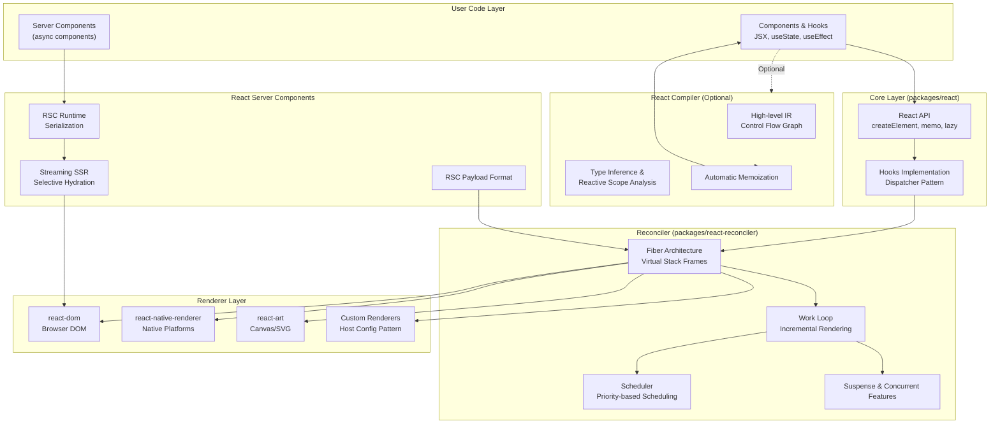
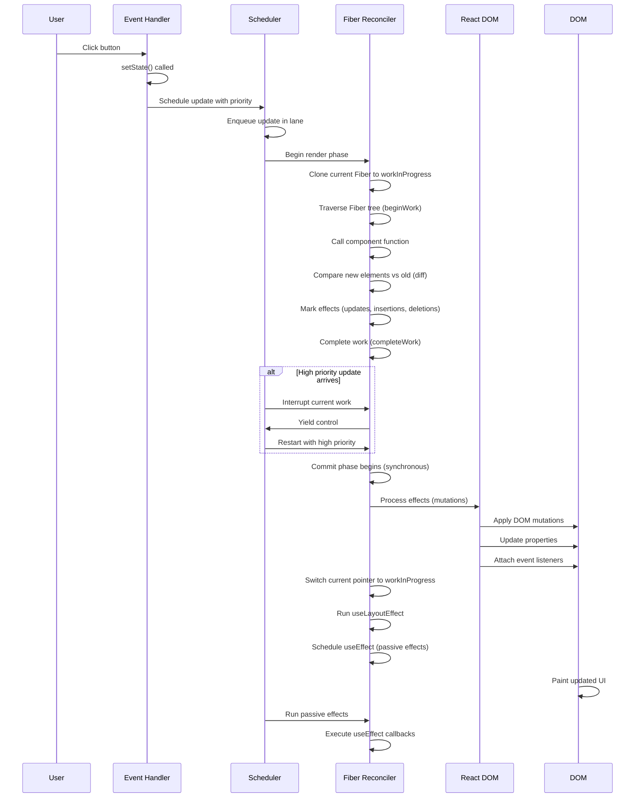
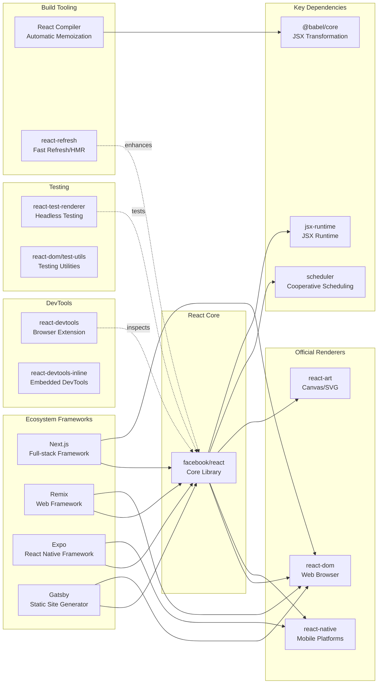

# React

> The library for web and native user interfaces

| Metadata | |
|---|---|
| Repository | https://github.com/facebook/react |
| License | MIT License |
| Primary Language | JavaScript |
| Category | Web Framework |
| Analyzed Release | `v19.2.4` (2026-01-26) |
| Stars (approx.) | 242,000+ |
| Generated by | Claude Opus 4.6 (Anthropic) |
| Generated on | 2026-02-08 |

## Overview

React is a JavaScript library for building user interfaces, developed and maintained by Meta (formerly Facebook) and a large open-source community. It pioneered the declarative, component-based approach to UI development and introduced the Virtual DOM concept to efficiently update user interfaces.

Problems it solves:

- Efficiently managing and updating complex, dynamic user interfaces without manual DOM manipulation
- Building reusable, encapsulated UI components that can be composed into sophisticated applications
- Maintaining predictable application state and UI synchronization through declarative programming
- Enabling server-side rendering, streaming, and progressive enhancement for better performance and user experience

Positioning:

React is the most widely adopted UI library in the JavaScript ecosystem, competing with Vue.js, Svelte, and Angular. It serves as the foundation for Next.js, Remix, and numerous other frameworks. React's influence extends beyond web development through React Native for mobile applications and React Three Fiber for 3D graphics.

## Architecture Overview

React employs a multi-layered architecture separating concerns between the core library, reconciliation engine, rendering targets, and scheduling system. The architecture centers around the Fiber reconciler, which implements incremental rendering through a sophisticated work-loop mechanism.

## Core Components

### React Core (`packages/react`)

- Responsibility: Provides the public API for defining components and using hooks
- Key files: `packages/react/src/React.js`, `packages/react/src/ReactHooks.js`
- Design patterns: Dispatcher pattern for hooks, Factory pattern for elements

The React core package is intentionally minimal, containing only the APIs for defining components and using hooks. It has no knowledge of how rendering works - that responsibility belongs to renderers. The hooks implementation uses the Dispatcher pattern: hooks like `useState` and `useEffect` are thin wrappers that delegate to a dispatcher object, which is set by the active renderer during render.

The core defines `React.createElement()`, which transforms JSX into element objects (plain JavaScript objects describing what to render). These elements are immutable and form a tree structure representing the desired UI state. The `React.memo()`, `React.lazy()`, and `React.forwardRef()` APIs wrap components with special marker types that the reconciler recognizes during rendering.

### Fiber Reconciler (`packages/react-reconciler`)

- Responsibility: Implements the core reconciliation algorithm that determines what needs to change
- Key files: `packages/react-reconciler/src/ReactFiberWorkLoop.js`, `packages/react-reconciler/src/ReactFiberBeginWork.js`
- Design patterns: Virtual stack frames, Double buffering, Priority queue

The Fiber reconciler is React's most sophisticated component, implementing a complete reimplementation of the JavaScript call stack optimized for UI rendering. Each Fiber is a JavaScript object representing a "virtual stack frame" containing information about a component, its input (props), and output (rendered elements).

The reconciler maintains two Fiber trees: the "current" tree representing what's on screen, and the "work-in-progress" tree being constructed. This double-buffering technique allows React to build an entire new tree in memory before committing it to the screen, enabling features like Suspense and error boundaries.

The work loop (`packages/react-reconciler/src/ReactFiberWorkLoop.js`) is the heart of rendering. It processes Fiber nodes in two phases: the render phase (interruptible, determines what changes are needed) and the commit phase (synchronous, applies changes to the DOM). The work loop can pause, resume, and abort work, enabling time-slicing and concurrent rendering.

### Scheduler (`packages/scheduler`)

- Responsibility: Manages prioritization and scheduling of work units
- Key files: `packages/scheduler/src/forks/Scheduler.js`
- Design patterns: Priority queue, Cooperative scheduling

The Scheduler is a generic cooperative task scheduler designed for browser environments. It implements a priority queue where tasks are assigned lanes (priority levels): synchronous, discrete events (clicks), continuous events (scrolling), default, and idle. High-priority work interrupts low-priority work.

The scheduler leverages `requestIdleCallback` for low-priority work and `MessageChannel` for high-priority work (instead of `requestAnimationFrame` to avoid throttling in background tabs). It yields control to the browser every 5ms by default, allowing the browser to handle user input and painting between React work.

This scheduling system enables React's concurrent features: transitions can be interrupted by urgent updates, Suspense boundaries can show fallback UIs without blocking the entire app, and heavy rendering work doesn't freeze user interactions.

### React DOM (`packages/react-dom`, `packages/react-dom-bindings`)

- Responsibility: Implements browser-specific rendering logic
- Key files: `packages/react-dom-bindings/src/client/ReactFiberConfigDOM.js`, `packages/react-dom/src/client/ReactDOM.js`
- Design patterns: Host config pattern, Event delegation

React DOM implements the reconciler's host config interface, providing browser-specific implementations of operations like `createInstance` (creates a DOM node), `appendChild`, `removeChild`, etc. The host config pattern allows the same reconciler to target different platforms (DOM, Native, Canvas) by swapping the host config.

React DOM implements sophisticated event handling through event delegation: instead of attaching listeners to individual DOM nodes, React attaches a single listener at the root and dispatches events internally. This reduces memory overhead and allows React to provide a consistent event system across browsers.

The DOM renderer also implements critical features like hydration (attaching React to server-rendered HTML), portals (rendering into different DOM subtrees), and selective hydration (hydrating parts of the page on-demand when users interact with them).

### React Compiler (`compiler/packages/babel-plugin-react-compiler`)

- Responsibility: Automatically optimizes components through static analysis and memoization
- Key files: `compiler/packages/babel-plugin-react-compiler/src/Entrypoint/Program.ts`, `compiler/packages/babel-plugin-react-compiler/src/HIR/BuildHIR.ts`
- Design patterns: Compiler pipeline with multiple IR transformations, Static analysis, Control flow graph

React Compiler is a build-time optimization tool that analyzes components and hooks to automatically insert memoization, eliminating the need for manual `useMemo`, `useCallback`, and `React.memo` calls. The compiler operates through a multi-stage pipeline:

1. Lowering: Converts Babel AST to HIR (High-level Intermediate Representation), a control-flow graph preserving JavaScript's precise evaluation order
2. SSA Conversion: Transforms HIR to Static Single Assignment form for precise data flow analysis
3. Type Inference: Conservatively infers types to identify hooks, primitives, and other relevant values
4. Reactive Scope Analysis: Identifies groups of values created/mutated together and the instructions involved
5. Scope Optimization: Prunes, merges, and optimizes reactive scopes (e.g., scopes containing hooks cannot be made conditional)
6. Codegen: Converts optimized HIR back to Babel AST with memoization inserted

The compiler validates that code follows the Rules of React (no conditional hooks, pure render functions, etc.) and only compiles valid code. It aims for predictable, neutral startup performance while significantly reducing re-rendering overhead.

### React Server Components (`packages/react-server`, `packages/react-server-dom-webpack`)

- Responsibility: Enables async components that execute on the server and stream to clients
- Key files: `packages/react-server/src/ReactFizzServer.js`, `packages/react-server-dom-webpack/src/ReactFlightDOMServerNode.js`
- Design patterns: Streaming architecture, Serialization protocol, Client/Server boundary

React Server Components (RSC) introduce a new component paradigm where components can be async and execute exclusively on the server. Unlike traditional Server-Side Rendering (SSR), which renders components to HTML once, RSC can refetch server components without a full page reload.

The architecture maintains a strict client/server boundary: server components cannot use client-side APIs like `useState`, while client components (marked with `"use client"`) run on both server (for initial SSR) and client (for hydration and updates). Server components can import and render client components, but not vice versa.

RSC introduces a serialization format called the RSC Payload - a streaming format that encodes the component tree, props, and references to client components. This payload is progressively streamed to the browser and merged into the client-side Fiber tree, enabling out-of-order streaming where fast-loading components render immediately while slow components stream in later.

The integration with Suspense allows server components to trigger suspense boundaries: if a server component suspends (e.g., awaiting data), React shows the fallback UI and streams in the final content when ready.

## Data Flow

### Component Render and Update Flow

## Key Design Decisions

### 1. Fiber Architecture - Incremental Rendering via Virtual Stack Frames

- Choice: Reimplemented the reconciliation algorithm as a linked list of "fiber" nodes instead of the recursive tree traversal used in React 15 and earlier
- Rationale: The original recursive algorithm was synchronous and could not be interrupted. Large component trees could cause frame drops and UI freezes. Fiber represents each component as a JavaScript object that can be processed incrementally, paused, and resumed. This enables time-slicing, priority-based scheduling, and concurrent rendering features like Suspense
- Trade-offs: Significantly increased implementation complexity. The codebase grew from a relatively simple recursive renderer to a sophisticated work scheduler with two-phase rendering. Memory overhead increased due to maintaining two Fiber trees (current and work-in-progress). However, the benefits - smooth UIs, better perceived performance, and unlocking concurrent features - far outweigh the complexity cost

### 2. Reconciler/Renderer Separation - Platform-Agnostic Core

- Choice: Separated the reconciliation logic (what changed) from rendering logic (how to apply changes) through the host config abstraction
- Rationale: React targets multiple platforms: browsers (react-dom), native mobile (react-native), canvas (react-art), terminals, VR, and more. By extracting platform-specific operations into a host config interface, the same reconciler can power all renderers. This reduces duplication and ensures consistent behavior across platforms
- Trade-offs: Additional indirection layer between reconciler and renderers adds conceptual overhead. Custom renderer authors must implement ~50+ host config methods. However, this enables React's "learn once, write anywhere" philosophy and allowed React Native to share 90%+ of its rendering logic with React DOM

### 3. Hooks - Function Components with State

- Choice: Introduced hooks (useState, useEffect, etc.) to enable state and side effects in function components, rather than requiring class components
- Rationale: Class components had several issues: confusing `this` binding, verbose lifecycle methods, difficulty extracting and reusing logic, and challenges for optimization (methods are harder to optimize than closures). Hooks solve these through closures and a call-order convention
- Trade-offs: The "Rules of Hooks" (must call in the same order, only at top level) are non-obvious and require a linter to enforce. The implementation relies on a linked list of hook nodes stored on Fiber nodes, indexed by call order, which is subtle and error-prone. Despite this, hooks dramatically simplified component authoring and enabled better code reuse through custom hooks

### 4. React Server Components - Zero-Bundle Server-Only Components

- Choice: Introduced a new component type that executes exclusively on the server and never ships JavaScript to the client, communicating via a streaming serialization protocol
- Rationale: Traditional SSR renders components to HTML but still requires shipping all component code to the client for hydration. Many components only fetch data and render static content - their code is pure overhead. RSC eliminates this overhead: server components can directly access databases, read from the filesystem, and use server-only libraries without adding to the client bundle. Only interactive client components ship to the browser
- Trade-offs: Introduces significant architectural complexity with client/server boundaries, a custom serialization protocol, and build-time/runtime tooling requirements. Frameworks must handle bundling, routing, and data fetching differently. However, the performance benefits - drastically reduced JavaScript bundles, faster data fetching (no client/server waterfall), and better security (secrets stay on server) - make this valuable for data-heavy applications

### 5. Automatic Memoization via Compiler

- Choice: Built a production-ready optimizing compiler that automatically memoizes components and hooks, eliminating manual `useMemo`/`useCallback`/`React.memo` usage
- Rationale: Manual memoization is verbose, error-prone, and often applied incorrectly (either over-memoizing or under-memoizing). React's core principle is declarative UI: developers describe what they want, not how to optimize it. A compiler can analyze data flow precisely and insert optimal memoization automatically, while also validating the Rules of React
- Trade-offs: Adds build-time overhead and requires a complex multi-pass compiler with SSA conversion, control-flow analysis, and type inference. Generated code is larger (memoization wrappers add bytes). The compiler only works on valid React code following all rules. However, automatic optimization removes cognitive burden from developers, prevents common mistakes, and can optimize more granularly than manual approaches (e.g., conditional memoization)

## Dependencies

## Testing Strategy

React employs a comprehensive, multi-layered testing strategy reflecting its complexity and critical role in the ecosystem.

Unit tests: Every package has extensive unit tests in `__tests__` directories using Jest. The test suite includes over 3,000 test files covering individual functions, hooks, component behavior, and edge cases. Tests use a golden file pattern with snapshots in `__snapshots__` directories to catch unintended behavior changes.

Integration tests: End-to-end tests verify interaction between reconciler, scheduler, and renderers. The `react-noop-renderer` package provides a test renderer for reconciler testing without DOM dependencies. Tests verify features like Suspense, concurrent rendering, error boundaries, and SSR work correctly across the stack.

Fixture tests: The `fixtures/` directory contains real-world application scenarios (SSR apps, DevTools integrations, etc.) used for manual and automated testing of complex interactions and regressions.

Build system: Uses Rollup for bundling with extensive configuration in `scripts/rollup/`. Separate bundles are created for development (with warnings and debugging aids) and production (optimized and minified). The build system also generates flow types, TypeScript definitions, and multiple module formats (CJS, ESM, UMD).

CI/CD: GitHub Actions runs the full test suite on every commit, testing against multiple Node versions and browsers. Separate workflows test the compiler, runtime, DevTools, and build artifacts. The project uses Percy for visual regression testing and Danger for automated PR reviews. Continuous benchmarking tracks performance regressions.

Public testing: Major features go through RFC (Request for Comments) process and experimental releases. The React team maintains experimental builds and feature flags to test new features in production-like environments before stable release. Community feedback through bug reports, discussions, and beta testing is crucial to quality.

## Key Takeaways

1. Incremental rendering through virtual stack frames: React's Fiber architecture demonstrates how to transform a recursive algorithm into an incremental one by reifying the call stack as data structures. This pattern - representing program execution state as explicit objects that can be paused, resumed, and reprioritized - applies broadly to any system requiring interruptible work. The double-buffering technique (current vs work-in-progress trees) enables atomic updates and rollback on errors.

2. Separation of concerns through renderer abstraction: The reconciler/renderer split via host config shows how to build a platform-agnostic core with platform-specific adapters. This pattern enabled React to expand from web to mobile, VR, terminals, and more without forking the codebase. Any framework targeting multiple platforms can apply this: define a minimal interface for platform operations, implement the core logic once, and provide platform-specific implementations.

3. Declarative APIs with imperative optimization: React's philosophy is "describe what you want, not how to get it," but underneath uses highly imperative, optimized code. The React Compiler exemplifies this: developers write simple, declarative code, and the compiler inserts imperative optimizations automatically. This separation allows framework authors to optimize implementations without changing user-facing APIs - users benefit from improvements without code changes.

4. Progressive enhancement through feature detection: React's architecture allows features like concurrent rendering, Suspense, and Server Components to be adopted incrementally. Applications can mix legacy and modern patterns in the same tree. This is achieved through feature flags, renderer capabilities, and component-level opt-in. Systems with large, diverse user bases should design for gradual migration rather than big-bang rewrites.

5. Two-phase rendering for consistency: The render/commit phase split ensures the UI is never in an inconsistent state. The render phase can be interrupted and restarted, but the commit phase is synchronous and atomic. This pattern - separating computation (which can be slow, interrupted, or retried) from mutation (which must be fast and atomic) - applies to any system where observable state must remain consistent.

6. Compiler-driven optimization: React Compiler demonstrates that build-time analysis can eliminate runtime overhead and developer burden. By encoding framework rules (Rules of React) as compiler checks, violations are caught early. The compiler's granular memoization outperforms manual approaches. Other frameworks can adopt similar strategies: move work from runtime to build time, validate constraints statically, and optimize based on framework-specific knowledge.

7. Streaming and progressive loading: React Server Components and Suspense show how to stream content progressively rather than waiting for all data before rendering. Out-of-order streaming (components arrive in any order but insert in the correct tree position) keeps perceived performance high. This pattern is applicable beyond React: any system delivering content over networks can benefit from streaming the most critical content first and progressively enhancing.

## References

- [React Official Documentation](https://react.dev/)
- [React Compiler Introduction](https://react.dev/learn/react-compiler/introduction)
- [React Compiler v1.0 Release](https://react.dev/blog/2025/10/07/react-compiler-1)
- [React Fiber Architecture](https://github.com/acdlite/react-fiber-architecture)
- [Deep Dive into React Fiber](https://blog.logrocket.com/deep-dive-react-fiber/)
- [Inside Fiber: In-depth Overview of the Reconciliation Algorithm](https://medium.com/react-in-depth/inside-fiber-in-depth-overview-of-the-new-reconciliation-algorithm-in-react-e1c04700ef6e)
- [React Server Components Deep Dive](https://dev.to/hasunnilupul/react-server-components-rsc-a-deep-dive-with-examples-and-diagrams-3g4c)
- [Making Sense of React Server Components](https://www.joshwcomeau.com/react/server-components/)
- [Understanding React Server Components - Vercel](https://vercel.com/blog/understanding-react-server-components)
- [React Suspense Documentation](https://react.dev/reference/react/Suspense)
- [React Virtual DOM and Internals](https://legacy.reactjs.org/docs/faq-internals.html)
- [Meta's React Compiler 1.0 - InfoQ](https://www.infoq.com/news/2025/12/react-compiler-meta/)
