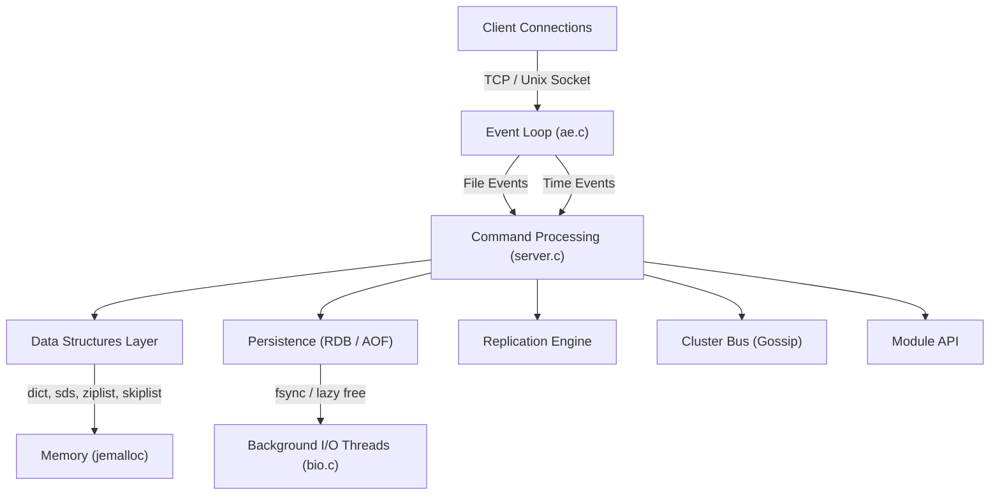
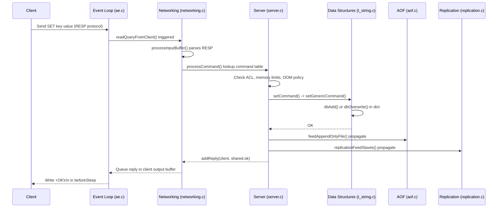
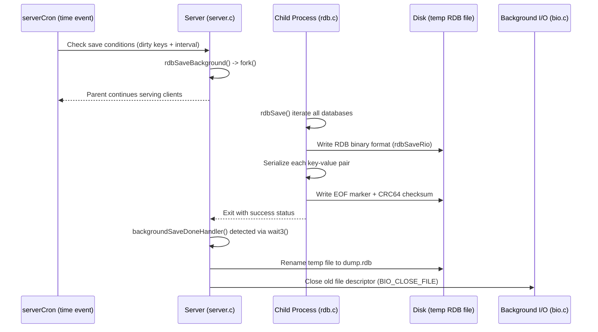
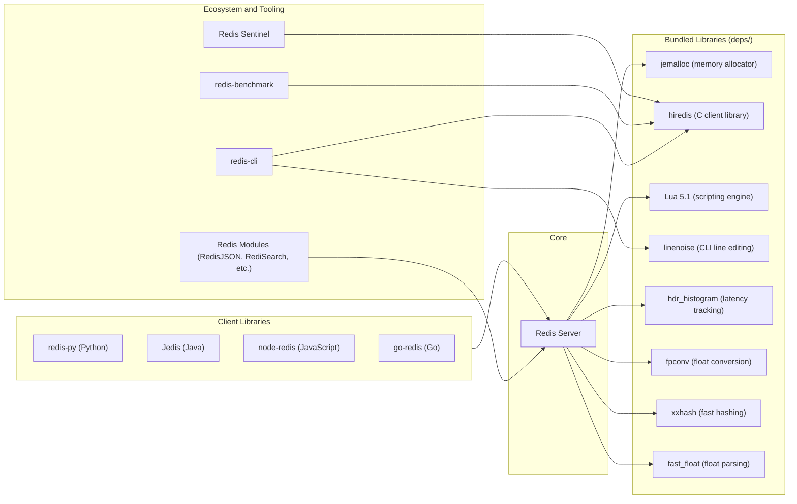

# Redis

> The preferred, fastest, and most feature-rich in-memory data structure server, cache, and real-time data engine for developers building data-driven applications.

| Metadata | |
|---|---|
| Repository | https://github.com/redis/redis |
| License | RSALv2 / SSPLv1 / AGPLv3 (tri-license since v8.0) |
| Primary Language | C |
| Analyzed Release | `8.2.4` (2026-02-08) |
| Stars (approx.) | 72,800+ |
| Generated by | Claude Opus 4.6 (Anthropic) |
| Generated on | 2026-02-08 |

## Overview

Redis is a high-performance, in-memory data structure server that supports a rich set of data types including strings, hashes, lists, sets, sorted sets, streams, JSON, and probabilistic structures. It operates primarily as a single-threaded event-driven system, achieving sub-millisecond latency for most operations while offering optional persistence, replication, clustering, and Lua scripting capabilities. Originally created by Salvatore Sanfilippo (antirez), Redis has evolved from a simple key-value cache into a versatile data platform used as a database, message broker, search engine, and vector store.

Problems it solves:

- Eliminates slow disk-based data access for latency-critical workloads by keeping the working dataset entirely in memory
- Provides atomic operations on complex data structures (sorted sets, streams, HyperLogLog) without the overhead of a traditional relational database
- Enables real-time pub/sub messaging, event streaming, and inter-service communication with minimal infrastructure complexity
- Serves as a distributed session store, rate limiter, leaderboard engine, and caching layer with built-in eviction policies and TTL support

Positioning:

Redis occupies a unique position as both a cache and a primary data store. Compared to Memcached, Redis offers richer data structures, persistence, replication, and Lua scripting. Compared to traditional databases like PostgreSQL or MongoDB, Redis trades durability guarantees for extreme speed. Competitors like Dragonfly and KeyDB attempt to improve Redis performance through multi-threading, while Valkey (a fork) emerged after the 2024 license change. Redis remains the dominant player with the largest ecosystem of client libraries, tooling, and community knowledge.

## Architecture Overview

Redis follows a single-threaded, event-driven architecture where one main thread handles all command execution, ensuring atomicity without locks. The event loop (implemented in the custom `ae` library) multiplexes I/O using the best available OS primitive (epoll on Linux, kqueue on BSD/macOS). Background threads handle non-critical tasks like file closing, AOF fsync, and lazy memory freeing. Optional I/O threads can parallelize network read/write operations while keeping command processing single-threaded.

## Core Components

### Event Loop (`src/ae.c`, `src/ae.h`)

- Responsibility: Provides the central event-driven I/O multiplexing mechanism that powers all Redis networking and scheduled tasks
- Key files: `src/ae.c`, `src/ae_epoll.c`, `src/ae_kqueue.c`, `src/ae_evport.c`, `src/ae_select.c`
- Design patterns: Reactor pattern, Strategy pattern (compile-time selection of I/O backend)

The ae (A simple Event library) is Redis's custom event loop implementation. It abstracts platform-specific I/O multiplexing syscalls behind a unified API. At compile time, `ae.c` selects the best available backend using `#ifdef` directives in order of preference: evport (Solaris), epoll (Linux), kqueue (BSD/macOS), and finally select as a fallback. The core function `aeProcessEvents()` handles both file events (socket read/write readiness) and time events (periodic tasks like `serverCron`). The main loop is started by `aeMain()` which calls `aeProcessEvents()` in a tight loop. The `aeBeforeSleepProc` callback is invoked before each blocking poll, handling tasks like flushing pending client output buffers and processing AOF writes.

### Server Core (`src/server.c`, `src/server.h`)

- Responsibility: Initializes the server, manages the global state, dispatches commands, and coordinates all subsystems
- Key files: `src/server.c`, `src/server.h`, `src/config.c`, `src/networking.c`
- Design patterns: Command pattern (command table with function pointers), Mediator pattern (central coordination)

The `main()` function in `server.c` is the entry point. It calls `initServerConfig()` to set defaults, parses configuration, calls `initServer()` to allocate data structures and create the listening socket, and finally enters the event loop via `aeMain(server.el)`. The `redisServer` struct (defined in `server.h`) holds all global state: databases, client lists, configuration, replication state, and cluster metadata. Command dispatch works through a hash table of `redisCommand` structs, each containing a function pointer, arity, flags, and key specification. When a client sends a command, `processCommand()` in `server.c` looks up the command table and invokes the handler. The `serverCron()` time event runs at configurable intervals (default 10 Hz) and handles background tasks including key expiration, rehashing, replication heartbeats, and memory management.

### Networking Layer (`src/networking.c`, `src/connection.c`)

- Responsibility: Manages client connections, reads queries, formats replies, and handles I/O threading
- Key files: `src/networking.c`, `src/connection.c`, `src/socket.c`, `src/tls.c`, `src/unix.c`
- Design patterns: Observer pattern (event-driven callbacks on socket readiness), Template Method (connection abstraction)

When a new connection arrives, `acceptTcpHandler()` creates a `client` struct and registers `readQueryFromClient()` as the read handler with the event loop. `readQueryFromClient()` reads data into a per-client query buffer, then `processInputBuffer()` parses it according to the RESP protocol. Replies are built using the `addReply*()` family of functions, which append data to client output buffers. To avoid blocking the event loop, replies are written asynchronously: clients with pending output are added to `server.clients_pending_write`, and their data is flushed by `handleClientsWithPendingWritesUsingThreads()` during the `beforeSleep` phase. The `connection.c` abstraction layer provides a unified interface for plain TCP, TLS, and Unix domain sockets.

### Data Structures (`src/t_*.c`, `src/dict.c`, `src/sds.c`)

- Responsibility: Implements the diverse set of Redis data types and their underlying memory-efficient encodings
- Key files: `src/t_string.c`, `src/t_hash.c`, `src/t_list.c`, `src/t_set.c`, `src/t_zset.c`, `src/t_stream.c`, `src/dict.c`, `src/sds.c`, `src/quicklist.c`, `src/rax.c`, `src/ziplist.c`
- Design patterns: Type Object pattern (encoding-agnostic operations), Adapter pattern (multiple internal representations per logical type)

Each Redis data type can use multiple internal encodings depending on size. For example, hashes use listpack for small cardinalities and switch to a hash table for larger ones. Sorted sets combine a skiplist with a hash table in `t_zset.c` for O(log N) range queries and O(1) score lookups. The `dict.c` hash table uses incremental rehashing: instead of pausing to resize, it maintains two hash tables simultaneously and migrates entries a few at a time during normal operations. `sds.c` (Simple Dynamic Strings) provides the fundamental string type with binary safety, length prefixing (avoiding O(n) strlen), and space pre-allocation for efficient append operations. The `rax.c` radix tree powers stream consumer groups and cluster slot-to-key mappings.

### Persistence Engine (`src/rdb.c`, `src/aof.c`)

- Responsibility: Provides durable storage through point-in-time snapshots (RDB) and operation logging (AOF)
- Key files: `src/rdb.c`, `src/rdb.h`, `src/aof.c`, `src/rio.c`
- Design patterns: Strategy pattern (multiple persistence modes), Snapshot pattern (fork-based COW), Write-Ahead Log pattern (AOF)

RDB persistence creates a compact binary snapshot by forking the server process. The child process serializes all databases to a temporary file using the `rdbSave*()` functions while the parent continues serving clients, leveraging the operating system's copy-on-write mechanism. AOF persistence logs every write command in RESP format. Since Redis 7.0, AOF uses a multi-part file format with a base file and incremental files, managed by a manifest. The `aof.c` module handles AOF rewriting (compaction) by forking a child that generates a new base AOF from the current dataset. Hybrid persistence (default since Redis 4.0) combines both: the AOF rewrite produces an RDB preamble followed by incremental AOF entries. The `rio.c` module provides a stream I/O abstraction used by both RDB and AOF for writing to files, sockets, or in-memory buffers.

### Cluster and Replication (`src/cluster.c`, `src/replication.c`)

- Responsibility: Enables horizontal scaling through hash-slot-based sharding and high availability through primary-replica replication
- Key files: `src/cluster.c`, `src/cluster_legacy.c`, `src/cluster_asm.c`, `src/replication.c`, `src/sentinel.c`
- Design patterns: Gossip protocol (decentralized cluster state), Consistent Hashing variant (16384 hash slots), Observer pattern (replication stream)

Redis Cluster partitions the keyspace into 16,384 hash slots using CRC16. Each master node is responsible for a subset of slots, and clients are redirected via MOVED/ASK responses when they access keys on the wrong node. Nodes communicate through the Cluster Bus using a binary gossip protocol on a dedicated port (client port + 10000). The gossip protocol propagates node states, detects failures through heartbeat timeouts, and triggers automatic failover by consensus voting among remaining masters. Replication in `replication.c` uses an asynchronous primary-replica model: replicas connect to masters, receive a full dataset via RDB transfer (PSYNC), and then consume an ongoing replication stream. Partial resynchronization avoids full transfers after brief disconnections by using a replication backlog buffer and offset tracking.

### Background I/O (`src/bio.c`)

- Responsibility: Offloads blocking operations to dedicated background threads to keep the main event loop non-blocking
- Key files: `src/bio.c`, `src/bio.h`, `src/lazyfree.c`
- Design patterns: Producer-Consumer pattern (job queues), Thread Pool pattern (fixed worker threads)

Redis maintains three types of background jobs: `BIO_CLOSE_FILE` for closing file descriptors, `BIO_AOF_FSYNC` for fsyncing the AOF file, and `BIO_LAZY_FREE` for asynchronous memory deallocation. Each job type has its own dedicated thread, mutex, and condition variable. When the main thread needs to free a large object (e.g., a hash with millions of fields), it evaluates the deallocation cost. If the cost exceeds the `LAZYFREE_THRESHOLD` (64), the object is handed off to the lazy free thread via `bioCreateLazyFreeJob()`, allowing the main thread to return immediately. This design was introduced in Redis 4.0 to eliminate the latency spikes caused by synchronous deletion of large keys.

## Data Flow

### Command Execution: SET key value

### RDB Snapshot Persistence

## Key Design Decisions

### 1. Single-Threaded Command Execution

- Choice: All data-mutating commands execute on a single main thread, with no locks on data structures
- Rationale: Eliminates the complexity, overhead, and subtle bugs of concurrent data structure access. A single thread avoids context switching and cache line contention, which are significant bottlenecks for in-memory workloads. Since Redis operations are predominantly memory-bound and complete in microseconds, a single CPU core can handle hundreds of thousands of operations per second.
- Trade-offs: Cannot leverage multiple CPU cores for command execution (requires running multiple Redis instances for CPU-bound scaling). Long-running commands like `KEYS *` or `DEL` on huge collections block all other clients. This limitation is partially mitigated by `UNLINK` (lazy free), `SCAN` (cursor-based iteration), and optional I/O threading for network operations.

### 2. Custom Event Loop (ae library) Instead of libevent/libev

- Choice: Redis implements its own event loop library (`ae.c`) rather than depending on established libraries like libevent or libev
- Rationale: The ae library is approximately 800 lines of code, purpose-built for Redis's specific needs. It provides exactly what Redis requires: file event registration, time event scheduling, and before-sleep hooks, without unnecessary abstraction layers. This reduces external dependencies (critical for Redis's "zero dependencies" build philosophy), eliminates potential compatibility issues, and allows tight integration with Redis internals such as the `beforeSleep` callback.
- Trade-offs: Redis must maintain its own I/O multiplexing code and port it to new platforms. However, since the backends (epoll, kqueue, evport, select) have stable APIs, maintenance burden is minimal. The simplicity of the library makes it easier to audit and debug than a general-purpose alternative.

### 3. Fork-Based Persistence (Copy-on-Write Snapshots)

- Choice: RDB snapshots and AOF rewrites use `fork()` to create a child process that serializes data while the parent continues serving requests
- Rationale: The OS copy-on-write mechanism provides a consistent snapshot of the entire dataset at fork time without requiring application-level locking or complex concurrent data structure snapshotting. The child process sees a frozen view of memory, and only modified pages are duplicated by the kernel.
- Trade-offs: Fork can be expensive for large datasets (kernel must copy page tables), and COW can cause significant memory overhead if many pages are modified during the snapshot (up to 2x memory in the worst case). On systems with Transparent Huge Pages enabled, COW amplification can be severe. Redis documents this and recommends disabling THP. The `fork()` approach also means persistence is unsuitable for environments where forking is restricted (certain containers or embedded systems).

### 4. Incremental Rehashing in Hash Tables

- Choice: The `dict.c` hash table maintains two tables simultaneously during resizing, migrating entries incrementally across regular operations rather than in a single blocking step
- Rationale: A blocking rehash of a hash table with millions of entries would stall the event loop for an unacceptable duration. By moving a few entries per operation (and during `serverCron`), the rehash cost is amortized. Both tables are consulted during lookups to ensure correctness during the migration period.
- Trade-offs: Slightly increases memory usage during rehashing (two tables exist simultaneously) and adds a small overhead to every hash operation (checking which table to use). The complexity is contained within `dict.c` and transparent to callers.

### 5. Multi-Encoding Data Types

- Choice: Each logical data type (hash, list, set, sorted set) can use multiple internal representations that are transparently switched based on size thresholds
- Rationale: Small collections (a few elements) can be stored in compact, cache-friendly formats like listpack (formerly ziplist) that use significantly less memory than full-featured data structures. When collections grow beyond configurable thresholds, Redis automatically converts them to their standard representations (hash tables, skiplists, quicklists) for better algorithmic performance.
- Trade-offs: Adds implementation complexity (each type needs encoding-specific code paths) and conversion overhead when thresholds are crossed. However, in practice, most real-world Redis keys are small, so the memory savings are substantial -- often 5-10x for small hashes and lists.

## Dependencies

Redis bundles all its core dependencies to achieve a zero-external-dependency build. jemalloc is the default memory allocator on Linux, chosen for its fragmentation behavior and modified to support Redis's active defragmentation. hiredis is the official C client library, used by redis-cli, redis-benchmark, and Sentinel. Lua 5.1 powers the EVAL scripting engine with security modifications. linenoise provides readline-like line editing in redis-cli. hdr_histogram enables per-command latency percentile tracking. All dependencies are vendored in the `deps/` directory.

## Testing Strategy

Redis uses a comprehensive Tcl-based test framework located in `tests/` with test execution coordinated by `tests/test_helper.tcl`. Tests are organized into units that can run in parallel across multiple Redis instances, while tests within a single unit run sequentially as they may share state.

Unit tests: Located in `tests/unit/`, covering individual Redis features such as ACLs (`acl.tcl`), data types (`bitops.tcl`, `hyperloglog.tcl`), networking (`networking.tcl`), key expiration (`expire.tcl`), memory management (`maxmemory.tcl`, `lazyfree.tcl`), and geo operations (`geo.tcl`). Each test file starts a Redis instance, sends commands, and validates responses.

Integration tests: Located in `tests/integration/`, covering cross-component scenarios such as AOF persistence (`aof.tcl`, `aof-multi-part.tcl`), RDB loading (`rdb.tcl`), replication (`psync2.tcl`, `psync2-reg.tcl`, `replication-2.tcl`), failover (`failover.tcl`), and corrupt data handling (`corrupt-dump.tcl`, `corrupt-dump-fuzzer.tcl`). Cluster-specific tests reside in `tests/cluster/` and Sentinel tests in `tests/sentinel/`.

CI/CD: Redis runs continuous integration on every commit, including tests under Valgrind for memory error detection. The `--accurate` flag enables stricter test conditions for CI environments. The test framework supports various modes including cluster mode, TLS mode, and module testing through `tests/modules/`.

## Key Takeaways

1. Simplicity as a performance strategy: Redis demonstrates that a single-threaded, event-driven architecture can outperform multi-threaded alternatives for in-memory workloads. By eliminating locks, context switches, and cache contention, Redis achieves predictable sub-millisecond latency. The lesson for other projects is that simplicity in the concurrency model often wins over theoretical parallelism, especially when individual operations are fast (microseconds). Complexity should be added only where profiling proves it necessary, as Redis did with optional I/O threads.

2. Encoding-aware data structures save memory at scale: Redis's approach of using compact encodings (listpack, ziplist) for small collections and transparently upgrading to full data structures (hash tables, skiplists) as they grow is a powerful pattern. This type-level polymorphism lets Redis serve millions of small keys with a fraction of the memory a naive implementation would require. Any system managing heterogeneous collections can benefit from this approach of optimizing for the common case (small objects) while preserving correctness for the general case.

3. Amortized housekeeping prevents latency spikes: Rather than performing expensive operations synchronously (rehashing, key expiration scanning, memory defragmentation), Redis distributes this work across many event loop iterations via `serverCron` and incremental algorithms. This amortization pattern -- doing a little work each cycle instead of batching it -- is widely applicable to any latency-sensitive system. Combined with the lazy-free background thread model, it shows how to keep worst-case latency bounded without sacrificing throughput.

4. Zero-dependency builds increase adoption and reliability: By bundling all libraries in `deps/` and implementing core infrastructure (event loop, strings, networking) from scratch, Redis can be compiled on virtually any POSIX system with just `make`. This dramatically lowers the barrier to contribution and deployment. The trade-off of maintaining custom code is offset by the stability benefits of controlling the entire stack.

## References

- [Redis Official Documentation](https://redis.io/docs/)
- [Redis GitHub Repository](https://github.com/redis/redis)
- [Redis Internals - Event Library](https://redis.io/docs/latest/operate/oss_and_stack/reference/internals/internals-rediseventlib/)
- [Redis Persistence Guide](https://redis.io/docs/latest/operate/oss_and_stack/management/persistence/)
- [Redis Cluster Specification](https://redis.io/docs/latest/operate/oss_and_stack/reference/cluster-spec/)
- [DeepWiki - Server Architecture and Lifecycle](https://deepwiki.com/redis/redis/2.1-server-architecture-and-lifecycle)
- [Redis Deep Dive Part 1: In-Memory Architecture and Event Loop](https://thuva4.com/blog/part-1-the-core-of-redis/)
- [Lazy Redis is Better Redis (antirez blog)](https://antirez.com/news/93)
- [Redis Under the Hood (Paul Adam Smith)](https://www.pauladamsmith.com/articles/redis-under-the-hood.html)
