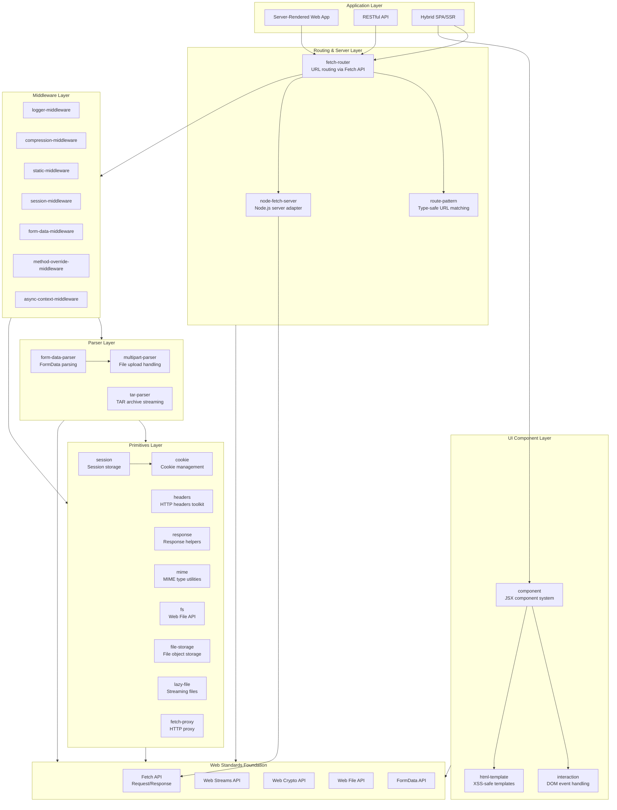
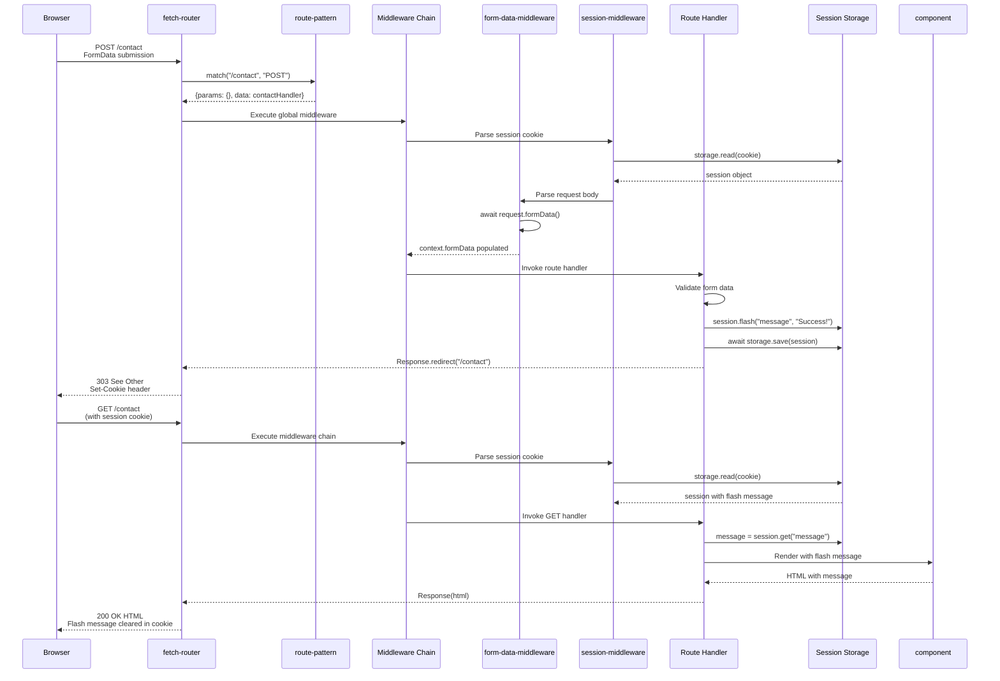
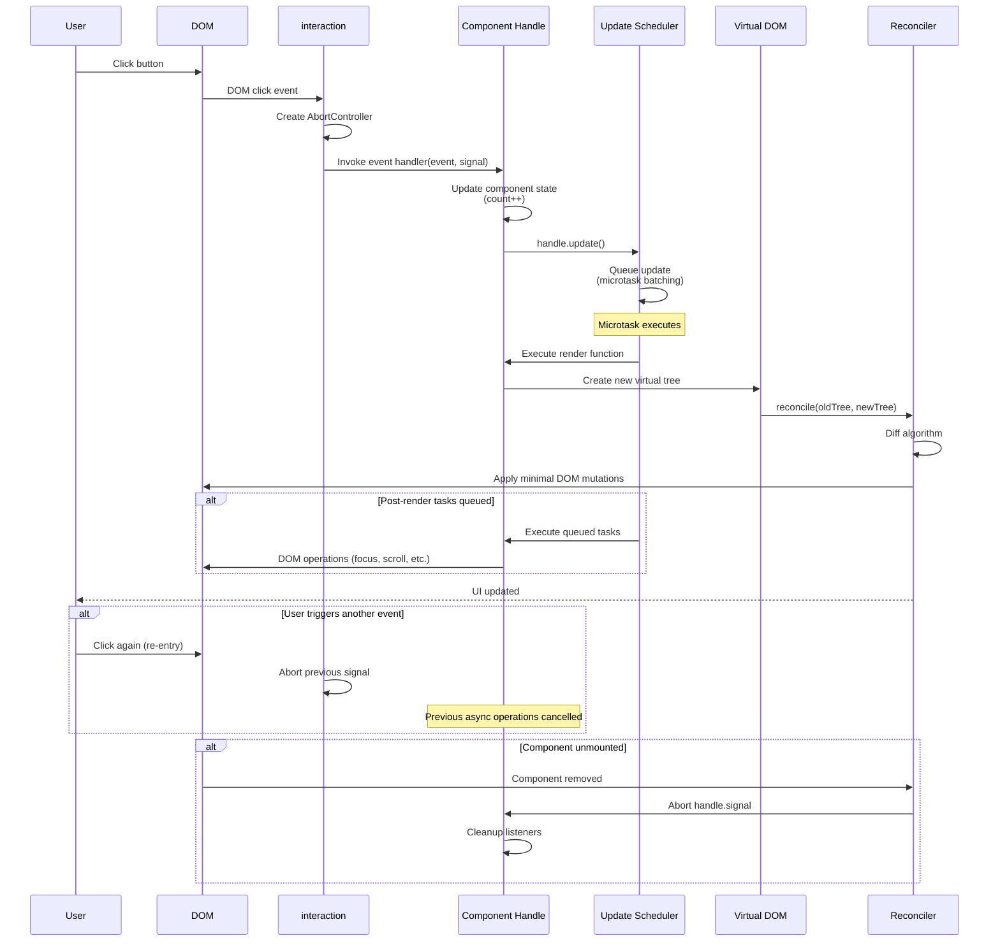
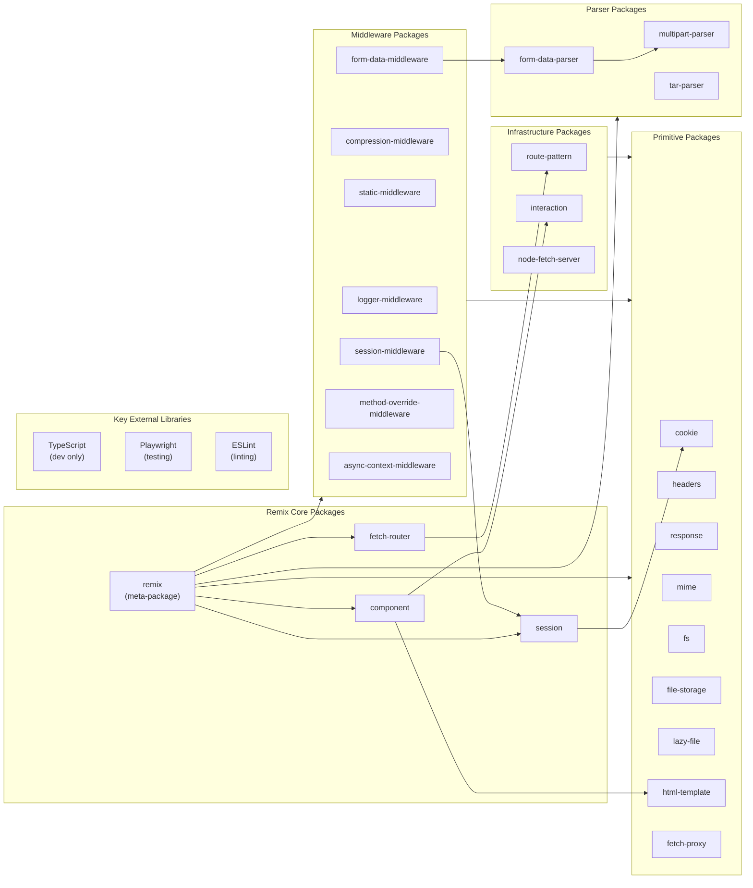

# Remix

> Build Better Websites. Create modern, resilient user experiences with web fundamentals.

| Metadata | |
|---|---|
| Repository | https://github.com/remix-run/remix |
| License | MIT License |
| Primary Language | TypeScript |
| Category | Web Framework |
| Analyzed Release | `remix@3.0.0-alpha.2` (2026-01-28) |
| Stars (approx.) | 32,248 |
| Generated by | Claude Sonnet 4.5 (Anthropic) |
| Generated on | 2026-02-08 |

## Overview

Remix 3 represents a fundamental rethinking of web framework architecture, moving away from React-centric monolithic frameworks to a composable ecosystem of single-purpose packages built entirely on web standards. Unlike traditional frameworks that lock developers into specific runtime environments, Remix 3 prioritizes portability by leveraging the Fetch API, Web Streams, Web Crypto, and other universal web APIs that work seamlessly across Node.js, Bun, Deno, Cloudflare Workers, and browsers.

Problems it solves:

- Framework lock-in and vendor dependencies that limit portability across JavaScript runtimes and deployment targets
- Complexity of managing separate abstractions for client and server code, forcing developers to context-switch between different mental models
- Over-reliance on build-time transformations and bundlers, leading to poor API design and runtime performance issues
- Difficulty in adopting AI-assisted development due to framework-specific abstractions that LLMs struggle to understand

Positioning:

Remix 3 distinguishes itself from React frameworks like Next.js and Astro by abandoning React entirely in favor of web standards. While traditional frameworks provide integrated solutions, Remix takes an opposite approach: each of its 25+ packages is independently usable and documented, enabling developers to adopt only what they need. This positions Remix as a "toolkit" rather than a framework, similar to how Express provides composable middleware but extended to the full stack with modern web APIs.

## Architecture Overview

Remix 3 employs a modular, composable architecture where each package addresses a single concern and can be used independently or combined cohesively. The architecture follows a layered approach: low-level primitives (cookies, headers, MIME types), middleware components (compression, logging, sessions), routing and server infrastructure (fetch-router, node-fetch-server), UI components (component system with JSX runtime), and parsers (multipart, tar, form-data). All packages are designed to work without bundlers or static analysis, ensuring runtime-first semantics.

## Core Components

### Routing Layer (`packages/fetch-router`)

- Responsibility: Request routing, pattern matching, and middleware orchestration based on the Fetch API
- Key files: `packages/fetch-router/src/lib/router.ts`, `packages/fetch-router/src/lib/middleware.ts`, `packages/fetch-router/src/routes.ts`
- Design patterns: Middleware chain pattern, Strategy pattern (pluggable matchers), Declarative route maps

The fetch-router is the backbone of Remix's server architecture, accepting standard Request objects and returning Response objects. Routes are defined using a declarative route map syntax with full TypeScript type safety, where route parameters are automatically inferred. The router supports two matching strategies: ArrayMatcher for small applications (simple linear scan) and TrieMatcher for large applications (optimized trie-based lookup). Middleware can be applied globally at the router level or inline at the route level, with automatic request abort handling to prevent memory leaks.

The middleware execution model follows a classic chain-of-responsibility pattern with automatic downstream invocation. If middleware returns a Response, the chain short-circuits. If middleware calls next(), the downstream response is used. If middleware does neither, the router automatically invokes downstream handlers, simplifying common cases.

### Route Pattern Matching (`packages/route-pattern`)

- Responsibility: Type-safe URL pattern matching and href generation with parameter extraction
- Key files: `packages/route-pattern/src/route-pattern.ts`, `packages/route-pattern/src/matchers/`
- Design patterns: Compiled pattern optimization, Type-level programming for parameter inference

RoutePattern provides an intuitive syntax for URL matching: variables (`:id`), wildcards (`*path`), optionals (`(segment)`), and search params (`?key=value`). Unlike URLPattern (the web standard), RoutePattern offers simpler syntax, better TypeScript integration, and bidirectional functionality (both matching and href generation). Patterns are compiled at construction time for optimal runtime performance, and the type system extracts parameter names directly from the pattern string, providing autocomplete and validation.

The matcher abstraction allows switching between ArrayMatcher (O(n) linear scan) and TrieMatcher (O(log n) prefix-based lookup) depending on application scale, with both implementations exposing identical interfaces.

### Component System (`packages/component`)

- Responsibility: Client-side UI rendering with manual update control, JSX support, and server-side rendering
- Key files: `packages/component/src/lib/component.ts`, `packages/component/src/lib/vdom.ts`, `packages/component/src/lib/reconcile.ts`
- Design patterns: Setup/Render separation, Manual update scheduling, Virtual DOM reconciliation

Unlike React's automatic re-rendering, Remix's component system requires explicit `handle.update()` calls, giving developers fine-grained control over render timing. Components follow a setup-then-render lifecycle: the component function runs once during initialization, returning a render function that executes on each update. This separation enables efficient closure-based state management without hooks.

The component Handle provides lifecycle management: `update()` schedules renders, `queueTask()` schedules post-render DOM operations, `signal` provides cleanup via AbortSignal, `context` enables ancestor-descendant communication, and `on()` attaches event listeners with automatic cleanup. The CSS prop supports pseudo-selectors and nested rules via runtime stylesheet generation, avoiding external CSS-in-JS dependencies.

Future capabilities include server-side rendering, selective hydration, and Frame components for streamable partial UI updates.

### Session Management (`packages/session`)

- Responsibility: Server-side session handling with multiple storage backends and security features
- Key files: `packages/session/src/session.ts`, `packages/session/src/cookie-storage.ts`, `packages/session/src/fs-storage.ts`
- Design patterns: Strategy pattern (pluggable storage), Flash message pattern, Session fixation protection

The session package provides three storage strategies: CookieSessionStorage (all data in cookie, 4KB limit), FsSessionStorage (filesystem-backed for production), and MemorySessionStorage (in-memory for development). All storage implementations use signed cookies for session identification, preventing tampering.

Flash messages support one-time notifications that persist only until the next request. Session regeneration via `session.regenerateId()` mitigates session fixation attacks by issuing new session IDs after privilege changes like login. The session middleware automatically integrates with fetch-router, handling cookie parsing and response header management.

### Multipart Parser (`packages/multipart-parser`)

- Responsibility: Streaming multipart/form-data parsing for file uploads across all JavaScript runtimes
- Key files: `packages/multipart-parser/src/multipart-parser.ts`, `packages/multipart-parser/src/node.ts`
- Design patterns: Iterator pattern (async generators), Streaming architecture, Zero-copy where possible

The multipart-parser uses async generators to yield MultipartPart objects as they're discovered in the stream, avoiding buffering entire requests in memory. It consistently outperforms popular alternatives like busboy in benchmarks while maintaining zero dependencies. The parser supports file size limiting to prevent abuse, automatic boundary extraction from Content-Type headers, and first-class Node.js IncomingMessage support.

MultipartPart provides multiple data access methods: `text` for string content, `bytes` for Uint8Array, `arrayBuffer` for ArrayBuffer, and metadata properties (`name`, `filename`, `mediaType`, `size`). Error handling distinguishes between parse errors, size limit violations, and stream errors via specific error subclasses.

### Middleware Ecosystem (`packages/*-middleware`)

- Responsibility: Composable request/response transformation layers for common server functionality
- Key files: Various `packages/*-middleware/src/*.ts` files
- Design patterns: Middleware pattern, Functional composition, Dependency injection via options

Remix provides seven middleware packages: logger (request/response logging), compression (gzip/brotli encoding), static (file serving), session (automatic session management), form-data (FormData parsing), method-override (PUT/DELETE via forms), and async-context (AsyncLocalStorage integration). Each middleware is independently publishable and documented, usable outside Remix applications.

Middleware functions receive a context object and next function, returning either a Response to short-circuit or undefined to continue. The middleware execution model ensures request abort signals propagate through the chain, preventing zombie requests from consuming resources.

## Data Flow

### Server-Rendered Form Submission Flow

### Component Update and Event Handling Flow

## Key Design Decisions

### 1. Web Standards Foundation over Framework Abstractions

- Choice: Build entirely on Fetch API, Web Streams, Web Crypto, and other universal web APIs instead of Node.js-specific or framework-specific abstractions
- Rationale: Portability across all JavaScript runtimes (Node.js, Deno, Bun, Cloudflare Workers, browsers) without transpilation. Code written once runs everywhere, and developers learn transferable skills. Web standards evolve independently of framework lifecycles, providing long-term stability
- Trade-offs: Missing some runtime-specific optimizations (e.g., Node.js Buffer is faster than Uint8Array for certain operations). Requires polyfills in older environments. Some web APIs have limited browser support, requiring careful feature detection

### 2. Religiously Runtime-First Design

- Choice: All packages must work without bundlers, compilers, or any pre-runtime static analysis, and all tests run without bundling
- Rationale: Bundler-dependent APIs create vendor lock-in and pollute codebases with build-time assumptions. Runtime-first design ensures code is immediately executable, simplifying debugging and enabling true REPL-driven development. AI tools like LLMs benefit from straightforward runtime semantics without complex build configurations
- Trade-offs: Cannot leverage advanced TypeScript features that require code generation (decorators, emit). Type-to-runtime validation libraries like Zod must be used instead of compile-time schema validation. Bundle size optimization requires explicit coding practices rather than dead code elimination

### 3. Composability via Single-Responsibility Packages

- Choice: Distribute 25+ independent packages, each with a single responsibility, while also offering a unified `remix` package that bundles everything
- Rationale: Forces clear separation of concerns and prevents tight coupling. Each package is testable, documentable, and replaceable independently. Developers can adopt only needed functionality (e.g., use fetch-router without the component system). Enables third-party ecosystem growth around individual packages
- Trade-offs: Increased cognitive load for beginners choosing between packages. Version management complexity across package boundaries. Documentation must exist at both package and ecosystem levels. Risk of fragmentation if community adopts incompatible patterns

### 4. Manual Update Scheduling in Component System

- Choice: Require explicit `handle.update()` calls instead of automatic re-rendering on state changes
- Rationale: Eliminates hidden rendering costs and re-render bugs from unexpected state mutations. Developers have full control over batching and scheduling (e.g., update after all validations complete, not after each field change). Avoids complex dependency tracking systems like React's hooks. Simpler mental model aligns with vanilla JavaScript patterns
- Trade-offs: More verbose code with explicit update calls. Risk of forgetting to call update(), leading to stale UI. No automatic optimization of unnecessary re-renders (developers must manually skip updates). Steeper learning curve for developers accustomed to reactive frameworks

### 5. Type-Safe Routing with Compile-Time Parameter Inference

- Choice: Extract route parameters from pattern strings at the type level, providing autocomplete and compile-time validation
- Rationale: Eliminates entire classes of runtime errors from typos in parameter names. TypeScript autocomplete guides developers without consulting documentation. Changes to route patterns automatically propagate through the codebase via type errors. Bidirectional type safety ensures `href()` generation uses correct parameters
- Trade-offs: Complex type-level programming increases TypeScript compilation time. Type errors can be cryptic when pattern syntax is invalid. Limited to TypeScript users (JavaScript users get no benefits). Pattern syntax must remain simple enough for type-level parsing

### 6. Zero Dependencies Philosophy

- Choice: Minimize external dependencies, wrapping necessary ones completely, with the goal of reaching zero dependencies
- Rationale: Dependencies lock the project into others' roadmaps and introduce supply chain security risks. Each dependency increases bundle size and potential vulnerability surface. Complete wrapping of dependencies allows eventual replacement without breaking changes. Zero dependencies simplify auditing and reduce maintenance burden
- Trade-offs: Must reimplement common functionality, increasing development time. Risk of bugs in custom implementations versus battle-tested libraries. Maintenance burden shifts from dependency updates to internal code maintenance. May miss optimizations present in specialized libraries

## Dependencies

## Testing Strategy

Remix employs a runtime-first testing philosophy where all tests execute without bundling, ensuring test environments closely mirror production environments.

Unit tests: Each package contains comprehensive unit tests using Node.js's built-in test runner (`node:test`) and assertion library (`node:assert/strict`). Tests validate individual functions, classes, and modules in isolation. The test-driven development approach is encouraged: write tests first, run them to confirm failure, then implement functionality to make tests pass.

Integration tests: Packages like component use Playwright for browser-based integration testing, validating server-side rendering, hydration, and DOM interactions. The fetch-router package tests actual HTTP request/response flows using standard fetch() calls without mocking frameworks, ensuring tests exercise real codepaths.

Build system: Uses pnpm workspaces for monorepo management with parallel execution (`pnpm --parallel run test`). TypeScript compilation happens via `tsc` without bundling. The repository enforces strict type checking and linting via ESLint with custom rules (prefer-let, import order, JSDoc validation). Code formatting uses Prettier with consistent configuration across all packages.

CI/CD: GitHub Actions runs tests across multiple Node.js versions (requires Node.js 24+), performs type checking, linting, and format validation. The changesets workflow manages versioning and release automation. Preview branches enable testing of work-in-progress features before merging to main.

## Key Takeaways

1. Web Standards as Foundation: Building on universal web APIs (Fetch, Streams, Crypto) instead of runtime-specific abstractions creates true code portability. This pattern is applicable to any library targeting multiple JavaScript runtimes. The key insight is accepting slightly reduced performance in exchange for universal compatibility and long-term stability.

2. Runtime-First API Design: Designing APIs to work without bundlers or compilers prevents vendor lock-in and simplifies debugging. This philosophy challenges the build-heavy nature of modern JavaScript development. Applicable to libraries and frameworks: prioritize runtime semantics, then add optional build-time optimizations, never the reverse.

3. Composability Through Package Decomposition: Breaking a framework into 25+ single-purpose packages forces architectural clarity and enables selective adoption. Each package must justify its existence independently. This pattern scales to any ecosystem: start with monolithic implementation, identify cohesive boundaries, extract packages with zero coupling, then provide a meta-package for convenience.

4. Type-Level Parameter Extraction: Using TypeScript's type system to extract route parameters from string literals provides zero-runtime-cost validation and autocomplete. This technique applies beyond routing: any string-based DSL (SQL templates, CSS-in-JS, validation schemas) can leverage type-level parsing for compile-time safety without code generation.

5. Manual Update Scheduling: Explicit update control trades verbosity for predictability and performance. While reactive frameworks optimize developer ergonomics, manual scheduling optimizes runtime behavior and debuggability. This is valuable in performance-critical applications where render timing matters (games, real-time dashboards, high-frequency updates).

6. Middleware as Universal Abstraction: The middleware pattern works across server routing, component lifecycle, and request processing. Standardizing on a single pattern (context + next function) reduces cognitive load. This unification is applicable to any pipeline architecture: identify the common context object, define the continuation mechanism, ensure abort signal propagation.

7. Zero Dependencies as Architectural Forcing Function: Striving for zero dependencies forces thoughtful API design and complete understanding of required functionality. While not always achievable, the exercise of "could we implement this ourselves?" improves architecture. Applicable when building infrastructure libraries that others depend on.

## References

- [Remix Official Website](https://remix.run/)
- [Remix 3 GitHub Repository](https://github.com/remix-run/remix)
- [Wake up, Remix! - Blog Post](https://remix.run/blog/wake-up-remix)
- [Remix Jam 2025 Recap](https://remix.run/blog/remix-jam-2025-recap)
- [The New Stack - Remix 3 and the End of React-Centric Architectures](https://thenewstack.io/remix-3-and-the-end-of-react-centric-architectures/)
- [Better Stack - Remix 3 and the Future Beyond React](https://betterstack.com/community/guides/scaling-nodejs/remix-3-beyond-react/)
- [MDN Web Docs - Fetch API](https://developer.mozilla.org/en-US/docs/Web/API/Fetch_API)
- [MDN Web Docs - Web Streams API](https://developer.mozilla.org/en-US/docs/Web/API/Streams_API)
