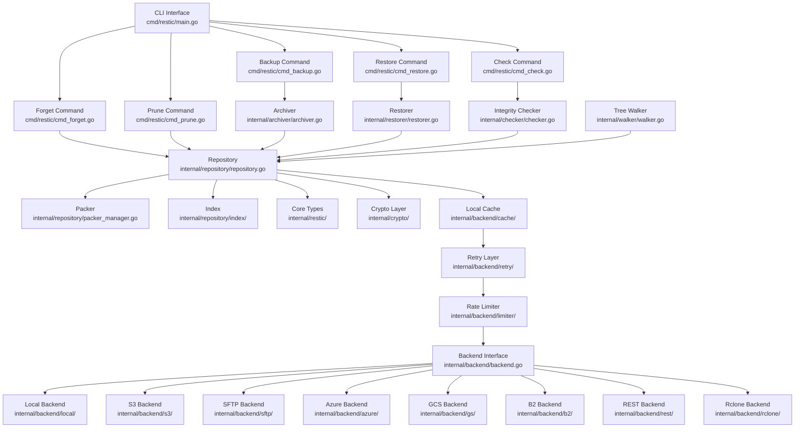
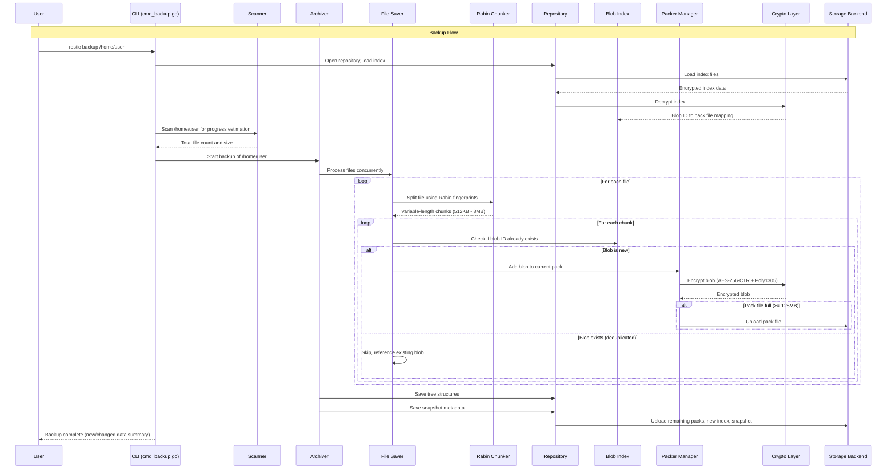
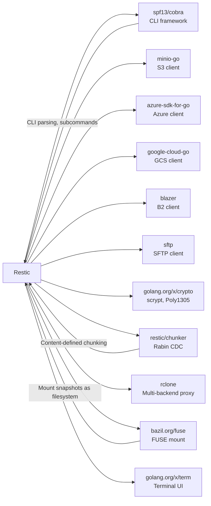

# Restic

> Fast, secure, and efficient backup program with content-addressable storage, encryption, and deduplication

| Metadata | |
|---|---|
| Repository | https://github.com/restic/restic |
| License | BSD 2-Clause "Simplified" License |
| Primary Language | Go |
| Category | CLI Tool |
| Analyzed Release | `v0.18.1` (2025-09-21) |
| Stars (approx.) | 32,000+ |
| Generated by | Claude Opus 4.6 (Anthropic) |
| Generated on | 2026-02-09 |

---

## Overview

### Problem Domain

Data backup is a critical but often neglected aspect of system administration. Traditional backup tools suffer from issues such as lack of encryption (exposing data to cloud storage providers), poor deduplication (wasting storage with redundant data), complex configuration, and slow incremental backups. Users need a backup solution that is secure by default, storage-efficient, and simple to use across various storage backends.

### Project Positioning

Restic is a modern backup program that addresses these challenges through a content-addressable storage model with built-in encryption, deduplication, and compression. Written in Go for cross-platform compatibility, restic supports a wide range of storage backends including local filesystem, SFTP, Amazon S3, Azure Blob Storage, Google Cloud Storage, Backblaze B2, and any REST-compatible server. Its architecture uses content-defined chunking (CDC) with Rabin fingerprints to split files into variable-length blobs, enabling efficient deduplication even when files are modified or bytes are inserted at arbitrary positions.

---

## Architecture Overview

---

## Core Components

### 1. Repository (internal/repository/)

Responsibility: Central abstraction for reading and writing backup data. Manages pack files, indexes, snapshots, locks, and keys. Handles encryption/decryption and coordinates between the archiver and backend.

Key files:
- `internal/repository/repository.go` - Main Repository struct and methods
- `internal/repository/packer_manager.go` - Manages packing blobs into pack files
- `internal/repository/index/` - In-memory and on-disk index management
- `internal/repository/key.go` - Master key derivation and management
- `internal/repository/repair.go` - Repository repair operations

Design patterns:
- Repository pattern: Encapsulates all data access behind a clean interface
- Content-addressable storage: Blobs are identified by SHA-256 hash of their content
- Builder pattern: PackerManager accumulates blobs and flushes complete pack files
- Index caching: In-memory index maps blob IDs to pack file locations

The Repository is the central coordinator of restic's data model. It translates high-level operations (save blob, load tree, find snapshot) into content-addressable storage operations. Each blob is identified by the SHA-256 hash of its plaintext content. The repository maintains an index mapping blob IDs to their physical location (pack file ID and offset), enabling efficient lookups without scanning all pack files.

### 2. Archiver (internal/archiver/)

Responsibility: Traverses the filesystem, splits files into chunks using content-defined chunking, deduplicates against the existing repository index, and saves new blobs and tree structures.

Key files:
- `internal/archiver/archiver.go` - Main backup orchestration
- `internal/archiver/file_saver.go` - Concurrent file reading and chunking
- `internal/archiver/tree_saver.go` - Directory tree serialization
- `internal/archiver/scanner.go` - Pre-scan for progress estimation
- `internal/archiver/exclude.go` - File exclusion pattern matching

Design patterns:
- Pipeline pattern: Scanner -> FileSaver -> TreeSaver -> Repository
- Worker pool: Multiple goroutines process files concurrently
- Content-defined chunking: Rabin fingerprints determine chunk boundaries
- Deduplication at save time: Check index before writing any blob

The Archiver implements the backup workflow. It first scans the source directory tree to estimate total size for progress reporting. Then it walks the tree, reading files and splitting them into variable-length blobs using a rolling Rabin fingerprint hash. The fingerprint creates chunk boundaries at content-dependent positions, meaning that insertions or deletions in a file only affect nearby chunks rather than shifting all subsequent chunk boundaries. Each blob is checked against the repository index; only new, unseen blobs are encrypted and written to pack files.

### 3. Backend Interface (internal/backend/)

Responsibility: Abstract storage interface supporting multiple cloud and local storage providers, with decorators for caching, retrying, rate limiting, and logging.

Key files:
- `internal/backend/backend.go` - Core Backend interface definition
- `internal/backend/local/local.go` - Local filesystem backend
- `internal/backend/s3/s3.go` - Amazon S3 / MinIO backend
- `internal/backend/sftp/sftp.go` - SFTP remote backend
- `internal/backend/azure/azure.go` - Azure Blob Storage backend
- `internal/backend/gs/gs.go` - Google Cloud Storage backend
- `internal/backend/b2/b2.go` - Backblaze B2 backend
- `internal/backend/rest/rest.go` - REST server backend
- `internal/backend/rclone/backend.go` - Rclone-based backend (supports 40+ providers)
- `internal/backend/cache/backend.go` - Local cache decorator
- `internal/backend/retry/backend_retry.go` - Automatic retry decorator
- `internal/backend/limiter/limiter_backend.go` - Bandwidth limiting decorator

Design patterns:
- Strategy pattern: Backend interface with multiple implementations
- Decorator pattern: Cache, retry, limiter, and semaphore backends wrap the actual storage backend
- Location registry: URL-based backend selection (s3:bucket/path, sftp:host:path)
- Factory pattern: Backend creation from URL strings via registry

The backend layer provides a clean abstraction over diverse storage systems. The Backend interface defines operations: Create, Load (with offset/length), Save, Stat, Remove, List. Each storage provider implements this interface. Decorators are stacked to add cross-cutting concerns: the cache decorator saves downloaded files locally for faster repeated access, the retry decorator handles transient network failures, and the limiter decorator enforces bandwidth constraints.

### 4. Crypto Layer (internal/crypto/)

Responsibility: Encryption, decryption, and authentication of all repository data using AES-256-CTR with Poly1305 MAC.

Key files:
- `internal/crypto/crypto.go` - Encryption/decryption primitives
- `internal/crypto/kdf.go` - Key derivation from password (scrypt)
- `internal/repository/key.go` - Master key management

Design patterns:
- Encrypt-then-MAC: Data is encrypted with AES-256-CTR, then authenticated with Poly1305
- Key derivation: scrypt with high parameters for password-based key derivation
- Per-blob nonce: Each encrypted blob uses a unique random nonce

All data stored in the repository (except key files' metadata) is encrypted. When a user initializes a repository, a master key is generated randomly. This master key is then encrypted with a key derived from the user's password using scrypt. Each blob is encrypted with AES-256 in CTR mode and authenticated with Poly1305. This provides both confidentiality and integrity, ensuring that neither storage providers nor attackers can read or tamper with backup data.

### 5. Core Types and Data Model (internal/restic/)

Responsibility: Defines the fundamental data types: Snapshot, Tree, Node, Blob, BlobHandle, ID, and FileType that form the logical structure of a backup repository.

Key files:
- `internal/restic/snapshot.go` - Snapshot metadata (timestamp, hostname, paths, tags)
- `internal/restic/tree.go` - Directory tree structure
- `internal/restic/node.go` - File/directory metadata (name, mode, mtime, ownership)
- `internal/restic/blob.go` - Blob type (data or tree) with ID
- `internal/restic/file.go` - File types in repository (data, key, snapshot, index, lock)
- `internal/restic/zeroprefix.go` - Zero-prefix counting for ID ordering

Design patterns:
- Content-addressable data model: Every object (blob, tree, snapshot) is identified by SHA-256
- Merkle tree: Trees reference child trees and data blobs by hash, forming an immutable DAG
- Value objects: ID, BlobHandle, and FileType are immutable value types

The data model forms an immutable Merkle tree structure. A Snapshot points to a root Tree object. Each Tree contains Node entries representing files and directories. File nodes reference a list of data blob IDs (the chunks of file content). Directory nodes reference child Tree objects. Since everything is identified by content hash, identical files or directory subtrees are automatically shared across snapshots, providing natural deduplication at the structural level.

---

## Data Flow

---

## Key Design Decisions

### 1. Content-Defined Chunking Over Fixed-Size Blocks

Choice: Use Rabin fingerprint-based content-defined chunking (CDC) to split files into variable-length blobs rather than fixed-size blocks.

Rationale: CDC ensures that chunk boundaries are determined by file content rather than position. When bytes are inserted or deleted in the middle of a file, only the affected chunks change; subsequent chunks maintain the same boundaries. This dramatically improves deduplication efficiency compared to fixed-size blocking, where an insertion shifts all subsequent block boundaries.

Trade-offs: CDC is computationally more expensive than fixed-size splitting due to the rolling hash computation. Variable chunk sizes make pack file layout less predictable. The target chunk size of 1MB with a range of 512KB-8MB provides a good balance between deduplication granularity and metadata overhead.

### 2. Encrypt Everything by Default

Choice: Encrypt all repository data (blobs, trees, indexes, snapshots) with AES-256-CTR and authenticate with Poly1305, using scrypt for key derivation from passwords.

Rationale: Backups are frequently stored on third-party infrastructure (cloud storage, remote servers). Encryption by default ensures data confidentiality without requiring users to set up separate encryption layers. The encrypt-then-MAC approach provides both confidentiality and integrity.

Trade-offs: Encryption adds CPU overhead to every backup and restore operation. Server-side deduplication is impossible since the storage provider cannot read blob contents. Password loss means permanent data loss (no recovery mechanism by design).

### 3. Content-Addressable Storage with Immutable Objects

Choice: Identify all objects by SHA-256 hash of their content, making the repository an immutable content-addressable store.

Rationale: Content addressing provides automatic deduplication: identical content always produces the same hash, so it is stored only once. Immutability simplifies reasoning about data integrity and enables safe concurrent access. The Merkle tree structure allows efficient comparison of directory trees by comparing root hashes.

Trade-offs: Renaming or moving a file without changing its content does not require re-storing the data (efficient), but changing even one byte in a file produces a completely different blob ID (handled by CDC producing only local changes). Garbage collection (prune) is needed to reclaim space from unreferenced blobs.

### 4. Backend Abstraction with Decorator Stack

Choice: Define a minimal Backend interface (Create, Load, Save, Stat, Remove, List) and compose functionality through decorators.

Rationale: The simple interface makes it straightforward to add new storage backends. Decorators cleanly separate cross-cutting concerns (caching, retrying, rate limiting) from storage-specific logic. Each decorator can be tested independently.

Trade-offs: Deep decorator stacks can make debugging difficult (errors must propagate through multiple layers). The minimal interface may not expose backend-specific optimizations (e.g., S3 multipart upload is handled within the S3 backend rather than through the interface).

### 5. Go Language for Cross-Platform Single Binary

Choice: Implement restic in Go, producing statically-linked binaries for all major platforms.

Rationale: Go's cross-compilation, static linking, and goroutine-based concurrency model align perfectly with restic's needs. A single binary with no runtime dependencies simplifies deployment. Goroutines enable concurrent file processing and network I/O without callback complexity.

Trade-offs: Go's garbage collector can cause latency spikes during large backup operations. CGo dependencies (for some backends) complicate cross-compilation. Memory usage is higher than C/Rust equivalents due to Go's runtime overhead.

---

## Dependencies

---

## Testing Strategy

Restic has a comprehensive testing approach:

- Unit Tests: Each internal package contains `_test.go` files testing individual functions and types. Core packages like `internal/repository`, `internal/archiver`, `internal/crypto`, and `internal/checker` have extensive unit test coverage.

- Integration Tests: Files ending in `_integration_test.go` (e.g., `cmd_backup_integration_test.go`, `cmd_restore_integration_test.go`) test complete command workflows with real repository operations. These tests create temporary repositories, perform backups, and verify restore correctness.

- Backend Test Suite: `internal/backend/test/suite.go` defines a reusable test suite that every backend implementation must pass, ensuring consistent behavior across storage providers.

- Test Fixtures: The `cmd/restic/testdata/` directory contains pre-built repository archives (`.tar.gz`) for testing edge cases like missing indexes, duplicate blobs, and corrupted data.

- CI Pipeline: GitHub Actions (`tests.yml`) runs the full test suite on Linux, macOS, and Windows. Backend integration tests run against real cloud storage services.

- Fuzzing: Critical parsing code is tested with Go's built-in fuzzing framework to catch edge cases in data format handling.

---

## Key Takeaways

1. Content-defined chunking is the foundation of efficient deduplication: Rabin fingerprint-based chunking ensures that local file modifications only affect nearby chunks, enabling restic to store only truly new data in subsequent backups. This approach works even when bytes are inserted or deleted at arbitrary positions.

2. Defense-in-depth security makes cloud backup trustworthy: By encrypting and authenticating every piece of data before it leaves the local machine, restic ensures that storage backends are untrusted by design. Users can safely store backups on any cloud provider without worrying about data exposure.

3. Backend abstraction with decorators creates a composable storage layer: The minimal Backend interface combined with decorator patterns for caching, retrying, and rate limiting creates a flexible architecture where new storage providers can be added without modifying core backup logic.

4. Immutable content-addressable storage simplifies correctness reasoning: Since objects are identified by their content hash and never modified after creation, many classes of data corruption and race conditions are eliminated by design. The Merkle tree structure provides built-in integrity verification.

---

## References

- Restic GitHub Repository: https://github.com/restic/restic
- Restic Design Document: https://github.com/restic/restic/blob/master/doc/design.rst
- Restic Documentation: https://restic.readthedocs.io/en/stable/
- Restic Design (v0.2): https://restic.readthedocs.io/en/v0.2.0/Design/
- Restic Official Website: https://restic.net/
