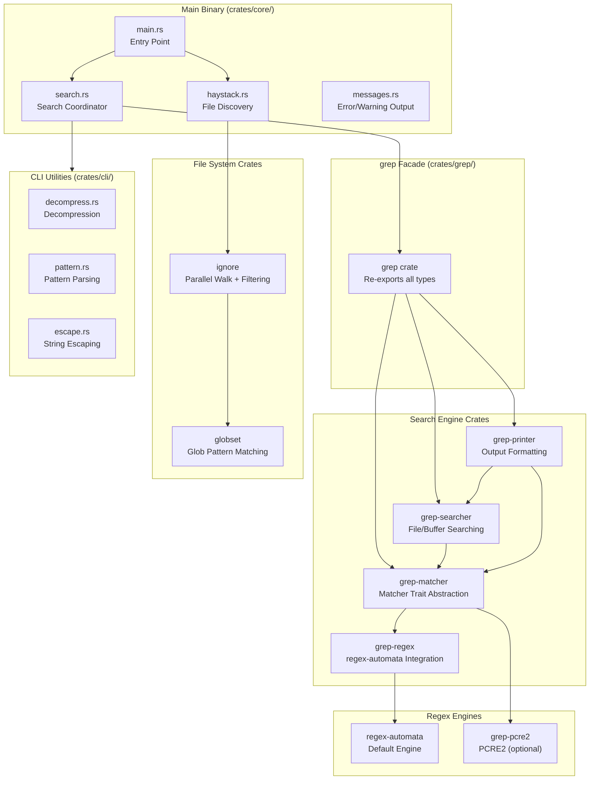
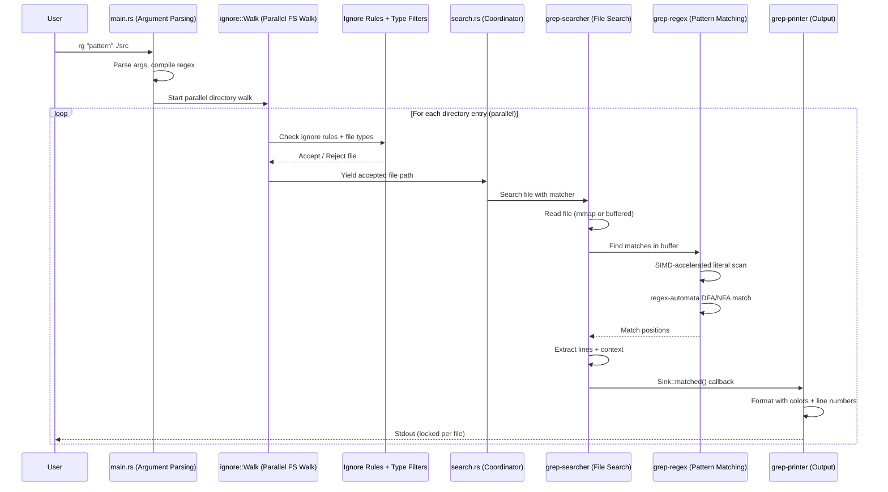
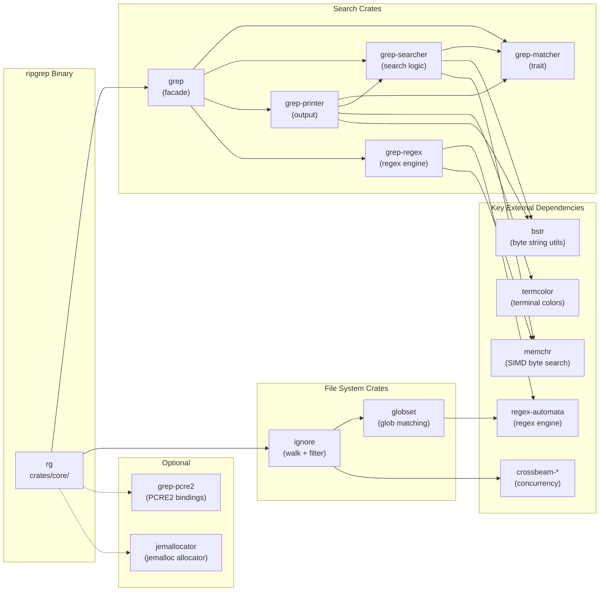

# ripgrep

> ripgrep recursively searches directories for a regex pattern while respecting your gitignore

| Metadata | |
|---|---|
| Repository | https://github.com/BurntSushi/ripgrep |
| License | Unlicense / MIT |
| Primary Language | Rust |
| Category | CLI Tool |
| Analyzed Release | `15.1.0` (2025-10-22) |
| Stars (approx.) | 59,000+ |
| Generated by | Claude Opus 4.6 (Anthropic) |
| Generated on | 2026-02-09 |

## Overview

ripgrep (rg) is a line-oriented search tool that recursively searches directories for regex patterns. It combines the functionality of grep, ag (The Silver Searcher), and ack while offering significantly better performance through SIMD-accelerated string matching, memory-mapped file I/O, and intelligent file filtering. ripgrep respects .gitignore rules by default, automatically skips binary files, and supports over 150 predefined file type filters.

Problems it solves:

- Traditional grep is slow on large codebases because it does not skip irrelevant files (build artifacts, vendor directories, binary files) and lacks optimized search strategies
- Existing search tools (ag, ack) provide ignore-file support but do not match ripgrep's search performance, especially for large repositories or patterns with literal components
- Developers need a fast, ergonomic search tool that integrates with version control (respecting .gitignore), supports modern regex syntax, and provides configurable output formatting
- Search across large monorepos requires parallel directory traversal and file searching, which single-threaded tools cannot provide

Positioning:

ripgrep is widely regarded as the fastest general-purpose search tool available. It outperforms GNU grep, ag, ack, git grep, and ucg in most benchmarks due to its combination of optimized regex engine (regex-automata), SIMD-accelerated literal searching (memchr crate), parallel directory traversal, and intelligent file skipping. ripgrep is the default search backend for Visual Studio Code, integrated into many editors and IDEs. While GNU grep remains the POSIX standard and ag has a strong user base, ripgrep has become the recommended choice for developers working with large codebases.

## Architecture Overview

ripgrep is organized as a Rust workspace with a main binary crate and multiple library crates following a facade pattern. The top-level `grep` crate serves as a facade that re-exports types from specialized sub-crates: `grep-matcher` (trait abstraction), `grep-regex` (regex engine integration), `grep-searcher` (file searching), and `grep-printer` (output formatting). Supporting crates include `globset` (glob pattern matching), `ignore` (file filtering and parallel directory walking), and `cli` (CLI utilities). The main binary in `crates/core/` ties everything together by parsing arguments, constructing the search pipeline, and coordinating parallel execution.

## Core Components

### Search Coordinator (`crates/core/search.rs`)

- Responsibility: Orchestrates the complete search pipeline from file discovery through pattern matching to output formatting
- Key files: `crates/core/search.rs`, `crates/core/main.rs`, `crates/core/haystack.rs`
- Design patterns: Pipeline pattern, Strategy pattern (search mode selection), Parallel execution via thread pool

The search coordinator ties together all the library crates into a working search tool. `main.rs` parses command-line arguments using a custom argument parser and configures the search based on user options. `search.rs` creates the appropriate `Searcher` and `Printer` based on the search mode (standard text output, JSON, count-only, files-with-matches). `haystack.rs` manages file discovery by configuring the `ignore` crate's parallel walker with the appropriate ignore rules, file type filters, and symlink policies. When searching a directory, ripgrep walks files in parallel across multiple threads, with each thread independently searching its assigned files. The results are written to stdout with a lock held per file to prevent interleaved output.

### Matcher Abstraction (`crates/matcher/`)

- Responsibility: Defines the `Matcher` trait that abstracts over different regex engine implementations
- Key files: `crates/matcher/src/lib.rs`, `crates/matcher/src/interpolate.rs`
- Design patterns: Trait-based polymorphism (Strategy pattern), Zero-cost abstraction

The `Matcher` trait is the key architectural abstraction in ripgrep. It defines a common interface for regex matching operations (find, find_at, captures, replacement) that is independent of any specific regex engine. This allows ripgrep's search and printing infrastructure to work with any engine that implements the trait. Currently, two implementations exist: `grep-regex` (using the Rust `regex-automata` crate for the default fast engine) and `grep-pcre2` (using the PCRE2 library for features like lookahead/lookbehind). The trait includes methods for reporting whether the matcher matches only at line boundaries, which enables the searcher to select optimized code paths.

### Searcher (`crates/searcher/`)

- Responsibility: Implements the core file-searching logic, handling line-oriented search, binary detection, memory mapping, and context lines
- Key files: `crates/searcher/src/searcher/mod.rs`, `crates/searcher/src/searcher/core.rs`, `crates/searcher/src/searcher/glue.rs`, `crates/searcher/src/searcher/mmap.rs`, `crates/searcher/src/line_buffer.rs`, `crates/searcher/src/sink.rs`
- Design patterns: Sink pattern (callback-based result consumption), Buffer management (rolling line buffer), Strategy pattern (mmap vs. read)

The searcher reads files and runs the matcher against their contents, reporting matches through a `Sink` trait. It handles two reading strategies: buffered reading (reading chunks into a line buffer that rolls forward) and memory-mapped I/O (mapping the entire file for zero-copy searching). The core search loop in `core.rs` processes a file by: finding match positions using the matcher, extracting line boundaries around matches, tracking context lines (before/after), and reporting results to the sink. Binary file detection is integrated into the search loop, checking for null bytes in the searched content and either skipping the file or stripping binary portions depending on configuration. The `glue.rs` module adapts between the different reading strategies and the core search logic.

### Printer (`crates/printer/`)

- Responsibility: Formats search results for output in various formats (standard text, JSON, summary)
- Key files: `crates/printer/src/standard.rs`, `crates/printer/src/json.rs`, `crates/printer/src/summary.rs`, `crates/printer/src/color.rs`
- Design patterns: Visitor pattern (implementing the Sink trait), Builder pattern (configuring output format), Decorator pattern (adding color/hyperlinks)

The printer implements the `Sink` trait from the searcher, receiving match events and formatting them for output. The `StandardSink` produces the familiar grep-style output with filenames, line numbers, and colored matches. The `JSONSink` produces structured JSON output suitable for machine consumption by editors and IDEs (this is the format used by VS Code's search integration). The `SummarySink` produces counts or file lists for aggregate modes. Color handling supports both ANSI terminal colors and Windows console API colors. The hyperlink feature generates OSC 8 escape sequences for clickable file paths in supported terminals.

### Ignore / File Walker (`crates/ignore/`)

- Responsibility: Provides parallel recursive directory walking with gitignore-compatible file filtering
- Key files: `crates/ignore/src/walk.rs`, `crates/ignore/src/gitignore.rs`, `crates/ignore/src/dir.rs`, `crates/ignore/src/types.rs`, `crates/ignore/src/overrides.rs`
- Design patterns: Iterator pattern (parallel walk), Builder pattern (filter configuration), Chain of responsibility (layered ignore rules)

The `ignore` crate is a standalone library for recursively walking directories while respecting multiple layers of ignore rules. It processes `.gitignore`, `.ignore`, `.rgignore`, and global gitignore files, applying them in the correct precedence order. The parallel walker (`walk.rs`) uses a work-stealing thread pool to traverse the directory tree across multiple threads, significantly improving performance on SSDs and large directory trees. File type filtering (`types.rs`) supports over 150 predefined file types (e.g., `--type rust` matches `*.rs` files) and custom type definitions. The override system (`overrides.rs`) allows CLI-specified glob patterns to take highest precedence over all other filtering rules.

## Data Flow

### Searching a Directory for a Pattern

## Key Design Decisions

### 1. Trait-Based Regex Engine Abstraction

- Choice: Define a `Matcher` trait that allows swapping between regex engines (regex-automata, PCRE2) without changing search or printing code
- Rationale: Different regex engines have different strengths. The default Rust regex engine is fast and guarantees linear-time matching but lacks features like lookahead. PCRE2 supports the full Perl regex syntax but is slower. The abstraction allows users to choose the appropriate engine with a flag (`--pcre2`).
- Trade-offs: The trait abstraction adds a layer of indirection. Dynamic dispatch through the trait could theoretically reduce performance, but the cost is negligible compared to I/O and search time. The trait must expose a common denominator API that may not expose engine-specific features.

### 2. Parallel Directory Walking with Work Stealing

- Choice: Walk the directory tree in parallel using multiple threads with a work-stealing scheduler
- Rationale: On modern SSDs and NVMe drives, the file system can deliver data faster than a single thread can process it. Parallel walking saturates the I/O bandwidth and hides the latency of stat() and readdir() system calls.
- Trade-offs: Output ordering becomes non-deterministic by default (can be forced with `--sort`). The thread pool adds memory overhead. On spinning disks, parallel access may actually degrade performance due to seek thrashing, though ripgrep defaults to a sensible thread count.

### 3. SIMD-Accelerated Literal Optimization

- Choice: Extract literal strings from regex patterns and use SIMD instructions (via the `memchr` crate) to quickly scan for candidates before running the full regex
- Rationale: Most search patterns contain literal substrings. SIMD-accelerated byte scanning (using SSE2, AVX2, or NEON instructions) can process 16-32 bytes per cycle, vastly faster than character-by-character regex evaluation. By first finding positions where literal substrings occur, the full regex engine only needs to run at those positions.
- Trade-offs: Literal extraction adds complexity to the regex compilation pipeline. Not all patterns have extractable literals (e.g., `.*`). The optimization is most effective for patterns with rare literal components; patterns matching very frequently may not benefit.

### 4. Gitignore Compatibility by Default

- Choice: Respect `.gitignore` files by default, automatically skipping files that version control ignores
- Rationale: In the common case of searching a project directory, developers do not want to search build artifacts, `node_modules`, `.git` directories, or other generated files. Respecting gitignore eliminates the most common source of slow, noisy searches without requiring manual configuration.
- Trade-offs: Users searching outside of git repositories or wanting to search ignored files must explicitly opt out (`--no-ignore`). The gitignore parsing adds startup overhead (though typically negligible). Complex gitignore rules with many negation patterns can be slow to evaluate.

### 5. Workspace Crate Architecture

- Choice: Organize the project as a Rust workspace with many small, focused crates rather than a single monolithic crate
- Rationale: Each crate has a clear, single responsibility and can be versioned, documented, and published independently. The `ignore` crate, `globset` crate, and `grep` crate family are used by other projects beyond ripgrep. This modularity also enables clearer API boundaries and faster incremental compilation.
- Trade-offs: Managing dependencies and version coordination across multiple crates adds overhead. Changes that span multiple crates require coordinated releases. New contributors must understand the crate layout to know where to make changes.

## Dependencies

## Testing Strategy

ripgrep has a thorough testing strategy that covers individual crates and end-to-end behavior.

Unit tests: Each crate contains inline unit tests using Rust's built-in `#[test]` framework. The `crates/searcher/src/testutil.rs` provides testing utilities for the search crate. The `globset` and `ignore` crates have extensive tests for edge cases in glob matching and gitignore rule parsing. The regex crate tests verify pattern compilation, literal extraction, and matching behavior.

Integration tests: The `tests/` directory at the workspace root contains comprehensive end-to-end tests organized by feature area: `tests/feature.rs` (feature flags), `tests/regression.rs` (regression tests for reported bugs), `tests/binary.rs` (binary file handling), `tests/json.rs` (JSON output format), `tests/multiline.rs` (multiline matching). The `tests/hay.rs` module provides test fixtures. The `tests/macros.rs` module provides assertion macros for comparing ripgrep output against expected results.

CI/CD: ripgrep uses GitHub Actions (`.github/`) for CI, testing across Linux, macOS, and Windows on multiple Rust toolchain versions (stable, beta, nightly). The CI pipeline runs `cargo test` for all workspace members, `cargo clippy` for lint checks, and `cargo fmt` for formatting verification. Cross-compilation targets are also tested. The `benchsuite/` directory contains benchmarks for comparing ripgrep's performance against other search tools.

## Key Takeaways

1. Trait-based abstraction for swappable engines: ripgrep's `Matcher` trait demonstrates how to design a search system that is engine-agnostic. By defining a minimal trait interface, the search infrastructure and output formatting work identically regardless of whether the underlying engine is a DFA, NFA, or PCRE2. This pattern is broadly applicable to any system that needs pluggable algorithmic backends.

2. SIMD as a practical optimization strategy: ripgrep's use of SIMD-accelerated literal scanning (via the `memchr` crate) shows that extracting literal substrings from patterns and scanning for them with vectorized instructions is one of the highest-impact optimizations for text search. The `memchr` crate itself has become a widely used dependency across the Rust ecosystem.

3. Workspace crate architecture for reusable libraries: By publishing its internal components as standalone crates (`ignore`, `globset`, `grep-searcher`), ripgrep turns implementation details into reusable libraries. The `ignore` crate is used by dozens of other projects that need gitignore-compatible file walking. This approach maximizes the value extracted from the engineering investment.

4. Sensible defaults reduce configuration burden: ripgrep's decision to respect .gitignore by default, skip binary files, and use smart-case matching means that the common case (searching a project for a pattern) requires zero configuration. This design philosophy of "do what the user probably wants" is a key factor in its adoption.

## References

- [ripgrep GitHub Repository](https://github.com/BurntSushi/ripgrep)
- [ripgrep User Guide (GUIDE.md)](https://github.com/BurntSushi/ripgrep/blob/master/GUIDE.md)
- [ripgrep FAQ](https://github.com/BurntSushi/ripgrep/blob/master/FAQ.md)
- [ripgrep DeepWiki](https://deepwiki.com/BurntSushi/ripgrep)
- [Andrew Gallant's Blog (BurntSushi)](https://burntsushi.net/)
- [regex-automata Crate](https://docs.rs/regex-automata)
- [ignore Crate Documentation](https://docs.rs/ignore)
