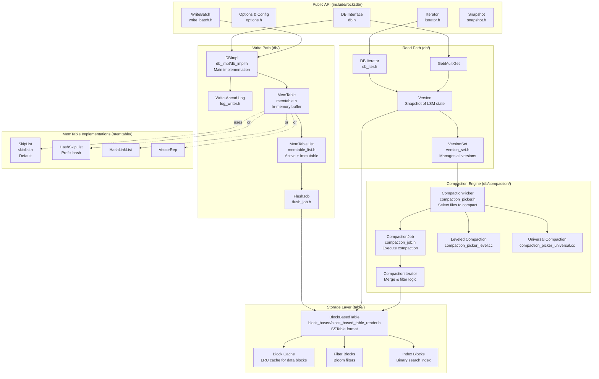
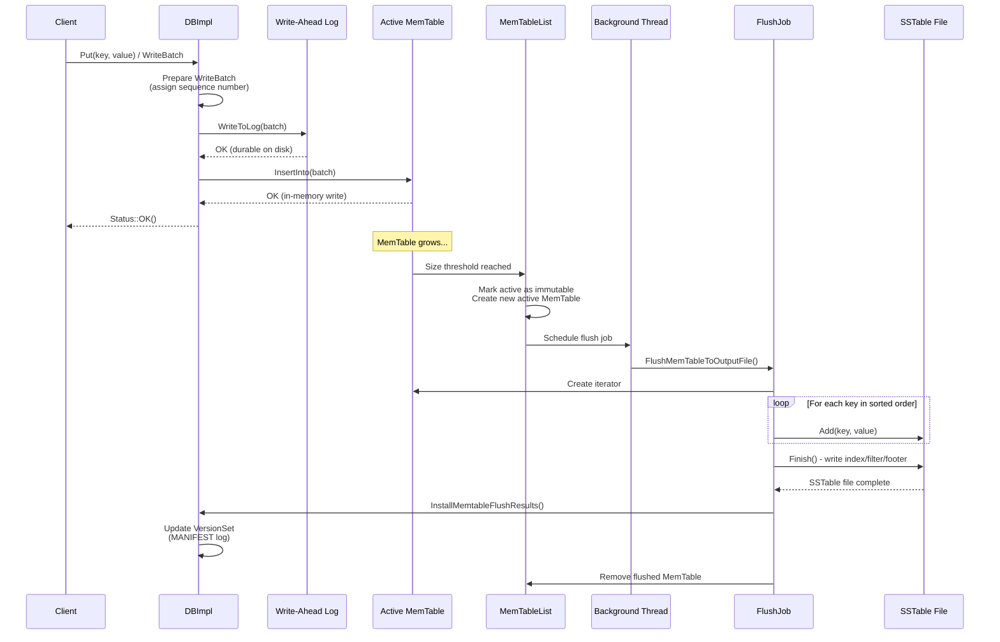
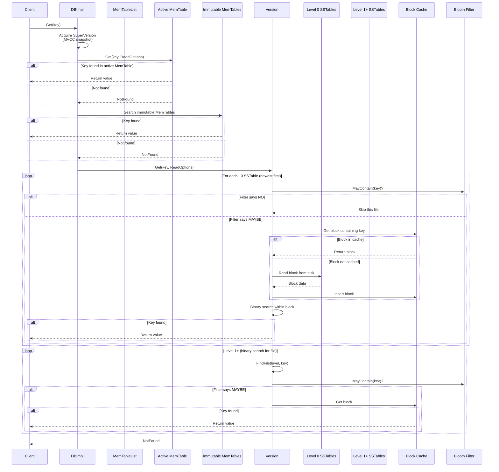
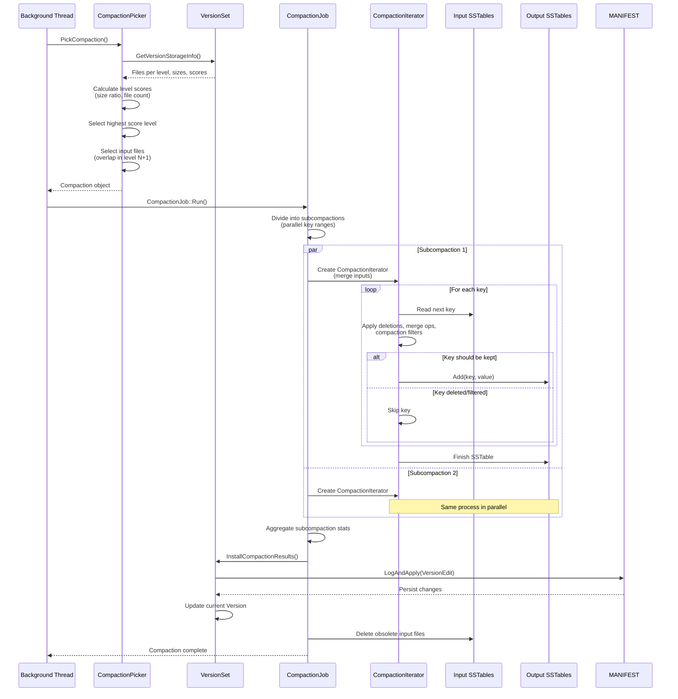
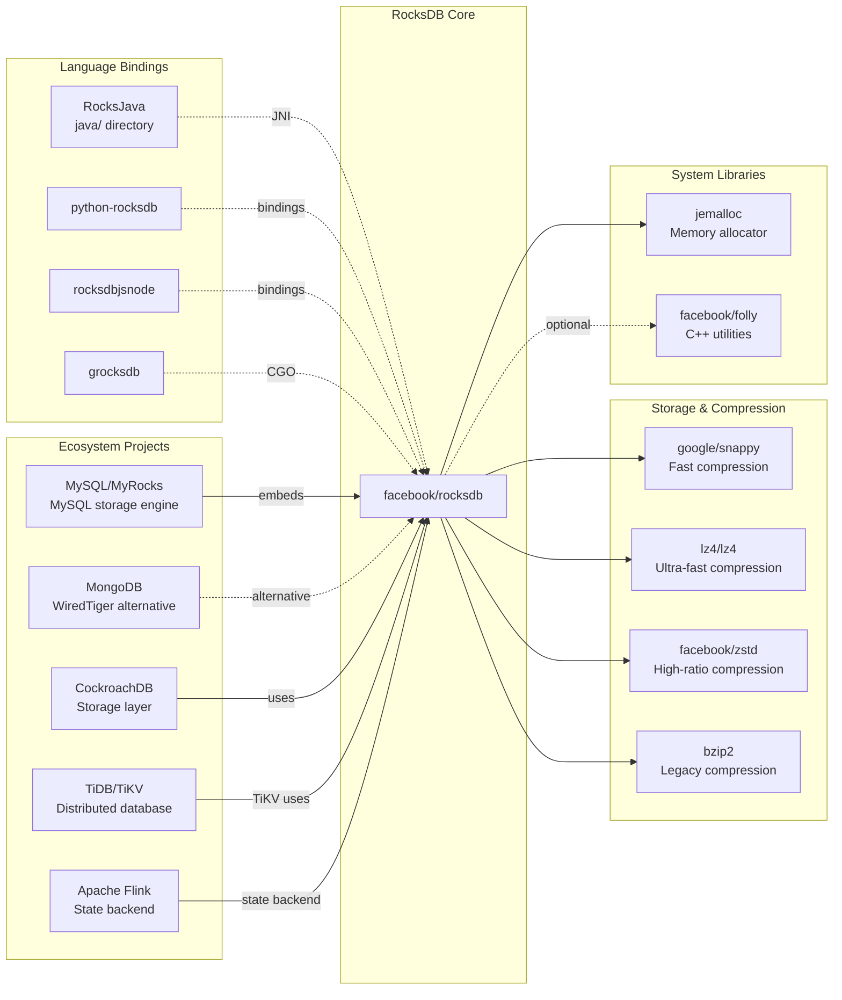

# RocksDB

> A library that provides an embeddable, persistent key-value store for fast storage

| Metadata | |
|---|---|
| Repository | https://github.com/facebook/rocksdb |
| License | GNU General Public License v2.0 / Apache 2.0 (dual-licensed) |
| Primary Language | C++ |
| Category | Database |
| Analyzed Release | `v10.10.1` (2026-02-02) |
| Stars (approx.) | 31,521 |
| Generated by | Claude Sonnet 4.5 (Anthropic) |
| Generated on | 2026-02-08 |

## Overview

RocksDB is a high-performance embedded key-value database library developed and maintained by Facebook Database Engineering Team, built on Google's LevelDB. It is optimized for fast storage, particularly on flash drives and SSDs, implementing a Log-Structured-Merge-Database (LSM) design with flexible tradeoffs between Write-Amplification-Factor (WAF), Read-Amplification-Factor (RAF), and Space-Amplification-Factor (SAF).

Problems it solves:

- High-throughput, low-latency storage for multi-terabyte databases on a single machine
- Efficient storage engine for SSD/flash-optimized workloads with multithreaded compaction
- Flexible tuning options for balancing read, write, and space amplification
- Embedded database needs without external process dependencies

Positioning:

RocksDB is widely adopted as the storage engine for major distributed systems including MySQL (MyRocks), MongoDB, CockroachDB, TiDB, Apache Flink, and Apache Kafka Streams. It represents the production-hardened evolution of LevelDB with extensive Facebook-scale optimizations, supporting workloads from embedded mobile databases to petabyte-scale data infrastructure.

## Architecture Overview

RocksDB follows a layered LSM-tree architecture where writes flow through an in-memory MemTable before being flushed to immutable SSTable files on disk, organized into multiple levels. Background compaction processes continuously merge and reorganize SSTables to maintain read performance and reclaim space.

## Core Components

### DBImpl (`db/db_impl/db_impl.h`)

- Responsibility: Core database implementation serving as the entry point for all database operations
- Key files: `db/db_impl/db_impl.h`, `db/db_impl/db_impl_write.cc`, `db/db_impl/db_impl_compaction_flush.cc`
- Design patterns: Facade pattern, Template Method pattern

DBImpl is the concrete implementation of the DB interface, orchestrating all database operations including writes, reads, flushes, and compactions. It maintains critical state including the VersionSet (LSM tree structure), MemTable list, WAL writer, and background job scheduler. The implementation is split across multiple files: db_impl.cc for initialization and core logic, db_impl_write.cc for write path, db_impl_open.cc for database recovery, and db_impl_compaction_flush.cc for background operations. DBImpl uses a complex locking strategy with multiple mutexes to enable high concurrency while maintaining consistency.

### MemTable (`db/memtable.h`)

- Responsibility: In-memory data structure buffering writes before flushing to disk
- Key files: `db/memtable.h`, `memtable/skiplist.h`, `memtable/inlineskiplist.h`
- Design patterns: Strategy pattern (pluggable MemTableRep), Copy-on-write

MemTable is the first write destination in RocksDB, implemented as a concurrent skip list by default. It supports lock-free concurrent reads and writes using atomic operations and memory barriers. Once a MemTable reaches its size threshold, it becomes immutable and a new active MemTable is allocated. The MemTable abstraction allows different implementations via the MemTableRep interface, including HashSkipList for prefix-based workloads and VectorRep for bulk loading. MemTables are reference-counted and include a Bloom filter to accelerate negative lookups during reads.

### VersionSet and Version (`db/version_set.h`)

- Responsibility: Managing the complete history of LSM tree states and coordinating access to different versions
- Key files: `db/version_set.h`, `db/version_edit.h`, `db/version_builder.h`
- Design patterns: Memento pattern, Multi-Version Concurrency Control (MVCC)

VersionSet maintains the current state of the LSM tree and all historical versions still in use by active iterators or snapshots. Each Version represents an immutable snapshot of the LSM tree structure, containing references to all SSTable files at each level. Version changes are expressed as VersionEdit objects (delta changes) persisted to the MANIFEST file. The VersionSet uses reference counting to keep Versions alive while they are in use, enabling lock-free reads. This design allows long-running iterators to access a consistent view of the database without blocking writes or compactions.

### CompactionJob (`db/compaction/compaction_job.h`)

- Responsibility: Executing the actual compaction process to merge and reorganize SSTable files
- Key files: `db/compaction/compaction_job.h`, `db/compaction/compaction_iterator.h`, `db/compaction/subcompaction_state.h`
- Design patterns: Job pattern, Parallel decomposition

CompactionJob handles the execution of a single compaction operation, which may be divided into multiple subcompactions running in parallel. The job reads input SSTable files, merges overlapping key ranges, applies deletion tombstones, invokes compaction filters, and writes output SSTables. CompactionIterator implements the core merge logic, handling complex scenarios like merging multiple values for the same key, applying merge operators, and filtering deleted keys. The job tracks detailed statistics including bytes read/written, keys processed, and time spent in various phases, which are aggregated and reported to monitoring systems.

### BlockBasedTable (`table/block_based/block_based_table_reader.h`)

- Responsibility: Reading and writing SSTable files in RocksDB's default block-based format
- Key files: `table/block_based/block_based_table_reader.h`, `table/block_based/block_based_table_builder.h`, `table/block_based/block.h`
- Design patterns: Builder pattern, Iterator pattern, Template Method

BlockBasedTable is the default SSTable format, organizing data into fixed-size blocks (typically 4KB-64KB) for efficient compression and caching. Each SSTable contains data blocks (sorted key-value pairs), index blocks (binary searchable index), filter blocks (Bloom filters), and metadata blocks. The format supports various optimizations including prefix Bloom filters, partitioned indexes for large files, and compression dictionaries. The reader uses a two-level iterator: the first level iterates over index blocks, and the second level iterates within data blocks. Block cache integration allows frequently accessed blocks to remain in memory across queries.

### CompactionPicker (`db/compaction/compaction_picker.h`)

- Responsibility: Selecting which files to compact based on the chosen compaction strategy
- Key files: `db/compaction/compaction_picker.h`, `db/compaction/compaction_picker_level.cc`, `db/compaction/compaction_picker_universal.cc`
- Design patterns: Strategy pattern, Factory pattern

CompactionPicker implements the logic for choosing compaction candidates across different strategies. The leveled compaction strategy (default) maintains size ratios between levels and picks files with the highest score (size ratio violation). Universal compaction optimizes for write-heavy workloads by allowing more flexible merging patterns. FIFO compaction simply deletes the oldest files when space is exceeded. The picker considers factors including file size, number of seeks, file age, and tombstone density. It also handles special cases like intra-L0 compaction and trivial moves (file relocation without rewriting data).

## Data Flow

### Write Path: From WriteBatch to SSTable

### Read Path: Point Lookup

### Compaction Flow: Leveled Compaction

## Key Design Decisions

### 1. LSM-Tree with Leveled Organization

- Choice: Using a Log-Structured Merge-tree with multiple levels (L0-L6) and size amplification factor of 10x between levels
- Rationale: Optimizes for write-heavy workloads by converting random writes into sequential writes. Levels provide predictable space amplification (10x) while maintaining reasonable read performance through Bloom filters and caching. L0 is special (overlapping files) to absorb write bursts, while L1+ has non-overlapping files for efficient binary search
- Trade-offs: Higher write amplification due to compaction (same data rewritten multiple times). Read amplification when keys span multiple levels. Complex compaction scheduling to balance foreground write performance and background resource usage

### 2. Multi-Threaded Compaction with Subcompactions

- Choice: Dividing large compactions into multiple subcompactions executing in parallel across key ranges
- Rationale: Modern servers have many CPU cores, but single-threaded compaction becomes a bottleneck, especially for large databases. Subcompactions divide the input key range into equal chunks and process them independently, scaling compaction throughput linearly with core count
- Trade-offs: Increased complexity in managing parallel file outputs and aggregating statistics. Coordination overhead for very small compactions. Higher memory usage due to multiple output buffers

### 3. Pluggable MemTable Representations

- Choice: Abstract MemTable implementation behind the MemTableRep interface, supporting SkipList, HashSkipList, HashLinkList, and VectorRep
- Rationale: Different workloads benefit from different data structures. SkipList provides good general-purpose performance. HashSkipList optimizes prefix-based access patterns. VectorRep is ideal for bulk loading. Pluggability enables workload-specific tuning without changing core RocksDB code
- Trade-offs: Interface abstraction adds indirection overhead. Not all MemTableRep implementations support all features (e.g., concurrent writes). Increased testing complexity to ensure correctness across implementations

### 4. Block Cache with LRU Eviction

- Choice: Shared LRU cache for data blocks, index blocks, and filter blocks across all column families
- Rationale: Blocks are the natural caching granularity for SSTable reads, balancing memory overhead and hit rate. Shared cache enables dynamic allocation across hot column families. LRU eviction provides reasonable hit rates without complex algorithms. Cache sharding (16-64 shards) reduces lock contention on multi-core systems
- Trade-offs: LRU can be suboptimal for scan-heavy workloads (cache pollution). Shared cache requires careful tuning to avoid thrashing. Memory overhead for cache metadata (hash table, LRU list pointers)

### 5. Column Families for Multi-Tenant Isolation

- Choice: Supporting multiple independent LSM trees (column families) within a single database instance
- Rationale: Enables logical separation of different data types or tenants while sharing infrastructure (block cache, compaction threads, file system). Each column family can have independent configuration (compaction style, memtable size, compression). Atomic writes across column families via WriteBatch
- Trade-offs: Increased implementation complexity for managing multiple LSM states. MANIFEST file and VersionSet become more complex. Compaction scheduling must balance fairness across column families

### 6. Write-Ahead Log (WAL) for Durability

- Choice: All writes are first appended to a sequential log file before inserting into MemTable
- Rationale: Provides durability guarantees even if the process crashes before MemTable flush. Sequential writes to WAL are much faster than random writes to SSTable files. WAL enables fast recovery by replaying recent writes
- Trade-offs: Write amplification (data written twice: WAL + eventual SSTable). WAL sync latency can dominate for small write batches (mitigated by group commit). Disk space overhead until MemTable flush completes

## Dependencies

## Testing Strategy

RocksDB employs comprehensive testing at multiple levels to ensure correctness and performance.

Unit tests: Extensive use of Google Test framework with tests colocated in source directories (e.g., db_test.cc, compaction_job_test.cc). Tests cover normal operation, edge cases, error injection, and concurrency scenarios. Mock implementations (MockEnv, MockFileSystem) enable deterministic testing of I/O and timing-dependent code.

Integration tests: db_stress_tool applies random operations with various configurations and crash injection to detect race conditions and data corruption. Multi-threaded tests validate concurrent access patterns. Compatibility tests ensure upgrade/downgrade paths between versions.

Performance testing: Extensive benchmarking infrastructure (db_bench) measures throughput, latency, and resource usage across diverse workloads. Continuous performance monitoring detects regressions. Microbenchmarks validate optimization assumptions.

CI/CD: CircleCI runs on every commit, executing unit tests across multiple platforms (Linux, macOS, Windows), sanitizers (ASAN, TSAN, UBSAN), and build configurations. Nightly jobs run extended stress tests and compatibility checks. Release process includes extensive validation before tagging.

## Key Takeaways

1. LSM-tree design for write optimization: The multi-level LSM-tree architecture demonstrates how to transform random write workloads into sequential I/O, achieving 10-100x write throughput improvements on SSDs. The tradeoff is increased read and space amplification, mitigated through Bloom filters, caching, and tunable compaction strategies. This pattern is applicable to any write-heavy storage system.

2. MVCC through immutable data structures: RocksDB's Version and VersionSet design shows how to implement multi-version concurrency control without locking on read paths. Immutable versions combined with reference counting enable lock-free reads while allowing concurrent writes and compactions. This pattern scales to high-concurrency scenarios without read-write contention.

3. Parallel decomposition of I/O-bound tasks: Subcompaction demonstrates how to parallelize traditionally sequential operations by partitioning data along key ranges. This approach is broadly applicable to any system processing ordered data, enabling linear scalability with CPU cores even for I/O-heavy workloads.

4. Pluggable components via interface abstraction: The MemTableRep, Comparator, MergeOperator, and CompactionFilter interfaces show how to make core components swappable without sacrificing performance. This enables workload-specific optimizations while maintaining a common codebase. The pattern is essential for building adaptable infrastructure software.

5. Write-ahead logging for durability: RocksDB's WAL implementation demonstrates the classic technique for decoupling durability from data structure complexity. Sequential log writes provide fast durable commits, while background processes asynchronously reorganize data into optimized structures. Group commit amortizes sync costs across concurrent writers.

6. Cache-conscious data layout: BlockBasedTable's organization into fixed-size blocks optimizes for CPU cache lines and OS page cache behavior. This design shows how storage format choices impact performance at multiple levels of the memory hierarchy, a crucial consideration for high-performance systems.

## References

- [RocksDB Official Wiki](https://github.com/facebook/rocksdb/wiki)
- [RocksDB Architecture Guide](https://github.com/facebook/rocksdb/wiki/RocksDB-Overview)
- [Leveled Compaction Documentation](https://github.com/facebook/rocksdb/wiki/Leveled-Compaction)
- [Compaction Design](https://github.com/facebook/rocksdb/wiki/Compaction)
- [BlockBasedTable Format](https://github.com/facebook/rocksdb/wiki/Rocksdb-BlockBasedTable-Format)
- [The Fundamentals of RocksDB](https://getstream.io/blog/rocksdb-fundamentals/)
- [Understanding RocksDB Internals: LSM-Trees, MemTables, SSTables, and Compaction](https://medium.com/@ghufrankhan_921/understanding-rocksdb-internals-lsm-trees-memtables-sstables-and-compaction-5cba4138de71)
- [Constructing and Analyzing the LSM Compaction Design Space](https://vldb.org/pvldb/vol14/p2216-sarkar.pdf)
