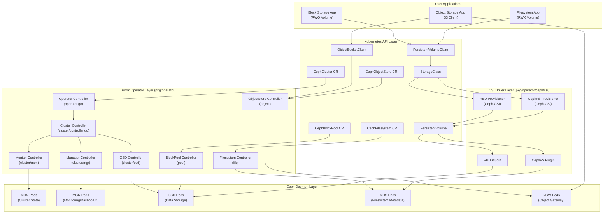
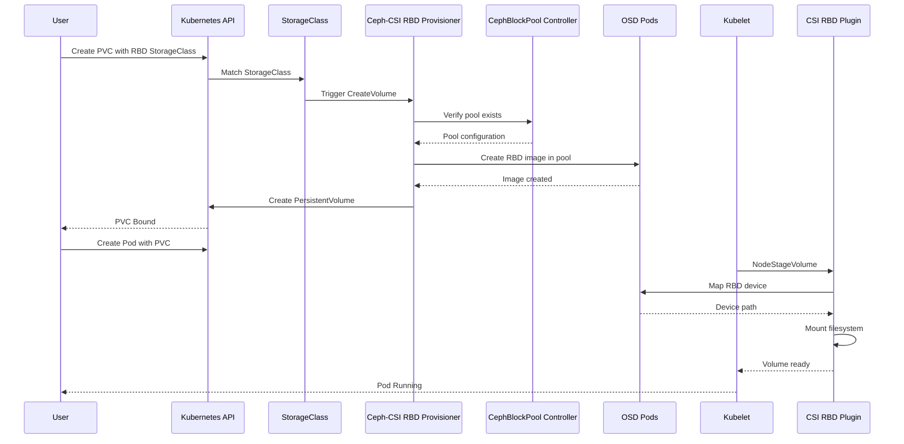
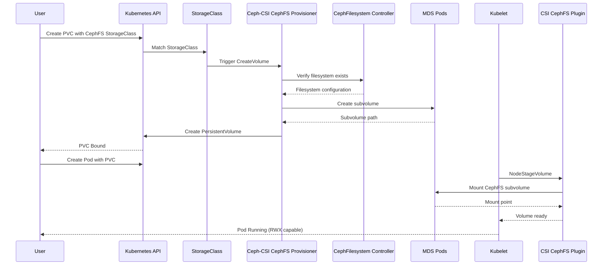
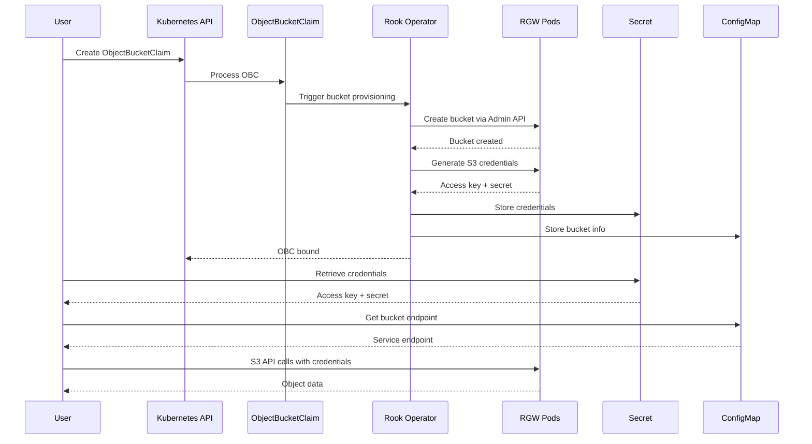
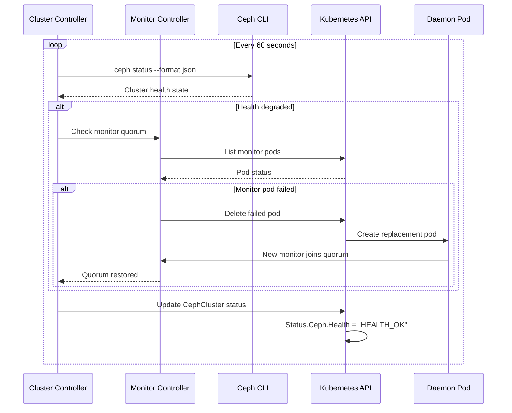
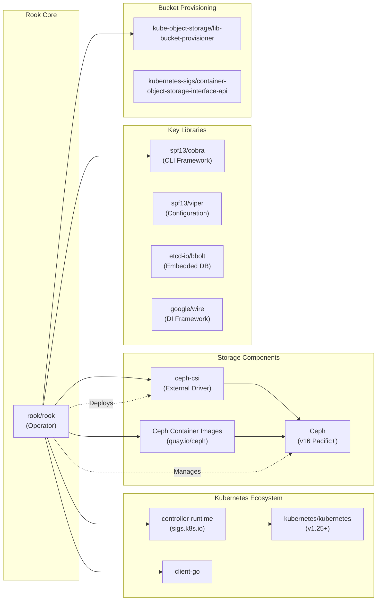

# Rook

> Storage Orchestration for Kubernetes

| Metadata | |
|---|---|
| Repository | https://github.com/rook/rook |
| License | Apache-2.0 |
| Primary Language | Go |
| Analyzed Release | `v1.19.1` (2026-02-05) |
| Stars (approx.) | 13,366 |
| Generated by | Claude Sonnet 4.5 (Anthropic) |
| Generated on | 2026-02-08 |

## Overview

Rook is an open source cloud-native storage orchestrator for Kubernetes that provides the platform, framework, and support for Ceph storage to natively integrate with Kubernetes. Rook automates deployment and management of Ceph to provide self-managing, self-scaling, and self-healing storage services.

Problems it solves:

- Complex deployment and lifecycle management of distributed storage systems like Ceph on Kubernetes
- Lack of native Kubernetes integration for production-grade persistent storage with block, file, and object capabilities
- Manual configuration and monitoring overhead for storage administrators in cloud-native environments

Positioning:

Rook is a graduated CNCF project and serves as the de facto standard for running Ceph on Kubernetes. It is widely adopted in production environments and integrated into platforms like Red Hat OpenShift Data Foundation. Compared to alternatives like Longhorn (focused on simplicity) or OpenEBS (modular storage), Rook provides enterprise-grade features through Ceph with full Kubernetes automation.

## Architecture Overview

Rook implements a Kubernetes operator pattern to orchestrate Ceph storage clusters. The architecture consists of three layers: the Rook operator that manages Ceph lifecycle, CSI drivers that provision and mount volumes, and Ceph daemons that provide the actual storage services across block, file, and object interfaces.

## Core Components

### Operator Controller (`pkg/operator/ceph/operator.go`)

- Responsibility: Main entry point for the Rook operator that initializes and manages all Ceph resource controllers
- Key files: `/tmp/rook-analysis/pkg/operator/ceph/operator.go`, `/tmp/rook-analysis/cmd/rook/main.go`
- Design patterns: Operator pattern, Controller pattern with signal-based lifecycle management

The Operator struct orchestrates the entire Rook system. It initializes a controller-runtime manager that watches for Ceph Custom Resources and coordinates their reconciliation. The operator implements graceful shutdown handling via signal notification (SIGTERM, SIGINT, SIGHUP) and supports dynamic reloading of operator configuration through ConfigMap changes.

Key responsibilities include:
- Bootstrapping the CRD manager with controller-runtime
- Managing the namespace watch scope (single namespace or cluster-wide)
- Coordinating signal-based lifecycle management
- Initializing the ClusterController as the root orchestrator

### Cluster Controller (`pkg/operator/ceph/cluster/controller.go`)

- Responsibility: Reconciles CephCluster custom resources and manages the lifecycle of Ceph cluster components
- Key files: `/tmp/rook-analysis/pkg/operator/ceph/cluster/controller.go`, `/tmp/rook-analysis/pkg/operator/ceph/cluster/cluster.go`
- Design patterns: Reconciliation loop pattern, Watcher pattern for owned resources

The ClusterController is the heart of Rook's orchestration logic. It implements the ReconcileCephCluster reconciler that watches CephCluster CRs and owned Kubernetes objects (Deployments, Services, Secrets, ConfigMaps). When a CephCluster is created or modified, the controller:

1. Validates the cluster specification and storage configuration
2. Creates or updates Ceph monitor (MON) pods for cluster quorum
3. Initializes Object Storage Daemon (OSD) pods on nodes with available storage
4. Deploys Manager (MGR) pods for cluster management and monitoring
5. Configures networking, RBAC, and resource constraints
6. Continuously monitors cluster health and performs self-healing operations

The controller maintains a sync.Map of active clusters and uses TypedEnqueueRequestForOwner to watch child resources, ensuring any changes trigger reconciliation.

### Monitor Controller (`pkg/operator/ceph/cluster/mon`)

- Responsibility: Manages Ceph monitor daemon deployment and quorum maintenance
- Key files: `/tmp/rook-analysis/pkg/operator/ceph/cluster/mon/` directory
- Design patterns: Stateful Set pattern, Quorum management

Ceph monitors form the cluster's control plane by maintaining the cluster map and coordinating consensus. The monitor controller ensures:

- Odd number of monitor pods (typically 3 or 5) for quorum
- Anti-affinity rules to spread monitors across failure domains
- Persistent volume claims for monitor data storage
- Health checking and automatic failover of unhealthy monitors
- Dynamic scaling of monitor count based on cluster size

Monitors are deployed as individual Deployments (not StatefulSets) to allow for more flexible management and recovery scenarios.

### OSD Controller (`pkg/operator/ceph/cluster/osd`)

- Responsibility: Discovers storage devices on nodes and provisions OSD daemons for data storage
- Key files: `/tmp/rook-analysis/pkg/operator/ceph/cluster/osd/`, `/tmp/rook-analysis/pkg/operator/ceph/cluster/osd/config/`
- Design patterns: DaemonSet pattern, Storage discovery and provisioning

The OSD controller manages the data plane of Ceph. It:

1. Runs discovery agents on each node to detect available block devices
2. Prepares devices by partitioning and formatting based on storage class specifications
3. Creates OSD deployments on nodes with allocated storage
4. Manages OSD lifecycle including PVC-based OSDs and raw device OSDs
5. Handles CRUSH map configuration for data placement
6. Supports device hot-plugging and automatic OSD provisioning

The controller supports multiple storage configurations including useAllDevices, deviceFilter, and explicit device selection through the StorageScopeSpec.

### CSI Integration (`pkg/operator/ceph/csi`)

- Responsibility: Deploys and configures Ceph-CSI drivers for volume provisioning and mounting
- Key files: `/tmp/rook-analysis/pkg/operator/ceph/csi/`, `/tmp/rook-analysis/pkg/operator/ceph/csi/template/`
- Design patterns: Sidecar pattern, Template-based configuration generation

Rook integrates with the external Ceph-CSI project to provide standard Kubernetes volume operations. The CSI integration:

- Deploys CSI provisioner and node plugin DaemonSets for RBD and CephFS
- Generates ConfigMaps with Ceph cluster connection details
- Creates RBAC resources for CSI drivers
- Supports volume snapshots, cloning, and expansion
- Manages CSI driver configuration through CephCSI operator CRDs (experimental in v1.15+)

Starting with v1.15, Rook is transitioning to integrate the Ceph-CSI operator for more modular CSI management, with the goal of eventually removing CSI deployment code from Rook itself.

### Storage Resource Controllers

- Responsibility: Manage Ceph storage resources like pools, filesystems, and object stores
- Key files: `/tmp/rook-analysis/pkg/operator/ceph/pool/`, `/tmp/rook-analysis/pkg/operator/ceph/file/`, `/tmp/rook-analysis/pkg/operator/ceph/object/`
- Design patterns: Controller pattern, Dependency management with finalizers

These controllers translate Kubernetes CRs into Ceph storage primitives:

CephBlockPool Controller (`pkg/operator/ceph/pool`):
- Creates RADOS block device (RBD) pools with replication or erasure coding
- Configures pool parameters like size, min_size, and failure domain
- Manages pool mirroring for disaster recovery
- Blocks deletion when pools have dependent resources (PVs, CephNFS)

CephFilesystem Controller (`pkg/operator/ceph/file`):
- Deploys MDS (Metadata Server) pods for filesystem metadata management
- Creates data and metadata pools for CephFS
- Manages filesystem subvolume groups for multi-tenancy
- Supports active-active MDS for high availability

CephObjectStore Controller (`pkg/operator/ceph/object`):
- Deploys RGW (RADOS Gateway) pods for S3/Swift API
- Creates pools for object metadata and data
- Manages multi-site replication through CephObjectRealm, CephObjectZoneGroup, and CephObjectZone
- Integrates with lib-bucket-provisioner for ObjectBucketClaim provisioning

### Dependency Management (`pkg/operator/ceph/cluster/dependents.go`)

- Responsibility: Prevents deletion of storage resources that have active dependents
- Key files: `/tmp/rook-analysis/pkg/operator/ceph/cluster/dependents.go`
- Design patterns: Finalizer pattern, Dependency graph validation

Rook implements a sophisticated dependency tracking system to prevent accidental data loss:

- CephCluster blocks deletion if any other Rook CRs exist in the namespace
- CephBlockPool/CephFilesystem blocks deletion if PersistentVolumes reference them
- CephObjectStore blocks deletion if buckets exist or CephObjectStoreUsers reference it
- Hierarchy enforcement: CephObjectRealm → CephObjectZoneGroup → CephObjectZone → CephObjectStore
- Mirroring dependencies: CephRBDMirror/CephFilesystemMirror block deletion if pools have mirroring enabled

When deletion is blocked, the controller reports the status through:
- Status condition with Type "DeletionIsBlocked"
- Kubernetes Warning events with details of blocking dependents

## Data Flow

### Block Storage (RBD) Provisioning Flow

### Shared Filesystem (CephFS) Provisioning Flow

### Object Storage (S3) Bucket Provisioning Flow

### Cluster Health Monitoring and Self-Healing Flow

## Key Design Decisions

### 1. Operator Pattern over Helm Charts

- Choice: Implement a Kubernetes operator using controller-runtime instead of static Helm charts
- Rationale: Ceph requires continuous lifecycle management (health monitoring, failover, upgrades) that static manifests cannot provide. The operator pattern enables self-healing and dynamic configuration updates.
- Trade-offs: Increased complexity in implementation and a running operator pod consuming cluster resources, but gains automation and operational intelligence that dramatically reduces manual intervention.

### 2. Individual Monitor Deployments instead of StatefulSets

- Choice: Deploy each Ceph monitor as a separate Deployment rather than using a StatefulSet
- Rationale: Ceph monitors require flexible identity management for quorum rebalancing and recovery scenarios. Individual Deployments allow for granular control over monitor lifecycle, canary upgrades, and recovery from split-brain scenarios.
- Trade-offs: More Kubernetes objects to manage and increased API server load, but enables more robust failover strategies and prevents cascading failures during network partitions.

### 3. External Ceph-CSI Integration

- Choice: Integrate with the upstream Ceph-CSI project rather than implementing CSI drivers within Rook
- Rationale: CSI drivers require deep Kubernetes storage expertise and close tracking of CSI specification evolution. Leveraging the dedicated Ceph-CSI project (maintained by Ceph community) ensures best-in-class volume management and reduces Rook's maintenance burden.
- Trade-offs: Dependency on external project for critical path functionality and versioning coordination challenges, but gains specialized CSI expertise and faster adoption of CSI specification updates.

### 4. Dependency Graph with Finalizers

- Choice: Implement resource dependency tracking with Kubernetes finalizers to block deletion of in-use resources
- Rationale: Accidental deletion of storage resources (pools, filesystems) can cause catastrophic data loss for applications. The dependency graph prevents deletion until all consumers are removed, similar to Kubernetes' own garbage collection.
- Trade-offs: Resources can become "stuck" if dependency detection has bugs or if administrators need emergency deletion, but prevents accidental data loss that would otherwise require backup restoration.

### 5. Device Discovery via DaemonSet

- Choice: Run discovery agents as DaemonSets to detect and provision storage devices on each node
- Rationale: Storage devices are node-local resources that require root privileges for device management. DaemonSets ensure discovery runs on every storage node and can react to hot-plugged devices.
- Trade-offs: Discovery agents consume resources on all nodes even when devices don't change, but enables dynamic storage provisioning and automatic OSD addition when new devices are attached.

### 6. Multi-Site Object Storage with CRD Hierarchy

- Choice: Model multi-site object storage with four-level CRD hierarchy (Realm → ZoneGroup → Zone → Store)
- Rationale: Ceph's multi-site architecture has complex topology requirements with realms spanning multiple geographic regions, zone groups for failover domains, and zones for individual clusters. The CRD hierarchy mirrors Ceph's native model.
- Trade-offs: Steep learning curve for users and complex reconciliation logic across four controllers, but provides full control over geo-distributed object storage configurations.

## Dependencies

## Testing Strategy

Rook employs a comprehensive testing strategy across unit, integration, and end-to-end testing levels to ensure reliability of the operator and Ceph cluster orchestration.

Unit tests: Each controller package contains extensive unit tests with mocked Kubernetes clients. The project uses the `github.com/stretchr/testify` assertion library and controller-runtime's `fake.Client` for simulating API server interactions. Test coverage focuses on reconciliation logic, error handling, and dependency validation. Tests are located alongside source files with `_test.go` suffix.

Integration tests: The `/tmp/rook-analysis/tests/integration` directory contains tests that validate Rook's interaction with real Kubernetes clusters using kind (Kubernetes in Docker). Integration tests verify CRD reconciliation, CSI driver deployment, and storage provisioning workflows. Tests run in isolated namespaces to prevent interference.

End-to-end tests: Located in `/tmp/rook-analysis/tests`, the test suite deploys actual Ceph clusters and exercises block, filesystem, and object storage workflows. Tests include upgrade scenarios, failure injection, and disaster recovery simulations. The test framework uses `kubectl` and Ceph CLI commands to validate cluster state.

CI/CD: GitHub Actions workflows (`.github/workflows/`) run tests on every pull request:
- `golangci-lint` for code quality and style enforcement
- Unit tests with race detection enabled
- Integration tests on multiple Kubernetes versions (1.25, 1.26, 1.27)
- Canary upgrade tests from the previous Rook release
- Helm chart validation and linting
- Container image vulnerability scanning with Snyk

The project uses semantic versioning and releases are published through GitHub Releases with automated changelog generation from conventional commit messages.

## Key Takeaways

1. Operator pattern for stateful distributed systems: Rook demonstrates how the Kubernetes operator pattern can manage complex distributed systems like Ceph that require continuous lifecycle management. The reconciliation loop model combined with health monitoring and self-healing makes distributed storage consumable as a Kubernetes-native service. This pattern is applicable to any stateful system requiring active management beyond initial deployment.

2. Layered abstraction over complex infrastructure: By introducing CRDs that map to Ceph primitives (pools, filesystems, object stores) while hiding implementation details (placement groups, CRUSH maps), Rook provides a simplified interface for developers while still exposing advanced configuration for operators. This demonstrates how to build opinionated defaults with expert-level escape hatches.

3. Dependency management prevents data loss: The finalizer-based dependency graph that blocks deletion of in-use storage resources shows how to build safety mechanisms into declarative systems. By tracking resource dependencies across CRDs and native Kubernetes resources (PVs), Rook prevents catastrophic data loss scenarios that could occur with naive resource deletion.

## References

- [Rook Official Documentation](https://rook.io/docs/rook/latest-release/)
- [Rook GitHub Repository](https://github.com/rook/rook)
- [Storage Architecture - Rook Ceph Documentation](https://rook.io/docs/rook/v1.15/Getting-Started/storage-architecture/)
- [Ceph Documentation](https://docs.ceph.com/)
- [Kubernetes Storage SIG](https://github.com/kubernetes/community/tree/master/sig-storage)
- [Container Storage Interface (CSI) Specification](https://github.com/container-storage-interface/spec)
- [How to Deploy Ceph with Rook on Bare-Metal Kubernetes](https://oneuptime.com/blog/post/2026-01-07-ceph-rook-bare-metal-kubernetes/view)
- [Rook & Ceph: Cloud-Native Storage for Kubernetes](https://b-nova.com/en/home/content/open-source-cloud-native-k8s-storage-with-rook/)
