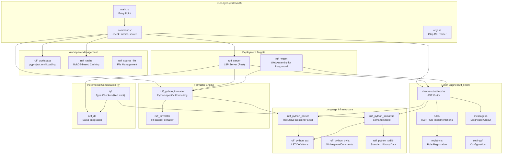
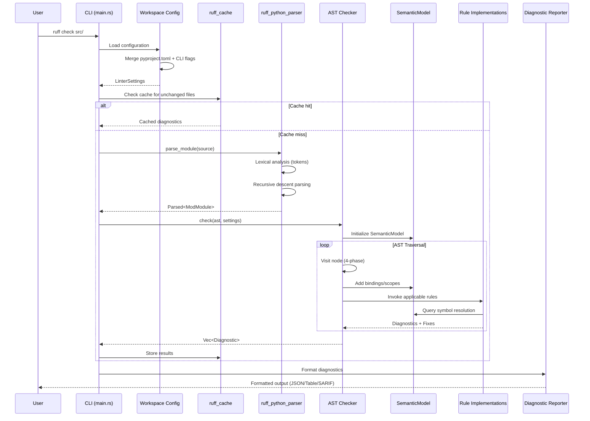
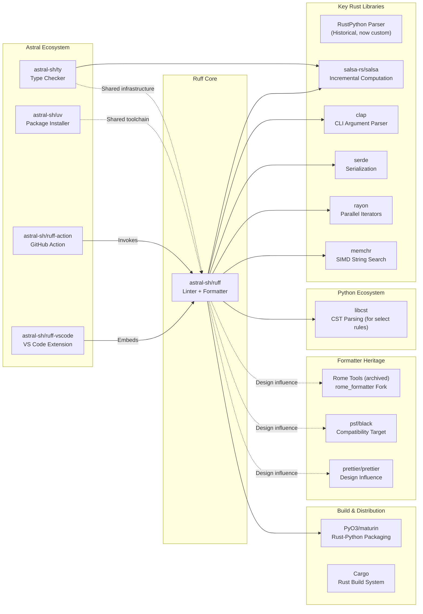

# Ruff

> An extremely fast Python linter and code formatter, written in Rust

| Metadata | |
|---|---|
| Repository | https://github.com/astral-sh/ruff |
| License | MIT |
| Primary Language | Rust |
| Analyzed Release | `0.15.0` (2026-02-03) |
| Stars (approx.) | 45,634 |
| Generated by | Claude Opus 4.6 (Anthropic) |
| Generated on | 2026-02-08 |

## Overview

Ruff is an extremely fast Python linter and code formatter written in Rust, developed by Astral. It aims to be 10-100x faster than existing tools while integrating more functionality behind a single, common interface. Ruff replaces multiple Python development tools including Flake8 (plus dozens of plugins), Black, isort, pydocstyle, pyupgrade, and autoflake.

Problems it solves:

- Performance bottlenecks in Python tooling: Traditional Python linters and formatters are slow enough to disrupt developer flow, especially on large codebases
- Tool fragmentation: Python developers typically need to install and configure 5-10 separate tools for linting, formatting, import sorting, and code modernization
- Configuration complexity: Each tool has its own configuration format and conventions, making it difficult to maintain consistent settings across a project
- CI/CD overhead: Running multiple slow tools sequentially in CI pipelines significantly increases build times

Positioning:

Ruff is used in major open-source projects like Apache Airflow, FastAPI, Pandas, SciPy, and Hugging Face Transformers. It provides drop-in parity with Flake8 and Black while being orders of magnitude faster. Ruff is backed by Astral, the creators of uv (Python package installer) and ty (type checker), positioning it as part of a unified, high-performance Python development toolchain.

## Architecture Overview

Ruff employs a modular monorepo structure with 45+ Rust crates organized in a flat hierarchy. The architecture separates concerns into distinct layers: language infrastructure (parser, AST, semantic analysis), analysis engines (linter, formatter), and execution environments (CLI, language server, WebAssembly). The linter uses a visitor pattern to traverse the Python AST while building a semantic model, enabling context-aware rule checking.

## Core Components

### CLI and Command Dispatcher (`crates/ruff/src`)

- Responsibility: Command-line interface, argument parsing, and top-level orchestration
- Key files: `main.rs`, `lib.rs`, `commands/check.rs`, `commands/format.rs`
- Design patterns: Command pattern (via Clap), Builder pattern for configuration

The CLI entry point uses Clap for argument parsing with support for argument files via the `argfile` crate. The `run()` function in `lib.rs` dispatches to subcommands like `check`, `format`, `server`, and `analyze`. Each command constructs its own configuration by merging CLI flags, environment variables, and config files. The CLI also includes a watch mode using the `notify` crate for file system monitoring, automatically re-running checks when files change.

### Python Parser (`crates/ruff_python_parser`)

- Responsibility: Lexical analysis and parsing of Python source code into an AST
- Key files: `src/lib.rs`, `src/lexer/mod.rs`, `src/parser/mod.rs`
- Design patterns: Recursive descent parsing, Token stream processing

Ruff uses a hand-written recursive descent parser that is over 2x faster than its previous parser generator approach. The parser produces a concrete syntax tree (CST) which is then converted to an abstract syntax tree (AST). It supports all Python 3.14 syntax and provides detailed error recovery, allowing parsing to continue after encountering syntax errors. The lexer generates tokens from source code while tracking trivia (whitespace, comments) separately, which is essential for the formatter to preserve code layout.

### AST Visitor and Checker (`crates/ruff_linter/src/checkers/ast`)

- Responsibility: Traversing the AST and executing lint rules
- Key files: `mod.rs`, `analyze/statement.rs`, `analyze/expression.rs`
- Design patterns: Visitor pattern, Four-phase traversal (Binding, Traversal, Analysis, Cleanup)

The `Checker` struct implements a visitor pattern that traverses the Python AST in evaluation order. As it walks the tree, it builds a `SemanticModel` that tracks bindings, scopes, references, and imports. Each node visit follows a four-phase pattern: (1) Binding phase adds new bindings to the semantic model, (2) Traversal phase recursively visits child nodes, (3) Analysis phase runs lint rules that depend on child node analysis, and (4) Cleanup phase exits scopes and pops state. Rules are invoked by calling out to specialized analyzer functions in `analyze/statement.rs` and `analyze/expression.rs`.

### Semantic Model (`crates/ruff_python_semantic/src/model.rs`)

- Responsibility: Semantic analysis providing scope-aware symbol resolution
- Key files: `model.rs`, `scope.rs`, `binding.rs`, `reference.rs`
- Design patterns: Arena allocation, ID-based indexing for O(1) lookups

The `SemanticModel` is the core data structure for semantic analysis. It maintains arenas of scopes, bindings, definitions, and references, using typed IDs for O(1) lookups. During AST traversal, the semantic model tracks: (1) scope hierarchy and current scope, (2) bindings created by assignments, imports, and function/class definitions, (3) references to names and their resolved bindings, (4) shadowed bindings across scopes, (5) global/nonlocal declarations. This enables rules to answer queries like "What module does this import come from?" or "Is this variable used?". The model also tracks typing module visibility and handled exceptions for context-aware analysis.

### Rule Registry (`crates/ruff_linter/src/registry.rs` and `rules/`)

- Responsibility: 800+ lint rule implementations organized by tool category
- Key files: `registry.rs`, `codes.rs`, `rules/flake8_bugbear/`, `rules/pycodestyle/`
- Design patterns: Plugin architecture, Metadata-driven registration via proc macros

Rules are organized into subdirectories by their origin tool (e.g., `flake8_bugbear`, `pycodestyle`, `isort`). Each rule defines a violation struct annotated with `#[derive(ViolationMetadata)]` that includes the rule code, message template, and fix availability. Rules are registered in `codes.rs` via the `Rule` enum, which maps to concrete violation types. The registry supports selective rule enablement via rule selectors (e.g., "F401", "E7", "ALL"). Rules can provide automatic fixes by returning `Edit` objects that specify text replacements. The proc macro system generates documentation and JSON schema from rule metadata.

### Python Formatter (`crates/ruff_python_formatter`)

- Responsibility: Formatting Python code with Black compatibility
- Key files: `src/lib.rs`, `src/statement/`, `src/expression/`, `src/comments/`
- Design patterns: Intermediate Representation (IR), Builder pattern

The formatter is built on a fork of Rome's `rome_formatter` infrastructure. It works in two stages: (1) Python AST nodes are converted to an intermediate representation (IR) consisting of formatting primitives like `hard_line_break`, `soft_line_break`, `group`, and `indent`, (2) The IR is printed to a string by `ruff_formatter` using a line-breaking algorithm that respects the configured line length. This separation allows the Python-specific logic to focus on structure while the core formatter handles layout decisions. The formatter aims for drop-in parity with Black but introduces selective improvements for consistency and edge cases.

### Language Server (`crates/ruff_server`)

- Responsibility: LSP server for editor integration
- Key files: `src/server.rs`, `src/session.rs`
- Design patterns: Actor model, Request-response protocol

The language server is written entirely in Rust and uses Ruff directly as a library, making it more performant than previous wrapper-based approaches. It implements the Language Server Protocol (LSP) for editor integration with VS Code, Neovim, and other LSP-compatible editors. The server maintains a session state with open documents, runs linting and formatting on document changes, and provides diagnostics, code actions (quick fixes), and hover information. It uses the `lsp-server` crate for LSP communication and the `lsp-types` crate for LSP data structures.

### Workspace Configuration (`crates/ruff_workspace`)

- Responsibility: Loading and resolving hierarchical configuration
- Key files: `src/configuration.rs`, `src/settings.rs`, `src/pyproject.rs`
- Design patterns: Builder pattern, Hierarchical configuration merging

Ruff supports configuration via `pyproject.toml`, `ruff.toml`, or `.ruff.toml` files with hierarchical resolution. Configuration discovery walks up the directory tree to find config files, merging settings from parent directories. The workspace layer handles: (1) parsing TOML configuration, (2) merging with CLI flags and environment variables (CLI takes precedence), (3) per-file settings overrides, (4) validation of configuration options. Configuration is loaded using the `pyproject-toml` crate and deserialized into strongly-typed settings structs via Serde.

## Data Flow

### Typical Linting Flow

## Key Design Decisions

### 1. Rust Implementation for Performance

- Choice: Rewrite Python tooling entirely in Rust rather than optimizing existing Python tools
- Rationale: Python's inherent performance limitations (GIL, interpreted execution, lack of SIMD) make it fundamentally unsuitable for tools that need to process millions of lines of code. Rust provides zero-cost abstractions, memory safety, and native performance. Ruff's benchmarks show 10-100x speedups over existing tools, making linting fast enough to run on every keystroke
- Trade-offs: Higher barrier to entry for contributors (Rust expertise required), longer initial development time, but massively improved runtime performance and ability to handle large codebases. Distribution via PyPI is handled through Maturin, which packages the Rust binary as a Python wheel

### 2. Monorepo with Flat Crate Structure

- Choice: 45+ crates in a flat `crates/` directory rather than nested modules or separate repositories
- Rationale: Following the approach outlined in "Large Rust Workspaces" by matklad, a flat structure makes dependencies explicit, simplifies refactoring, and avoids deeply nested paths. All crates are at the same level, making it easy to understand dependencies and move code between crates. The workspace Cargo.toml defines shared dependencies to avoid version conflicts
- Trade-offs: More directories to navigate but clearer dependency boundaries. Compile times benefit from granular crates as unchanged crates can skip recompilation. Makes it easier to extract crates as standalone libraries

### 3. Hand-Written Recursive Descent Parser

- Choice: Replace parser generator (DSL-based) with a hand-written recursive descent parser
- Rationale: Parser generators add abstraction overhead and make debugging difficult. A hand-written parser provides full control over error recovery, performance optimization, and diagnostic quality. Ruff's new parser achieved a 2x speedup over the previous approach, translating to 20-40% faster linting/formatting. Custom error recovery allows the parser to continue after syntax errors, essential for IDE use cases
- Trade-offs: More code to maintain (thousands of lines of parsing logic), but better performance, error messages, and IDE integration. Easier to add experimental syntax support

### 4. Salsa-Based Incremental Computation for Type Checker

- Choice: Use Salsa for incremental computation in the ty type checker (formerly Red Knot)
- Rationale: Type checking requires analyzing multiple files and tracking dependencies between them. Salsa is a Rust framework for demand-driven incremental computation that automatically tracks dependencies and invalidates stale results. When a file changes, Salsa recomputes only the affected queries, making IDE integrations responsive. This is critical for features like go-to-definition and type-aware linting that require cross-file analysis
- Trade-offs: Salsa adds complexity and requires structuring code around queries. Memory usage increases due to caching intermediate results. However, enables orders-of-magnitude speedups for incremental operations in editors

### 5. Formatter Based on Rome's IR Approach

- Choice: Fork Rome's formatter infrastructure rather than porting Black's algorithm directly
- Rationale: Rome (now Biome) developed a language-agnostic formatter architecture based on an intermediate representation (IR) of formatting primitives. This separates language-specific concerns (converting AST to IR) from layout decisions (printing IR to text). The IR approach is more flexible than Black's approach and easier to extend to multiple languages. It also enables better performance through optimized IR printing
- Trade-offs: Not a line-for-line port of Black, so achieving exact parity requires careful testing. The IR layer adds abstraction but provides a cleaner architecture. Deviations from Black are acceptable when they improve consistency or simplify implementation

### 6. Rule System with Automatic Fixes

- Choice: Design rules to optionally provide automatic fixes (Edit objects) rather than just diagnostics
- Rationale: Many linting violations have obvious mechanical fixes (e.g., remove unused import, add missing f-string prefix). Providing fixes reduces developer toil and makes the linter more actionable. Ruff's fix system applies edits in reverse order to avoid offset invalidation. Safe fixes are applied by default, while unsafe fixes require `--unsafe-fixes`. This mirrors Rust's `cargo fix` model
- Trade-offs: Rules become more complex as they must generate correct edits. Requires extensive testing to ensure fixes don't break code. However, dramatically improves developer experience and enables automated code modernization

## Dependencies

## Testing Strategy

Ruff employs a comprehensive multi-layered testing strategy emphasizing snapshot testing and determinism.

Unit tests: Each crate contains extensive unit tests in `_test.rs` files. The linter uses the Insta snapshot testing framework (`cargo-insta`) to capture expected diagnostic outputs. Test fixtures are organized in `resources/test/fixtures/` directories with Python files representing test cases. Running `cargo test` generates `.snap` files capturing diagnostic output, and `cargo insta review` provides an interactive diff tool for accepting changes.

Integration tests: End-to-end tests in `crates/ruff/tests/` verify CLI behavior, configuration loading, and multi-file scenarios. The `snapbox` crate captures command output for verification. Tests cover edge cases like symbolic links, permission errors, and hierarchical configuration merging.

Fuzzing: Ruff includes fuzzing targets for the parser to catch crashes on malformed input. The parser must handle all input gracefully without panicking, essential for IDE integration where users type invalid syntax.

Benchmarking: The `ruff_benchmark` crate contains micro-benchmarks using Criterion. Ruff also uses CodSpeed for continuous benchmarking in CI, tracking performance regressions across commits. Benchmarks target real-world codebases like CPython and large Django projects.

CI/CD: GitHub Actions runs tests on Linux, macOS, and Windows for each PR. The CI pipeline includes: Rust tests (`cargo test`), Rust linting (`cargo clippy`), formatting checks (`cargo fmt`), Python integration tests, schema generation verification, and release builds with cross-compilation. Releases are published to PyPI, Homebrew, Conda, and standalone installers.

Build system: Cargo workspace manages compilation with profile-specific optimizations. The `release` profile uses LTO (Link-Time Optimization) and selective codegen-units tuning for performance-critical crates like `ruff_python_parser`. The `profiling` profile disables LTO for faster iteration during benchmarking.

## Key Takeaways

1. Language choice matters for tooling: Rust's performance characteristics enabled Ruff to achieve 10-100x speedups over Python-based tools, making previously impractical use cases (linting on every keystroke, formatting entire codebases in under a second) feasible. This demonstrates that tool performance directly impacts developer experience and workflow integration.

2. Monorepo structure for large Rust projects: A flat crate structure with explicit dependencies scales well for large projects. Ruff's 45+ crates remain maintainable due to clear boundaries and shared workspace dependencies. This approach is applicable to any large Rust project that needs to balance modularity with build time.

3. Incremental computation frameworks enable IDE features: Salsa's demand-driven computation model is essential for building responsive language servers and type checkers. The ability to recompute only what changed makes cross-file analysis practical in interactive environments. This pattern applies broadly to tools requiring incremental analysis.

4. Parser design impacts ecosystem adoption: Hand-written parsers provide better control over error recovery and diagnostics, critical for IDE integration. Ruff's parser continues after syntax errors, enabling linting in files with temporary invalid syntax. This makes the tool usable in editors where code is frequently in an intermediate state.

5. Intermediate representation for formatters: Rome's IR-based formatter architecture cleanly separates language semantics from layout decisions. This enables sharing formatter infrastructure across languages and makes the formatting algorithm easier to reason about. The approach is applicable to formatters for any language.

6. Automatic fixes amplify linter value: Rules that provide mechanical fixes (unused imports, outdated syntax) are significantly more valuable than diagnostic-only rules. Ruff's fix system enables automated code modernization and reduces developer friction. This pattern applies to any linting tool.

7. Drop-in compatibility reduces adoption friction: Ruff's compatibility with Black formatting and Flake8 rules lowered the barrier to adoption. Projects could switch with minimal configuration changes. When building faster alternatives to established tools, compatibility reduces migration risk and accelerates adoption.

## References

- [Ruff Official Documentation](https://docs.astral.sh/ruff/)
- [Ruff GitHub Repository](https://github.com/astral-sh/ruff)
- [Ruff v0.4.0: A hand-written recursive descent parser for Python](https://astral.sh/blog/ruff-v0.4.0)
- [Ruff: Internals of a Rust-backed Python linter-formatter - Part 1](https://compileralchemy.substack.com/p/ruff-internals-of-a-rust-backed-python)
- [The Evolution of Ruff's Parser](https://medium.com/@vasschiavo/the-evolution-of-ruffs-parser-77f2a83f4838)
- [astral-sh/ruff | DeepWiki](https://deepwiki.com/astral-sh/ruff)
- [Large Rust Workspaces by matklad](https://matklad.github.io/2021/08/22/large-rust-workspaces.html)
- [Contributing to Ruff](https://docs.astral.sh/ruff/contributing/)
