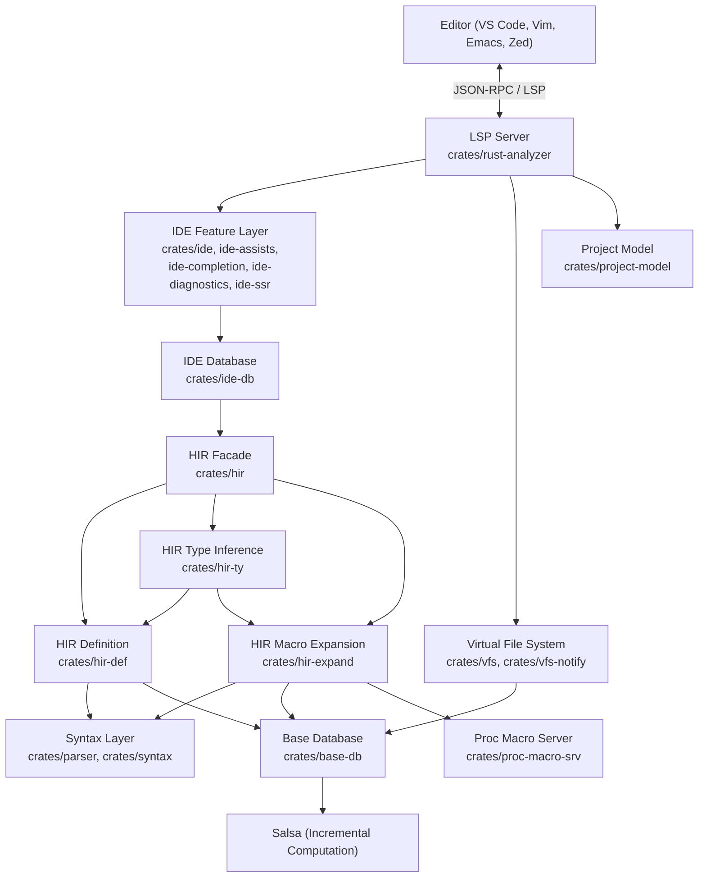
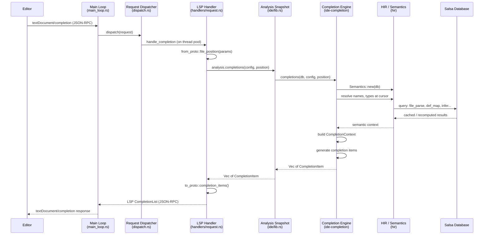
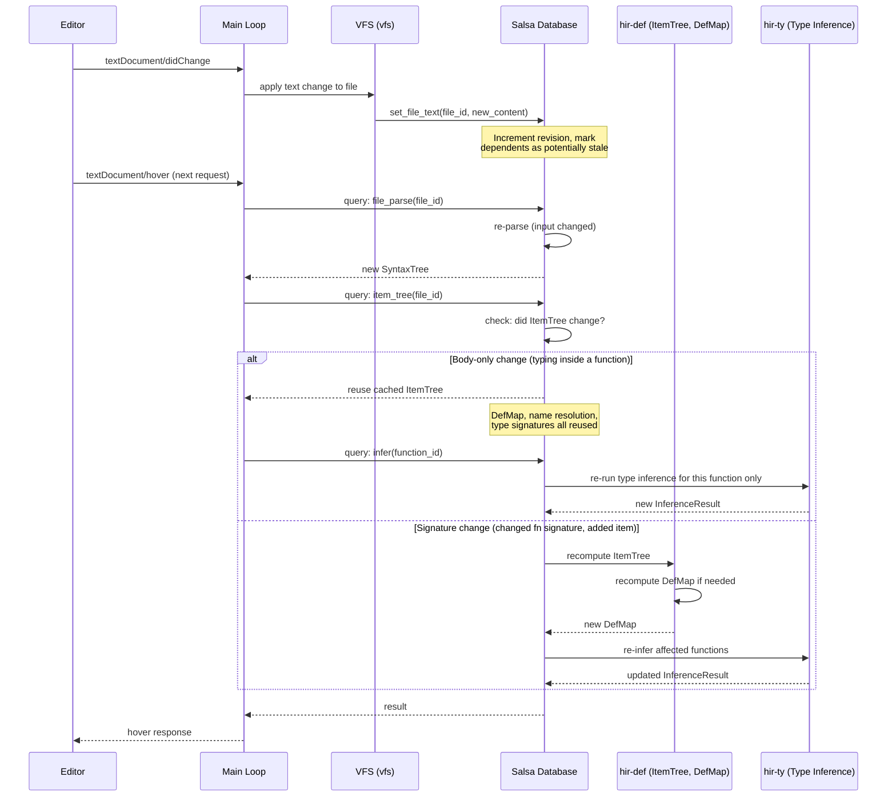
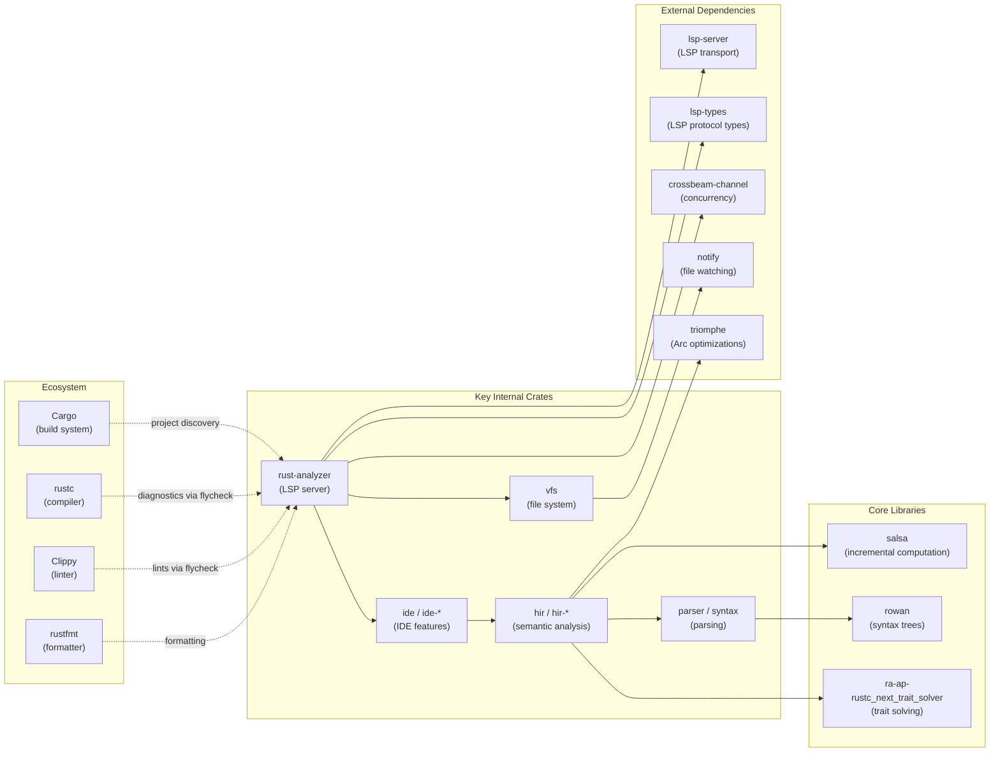

# rust-analyzer

> A Rust compiler front-end for IDEs, providing language server protocol (LSP) support for Rust code intelligence.

| Metadata | |
|---|---|
| Repository | https://github.com/rust-lang/rust-analyzer |
| License | MIT OR Apache-2.0 |
| Primary Language | Rust |
| Analyzed Release | `2026-02-02` (2026-02-02) |
| Stars (approx.) | 16,021 |
| Generated by | Claude Opus 4.6 (Anthropic) |
| Generated on | 2026-02-08 |

## Overview

rust-analyzer is a language server that provides rich IDE functionality for Rust programming, including go-to-definition, find-all-references, code completion, refactoring, integrated formatting (via rustfmt), and integrated diagnostics (via rustc and clippy). Internally it is structured as a set of libraries that parse, analyze, and reason about Rust source code using an incremental computation framework (Salsa) to achieve real-time responsiveness.

Problems it solves:

- Providing real-time, incremental semantic analysis of Rust code for editors without requiring full compilation
- Offering a stable LSP interface while maintaining a rapidly evolving internal analysis engine
- Handling the complexity of Rust's macro system, type inference, and trait resolution within IDE latency constraints
- Supporting multiple editors (VS Code, Vim, Emacs, Zed, etc.) through a single, standardized protocol

Positioning:

rust-analyzer replaced the original Rust Language Server (RLS) as the official Rust IDE support tool. Unlike RLS, which relied on full cargo builds via the `save-analysis` approach, rust-analyzer implements its own compiler front-end with on-demand, incremental computation. It shares some code with the official Rust compiler (rustc) via `ra-ap-rustc_*` crates but maintains its own parsing, name resolution, and type inference pipelines optimized for IDE responsiveness. It is the de facto standard for Rust IDE support across all major editors.

## Architecture Overview

rust-analyzer follows a layered architecture organized as a workspace of ~40 internal crates. At the bottom sits the syntax layer (parser, syntax tree), above that the semantic analysis layer (HIR crates backed by Salsa for incremental computation), then the IDE feature layer (completions, navigation, diagnostics), and finally the LSP server layer that translates between the protocol and the IDE APIs. The core design principle is that typing inside a function body never invalidates global derived data, enabling sub-100ms response times.

## Core Components

### LSP Server (`crates/rust-analyzer`)

- Responsibility: Translating between the Language Server Protocol and the internal IDE API, managing server lifecycle, dispatching requests, and coordinating with external tools (flycheck, proc-macro server)
- Key files: `crates/rust-analyzer/src/main_loop.rs`, `crates/rust-analyzer/src/global_state.rs`, `crates/rust-analyzer/src/handlers/request.rs`, `crates/rust-analyzer/src/handlers/notification.rs`, `crates/rust-analyzer/src/config.rs`
- Design patterns: Event Loop, Request Dispatcher, Actor Model (message-passing between main loop and task pool)

The `main_loop` function in `crates/rust-analyzer/src/main_loop.rs` is the heart of the server. It uses `crossbeam_channel::select!` to multiplex events from several sources: incoming LSP messages, background task completions, VFS file system notifications, flycheck diagnostics, and test results. The `GlobalState` struct in `crates/rust-analyzer/src/global_state.rs` holds the primary mutable state, including the `AnalysisHost` (which owns the Salsa database), the `Vfs` (virtual file system), and the `ProjectWorkspace` configuration. Each LSP request is protected by `catch_unwind` to ensure a single panicking request does not crash the server. The `RequestDispatcher` in `crates/rust-analyzer/src/handlers/dispatch.rs` maps LSP method names to handler functions, executing them either on the main thread or on a thread pool depending on whether they need mutable access to `GlobalState`.

### IDE Feature Layer (`crates/ide`, `crates/ide-assists`, `crates/ide-completion`, `crates/ide-diagnostics`, `crates/ide-ssr`)

- Responsibility: Providing high-level IDE features (completion, goto-definition, hover, rename, code actions, diagnostics, structural search-replace) using editor-friendly terminology (offsets, ranges, string labels)
- Key files: `crates/ide/src/lib.rs`, `crates/ide/src/goto_definition.rs`, `crates/ide/src/hover.rs`, `crates/ide-completion/src/lib.rs`, `crates/ide-completion/src/completions.rs`, `crates/ide-assists/src/lib.rs`, `crates/ide-diagnostics/src/lib.rs`
- Design patterns: Facade (the `Analysis` struct), POD-based API (plain-old-data types with public fields), MVC/MVVM (ide as the view/viewmodel layer)

The `ide` crate exposes the `Analysis` struct, which provides a snapshot-based, thread-safe, cancellable API for all IDE operations. Callers obtain an `Analysis` from `AnalysisHost::analysis()`, which creates an immutable snapshot of the Salsa database. This means multiple requests can be processed concurrently without locking. The API deliberately uses editor terminology: file positions as byte offsets, results as strings, and never exposes internal compiler types. The `ide-completion` crate handles one of the most complex features, using a `CompletionContext` that determines what kind of completion is needed (method, field, keyword, path, etc.) and then delegates to specialized completions modules. The `ide-assists` crate provides code actions (quick fixes and refactorings) as structured source transformations. The `ide-ssr` crate implements structural search-replace using pattern matching on the syntax tree.

### HIR Facade (`crates/hir`)

- Responsibility: Providing a clean, object-oriented, self-contained API over the raw compiler internals for use by the IDE layer
- Key files: `crates/hir/src/lib.rs`, `crates/hir/src/semantics.rs`, `crates/hir/src/source_analyzer.rs`, `crates/hir/src/db.rs`, `crates/hir/src/attrs.rs`
- Design patterns: Facade, Boundary Pattern (insulating IDE from compiler internals), OO-style wrappers over ECS-style internals

The `hir` crate serves as the primary boundary between the IDE features and the compiler internals. While the internal `hir-def`, `hir-ty`, and `hir-expand` crates are written in an "ECS" (Entity Component System) style with raw IDs, arenas, and direct database queries, the `hir` crate wraps these into self-contained types like `Function`, `Struct`, `Module`, `Type`, etc. Each type knows its parents and full context. The `Semantics` struct in `crates/hir/src/semantics.rs` is the key entry point that bridges syntax trees with semantic information, allowing IDE code to ask questions like "what does this name resolve to?" or "what is the type of this expression?". This boundary is critical: it allows the compiler internals to change freely (e.g., switching incremental computation strategies) without breaking IDE features.

### Compiler Internals (`crates/hir-def`, `crates/hir-ty`, `crates/hir-expand`)

- Responsibility: Implementing name resolution, type inference, trait solving, macro expansion, and all semantic analysis of Rust code
- Key files: `crates/hir-def/src/nameres.rs` (DefMap, module tree), `crates/hir-def/src/item_tree.rs` (condensed file summary), `crates/hir-def/src/resolver.rs`, `crates/hir-ty/src/infer.rs` (type inference), `crates/hir-ty/src/method_resolution.rs`, `crates/hir-ty/src/mir.rs`, `crates/hir-expand/src/db.rs` (macro expansion database)
- Design patterns: ECS-style (raw IDs, arenas, query-based), Salsa query groups, Stratified representations (ItemTree, DefMap, Body)

These crates form the "brain" of rust-analyzer. `hir-def` handles name resolution through the `DefMap` (which stores the module tree and module scopes for a crate) and the `ItemTree` (a condensed summary of a `SyntaxTree` that is stable across function body edits). The `Body` structure stores lowered expression data for individual functions. `hir-ty` implements full Rust type inference using a unification-based algorithm and integrates with Chalk (now partly replaced by `ra-ap-rustc_next_trait_solver`) for trait solving. `hir-expand` manages macro expansion, supporting both declarative macros (macro_rules!) via the `mbe` crate and procedural macros via the `proc-macro-srv` process. All of these crates are deeply integrated with Salsa, defining query groups where inputs are file contents and derived values are things like parsed syntax trees, resolved names, and inferred types.

### Syntax Layer (`crates/parser`, `crates/syntax`)

- Responsibility: Parsing Rust source code into a lossless, concrete syntax tree (CST) and providing AST access
- Key files: `crates/parser/src/grammar.rs`, `crates/parser/src/lib.rs`, `crates/syntax/src/lib.rs`, `crates/syntax/src/ast.rs`, `crates/syntax/src/parsing.rs`, `crates/syntax/src/syntax_node.rs`, `crates/syntax/src/validation.rs`
- Design patterns: Lossless parsing (preserving whitespace and comments), Red-Green tree (via rowan library), Parser-as-library (independent of Salsa and the rest of rust-analyzer)

The `parser` crate implements a hand-written recursive descent parser that produces a flat list of events (start node, token, finish node, error) rather than directly building a tree. This makes it reusable across different tree representations. The `syntax` crate consumes these events and constructs a concrete syntax tree using the `rowan` library, which implements a "red-green tree" architecture: the green tree is an immutable, shared, structurally-hashed data structure; the red tree provides parent pointers and absolute offsets on top of it. This design allows efficient incremental re-parsing and structural sharing between revisions. The syntax crate is completely independent of Salsa, HIR, or any other part of rust-analyzer, making it reusable as a standalone Rust parser library. AST nodes are generated from an `ungrammar` file that formally describes the Rust grammar.

### Virtual File System and Project Model (`crates/vfs`, `crates/vfs-notify`, `crates/project-model`, `crates/base-db`)

- Responsibility: Abstracting file system access, watching for file changes, discovering project structure from Cargo.toml / rust-project.json, and providing the input layer for the Salsa database
- Key files: `crates/vfs/src/lib.rs`, `crates/vfs/src/loader.rs`, `crates/vfs-notify/src/lib.rs`, `crates/project-model/src/cargo_workspace.rs`, `crates/project-model/src/workspace.rs`, `crates/project-model/src/sysroot.rs`, `crates/base-db/src/input.rs`, `crates/base-db/src/lib.rs`
- Design patterns: Virtual File System (decoupling from real FS), Observer (file watcher notifications), Salsa inputs

The `vfs` crate provides an in-memory representation of the file system, mapping `VfsPath` values to `FileId` integers. File contents are stored in the Salsa database via `base-db`, where they serve as the root inputs for all incremental computation. The `vfs-notify` crate uses the `notify` crate to watch the real file system and report changes. The `project-model` crate discovers and parses Cargo workspaces (`Cargo.toml`), including dependency resolution, build script outputs, and sysroot (std library) locations. It also supports the `rust-project.json` format for non-Cargo projects. `base-db` defines the Salsa database traits and the fundamental types (`SourceRoot`, `Crate`, `Env`) that represent a Rust project within the analysis engine.

## Data Flow

### Code Completion Request

### File Change and Incremental Recomputation

## Key Design Decisions

### 1. Salsa-Based Incremental Computation

- Choice: Use Salsa as the foundation for all analysis, organizing computation as a directed acyclic graph of queries with automatic dependency tracking and memoization
- Rationale: IDE responsiveness demands that only the minimal necessary recomputation occurs after each keystroke. Salsa's query model naturally expresses the dependencies between parsing, name resolution, type inference, and IDE features, allowing fine-grained invalidation without manual cache management
- Trade-offs: Salsa imposes constraints on how data flows through the system (all computation must go through the database), adds memory overhead for memoized results, and requires careful attention to query granularity. Too-coarse queries waste computation; too-fine queries add overhead from dependency tracking

### 2. Lossless Concrete Syntax Trees with rowan

- Choice: Use lossless concrete syntax trees (preserving whitespace, comments, and erroneous tokens) via the rowan red-green tree library, rather than traditional ASTs that discard formatting
- Rationale: IDEs need to work with the exact text the user typed, including incomplete or erroneous code. A lossless CST enables round-tripping (syntax tree back to exact original text), error-resilient parsing (the tree always covers the entire file), and structural editing (modifying the tree while preserving formatting)
- Trade-offs: CSTs are larger and more complex to work with than traditional ASTs. Accessing semantic information requires traversing a richer structure. The red-green tree adds a level of indirection. Generated AST wrapper types mitigate this but add code generation complexity

### 3. HIR as an Internal Boundary

- Choice: Maintain a clear architectural boundary between the IDE layer (which uses OO-style, self-contained types) and the compiler internals (which use ECS-style, ID-based types with direct database access)
- Rationale: This boundary insulates IDE features from the complexity and instability of compiler internals. The `hir` crate acts as a stable internal API that translates between the two worlds, allowing the compiler internals to be refactored (e.g., changing Salsa versions, restructuring queries) without cascading changes to completion, hover, or navigation code
- Trade-offs: The translation layer adds code and can introduce performance overhead from ID lookups. Some information may be lost or awkward to expose across the boundary. Maintaining the boundary requires discipline

### 4. Separation of Syntax from Semantics

- Choice: Keep the `syntax` and `parser` crates completely independent of Salsa, HIR, and the rest of rust-analyzer
- Rationale: The syntax layer is reusable as a standalone Rust parser library. Independence ensures that parsing is fast and testable in isolation. It also enables the parser to be used in other contexts (e.g., rustfmt, rust-clippy, or third-party tools)
- Trade-offs: The independence means the syntax layer cannot benefit from incremental computation at the parsing level (though rowan's structural sharing partially compensates). Connecting syntax to semantics requires an additional integration step

### 5. Snapshot-Based Concurrency Model

- Choice: Use an immutable snapshot (`Analysis`) of the Salsa database for processing requests, with a single writer (`AnalysisHost`) that applies changes
- Rationale: This model allows multiple read-only requests to be processed concurrently on a thread pool while file changes are applied atomically on the main thread. When a new change arrives, in-flight computations are cancelled via Salsa's built-in cancellation mechanism, and new snapshots are created for subsequent requests
- Trade-offs: Snapshot creation has a cost (though Salsa makes it cheap via structural sharing). Cancelled computations waste some CPU time. The single-writer model means file changes must be serialized, but this is acceptable since they come from the editor sequentially

## Dependencies

## Testing Strategy

rust-analyzer employs a multi-layered testing approach that mirrors its architecture, with each layer tested independently before integration.

Unit tests: Each crate contains inline tests (`#[test]`) and dedicated test modules. The `parser` crate has extensive tests comparing parse output against expected syntax tree snapshots. The `syntax` crate tests AST construction and validation. HIR crates test name resolution, type inference, and macro expansion using a custom fixture format (`//-` prefixed test files embedded in Rust strings) that allows defining multi-file projects inline. The `ide-completion`, `ide-assists`, and `ide-diagnostics` crates each have large test suites using the same fixture approach, asserting on completion item lists, code action outputs, and diagnostic messages.

Integration tests: The `test-fixture` crate (`crates/test-fixture`) provides a shared test infrastructure for constructing `AnalysisHost` instances from fixture strings. The `crates/rust-analyzer/src/integrated_benchmarks.rs` file contains benchmarks that exercise the full pipeline from source text to IDE results. The `test-utils` crate provides utilities for snapshot testing (expect-test), assertion helpers, and test data management.

CI/CD: rust-analyzer uses GitHub Actions for continuous integration. The CI pipeline runs `cargo test` across all crates, checks formatting with `rustfmt`, runs `clippy` lints, and performs cross-platform builds. The project releases weekly (every Monday) with automated binary builds for major platforms. A nightly pre-release is also published daily.

## Key Takeaways

1. Query-based incremental computation as the foundation: By building the entire analysis pipeline on Salsa's query framework, rust-analyzer achieves fine-grained incrementality where typing in a function body only re-runs type inference for that function, while all module-level and cross-crate data remains cached. This pattern of organizing computation as a DAG of memoized queries with automatic dependency tracking is broadly applicable to any system that needs to efficiently update derived data in response to frequent, localized input changes.

2. Architectural boundaries protect against internal churn: The `hir` crate acts as a deliberate "soft boundary" between the rapidly-evolving compiler internals and the stable IDE feature layer. By translating between ECS-style internal representations and OO-style external APIs, changes to the incremental computation strategy, query structure, or data representations do not cascade into the IDE code. This pattern of establishing stable internal APIs at architectural boundaries is essential for large systems with components evolving at different rates.

3. Lossless syntax trees enable rich IDE experiences: By preserving every byte of the original source (whitespace, comments, errors) in the syntax tree, rust-analyzer can support features like formatting-preserving refactoring, error-resilient analysis (always having a complete tree even for broken code), and precise text manipulation. The red-green tree design (immutable green nodes for sharing, red wrappers for navigation) provides an efficient way to achieve this. This approach is now being adopted by other language tooling ecosystems.

4. Snapshot-based concurrency simplifies reasoning: The pattern of creating immutable snapshots for read operations while channeling all mutations through a single writer eliminates the need for complex locking strategies. Combined with Salsa's built-in cancellation support, this allows rust-analyzer to cancel stale computations when new edits arrive and immediately start processing with fresh data. This is a practical concurrency model for any system with a high read-to-write ratio.

5. Decoupled layers enable reuse and independent evolution: By keeping the syntax layer completely independent of the rest of the system, rust-analyzer enables its parser and syntax tree to be reused by other tools. Similarly, the separation of `project-model` (which understands Cargo workspaces) from the analysis engine means the same analysis can work with non-Cargo build systems via `rust-project.json`. This disciplined layering, where each layer only depends downward and never upward, is a hallmark of sustainable large-scale software architecture.

## References

- [rust-analyzer Official Manual](https://rust-analyzer.github.io/book/)
- [Architecture Documentation](https://rust-analyzer.github.io/book/contributing/architecture.html)
- [rust-analyzer GitHub Repository](https://github.com/rust-lang/rust-analyzer)
- [Salsa: Incremental Computation Framework](https://salsa-rs.github.io/salsa/overview.html)
- [Durable Incrementality Blog Post](https://rust-analyzer.github.io/blog/2023/07/24/durable-incrementality.html)
- [rust-analyzer API Documentation](https://rust-lang.github.io/rust-analyzer/ide/)
- [rust-analyzer Weekly Changelog](https://rust-analyzer.github.io/thisweek)
- [rowan: Lossless Syntax Trees](https://github.com/rust-analyzer/rowan)
- [DeepWiki: rust-analyzer Architecture](https://deepwiki.com/rust-lang/rust-analyzer)
