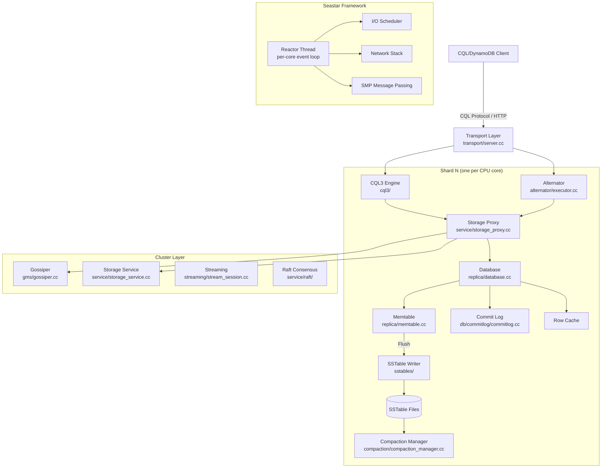
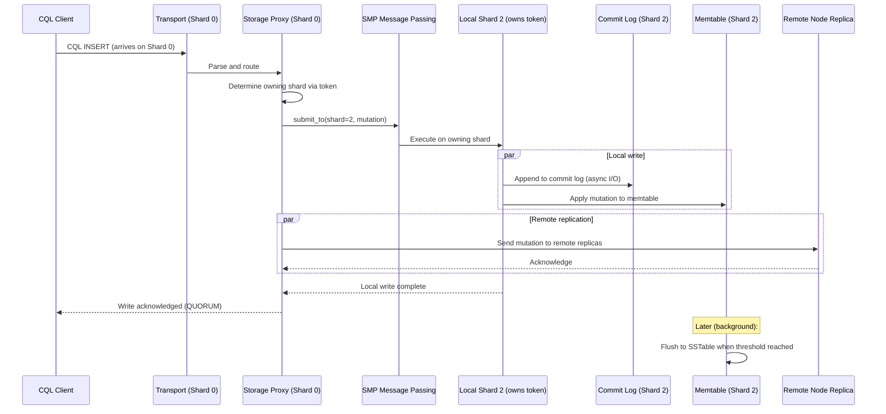
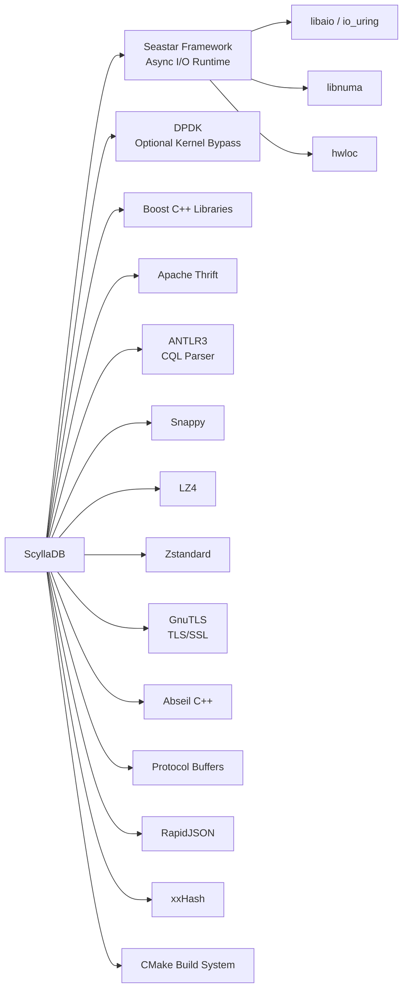

# ScyllaDB

> A high-performance NoSQL database compatible with Apache Cassandra and Amazon DynamoDB, built on the Seastar framework with a shard-per-core architecture.

| Metadata | |
|---|---|
| Repository | https://github.com/scylladb/scylladb |
| License | ScyllaDB Source Available License 1.0 (with AGPL components) |
| Primary Language | C++ |
| Category | Database |
| Analyzed Release | `scylla-2026.1.0-rc1` (2026) |
| Stars (approx.) | 15,327 |
| Generated by | Claude Opus 4.6 (Anthropic) |
| Generated on | 2026-02-08 |

## Overview

ScyllaDB is a high-performance, distributed NoSQL database written in C++ that is wire-protocol compatible with both Apache Cassandra (CQL) and Amazon DynamoDB (via the Alternator module). Built on the Seastar asynchronous framework, ScyllaDB employs a shard-per-core architecture where each CPU core runs a dedicated reactor thread with its own memory, I/O queues, and data partition, eliminating cross-core contention and enabling predictable, low-latency performance. ScyllaDB can deliver millions of operations per second with sub-millisecond latencies while maintaining API compatibility with Cassandra.

Problems it solves:
- Eliminates the performance overhead of JVM-based databases (garbage collection pauses, thread contention) by implementing the entire database in C++ with a shared-nothing, event-driven architecture
- Provides Cassandra and DynamoDB API compatibility while delivering 5-10x better throughput and significantly lower tail latencies, enabling drop-in replacement without application changes
- Achieves linear scalability with CPU cores and cluster nodes through its shard-per-core design, where each core operates independently with dedicated resources and no context switching

Positioning:
ScyllaDB positions itself as a high-performance drop-in replacement for Apache Cassandra and a self-hosted alternative to Amazon DynamoDB. It competes with Cassandra by offering dramatically better hardware utilization and lower operational costs (fewer nodes needed for the same throughput). Against DynamoDB, it provides the Alternator compatibility layer for applications seeking to avoid vendor lock-in. Major users include Discord, Expedia, Zillow, and Comcast. ScyllaDB is developed by ScyllaDB Ltd., which offers both open-source and enterprise editions.

## Architecture Overview

ScyllaDB's architecture is fundamentally shaped by the Seastar framework's shard-per-core model. Each CPU core runs a single reactor thread that owns a dedicated portion of memory, storage, and network resources. Cores communicate exclusively through explicit message passing, never through shared memory or locks. Data is partitioned across shards (cores) using the same consistent hashing scheme as Cassandra, with each shard owning specific token ranges. This design eliminates contention, context switching, and cache pollution.

## Core Components

### Seastar Reactor and Shard-Per-Core Model (external: `seastar/`)
- Responsibility: Provides the foundational asynchronous, shared-nothing runtime that pins one reactor thread per CPU core, each with dedicated memory, I/O queues, and network connections.
- Key files: `seastar/core/reactor.hh`, `seastar/core/sharded.hh`, `seastar/core/future.hh`, `seastar/core/smp.hh`
- Design patterns: Reactor pattern (single-threaded event loop per core); futures/promises for asynchronous programming; `sharded<T>` template for distributing service instances across cores; explicit message passing via `smp::submit_to()`.

The Seastar framework is the foundation of ScyllaDB's performance. Each core runs a tight event loop (reactor) that processes I/O completions, timer events, and inter-core messages without ever blocking. The `sharded<T>` template creates one instance of a service on each core, and cross-shard communication uses `smp::submit_to()` which queues a lambda on the target core's reactor. Memory is allocated from per-core pools, eliminating allocator contention.

### CQL3 Query Engine (`cql3/`)
- Responsibility: Parses and executes CQL (Cassandra Query Language) statements, maintaining compatibility with Cassandra's CQL protocol.
- Key files: `cql3/Cql.g` (ANTLR grammar), `cql3/query_processor.cc`, `cql3/statements/select_statement.cc`, `cql3/statements/modification_statement.cc`, `cql3/authorized_prepared_statements_cache.hh`
- Design patterns: ANTLR-generated parser (same grammar heritage as Cassandra); prepared statement caching; per-shard query processing.

The CQL engine parses queries using an ANTLR grammar that is derived from Cassandra's, ensuring CQL compatibility. However, the execution path is entirely rewritten in C++ using Seastar futures for asynchronous, non-blocking execution. Prepared statements are cached per-shard to avoid cross-core synchronization.

### Alternator - DynamoDB Compatibility (`alternator/`)
- Responsibility: Provides Amazon DynamoDB API compatibility through an HTTP/JSON interface, mapping DynamoDB operations to ScyllaDB's internal storage model.
- Key files: `alternator/executor.cc` (request dispatch), `alternator/controller.cc`, `alternator/conditions.cc`, `alternator/expressions.cc`, `alternator/serialization.cc`
- Design patterns: HTTP REST API handler; DynamoDB data model mapped to CQL internal representation; expression evaluation for conditional operations.

The Alternator module allows applications using the AWS DynamoDB SDK to work with ScyllaDB without code changes. It translates DynamoDB concepts (tables, items, attributes, secondary indexes, conditional expressions) into ScyllaDB's internal storage model, executing them through the same storage proxy and SSTable engine.

### Storage Proxy and Replica Management (`service/storage_proxy.cc` and `replica/`)
- Responsibility: Coordinates distributed read and write operations, determining replica placement and managing consistency level fulfillment.
- Key files: `service/storage_proxy.cc`, `replica/database.cc`, `replica/memtable.cc`, `replica/table.cc`
- Design patterns: Coordinator pattern (same as Cassandra); token-aware routing to the owning shard on each node; speculative retry for reads; hint storage for temporarily unavailable replicas.

The storage proxy implements the same distributed coordination logic as Cassandra but with critical optimizations. When a request arrives at a node but targets a token range owned by a different shard on the same node, the proxy uses `smp::submit_to()` to forward it to the correct shard, maintaining data locality. The `replica/database.cc` manages the per-shard portion of the database, including memtables and the row cache.

### SSTable Engine (`sstables/`)
- Responsibility: Implements the SSTable (Sorted String Table) on-disk format for persistent storage, supporting multiple format versions for Cassandra compatibility.
- Key files: `sstables/sstables.cc`, `sstables/writer.cc`, `sstables/reader.cc`, `sstables/compaction.cc`, `sstables/mx/reader.cc`
- Design patterns: Immutable sorted files with bloom filters, partition index, and summary index; multiple format support (mc, md, me) for backward compatibility with Cassandra SSTables.

ScyllaDB's SSTable implementation supports Cassandra's SSTable formats for migration compatibility but also introduces its own optimized format. The SSTable reader uses Seastar's I/O scheduler for non-blocking disk access, and the writer produces SSTables asynchronously during memtable flush and compaction.

### Compaction Subsystem (`compaction/`)
- Responsibility: Merges SSTables to reclaim space, remove tombstones, and maintain read performance through background compaction.
- Key files: `compaction/compaction_manager.cc`, `compaction/compaction_strategy.cc`, `compaction/size_tiered_compaction_strategy.cc`, `compaction/leveled_compaction_strategy.cc`, `compaction/time_window_compaction_strategy.cc`, `compaction/incremental_compaction_strategy.cc`
- Design patterns: Strategy pattern for pluggable compaction algorithms; per-shard compaction scheduling; I/O priority control through Seastar's I/O scheduler to prevent compaction from starving foreground queries.

ScyllaDB supports the same compaction strategies as Cassandra (STCS, LCS, TWCS) plus its own Incremental Compaction Strategy (ICS) that reduces space amplification by performing compaction incrementally rather than rewriting entire SSTables. Compaction runs as a low-priority background task on each shard, with I/O bandwidth controlled by the Seastar I/O scheduler.

### Gossip and Cluster Management (`gms/` and `service/`)
- Responsibility: Manages cluster membership, node state propagation, and failure detection using gossip protocol, with Raft-based consensus for topology operations.
- Key files: `gms/gossiper.cc`, `gms/failure_detector.cc`, `gms/endpoint_state.cc`, `service/storage_service.cc`, `service/raft/`
- Design patterns: Gossip protocol (compatible with Cassandra); Phi Accrual Failure Detector; Raft consensus for schema changes and topology operations.

ScyllaDB's gossip implementation is compatible with Cassandra's, enabling mixed-cluster scenarios during migration. The cluster management layer has been enhanced with Raft-based consensus for strongly consistent schema changes and topology operations, avoiding the race conditions that can occur with purely gossip-based schema propagation.

## Data Flow

### CQL Write Path (Shard-Per-Core)

## Key Design Decisions

### 1. Shard-Per-Core Architecture on Seastar
- Choice: Build the entire database on the Seastar framework where each CPU core runs a single reactor thread with dedicated memory, I/O, and network resources, communicating only through message passing.
- Rationale: Eliminates all sources of contention (locks, cache line bouncing, context switches) that plague multi-threaded databases. Each core operates as an independent unit, enabling predictable performance and linear scalability with core count. No garbage collection pauses (unlike Cassandra's JVM).
- Trade-offs: Requires all code to be written in an asynchronous, non-blocking style using futures/promises, which is significantly more complex than synchronous programming. Cross-shard operations require explicit message passing. Memory must be carefully managed manually (no GC safety net). The learning curve for developers is steep.

### 2. Cassandra CQL and DynamoDB API Compatibility
- Choice: Implement wire-protocol compatibility with both Apache Cassandra (CQL) and Amazon DynamoDB (via Alternator), allowing existing applications to use ScyllaDB without code changes.
- Rationale: Dramatically lowers the barrier to adoption. Organizations can migrate from Cassandra or DynamoDB to ScyllaDB for better performance without rewriting applications. The large ecosystem of Cassandra drivers and tools works out of the box.
- Trade-offs: Must track and implement changes in both Cassandra's CQL and DynamoDB's API, creating maintenance burden. Some Cassandra features may have different performance characteristics. Perfect compatibility is difficult to achieve for all edge cases.

### 3. Userspace I/O Scheduling
- Choice: Implement a custom I/O scheduler in userspace (via Seastar) that controls disk bandwidth allocation between different priority classes (foreground queries vs. compaction vs. streaming).
- Rationale: Prevents background operations (compaction, repair, streaming) from causing latency spikes in foreground query processing. The I/O scheduler provides fair queuing and bandwidth control that the OS I/O scheduler cannot achieve at the application level.
- Trade-offs: Adds complexity to the I/O path. Requires careful tuning of I/O queue depths and priority weights. Must account for different storage device characteristics (NVMe vs. spinning disk).

### 4. Incremental Compaction Strategy (ICS)
- Choice: Develop a novel compaction strategy that compacts SSTables incrementally (splitting them into fragments) rather than rewriting entire files.
- Rationale: Reduces temporary space amplification during compaction from 100% (in STCS) to near-zero. Produces more uniform I/O load over time. Better suited for large datasets where traditional compaction would require excessive temporary storage.
- Trade-offs: More complex SSTable management with fragmented files. May result in slightly higher read amplification due to more files to check. The strategy is specific to ScyllaDB and not available in Cassandra.

### 5. Row Cache with MVCC
- Choice: Implement an in-memory row cache that stores complete rows (not pages) with MVCC support, directly in the query path.
- Rationale: Unlike Cassandra's row cache (which was deprecated due to GC pressure), ScyllaDB's row cache benefits from manual memory management and per-shard isolation. Hot rows can be served entirely from memory without touching SSTables, dramatically reducing read latency.
- Trade-offs: Consumes memory that could otherwise be used for the OS page cache or memtables. Cache invalidation during compaction and streaming must be handled correctly. The cache is per-shard, so cross-shard access patterns require careful data modeling.

## Dependencies

## Testing Strategy

ScyllaDB employs a comprehensive testing strategy:

- Unit Tests: C++ unit tests using Seastar's test framework, testing individual components like the SSTable reader/writer, compaction strategies, CQL parsing, and the row cache.
- Scylla Test Suite (`test/`): Integration tests that start single-node or multi-node ScyllaDB instances and exercise CQL operations, schema changes, and administrative commands.
- DTest (Distributed Tests): Python-based distributed tests inherited from the Cassandra dtest framework, adapted for ScyllaDB, testing multi-node scenarios including replication, consistency, streaming, and failure handling.
- Alternator Tests: Tests specifically for DynamoDB API compatibility, verifying that the Alternator module correctly implements DynamoDB semantics.
- Performance Tests: Benchmarks using cassandra-stress and ScyllaDB's own benchmarking tools, measuring throughput, latency distributions (p50, p99, p999), and scalability across core counts and cluster sizes.
- Seastar Tests: Unit tests for the underlying Seastar framework, testing the reactor, I/O scheduler, memory allocator, and SMP messaging.
- Raft Tests: Specific tests for the Raft consensus implementation used in topology and schema management.
- CQL Compatibility Tests: Tests that verify CQL behavior matches Cassandra's documented semantics.

## Key Takeaways

1. ScyllaDB's shard-per-core architecture, built on the Seastar framework, represents a fundamentally different approach to database design that eliminates the concurrency overhead (locks, context switches, cache pollution) that limits traditional multi-threaded databases. By dedicating each CPU core to an independent reactor with its own memory and I/O, ScyllaDB achieves predictable, low-latency performance that scales linearly with hardware.

2. The strategy of providing API compatibility with both Cassandra (CQL) and DynamoDB (Alternator) while completely rewriting the internals in C++ demonstrates that protocol compatibility and implementation innovation are not mutually exclusive. This approach has proven highly effective for adoption, allowing organizations to migrate without application changes while gaining significant performance improvements.

3. ScyllaDB's userspace I/O scheduling and Incremental Compaction Strategy showcase how controlling the full I/O stack from application to disk enables optimizations that are impossible when relying on OS-level abstractions. The ability to precisely allocate I/O bandwidth between foreground queries and background maintenance (compaction, repair, streaming) is a key differentiator for latency-sensitive workloads.

## References

- ScyllaDB Shard-Per-Core Architecture: https://www.scylladb.com/product/technology/shard-per-core-architecture/
- Why ScyllaDB's Shard Per Core Architecture Matters: https://www.scylladb.com/2024/10/21/why-scylladbs-shard-per-core-architecture-matters/
- ScyllaDB Technology Overview: https://www.scylladb.com/product/technology/
- Database Architecture with ScyllaDB: https://scaleyourapp.com/database-architecture-part-two/
- Seastar Sharded Service: https://github.com/scylladb/seastar/blob/master/include/seastar/core/sharded.hh
- ScyllaDB Internals with Felipe Mendes: https://resources.scylladb.com/videos/scylladb-internals-with-felipe-mendes
- ScyllaDB Source Code: https://github.com/scylladb/scylladb
