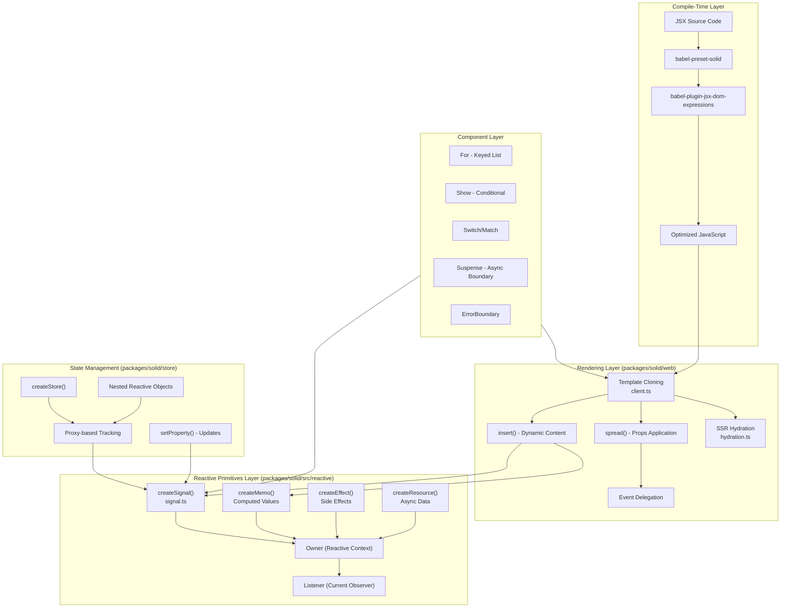
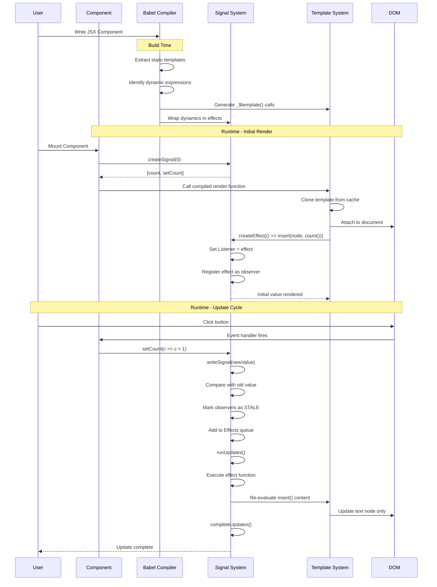
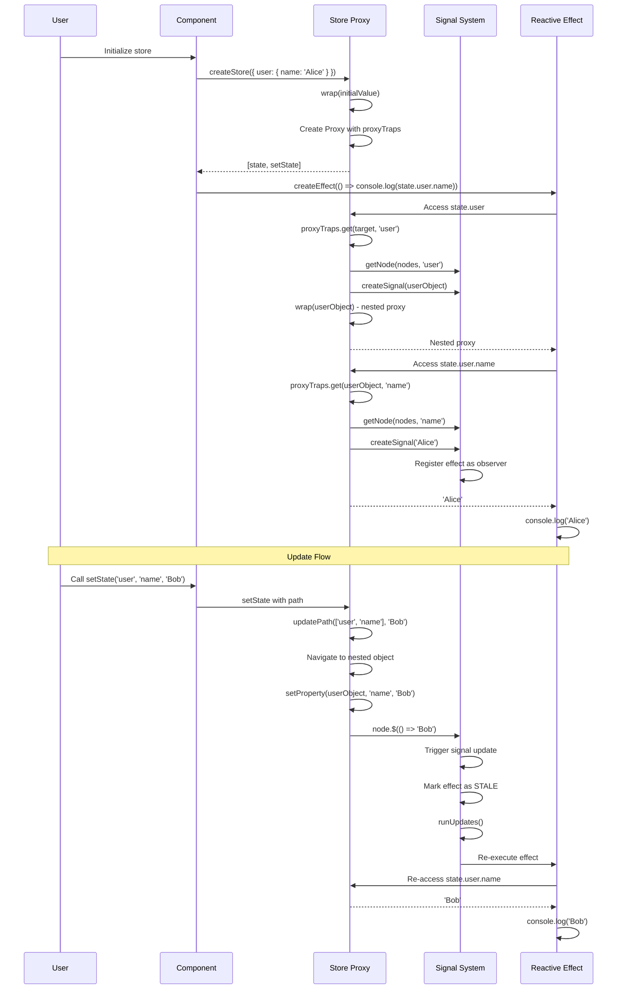
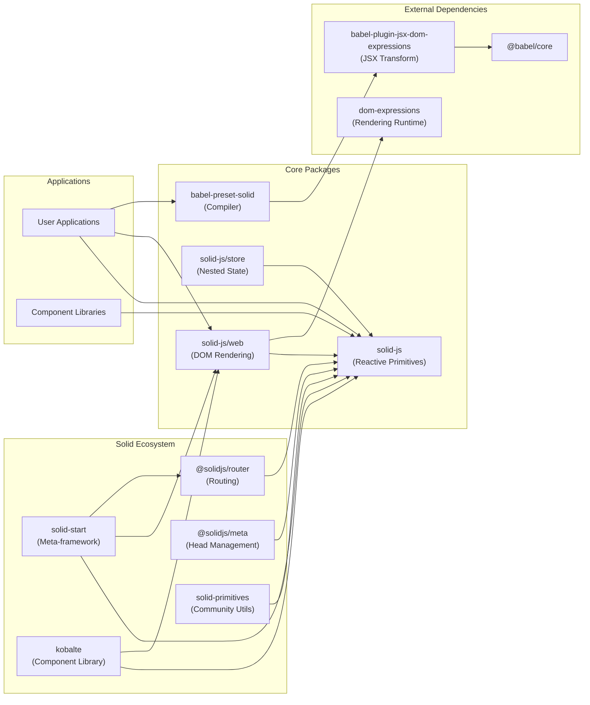

# SolidJS

> A declarative, efficient, and flexible JavaScript library for building user interfaces with fine-grained reactivity

| Metadata | |
|---|---|
| Repository | https://github.com/solidjs/solid |
| License | MIT License |
| Primary Language | TypeScript |
| Category | Web Framework |
| Analyzed Release | `v1.9.0` (2024-09-24) |
| Stars (approx.) | 35,067 |
| Generated by | Claude Sonnet 4.5 (Anthropic) |
| Generated on | 2026-02-08 |

## Overview

SolidJS is a declarative JavaScript library for building user interfaces, created by Ryan Carniato. Instead of using a Virtual DOM, it compiles JSX templates to real DOM nodes and updates them with fine-grained reactions. The library provides a render-once mental model where components are regular JavaScript functions that run once to set up the view, and only the code that depends on changed state reruns.

Problems it solves:

- Eliminates Virtual DOM overhead while maintaining declarative programming model and reactive updates
- Provides automatic dependency tracking without manual optimization or memoization requirements
- Achieves near-native JavaScript performance with minimal bundle size through compile-time optimizations
- Supports both client-side rendering and server-side rendering with streaming and progressive hydration

Positioning:

SolidJS is positioned as a high-performance alternative to React, combining the developer experience of React-like syntax with fine-grained reactivity similar to Vue 3 and Svelte. It ranks consistently at the top of the JS Framework Benchmark, competing with vanilla JavaScript in performance metrics. The library has gained significant adoption in performance-critical applications and serves as the foundation for frameworks like SolidStart.

## Architecture Overview

SolidJS employs a three-layer architecture: reactive primitives for state management, a compiler that transforms JSX into optimized DOM operations, and a rendering layer that directly manipulates real DOM nodes. The reactive system uses a push-pull model with synchronous updates, eliminating the need for a Virtual DOM diffing algorithm.



## Core Components

### Reactive Signal System (`packages/solid/src/reactive/signal.ts`)

- Responsibility: Core reactivity implementation with automatic dependency tracking
- Key files: `packages/solid/src/reactive/signal.ts` (1809 lines)
- Design patterns: Observer pattern, Push-pull hybrid model, Synchronous execution

The signal system is inspired by S.js by Adam Haile and implements fine-grained reactivity. A `SignalState<T>` maintains an array of observers (computations) and observer slots for efficient subscription management. When `readSignal()` is called within a reactive context (when `Listener` is set), it automatically registers the computation as an observer. Updates via `writeSignal()` mark all dependent computations as STALE and schedule them for re-execution.

The system uses three computation states: 0 (clean), STALE (1), and PENDING (2). The `ExecCount` global counter prevents duplicate updates within the same reactive cycle. Effects are batched and executed in a queue managed by `runUpdates()` and `completeUpdates()`.

Key features include:
- Zero-overhead dependency tracking through binding `readSignal` to signal instances
- Comparator functions for custom equality checks to prevent unnecessary updates
- Transaction support via `batch()` to defer updates until all state changes complete
- Transition API for concurrent rendering with `startTransition()`

### JSX Compiler (`packages/babel-preset-solid`)

- Responsibility: Transform JSX into optimized DOM manipulation code at build time
- Key files: `packages/babel-preset-solid/index.js`, uses `babel-plugin-jsx-dom-expressions`
- Design patterns: Compiler plugin pattern, Static template extraction

The Babel preset configures `babel-plugin-jsx-dom-expressions` with Solid-specific options. Static HTML is extracted into template strings using `_$template()`, which clones DOM nodes efficiently. Dynamic expressions are wrapped in effects that subscribe to reactive dependencies. The compiler implements several optimizations:

- Template cloning: `<div>Hello</div>` becomes `_$template('<div>Hello</div>')` and is cloned for each instance
- Event delegation: Common events like click are delegated to the document root
- Attribute optimization: Static attributes are set once, dynamic ones wrapped in effects
- Component hoisting: Built-in components like For, Show, Switch are recognized and optimized

Configuration options:
```javascript
{
  moduleName: "solid-js/web",
  builtIns: ["For", "Show", "Switch", "Match", "Suspense", ...],
  contextToCustomElements: true,
  wrapConditionals: true,
  generate: "dom"
}
```

### Store System (`packages/solid/store/src/store.ts`)

- Responsibility: Nested reactive object tracking with immutable-like API
- Key files: `packages/solid/store/src/store.ts`
- Design patterns: Proxy pattern, Nested reactivity, Path-based updates

Stores extend the signal system to handle nested objects and arrays. Each property access through the Proxy creates or retrieves a signal stored in the object's `[$NODE]` symbol property. The `proxyTraps` handler intercepts get operations, returning wrapped child objects for reactive tracking.

Updates use `setProperty()` which triggers signals for:
- The changed property
- The `$SELF` signal tracking the object itself
- The "length" property for arrays
- The `[$HAS]` signal for property existence checks

The `updatePath()` function supports complex update patterns:
```javascript
// Array of indices: update multiple items
setStore('items', [0, 2, 4], 'selected', true)

// Function predicate: filter and update
setStore('items', item => item.id === 42, 'name', 'Updated')

// Range object: update slice
setStore('items', { from: 0, to: 10, by: 2 }, 'visible', false)
```

The `unwrap()` utility extracts the raw data without proxies, useful for serialization or non-reactive operations.

### DOM Rendering Layer (`packages/solid/web/src`)

- Responsibility: Direct DOM manipulation with optimized updates
- Key files: `packages/solid/web/src/index.ts`, `packages/solid/web/src/client.ts` (from dom-expressions)
- Design patterns: Template cloning, Event delegation, Batched updates

The web package exports from `dom-expressions`, a shared rendering runtime. Key operations:

- `insert(parent, accessor, marker)`: Inserts dynamic content, automatically creating effects if accessor is a function
- `spread(node, props, isSVG)`: Applies props to elements, handling attributes, properties, events, refs, and classList
- `template(html)`: Clones templates from a WeakMap cache for efficient instance creation
- `delegateEvents(eventNames)`: Sets up document-level event delegation for common events

The `Portal` component demonstrates advanced patterns: it creates a separate render root, handles both normal mounting and shadow DOM, and properly manages cleanup when the portal is removed.

`createDynamic()` enables dynamic component selection, checking if the component is a function (custom component) or string (native element), then applying props appropriately.

### Control Flow Components (`packages/solid/src/render/index.ts`)

- Responsibility: Optimized rendering patterns for lists, conditionals, and async content
- Key files: `packages/solid/src/render/index.ts`, `packages/solid/src/reactive/array.ts`
- Design patterns: Keyed reconciliation, Memoization, Boundary pattern

Control flow components are exported from core Solid:

- `For`: Uses `mapArray()` for efficient keyed list rendering. Each item gets a stable identity based on the key, and only changed items are re-rendered. Index is provided as an accessor to avoid unnecessary updates.

- `Show`: Conditionally renders content with `when` prop. The `fallback` prop provides alternate content. Uses memoization to avoid recreating content on each toggle.

- `Switch/Match`: Multi-branch conditionals. Only one `Match` renders at a time based on the `when` condition.

- `Index`: Similar to `For` but uses index as key instead of item value. More efficient when items are primitives or order-based.

- `Suspense`: Creates a boundary for async operations. Tracks `Resource` states and shows `fallback` during loading. Integrates with SSR streaming.

- `ErrorBoundary`: Catches errors in child components using `catchError()`. Provides error recovery and isolated error handling.

### Component System (`packages/solid/src/render/component.ts`)

- Responsibility: Component lifecycle and props management
- Key files: `packages/solid/src/render/component.ts`
- Design patterns: Factory pattern, Proxy-based props, Type-safe component definitions

Components in Solid are just functions that run once. `createComponent()` handles:
- Untracking: Wraps component calls in `untrack()` to prevent auto-tracking
- Hydration: Manages hydration context for SSR
- Dev mode: Wraps components in `devComponent()` for debugging

Props are handled specially:
- `splitProps()`: Separates props into multiple objects
- `mergeProps()`: Combines props with fallback values
- Props are reactive via Proxy, accessing them in effects subscribes to changes

Type system provides several component types:
- `Component<P>`: Base component type
- `VoidComponent<P>`: Forbids children prop
- `ParentComponent<P>`: Optional children as JSX.Element
- `FlowComponent<P, C>`: Required children with specific type (for render props)

## Data Flow

### Component Rendering and Reactive Update Flow



### Store Update and Nested Reactivity Flow



## Key Design Decisions

### 1. No Virtual DOM - Direct DOM Updates

- Choice: Compile JSX to direct DOM mutations instead of using Virtual DOM diffing
- Rationale: Virtual DOM adds overhead for diffing and reconciliation. Fine-grained reactivity knows exactly what changed, making VDOM unnecessary. Template cloning provides efficient initial rendering, and reactive effects handle updates surgically.
- Trade-offs: Requires compilation (no pure runtime like React createElement). Less flexible for runtime template generation. However, gains significant performance improvements - Solid ranks near vanilla JavaScript in benchmarks. Bundle sizes are smaller (minified Solid is ~7KB vs React 42KB + ReactDOM 130KB).

### 2. Synchronous Reactivity with Push-Pull Model

- Choice: Updates propagate synchronously in a single pass, with pull-based lazy evaluation for memos
- Rationale: Synchronous updates ensure consistency - you can read state immediately after setting it. The push-pull hybrid allows memos to defer computation until accessed, avoiding unnecessary work. STALE and PENDING states enable efficient topological sorting of the dependency graph.
- Trade-offs: Can cause issues if effects trigger further state changes (potential infinite loops, detected via ExecCount). Async updates require explicit `startTransition()`. However, predictability is higher - no async timing bugs or stale closures. Performance is better as there's no scheduler overhead.

### 3. Compile-Time Optimizations for JSX

- Choice: Transform JSX at build time into optimized DOM operations with static template extraction
- Rationale: Static parts of templates never change, so extract them once and clone efficiently. Dynamic parts are wrapped in effects that subscribe to dependencies. This eliminates runtime parsing and reduces execution cost. Event delegation reduces memory and improves performance for many elements.
- Trade-offs: Requires build step and Babel configuration. IDE support depends on plugins. Cannot generate arbitrary JSX at runtime (must use `Dynamic` component). However, runtime performance is significantly better, and bundle sizes are smaller due to better tree-shaking.

### 4. Proxy-Based Store for Nested Reactivity

- Choice: Use JavaScript Proxy to track nested object property access instead of requiring explicit observation
- Rationale: Provides ergonomic API similar to plain objects - no need for special get/set syntax. Automatic tracking works at any depth. Immutable-like update API with `setState` paths prevents accidental mutations while maintaining reactivity.
- Trade-offs: Proxy has slight performance cost compared to plain objects. Debugging can be harder (proxies in devtools). IE11 incompatible (though polyfills exist). However, developer experience is excellent - no boilerplate, automatic reactivity, and type-safe with TypeScript.

### 5. Owner-Based Reactive Context and Disposal

- Choice: Every reactive computation has an Owner that manages lifecycle and nested computations
- Rationale: Creates an automatic disposal hierarchy - when owner disposes, all owned computations clean up. Context propagation through owners enables features like `useContext()`. Cleanup functions registered via `onCleanup()` are tracked per owner.
- Trade-offs: Additional memory per computation for owner tree. Manual `createRoot()` required for roots outside components. However, prevents memory leaks automatically. No need for manual effect disposal. Context works without prop drilling.

### 6. Separate Core and Web Packages

- Choice: Split reactive primitives (solid-js) from DOM rendering (solid-js/web)
- Rationale: Core reactivity is universal and can target different renderers (DOM, native, WebGL, etc.). This enables custom renderers via packages like `solid-native` or `solid-three`. Keeps core package tiny and tree-shakeable.
- Trade-offs: Requires importing from multiple packages. Slightly more complex setup. However, enables universal reactivity - same primitives work everywhere. Opens ecosystem for renderer innovation. Better code organization and smaller bundles when DOM isn't needed.

## Dependencies



## Testing Strategy

SolidJS uses a comprehensive testing approach covering unit tests, type tests, and integration tests across multiple packages.

Unit tests: Vitest is used as the test runner. Tests are located in `packages/solid/test/` and cover:
- Signal behavior and dependency tracking (`signals.spec.ts`, `signals.memo.spec.ts`)
- Component lifecycle and rendering (`component.spec.ts`, `rendering.spec.ts`)
- Resources and async state (`resource.spec.ts`)
- Array utilities and control flow (`array.spec.ts`)
- Observable interop (`observable.spec.ts`)

Type tests: TypeScript type system is validated with `*.type-tests.ts` files that use `expectType()` assertions to ensure correct type inference. Examples include:
- `signals.type-tests.ts`: Signal type inference and setter constraints
- `resource.type-tests.ts`: Resource state types and initialization
- `component.type-tests.ts`: Component prop types and children handling

Integration tests: The `packages/solid/web/test/` directory contains DOM integration tests:
- `index.spec.tsx`: Full rendering pipeline tests
- `for.spec.tsx`, `switch.spec.tsx`: Control flow component behavior
- `suspense.spec.tsx`: Async boundary testing
- `errorboundary.spec.tsx`: Error handling validation

CI/CD: GitHub Actions workflow defined in `.github/workflows/main-ci.yml` runs:
- Tests across Node.js versions
- Coverage reporting to Coveralls
- Build validation for all packages
- TypeScript type checking
- Turbo for monorepo task orchestration

Testing philosophy emphasizes behavior over implementation - tests verify observable results rather than internal state. This allows refactoring internals while maintaining API compatibility.

## Key Takeaways

1. Fine-grained reactivity enables Virtual DOM elimination: By tracking dependencies at the signal level rather than component level, SolidJS knows exactly which DOM nodes to update without diffing. This pattern can be applied to any UI framework that wants to achieve near-native performance. The key is maintaining a reactive graph where primitives notify observers directly.

2. Compilation unlocks runtime performance: Moving work to build time through static template extraction, event delegation setup, and effect wrapping reduces runtime overhead significantly. Framework authors should consider compile-time optimizations for critical paths. The trade-off of requiring a build step is worthwhile for production applications where performance matters.

3. Push-pull hybrid reactivity balances eagerness and laziness: Signals push notifications to observers synchronously, while memos pull values lazily only when accessed. This avoids both the latency of fully lazy systems and the wasted work of fully eager systems. The pattern is applicable to any reactive system that needs to balance consistency with performance.

4. Owner-based disposal prevents memory leaks automatically: By maintaining a tree of ownership relationships, cleanup happens automatically when parents dispose. This pattern eliminates entire classes of memory leak bugs common in reactive systems. The slight memory overhead is negligible compared to the reliability benefits.

5. Separation of reactive primitives from rendering enables universality: The core reactive system (createSignal, createEffect, etc.) has no DOM dependencies, allowing it to target any rendering environment. This architecture decision enables custom renderers and makes the framework future-proof for new platforms.

6. Type-safe ergonomics through proxies and inference: Using JavaScript Proxy for stores and TypeScript inference for signals provides an API that feels natural while maintaining full type safety. The lesson is that advanced JavaScript features and sophisticated TypeScript can create APIs that are both powerful and pleasant to use.

## References

- [SolidJS Official Documentation](https://docs.solidjs.com/)
- [Fine-grained reactivity - Solid Docs](https://docs.solidjs.com/advanced-concepts/fine-grained-reactivity)
- [Intro to reactivity - Solid Docs](https://docs.solidjs.com/concepts/intro-to-reactivity)
- [SolidJS Creator on Fine-Grained Reactivity as Next Frontier - The New Stack](https://thenewstack.io/solidjs-creator-on-fine-grained-reactivity-as-next-frontier/)
- [A Hands-on Introduction to Fine-Grained Reactivity - DEV Community](https://dev.to/ryansolid/a-hands-on-introduction-to-fine-grained-reactivity-3ndf)
- [SolidJS GitHub Repository](https://github.com/solidjs/solid)
- [JS Framework Benchmark](https://krausest.github.io/js-framework-benchmark/current.html)
