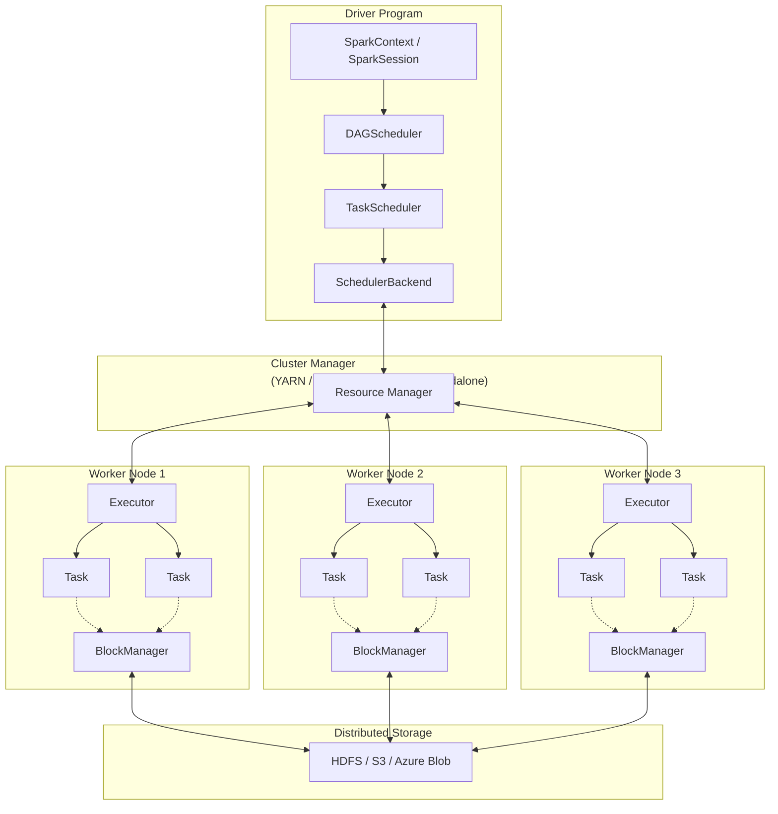
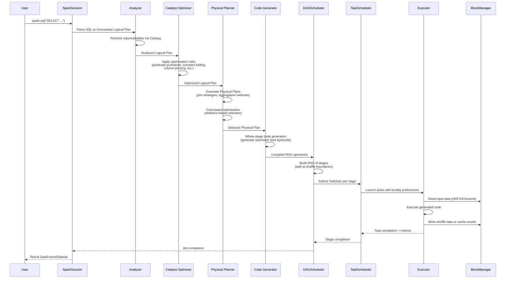
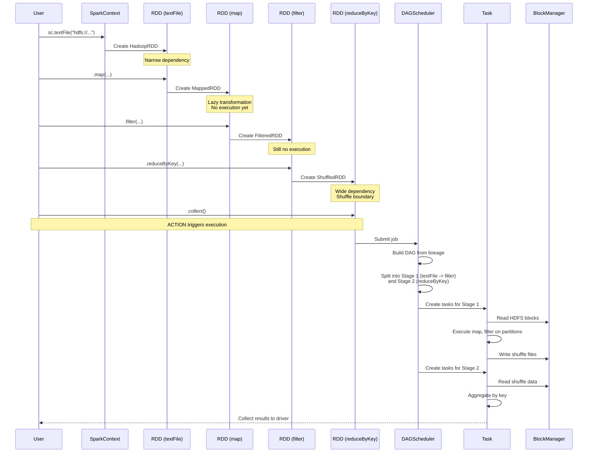
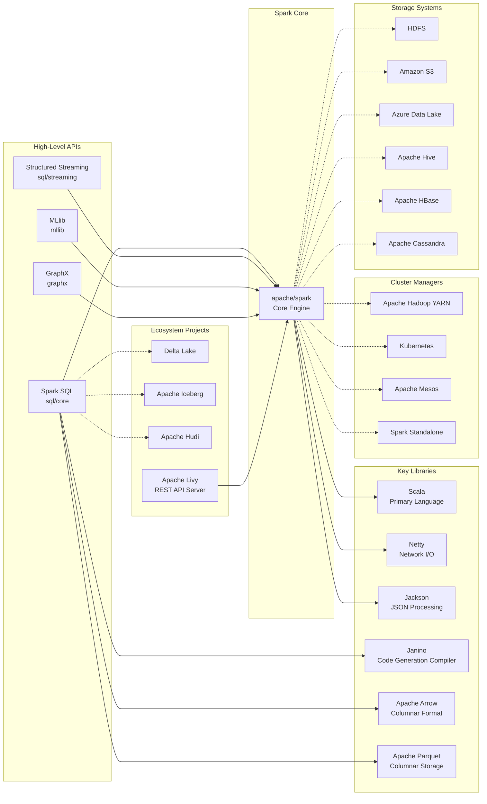

# Apache Spark

> A unified analytics engine for large-scale data processing

| Metadata | |
|---|---|
| Repository | https://github.com/apache/spark |
| License | Apache License 2.0 |
| Primary Language | Scala |
| Category | Data Processing |
| Analyzed Release | `v4.1.1` (2026-01-09) |
| Stars (approx.) | 42,774 |
| Generated by | Claude Sonnet 4.5 (Anthropic) |
| Generated on | 2026-02-08 |

## Overview

Apache Spark is an open-source unified analytics engine designed for large-scale data processing. It provides an interface for programming entire clusters with implicit data parallelism and fault tolerance, enabling high-speed processing through in-memory computation and a sophisticated DAG execution engine.

Problems it solves:

- Unified processing of batch and streaming data in a single framework, eliminating the need for separate processing systems
- In-memory computing that is up to 100x faster than Hadoop MapReduce for iterative algorithms and interactive data mining
- Simplified distributed computing through high-level APIs in Java, Scala, Python, R, and SQL, hiding the complexity of cluster management and task distribution
- Integrated ecosystem supporting SQL analytics, machine learning, graph processing, and stream processing without moving data between different systems

Positioning:

Apache Spark has become the de facto standard for big data processing, adopted by major cloud providers (AWS EMR, Azure Synapse, Google Cloud Dataproc, Databricks). It is widely used in production environments for data engineering, data science, and analytics workloads, with a vibrant ecosystem of over 1,500 contributors and integration with major data platforms including Delta Lake, Apache Iceberg, and Apache Hudi.

## Architecture Overview

Spark employs a master-worker architecture with a central driver program coordinating distributed executors. The architecture is built around Resilient Distributed Datasets (RDDs) and a sophisticated multi-stage execution engine that optimizes queries through the Catalyst optimizer and executes them efficiently via the Tungsten execution engine.

## Core Components

### SparkContext / SparkSession (`core/src/main/scala/org/apache/spark/SparkContext.scala`)

- Responsibility: Entry point for Spark applications, managing the connection to the cluster and coordinating distributed execution
- Key files: `core/src/main/scala/org/apache/spark/SparkContext.scala`, `sql/core/src/main/scala/org/apache/spark/sql/SparkSession.scala`
- Design patterns: Singleton pattern, Facade pattern

SparkContext is the original entry point for Spark 1.x applications, providing low-level RDD APIs and managing the lifecycle of a Spark application. SparkSession, introduced in Spark 2.0, serves as a unified entry point that combines SparkContext, SQLContext, and HiveContext. It provides a builder pattern for configuration and seamlessly integrates structured APIs (DataFrame, Dataset, SQL) with the underlying RDD abstraction. The session manages configuration properties, registers UDFs, and controls catalog operations.

### DAGScheduler (`core/src/main/scala/org/apache/spark/scheduler/DAGScheduler.scala`)

- Responsibility: High-level scheduling layer that computes a DAG of stages for each job
- Key files: `core/src/main/scala/org/apache/spark/scheduler/DAGScheduler.scala`
- Design patterns: Event-driven architecture, Stage-based pipeline

The DAGScheduler is responsible for converting a logical execution plan into a physical execution plan by breaking down RDD dependencies into stages. It identifies stage boundaries at shuffle operations (wide dependencies) and maintains the lineage graph for fault tolerance. When an action is called, DAGScheduler works backward from the target RDD to determine the optimal execution strategy, tracking which RDDs and stage outputs are materialized. It submits stages as sets of tasks to the TaskScheduler and resubmits failed stages if necessary. The scheduler also handles data locality optimization by preferring to schedule tasks on nodes where data is already cached.

### TaskScheduler (`core/src/main/scala/org/apache/spark/scheduler/TaskScheduler.scala`)

- Responsibility: Low-level task scheduling and resource management interface
- Key files: `core/src/main/scala/org/apache/spark/scheduler/TaskScheduler.scala`, `core/src/main/scala/org/apache/spark/scheduler/TaskSchedulerImpl.scala`
- Design patterns: Strategy pattern, Pool-based scheduling

TaskScheduler is an interface with TaskSchedulerImpl as the primary implementation. It receives task sets from DAGScheduler and submits them to the cluster for execution. The scheduler implements two scheduling modes: FIFO (first-in-first-out) and FAIR (fair sharing between multiple concurrent jobs). It manages task locality levels (PROCESS_LOCAL, NODE_LOCAL, RACK_LOCAL, ANY) and delays scheduling to achieve better data locality. TaskScheduler handles task failures, speculative execution of slow tasks, and blacklisting of problematic executors. It communicates with the cluster manager through the SchedulerBackend interface, which has different implementations for YARN, Kubernetes, Mesos, and standalone modes.

### Executor (`core/src/main/scala/org/apache/spark/executor/Executor.scala`)

- Responsibility: Worker process that runs tasks and stores data for the application
- Key files: `core/src/main/scala/org/apache/spark/executor/Executor.scala`
- Design patterns: Thread pool pattern, Actor model

Executors are JVM processes launched on worker nodes that remain alive for the duration of the Spark application. Each executor runs tasks in a thread pool and provides in-memory storage for RDDs that are cached. Executors manage their own BlockManager for storing shuffle data and cached partitions. They report heartbeats and task metrics back to the driver, including execution time, shuffle read/write bytes, and memory usage. Executors are isolated from each other, with each application having its own executor processes. When a task fails, the executor can retry it or report the failure back to the driver. Executors also handle broadcast variable fetching and manage off-heap memory for Tungsten operations.

### BlockManager (`core/src/main/scala/org/apache/spark/storage/BlockManager.scala`)

- Responsibility: Distributed key-value store for blocks of data across the cluster
- Key files: `core/src/main/scala/org/apache/spark/storage/BlockManager.scala`, `core/src/main/scala/org/apache/spark/storage/BlockManagerMaster.scala`
- Design patterns: Master-worker pattern, Storage level abstraction

BlockManager is the fundamental storage abstraction in Spark, managing all data storage including RDD partitions, shuffle outputs, and broadcast variables. Each executor has its own BlockManager instance, while the driver hosts a BlockManagerMaster that tracks the locations of all blocks across the cluster. The system supports multiple storage levels (MEMORY_ONLY, MEMORY_AND_DISK, DISK_ONLY, OFF_HEAP) with configurable serialization and replication. BlockManager implements an LRU eviction policy when memory is full and transparently spills to disk for memory-and-disk storage levels. It also handles block transfers between executors during shuffle operations and implements a torrent-style broadcast mechanism for efficient distribution of large values.

### Catalyst Optimizer (`sql/catalyst/src/main/scala/org/apache/spark/sql/catalyst/optimizer/Optimizer.scala`)

- Responsibility: Query optimization framework for Spark SQL that generates optimized logical and physical plans
- Key files: `sql/catalyst/src/main/scala/org/apache/spark/sql/catalyst/`, `sql/core/src/main/scala/org/apache/spark/sql/execution/SparkOptimizer.scala`
- Design patterns: Rule-based optimization, Tree transformation

Catalyst is an extensible query optimizer built on functional programming constructs in Scala. It operates in four phases: Analysis (resolving column names and table references using the Catalog), Logical Optimization (applying rule-based transformations such as predicate pushdown, constant folding, column pruning, and boolean expression simplification), Physical Planning (generating multiple physical plans and selecting the optimal one using cost-based optimization), and Code Generation (producing optimized Java bytecode using the Janino compiler). The optimizer represents queries as trees of relational operators and expressions, allowing rules to pattern-match and transform subtrees. Catalyst's extensibility allows users to add custom optimization rules and data sources with pushdown capabilities.

### Tungsten Execution Engine (`sql/core/src/main/scala/org/apache/spark/sql/execution/`)

- Responsibility: Physical execution layer focused on CPU and memory efficiency
- Key files: `sql/core/src/main/scala/org/apache/spark/sql/execution/WholeStageCodegenExec.scala`, `core/src/main/scala/org/apache/spark/memory/`
- Design patterns: Code generation, Custom memory management

Tungsten is Spark's execution engine designed to push performance closer to the limits of modern hardware. It implements three key optimizations: Whole-stage code generation (collapsing multiple operators into a single optimized function), Custom memory management (using off-heap binary format and sun.misc.Unsafe for direct memory access, avoiding JVM garbage collection overhead), and Cache-aware computation (algorithms designed for modern CPU cache hierarchies). Tungsten uses a columnar storage format for in-memory data with better compression and cache locality. The code generation phase produces optimized Java code that avoids virtual function calls and reduces object allocation. Tungsten's memory manager supports both on-heap and off-heap allocation modes, with unified memory management that dynamically adjusts between execution and storage memory.

### Structured Streaming (`sql/core/src/main/scala/org/apache/spark/sql/execution/streaming/`)

- Responsibility: Scalable and fault-tolerant stream processing engine built on Spark SQL
- Key files: `sql/core/src/main/scala/org/apache/spark/sql/execution/streaming/StreamExecution.scala`, `sql/core/src/main/scala/org/apache/spark/sql/execution/streaming/MicroBatchExecution.scala`
- Design patterns: Micro-batch processing, Incremental query execution

Structured Streaming treats streaming data as an unbounded table that is continuously appended to. Queries on this table produce a result table that is updated incrementally. The engine supports three output modes: Complete (entire result table is written), Append (only new rows are written), and Update (only modified rows are written). Structured Streaming guarantees exactly-once semantics through checkpointing and write-ahead logs. It supports event-time processing with watermarks for handling late data and implements stateful operations like windowed aggregations, stream-stream joins, and arbitrary stateful processing via mapGroupsWithState. The micro-batch execution model processes data in small batches (configurable intervals) while also supporting continuous processing mode for ultra-low-latency applications.

## Data Flow

### Spark SQL Query Execution Flow

### RDD Transformation and Action Flow

## Key Design Decisions

### 1. In-Memory Computing with RDD Abstraction

- Choice: Resilient Distributed Datasets as immutable, partitioned collections with lineage-based fault tolerance
- Rationale: Traditional MapReduce writes intermediate results to disk, causing significant I/O overhead for iterative algorithms. RDDs keep data in memory across operations and use lineage graphs for recomputation on failure instead of replication. This design enables 10-100x speedup for iterative machine learning and interactive analytics while maintaining fault tolerance
- Trade-offs: Increased memory requirements compared to disk-based systems. Out-of-memory errors require spilling to disk or repartitioning. Memory pressure management is critical for production deployments. However, the performance gains for in-memory workloads far outweigh the operational complexity

### 2. Lazy Evaluation with DAG Execution

- Choice: Transformations are lazy (building a DAG), actions trigger execution with global optimization
- Rationale: By deferring execution until an action is called, Spark can optimize the entire workflow. DAGScheduler can apply optimizations like pipelining narrow transformations, eliminating unnecessary stages, and optimizing shuffle operations. This contrasts with eager evaluation where each operation executes immediately without global context
- Trade-offs: Debugging can be harder since errors surface during actions, not transformations. The full execution plan isn't visible until action time. However, the ability to optimize across the entire pipeline and pipeline multiple transformations into a single stage provides significant performance benefits

### 3. Unified Engine for Batch and Streaming

- Choice: Structured Streaming treats streams as unbounded tables with incremental queries
- Rationale: Instead of separate APIs and engines for batch and streaming (like Storm + Hadoop), Spark unifies them under the DataFrame/Dataset API. This allows the same Catalyst optimizations and Tungsten execution for both workloads. Users can switch between batch and streaming with minimal code changes
- Trade-offs: Micro-batch architecture introduces latency (typically 100ms-1s) compared to true streaming systems. Continuous processing mode addresses this but with fewer features. The unified approach trades pure streaming performance for developer productivity and code reuse

### 4. Two-Level Scheduling Architecture

- Choice: DAGScheduler for stage-level scheduling, TaskScheduler for task-level scheduling with pluggable SchedulerBackend
- Rationale: Separating concerns between logical planning (DAGScheduler) and physical resource management (TaskScheduler/SchedulerBackend) allows Spark to run on multiple cluster managers (YARN, Kubernetes, Mesos, standalone) without changing core scheduling logic. DAGScheduler focuses on optimizing the execution plan while TaskScheduler handles resource allocation and task placement
- Trade-offs: Additional abstraction layers add complexity. The two-level model can make end-to-end debugging more difficult. However, this design enables cluster manager portability and allows specialized optimizations at each level (e.g., stage-level pipelining vs. task-level locality)

### 5. Catalyst Optimizer with Rule-Based and Cost-Based Optimization

- Choice: Extensible optimizer using tree transformations with both rule-based (predicate pushdown, constant folding) and cost-based optimization (join reordering, broadcast join selection)
- Rationale: Query optimization requires both deterministic transformations (rules) and statistics-based decisions (cost models). Catalyst's rule engine allows the community to contribute optimizations while cost-based optimization (CBO) uses table statistics for better physical planning. The tree transformation approach leverages Scala's pattern matching for clean, maintainable code
- Trade-offs: Rule application order matters and can be non-obvious. CBO requires accurate statistics which may not be available for all data sources. Optimizer bugs can be subtle and hard to reproduce. However, the extensibility has enabled continuous performance improvements and allows users to add custom optimization rules

### 6. Tungsten Execution with Whole-Stage Code Generation

- Choice: Generate optimized Java bytecode for entire query stages instead of interpretive execution
- Rationale: The JVM's JIT compiler works best with tight loops in a single function. By generating code that processes multiple rows in a tight loop (eliminating virtual function calls and iterator overhead), Tungsten achieves performance close to hand-written code. Combined with columnar memory layout and off-heap memory management, this minimizes CPU and memory bottlenecks
- Trade-offs: Code generation has overhead and fallback to interpreted execution when code size exceeds JVM limits. Debugging generated code is difficult. Complex expressions may not benefit from codegen. However, for typical analytical queries, the 2-10x speedup justifies the complexity

### 7. BlockManager for Unified Storage Layer

- Choice: Single abstraction for RDD caching, shuffle data, and broadcast variables with configurable storage levels
- Rationale: Rather than separate systems for different data types, BlockManager provides a unified interface. This simplifies memory management and allows dynamic allocation between storage and execution memory. The master-worker design (BlockManagerMaster tracking all blocks) enables efficient data locality scheduling and fault tolerance
- Trade-offs: The unified memory manager can lead to contention between execution and storage. Tuning storage levels and memory fractions requires understanding workload characteristics. However, dynamic memory allocation between execution and storage (since Spark 1.6) reduces the need for manual tuning

## Dependencies

## Testing Strategy

Apache Spark employs a comprehensive multi-layered testing approach to ensure reliability across its distributed system.

Unit tests: Each module has extensive unit tests using ScalaTest framework. Core components like RDD transformations, scheduler logic, and Catalyst rules have dedicated test suites. Mock objects simulate cluster behavior for testing scheduler decisions. The test suite includes over 30,000 unit tests covering edge cases, error conditions, and API contracts.

Integration tests: Full end-to-end tests run actual Spark jobs on local clusters. SQL tests include golden file comparisons where query results are verified against expected outputs. Streaming tests use MemorySink and MemoryStream for deterministic testing. PySpark tests verify cross-language compatibility.

Performance regression tests: Automated benchmarks track performance across releases using the spark-perf framework. TPC-DS benchmark suite validates SQL performance at scale. Continuous benchmarking infrastructure runs on dedicated hardware to detect performance regressions.

CI/CD: GitHub Actions runs the full test suite on every pull request across multiple Scala versions, Java versions, and Hadoop versions. Separate builds test different module combinations (Hive, Kubernetes, YARN). The project uses Docker containers for consistent test environments. Nightly builds run extended test suites including stress tests and compatibility tests with ecosystem projects.

## Key Takeaways

1. Lazy evaluation with global optimization: Deferring execution until actions allows Spark to optimize the entire DAG globally. This architectural choice enables pipelining transformations, eliminating redundant shuffles, and pushing predicates to data sources. The lesson applies broadly to data processing systems where upfront analysis of the workflow can unlock significant optimizations

2. Lineage-based fault tolerance: Instead of replicating data for fault tolerance, Spark uses RDD lineage to recompute lost partitions. This trades compute for storage and network overhead, making fault tolerance almost free in the common case of no failures. The approach is applicable to any distributed computation where operations are deterministic

3. Separation of logical and physical planning: Catalyst's architecture separates what to compute (logical plan) from how to compute it (physical plan). This enables query portability across execution engines and allows continuous optimization improvements without breaking user code. The pattern is valuable for any system with multiple execution backends

4. Unified memory management: Dynamic allocation between execution memory and storage memory (RDD cache) eliminates the need to manually tune memory fractions. The unified memory manager automatically adjusts based on workload, improving usability and performance. This design pattern applies to any system managing limited resources with competing demands

5. Whole-stage code generation: Collapsing multiple operators into a single generated function eliminates iterator overhead and enables JIT optimization. This technique achieves performance comparable to hand-written code while maintaining high-level APIs. The approach is applicable to any system where performance-critical paths can be identified and specialized

6. Micro-batch streaming architecture: Treating streams as unbounded tables with incremental queries unifies batch and streaming APIs. This enables code reuse and consistent semantics across both paradigms. The design demonstrates how the right abstraction can unify seemingly different workloads, though it requires accepting micro-batch latency

## References

- [Apache Spark Official Documentation](https://spark.apache.org/docs/latest/)
- [Apache Spark Architecture Deep Dive](https://medium.com/@KuldeepsinhVaghela/apache-spark-architecture-deep-dive-how-the-driver-executors-and-cluster-manager-work-together-9569ea48e9e5)
- [Spark Architecture Explained: DAG, Executors, Stages & Tasks](https://medium.com/@mohanaslvn/spark-architecture-explained-dag-executors-stages-tasks-simplified-80e46b9989fa)
- [DAGScheduler - The Internals of Spark Core](https://books.japila.pl/apache-spark-internals/scheduler/DAGScheduler/)
- [Exploring Apache Spark's Catalyst Optimizer and Tungsten Execution Engine](https://towardsdev.com/exploring-apache-sparks-catalyst-optimizer-and-tungsten-execution-engine-57c51927cf1a)
- [Understanding Adaptive Query Execution (AQE) and Dynamic Partition Pruning (DPP)](https://medium.com/@ty.berretty/understanding-adaptive-query-execution-aqe-and-dynamic-partition-pruning-dpp-in-pyspark-53c1a255e82c)
- [Apache Spark GitHub Repository](https://github.com/apache/spark)
- [Spark RDD vs DataFrame vs Dataset](https://sparkbyexamples.com/spark/spark-rdd-vs-dataframe-vs-dataset/)
- [7 Ways to Optimize Apache Spark Performance (2026)](https://www.chaosgenius.io/blog/spark-performance-tuning/)
- [Catalyst Optimizer: The Power of Spark SQL](https://medium.com/@Shkha_24/catalyst-optimizer-the-power-of-spark-sql-cad8af46097f)
