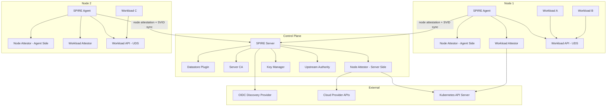
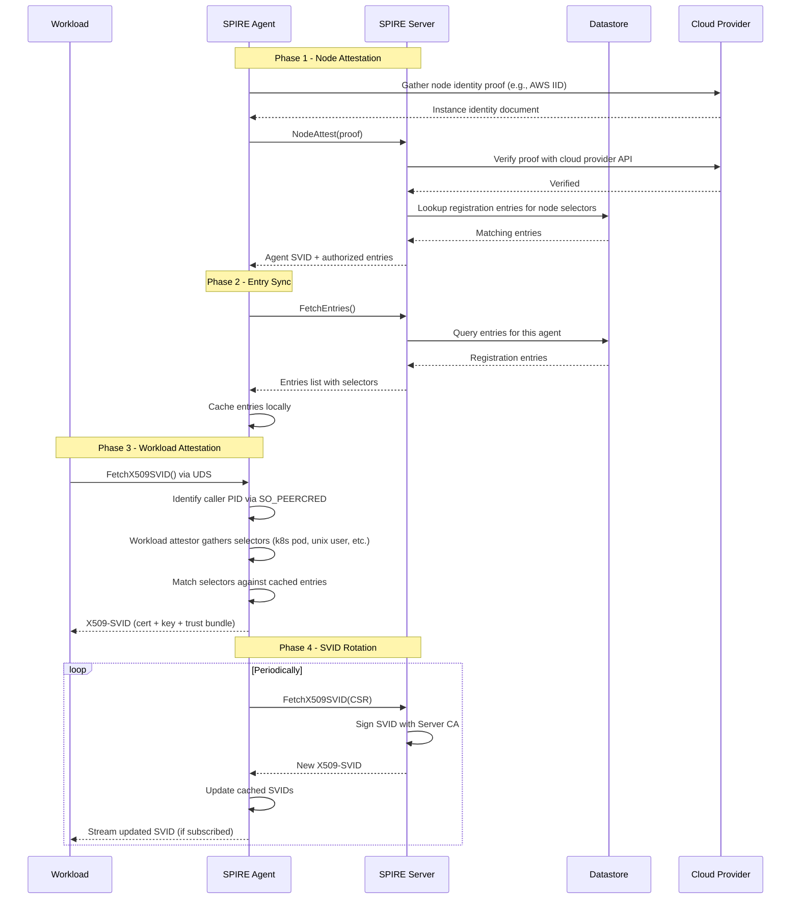
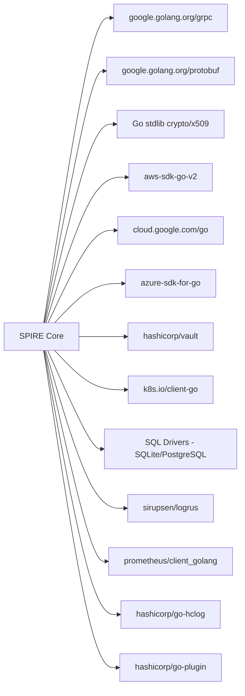

# SPIRE

> SPIFFE Runtime Environment for workload identity in distributed systems

| Metadata | |
|---|---|
| Repository | https://github.com/spiffe/spire |
| License | Apache License 2.0 |
| Primary Language | Go |
| Category | Security |
| Analyzed Release | `v1.14.1` (2026-01-15) |
| Stars (approx.) | 2,000+ |
| Generated by | Claude Opus 4.6 (Anthropic) |
| Generated on | 2026-02-08 |

## Overview

SPIRE solves the fundamental problem of workload identity in distributed systems. In microservice
architectures, containers, and multi-cloud environments, workloads need to prove their identity to
other workloads without relying on network-level security (IP addresses, firewalls) or long-lived
static credentials (API keys, certificates) that are difficult to rotate and easy to steal.

SPIRE is the reference implementation of the SPIFFE (Secure Production Identity Framework For Everyone)
specification. It provides a production-ready system for issuing and managing cryptographic identities
(SPIFFE Verifiable Identity Documents, or SVIDs) to workloads based on attestation -- verifying the
identity of both the node running the workload and the workload process itself using trusted third parties.

The project is a CNCF Graduated project and serves as the foundation for zero-trust networking in
Kubernetes, VMs, and bare-metal environments.

### Problems Solved

- Static credentials (API keys, long-lived certificates) that are hard to rotate and easy to compromise
- Network-based identity (IP addresses) that is unreliable in dynamic environments
- No standard mechanism for workload-to-workload authentication across heterogeneous infrastructure
- Certificate management complexity (issuance, rotation, revocation) at scale
- Lack of identity attestation -- no way to verify "this workload is what it claims to be"

---

## Architecture Overview

---

## Core Components

### 1. SPIRE Server

Responsibility: Act as the central authority for identity management. The server maintains the
registration database, performs node attestation, signs SVIDs, manages trust bundles, and exposes
gRPC APIs for agent communication and administrative operations.

Key Files:
- `pkg/server/server.go` -- Main server initialization and lifecycle management
- `pkg/server/config.go` -- Server configuration parsing and validation
- `pkg/server/ca/` -- Certificate Authority implementation for SVID signing
- `pkg/server/catalog/` -- Server plugin catalog management
- `pkg/server/datastore/` -- Datastore interface for registration entries and bundles
- `pkg/server/endpoints/` -- gRPC API endpoint implementations
- `pkg/server/registration/` -- Workload registration entry management
- `pkg/server/node/` -- Node resolution and management
- `pkg/server/cache/` -- Server-side entry caching
- `pkg/server/authorizedentries/` -- Authorized entry filtering per agent
- `pkg/server/authpolicy/` -- Authorization policy enforcement for server APIs
- `pkg/server/credtemplate/` -- Credential template management for SVID issuance
- `pkg/server/credvalidator/` -- Credential validation logic
- `pkg/server/svid/` -- SVID signing and management
- `pkg/server/bundle/` -- Trust bundle management and distribution
- `pkg/server/plugin/` -- Server-side plugin interface definitions
- `cmd/spire-server/main.go` -- Server binary entry point
- `cmd/spire-server/cli/` -- Server CLI commands (run, entry, agent, bundle, etc.)

Design Patterns:
- Plugin Architecture: All major subsystems (datastore, key manager, node attestor, upstream authority) are pluggable
- Facade Pattern: The server exposes a unified gRPC API while internally delegating to multiple subsystems
- Repository Pattern: The datastore abstraction provides a clean interface over registration entry storage

### 2. SPIRE Agent

Responsibility: Run on each node, perform node attestation with the server, receive and cache
workload registration entries, perform workload attestation for local processes, and expose the
SPIFFE Workload API over a Unix Domain Socket.

Key Files:
- `pkg/agent/agent.go` -- Main agent initialization and lifecycle management
- `pkg/agent/config.go` -- Agent configuration parsing and validation
- `pkg/agent/manager/` -- SVID cache manager that syncs with the server
- `pkg/agent/catalog/` -- Agent plugin catalog management
- `pkg/agent/attestor/` -- Node attestation orchestration
- `pkg/agent/endpoints/` -- Workload API endpoint implementation (UDS)
- `pkg/agent/client/` -- gRPC client for communicating with the SPIRE Server
- `pkg/agent/svid/` -- Agent SVID rotation and management
- `pkg/agent/storage/` -- Persistent storage for agent state (join token, etc.)
- `pkg/agent/api/` -- Agent-side API handlers
- `pkg/agent/plugin/` -- Agent-side plugin interface definitions
- `pkg/agent/workloadkey/` -- Workload key generation
- `pkg/agent/trustbundlesources/` -- Trust bundle sources for the agent
- `cmd/spire-agent/main.go` -- Agent binary entry point
- `cmd/spire-agent/cli/` -- Agent CLI commands

Design Patterns:
- Cache-Aside Pattern: Agent caches registration entries and SVIDs, refreshing from server periodically
- Proxy Pattern: Agent acts as a proxy between workloads and the server for SVID issuance
- Plugin Architecture: Workload attestors and node attestors are pluggable

### 3. Attestation System

Responsibility: Verify the identity of nodes and workloads using trusted third-party evidence.
Attestation is the core security mechanism that enables SPIRE to issue identities based on
verifiable properties rather than static secrets.

Key Files:
- `pkg/agent/attestor/` -- Agent-side node attestation orchestration
- `pkg/server/node/` -- Server-side node resolution using attestation results
- `pkg/common/catalog/` -- Plugin catalog for attestor plugin management
- `pkg/agent/plugin/` -- Agent-side attestor plugin interfaces
- `pkg/server/plugin/` -- Server-side attestor plugin interfaces

Attestation Types:
- Node Attestation: Verifies the identity of the node (e.g., AWS IID, GCP, Azure, Kubernetes PSAT, join token)
- Workload Attestation: Verifies the identity of the workload process (e.g., Unix PID, Kubernetes pod, Docker container)

Design Patterns:
- Chain of Responsibility: Multiple attestors can contribute selectors to a workload identity
- Challenge-Response: Node attestation uses challenge-response protocols with cloud provider metadata
- Plugin Architecture: Attestors are dynamically loaded plugins, enabling extension without core changes

### 4. Plugin System

Responsibility: Provide a pluggable architecture for all major server and agent subsystems,
enabling SPIRE to integrate with diverse infrastructure without hard-coding provider-specific logic.

Key Files:
- `pkg/common/catalog/` -- Core plugin catalog implementation
- `pkg/common/plugin/` -- Common plugin utilities and interfaces
- `pkg/server/catalog/` -- Server plugin catalog (datastore, key manager, node attestor, etc.)
- `pkg/agent/catalog/` -- Agent plugin catalog (node attestor, workload attestor, key manager)
- `pkg/common/pluginconf/` -- Plugin configuration utilities

Plugin Categories (Server):
- DataStore: Registration entry and bundle storage (SQL, in-memory)
- KeyManager: Cryptographic key storage (disk, memory, AWS KMS, GCP KMS)
- NodeAttestor: Node identity verification (AWS IID, GCP, Azure, Kubernetes, join token)
- UpstreamAuthority: Upstream CA integration (disk, AWS PCA, Vault, SPIRE)

Plugin Categories (Agent):
- NodeAttestor: Node identity proof generation
- WorkloadAttestor: Process identity verification (Unix, Kubernetes, Docker)
- KeyManager: Agent-side key management

Design Patterns:
- Abstract Factory: Plugin catalogs create instances from configuration
- Strategy Pattern: Each plugin category defines an interface with interchangeable implementations
- Dependency Injection: Plugins are injected into server/agent components via the catalog

### 5. Workload API (SPIFFE Specification)

Responsibility: Expose the SPIFFE Workload API over a Unix Domain Socket, enabling workloads to
request their SVIDs (X.509 certificates or JWT tokens) and trust bundles without knowing the
details of the identity infrastructure.

Key Files:
- `pkg/agent/endpoints/` -- Workload API gRPC server implementation
- `pkg/agent/api/` -- API handler logic for SVID and bundle requests
- `proto/spire/` -- Protobuf definitions for SPIRE-specific APIs
- `proto/private/` -- Internal protobuf definitions
- `support/oidc-discovery-provider/` -- OIDC discovery endpoint for JWT-SVID validation

Design Patterns:
- Facade Pattern: The Workload API presents a simple interface for complex identity operations
- Observer Pattern: Workloads can stream updates when SVIDs or bundles change
- Specification Pattern: Implements the SPIFFE specification for interoperability

---

## Data Flow

---

## Key Design Decisions

### 1. Two-Phase Attestation (Node + Workload)

Choice: Separate identity verification into node attestation (is this machine trusted?) and
workload attestation (is this process authorized?) rather than a single verification step.

Rationale: Two-phase attestation provides defense in depth. Even if an attacker compromises a
node, they cannot impersonate arbitrary workloads unless the workload attestation also passes.
This separation also enables different trust models for different infrastructure layers.

Trade-offs:
- Pro: Defense in depth -- compromising one layer is insufficient
- Pro: Enables heterogeneous infrastructure (mix of cloud providers, VMs, containers)
- Pro: Workload attestation is independent of infrastructure provider
- Con: More complex setup with two types of attestors to configure
- Con: Additional latency during initial attestation

### 2. Agent-Per-Node Model with Unix Domain Socket

Choice: Deploy one SPIRE Agent per node, exposing the Workload API over a Unix Domain Socket
(UDS) rather than over the network.

Rationale: UDS provides kernel-level caller identification (SO_PEERCRED on Linux), enabling
the agent to determine the PID, UID, and GID of the requesting process without any authentication
tokens. This is a critical security property -- workloads do not need any pre-existing credentials
to obtain their identity.

Trade-offs:
- Pro: Kernel-enforced caller identification -- no tokens or secrets required
- Pro: UDS traffic never leaves the node, reducing the attack surface
- Pro: Low latency for local SVID requests
- Con: Requires an agent on every node (DaemonSet in Kubernetes)
- Con: UDS does not work across network boundaries

### 3. Plugin-Based Architecture for All Major Subsystems

Choice: Make every major subsystem (datastore, key manager, attestors, upstream authority) a
pluggable interface with configurable implementations.

Rationale: SPIRE must integrate with diverse infrastructure -- AWS, GCP, Azure, Kubernetes,
bare metal, HashiCorp Vault, custom PKI. A plugin architecture enables this integration without
the core codebase needing to know about specific providers.

Trade-offs:
- Pro: Extensible to any infrastructure without core changes
- Pro: Clear separation between core logic and provider-specific code
- Pro: Enables third-party plugins for custom attestation methods
- Con: Plugin interface versioning and compatibility complexity
- Con: Debugging plugin issues can be harder than monolithic code
- Con: Performance overhead of plugin abstraction layers

### 4. Short-Lived SVIDs with Automatic Rotation

Choice: Issue short-lived X.509 certificates (typically 1-hour TTL) with automatic rotation,
rather than long-lived certificates that require manual renewal.

Rationale: Short-lived credentials minimize the window of compromise. If a certificate is stolen,
it expires quickly. Automatic rotation eliminates the operational burden of certificate management
and removes a common source of outages (expired certificates).

Trade-offs:
- Pro: Minimized blast radius from credential theft
- Pro: No manual certificate rotation or renewal
- Pro: Eliminates certificate expiration outages
- Con: Requires reliable connectivity to the SPIRE Agent for rotation
- Con: Agent or server downtime can cause certificate expiration
- Con: Higher frequency of cryptographic operations

### 5. Registration-Based Identity Model

Choice: Require explicit registration of workload identities (SPIFFE IDs mapped to selector sets)
before workloads can receive SVIDs.

Rationale: Explicit registration ensures that only authorized workloads receive identities.
This prevents the "ambient identity" problem where any process on a trusted node could claim
any identity. Registration entries act as a policy layer between attestation and identity issuance.

Trade-offs:
- Pro: Explicit authorization -- no ambient identity assumption
- Pro: Fine-grained control over which workloads get which identities
- Pro: Audit trail of identity assignments
- Con: Operational overhead of maintaining registration entries
- Con: Registration entries must be kept in sync with deployments
- Con: Can create a single point of failure if the registration database is unavailable

---

## Dependencies

---

## Testing Strategy

SPIRE has a thorough testing approach across its distributed architecture:

- Unit Tests: Core packages contain extensive unit tests. `pkg/server/server_test.go` tests
  server initialization and lifecycle. Each plugin implementation has its own test suite.

- Plugin Tests: Each plugin (attestor, datastore, key manager) has dedicated tests that verify
  both the plugin interface contract and provider-specific behavior.

- Integration Tests: End-to-end tests exercise the full attestation flow, including node attestation,
  entry sync, and workload SVID issuance.

- API Tests: gRPC API endpoints are tested with mock plugins to verify request handling,
  authorization, and error cases.

- Catalog Tests: Plugin catalog tests verify that plugins are correctly loaded, configured,
  and lifecycle-managed.

- Common Utilities: The `pkg/common/` directory contains extensively tested utilities for
  certificate handling (`pemutil/`), crypto operations (`cryptoutil/`), configuration parsing
  (`config/`), and container identification (`containerinfo/`).

- Health Check Tests: The `pkg/common/health/` package tests health check endpoints.

---

## Key Takeaways

1. SPIRE demonstrates that workload identity is a foundational security primitive for zero-trust
   architectures. By providing cryptographic identity based on attestation rather than static
   secrets, SPIRE eliminates entire classes of credential management problems (rotation, revocation,
   leaked secrets).

2. The two-phase attestation model (node + workload) is a powerful defense-in-depth strategy.
   It enables SPIRE to work across heterogeneous infrastructure while maintaining strong security
   guarantees -- even a compromised node cannot issue arbitrary identities.

3. The Unix Domain Socket approach for the Workload API is an elegant solution to the bootstrap
   problem. Workloads can obtain their identity without any pre-existing credentials, because
   the kernel provides caller identification. This eliminates the chicken-and-egg problem of
   "how do you authenticate to get your authentication credentials."

4. Short-lived SVIDs with automatic rotation represent a paradigm shift from traditional PKI.
   Rather than treating certificates as long-lived assets to be managed, SPIRE treats them as
   ephemeral credentials that are continuously refreshed -- dramatically reducing operational
   burden and security risk.

5. The plugin architecture enables SPIRE to serve as a universal identity layer across any
   infrastructure. Whether the deployment target is AWS, GCP, Azure, on-premise, or a mix
   of all of them, the same SPIRE core provides consistent identity semantics through
   provider-specific plugins.

---

## References

- [GitHub Repository: spiffe/spire](https://github.com/spiffe/spire)
- [SPIFFE Concepts: SPIRE Architecture](https://spiffe.io/docs/latest/spire-about/spire-concepts/)
- [Configuring SPIRE](https://spiffe.io/docs/latest/deploying/configuring/)
- [SPIRE Agent Configuration Reference](https://spiffe.io/docs/latest/deploying/spire_agent/)
- [Registering Workloads](https://spiffe.io/docs/latest/deploying/registering/)
- [SPIRE: A Case for Attestable Workload Identity](https://www.solo.io/blog/spire-attestable-workload-identity)
- [Zero to Trusted: SPIFFE and SPIRE Demystified](https://www.spletzer.com/2025/03/zero-to-trusted-spiffe-and-spire-demystified/)
