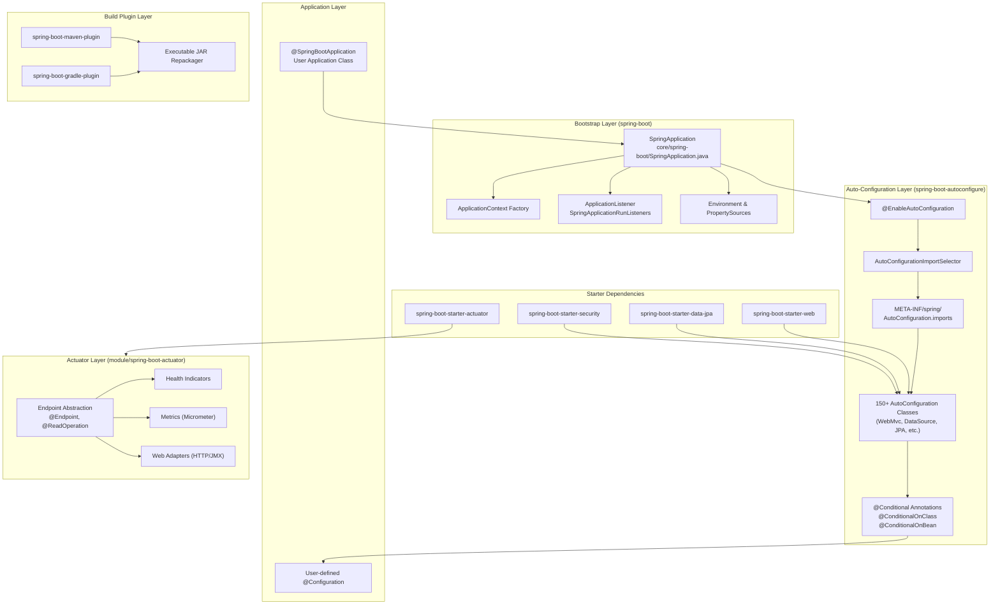
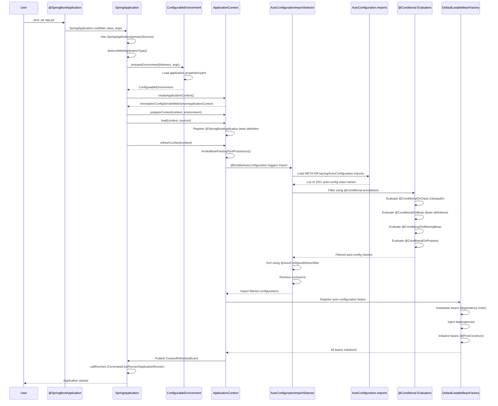
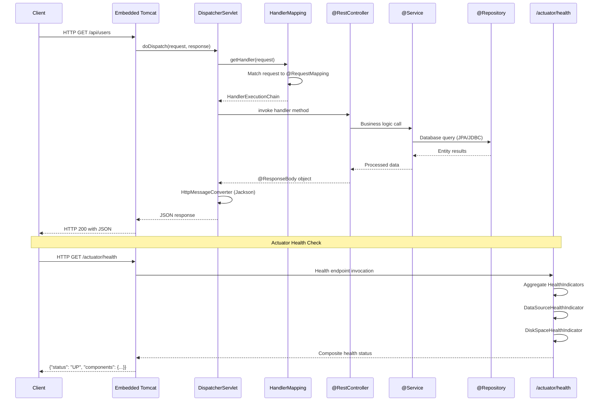
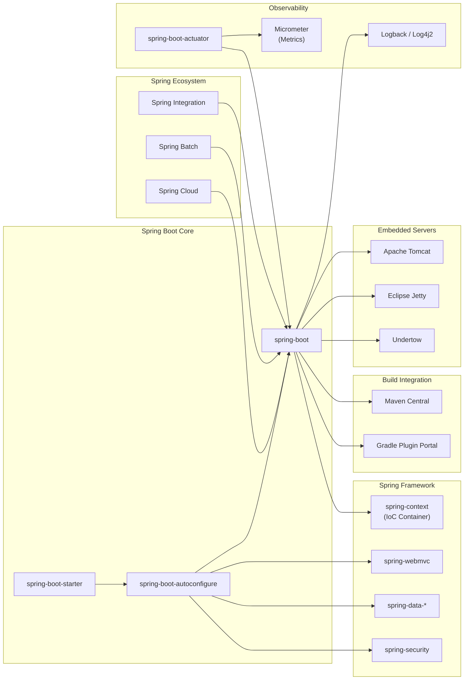

# Spring Boot

> Spring Boot helps you to create Spring-powered, production-grade applications and services with absolute minimum fuss

| Metadata | |
|---|---|
| Repository | https://github.com/spring-projects/spring-boot |
| License | Apache-2.0 |
| Primary Language | Java |
| Analyzed Release | `v4.1.0-M1` (2026-01-22) |
| Stars (approx.) | 79,866 |
| Generated by | Claude Sonnet 4.5 (Anthropic) |
| Generated on | 2026-02-08 |

## Overview

Spring Boot is an opinionated framework that simplifies the creation of production-ready Spring applications by providing auto-configuration, embedded servers, and starter dependencies. It takes an opinionated view of the Spring platform to enable developers to quickly build stand-alone applications that can be run with java -jar, eliminating the need for XML configuration and boilerplate code.

Problems it solves:

- Eliminates complex Spring configuration through convention-over-configuration and auto-configuration mechanisms
- Reduces dependency management overhead by providing curated starter POMs that bundle compatible library versions
- Simplifies deployment by embedding servlet containers (Tomcat, Jetty, Undertow), enabling self-contained executable JARs
- Provides production-ready features such as metrics, health checks, and externalized configuration out-of-the-box

Positioning:

Spring Boot has become the de facto standard for building Java microservices and enterprise applications. It serves as the foundation for Spring Cloud (distributed systems), Spring Data (data access), and the broader Spring ecosystem. Widely adopted in enterprise environments and cloud-native architectures, competing with frameworks like Micronaut and Quarkus, but maintaining dominance through ecosystem maturity and backward compatibility.

## Architecture Overview

Spring Boot employs a layered architecture consisting of the bootstrap layer (SpringApplication), auto-configuration layer (conditional bean registration), actuator layer (production monitoring), and build plugin layer (Maven/Gradle integration). The framework leverages Spring's dependency injection container while adding intelligent defaults and classpath-based configuration.

## Core Components

### SpringApplication (`core/spring-boot/src/main/java/org/springframework/boot/SpringApplication.java`)

- Responsibility: Bootstrap and launch Spring applications with opinionated defaults
- Key files: `SpringApplication.java`, `SpringApplicationRunListeners.java`, `ApplicationContextFactory.java`
- Design patterns: Builder pattern, Template Method pattern, Factory pattern

SpringApplication is the entry point for all Spring Boot applications, invoked via the static run() method. It orchestrates the entire application lifecycle including creating the appropriate ApplicationContext (servlet/reactive/default), loading property sources, publishing application events, and refreshing the context. The class supports customization through builder methods and maintains an event-driven architecture using SpringApplicationRunListener instances. Critical methods include prepareEnvironment(), createApplicationContext(), prepareContext(), and refreshContext().

### Auto-Configuration Import Selector (`core/spring-boot-autoconfigure/src/main/java/org/springframework/boot/autoconfigure/AutoConfigurationImportSelector.java`)

- Responsibility: Dynamically select and import auto-configuration classes based on classpath and conditions
- Key files: `AutoConfigurationImportSelector.java`, `EnableAutoConfiguration.java`, `AutoConfiguration.imports`
- Design patterns: Strategy pattern, Deferred Import Selector pattern

AutoConfigurationImportSelector implements DeferredImportSelector and is triggered by the @EnableAutoConfiguration annotation (meta-annotated by @SpringBootApplication). It loads auto-configuration class names from META-INF/spring/org.springframework.boot.autoconfigure.AutoConfiguration.imports, filters them based on @Conditional annotations, sorts them according to @AutoConfigureBefore/@AutoConfigureAfter, and removes duplicates. The selector uses ImportCandidates for efficient loading and supports exclusion through the exclude/excludeName attributes and spring.autoconfigure.exclude property.

### Conditional Annotations (`core/spring-boot-autoconfigure/src/main/java/org/springframework/boot/autoconfigure/condition/`)

- Responsibility: Conditional bean registration based on classpath, beans, properties, and resources
- Key files: `ConditionalOnClass.java`, `ConditionalOnBean.java`, `ConditionalOnMissingBean.java`, `ConditionalOnProperty.java`
- Design patterns: Strategy pattern, Condition interface implementation

The condition package provides a comprehensive set of annotations that control auto-configuration activation. Each annotation is backed by a Condition implementation that evaluates during bean definition registration. ConditionalOnClass checks for class presence on the classpath, ConditionalOnBean checks for existing bean definitions, ConditionalOnMissingBean ensures beans are only created when not already defined, and ConditionalOnProperty evaluates against environment properties. These annotations enable Spring Boot's intelligent back-off mechanism, allowing user configurations to take precedence over auto-configurations.

### Starter Dependencies (`starter/`)

- Responsibility: Provide curated dependency bundles for common use cases
- Key files: 100+ starter modules (e.g., `spring-boot-starter-web`, `spring-boot-starter-data-jpa`)
- Design patterns: Facade pattern, Dependency aggregation

Starters are empty JAR files that serve as dependency aggregators, bundling compatible versions of libraries for specific functionality. Each starter typically includes the necessary auto-configuration module, core libraries, and default implementations. For example, spring-boot-starter-web includes spring-webmvc, spring-boot-starter-tomcat (embedded server), and jackson (JSON processing). This design eliminates version conflicts and provides a single dependency declaration for complex technology stacks. Test variants (e.g., spring-boot-starter-test) include testing frameworks with compatible versions.

### Actuator Endpoints (`module/spring-boot-actuator/src/main/java/org/springframework/boot/actuate/endpoint/`)

- Responsibility: Expose production-ready monitoring and management capabilities
- Key files: `endpoint/annotation/Endpoint.java`, `health/HealthEndpoint.java`, `metrics/MetricsEndpoint.java`
- Design patterns: Plugin architecture, Operation-based endpoint model

Actuator provides a framework for exposing operational information through endpoints annotated with @Endpoint, @ReadOperation, @WriteOperation, and @DeleteOperation. The endpoint abstraction is technology-agnostic, with web adapters (HTTP/JMX) converting endpoint operations to protocol-specific formats. Built-in endpoints include health (aggregates HealthIndicator beans), metrics (integrated with Micrometer), info, beans, env, and configprops. The Health endpoint supports hierarchical indicators and composite health aggregation using HealthIndicatorRegistry.

### Build Plugins (`build-plugin/spring-boot-maven-plugin/` and `build-plugin/spring-boot-gradle-plugin/`)

- Responsibility: Package Spring Boot applications as executable JARs/WARs with embedded dependencies
- Key files: Maven plugin (AbstractBootMojo.java, RepackageMojo.java), Gradle plugin (BootJar.java)
- Design patterns: Plugin pattern, JAR-in-JAR packaging

The build plugins repackage standard JAR files into executable "fat JARs" using a custom JAR layout. Dependencies are nested inside BOOT-INF/lib/, application classes in BOOT-INF/classes/, and a custom JarLauncher in the root with a manifest pointing to the main class. This structure allows java -jar execution without unpacking. The plugins also support layered JARs for optimized Docker image builds, AOT (Ahead-of-Time) compilation integration, and build metadata generation. The repackager preserves original JAR entries while adding bootloader classes from spring-boot-loader.

## Data Flow

### Application Startup and Auto-Configuration Flow

### HTTP Request Handling Flow (Web MVC)

## Key Design Decisions

### 1. Convention Over Configuration with Auto-Configuration

- Choice: Classpath-based auto-configuration using @Conditional annotations rather than explicit XML or Java configuration
- Rationale: Eliminates boilerplate configuration for common scenarios while preserving Spring's flexibility. Enables zero-config applications that work out-of-the-box but remain fully customizable. Conditional evaluation ensures configurations only activate when dependencies are present and not already defined by users.
- Trade-offs: Magic behavior can be opaque to newcomers (requires understanding of auto-configuration mechanics). Debugging configuration issues requires knowledge of conditional evaluation order. Potential for unexpected bean creation if classpaths contain unintended dependencies. Mitigated by comprehensive logging and actuator's conditions endpoint.

### 2. Starter Dependencies as Dependency Aggregators

- Choice: Create empty JAR starter modules that aggregate compatible dependency versions rather than requiring users to manage individual library versions
- Rationale: Simplifies dependency management by providing tested, compatible library combinations. Reduces version conflict issues through curated BOMs (Bill of Materials). Enables single-line dependency declarations for complex technology stacks (e.g., web, JPA, security). Supports modular composition through orthogonal starters.
- Trade-offs: Increases dependency count in projects (transitive dependencies). Users may include unused libraries if starters are too coarse-grained. Upgrade cycles depend on Spring Boot release schedule. Version overrides require understanding of dependency management hierarchy. Mitigated by fine-grained starters and clear documentation.

### 3. Embedded Servlet Container with Executable JAR Packaging

- Choice: Embed servlet containers (Tomcat/Jetty/Undertow) within application JARs using custom JAR layout and JarLauncher rather than deploying WARs to external application servers
- Rationale: Simplifies deployment to single java -jar command. Enables self-contained, versioned deployments suitable for containers and cloud platforms. Eliminates servlet container version conflicts and configuration drift. Supports rapid development with embedded servers. Aligns with microservices architecture patterns.
- Trade-offs: Larger JAR file sizes (20-40MB for simple apps). Custom classloader required for nested JAR dependencies (JarLauncher). Cannot share libraries across multiple applications on same server. Less suitable for traditional enterprise environments standardized on external app servers. Mitigated by layered JAR support for Docker optimization.

### 4. Deferred Import Selector for Auto-Configuration Timing

- Choice: Use DeferredImportSelector for auto-configuration loading instead of regular @Import or @Configuration
- Rationale: Ensures all user-defined @Configuration classes are processed before auto-configurations, enabling user configurations to take precedence. Allows conditional evaluation based on complete bean definition registry. Enables ordering and filtering of auto-configurations after user beans are registered. Supports exclusion and override mechanisms.
- Trade-offs: More complex configuration processing lifecycle. Difficult to debug timing-related issues. Auto-configurations cannot depend on each other during import selection (must use @AutoConfigureAfter/Before). Additional processing overhead during startup. Benefits outweigh complexity by enabling Spring Boot's key promise: intelligent defaults with easy overrides.

### 5. Actuator's Technology-Agnostic Endpoint Abstraction

- Choice: Define endpoints using @Endpoint, @ReadOperation, @WriteOperation annotations with web/JMX adapters rather than directly exposing HTTP or JMX beans
- Rationale: Separates operational logic from transport concerns, enabling endpoints to be exposed via multiple protocols (HTTP, JMX, future protocols) without duplication. Simplifies endpoint implementation by focusing on business logic rather than protocol details. Enables consistent security, caching, and filtering across all endpoints. Supports custom endpoint technologies through adapter pattern.
- Trade-offs: Additional abstraction layer adds complexity. Web-specific features (HTTP headers, status codes) require adapter extensions. Custom endpoint operations must follow operation annotation conventions. Limited flexibility for protocol-specific optimizations. Design prioritizes consistency and extensibility over transport-specific optimization.

## Dependencies

## Testing Strategy

Spring Boot provides a comprehensive testing framework through spring-boot-starter-test, which bundles JUnit 5, AssertJ, Mockito, and Spring Test. The framework emphasizes slice testing to reduce context loading overhead.

Unit tests: @WebMvcTest, @DataJpaTest, and @JsonTest annotations enable focused testing of specific layers by loading only relevant auto-configurations. MockBean and SpyBean annotations integrate Mockito with Spring's dependency injection. @TestConfiguration allows test-specific bean definitions without affecting production configurations.

Integration tests: @SpringBootTest annotation loads the full application context with support for mock web environments (MOCK, RANDOM_PORT, DEFINED_PORT). TestRestTemplate and WebTestClient provide fluent APIs for HTTP testing. @AutoConfigureMockMvc integrates MockMvc without starting an actual HTTP server. @TestPropertySource and @DynamicPropertySource enable property overrides for testing.

CI/CD: GitHub Actions workflows in .github/workflows/ execute comprehensive test suites including unit tests, integration tests, smoke tests, and system tests. Gradle build configuration supports parallel test execution and test filtering. Codecov integration tracks test coverage. Multi-JDK testing ensures compatibility across Java versions (17, 21, 25).

## Key Takeaways

1. Conditional Auto-Configuration Pattern: Spring Boot's @Conditional annotations combined with DeferredImportSelector enable intelligent defaults that automatically back-off when users define custom configurations. This pattern can be applied to any framework or library that needs to provide sensible defaults while remaining fully customizable. The key is evaluating conditions after user configurations are registered, ensuring explicit configurations always win.

2. Starter Dependencies as API Contracts: Treating curated dependency bundles as stable API contracts simplifies version management and reduces dependency conflicts. This pattern is valuable for any ecosystem where multiple libraries must work together. The separation of API (starter interface) from implementation (auto-configuration) enables backward compatibility while allowing internal refactoring.

3. Layered Architecture for Executable Artifacts: The executable JAR packaging strategy with custom classloaders and nested dependency layout demonstrates how to create self-contained, portable artifacts that require minimal runtime dependencies. This approach works well for cloud-native deployments where portability and reproducibility are critical. The layered JAR extension optimizes for container image caching, showing how traditional packaging can evolve for modern deployment targets.

## References

- [Spring Boot Official Documentation](https://docs.spring.io/spring-boot)
- [Spring Boot Reference Guide - Auto-Configuration](https://docs.spring.io/spring-boot/reference/using/auto-configuration.html)
- [Spring Boot Reference Guide - Creating Your Own Auto-configuration](https://docs.spring.io/spring-boot/reference/features/developing-auto-configuration.html)
- [How Spring Boot Auto-Configuration Works](https://medium.com/@AlexanderObregon/how-spring-boot-auto-configuration-works-68f631e03948)
- [Demystifying Spring Boot Magic: Starters, Auto-configuration](https://bhardwajprashant.medium.com/demystifying-spring-boot-magic-starters-auto-configuration-and-building-your-own-ec22d56bb68e)
- [A Custom Auto-Configuration with Spring Boot - Baeldung](https://www.baeldung.com/spring-boot-custom-auto-configuration)
- [Understanding Spring Boot Auto Configuration - Coding Shuttle](https://www.codingshuttle.com/spring-boot-handbook/spring-boot-auto-configuration/)
- [Spring Boot GitHub Repository](https://github.com/spring-projects/spring-boot)
