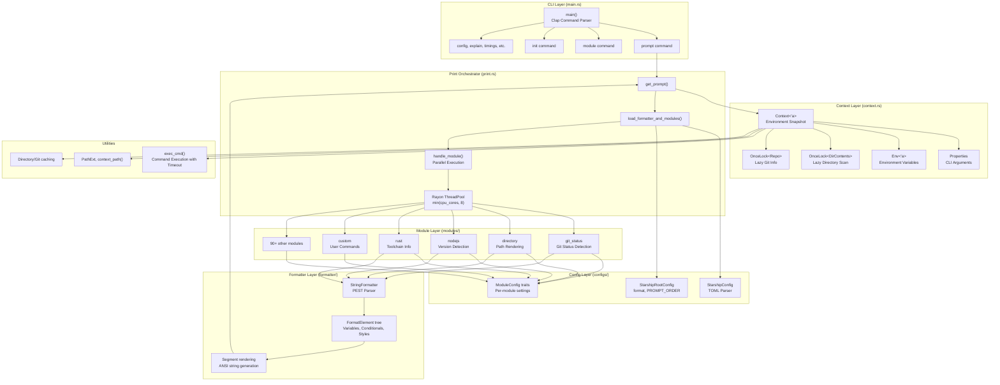

# Starship

> The minimal, blazing-fast, and infinitely customizable prompt for any shell

| Metadata | |
|---|---|
| Repository | https://github.com/starship/starship |
| License | ISC License |
| Primary Language | Rust |
| Category | CLI Tool |
| Analyzed Release | `v1.24.2` (2025-12-30) |
| Stars (approx.) | 53,982 |
| Generated by | Claude Opus 4.6 (Anthropic) |
| Generated on | 2026-02-08 |

## Overview

Starship is a cross-shell prompt generator written in Rust that provides fast, customizable, and intelligent prompt rendering for any shell. It detects contextual information about the current directory and environment, displaying relevant details such as Git status, programming language versions, cloud context, and more.

Problems it solves:

- Unified prompt experience across different shells (Bash, Zsh, Fish, PowerShell, Nushell, etc.) eliminating the need to maintain separate prompt configurations
- Performance bottlenecks in traditional shell prompts through parallel module execution and lazy evaluation
- Complexity of building feature-rich prompts from scratch by providing 100+ pre-built modules with sensible defaults
- Context switching overhead for developers working with multiple programming languages, cloud providers, and version control systems

Positioning:

Starship positions itself as the modern successor to shell-specific prompts like Oh My Zsh themes and Spaceship prompt. Unlike Oh My Zsh which is Zsh-specific, Starship works universally across all major shells. Compared to alternatives like Powerline (written in Python) or Pure (Zsh-only), Starship delivers significantly faster rendering through Rust's performance and parallel execution. It has become the de facto standard for cross-shell prompt customization with over 50,000 GitHub stars.

## Architecture Overview

Starship employs a modular, pipeline-based architecture where the CLI entry point orchestrates parallel module execution through the Context abstraction, followed by formatting and shell-specific output rendering. The design emphasizes zero-cost abstractions, lazy evaluation, and data-oriented composition.



## Core Components

### Context (`src/context.rs`)

- Responsibility: Provides immutable environment snapshot and shared utilities to all modules during prompt rendering
- Key files: `src/context.rs`, `src/context_env.rs`
- Design patterns: Builder pattern for construction, Lazy initialization via `OnceLock<T>` for expensive operations

The `Context<'a>` struct is the central data structure passed to every module. It encapsulates the current working directory (`current_dir`), logical directory path (`logical_dir`), parsed configuration (`StarshipConfig`), shell type detection (`Shell` enum), and target prompt type (`Target::Main | Right | Continuation`). Expensive operations like directory scanning and Git repository detection are wrapped in `OnceLock<T>` fields, ensuring they are computed only once if any module needs them. The context provides testable abstractions for environment variables (`get_env`, `get_env_os`) and command execution (`exec_cmd`) which can be mocked in unit tests. Terminal width detection enables responsive formatting through `terminal_size::terminal_size()`.

### Module System (`src/module.rs`, `src/modules/*`)

- Responsibility: Implements the plugin architecture where each module independently computes and formats its output
- Key files: `src/module.rs`, `src/modules/` directory with 100+ module implementations
- Design patterns: Strategy pattern for module variants, Template method pattern for common module structure

Each module in the `src/modules/` directory implements a function with signature `pub fn module<'a>(context: &'a Context) -> Option<Module<'a>>`. The `Module` struct contains a collection of `Segment` instances representing styled text fragments. Modules return `None` when their condition is not met (e.g., `rust` module returns `None` if not in a Rust project). The `ALL_MODULES` constant array in `src/module.rs` registers all available modules. Module execution is parallelized through Rayon's `par_iter()` when processing the `$all` meta-variable. Each module loads its configuration through the `ModuleConfig` trait, implementing type-safe deserialization from TOML with defaults. Complex modules like `git_status` use lazy evaluation and caching strategies to minimize filesystem operations.

### Print Orchestrator (`src/print.rs`)

- Responsibility: Coordinates the entire prompt rendering pipeline from configuration loading to final output
- Key files: `src/print.rs`
- Design patterns: Orchestrator pattern, Map-reduce pattern for parallel module execution

The `get_prompt()` function is the main entry point for prompt rendering. It first loads the format string from configuration through `load_formatter_and_modules()`, which parses the `format` field in `starship.toml` using the `StringFormatter`. The formatter's `map_variables_to_segments()` method is called with a closure that resolves each variable (representing a module) by invoking `handle_module()`. For the special `$all` variable, all modules not explicitly referenced are executed in parallel via `par_iter()`. Individual modules are cached in a `HashMap` to prevent duplicate execution when referenced multiple times. The final output is assembled through `AnsiStrings` optimization which deduplicates redundant ANSI escape codes, then wrapped for shell-specific escaping requirements through `wrap_colorseq_for_shell()`.

### String Formatter (`src/formatter/string_formatter.rs`, `src/formatter/parser.rs`)

- Responsibility: Parses format strings with variables, conditionals, and styling into executable templates
- Key files: `src/formatter/string_formatter.rs`, `src/formatter/parser.rs`, `src/formatter/model.rs`
- Design patterns: Interpreter pattern, Parser combinator through PEST grammar

The `StringFormatter` uses a PEST-based parser defined in `src/formatter/parser.pest` to transform format strings like `[$symbol($version )]($style)` into a tree of `FormatElement` nodes. The grammar supports variables (`$variable`), style wrappers (`($style)`), conditionals (`(text)[condition]`), and escaped characters. Variables are resolved through three mapping methods: `map()` for plain text variables, `map_style()` for style variables that return ANSI color codes, and `map_variables_to_segments()` for variables that return pre-styled `Segment` collections. Meta-variables like `$all` are expanded through `map_meta()` before parsing. The final `parse()` method recursively evaluates the `FormatElement` tree, applying conditionals and styles to produce a flat `Vec<Segment>` ready for rendering. Parallel evaluation is used when resolving multiple variables through Rayon's `par_iter_mut()`.

### Configuration System (`src/config.rs`, `src/configs/*`)

- Responsibility: Loads, validates, and provides type-safe access to user configuration from `starship.toml`
- Key files: `src/config.rs`, `src/configs/starship_root.rs`, `src/configs/` module config files
- Design patterns: Type-safe builder pattern, Default trait for sensible defaults

Configuration loading starts in `StarshipConfig::initialize()` which searches for `starship.toml` in standard locations (current directory, `$XDG_CONFIG_HOME`, `~/.config`). The TOML is parsed using the `toml` crate into a `toml::Table`. The `StarshipRootConfig` struct in `src/configs/starship_root.rs` defines top-level configuration including the `format` string and `PROMPT_ORDER` default. Each module has a corresponding config struct in `src/configs/` implementing `ModuleConfig` trait with `try_load()` method for deserialization. Configuration uses `serde` with `#[serde(default)]` attributes ensuring missing fields fall back to sensible defaults. The `indexmap` crate preserves TOML key ordering. Style strings are parsed through `parse_style_string()` into `nu_ansi_term::Style` objects for rendering.

## Data Flow

### Typical Prompt Rendering Flow

```mermaid
sequenceDiagram
    participant Shell
    participant Main as main.rs
    participant Print as print::get_prompt()
    participant Context as Context::new()
    participant Config as StarshipConfig
    participant Formatter as StringFormatter
    participant Rayon as Rayon ThreadPool
    participant Module1 as git_status module
    participant Module2 as directory module
    participant Module3 as nodejs module
    participant Output as stdout

    Shell->>Main: starship prompt --status=0
    Main->>Context: Context::new(properties, Target::Main)
    Context->>Config: StarshipConfig::initialize()
    Config-->>Context: Parsed TOML config
    Context->>Context: Detect shell type from $STARSHIP_SHELL
    Context->>Context: Get current_dir, logical_dir
    Context-->>Main: Context instance

    Main->>Print: get_prompt(&context)
    Print->>Config: Load root_config.format
    Config-->>Print: "[$all](bold green)$line_break$character"
    Print->>Formatter: StringFormatter::new(format)
    Formatter-->>Print: Parsed FormatElement tree

    Print->>Formatter: map_variables_to_segments(|var|)

    alt Variable is "$all"
        Formatter->>Rayon: par_iter() over all_modules_uniq()

        par Parallel execution
            Rayon->>Module1: git_status::module(context)
            Module1->>Context: get_repo()?
            Context->>Context: OnceLock::get_or_init(|| discover_repo())
            Context-->>Module1: Repo info
            Module1->>Module1: Detect staged/unstaged/conflicts
            Module1->>Formatter: StringFormatter for git_status.format
            Module1-->>Rayon: Vec&lt;Segment&gt;

            Rayon->>Module2: directory::module(context)
            Module2->>Context: current_dir
            Module2->>Module2: Truncate path per config
            Module2-->>Rayon: Vec&lt;Segment&gt;

            Rayon->>Module3: nodejs::module(context)
            Module3->>Context: get_env("PATH")?
            Module3->>Context: exec_cmd("node", ["--version"])
            Context-->>Module3: CommandOutput("v20.11.0")
            Module3-->>Rayon: Vec&lt;Segment&gt;
        end

        Rayon-->>Formatter: Flattened Vec&lt;Segment&gt; from all modules
    else Variable is specific module
        Formatter->>Module1: handle_module("git_status", context)
        Module1-->>Formatter: Vec&lt;Segment&gt;
    end

    Formatter->>Formatter: Recursively parse FormatElement tree
    Formatter->>Formatter: Apply styles and conditionals
    Formatter-->>Print: Final Vec&lt;Segment&gt;

    Print->>Print: AnsiStrings() - deduplicate ANSI codes
    Print->>Print: wrap_colorseq_for_shell(output, context.shell)
    Print-->>Output: Rendered prompt string with ANSI codes
    Output-->>Shell: Display prompt
```

## Key Design Decisions

### 1. Rust as Implementation Language

- Choice: Implement the entire prompt generator in Rust rather than shell scripts, Python, or Go
- Rationale: Shell prompts are executed on every command, making performance critical. Rust provides zero-cost abstractions, memory safety without garbage collection, and fearless concurrency through the ownership system. The Rust ecosystem offers high-quality crates for parsing (pest), ANSI rendering (nu-ansi-term), parallelism (rayon), and TOML configuration (toml/serde)
- Trade-offs: Higher barrier to entry for contributors compared to scripting languages. Compilation times can be slow (though Starship uses caching). Distribution requires pre-compiled binaries rather than simple script installation. However, the performance gains are substantial - typical prompt rendering takes 10-50ms compared to 200-500ms for Python/shell-based alternatives

### 2. Parallel Module Execution via Rayon

- Choice: Execute independent modules in parallel using Rayon's work-stealing thread pool with configurable thread count (default: minimum of CPU cores and 8)
- Rationale: Many modules perform I/O-bound operations (reading files, executing commands, querying Git) that can run concurrently. Parallel execution dramatically reduces total rendering time when multiple modules are active. Rayon's thread pool eliminates the overhead of spawning new threads on every prompt
- Trade-offs: Introduces non-deterministic ordering of module output unless explicitly sequenced. Requires careful attention to shared state (Context is immutable, modules communicate only through return values). Thread pool overhead may exceed benefits for simple prompts with few modules. The default cap at 8 threads prevents overwhelming systems with high core counts

### 3. Lazy Evaluation with OnceLock for Expensive Operations

- Choice: Wrap expensive context operations (Git repository detection, directory scanning) in `OnceLock<T>` cells that compute values only when first accessed
- Rationale: Many modules never need Git information or full directory contents. Computing these upfront would waste resources. `OnceLock` provides thread-safe lazy initialization without runtime overhead - it's zero-cost when never accessed. This enables adding rich context without penalizing minimal configurations
- Trade-offs: Slightly more complex API - modules must handle `Option` return values. First module to access a lazy field pays the full cost, potentially creating uneven module execution times. Errors during lazy initialization must be cached to prevent repeated failed attempts (Starship caches `Result<T, Error>` not just `T`)

### 4. PEST Grammar for Format String Parsing

- Choice: Define format string syntax using PEST parser generator rather than regex or hand-written parser
- Rationale: Format strings support nested structures (conditionals within style wrappers), escaped characters, and complex variable substitution. PEST provides a clean, maintainable grammar definition in `parser.pest` that generates efficient PEG parsers. The grammar serves as documentation and enables precise error reporting
- Trade-offs: PEST adds compile-time dependency and generated code size. Parse errors can be cryptic for users with invalid format strings. Alternative approaches like template languages (Handlebars, Tera) were rejected as too heavyweight. The custom grammar provides just enough power (variables, conditionals, styles) without full programming language complexity

### 5. Module Configuration through ModuleConfig Trait

- Choice: Implement per-module configuration as strongly-typed Rust structs implementing `ModuleConfig` trait, deserialized from TOML via Serde
- Rationale: Type-safe configuration prevents runtime errors from typos or invalid values. Serde's derive macros eliminate boilerplate for TOML parsing. The `#[serde(default)]` attribute provides sensible defaults when fields are missing. Each module owns its configuration schema, enabling independent evolution
- Trade-offs: Configuration changes require recompilation (though Starship reads config at runtime, schema is compile-time). Documentation must be maintained separately from code (though `config-schema` feature generates JSON Schema). Adding new config options is more involved than key-value maps, but catches errors earlier and provides better IDE support

### 6. Shell-Agnostic Design with Shell-Specific Adapters

- Choice: Design the core rendering engine to be shell-agnostic, with thin adapters for shell-specific escaping and initialization
- Rationale: Prompt rendering logic (module execution, formatting, styling) is identical across shells. Only the final output escaping and integration hooks differ. Centralizing logic reduces duplication and ensures feature parity. The `Shell` enum and `wrap_colorseq_for_shell()` function encapsulate differences (e.g., Tcsh requires escaping `!`, Fish needs `\x1b[J` control code)
- Trade-offs: Cannot leverage shell-specific features (e.g., Zsh's advanced prompt expansion). Some shells have unique quirks requiring special cases (detected via runtime checks). Shell initialization scripts (`starship init`) must be maintained for each shell, though these are minimal

## Dependencies

```mermaid
graph LR
    subgraph Core["Starship Core"]
        Starship["starship/starship"]
    end

    subgraph CLI["CLI & Config"]
        Clap["clap<br/>Command-line parsing"]
        ClapComplete["clap_complete<br/>Shell completions"]
        Toml["toml<br/>TOML parsing"]
        TomlEdit["toml_edit<br/>TOML manipulation"]
        Serde["serde/serde_json<br/>Serialization"]
    end

    subgraph Rendering["Rendering & Formatting"]
        NuAnsiTerm["nu-ansi-term<br/>ANSI terminal styling"]
        UnicodeWidth["unicode-width<br/>Grapheme width calculation"]
        UnicodeSegmentation["unicode-segmentation<br/>Grapheme clusters"]
        TerminalSize["terminal_size<br/>Width detection"]
    end

    subgraph Parsing["Parser & Templates"]
        Pest["pest/pest_derive<br/>PEG parser generator"]
    end

    subgraph Concurrency["Concurrency & Performance"]
        Rayon["rayon<br/>Data parallelism"]
        ParkingLot["parking_lot<br/>Fast synchronization"]
        OnceLock["std::sync::OnceLock<br/>Lazy initialization"]
    end

    subgraph VCS["Version Control"]
        Gix["gix<br/>Pure Rust Git implementation"]
    end

    subgraph System["System Integration"]
        Dirs["dirs<br/>Platform-specific paths"]
        Which["which<br/>Executable location"]
        Whoami["whoami<br/>User/host information"]
        ProcessControl["process_control<br/>Command timeout"]
    end

    subgraph Utilities["Utilities"]
        Regex["regex<br/>Pattern matching"]
        Chrono["chrono<br/>Date/time handling"]
        Semver["semver<br/>Version parsing"]
        Versions["versions<br/>Version comparison"]
    end

    subgraph Optional["Optional Features"]
        Battery["starship-battery<br/>Battery status"]
        NotifyRust["notify-rust<br/>Desktop notifications"]
        Schemars["schemars<br/>JSON Schema generation"]
    end

    Starship --> Clap & ClapComplete & Toml & TomlEdit & Serde
    Starship --> NuAnsiTerm & UnicodeWidth & UnicodeSegmentation & TerminalSize
    Starship --> Pest
    Starship --> Rayon & ParkingLot & OnceLock
    Starship --> Gix
    Starship --> Dirs & Which & Whoami & ProcessControl
    Starship --> Regex & Chrono & Semver & Versions
    Starship -.->|optional| Battery & NotifyRust & Schemars
```



## Testing Strategy

Starship employs a comprehensive testing strategy combining unit tests, integration tests, fixture-based testing, and extensive CI validation.

Unit tests: Each module contains inline tests using Rust's `#[test]` attribute. The `ModuleRenderer` test utility in `src/test/mod.rs` provides a fluent API for setting up test contexts with mocked environments, directories, and Git repositories. Tests can populate a temporary filesystem through `ModuleRenderer::root_path()` and verify module output against expected segments. The `context.cmd` HashMap enables mocking command outputs for version detection modules. Example: `nodejs` module tests mock `node --version` output to verify version formatting without requiring Node.js installation.

Integration tests: Full end-to-end prompt rendering tests validate the complete pipeline from configuration parsing through final output. Fixture repositories in `src/test/fixtures/` (git-repo.bundle, hg-repo.bundle) provide realistic VCS scenarios. Tests verify complex interactions like Git status detection with submodules, ahead/behind tracking, and merge conflicts.

Performance testing: The `timings` command (`starship timings`) measures individual module execution times, helping identify performance regressions. Benchmarking validates that parallel execution provides speedup and that lazy evaluation prevents unnecessary work.

CI/CD: GitHub Actions workflows in `.github/workflows/` run extensive validation. The main `workflow.yml` executes `rustfmt` formatting checks, `clippy` linting across Linux/macOS/Windows, compilation verification with and without features, and full test suite on all platforms. Additional workflows handle security audits (`security-audit.yml`), installation script validation (`install-script.yml`), and documentation publishing (`publish-docs.yml`). The release workflow (`release.yml`) builds binaries for 20+ platform targets and publishes to package managers.

Cross-platform testing: Starship explicitly tests on Linux, macOS, and Windows to ensure shell integration works across environments. The codebase uses conditional compilation (`#[cfg(windows)]`, `#[cfg(not(windows))]`) for platform-specific code paths.

## Key Takeaways

1. Lazy evaluation for prompt performance: Using `OnceLock<T>` to defer expensive operations until first access is a powerful pattern for performance-critical code paths. Starship demonstrates wrapping both successful results and errors in lazy cells to prevent repeated failures. This pattern is broadly applicable to any system where input validation or resource initialization might be unnecessary for many code paths.

2. Parallel map-reduce for independent operations: Starship's use of Rayon to parallelize module execution shows how to effectively apply data parallelism to I/O-bound tasks. The key insight is treating modules as pure functions of an immutable Context, eliminating shared mutable state. This pattern works well for plugin architectures, ETL pipelines, or any scenario with independent processing units.

3. Parser generators for structured user input: Using PEST to define format string grammar demonstrates when to graduate from regex to formal parsing. The grammar-as-documentation approach makes syntax evolution maintainable while generating efficient parsers. This applies to configuration languages, query DSLs, or any user-facing syntax beyond simple key-value pairs.

4. Type-safe configuration with sensible defaults: Starship's approach to configuration—strongly-typed structs with Serde deserialization and `#[serde(default)]` attributes—shows how to balance flexibility and safety. Users get compile-time validation of configuration schemas while defaults ensure minimal configuration works out-of-the-box. This pattern suits any application with complex configuration surfaces.

5. Cross-platform CLI design through abstraction: The shell-agnostic core with thin shell-specific adapters demonstrates clean separation of concerns. Platform differences are isolated in narrow interface layers (`wrap_colorseq_for_shell`), keeping the business logic portable. This architectural pattern applies to any cross-platform tool that must integrate with platform-specific environments.

6. Thread pool tuning for CLI responsiveness: Capping Rayon's thread pool at 8 threads despite potentially higher CPU counts shows awareness that more threads aren't always better. For interactive CLI tools, excessive parallelism can increase latency due to scheduling overhead. The takeaway: profile real-world usage and tune concurrency for perceived responsiveness, not theoretical throughput.

## References

- [Starship Official Documentation](https://starship.rs/)
- [Starship Configuration Guide](https://starship.rs/config/)
- [starship/starship GitHub Repository](https://github.com/starship/starship)
- [starship/starship DeepWiki](https://deepwiki.com/starship/starship/1-overview)
- [Language and Environment Modules - DeepWiki](https://deepwiki.com/starship/starship/5.3-language-and-environment-modules)
- [Starship on crates.io](https://crates.io/crates/starship)
- [CONTRIBUTING.md](https://github.com/starship/starship/blob/master/CONTRIBUTING.md)
