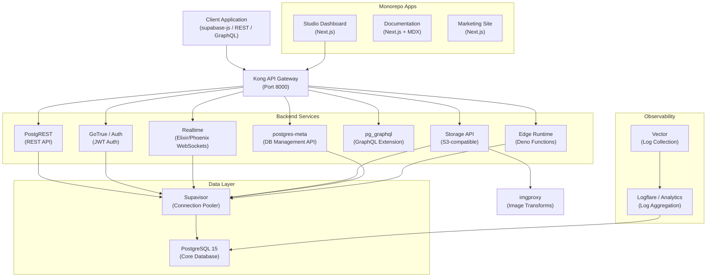
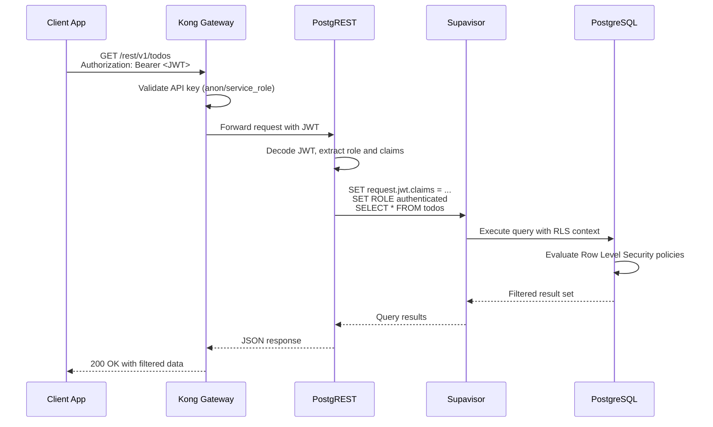
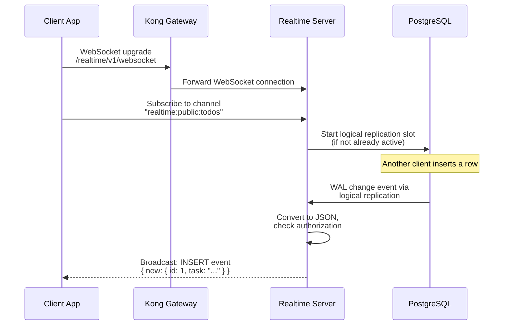
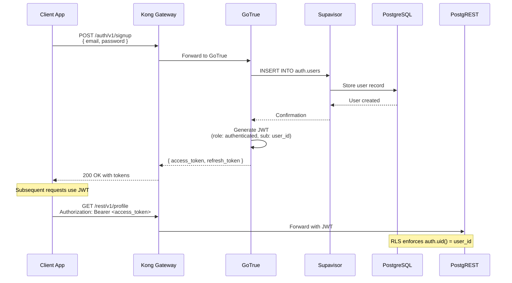
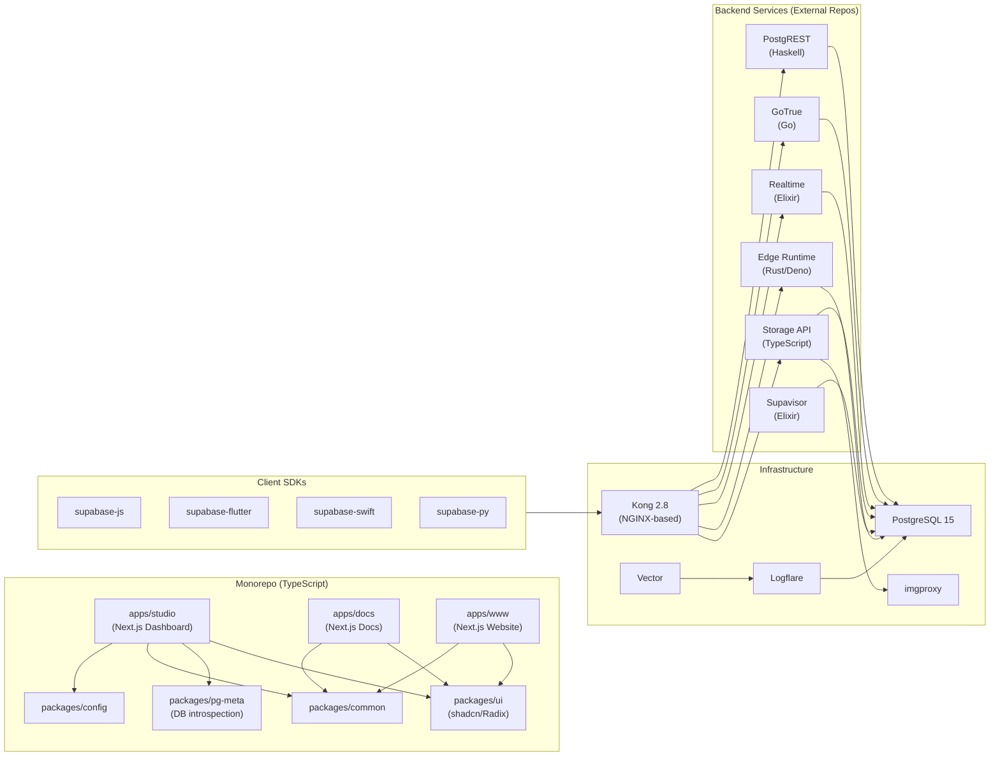

# Supabase

> The open-source Postgres development platform -- building Firebase-like features using enterprise-grade open-source tools on top of PostgreSQL.

| Metadata | |
|---|---|
| Repository | https://github.com/supabase/supabase |
| License | Apache License 2.0 |
| Primary Language | TypeScript |
| Analyzed Release | `v1.26.02` (2026-02-05) |
| Stars (approx.) | 97,400 |
| Generated by | Claude Opus 4.6 (Anthropic) |
| Generated on | 2026-02-08 |

## Overview

Supabase is a hosted and self-hostable platform that provides a complete backend-as-a-service built entirely around PostgreSQL. Rather than abstracting the database away, it exposes a full Postgres instance with auto-generated REST and GraphQL APIs, real-time subscriptions, authentication, file storage, edge functions, and vector/AI capabilities. The monorepo contains the web dashboard (Studio), documentation site, marketing website, and shared internal packages, all orchestrated with Turborepo and pnpm workspaces.

Problems it solves:

- Eliminates the need to build and maintain separate services for auth, storage, real-time subscriptions, and API layers when working with PostgreSQL
- Provides a Firebase-like developer experience without vendor lock-in by composing open-source tools (PostgREST, GoTrue, Realtime, Kong) around a standard Postgres database
- Enables self-hosting of the entire platform via Docker Compose, giving teams full control over data and infrastructure
- Reduces the gap between local development and production by providing a CLI that spins up the same service stack locally

Positioning:

Supabase positions itself as the open-source alternative to Firebase. While Firebase uses proprietary NoSQL (Firestore) and locks users into Google Cloud, Supabase centers on PostgreSQL and open-source tooling. Compared to Neon (serverless Postgres) or PlanetScale (MySQL-based), Supabase differentiates by bundling a complete application backend -- auth, storage, real-time, edge functions -- rather than offering a database alone. Its closest competitor in the "Postgres platform" space is Hasura, but Supabase takes a broader approach by including authentication and storage as first-class services.

## Architecture Overview

Supabase follows a service-oriented architecture where Kong API Gateway acts as the single entry point, routing requests to specialized backend services that all share a single PostgreSQL instance. The monorepo itself is a Turborepo workspace containing Next.js applications (Studio, Docs, Website) and shared packages (UI components, pg-meta, config). Each backend service is an independent open-source project with its own repository, composed together via Docker Compose for self-hosting.

## Core Components

### Kong API Gateway (`docker/docker-compose.yml` -- kong service)

- Responsibility: Single entry point for all client requests, routing traffic to the appropriate backend service based on URL paths and handling API key authentication
- Key files: `docker/volumes/api/kong.yml` (declarative route configuration), `docker/docker-compose.yml` (service definition)
- Design patterns: API Gateway pattern, declarative configuration (database-less mode)

Kong runs in database-less mode with a declarative YAML configuration that maps URL paths to upstream services. It handles CORS, request transformation, key-auth, and ACL plugins. All client SDKs target Kong on port 8000, which then fans out to PostgREST (REST), GoTrue (auth), Realtime (websockets), Storage, and Edge Functions. This single-entry-point design simplifies client configuration -- a project only needs one URL and two API keys (anon and service_role).

### PostgREST -- REST API Layer (`docker/docker-compose.yml` -- rest service)

- Responsibility: Automatically generating a RESTful API from the PostgreSQL schema, respecting Row Level Security (RLS) policies for authorization
- Key files: `docker/docker-compose.yml` (environment config with `PGRST_DB_SCHEMAS`, `PGRST_JWT_SECRET`)
- Design patterns: Schema-driven API generation, JWT-based authorization, database-as-the-source-of-truth

PostgREST (v14.3) introspects the Postgres schema and generates endpoints for every table, view, and function in the configured schemas. Authorization is handled entirely at the database level through RLS policies -- PostgREST passes the JWT claims into the Postgres session context, and the database itself decides what data to return. This eliminates application-level authorization code and ensures a single source of truth for access control.

### GoTrue -- Authentication Service (`docker/docker-compose.yml` -- auth service)

- Responsibility: Managing user sign-up, login, session management, MFA, and issuing JWTs that integrate with PostgreSQL Row Level Security
- Key files: `docker/docker-compose.yml` (extensive environment configuration for SMTP, OAuth providers, hooks)
- Design patterns: JWT-based authentication, webhook/hook extensibility, database-backed session storage

GoTrue (v2.185.0) is a Go-based authentication API that handles email/password, OAuth, magic link, phone, and anonymous authentication. It issues JWTs with configurable expiry and roles that PostgREST, Realtime, and Storage all validate. A powerful hook system allows custom logic at key points (custom access tokens, MFA verification, password verification, email/SMS sending) by calling PostgreSQL functions via `pg-functions://` URIs, keeping extensibility within the database.

### Realtime -- WebSocket Server (`docker/docker-compose.yml` -- realtime service)

- Responsibility: Broadcasting PostgreSQL data changes (inserts, updates, deletes) to connected clients over WebSockets, plus Presence and Broadcast channels
- Key files: `docker/docker-compose.yml` (realtime service with `SEED_SELF_HOST`, `RUN_JANITOR` flags)
- Design patterns: Publish/Subscribe via PostgreSQL logical replication, multi-tenant channel system, Elixir/OTP supervision trees

Realtime (v2.72.0) is an Elixir/Phoenix application that leverages PostgreSQL's built-in logical replication to detect data changes. It converts WAL (Write-Ahead Log) entries to JSON and broadcasts them over WebSockets to authorized clients. Beyond database changes, it supports Broadcast (arbitrary message passing between clients) and Presence (tracking online users). The Elixir/OTP runtime provides lightweight processes and fault tolerance for handling massive concurrent connections.

### Storage API (`docker/docker-compose.yml` -- storage service)

- Responsibility: Providing an S3-compatible file storage API with PostgreSQL-managed permissions and on-the-fly image transformation
- Key files: `docker/docker-compose.yml` (storage and imgproxy services)
- Design patterns: Policy-based access control via Postgres RLS, delegation pattern (imgproxy for image processing)

Storage API (v1.37.1) manages files with metadata stored in PostgreSQL and actual file data on local disk or S3. Access control uses the same RLS-based permission model as the rest of the platform -- storage policies are PostgreSQL policies on the `storage.objects` table. Image transformations are delegated to imgproxy (v3.30.1), keeping the storage service focused on CRUD operations while imgproxy handles resizing, format conversion, and WebP detection.

### Supavisor -- Connection Pooler (`docker/docker-compose.yml` -- supavisor service)

- Responsibility: Managing database connection pooling in a cloud-native, multi-tenant manner to support millions of concurrent client connections
- Key files: `docker/docker-compose.yml` (supavisor service), `docker/volumes/pooler/pooler.exs`
- Design patterns: Connection pooling (transaction mode), multi-tenant routing, Elixir/OTP distributed clustering

Supavisor (v2.7.4) is an Elixir-based connection pooler that replaces PgBouncer in the Supabase stack. It operates in transaction mode by default, where connections are held only for the duration of a single transaction -- ideal for serverless and edge function workloads. It supports query load balancing across read replicas, named prepared statements, and can handle over 1 million concurrent client connections by mapping lightweight client slots onto a smaller pool of native Postgres connections.

### Studio Dashboard (`apps/studio/`)

- Responsibility: Providing a web-based GUI for managing PostgreSQL databases, configuring auth providers, browsing storage, viewing logs, and writing SQL
- Key files: `apps/studio/pages/` (Next.js pages router), `apps/studio/components/` (React components), `apps/studio/state/` (Valtio state management), `apps/studio/hooks/` (React hooks), `apps/studio/lib/` (utility functions)
- Design patterns: Next.js Pages Router with API routes, Valtio for state management, component-driven architecture

Studio is a full-featured Next.js application (using the Pages Router) that serves as the administrative dashboard. It communicates with postgres-meta for schema management, Kong for data operations, and Logflare for log viewing. The component structure includes a grid system for table editing, layout components for navigation, and a UI layer built on the shared `packages/ui` package (based on shadcn/ui + Radix primitives). State management uses Valtio for reactive proxy-based state, and the application includes Sentry integration for error tracking.

### Edge Runtime -- Serverless Functions (`docker/docker-compose.yml` -- functions service)

- Responsibility: Executing user-defined serverless functions written in TypeScript/JavaScript using Deno's runtime
- Key files: `docker/docker-compose.yml` (functions service), `docker/volumes/functions/` (user function directory)
- Design patterns: Isolate-based execution, ESZip bundling for fast cold starts, serverless request/response model

The Edge Runtime (v1.70.0) is a Deno-based server that executes user functions in isolated V8 contexts. Functions are bundled into ESZip format (a compact module graph) for rapid loading. Each function runs in a security-sandboxed isolate, preventing side effects between functions. The runtime has direct access to the PostgreSQL database via `SUPABASE_DB_URL` and can call other Supabase services through the Kong gateway using `SUPABASE_URL`.

## Data Flow

### Client API Request (REST Query with RLS)

### Real-time Subscription Flow

### Authentication Flow (Email/Password)

## Key Design Decisions

### 1. PostgreSQL as the Single Source of Truth

- Choice: All services (auth, storage, realtime, analytics) share a single PostgreSQL instance, using separate schemas (`auth`, `storage`, `_realtime`, `_analytics`, `_supabase`)
- Rationale: By keeping all data in one database, Supabase enables cross-service queries (e.g., RLS policies referencing auth.users), eliminates data synchronization issues, and lets developers use standard SQL tooling for everything
- Trade-offs: Creates a single point of failure at the database level. Vertical scaling of Postgres becomes the primary scaling constraint. Schema migrations must be coordinated across services. Supavisor mitigates connection pressure but the database itself remains the bottleneck for write-heavy workloads

### 2. Row Level Security (RLS) as the Authorization Layer

- Choice: Authorization is implemented at the PostgreSQL level using RLS policies rather than in application middleware or API gateway rules
- Rationale: This ensures that every access path to data (REST, GraphQL, direct SQL, edge functions) enforces the same security rules. Developers define policies once in SQL, and they apply universally. It also means PostgREST can be stateless -- it simply passes JWT claims to Postgres
- Trade-offs: RLS policies can be complex and hard to debug. Performance of policy evaluation depends on query planner optimization. Developers must understand PostgreSQL's RLS model, which has a steeper learning curve than middleware-based authorization. Incorrect policies can silently expose data

### 3. Composing Independent Open-Source Projects via API Gateway

- Choice: Rather than building a monolithic backend, Supabase composes separate open-source tools (PostgREST, GoTrue, Realtime, Kong, imgproxy, Vector) behind an API gateway
- Rationale: Each component can be developed, released, and scaled independently. The community benefits from purpose-built tools that can also be used outside Supabase. Upgrades to individual components do not require redeploying the entire stack
- Trade-offs: Operational complexity increases with the number of services (12 containers in the Docker Compose stack). Version compatibility between services must be carefully managed. Network latency between services adds overhead compared to a monolithic approach. Debugging cross-service issues requires understanding multiple codebases in different languages (Go, Elixir, Haskell, TypeScript, Rust)

### 4. Elixir/OTP for Real-time and Connection Pooling

- Choice: Both Realtime and Supavisor are built in Elixir, leveraging the BEAM virtual machine's concurrency model
- Rationale: Elixir's lightweight processes (actors) and OTP supervision trees are ideal for maintaining millions of concurrent WebSocket connections and database connection pools. The BEAM VM's preemptive scheduling ensures no single connection can starve others, and its fault-tolerance model (let it crash) provides resilience
- Trade-offs: Elixir has a smaller developer ecosystem compared to Go or Node.js. Hiring and onboarding engineers with Elixir experience is more challenging. The BEAM VM's garbage collection model can introduce latency spikes under extreme load

### 5. Turborepo Monorepo with pnpm Workspaces

- Choice: The entire frontend codebase (Studio, Docs, Website, shared packages) lives in a single monorepo managed by Turborepo and pnpm workspaces
- Rationale: Shared packages (`packages/ui`, `packages/config`, `packages/common`) are consumed by multiple applications without publishing to npm. Turborepo's task caching and dependency graph awareness speeds up CI builds. Code changes that affect shared packages automatically trigger rebuilds of all dependent applications
- Trade-offs: The monorepo is large (21MB+ of TypeScript alone) and requires significant CI resources. pnpm's strict dependency resolution can cause friction with packages that rely on hoisting. Teams working on different apps must coordinate on shared package changes

## Dependencies

## Testing Strategy

The testing approach varies by layer. The monorepo frontend apps use Vitest for unit and component testing, while end-to-end tests for Studio use Playwright in a dedicated `e2e/studio` directory.

Unit tests: Studio uses Vitest (`apps/studio/vitest.config.ts`) with mock files in `apps/studio/__mocks__/`. The shared `packages/ui` package has its own Vitest configuration (`packages/ui/vitest.config.ts`). Tests are run via Turborepo with `turbo run test --filter=studio` or `turbo run test --filter=ui`.

Integration tests: The `e2e/` directory contains Playwright-based end-to-end tests for Studio. The setup script (`pnpm e2e:setup:selfhosted`) starts a full Supabase CLI stack, builds Studio, and runs it locally before executing tests. This tests the complete flow from UI interaction through Kong to the actual backend services.

CI/CD: The repository uses GitHub Actions (`.github/` directory) for CI. Turborepo's remote caching is used to speed up builds across PRs. The `turbo.json` configuration defines task dependencies and environment variable pass-through to ensure deterministic builds. Knip (`knip.jsonc`) is used for detecting unused dependencies and exports.

## Key Takeaways

1. Database-centric authorization: By pushing authorization into PostgreSQL via Row Level Security, Supabase ensures that every access path to data is governed by the same rules. This is a powerful pattern for any project where data is accessed through multiple interfaces (REST, GraphQL, direct SQL). The trade-off is that developers must be proficient in SQL policy writing, but the benefit is a single, auditable security boundary.

2. Composing best-of-breed open-source tools: Rather than building everything from scratch, Supabase selects purpose-built open-source projects (PostgREST for REST, GoTrue for auth, Kong for gateway) and composes them. This accelerates development and lets each tool evolve independently, but requires careful version management and increases operational complexity.

3. Language diversity aligned with workload characteristics: Supabase uses Elixir for connection-heavy services (Realtime, Supavisor), Go for CPU-efficient auth (GoTrue), Haskell for type-safe API generation (PostgREST), Rust/Deno for secure function isolation (Edge Runtime), and TypeScript for the frontend. Each language is chosen for its strengths in the specific domain, rather than standardizing on a single language for all components.

4. Self-hosting as a first-class deployment target: The complete `docker/docker-compose.yml` with all 12 services makes self-hosting fully reproducible. This is a significant architectural decision that forces every service to be configurable via environment variables and eliminates hidden dependencies on proprietary infrastructure. It also serves as living documentation of the entire system topology.

5. Monorepo for frontend coherence with independent backend services: The monorepo boundary is drawn around the TypeScript frontend ecosystem (Studio, Docs, Website, shared packages), while backend services live in separate repositories with their own release cycles. This balances code sharing and coordinated UI changes against the independence of backend service evolution. The use of Turborepo with pnpm catalogs ensures consistent dependency versions across all frontend packages.

## References

- [Supabase Official Documentation](https://supabase.com/docs)
- [Supabase Architecture Guide](https://supabase.com/docs/guides/getting-started/architecture)
- [Supabase Auth Architecture](https://supabase.com/docs/guides/auth/architecture)
- [Supabase Realtime Architecture](https://supabase.com/docs/guides/realtime/architecture)
- [Supabase Edge Functions Architecture](https://supabase.com/docs/guides/functions/architecture)
- [Supavisor: A Postgres Connection Pooler at Scale](https://supabase.com/blog/supavisor-postgres-connection-pooler)
- [Supabase Edge Runtime (GitHub)](https://github.com/supabase/edge-runtime)
- [Supabase Self-Hosting with Docker](https://supabase.com/docs/guides/self-hosting/docker)
- [Supabase DeepWiki Overview](https://deepwiki.com/supabase/supabase/1-overview)
- [Architecture and Technology Stack of Supabase](https://www.workingsoftware.dev/tech-stack-and-architecture-of-supabase/)
