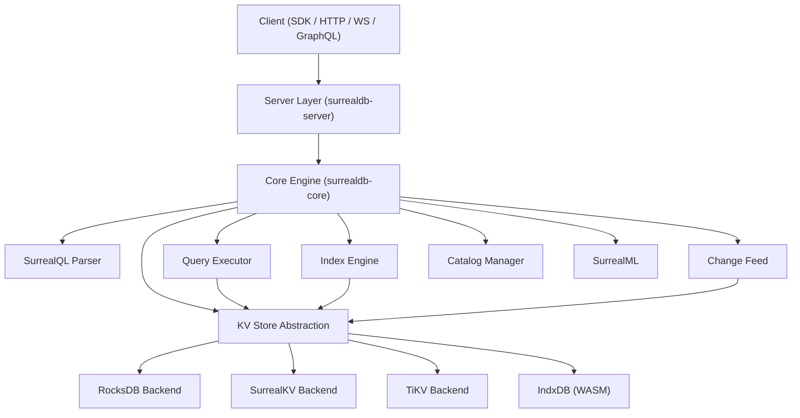
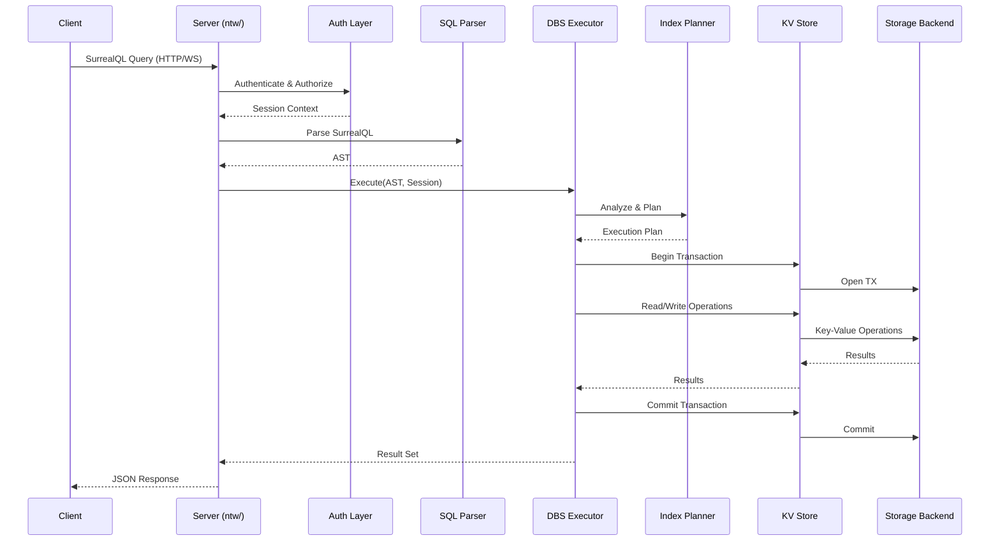
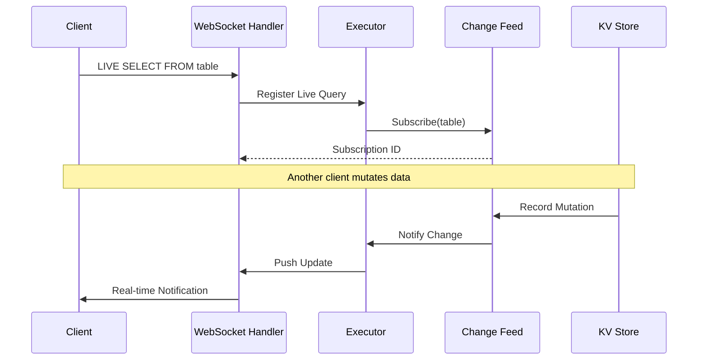
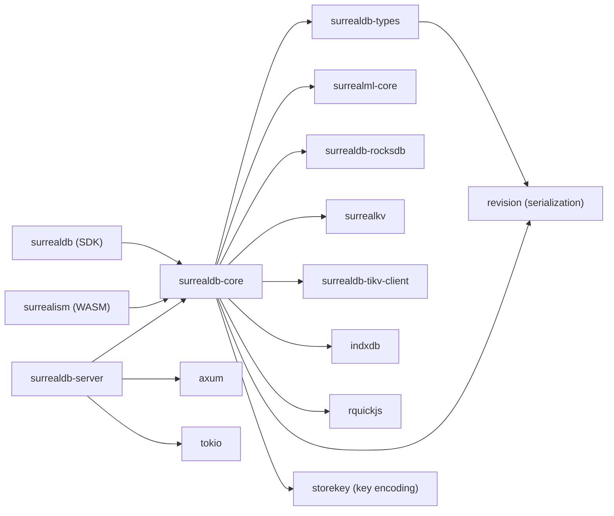

# SurrealDB

> A scalable, distributed, collaborative, document-graph database for the realtime web

| Metadata | |
|---|---|
| Repository | https://github.com/surrealdb/surrealdb |
| License | BSL 1.1 (core) / Apache 2.0 (SDKs) |
| Primary Language | Rust |
| Category | Database |
| Analyzed Release | `v3.0.0-beta.3` (2026-02-05) |
| Stars (approx.) | 31,014 |
| Generated by | Claude Opus 4.6 (Anthropic) |
| Generated on | 2026-02-08 |

## Overview

SurrealDB is a multi-model database written in Rust that combines the capabilities of document stores, graph databases, and traditional relational databases into a single platform. It supports SurrealQL, a custom query language inspired by SQL, and provides real-time data subscriptions, multi-tenancy, and embedded machine learning model execution. The database can run as a standalone server, an embedded library, or connect to distributed backends such as TiKV and FoundationDB.

Problems it solves:
- Eliminates the need to manage multiple database systems for different data models (document, graph, relational)
- Provides real-time data subscriptions without external pub/sub infrastructure
- Offers multi-tenancy at the namespace and database level with fine-grained access control
- Enables graph traversal queries alongside traditional document and tabular queries
- Supports embedded deployment for edge and IoT scenarios

Positioning:
SurrealDB occupies a unique niche as a multi-model database that unifies document, graph, and relational paradigms under a single query language. It competes with MongoDB (document), Neo4j (graph), and CockroachDB (distributed SQL), but differentiates itself by collapsing these concerns into one system. Its Rust implementation provides memory safety and performance, while its pluggable storage backends allow deployment from single-node embedded to distributed multi-node clusters.

## Architecture Overview

SurrealDB follows a layered architecture with clear separation between the query processing layer, storage abstraction, and network transport. The core engine processes SurrealQL through a pipeline of parsing, planning, and execution stages, while the key-value store (KVS) layer abstracts over multiple storage backends. The server layer handles HTTP, WebSocket, and GraphQL protocol endpoints.

## Core Components

### Query Parser (`surrealdb/core/src/sql/`)
- Responsibility: Parses SurrealQL statements into an abstract syntax tree (AST). SurrealQL supports SELECT, CREATE, UPDATE, DELETE, RELATE (graph edges), DEFINE (schema), and LIVE queries.
- Key files: `surrealdb/core/src/sql/` module contains the complete grammar and AST definitions. The parser is built using a hand-written recursive descent approach for performance.
- Design patterns: Visitor pattern for AST traversal, builder pattern for query construction. The AST nodes are strongly typed Rust enums enabling exhaustive pattern matching.

### Query Executor (`surrealdb/core/src/dbs/`)
- Responsibility: Takes parsed AST nodes and executes them against the storage layer. Manages sessions, transactions, query planning, and result iteration.
- Key files: `executor.rs` (main execution loop), `iterator.rs` (result set iteration), `processor.rs` (statement processing), `plan.rs` (query plan generation), `options.rs` (execution options and context).
- Design patterns: Iterator pattern for streaming results, strategy pattern for different statement types. The executor supports parallel execution of independent statements via the `exe/` module with `spawn.rs` and `try_join_all_buffered.rs`.

### Key-Value Store Abstraction (`surrealdb/core/src/kvs/`)
- Responsibility: Provides a unified transactional key-value interface over multiple storage backends. Supports RocksDB, SurrealKV (custom LSM engine), TiKV (distributed), and IndxDB (browser WASM).
- Key files: `api.rs` (trait definitions), `batch.rs` (batch operations), `clock.rs` (hybrid logical clock), `cache/` (two-level caching with datastore-level and transaction-level caches).
- Design patterns: Adapter pattern to normalize different backend APIs, repository pattern for data access. The cache module uses a two-tier design with `ds/` (datastore cache) and `tx/` (transaction cache) each with their own `entry.rs`, `key.rs`, `lookup.rs`, and `weight.rs`.

### Index Engine (`surrealdb/core/src/idx/`)
- Responsibility: Manages secondary indexes including full-text search, HNSW vector indexes for KNN queries, and B-tree indexes. Includes a query planner that selects optimal index usage.
- Key files: `index.rs` (index management), `planner/plan.rs` (index-aware query planning), `planner/executor.rs` (index scan execution), `trees/hnsw/` (HNSW vector index), `ft/fulltext.rs` (full-text search), `trees/graph.rs` (graph index).
- Design patterns: Strategy pattern for different index types, factory pattern for index creation. The HNSW implementation in `trees/hnsw/` has dedicated modules for `cache.rs`, `elements.rs`, `layer.rs`, and `heuristic.rs`.

### Catalog and Schema Manager (`surrealdb/core/src/catalog/`)
- Responsibility: Manages the metadata catalog including namespaces, databases, tables, fields, indexes, events, functions, and access controls. Supports schema versioning and compatibility layers.
- Key files: `database.rs`, `namespace.rs`, `table.rs`, `schema/` (individual schema object types), `compat/` (version compatibility), `providers.rs` (catalog data providers).
- Design patterns: Registry pattern for schema objects, versioned schema migrations via `compat/` with files like `v3_0_0_beta_1.rs` and `v3_0_0_beta_3.rs`.

### Change Feed (`surrealdb/core/src/cf/`)
- Responsibility: Tracks mutations to data for real-time subscriptions (LIVE queries) and change data capture.
- Key files: `mutations.rs` (mutation recording), `reader.rs` (reading changes), `writer.rs` (writing changes), `gc.rs` (garbage collection of old changes).
- Design patterns: Observer pattern for change notification, append-only log for change recording.

### Server and Network Layer (`surrealdb/server/src/`)
- Responsibility: HTTP/WebSocket/GraphQL endpoint handling, authentication, CLI commands, and server lifecycle management.
- Key files: `ntw/` (network handlers including `api.rs`, `rpc.rs`, `ws.rs`, `gql.rs`), `cli/` (command-line interface with `start.rs`, `export.rs`, `import.rs`), `gql/` (GraphQL schema generation).
- Design patterns: Middleware pattern for request processing, command pattern for CLI operations.

## Data Flow

### Query Execution Flow

### Live Query (Real-Time Subscription) Flow

## Key Design Decisions

### 1. Multi-Model Under Single Query Language
- Choice: Unified SurrealQL for document, graph, and relational operations rather than separate query languages.
- Rationale: Reduces cognitive load for developers who would otherwise need to learn multiple query languages and manage multiple database connections. The RELATE statement enables graph edges to be first-class citizens alongside documents.
- Trade-offs: The query language is more complex than single-model alternatives. Optimization is harder because the planner must consider document scans, graph traversals, and index lookups simultaneously.

### 2. Pluggable Storage Backends via KVS Abstraction
- Choice: Abstract all storage behind a key-value interface with ordered key scans, supporting RocksDB, SurrealKV, TiKV, and IndxDB.
- Rationale: Enables deployment flexibility from embedded single-node (RocksDB/SurrealKV) to distributed clusters (TiKV) to browser environments (IndxDB/WASM) without changing application code.
- Trade-offs: The KV abstraction limits some backend-specific optimizations. All higher-level structures (tables, indexes, graphs) must be encoded into ordered key-value pairs, which adds encoding/decoding overhead.

### 3. Rust Workspace with Fine-Grained Crate Separation
- Choice: Organized as a Rust workspace with separate crates: `surrealdb` (SDK), `surrealdb-core` (engine), `surrealdb-server` (HTTP/WS server), `surrealdb-types` (shared types), and `surrealml-core` (ML integration).
- Rationale: Allows the core engine to be embedded directly in applications without server dependencies. The SDK crate provides a clean public API while core contains all internal logic.
- Trade-offs: More complex build configuration and dependency management. Cross-crate changes require careful version coordination.

### 4. Built-in Authentication and Multi-Tenancy
- Choice: Native multi-tenancy with namespace/database hierarchy and built-in JWT/token authentication rather than relying on external auth systems.
- Rationale: Simplifies deployment for SaaS applications where tenant isolation is critical. Eliminates the need for a separate identity provider in simple deployments.
- Trade-offs: Authentication logic is tightly coupled with the database engine. Enterprise deployments may still need to integrate with external identity providers.

### 5. Embedded JavaScript Runtime for Server-Side Functions
- Choice: Integrated rquickjs (QuickJS via Rust bindings) for executing JavaScript functions within the database via `surrealdb/core/src/fnc/script/`.
- Rationale: Enables complex server-side logic, data transformations, and computed fields without external microservices. The fetch API is also available for external HTTP calls.
- Trade-offs: Adds a non-trivial dependency and potential security surface. JavaScript execution within the database process could impact performance of other queries if not carefully sandboxed.

## Dependencies

## Testing Strategy

SurrealDB employs a comprehensive testing approach spanning multiple levels:

- Unit Tests: Individual modules contain inline Rust tests (e.g., `surrealdb/core/src/catalog/test.rs`, `surrealdb/core/src/dbs/test.rs`). Each KVS backend has dedicated tests.
- Benchmark Tests: Performance benchmarks in `surrealdb/core/benches/` covering `executor.rs`, `functions.rs`, `statements.rs`, and `allocator.rs`.
- Integration Tests: End-to-end tests that exercise the full query pipeline from parsing through execution to storage.
- Compatibility Tests: The `catalog/compat/` module contains fixtures and generators for testing schema migration between versions (`v3_0_0_beta_1.rs`, `v3_0_0_beta_3.rs`).
- CLI Tests: The server module includes `cli/test.rs` for testing command-line interface behavior.
- The project uses Rust's built-in `cargo test` framework with feature flags to selectively test different storage backends.

## Key Takeaways

1. SurrealDB's multi-model approach (document + graph + relational) under a single query language is architecturally ambitious, requiring a sophisticated query planner that must optimize across different data access patterns. The `idx/planner/` module with its `tree.rs`, `plan.rs`, and `rewriter.rs` reflects this complexity.

2. The KVS abstraction layer is the architectural cornerstone that enables deployment flexibility from browser WASM to distributed clusters. All higher-level data structures (tables, indexes, graph edges, change feeds) are encoded into ordered key-value pairs, making the storage backend truly interchangeable.

3. The Rust workspace organization with separate SDK, core, server, types, and ML crates demonstrates a mature approach to API surface management. The core can be embedded directly, the server adds network protocols, and the SDK provides ergonomic client APIs, all sharing the same types crate.

## References

- Repository: https://github.com/surrealdb/surrealdb
- Documentation: https://surrealdb.com/docs
- SurrealQL Language: https://surrealdb.com/docs/surrealql
- Rust SDK: https://crates.io/crates/surrealdb
- Core Crate: https://crates.io/crates/surrealdb-core
