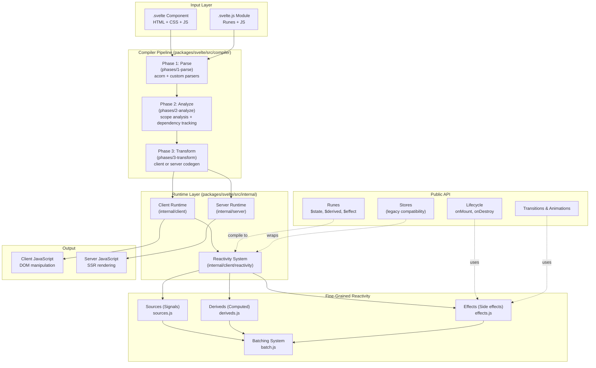
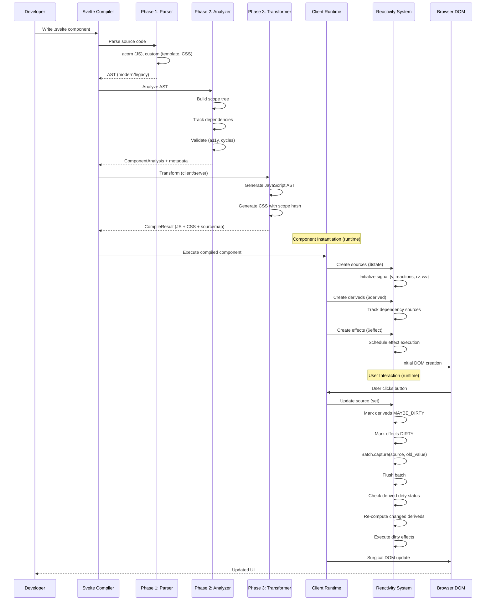
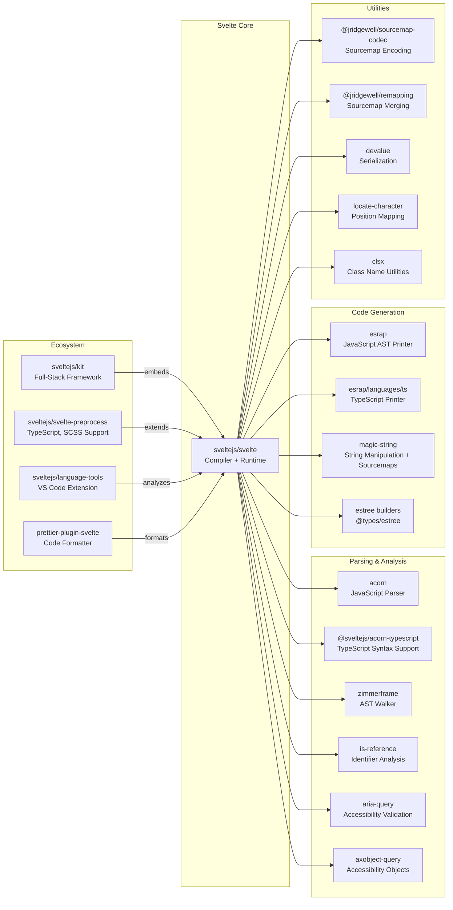

# Svelte

> A compiler-first JavaScript framework that converts declarative components into efficient JavaScript that surgically updates the DOM

| Metadata | |
|---|---|
| Repository | https://github.com/sveltejs/svelte |
| License | MIT License |
| Primary Language | JavaScript |
| Category | Web Framework |
| Analyzed Release | `v5.50.0` (2026-02-06) |
| Stars (approx.) | 85,700+ |
| Generated by | Claude Opus 4.6 (Anthropic) |
| Generated on | 2026-02-08 |

## Overview

Svelte is a radical departure from traditional JavaScript frameworks. Rather than interpreting application code at runtime, Svelte shifts the work to a compile step that converts components into highly efficient imperative code that directly manipulates the DOM. Svelte 5 introduced a fundamental rethink of reactivity through "runes" - compiler primitives that enable a signals-based, fine-grained reactivity system.

Problems it solves:

- Eliminating the runtime framework overhead by compiling components to vanilla JavaScript at build time
- Providing true fine-grained reactivity without requiring virtual DOM diffing or extensive runtime libraries
- Simplifying state management through compiler-enforced reactivity patterns that reduce boilerplate
- Unifying reactive programming across component boundaries with universal reactivity primitives

Positioning:

Svelte positions itself as "web development for the rest of us" - emphasizing developer experience and simplicity. Unlike React's virtual DOM or Vue's runtime reactivity system, Svelte's compile-time approach results in smaller bundle sizes and faster runtime performance. It has been adopted by frameworks like SvelteKit for full-stack development and is increasingly used in production applications seeking optimal performance with minimal complexity.

## Architecture Overview

Svelte employs a three-phase compiler pipeline architecture that transforms declarative .svelte files into optimized JavaScript. The compiler parses source code into an AST, analyzes dependencies and reactivity patterns, then transforms the AST into either client-side or server-side JavaScript with a minimal runtime.

## Core Components

### Compiler Entry Point (`packages/svelte/src/compiler/index.js`)

- Responsibility: Orchestrates the three-phase compilation pipeline and exposes public compile API
- Key files: `src/compiler/index.js`, `src/compiler/validate-options.js`
- Design patterns: Pipeline pattern, Strategy pattern (client vs server)

The `compile()` function is the main entry point that coordinates parsing, analysis, and transformation. It handles TypeScript stripping via `remove_typescript_nodes()`, merges component options with compile options, and routes to either client or server transformers. The `compileModule()` function provides a separate path for compiling pure JavaScript modules containing runes. The API returns a `CompileResult` containing generated JavaScript code, CSS, source maps, and metadata about rune usage.

### Phase 1: Parser (`packages/svelte/src/compiler/phases/1-parse`)

- Responsibility: Converting source code into Abstract Syntax Tree (AST) representations
- Key files: `phases/1-parse/index.js`, `phases/1-parse/read/*.js`, `phases/1-parse/acorn.js`
- Design patterns: Recursive descent parser, Reader pattern

The parser uses a custom hand-written parser built on top of acorn for JavaScript parsing. It processes .svelte files by reading different sections: script tags use acorn with TypeScript support via @sveltejs/acorn-typescript, styles are parsed with a custom CSS parser (`read/style.js`), and templates are parsed with custom readers for HTML-like syntax. The parser produces both a modern AST (used internally) and can generate a legacy AST for backward compatibility. It handles Svelte-specific syntax like `{#if}`, `{#each}`, `{@html}`, and preserves comments for source map generation.

### Phase 2: Analyzer (`packages/svelte/src/compiler/phases/2-analyze`)

- Responsibility: Semantic analysis, scope tracking, dependency graph construction, and validation
- Key files: `phases/2-analyze/index.js`, `phases/2-analyze/visitors/*.js`, `phases/scope.js`
- Design patterns: Visitor pattern, Dependency graph, Scope chain

The analyzer uses zimmerframe (a tree-walking library) to traverse the AST with specialized visitors for each node type. It creates scope trees tracking variable declarations, references, and mutations across script/template boundaries. Critically, it builds a dependency graph identifying reactive statements and their dependencies, checking for cycles with `check_graph_for_cycles()`. The CSS analyzer runs in parallel, performing selector analysis, pruning unused rules, and warning about unused selectors. The analyzer marks which bindings are reactive, which components use runes, and validates accessibility rules via dedicated a11y visitors.

### Phase 3: Transformer (`packages/svelte/src/compiler/phases/3-transform`)

- Responsibility: Code generation targeting either client-side DOM manipulation or server-side rendering
- Key files: `phases/3-transform/index.js`, `phases/3-transform/client/*.js`, `phases/3-transform/server/*.js`
- Design patterns: Code generator, Template method, Builder pattern

The transformer generates optimized JavaScript from the analyzed AST. For client-side output (`client/transform-client.js`), it creates functions that instantiate components, establish reactive dependencies, and perform surgical DOM updates. For server-side rendering (`server/transform-server.js`), it generates string-concatenation code without reactivity overhead. The transformer uses AST builder utilities (`utils/builders.js`) to construct ESTree nodes and esrap/print to serialize the final JavaScript. CSS transformation happens separately, producing scoped selectors with component-specific hashes.

### Reactivity System (`packages/svelte/src/internal/client/reactivity`)

- Responsibility: Runtime implementation of fine-grained reactive primitives (signals)
- Key files: `internal/client/reactivity/sources.js`, `deriveds.js`, `effects.js`, `batch.js`
- Design patterns: Observer pattern, Signals pattern, Proxy pattern, Dependency tracking

The reactivity system implements a signals-based architecture similar to SolidJS. Sources (`sources.js`) represent reactive state cells (`$state` rune) implemented as objects with version numbers and subscriber lists. Deriveds (`deriveds.js`) represent computed values (`$derived` rune) that cache results and track dependencies. Effects (`effects.js`) represent side effects (`$effect` rune) that re-run when dependencies change. The batching system (`batch.js`) coordinates updates to prevent redundant re-execution: multiple state changes are batched together, derived values are computed lazily, and effects are scheduled for asynchronous execution. Deep reactivity for objects and arrays is achieved through ES6 Proxies (`proxy.js`), allowing Svelte to intercept property access and mutations.

### Client Runtime (`packages/svelte/src/internal/client`)

- Responsibility: Minimal runtime providing DOM manipulation primitives and reactive orchestration
- Key files: `internal/client/index.js`, `internal/client/dom/*.js`, `internal/client/runtime.js`
- Design patterns: Template instantiation, Event delegation, Hydration

The client runtime provides low-level functions called by compiler-generated code. DOM operations (`dom/template.js`) create elements efficiently using template cloning where possible. Block management (`dom/blocks/*.js`) handles control flow structures like `{#if}`, `{#each}`, and `{#await}`. Event handling (`dom/elements/events.js`) supports event delegation to minimize listener overhead. Bindings (`dom/elements/bindings/*.js`) establish two-way data flow for form inputs, component props, and element dimensions. Hydration logic (`dom/hydration.js`) enables server-rendered HTML to be efficiently attached to client-side reactivity.

### Server Runtime (`packages/svelte/src/internal/server`)

- Responsibility: Server-side rendering without client reactivity overhead
- Key files: `internal/server/index.js`, `internal/server/blocks/*.js`
- Design patterns: String builder, Template rendering

The server runtime implements SSR by generating HTML strings without establishing reactive subscriptions. It provides simplified block implementations that render control flow structures to strings, handles slot content concatenation, and escapes user content to prevent XSS. Unlike the client runtime, there's no proxy wrapping or effect tracking, making SSR extremely fast.

## Data Flow

### Component Compilation and Reactivity Execution

## Key Design Decisions

### 1. Compile-Time Framework vs Runtime Framework

- Choice: Shifting the majority of work from runtime to compile time by analyzing components during build and generating optimized vanilla JavaScript
- Rationale: Eliminates the runtime overhead of virtual DOM diffing, reduces bundle size by avoiding framework runtime libraries, and enables ahead-of-time optimizations impossible at runtime. The compiler has a complete view of component structure, data flow, and dependencies, allowing it to generate code that performs exactly the minimal work needed
- Trade-offs: Requires a build step (not usable via CDN like traditional frameworks), longer build times for large applications, and less dynamic runtime introspection. Debugging can be harder since the code being executed differs significantly from authored code. Hot module replacement and developer tooling require special handling to map between compiled and source code

### 2. Signals-Based Fine-Grained Reactivity (Svelte 5 Runes)

- Choice: Replacing Svelte 4's compile-time reactive assignments with runtime signals via runes ($state, $derived, $effect) implemented with Proxy-based observation
- Rationale: Enables universal reactivity beyond component boundaries (works in .svelte.js modules), provides more predictable reactivity semantics, and aligns with modern reactive primitives (similar to SolidJS signals, Vue 3 refs). The signals architecture allows for more granular tracking - only the specific properties accessed within a computation are tracked, not entire objects. This also solves edge cases where Svelte 4's compile-time analysis couldn't detect certain reactive dependencies
- Trade-offs: Small runtime library required (though still minimal compared to other frameworks), breaking change requiring migration from Svelte 4's `$:` reactive statements, and potential performance cost of Proxy overhead for large objects (mitigated by optimizations). Developers must learn new rune syntax and mental model, and legacy codebases require incremental migration strategies

### 3. Mono-Repository Multi-Package Structure

- Choice: Using pnpm workspaces with packages/svelte as the core compiler and runtime, organized by export paths (compiler, reactivity, store, etc.)
- Rationale: Allows fine-grained exports via package.json exports field, enabling tree-shaking of unused features (e.g., applications not using stores don't bundle store code). Separate compiler and runtime code simplifies understanding and testing. Internal imports (#client, #compiler, #server) provide clear module boundaries and prevent circular dependencies
- Trade-offs: More complex build configuration and import path resolution, potential confusion for contributors navigating multiple entry points, and increased cognitive overhead understanding which code runs at compile-time vs runtime

### 4. Three-Phase Compilation Pipeline

- Choice: Strictly separating parsing (AST creation), analysis (semantic understanding), and transformation (code generation) into distinct phases with well-defined data structures
- Rationale: Clean separation of concerns makes each phase independently testable and maintainable. The analyzer can run complex multi-pass algorithms (scope analysis, CSS pruning, accessibility validation) without worrying about code generation details. Multiple transformers (client/server) can share the same analysis results. This architecture also enables tools like svelte-check to leverage the parser/analyzer without transformation
- Trade-offs: Additional memory overhead maintaining intermediate ASTs and analysis results, potential redundancy in tree traversal across phases, and complexity in maintaining type definitions for different AST representations (modern vs legacy)

### 5. Dependency Injection via Exported Compiler Primitives

- Choice: Exposing internal compiler utilities (parse, preprocess, print) as public exports from svelte/compiler
- Rationale: Enables ecosystem tools to build on Svelte's infrastructure: preprocessors can parse templates before compilation, language servers can provide IntelliSense by analyzing ASTs, and bundler plugins can optimize Svelte code. Recent additions like parseCss expose even more granular capabilities
- Trade-offs: Public API surface area grows, requiring careful stability guarantees and versioning. Internal refactoring becomes harder since ecosystem tools may depend on specific AST shapes or function signatures. Documentation burden increases to explain advanced compiler APIs

## Dependencies

## Testing Strategy

Svelte employs a comprehensive multi-layered testing strategy with separation between compiler tests and runtime tests.

Unit tests: The test suite is organized by phase and feature in `/tests` with subdirectories like `parser`, `validator`, `runtime`, `server-side-rendering`, and `css`. Test samples are kept in `tests/xxx/samples` folders with input `.svelte` files and expected outputs. Tests use Vitest as the test runner with snapshot testing - expected outputs are checked into version control and compared against actual compiler output using `UPDATE_SNAPSHOTS=true pnpm test` to regenerate snapshots.

Integration tests: Runtime tests instantiate actual components in a Playwright-controlled browser environment, ensuring DOM manipulation, event handling, and reactivity work end-to-end. CSS tests validate scoping, specificity, and unused selector warnings. Server-side rendering tests compare SSR output against expected HTML strings.

Benchmarking: The `benchmarking/` directory contains dedicated reactivity benchmarks comparing Svelte against other frameworks using kairo benchmark suite (diamond, triangle, deep, broad patterns). These measure the performance of the signals implementation under various dependency graph shapes.

CI/CD: GitHub Actions runs tests across multiple Node versions, checks TypeScript compilation with `pnpm check`, lints with ESLint, and validates type generation. The build script (`scripts/build.js`) processes error messages, generates types with dts-buddy, and bundles the CommonJS compiler with Rollup. Changesets manage versioning and release notes.

## Key Takeaways

1. Compile-time optimization enables runtime simplicity: By doing more work at build time, Svelte generates code that requires minimal runtime support. This inverted approach - traditionally frameworks do little at build time and much at runtime - results in smaller bundles and faster execution. This principle applies broadly: analyze and optimize during development/build rather than deferring work to production runtime

2. Fine-grained reactivity through signals: Svelte 5's shift to a signals-based reactivity model demonstrates the effectiveness of granular dependency tracking. Rather than re-running entire computations or re-rendering entire components, only the specific values that changed and their direct dependents update. This architecture - sources (observable state), deriveds (computed values), and effects (side effects) - is increasingly common across modern frameworks and applicable beyond UI frameworks to any system requiring reactive updates

3. Phase separation in compilers enables flexibility: Svelte's strict separation of parsing, analysis, and transformation phases allows each to be developed, tested, and reasoned about independently. Multiple backends (client/server) can share the same frontend (parser/analyzer). This separation also enables incremental adoption - tools can use just the parser, or parser + analyzer, without invoking transformation. This architecture pattern applies to any compiler or transformation pipeline

4. Proxy-based deep reactivity: Using JavaScript Proxies to intercept object and array operations provides automatic deep reactivity without requiring special collection types or manual unwrapping. This makes state management feel natural - mutations like `array.push()` or `obj.prop = value` automatically trigger updates. However, this requires careful equality checking and clone-on-write semantics to avoid over-tracking

5. Balancing breaking changes with backward compatibility: Svelte 5's introduction of runes was a major breaking change, but the team provided extensive migration guides, legacy mode support, and gradual adoption paths. The coexistence of old reactive statements (`$:`) and new runes during the transition period demonstrates how large architectural shifts can be managed in open source projects

6. Minimal runtime through code generation: Rather than shipping a generic component framework, Svelte generates specific code for each component's exact needs. A component without transitions doesn't include transition code; a component without two-way bindings doesn't include binding logic. This tree-shaking at the component level is possible only through compilation and demonstrates how specificity beats generality for performance

## References

- [Svelte Official Documentation](https://svelte.dev/)
- [Introducing runes - Svelte Blog](https://svelte.dev/blog/runes)
- [How Does the Svelte Compiler Work?](https://bepyan.me/en/post/svelte-compiler-operation/)
- [The Svelte Compiler Handbook - Tan Li Hau](https://lihautan.com/the-svelte-compiler-handbook)
- [Fine-Grained Reactivity in Svelte 5 - Frontend Masters](https://frontendmasters.com/blog/fine-grained-reactivity-in-svelte-5/)
- [Svelte in 2025: The Compile-Time Rebel - DEV Community](https://dev.to/krish_kakadiya_5f0eaf6342/svelte-in-2025-the-compile-time-rebel-thats-quietly-conquering-frontend-1n84)
- [What's new in Svelte: February 2026](https://svelte.dev/blog/whats-new-in-svelte-february-2026)
- [Svelte 5 and the Granular Reactivity Revolution with Runes](https://leapcell.io/blog/svelte-5-and-the-granular-reactivity-revolution-with-runes)
- [Mixed Signals with Svelte 5](https://blog.fullmeasure.uk/2025/01/07/mixed-signals-with-svelte5/)
- [GitHub Repository: sveltejs/svelte](https://github.com/sveltejs/svelte)
