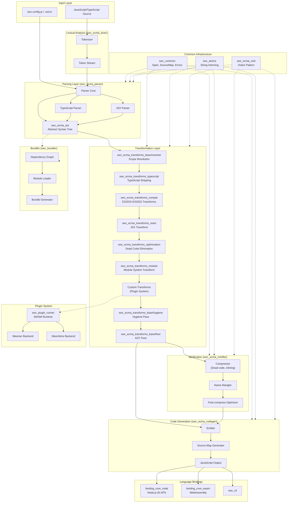
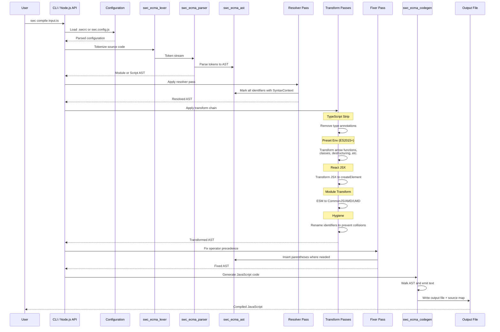
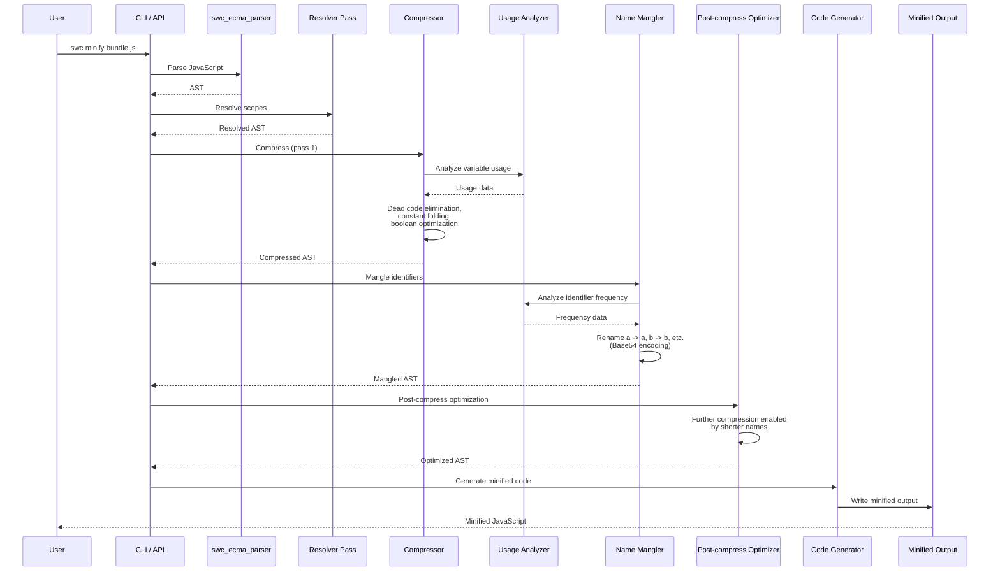
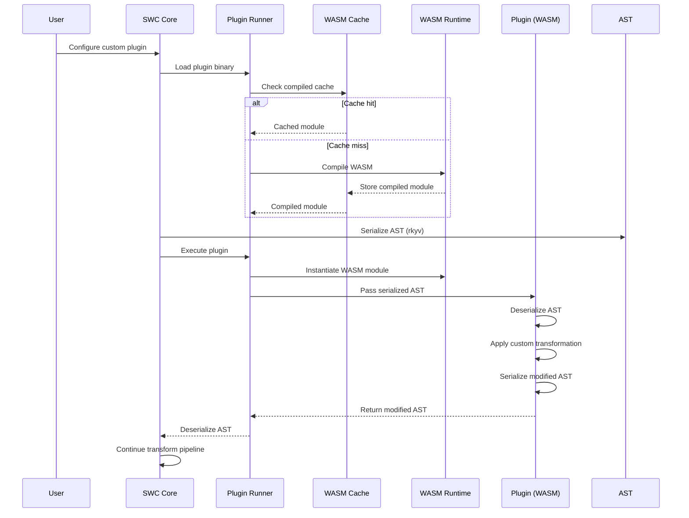
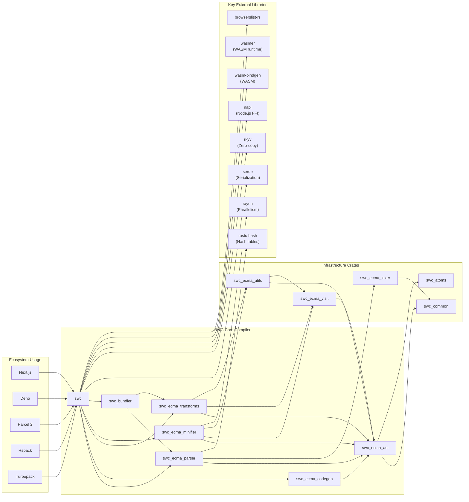

# SWC

> Speedy Web Compiler: A super-fast TypeScript/JavaScript compiler written in Rust

| Metadata | |
|---|---|
| Repository | https://github.com/swc-project/swc |
| License | Apache-2.0 |
| Primary Language | Rust |
| Category | Build Tool |
| Analyzed Release | `v1.15.11` (2026-01-27) |
| Stars (approx.) | 33,200+ |
| Generated by | Claude Sonnet 4.5 (Anthropic) |
| Generated on | 2026-02-08 |

## Overview

SWC (Speedy Web Compiler) is a super-fast TypeScript/JavaScript compiler and bundler written in Rust. It is designed as both a library for Rust developers and a JavaScript library with native bindings, making it 20x faster than Babel on a single thread and 70x faster on four cores. SWC handles transpilation, minification, bundling, and code transformations while maintaining full compatibility with modern JavaScript and TypeScript standards.

Problems it solves:

- Slow JavaScript/TypeScript compilation times in large codebases that bottleneck development and CI/CD pipelines
- Need for a modular, composable compiler infrastructure where individual components (parser, transformer, codegen) can be used independently
- Lack of a unified toolchain that combines parsing, transformation, minification, and bundling with extensibility through plugins
- Difficulty in creating custom JavaScript transformations without deep compiler knowledge

Positioning:

SWC has become the de facto standard for next-generation JavaScript tooling, serving as the compilation engine for Next.js, Deno, Parcel 2, and Rspack. It competes with Babel and esbuild but distinguishes itself through its modular architecture, extensive transformation capabilities, and plugin system. The project follows a workspace structure with 124 crates, enabling fine-grained reuse across the JavaScript tooling ecosystem.

## Architecture Overview

SWC employs a classic compiler pipeline architecture with clear separation between parsing, transformation, and code generation phases. The architecture is highly modular with each phase implemented as independent Rust crates that can be composed together. The visitor pattern is used extensively for AST traversal and transformation, with both immutable (Visit) and mutable (VisitMut/Fold) visitor implementations.

## Core Components

### Lexer and Parser (`crates/swc_ecma_lexer`, `crates/swc_ecma_parser`)

- Responsibility: Tokenization and parsing of JavaScript/TypeScript source code into an Abstract Syntax Tree
- Key files: `crates/swc_ecma_parser/src/parser/mod.rs`, `crates/swc_ecma_lexer/src/lib.rs`
- Design patterns: Recursive descent parser, Pratt parsing for expressions, buffered token stream

The parser is implemented as a recursive descent parser with special handling for operator precedence through Pratt parsing. It supports error recovery, allowing parsing to continue after syntax errors while collecting diagnostic messages. The parser maintains a state machine tracking context flags (in_function, in_async, in_generator, etc.) to correctly handle ambiguous syntax.

TypeScript support is feature-gated through the `typescript` feature flag, with separate parsing logic in `parser/typescript.rs`. The parser uses a checkpoint system for backtracking during ambiguous TypeScript constructs (type assertions vs. JSX). The lexer produces a token stream with span information for accurate source mapping and error reporting.

### AST Definition (`crates/swc_ecma_ast`)

- Responsibility: Defines the complete Abstract Syntax Tree structure for JavaScript, TypeScript, and JSX
- Key files: `crates/swc_ecma_ast/src/lib.rs`, `crates/swc_ecma_ast/src/expr.rs`, `crates/swc_ecma_ast/src/typescript.rs`
- Design patterns: Algebraic data types (enums), AST node trait via procedural macros

The AST is defined using Rust enums and structs decorated with the `ast_node` procedural macro, which auto-generates visitor pattern boilerplate. Each AST node implements `Spanned` to carry source location information. The AST supports three program types: `Module` (ES modules), `Script` (classic scripts), and type-only nodes for TypeScript.

The `Ident` type includes a `SyntaxContext` field for hygiene tracking, enabling scope-aware transformations. Identifiers with different syntax contexts are treated as distinct even if they have the same symbol, preventing unintended variable capture during transformations.

### Visitor Pattern (`crates/swc_ecma_visit`)

- Responsibility: Provides traversal mechanisms for AST transformation and analysis
- Key files: `crates/swc_ecma_visit/src/lib.rs`
- Design patterns: Visitor pattern (non-mutating Visit, mutating VisitMut/Fold)

SWC implements three visitor traits:

1. `Visit`: Immutable visitor for analysis passes that don't modify the AST
2. `VisitMut`: Mutable visitor with in-place modification
3. `Fold`: Functional-style visitor that consumes and produces new AST nodes

The visitor traits are auto-generated via macros, with one method per AST node type. Developers can selectively override only the node types they care about, with default implementations providing automatic traversal. Macros like `noop_visit_type!` can be used to skip TypeScript-specific nodes, reducing binary size for JavaScript-only transformations.

### Resolver and Hygiene (`crates/swc_ecma_transforms_base/src/resolver`, `crates/swc_ecma_transforms_base/src/hygiene`)

- Responsibility: Scope resolution, identifier renaming to prevent collisions, and maintaining lexical hygiene
- Key files: `crates/swc_ecma_transforms_base/src/resolver/mod.rs`, `crates/swc_ecma_transforms_base/src/hygiene/mod.rs`
- Design patterns: Scope chain tracking, Mark-based hygiene system

The resolver pass is the first mandatory transformation applied to any AST. It walks the AST and assigns a unique `SyntaxContext` to each scope (function, block, module). All identifiers are then marked with the context of their declaring scope, and identifier references are resolved to their declarations.

The hygiene pass renames identifiers that have the same symbol but different syntax contexts, ensuring that generated code doesn't accidentally shadow user variables. For example, two variables both named `a` but in different scopes will be renamed to `a` and `a1` respectively.

This system uses two `Mark` values: `unresolved_mark` for unresolved globals (like `require` in CommonJS transforms) and `top_level_mark` for user-defined top-level bindings.

### Transformation Passes (`crates/swc_ecma_transforms_*`)

- Responsibility: Implements ECMAScript compatibility transforms, TypeScript erasure, JSX transforms, and optimizations
- Key files: `crates/swc_ecma_transforms_compat/`, `crates/swc_ecma_transforms_typescript/`, `crates/swc_ecma_transforms_react/`
- Design patterns: Pass composition, visitor chaining, feature detection

SWC provides a comprehensive set of transformation passes organized by category:

1. `swc_ecma_transforms_base`: Core transformations (resolver, hygiene, fixer)
2. `swc_ecma_transforms_compat`: ECMAScript version compatibility (ES3, ES2015-ES2022)
3. `swc_ecma_transforms_typescript`: TypeScript type erasure and enum transformation
4. `swc_ecma_transforms_react`: JSX to React.createElement or automatic JSX runtime
5. `swc_ecma_transforms_module`: Module system transforms (ESM to CommonJS, AMD, UMD)
6. `swc_ecma_transforms_optimization`: Dead code elimination, constant folding, inline functions
7. `swc_ecma_transforms_proposal`: Experimental ECMAScript proposals

Each transform is implemented as a visitor and can be composed with other transforms. The `preset_env` integration uses browserslist to determine which transforms are necessary based on target browser versions.

### Fixer (`crates/swc_ecma_transforms_base/src/fixer`)

- Responsibility: Corrects AST inconsistencies by adding necessary parentheses and fixing operator precedence
- Key files: `crates/swc_ecma_transforms_base/src/fixer/mod.rs`
- Design patterns: Post-processing visitor, precedence-aware AST rewriting

The fixer is the last transformation pass before code generation. It ensures the AST is semantically correct by inserting parentheses where needed to preserve operator precedence. For example, if a transformation generates `BinExpr { left: "1 + 2", op: "*", right: "3" }`, the fixer wraps the left side in parentheses to produce `(1 + 2) * 3`.

This allows transformation passes to manipulate expressions freely without worrying about precedence rules, simplifying transform logic.

### Minifier (`crates/swc_ecma_minifier`)

- Responsibility: Code size reduction through compression, mangling, and optimization
- Key files: `crates/swc_ecma_minifier/src/lib.rs`, `crates/swc_ecma_minifier/src/compress/`, `crates/swc_ecma_minifier/src/pass/mangle_names/`
- Design patterns: Multi-pass optimization, data flow analysis, usage analysis

The minifier runs in multiple phases:

1. Compression: Dead code elimination, constant propagation, boolean optimization, expression simplification
2. Mangling: Identifier shortening (renaming variables to a, b, c, etc.) based on frequency analysis
3. Post-compression: Additional optimizations enabled by mangling

The minifier uses `swc_ecma_usage_analyzer` to perform data flow analysis, tracking variable usage to safely eliminate unused code. It supports advanced features like property mangling, top-level optimization, and integration with external tools like Terser for compatibility.

The minifier is highly parallel, using rayon for multi-threaded compression of independent code sections.

### Code Generator (`crates/swc_ecma_codegen`)

- Responsibility: Emitting JavaScript source code from the AST with optional source maps
- Key files: `crates/swc_ecma_codegen/src/lib.rs`
- Design patterns: Emitter pattern, writer abstraction

The code generator walks the AST and emits JavaScript text through a `WriteJs` trait. It supports minified and pretty-printed output modes, with configurable indentation and whitespace. Source map generation is integrated, with span information from AST nodes mapped to output positions.

The emitter handles comment preservation by consulting the `Comments` trait during emission, inserting comments at appropriate positions. It also handles edge cases like automatic semicolon insertion and ensuring valid identifier escaping.

### Bundler (`crates/swc_bundler`)

- Responsibility: Module bundling with dependency resolution and code splitting
- Key files: `crates/swc_bundler/src/bundler/mod.rs`, `crates/swc_bundler/src/dep_graph/mod.rs`
- Design patterns: Dependency graph construction, topological sorting, tree shaking

The bundler constructs a dependency graph by parsing entry points and recursively following import statements. It supports various module formats (ESM, CommonJS) and performs tree shaking to eliminate unused exports. The bundler can generate multiple bundles for code splitting scenarios.

Module resolution follows Node.js resolution algorithm with configurable resolvers (node_modules, TypeScript paths, custom). The bundler integrates with the transformation pipeline to apply transforms during bundling.

### Plugin System (`crates/swc_plugin_runner`, `crates/swc_plugin`)

- Responsibility: Enables custom transformations via WebAssembly plugins
- Key files: `crates/swc_plugin_runner/src/lib.rs`, `crates/swc_plugin_macro/src/lib.rs`
- Design patterns: Plugin architecture, sandboxed execution via WASM, serialization bridge

SWC supports custom transformations through WebAssembly plugins compiled from Rust using the `swc_plugin` API. Plugins receive a serialized AST via the `rkyv` zero-copy deserialization library, apply transformations, and return the modified AST.

Two WASM runtimes are supported: Wasmer and Wasmtime, selected via feature flags. The plugin runner handles versioning, caching compiled modules, and providing a sandboxed environment for plugin execution.

Plugins are authored in Rust using the `#[plugin_transform]` macro and distributed as WASM binaries. The host-plugin boundary uses versioned serialization to prevent ABI mismatches.

### Common Infrastructure (`crates/swc_common`, `crates/swc_atoms`)

- Responsibility: Shared utilities for span tracking, error reporting, and string interning
- Key files: `crates/swc_common/src/lib.rs`, `crates/swc_atoms/src/lib.rs`
- Design patterns: String interning (atoms), source map abstraction, diagnostic system

`swc_common` provides core abstractions used throughout the compiler:

- `Span`: Source location tracking with byte positions
- `SourceMap`: Manages multiple source files and coordinate mapping
- `HANDLER`: Thread-local error handler for diagnostics
- `GLOBALS`: Thread-local storage for compiler globals
- `Mark`: Hygiene markers for scope tracking

`swc_atoms` implements string interning using the `hstr` crate. Frequently used strings (identifiers, keywords) are interned to reduce memory usage and enable fast equality comparisons via pointer equality.

### Language Bindings (`bindings/binding_core_node`, `bindings/binding_core_wasm`)

- Responsibility: Exposes SWC functionality to JavaScript/TypeScript and WebAssembly environments
- Key files: `bindings/binding_core_node/`, `bindings/binding_core_wasm/`
- Design patterns: Foreign Function Interface (FFI), N-API bindings, WASM bindings

The Node.js binding uses N-API (via the `napi` crate) to expose SWC as a native Node.js module. It provides synchronous and asynchronous APIs for parsing, transforming, and minifying code. Configuration is passed as JavaScript objects and deserialized to Rust structs via `serde`.

The WebAssembly binding compiles SWC to WASM for browser or Deno usage. It uses `wasm-bindgen` for JavaScript interop and `serde-wasm-bindgen` for configuration serialization.

Both bindings handle worker thread integration, memory management, and error translation from Rust to JavaScript exceptions.

## Data Flow

### JavaScript Transpilation Flow

### Minification Flow

### Plugin Execution Flow

## Key Design Decisions

### 1. Rust Implementation with Extensive Modularity

- Choice: Implemented in Rust with 124 separate crates in a workspace
- Rationale: Rust provides memory safety, fearless concurrency, and zero-cost abstractions essential for high performance. The modular crate structure allows fine-grained reuse across the JavaScript tooling ecosystem. Projects can depend on just `swc_ecma_parser` without pulling in transformation or code generation code.
- Trade-offs: Higher initial development complexity compared to JavaScript implementations. Longer compilation times for the compiler itself. Requires Rust knowledge for core contributions, limiting contributor pool compared to JavaScript-based tools.

### 2. Three-Tier Visitor Pattern (Visit, VisitMut, Fold)

- Choice: Provide three visitor traits with different mutation semantics
- Rationale: Different transformations have different requirements. Analysis passes need read-only access (Visit), some transforms benefit from in-place mutation (VisitMut), while others need functional composition (Fold). Providing all three maximizes flexibility and performance.
- Trade-offs: Increased API surface area and learning curve for plugin authors. Automatic trait derivation via macros generates significant code, increasing compile times and binary size. Requires careful choice of visitor type for optimal performance.

### 3. Mark-Based Hygiene System

- Choice: Use `Mark` values combined with symbol names to create unique identifier contexts
- Rationale: Allows transformations to generate fresh identifiers without worrying about name collisions with user code or other transforms. The two-mark system (unresolved_mark, top_level_mark) provides precise control over global vs. user binding references.
- Trade-offs: Requires resolver and hygiene passes to run before and after transformations, adding overhead. Developers must understand hygiene to write correct transforms. Increased AST size due to SyntaxContext storage on every identifier.

### 4. WebAssembly Plugin System via Serialization

- Choice: Plugins are compiled to WASM and communicate via serialized AST using rkyv
- Rationale: WASM provides sandboxing and language portability (plugins can theoretically be written in any WASM-compilable language). Serialization creates a stable ABI boundary with versioning support. rkyv's zero-copy deserialization minimizes overhead.
- Trade-offs: Serialization/deserialization adds overhead compared to native Rust plugins. WASM runtime integration complexity (Wasmer vs. Wasmtime). Plugin debugging is more difficult than debugging native code. Limited to Rust in practice due to AST complexity.

### 5. Integrated Bundler with Transform Pipeline

- Choice: Bundle `swc_bundler` as part of the SWC project with deep integration into the transformation pipeline
- Rationale: Allows bundling to benefit from existing parsing, transformation, and code generation infrastructure. Tree shaking can leverage the same usage analysis as minification. Single tool for compilation and bundling simplifies tooling setup.
- Trade-offs: Bundler adds complexity to the project. Increased scope makes the project harder to maintain. Alternative dedicated bundlers (esbuild, Rollup) may have better performance or features for pure bundling use cases.

### 6. AST Node Codegen via Procedural Macros

- Choice: Use procedural macros (`ast_node`, visitor derives) to generate boilerplate code
- Rationale: Ensures consistency across the large AST definition. Reduces manual maintenance burden when adding new node types. Automatically generates visitor pattern implementations, serialization code, and utility methods.
- Trade-offs: Increased compilation time due to macro expansion. Harder to debug macro-generated code. IDE support for macro-expanded code is limited. New contributors must understand the macro system to modify AST definitions.

### 7. Separate Parser and Lexer Crates

- Choice: Split lexical analysis (swc_ecma_lexer) from parsing (swc_ecma_parser)
- Rationale: Enables reuse of just the lexer for syntax highlighting or token-based analysis tools. Simplifies testing of each layer independently. Follows traditional compiler design separation of concerns.
- Trade-offs: Additional abstraction overhead. Slight performance penalty from the abstraction layer. More crates to maintain and version.

## Dependencies

## Testing Strategy

SWC employs comprehensive multi-layer testing covering individual crates, integration scenarios, and conformance with ECMAScript standards.

Unit tests: Each crate contains extensive unit tests in `tests/` directories. The parser uses snapshot testing with `test262` (the official ECMAScript conformance suite), ensuring parsed ASTs match expected results. Tests use the `testing` crate for test fixtures and golden file comparisons. The test suite includes over 40,000 test262 tests for parser validation.

Integration tests: End-to-end tests verify the complete compilation pipeline from source to output. The `swc_ecma_transforms_testing` crate provides utilities for writing transform tests with input/output file pairs. Transform tests validate both correctness and source map accuracy. The bundler has integration tests covering module resolution, circular dependencies, and code splitting scenarios.

CI/CD: GitHub Actions runs tests on Linux, macOS, and Windows across multiple Rust versions. The CI pipeline includes benchmarks to detect performance regressions using criterion.rs. Automated fuzzing runs continuously to discover parser edge cases. Release builds use optimized compilation profiles with LTO (link-time optimization) and stripped symbols for minimal binary size.

## Key Takeaways

1. Modular compiler architecture enables ecosystem reuse: By splitting the compiler into 124 granular crates, SWC enables other tools to depend on specific components (just the parser, just transforms, etc.) without pulling in the entire compiler. This design has made SWC the foundation for numerous JavaScript tools (Next.js, Deno, Parcel, Rspack), demonstrating that investment in modularity pays off through ecosystem adoption.

2. Hygiene systems prevent transformation bugs: The mark-based hygiene system with separate unresolved_mark and top_level_mark allows generated code to safely reference globals and user code without name collisions. This design ensures that composed transformations remain correct even when they independently generate the same variable names. The lesson: lexical hygiene should be a first-class concern in compiler design, not an afterthought.

3. Multi-tier visitor patterns balance flexibility and performance: Providing Visit (immutable), VisitMut (in-place mutation), and Fold (functional) visitor traits gives transformation authors the right tool for each job. Analysis passes use Visit to avoid cloning, performance-critical transforms use VisitMut for in-place updates, and compositional transforms use Fold for clarity. The trade-off is increased API surface, but the performance benefits justify the complexity.

4. Serialization boundaries enable safe extensibility: The plugin system uses WASM and rkyv serialization to create a stable ABI that supports versioning and sandboxing. While serialization overhead exists, the benefits (plugin isolation, stable API) outweigh the cost. This pattern is applicable to any system needing third-party extensibility with strong compatibility guarantees.

5. Macro-driven code generation maintains consistency at scale: With hundreds of AST node types, manually writing visitor implementations and serialization code would be error-prone and time-consuming. Procedural macros ensure consistency, reduce maintenance burden, and make adding new AST nodes straightforward. However, this requires tooling investment (good error messages, documentation) to keep the macros maintainable.

## References

- [SWC Official Documentation](https://swc.rs/docs/installation/)
- [SWC GitHub Repository](https://github.com/swc-project/swc)
- [SWC Architecture Documentation](https://github.com/swc-project/swc/blob/main/ARCHITECTURE.md)
- [SWC Rust API Documentation](https://rustdoc.swc.rs/swc/)
- [Babel Migration Guide](https://swc.rs/docs/migrating-from-babel)
- [SWC Benchmark Results](https://swc.rs/docs/benchmark-transform)
- [TC39 Test262 Conformance Suite](https://github.com/tc39/test262)
