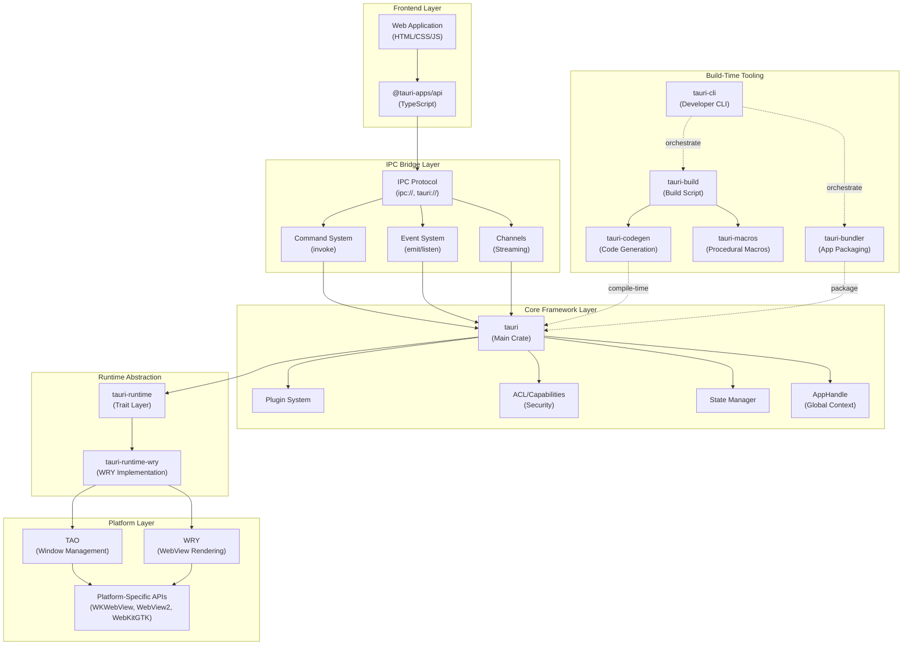
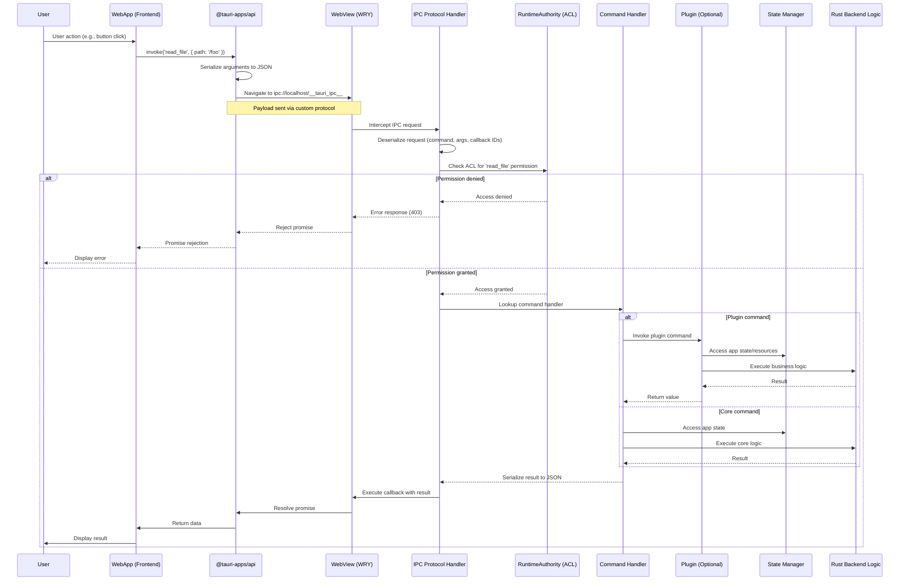
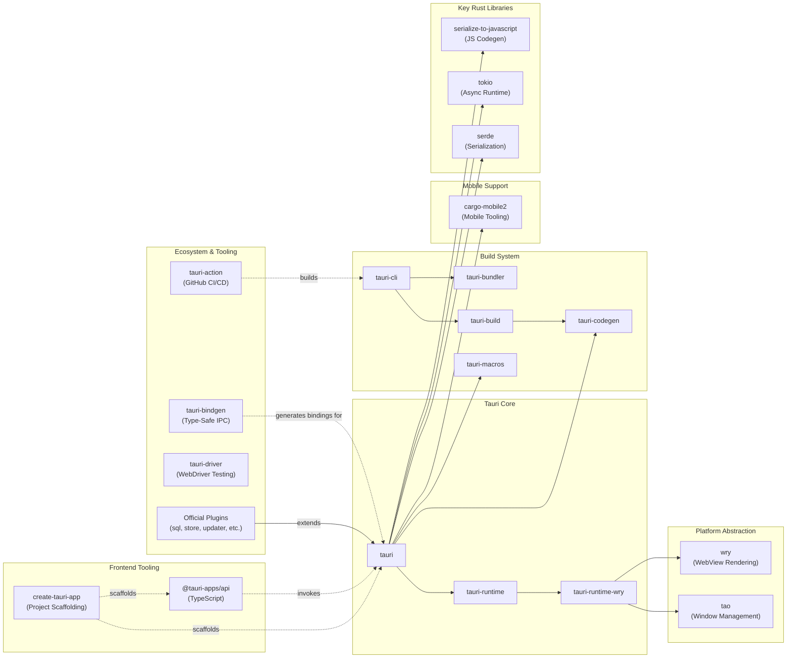

# Tauri

> Build smaller, faster, and more secure desktop and mobile applications with a web frontend

| Metadata | |
|---|---|
| Repository | https://github.com/tauri-apps/tauri |
| License | Apache-2.0 / MIT |
| Primary Language | Rust |
| Analyzed Release | `v2.0.5` (2026-02-04) |
| Stars (approx.) | 102,000+ |
| Generated by | Claude Opus 4.6 (Anthropic) |
| Generated on | 2026-02-08 |

## Overview

Tauri is a framework for building cross-platform desktop and mobile applications using web technologies for the UI and Rust for the backend. Unlike Electron which bundles an entire Chromium browser and Node.js runtime, Tauri leverages the operating system's native webview, resulting in binaries that are typically 10-100x smaller with significantly lower memory footprint.

Problems it solves:

- Large bundle sizes and memory consumption inherent in Electron-based applications that ship with their own browser engine
- Security vulnerabilities from exposing Node.js APIs directly to the frontend without proper isolation
- Lack of native mobile support in existing web-based desktop frameworks
- Complex cross-platform build processes requiring separate codebases for desktop and mobile

Positioning:

Tauri competes directly with Electron and NW.js in the desktop space, offering superior performance and security at the cost of slightly less webview API consistency across platforms. With v2.0's mobile support for iOS and Android, Tauri now competes with frameworks like React Native and Flutter, but maintains the web-first approach while enabling native code integration. It is particularly favored in security-conscious environments and resource-constrained scenarios.

## Architecture Overview

Tauri employs a multi-layered architecture with strict separation between frontend (webview), IPC bridge, core framework, runtime abstraction, and platform-specific integrations. All communication between JavaScript and Rust occurs via serialized messages over IPC channels, never through shared memory or direct function calls.

## Core Components

### Tauri Core (`crates/tauri/src/lib.rs`)

- Responsibility: Main orchestration layer that brings together runtime, IPC, state management, plugins, and security
- Key files: `crates/tauri/src/lib.rs`, `crates/tauri/src/app.rs`, `crates/tauri/src/manager.rs`
- Design patterns: Builder pattern for app initialization, dependency injection via state management

The tauri crate is the central integration point. It reads `tauri.conf.json` at compile time to enable features and configure the app. It manages script injection for polyfills, hosts the IPC command and event system, and provides the runtime APIs. The `App` struct is built via a fluent `Builder` API that accepts plugins, setup hooks, and invoke handlers. The `AppHandle` provides global access to app state, window management, and plugin APIs.

### IPC Layer (`crates/tauri/src/ipc/mod.rs`)

- Responsibility: Secure bidirectional communication between frontend JavaScript and backend Rust
- Key files: `crates/tauri/src/ipc/mod.rs`, `crates/tauri/src/ipc/command.rs`, `crates/tauri/src/ipc/channel.rs`, `crates/tauri/src/event.rs`
- Design patterns: Command pattern, Event bus pattern, Channel pattern for streaming

Tauri's IPC system uses custom URI schemes (`ipc://` and `tauri://`) to transport messages. The primary mechanism is `invoke()`, which uses a JSON-RPC-like protocol to serialize requests and responses. Rust functions decorated with `#[tauri::command]` become callable from JavaScript. The event system provides fire-and-forget one-way messages that can be emitted by either frontend or backend. Channels support streaming large data or continuous updates. The `RuntimeAuthority` enforces ACL-based permissions, ensuring commands are only accessible when explicitly granted via capabilities.

### Plugin System (`crates/tauri/src/plugin.rs`)

- Responsibility: Extensibility mechanism allowing first-class and third-party functionality to integrate seamlessly
- Key files: `crates/tauri/src/plugin.rs`
- Design patterns: Plugin pattern, Trait-based polymorphism, Hook pattern

The `Plugin` trait defines lifecycle hooks: `initialize()`, `window_created()`, `webview_created()`, `on_navigation()`, `on_page_load()`, `on_event()`, and `extend_api()`. Plugins can inject initialization scripts, register custom commands, provide URI scheme handlers, and manage their own state. Both core Tauri functionality and user extensions use the same plugin interface. Plugins are typically distributed as crates with a builder API (e.g., `tauri_plugin_sql::Builder::default().build()`). Mobile plugins can expose Swift (iOS) and Kotlin (Android) code to the frontend via annotations and FFI.

### Runtime Abstraction (`crates/tauri-runtime/src/lib.rs`)

- Responsibility: Abstraction layer decoupling Tauri from specific webview/window implementations
- Key files: `crates/tauri-runtime/src/lib.rs`, `crates/tauri-runtime-wry/src/lib.rs`
- Design patterns: Adapter pattern, Trait abstraction

The `tauri-runtime` crate defines traits for `Runtime`, `RuntimeHandle`, `Dispatch`, `WebviewDispatch`, and `WindowDispatch`. This allows Tauri to support different webview backends theoretically, though WRY is the only production implementation. The `tauri-runtime-wry` crate implements these traits by bridging to TAO (window management) and WRY (webview rendering). This abstraction layer handles window lifecycle events, menu interactions, tray icons, drag-and-drop, and monitor detection.

### Build-Time Code Generation (`crates/tauri-codegen/src/context.rs`)

- Responsibility: Compile-time asset embedding, configuration parsing, and code generation
- Key files: `crates/tauri-codegen/src/context.rs`, `crates/tauri-build/src/lib.rs`, `crates/tauri-macros/src/`
- Design patterns: Code generation, Procedural macros, Asset embedding

The build system parses `tauri.conf.json` at compile time and generates the `Context` struct containing all configuration and embedded assets. Assets (HTML, CSS, JS, images) are hashed, optionally compressed, and embedded into the binary. CSP (Content Security Policy) hashes for inline scripts are computed during the build. The `#[tauri::command]` macro uses `tauri-macros` and `tauri-codegen` to generate argument deserialization and response serialization code. ACL manifests and capabilities are also resolved at build time and embedded.

### TAO - Window Management (`tauri-apps/tao`)

- Responsibility: Cross-platform window creation, event loop, and system integration
- Key files: External crate maintained by Tauri team, fork of winit
- Design patterns: Event loop pattern, Platform abstraction

TAO is a fork of winit extended with features like menu bars, system tray icons, and global shortcuts. It provides a unified API for creating windows, handling user input events (keyboard, mouse, touch), managing the application lifecycle, and interacting with the OS (e.g., requesting user attention, setting progress bars). TAO runs the main event loop and dispatches events to Tauri and WRY. It supports Windows, macOS, Linux (X11 and Wayland), iOS, and Android.

### WRY - WebView Rendering (`tauri-apps/wry`)

- Responsibility: Cross-platform webview abstraction and rendering
- Key files: External crate maintained by Tauri team
- Design patterns: Adapter pattern, Platform-specific implementations

WRY provides a unified interface to system webviews: WKWebView on macOS and iOS, WebView2 on Windows, WebKitGTK on Linux, and Android System WebView on Android. It handles webview initialization, custom protocol registration (for `tauri://` scheme), JavaScript execution, navigation, and IPC message passing. WRY manages the lifetime of the webview within the window provided by TAO. It also supports features like transparent webviews, custom user agents, and initialization scripts.

### ACL and Capabilities (`crates/tauri/src/ipc/authority.rs`)

- Responsibility: Fine-grained permission system controlling frontend access to Tauri commands
- Key files: `crates/tauri/src/ipc/authority.rs`, `crates/tauri-utils/src/acl/`
- Design patterns: Capability-based security, Policy enforcement

Tauri v2 introduced a capability-based security model. Permissions define which commands are allowed or denied. Capabilities group permissions and assign them to specific windows or webviews (by name or glob pattern). The `RuntimeAuthority` evaluates every `invoke()` call against the ACL, rejecting unauthorized commands. Capabilities can also define scopes, restricting commands to specific file paths or other resources. Capabilities are declared in JSON files (e.g., `capabilities/*.json`) and resolved at build time. Dynamic capabilities can be added at runtime via `Manager::add_capability()` when the `dynamic-acl` feature is enabled.

## Data Flow

### Typical Command Invocation Flow

## Key Design Decisions

### 1. Native WebView Instead of Bundled Browser

- Choice: Use platform-native webviews (WKWebView, WebView2, WebKitGTK) rather than bundling Chromium
- Rationale: Dramatically reduces binary size (from ~100MB to ~5MB for simple apps) and memory footprint. Leverages OS-provided security updates and hardware acceleration. Avoids licensing complexity of bundling Chromium
- Trade-offs: Less control over webview API surface and rendering behavior. Inconsistent JavaScript APIs across platforms (requires polyfills). Minimum OS version constraints (Windows 10, macOS 10.15, modern Linux distributions). Cannot use cutting-edge browser features unavailable in older system webviews

### 2. IPC via Custom URI Schemes

- Choice: Implement IPC by intercepting custom protocol requests (`ipc://`, `tauri://`) rather than exposing a synchronous bridge object
- Rationale: Avoids security risks of directly exposing Rust functions to JavaScript (no prototype pollution or global namespace pollution). Enables asynchronous-only APIs, preventing blocking the UI thread. Works consistently across all platforms including mobile
- Trade-offs: All calls are asynchronous (no synchronous APIs). Slightly higher overhead for simple calls due to serialization. Requires polyfill for certain scenarios (e.g., custom protocol on Android requires special handling)

### 3. Build-Time Configuration and Asset Embedding

- Choice: Parse `tauri.conf.json`, resolve capabilities, and embed assets at compile time via procedural macros and build scripts
- Rationale: Eliminates runtime configuration parsing overhead. Allows dead code elimination of unused features. Embeds assets directly into the binary, avoiding separate resource files and filesystem dependencies. Computes CSP hashes at build time for inline scripts
- Trade-offs: Requires recompilation for configuration changes. Larger binary sizes when embedding many assets. Build time increases with asset count and compression level

### 4. Capability-Based Security Model (ACL)

- Choice: Require explicit permission grants via capabilities for all commands, rather than allowing all commands by default
- Rationale: Secure by default - reduces attack surface if frontend is compromised. Follows principle of least privilege. Enables different permission sets for different windows (e.g., admin panel vs. main window). Supports remote URL capabilities for hybrid apps
- Trade-offs: More verbose configuration required. Steeper learning curve for beginners. Runtime overhead of ACL checks on every `invoke()` call. Requires capability management tooling

### 5. Plugin-Based Extensibility with Trait System

- Choice: Define plugins via the `Plugin` trait with lifecycle hooks, rather than a dynamic loading system
- Rationale: Type-safe plugin development with compile-time checks. No runtime overhead of dynamic linking. Enables plugins to hook into all lifecycle events (initialization, navigation, page load). Allows plugins to inject initialization scripts and register commands. Same interface for first-party and third-party plugins
- Trade-offs: Plugins must be compiled into the binary (no runtime plugin loading without WASM). Requires recompilation to add/remove plugins. Plugin updates require app rebuilds

### 6. Mobile Support via cargo-mobile2 Integration

- Choice: Extend Tauri to mobile platforms (iOS, Android) by integrating with cargo-mobile2 rather than building a separate mobile framework
- Rationale: Enables true cross-platform development (desktop + mobile from single codebase). Reuses Tauri's core architecture and IPC system. Allows native code integration via Swift (iOS) and Kotlin (Android) plugins
- Trade-offs: Increased complexity in build system. Mobile-specific limitations (e.g., raw IPC payloads not supported on Android). Requires mobile development toolchains (Xcode, Android Studio). Different system APIs on mobile require conditional compilation

### 7. Runtime Abstraction Layer

- Choice: Introduce `tauri-runtime` trait layer between Tauri core and WRY/TAO
- Rationale: Decouples Tauri from specific webview implementation. Theoretically allows alternative webview backends. Enables testing via mock runtime implementations. Provides clean abstraction for platform-specific behavior
- Trade-offs: Additional indirection adds complexity. In practice, only WRY implementation exists. Trait API must remain generic, limiting ability to expose platform-specific features directly

## Dependencies

## Testing Strategy

Tauri employs a comprehensive multi-layered testing strategy covering unit tests, integration tests, platform-specific tests, and end-to-end tests.

Unit tests: Each crate has extensive unit tests in `_test.rs` files or inline `#[cfg(test)]` modules. Core components like IPC, state management, and command routing have isolated tests. Mocking is used for runtime dependencies via the trait abstraction layer.

Integration tests: The `examples/` directory contains full Tauri applications that serve as integration tests, covering common use cases (API, isolation pattern, multiwindow, streaming, state management). These are tested in CI across platforms.

Platform-specific tests: Separate CI workflows test Linux (Ubuntu), macOS (x86_64 and ARM64), Windows (MSVC), iOS (ARM64), and Android (ARM64). The test matrix includes `--no-default-features` and `--all-features` to catch feature flag issues.

Mobile tests: iOS tests build for `aarch64-apple-ios` target, Android tests build for `aarch64-linux-android` using cross-compilation. Actual device testing is performed manually due to CI limitations.

End-to-end tests: `tauri-driver` provides WebDriver implementation for automated UI testing. The `webdriver/` examples demonstrate usage with testing frameworks.

Build system tests: The CLI has separate test workflows (`test-cli-rs.yml`, `test-cli-js.yml`) validating code generation, bundling, and cross-compilation.

Benchmarks: Performance benchmarks in `bench/tests/` measure overhead of CPU-intensive tasks, file transfer, and cold start times.

CI/CD: GitHub Actions automates testing on every push and PR. Workflows include format checking (`fmt.yml`), linting (`lint-rust.yml`, `lint-js.yml`), security audits (`audit.yml`, `supply-chain.yml`), and license header validation. Releases are managed via covector for coordinated multi-crate versioning. The `tauri-action` workflow builds binaries for all platforms and publishes releases.

## Key Takeaways

1. Native webview strategy: Choosing platform-native webviews over bundling a browser is a powerful trade-off that dramatically improves resource efficiency and security update delivery, at the cost of API consistency. This is applicable to any framework targeting multiple platforms - consider whether you control the runtime or leverage the platform's runtime.

2. IPC via protocol interception: Implementing IPC by intercepting custom URI schemes rather than exposing a synchronous bridge is a security pattern applicable beyond Tauri. It enforces asynchronous-only APIs, prevents namespace pollution, and provides a clear security boundary. Applicable to browser extensions, hybrid apps, and sandboxed environments.

3. Capability-based security: The ACL/capabilities model demonstrates how to implement fine-grained permissions without sacrificing usability. Permissions are explicitly granted per window/webview, supporting the principle of least privilege while allowing high-privilege and low-privilege components in the same app. Broadly applicable to plugin systems, microservices, and multi-tenant applications.

4. Build-time optimization: Aggressive compile-time configuration parsing, asset embedding, and code generation reduces runtime overhead and binary size. This approach is valuable for resource-constrained environments (embedded, mobile) and improves startup time. The trade-off is longer build times and less runtime flexibility.

5. Trait-based runtime abstraction: The runtime abstraction layer via traits enables decoupling from implementation details while maintaining type safety. Though only one implementation (WRY) currently exists, the abstraction facilitates testing and future extensibility. Applicable to any system where the implementation may vary by platform or deployment.

6. Plugin lifecycle hooks: The `Plugin` trait with lifecycle hooks (initialization, navigation, page load, events) is a pattern for extensibility that scales from first-party features to third-party plugins. By using the same interface for core and community plugins, the framework maintains architectural consistency and lowers the barrier to contribution.

7. Mobile convergence: Extending a desktop framework to mobile while maintaining a single codebase demonstrates the power of layered architecture. Tauri's separation between core logic, platform abstraction (WRY/TAO), and platform-specific implementations enables supporting five platforms (Windows, macOS, Linux, iOS, Android) without code duplication. This is a model for any cross-platform framework.

## References

- [Tauri Official Documentation](https://v2.tauri.app/)
- [Tauri Architecture](https://v2.tauri.app/concept/architecture/)
- [Inter-Process Communication](https://v2.tauri.app/concept/inter-process-communication/)
- [Security - Capabilities](https://v2.tauri.app/security/capabilities/)
- [Security - Permissions](https://v2.tauri.app/security/permissions/)
- [Tauri 2.0 Stable Release](https://v2.tauri.app/blog/tauri-20/)
- [tauri-apps/tauri GitHub Repository](https://github.com/tauri-apps/tauri)
- [tauri-apps/tauri ARCHITECTURE.md](https://github.com/tauri-apps/tauri/blob/dev/ARCHITECTURE.md)
- [DeepWiki - tauri-apps/tauri](https://deepwiki.com/tauri-apps/tauri)
- [TAO - Window Management Library](https://github.com/tauri-apps/tao)
- [WRY - WebView Library](https://github.com/tauri-apps/wry)
