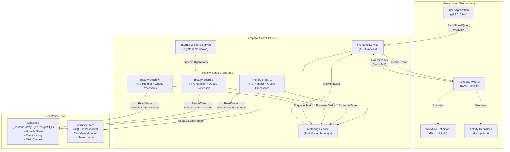
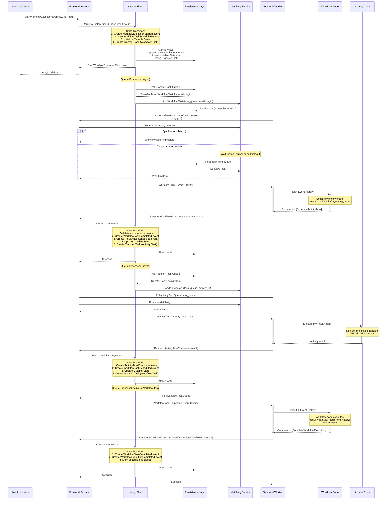
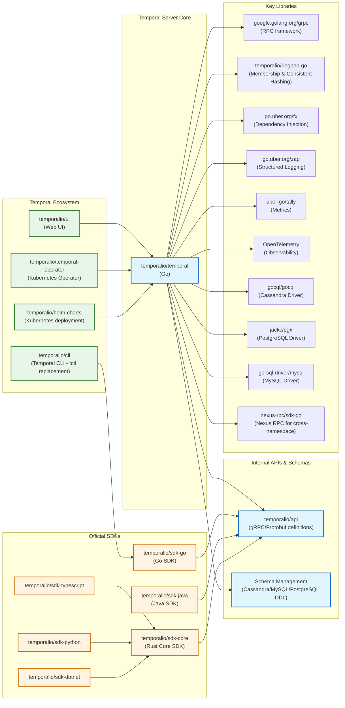

# Temporal

> A durable execution platform that enables developers to build scalable applications without sacrificing productivity or reliability

| Metadata | |
|---|---|
| Repository | https://github.com/temporalio/temporal |
| License | MIT License |
| Primary Language | Go |
| Analyzed Release | `v1.29.3` (2026-02-04) |
| Stars (approx.) | 18,000+ |
| Generated by | Claude Opus 4.6 (Anthropic) |
| Generated on | 2026-02-08 |

## Overview

Temporal is a durable execution platform that executes units of application logic called Workflows in a resilient manner that automatically handles intermittent failures and retries failed operations. Originally forked from Uber's Cadence in 2019, Temporal has become the de facto standard for durable workflow orchestration, adopted by Netflix, Stripe, Snap, and thousands of other companies.

Problems it solves:

- Ensuring reliable execution of long-running distributed workflows across process crashes, network failures, and infrastructure outages
- Eliminating the complexity of manually implementing retry logic, timeout handling, state persistence, and failure recovery in microservices
- Providing exactly-once semantics for business-critical operations without requiring developers to understand distributed systems theory
- Enabling observable and debuggable distributed systems through comprehensive event history and replay capabilities

Positioning:

Temporal competes with AWS Step Functions, Apache Airflow, and Camunda but distinguishes itself through its code-first approach where workflows are defined as regular code rather than JSON/YAML/BPMN. Unlike state machine-based orchestrators, Temporal virtualizes execution across a series of processes using event sourcing, allowing developers to write complex business logic with branching, loops, and conditional logic while the platform handles durability automatically. It positions itself as infrastructure for "durable execution" rather than just workflow orchestration.

## Architecture Overview

Temporal employs a service-oriented architecture with clear separation between user-hosted Worker processes and the Temporal Server cluster. The server consists of four internal services (Frontend, History, Matching, and Internal Workers) that communicate via gRPC, backed by a pluggable persistence layer supporting Cassandra, MySQL, PostgreSQL, or SQLite.

## Core Components

### Frontend Service (`service/frontend`)

- Responsibility: API gateway and request routing for all client and worker interactions
- Key files: `service/frontend/handler.go`, `api/workflowservice/v1/service.proto`
- Design patterns: Gateway pattern, gRPC interceptor chain, rate limiting

The Frontend Service is the entry point for all external gRPC requests from User Applications (starting/canceling/querying workflows) and Temporal Workers (polling for tasks, responding to task completion). It handles authentication, authorization, rate limiting, namespace validation, and request routing to the appropriate History or Matching service instance. The Frontend implements the public WorkflowService API defined in protobuf, which includes operations like StartWorkflowExecution, SignalWorkflowExecution, and PollWorkflowTaskQueue.

Frontend does not maintain workflow state itself; it acts purely as a stateless router. It uses a membership protocol (via Ringpop library) to discover which History Service instance owns a given workflow execution (determined by hashing the workflow ID and namespace to a History Shard). For polling requests, it routes to the Matching Service instance responsible for the requested Task Queue.

### History Service (`service/history`)

- Responsibility: Manages lifecycle and state of individual Workflow Executions through event sourcing
- Key files: `service/history/history_engine.go`, `service/history/workflow/mutable_state_impl.go`, `service/history/queues/`
- Design patterns: Event sourcing, CQRS, Transactional Outbox pattern, Sharding

The History Service is the core of Temporal's durable execution guarantee. Each History Service process owns a subset of History Shards (typically 500 shards per process). A History Shard is responsible for all Workflow Executions that hash to that shard, managing their complete lifecycle.

When handling requests (from User Application or Worker task completion), the History Service performs a state transition: (1) determines new History Events implied by the request, (2) appends these events to the Workflow Execution's Event History, (3) updates Mutable State (in-memory summary of workflow status including pending activities, timers, child workflows), (4) creates internal tasks (Transfer Tasks for immediate execution, Timer Tasks for scheduled execution), and (5) commits everything atomically to the database.

History Shards run asynchronous Queue Processors that continuously process internal task queues. The Transfer Task Queue contains tasks that should execute immediately, primarily creating Workflow Tasks and Activity Tasks in the Matching Service. The Timer Task Queue contains scheduled tasks like workflow sleep timers, activity timeouts, and retry timers. Queue Processors implement the Transactional Outbox pattern, ensuring that tasks generated during state transitions are eventually processed even after shard failover.

Mutable State is cached in memory and persisted as a single row in the executions table (Cassandra partition or SQL row), containing maps of pending activities, timers, child workflows, and signals. History Events are persisted separately in append-only storage (history_node and history_tree tables), enabling event replay for workflow determinism verification.

### Matching Service (`service/matching`)

- Responsibility: Manages Task Queues for dispatching Workflow Tasks and Activity Tasks to Workers
- Key files: `service/matching/handler.go`, `api/matchingservice/v1/service.proto`
- Design patterns: Task queue partitioning, synchronous matching, backpressure handling

The Matching Service implements the Task Queue abstraction that connects the Temporal Server to Workers. It maintains separate queues for Workflow Tasks (triggering workflow code execution) and Activity Tasks (triggering activity execution). Each Task Queue is partitioned (default 4 partitions) to increase throughput, with partitions arranged in a tree hierarchy for load balancing.

Matching Service operates in two modes: (1) synchronous matching, where if a Worker is currently polling when a task arrives, the task is immediately delivered without touching the database (reduces latency and database load), and (2) asynchronous matching, where tasks are persisted to the database and delivered to Workers on subsequent polls.

When throughput is low, Matching implements task/poller forwarding between partitions. An empty partition receiving a poll can forward it to the parent partition. Similarly, a task arriving at a partition with no pollers can be forwarded to the parent partition hoping to find a waiting Worker. The root partition acts as a rendezvous point, ensuring tasks and pollers eventually meet even under unbalanced load.

### Workflow Execution Mutable State (`service/history/workflow/mutable_state_impl.go`)

- Responsibility: In-memory representation of a Workflow Execution's current state
- Key files: `service/history/workflow/mutable_state_impl.go`, `service/history/workflow/mutable_state.go` (interface)
- Design patterns: Aggregate pattern (DDD), Snapshot/diff persistence

MutableState is the single source of truth for a workflow's current state during execution. It maintains maps of pending activities (activity ID to activity info), pending timers (timer ID to timer info), pending child workflows, buffered events, and execution state (running, completed, failed). This data is derived from the Event History but cached for performance.

MutableState implements an in-memory mutation model: when handling a request, the History Service loads MutableState from the database, applies mutations (add activity, complete timer, etc.), then persists changes. The implementation tracks dirty state to persist only what changed (snapshot vs. diff updates).

The MutableState enforces workflow determinism constraints. When a Worker returns commands from workflow task completion, MutableState validates that the command sequence is consistent with the Event History (no skipped events, no reordering). If a workflow is replayed after server restart, MutableState is reconstructed by replaying all History Events, ensuring identical state regardless of when the replay occurs.

### Task Queue Processors (`service/history/queues/`)

- Responsibility: Asynchronously processes Transfer Tasks, Timer Tasks, Visibility Tasks, and Replication Tasks
- Key files: `service/history/queues/queue_base.go`, `service/history/queues/reader.go`, `service/history/queues/executor.go`
- Design patterns: Task execution framework, checkpoint/ack mechanism, priority scheduling

Queue Processors run continuously in each History Shard, reading tasks from persistence and submitting them for execution. The system separates immediate queues (Transfer, Visibility) from scheduled queues (Timer). Each queue type has dedicated processors, readers, and executors.

The Reader component fetches batches of tasks from the database that are ready to execute. For Timer Queues, "ready" means the trigger time has passed. For Transfer Queues, all tasks are immediately ready. Readers use a watermark-based algorithm to track the read position and avoid re-reading already-processed tasks.

The Executor component processes individual tasks. For Transfer Tasks of type "Workflow Task" or "Activity Task", the executor makes gRPC calls to the Matching Service to enqueue the task for Worker delivery. For Timer Tasks, the executor triggers the appropriate state transition (fire timer, timeout activity, etc.).

The Queue Processor periodically checkpoints the ack level (highest task ID that has been successfully processed) to the database. On shard reload after crash or failover, the processor resumes from the last checkpointed ack level. This implements at-least-once delivery semantics; duplicate task processing is handled through idempotency mechanisms.

### SDK Worker Runtime (`common/sdk-core` integration)

- Responsibility: Executes user-defined Workflow and Activity code with determinism guarantees
- Key files: Integration with github.com/temporalio/sdk-go, github.com/temporalio/sdk-java
- Design patterns: Workflow replay validation, sandbox execution, activity heartbeating

The Worker runtime is implemented in each Temporal SDK (Go, Java, TypeScript, Python, .NET). Workers continuously long-poll the Temporal Server (via Frontend Service) for Workflow Tasks and Activity Tasks from configured Task Queues.

When a Workflow Task is received, the Worker runtime loads the workflow's Event History and replays it against the workflow code. Workflow code must be deterministic; it can only interact with the outside world through Activities, Timers, Signals, and Queries. The runtime enforces determinism by comparing Commands emitted during replay with the existing Event History. If a mismatch is detected (non-deterministic error), the workflow task fails.

Activities represent non-deterministic operations (API calls, database writes) and run in a separate execution context from workflows. Activities can be retried automatically based on retry policies. They support heartbeating to report progress for long-running operations and enable graceful timeout handling.

The TypeScript, Python, and .NET SDKs share a common Rust-based Core SDK that implements the state machine and gRPC communication layer, while workflow and activity execution happens in language-specific sandboxes. Go and Java SDKs maintain separate implementations but follow the same architectural patterns.

## Data Flow

### Workflow Execution Lifecycle

## Key Design Decisions

### 1. Event Sourcing for Workflow State

- Choice: Store complete Event History for every Workflow Execution and derive all state by replaying events
- Rationale: Event sourcing provides perfect auditability (complete execution trace), enables deterministic replay for validation and recovery, and allows rebuilding state after server crashes without distributed consensus. By making Event History the single source of truth, Temporal can reconstruct Mutable State at any point by replaying events, ensuring correctness even during shard migrations or database inconsistencies
- Trade-offs: Increased storage requirements (every state transition generates events), higher database write amplification (events + mutable state + tasks), potential performance impact for workflows with massive histories (100k+ events require pagination and can slow replay). Large histories are mitigated through continueAsNew API that starts a new workflow execution while preserving continuity

### 2. History Sharding with Consistent Hashing

- Choice: Partition Workflow Executions into fixed number of History Shards assigned to History Service instances via consistent hashing (hash of namespace + workflow_id determines shard)
- Rationale: Sharding enables horizontal scalability by distributing workflow execution load across multiple processes and machines. Consistent hashing ensures deterministic routing (same workflow always maps to same shard) without requiring coordination, and shard ownership can be rebalanced automatically via membership protocol (Ringpop) when instances join or leave. Each shard can process state transitions independently without cross-shard coordination
- Trade-offs: Number of shards is fixed at cluster creation and cannot be changed later (requires data migration), resharding complexity limits flexibility as workload patterns evolve. Unbalanced shard assignment can lead to hotspots if certain workflows generate disproportionate load. Temporal recommends starting with 4x to 16x the expected number of History Service instances to allow room for growth

### 3. Deterministic Workflow Execution with Replay Validation

- Choice: Enforce strict determinism constraints on workflow code and validate by replaying Event History to verify Commands match
- Rationale: Determinism is fundamental to durable execution. When a workflow is replayed (after server restart, shard migration, or for validation), executing the same workflow code with the same Event History must produce identical Commands. This allows Temporal to safely resume workflows anywhere without risking state corruption. Non-determinism bugs (using random numbers, timestamps, or I/O in workflow code) are caught by comparing replayed Commands with recorded Events
- Trade-offs: Developers must learn and follow determinism rules (no direct I/O, no non-deterministic operations, versioning for code changes), creating a learning curve. Debugging workflow code requires understanding replay semantics. Some programming patterns (accessing current time, random UUIDs) require workarounds (use workflow.Now(), workflow.UUID()). However, this constraint enables Temporal's core value proposition: transparent recovery from failures

### 4. Transactional Outbox Pattern for Task Queue Consistency

- Choice: Create internal tasks (Transfer, Timer) in the same database transaction as Mutable State updates, then process tasks asynchronously via Queue Processors
- Rationale: Strong consistency between History Service (workflow state) and Matching Service (task queues for workers) is critical for correctness. Traditional distributed transaction protocols (2PC) are slow and fragile. The Transactional Outbox pattern avoids distributed transactions by persisting tasks locally in the History Shard's database, then having Queue Processors reliably deliver them. Atomicity is guaranteed within the database transaction; eventual delivery is guaranteed by at-least-once processing with checkpointing
- Trade-offs: Adds latency (tasks are processed asynchronously rather than synchronously), potential for duplicate task delivery (Queue Processors implement at-least-once semantics), and increased database load (additional task table writes). Mitigated by synchronous matching optimization in Matching Service (bypasses database for common case) and idempotent task processing

### 5. Pluggable Persistence Layer with Two-Store Architecture

- Choice: Abstract persistence behind ExecutionManager and VisibilityManager interfaces, supporting Cassandra, MySQL, PostgreSQL, SQLite for core storage and SQL/Elasticsearch for visibility
- Rationale: Different users have different operational preferences and existing infrastructure. Cassandra provides excellent horizontal scalability for large deployments (1000+ workflows/sec), while MySQL/PostgreSQL are familiar to most teams and easier to operate for medium-scale deployments. SQLite enables lightweight local development without external dependencies. Separating core storage (event history, mutable state, tasks) from visibility storage (search, list workflows) allows optimizing each for its access pattern
- Trade-offs: Maintaining compatibility across four database backends increases development and testing complexity. Feature parity challenges (Cassandra lacks ACID transactions for cross-partition operations, requiring compensating logic). Visibility store consistency is eventual (updates happen asynchronously via Visibility Task Queue). Cassandra support for visibility is deprecated as of v1.21 due to limited query capability compared to SQL/Elasticsearch

### 6. Multi-Language SDK Support via Core SDK Architecture

- Choice: Implement shared business logic in a Rust-based Core SDK used by TypeScript, Python, and .NET SDKs, while Go and Java SDKs maintain independent implementations
- Rationale: SDKs must implement complex state machines (workflow cache management, replay logic, task polling with backpressure), gRPC communication, and metrics collection. Sharing Core SDK across languages reduces duplication, ensures consistent behavior, and concentrates expertise. Rust provides memory safety, performance, and FFI interop with languages like Python and Node.js. Go and Java SDKs predate Core SDK and have sufficient adoption to justify maintaining separately
- Trade-offs: Core SDK adds dependency complexity (Rust toolchain required for building Python/TypeScript/NET SDKs), and debugging crosses language boundaries. Go and Java SDK feature parity requires duplicate implementation effort. However, Core SDK significantly reduced time-to-market for new SDKs (NET SDK launched in months rather than years) and ensures newer SDKs have consistent architecture

## Dependencies

## Testing Strategy

Temporal employs a comprehensive multi-layered testing strategy reflecting the criticality of correctness for a durable execution platform.

Unit tests: Each package contains `_test.go` files with focused unit tests for individual components. The codebase uses table-driven tests extensively. The `common/testing/testvars` package provides deterministic test data generation (workflow IDs, task queue names, etc.) that generates consistent values across test runs, improving reproducibility. Mock implementations for persistence, matching, and history clients are generated using `go.uber.org/mock` for isolated testing.

Integration tests: Functional tests use `testcore.NewEnv(t)` to spin up a complete in-memory Temporal cluster with all services (Frontend, History, Matching) and an embedded SQLite database. Each test gets an isolated namespace. Tests use `taskpoller.TaskPoller` for full control over Worker behavior, enabling testing of edge cases like workflow task timeout, activity heartbeat timeout, and non-determinism detection without requiring a full SDK Worker.

End-to-end tests: E2E tests run actual SDK Workers (Go SDK) against test clusters to validate the complete client-server interaction path including SDK-specific logic like workflow replay, activity retry, and graceful shutdown.

Performance tests: The repository includes benchmark tests for critical paths (event history serialization, mutable state persistence, task queue operations). Load testing is performed using the `bench` tool that can generate sustained workflow execution load to identify bottlenecks.

Fault injection: The persistence layer supports fault injection via `common/persistence/faultinjection` to simulate database errors, latency spikes, and transient failures. This validates error handling paths that are difficult to trigger in normal operation.

CI/CD: GitHub Actions run unit tests, integration tests, and linters on every pull request. Tests can use build tags like `test_dep` to enable test hooks and `disable_grpc_modules` for faster compilation. The project uses `codecov` for code coverage tracking. Release builds are automated with Docker images published to Docker Hub and GHCR.

Observability in tests: Tests can enable OpenTelemetry tracing via `TEMPORAL_OTEL_DEBUG=true` to export traces to a local collector (Grafana Tempo), enabling debugging of complex failures by analyzing distributed traces across services.

## Key Takeaways

1. Event sourcing as infrastructure: By implementing event sourcing at the platform level rather than requiring each application to build it, Temporal democratizes access to advanced distributed systems patterns. The complete Event History serves triple duty as audit log, state recovery mechanism, and determinism validator, eliminating the need for separate systems for each concern

2. Transactional Outbox for cross-service consistency: The pattern of atomically writing tasks alongside state changes, then processing tasks asynchronously with at-least-once delivery, provides eventual consistency between services without distributed transactions. This is applicable to any system needing reliable cross-service communication with strong consistency guarantees within a service

3. Sharding with membership-based ownership: Using consistent hashing to assign partitions (History Shards) to instances, combined with a membership protocol (Ringpop) for failure detection and rebalancing, provides automatic scalability and fault tolerance without centralized coordination. The pattern scales to thousands of instances while maintaining deterministic routing

4. Determinism constraints as correctness guarantee: Enforcing deterministic constraints on workflow code enables automated validation through replay. This shifts entire classes of distributed systems bugs (race conditions, non-idempotent operations, inconsistent state) into determinism violations catchable by testing, dramatically improving reliability for long-running workflows

5. Queue processors as the async execution backbone: Separating synchronous request handling (RPC handlers that perform state transitions and enqueue tasks) from asynchronous execution (queue processors that drain task queues) decouples latency-sensitive operations from background work. The checkpoint/ack mechanism provides resilience without requiring expensive distributed coordination

6. Pluggable persistence with abstraction penalty: Supporting multiple databases through a persistence interface provides flexibility but comes at significant cost in development complexity, testing burden, and feature limitations (constrained to lowest common denominator). The two-store architecture (core storage + visibility storage) is a pragmatic compromise allowing different databases optimized for different access patterns

7. Multi-language SDK strategy: The dual approach of shared Core SDK (Rust) for newer languages plus independent implementations for Go/Java balances consistency with pragmatism. Core SDK demonstrates how a well-designed polyglot core can accelerate ecosystem growth while maintaining behavioral consistency across language ecosystems

## References

- [Temporal Official Documentation](https://docs.temporal.io/)
- [Temporal Architecture Documentation](https://github.com/temporalio/temporal/blob/main/docs/architecture/README.md)
- [Temporal API Reference](https://api-docs.temporal.io/)
- [Workflow Engine Design Principles with Temporal](https://temporal.io/blog/workflow-engine-principles)
- [System Design: A Breakdown of Temporal's Internal Architecture](https://medium.com/data-science-collective/system-design-series-a-step-by-step-breakdown-of-temporals-internal-architecture-52340cc36f30)
- [The Rise of Temporal: How Netflix and Leading Tech Companies Are Revolutionizing Workflow Orchestration](https://medium.com/@milinangalia/the-rise-of-temporal-how-netflix-and-leading-tech-companies-are-revolutionizing-workflow-822fbcc736e6)
- [Temporal: Beyond State Machines for Reliable Distributed Applications](https://temporal.io/blog/temporal-replaces-state-machines-for-distributed-applications)
- [The Definitive Guide to Durable Execution](https://temporal.io/blog/what-is-durable-execution)
- [Temporal Persistence Documentation](https://docs.temporal.io/temporal-service/persistence)
- [Temporal Server Frontend API Reference](https://docs.temporal.io/self-hosted-guide/server-frontend-api-reference)
- [temporalio/api - Temporal gRPC API and proto files](https://github.com/temporalio/api)
- [Temporal SDK Metrics Reference](https://docs.temporal.io/references/sdk-metrics)
- [What is a Temporal Worker?](https://docs.temporal.io/workers)
