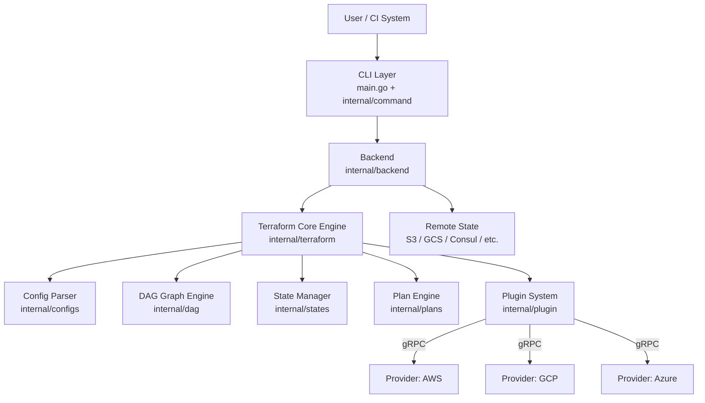
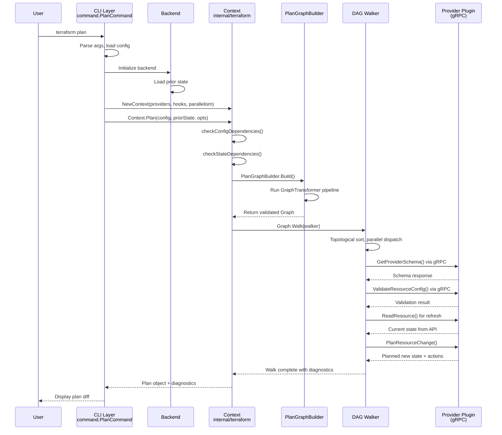
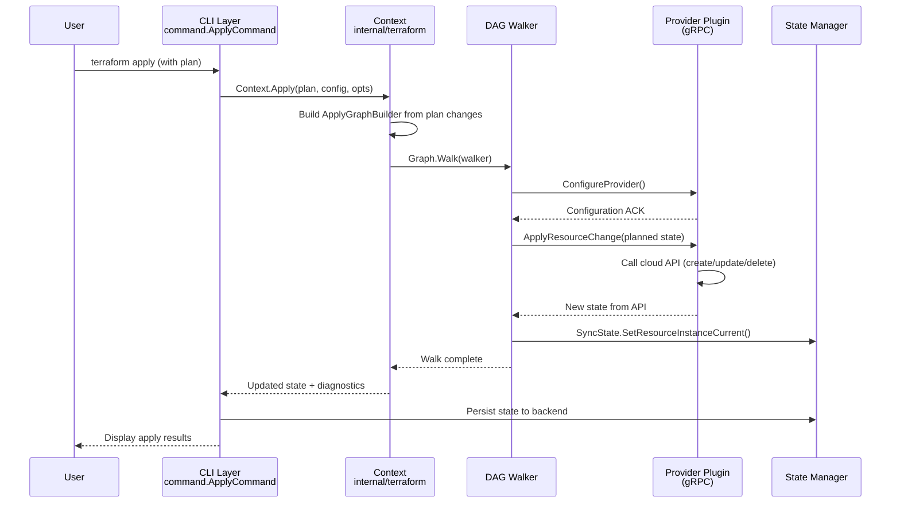
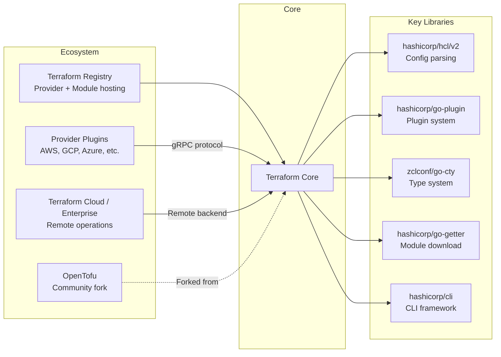

# Terraform

> A source-available infrastructure-as-code tool that codifies APIs into declarative configuration files for safe and predictable infrastructure provisioning.

| Metadata | |
|---|---|
| Repository | https://github.com/hashicorp/terraform |
| License | BSL 1.1 (Business Source License) |
| Primary Language | Go |
| Analyzed Release | `v1.14.4` (2026-01-28) |
| Stars (approx.) | 47,630 |
| Generated by | Claude Opus 4.6 (Anthropic) |
| Generated on | 2026-02-08 |

## Overview

Terraform is a tool for building, changing, and versioning infrastructure safely and efficiently. It uses a declarative configuration language (HCL) to describe the desired state of infrastructure, builds a dependency graph of all resources, generates an execution plan showing what it will change, and then applies those changes through provider plugins that communicate with cloud APIs via gRPC.

Problems it solves:

- Manual infrastructure provisioning is error-prone, slow, and impossible to audit or version control
- Cloud APIs differ wildly across providers, requiring specialized knowledge for each platform
- Complex infrastructure dependencies make it dangerous to change resources without understanding the ripple effects
- Lack of a planning phase means operators cannot preview changes before applying them to production

Positioning:

Terraform occupies a unique position in the IaC ecosystem. Compared to cloud-native tools like AWS CloudFormation or Azure Resource Manager, Terraform is cloud-agnostic and uses a single workflow across all providers. Compared to Pulumi (which uses general-purpose programming languages), Terraform enforces a declarative model via HCL that constrains what users can express, making plans more predictable. OpenTofu is a community fork created after the license change from MPL to BSL 1.1 in August 2023, maintaining API compatibility while pursuing an open-source governance model.

## Architecture Overview

Terraform follows a pipeline architecture centered around a DAG (Directed Acyclic Graph) engine. User commands flow through a CLI layer into the core engine, which parses HCL configuration into an in-memory config tree, builds a dependency graph of all resources, walks the graph in parallel to plan or apply changes, and communicates with external provider plugins over gRPC to interact with real infrastructure APIs.

## Core Components

### CLI and Command Layer (`internal/command`)

- Responsibility: Parse user input, route to the correct operation, manage UI output, and orchestrate the high-level workflow
- Key files: `internal/command/apply.go`, `internal/command/init.go`, `internal/command/meta.go`, `internal/command/views/`
- Design patterns: Command pattern (each subcommand implements the `cli.Command` interface), Template Method (the `Meta` struct provides shared behavior inherited by all commands)

The CLI layer is the entry point for all Terraform operations. The `main.go` file initializes the application, sets up service discovery, loads CLI configuration, and dispatches to the appropriate command via the `hashicorp/cli` library. Each command (init, plan, apply, destroy, etc.) is a separate struct embedding `Meta`, which provides shared functionality like backend initialization, plugin path loading, state management, and workspace handling. The `Meta.Backend()` method is the critical junction where CLI operations connect to the backend system. The views subsystem (`internal/command/views/`) separates rendering logic from command logic, supporting both human-readable and JSON output formats.

### Configuration Parser (`internal/configs`)

- Responsibility: Parse HCL configuration files into an in-memory tree of modules, validate structure, and resolve provider requirements
- Key files: `internal/configs/config.go`, `internal/configs/config_build.go`, `internal/configs/module.go`, `internal/configs/configload/`
- Design patterns: Composite pattern (the `Config` struct forms a tree where each node contains a `Module` and pointers to `Children`), Visitor pattern (the `DeepEach` method walks the module tree)

The `Config` struct is the root of Terraform's understanding of what the user wants. It represents a tree of modules: the root module and any child modules referenced via `module` blocks. Each `Config` node holds a `Module` containing parsed resources, data sources, variables, outputs, providers, and provisioners. The `configload` sub-package handles loading modules from disk or from the Terraform Registry. Provider requirements are aggregated across the entire module tree via `ProviderRequirementsConfigOnly()`, which is then used by `terraform init` to determine which provider plugins to download.

### DAG Graph Engine (`internal/dag`, `internal/terraform/graph.go`)

- Responsibility: Build, validate, and walk a directed acyclic graph that represents resource dependencies, enabling parallel execution of independent operations
- Key files: `internal/dag/dag.go`, `internal/dag/walk.go`, `internal/terraform/graph.go`, `internal/terraform/graph_builder.go`, `internal/terraform/graph_builder_plan.go`, `internal/terraform/graph_builder_apply.go`
- Design patterns: Builder pattern (graph construction via `GraphBuilder` interface with composable `GraphTransformer` steps), Strategy pattern (different graph builders for plan vs. apply), Parallel Walker (the `Walker` struct in `internal/dag/walk.go` uses goroutines to walk vertices concurrently)

The graph engine is the heart of Terraform. The `Graph` struct embeds `dag.AcyclicGraph` and adds module-awareness. Graph construction follows a pipeline of `GraphTransformer` steps: `ConfigTransformer` creates resource nodes from configuration, `StateTransformer` adds nodes from existing state, `ReferenceTransformer` adds dependency edges based on expression references, `ProviderTransformer` connects resources to their providers, `TransitiveReductionTransformer` prunes redundant edges. The `Walker` in `internal/dag/walk.go` executes vertex callbacks concurrently, creating two goroutines per vertex (one for execution, one for dependency waiting). During the walk, each vertex can be `GraphNodeExecutable` (runs its logic) or `GraphNodeDynamicExpandable` (expands into a sub-graph at walk time for handling `count` and `for_each`).

### Terraform Core Engine (`internal/terraform`)

- Responsibility: Orchestrate the plan and apply lifecycle, manage evaluation contexts, coordinate provider interactions, and maintain state consistency
- Key files: `internal/terraform/context.go`, `internal/terraform/context_plan.go`, `internal/terraform/context_apply.go`, `internal/terraform/context_walk.go`, `internal/terraform/eval_context.go`, `internal/terraform/node_resource_plan_instance.go`, `internal/terraform/node_resource_apply_instance.go`
- Design patterns: Context pattern (the `Context` struct carries all state needed for operations), Hook pattern (the `Hook` interface enables runtime observation with `PreApply`, `PostApply`, `PreDiff`, `PostDiff` callbacks), Semaphore pattern (parallelism is controlled via a counting semaphore)

The `Context` struct is created via `NewContext()` with providers, provisioners, hooks, and a parallelism setting (default 10). The `Plan()` method checks config and state dependencies, then builds a plan graph via `PlanGraphBuilder`, walks it, and returns a `plans.Plan` containing all proposed changes. The `Apply()` method takes a previously-generated `Plan`, builds an apply graph via `ApplyGraphBuilder`, and walks it to execute the changes. Both methods use `acquireRun()` to ensure only one operation runs at a time, and `watchStop()` to gracefully stop providers when the context is cancelled. The evaluation context (`EvalContext`) provides scoped access to providers, variables, state, and changes during graph walking.

### Provider Plugin System (`internal/plugin`, `internal/providers`, `internal/getproviders`)

- Responsibility: Discover, download, verify, and communicate with provider plugins via gRPC, translating between Terraform's internal types and the wire protocol
- Key files: `internal/providers/provider.go`, `internal/plugin/grpc_provider.go`, `internal/getproviders/registry_client.go`, `internal/getproviders/filesystem_mirror_source.go`, `internal/providercache/`
- Design patterns: Plugin architecture (providers run as separate OS processes communicating via gRPC), Adapter pattern (`GRPCProvider` translates between `providers.Interface` and protobuf types), Strategy pattern (multiple `Source` implementations for provider discovery: registry, filesystem mirror, network mirror)

Providers are the bridge between Terraform and real infrastructure APIs. The `providers.Interface` defines 20+ methods including `GetProviderSchema`, `ValidateResourceConfig`, `PlanResourceChange`, `ApplyResourceChange`, `ReadResource`, `ImportResourceState`, and `ReadDataSource`. At runtime, each provider runs as a separate process, managed by HashiCorp's `go-plugin` library. The `GRPCProvider` struct in `internal/plugin/grpc_provider.go` implements `providers.Interface` by translating each call into gRPC requests using protobuf definitions from `internal/tfplugin5` (protocol v5) or `internal/tfplugin6` (protocol v6). Provider discovery supports multiple sources: the public Terraform Registry via `registry_client.go`, filesystem mirrors, and network mirrors, composed together via `MultiSource`.

### State Management (`internal/states`, `internal/backend`)

- Responsibility: Track the mapping between configuration resources and real-world infrastructure objects, support locking, versioning, and remote storage
- Key files: `internal/states/state.go`, `internal/states/module.go`, `internal/states/instance_object.go`, `internal/states/sync.go`, `internal/states/statefile/`, `internal/states/statemgr/`, `internal/backend/backend.go`
- Design patterns: Facade pattern (the `SyncState` wrapper provides thread-safe access to the underlying `State`), Strategy pattern (pluggable backends for state storage), Snapshot pattern (state is serialized to JSON for persistence)

The `State` struct contains a map of `Module` instances, each holding `Resource` entries that map to `InstanceObject` values representing the actual attributes of real infrastructure. The `SyncState` wrapper provides mutex-protected methods for concurrent access during graph walking. State is serialized to JSON via the `statefile` package, which handles version migration across state file format versions. The backend system (`internal/backend/backend.go`) defines the `Backend` interface for state storage, with implementations for local disk, S3, GCS, Azure Blob, Consul, and Terraform Cloud. State locking prevents concurrent operations from corrupting state, with each backend implementing its own locking mechanism.

## Data Flow

### terraform plan Execution Flow

### terraform apply Execution Flow

## Key Design Decisions

### 1. Providers as Separate Processes via gRPC

- Choice: Providers run as separate OS processes and communicate with Terraform Core over gRPC using protobuf-defined schemas (protocol v5 and v6)
- Rationale: This decouples provider development from core development, allowing providers to be versioned, released, and maintained independently. It also provides process isolation so that a crashing provider does not take down the core process, and enables providers to be written in any language that supports gRPC (though most are in Go)
- Trade-offs: The gRPC boundary adds serialization overhead for every resource operation. Complex types must be marshaled through msgpack or JSON encoding via `cty` values. Provider startup latency is noticeable for the first operation. The protocol versioning (v5 vs v6) creates ongoing compatibility complexity in `internal/plugin` and `internal/grpcwrap`

### 2. DAG-Based Parallel Execution with Graph Transformers

- Choice: All operations are modeled as walks over a directed acyclic graph, with the graph constructed through a composable pipeline of `GraphTransformer` steps
- Rationale: The DAG naturally captures resource dependencies (explicit via `depends_on` and implicit via expression references), enables safe parallel execution of independent resources, and provides a clear visual representation for debugging (`terraform graph` outputs DOT format). The transformer pipeline makes graph construction extensible and testable in isolation
- Trade-offs: Graph construction and validation have a cost proportional to the number of resources and their interconnections. The transformer pipeline can be difficult to debug because the graph evolves through many intermediate states. Dynamic expansion (`GraphNodeDynamicExpandable`) for `count` and `for_each` adds complexity since sub-graphs are created at walk time

### 3. Explicit Plan-then-Apply Two-Phase Workflow

- Choice: Terraform separates infrastructure changes into a planning phase (read-only, computes diff) and an apply phase (writes changes), with the plan serializable to disk between phases
- Rationale: The two-phase approach gives operators a chance to review exactly what will change before any mutations occur. The serializable plan enables workflows where planning and approval happen in different systems or at different times (e.g., plan in CI, approve in a review tool, apply after merge)
- Trade-offs: The two-phase model means that infrastructure state can drift between plan and apply time. Terraform mitigates this by re-reading resource state during apply, but fundamental conflicts (e.g., another system deleted a resource) can still cause apply failures. The plan file format must maintain backward compatibility across Terraform versions

### 4. State as the Source of Truth for Real-World Mapping

- Choice: Terraform maintains a state file that maps configuration resource addresses to real-world infrastructure object IDs, storing the last-known attribute values
- Rationale: Without state, Terraform would have no way to know which real API objects correspond to which configuration blocks. State enables drift detection (comparing real state against stored state), dependency tracking across runs, and resource lifecycle management (knowing what to destroy when a resource is removed from config)
- Trade-offs: State introduces a consistency challenge: it can become stale or corrupted if infrastructure is modified outside Terraform. State locking is essential but backend-specific. Sensitive values are stored in state, requiring encryption-at-rest for remote backends. Large state files can become a performance bottleneck

### 5. HCL as a Domain-Specific Declarative Language

- Choice: Terraform uses HCL (HashiCorp Configuration Language), a custom DSL parsed by `hashicorp/hcl/v2`, rather than a general-purpose programming language or existing formats like YAML/JSON
- Rationale: A declarative DSL constrains what users can express, making configurations more predictable and plannable. HCL provides just enough expressiveness (variables, locals, functions, conditionals, iteration) without the full power (and corresponding unpredictability) of a general-purpose language. The JSON superset ensures machine-readability
- Trade-offs: A custom language requires its own tooling ecosystem (formatters, linters, language servers). Complex logic that would be trivial in a programming language can be awkward or impossible in HCL, pushing users toward workarounds. The learning curve for HCL is an additional barrier to adoption

## Dependencies

## Testing Strategy

Terraform employs a multi-layered testing approach, with extensive unit tests, race detection tests, end-to-end tests, and equivalence tests.

Unit tests: Every package contains `_test.go` files co-located with the source. The `internal/terraform` package alone has hundreds of test files covering context operations (`context_plan_test.go`, `context_apply_test.go`), graph transformations, and node evaluation. Test fixtures in `testdata/` directories provide HCL configurations for various scenarios. Mock implementations (`hook_mock.go`, `provisioner_mock.go`, `eval_context_mock.go`) enable isolated testing of individual components.

Integration tests: The `internal/command/e2etest/` directory contains end-to-end tests that compile a real Terraform binary, run actual commands, and verify output. These tests exercise the full stack from CLI parsing through provider execution. The `e2e` package under `internal/e2e/` provides helpers for spawning Terraform processes. Equivalence tests (`equivalence-test-*.yml` workflows) verify that plan and apply outputs remain consistent across versions.

CI/CD: GitHub Actions workflows in `.github/workflows/checks.yml` run unit tests across all packages, race detection tests on critical packages (`internal/terraform`, `internal/command`, `internal/states`), and end-to-end tests on Linux for every pull request. The `build.yml` workflow extends coverage to multiple OS/architecture combinations for release branches and tags.

## Key Takeaways

1. Graph-based dependency resolution enables safe parallelism: By modeling all infrastructure operations as nodes in a DAG, Terraform can automatically determine which resources can be created, updated, or destroyed in parallel without violating dependency constraints. The composable `GraphTransformer` pipeline makes the graph construction both extensible and testable. This pattern is applicable to any system that manages interconnected resources with ordering requirements.

2. Process-isolated plugin architecture scales ecosystem growth: By running providers as separate processes communicating over a well-defined gRPC protocol, Terraform completely decouples core development velocity from the 3,000+ providers in its ecosystem. This design choice trades runtime performance (serialization overhead, process startup cost) for massive ecosystem scalability and fault isolation. Any platform that needs a large third-party extension ecosystem should consider this approach.

3. Two-phase plan-apply with serializable artifacts enables safe change management: The strict separation of read-only planning from write-phase application, with the plan serializable between phases, is a powerful pattern for any system that makes irreversible changes to external resources. It enables human review, automated policy checks, and audit trails. The trade-off of potential state drift between phases is manageable through re-validation at apply time.

4. Declarative DSL over general-purpose language enforces predictability: Choosing a purpose-built declarative language (HCL) over embedding in a general-purpose language means every configuration can be statically analyzed, planned, and diffed. This constraint is what makes the plan phase possible -- Terraform can always compute the full desired state without executing arbitrary code. Systems that need deterministic preview capabilities benefit from constraining their input language.

## References

- [Terraform Official Documentation](https://developer.hashicorp.com/terraform/docs)
- [Terraform Plugin Development](https://developer.hashicorp.com/terraform/plugin)
- [Terraform Plugin Framework RPCs](https://developer.hashicorp.com/terraform/plugin/framework/internals/rpcs)
- [HashiCorp go-plugin Library](https://github.com/hashicorp/go-plugin)
- [HCL Language Specification](https://github.com/hashicorp/hcl)
- [Terraform Registry](https://registry.terraform.io)
- [Terraform GitHub Repository](https://github.com/hashicorp/terraform)
