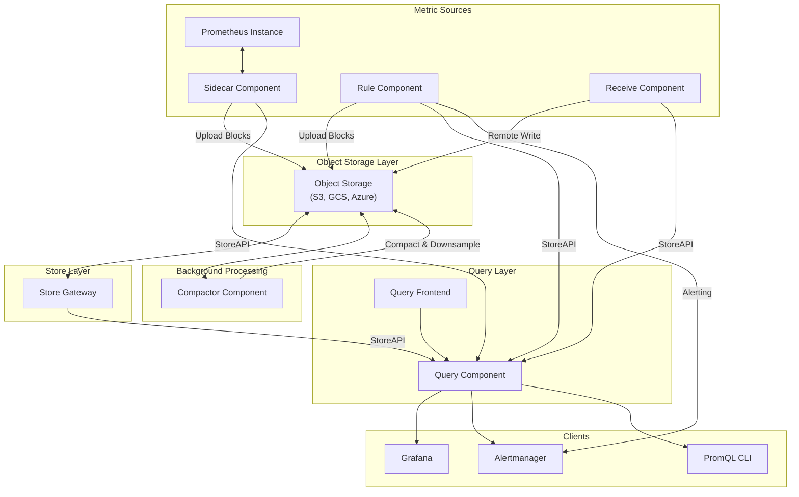
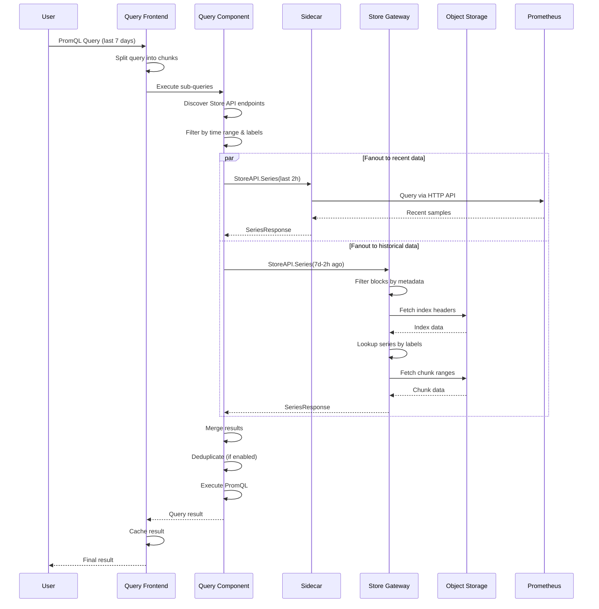
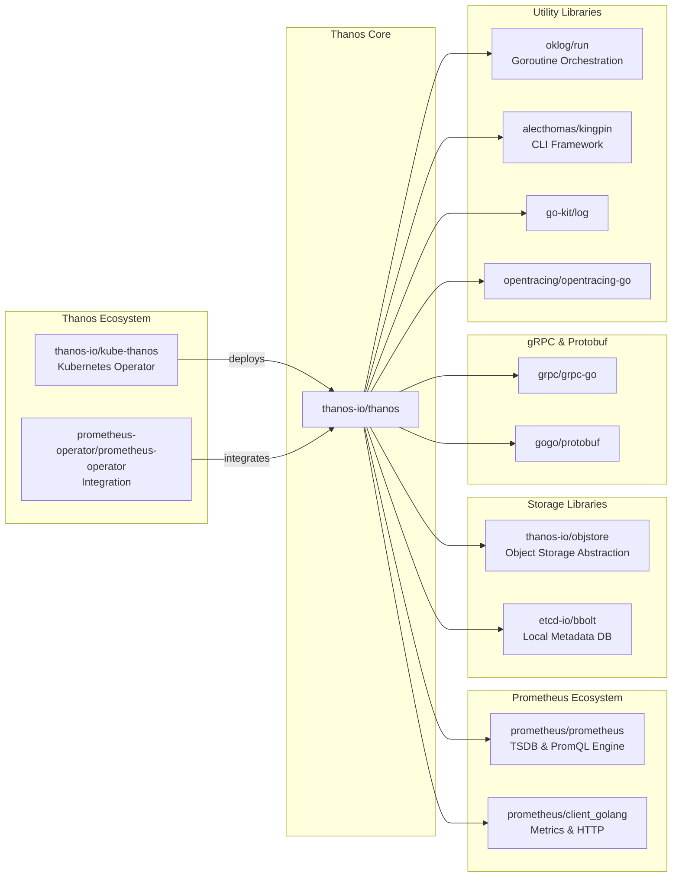

# Thanos

> Highly available Prometheus setup with long term storage capabilities

| Metadata | |
|---|---|
| Repository | https://github.com/thanos-io/thanos |
| License | Apache-2.0 |
| Primary Language | Go |
| Category | Monitoring |
| Analyzed Release | `v0.40.1` (2025-10-28) |
| Stars (approx.) | 13,954 |
| Generated by | Claude Opus 4.6 (Anthropic) |
| Generated on | 2026-02-08 |

## Overview

Thanos is a set of components that can be composed into a highly available metric system with unlimited storage capacity, which can be added seamlessly on top of existing Prometheus deployments. It is a CNCF Incubating project that leverages the Prometheus 2.0 storage format to cost-efficiently store historical metric data in any object storage while retaining fast query latencies.

Problems it solves:

- Prometheus local storage limitations preventing long-term retention of metrics data
- Inability to query metrics across multiple Prometheus instances from a single interface
- High availability challenges when running Prometheus in production
- Storage costs associated with keeping all historical metrics data on expensive local disks

Positioning:

Thanos is positioned as the de facto solution for Prometheus long-term storage and global querying. Unlike alternatives such as Cortex (which requires complete infrastructure replacement), Thanos can be incrementally added to existing Prometheus setups. It competes with VictoriaMetrics and M3 in the metrics storage space, but distinguishes itself through its non-invasive architecture and UNIX philosophy of composable components.

## Architecture Overview

Thanos implements a distributed architecture where components are categorized as metric sources, stores, and queriers. All components communicate via a unified gRPC Store API, enabling them to be treated as equivalent data sources. The architecture emphasizes decoupling, allowing each component to scale independently while maintaining Prometheus compatibility.

## Core Components

### Sidecar (`cmd/thanos/sidecar.go`)

- Responsibility: Bridges Prometheus instances to the Thanos ecosystem
- Key files: `cmd/thanos/sidecar.go`, `pkg/block/metadata/meta.go`
- Design patterns: Sidecar pattern, Adapter pattern

The Sidecar component runs alongside each Prometheus instance and implements two primary functions. First, it implements the Store API on top of Prometheus' HTTP and remote-read APIs, allowing Queriers to treat Prometheus as just another data source. Second, it periodically uploads TSDB blocks from Prometheus' local storage to object storage for long-term retention.

The Sidecar monitors the Prometheus data directory, waiting for blocks to become immutable (typically after 2 hours). Once a block is finalized, it enriches the block's meta.json with a Thanos-specific section containing external labels, then uploads the block to object storage. This design preserves Prometheus' reliability properties while adding long-term storage capabilities without modifying Prometheus itself.

### Store Gateway (`cmd/thanos/store.go`)

- Responsibility: Provides efficient access to historical data in object storage
- Key files: `cmd/thanos/store.go`, `pkg/store/bucket.go`, `pkg/block/indexheader/`
- Design patterns: Gateway pattern, Lazy loading, Index caching

The Store Gateway acts as a translation layer between object storage and the Store API. It continuously synchronizes metadata about which blocks exist in the bucket and implements sophisticated strategies to minimize object storage requests. When a query arrives, the Store examines block metadata to filter relevant blocks by time range and external labels, then translates the query into an optimized plan of object storage requests.

The Store leverages the Prometheus TSDB block layout where samples for the same series are sequentially aligned in chunk files. Index data is cached in memory and on disk using binary index-header files, which contain only the information needed for label lookups. This allows the Store to satisfy queries with minimal object storage round trips, often fetching hundreds of thousands of chunks in a single request.

### Query Component (`cmd/thanos/query.go`)

- Responsibility: Provides a unified PromQL query interface across all data sources
- Key files: `cmd/thanos/query.go`, `pkg/query/querier.go`, `pkg/query/storeset.go`
- Design patterns: Proxy pattern, Fan-out pattern, Deduplication

The Query component is a stateless and horizontally scalable proxy that implements the Prometheus HTTP API. It discovers all available Store API endpoints (Sidecars, Stores, Rulers, Receivers) and intelligently routes queries to minimize the fanout. When executing a query, it fans out to all relevant stores in parallel, merges the results, and optionally deduplicates data from Prometheus HA pairs.

Deduplication is performed based on replica labels. For example, if you have two Prometheus instances with replica labels (replica=A and replica=B), the Query component will merge their data and remove duplicates. The component implements penalty-based deduplication that considers counter resets to avoid incorrect results when merging counter metrics.

### Compactor (`cmd/thanos/compact.go`)

- Responsibility: Optimizes object storage data through compaction and downsampling
- Key files: `cmd/thanos/compact.go`, `pkg/compact/compact.go`, `pkg/compact/downsample/`
- Design patterns: Singleton pattern, Background processing

The Compactor is a singleton process that continuously consolidates multiple smaller blocks into larger ones, significantly reducing storage size and improving query performance. It runs independently of the cluster, only interacting with object storage. The Compactor performs several critical functions: horizontal compaction (merging blocks at the same resolution), vertical compaction (merging overlapping time ranges), and downsampling.

Downsampling creates aggregated versions of metrics at 5-minute and 1-hour resolutions. For each original sample, the Compactor computes min, max, sum, and count aggregates, allowing queries over large time ranges to retrieve less data. The Compactor also applies retention policies, deleting blocks older than the configured retention period for each resolution level (raw, 5m, 1h).

### Ruler (`cmd/thanos/rule.go`)

- Responsibility: Evaluates Prometheus recording and alerting rules globally
- Key files: `cmd/thanos/rule.go`, `pkg/rules/`
- Design patterns: Stateful evaluation, Store API implementation

The Ruler component evaluates Prometheus recording and alerting rules against chosen Query APIs. Unlike Prometheus rulers that only evaluate rules against local data, Thanos Ruler evaluates rules against the global view provided by Thanos Query. It runs rule evaluation periodically, writes results back to TSDB blocks, and uploads those blocks to object storage.

Ruler operates in two modes. In stateful mode, it maintains a local TSDB and exposes data via the Store API. In stateless mode (remote write), it sends rule evaluation results to a Receive component, making the Ruler truly stateless and more scalable. This is particularly useful when running multiple Ruler instances for high availability.

### Receive (`cmd/thanos/receive.go`)

- Responsibility: Ingests metrics via Prometheus remote write protocol
- Key files: `cmd/thanos/receive.go`, `pkg/receive/`
- Design patterns: Multi-tenancy, Hashring-based routing, Write-ahead log

The Receive component implements the Prometheus Remote Write API, allowing Prometheus instances to push metrics instead of relying on the Sidecar's pull model. This is particularly useful for multi-tenant scenarios or when Prometheus instances cannot be directly accessed for block uploads.

Receive supports hashring-based routing for horizontal scalability. When configured with a hashring, a Receive instance can act as a router, forwarding metrics to the appropriate Receive node based on a hash of the tenant ID and labels. Each Receive node maintains its own TSDB and uploads blocks to object storage, exposing data via the Store API.

### Query Frontend (`cmd/thanos/query_frontend.go`)

- Responsibility: Optimizes query execution through splitting, caching, and rate limiting
- Key files: `cmd/thanos/query_frontend.go`, `pkg/queryfrontend/`
- Design patterns: Middleware pattern, Query splitting, Response caching

Query Frontend sits in front of Query components and provides query optimization features. It splits large queries into smaller sub-queries that can be executed in parallel, caches query results to avoid redundant computation, and implements rate limiting to protect the system from expensive queries. The Frontend uses a queue-based execution model where Query components act as workers pulling queries from the queue.

## Data Flow

### Typical Query Execution Flow

## Key Design Decisions

### 1. Store API as Universal Interface

- Choice: Define a gRPC-based Store API that all components implement
- Rationale: Enables treating all data sources uniformly, whether they are Prometheus instances, object storage gateways, or rule evaluators. The API is designed for efficiency, returning compressed chunks rather than individual samples
- Trade-offs: Creates tight coupling to the Store API schema, requiring careful versioning. However, this uniform interface dramatically simplifies the Query component and enables seamless addition of new data sources

### 2. Block-Based Architecture with Object Storage

- Choice: Use Prometheus' immutable TSDB block format and store blocks in object storage
- Rationale: Leveraging object storage provides unlimited retention at low cost (approximately $0.02/GB/month). Immutable blocks enable safe concurrent access without coordination. The block format is optimized for batch processing and sequential reads
- Trade-offs: Object storage has higher latency than local disk (typically 10-100ms per request vs. <1ms). However, the Store Gateway's optimization strategies and the block format's sequential layout minimize the number of requests needed. Queries spanning months can still complete in seconds

### 3. Sidecar Pattern for Prometheus Integration

- Choice: Deploy Thanos Sidecar alongside Prometheus rather than modifying Prometheus
- Rationale: Preserves Prometheus' simplicity and reliability properties. Users can adopt Thanos incrementally without migrating away from Prometheus. The sidecar can restart independently of Prometheus, and Prometheus continues functioning even if the sidecar fails
- Trade-offs: Requires additional resources for the sidecar container and adds operational complexity. However, this non-invasive approach has proven critical for adoption, as users can start with Sidecar alone and gradually add other components

### 4. Downsampling with Aggregates

- Choice: When downsampling, store min, max, sum, and count aggregates rather than just averages
- Rationale: Allows accurate computation of aggregation functions over downsampled data. For example, sum(rate(...)) over 1-hour downsampled data can be computed accurately using the stored aggregates. This is mathematically correct for many PromQL functions
- Trade-offs: Increases storage by 4x compared to storing just raw samples at lower resolution. However, since downsampling is applied to old data that would otherwise consume full resolution, the net storage savings are still substantial (typically 10x reduction)

### 5. Component Independence and Single Responsibility

- Choice: Each Thanos component performs one specific function and can be deployed independently
- Rationale: Follows the UNIX philosophy of composability. Users can choose which components they need. For example, users wanting only long-term storage can deploy just Sidecar, Store, and Compactor, skipping Query if they query Prometheus directly
- Trade-offs: Increases operational complexity with more components to deploy and monitor. However, this modularity enables flexible deployment patterns and independent scaling of different concerns (ingestion, querying, compaction)

### 6. Hashring-Based Multi-Tenancy in Receive

- Choice: Use consistent hashing to distribute tenant metrics across Receive nodes
- Rationale: Enables horizontal scaling of the write path without a single coordination point. Each tenant's metrics are routed to consistent nodes, allowing local aggregation and reducing cross-node traffic. Supports millions of tenants without central bottlenecks
- Trade-offs: Requires careful hashring configuration and coordination. Node failures require rebalancing. However, this approach scales to extremely large deployments where a single Receive node cannot handle all write traffic

## Dependencies

## Testing Strategy

Thanos employs a comprehensive multi-layered testing approach to ensure reliability.

Unit tests: Each package contains extensive unit tests in files following the `_test.go` convention. The project uses table-driven tests heavily, with test data stored in `testdata/` directories. Mock implementations of the Store API enable testing query logic without real data sources. The test suite achieves high coverage of core logic paths.

Integration tests: End-to-end tests deploy actual Thanos components and verify interactions. The `test/e2e/` directory contains integration tests that spin up Prometheus instances, Sidecars, Stores, and Query components, then execute real queries against them. These tests use Docker containers and verify correct behavior across component boundaries.

Performance tests: Benchmark tests in `_test.go` files measure performance of critical paths like query execution, block indexing, and chunk compression. The project includes load testing scenarios that verify behavior under high query load and large time ranges.

CI/CD: GitHub Actions runs the full test suite on every pull request. Tests are executed across multiple Go versions and operating systems. The CI pipeline also includes linting (golangci-lint), proto validation, and documentation checks. Release builds are automated and include container image publishing to quay.io and Docker Hub.

## Key Takeaways

1. Store API abstraction enables composability: Defining a single gRPC interface that all data sources implement allows treating diverse backends uniformly. This design pattern is applicable to any system needing to aggregate data from heterogeneous sources. The key insight is designing the API for efficiency (returning chunks rather than samples) and including metadata filtering to minimize fanout.

2. Leverage existing storage formats: By adopting Prometheus' TSDB block format without modification, Thanos gained compatibility, well-tested code, and optimized data layout. When building on existing systems, preserving their storage formats enables reuse of tooling and expertise. This decision also enabled Thanos to use Prometheus' own compaction code.

3. Sidecar pattern for non-invasive integration: The sidecar approach demonstrates how to extend systems without forking them. This pattern is widely applicable when adding capabilities to existing software without modifying its core. The trade-off of additional resources is often acceptable compared to the operational risk of forking.

4. Aggressive metadata filtering reduces fanout: The Store Gateway's strategy of filtering blocks by time range and labels before accessing data shows the importance of metadata-driven optimization. In distributed systems, minimizing remote calls through smart filtering at the coordination layer is often more impactful than optimizing individual operations.

5. Downsampling preserves query semantics: Storing min/max/sum/count aggregates rather than just averages demonstrates attention to mathematical correctness. When designing data reduction strategies, consider which operations must remain accurate and design the reduced format to support those operations. This principle applies broadly to data pipeline design.

6. Component independence enables incremental adoption: The ability to deploy components independently made Thanos easier to adopt than alternatives requiring full platform replacement. When designing systems for adoption, enabling incremental migration paths dramatically lowers the barrier to entry. Users can start small and expand as needed.

7. Block-based immutability simplifies concurrency: Using immutable blocks eliminates the need for distributed locking in object storage. This design pattern of append-only, immutable data structures is applicable to many distributed storage systems and significantly reduces coordination overhead.

## References

- [Thanos Official Documentation](https://thanos.io)
- [Thanos Design Document](https://thanos.io/tip/thanos/design.md/)
- [Thanos Architecture Deep Dive](https://medium.com/@ramsingh_devops/thanos-deep-dive-architecture-components-and-multi-cluster-monitoring-at-scale-0273c5be9a93)
- [Scaling Prometheus with Thanos](https://www.cloudraft.io/blog/scaling-prometheus-with-thanos)
- [Thanos Components Overview](https://thanos.io/v0.6/thanos/getting-started.md/)
- [Thanos Compactor Documentation](https://thanos.io/tip/components/compact.md/)
- [Thanos Ruler Documentation](https://thanos.io/tip/components/rule.md/)
- [Pure Storage: Scaling Prometheus with Thanos](https://blog.purestorage.com/purely-technical/scaling-prometheus-with-thanos-for-long-term-retention/)
- [AWS: Improving HA and Long-term Storage for Prometheus](https://aws.amazon.com/blogs/opensource/improving-ha-and-long-term-storage-for-prometheus-using-thanos-on-eks-with-s3/)
- [Red Hat: Thanos Long-term Storage for Prometheus](https://www.redhat.com/en/blog/thanos-long-term-storage-for-your-prometheus-metrics-on-openshift)
