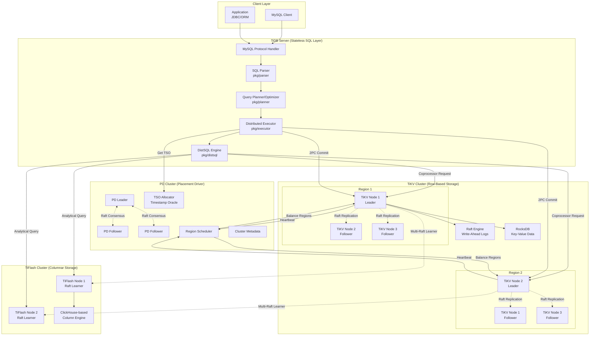
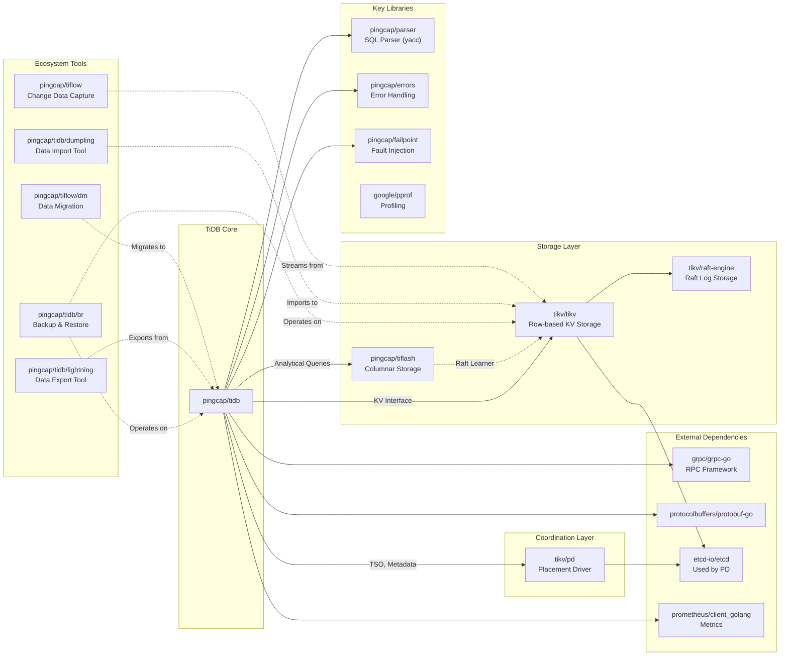

# TiDB

> An open-source, cloud-native, distributed SQL database designed for modern applications

| Metadata | |
|---|---|
| Repository | https://github.com/pingcap/tidb |
| License | Apache-2.0 |
| Primary Language | Go |
| Category | Database |
| Analyzed Release | `v8.5.5` (2026-01-15) |
| Stars (approx.) | 39,700+ |
| Generated by | Claude Opus 4.6 (Anthropic) |
| Generated on | 2026-02-08 |

## Overview

TiDB (/'taɪdiːbi:/, "Ti" stands for Titanium) is an open-source, cloud-native, distributed SQL database that provides horizontal scalability, strong consistency, and high availability. Developed by PingCAP, TiDB uniquely combines the benefits of traditional relational databases with NoSQL distributed systems, implementing a Hybrid Transactional/Analytical Processing (HTAP) architecture.

Problems it solves:

- Horizontal scalability limitations of traditional relational databases while maintaining ACID transaction guarantees
- The need for separate OLTP and OLAP systems, eliminating the ETL pipeline overhead and data staleness
- High availability and disaster recovery requirements without complex multi-master replication setups
- MySQL compatibility for easy migration from existing MySQL-based applications

Positioning:

TiDB distinguishes itself in the NewSQL database category alongside CockroachDB and YugabyteDB. Unlike these alternatives, TiDB provides strong MySQL compatibility and native HTAP capabilities through TiFlash columnar storage. It is widely adopted in production by companies like Square, Shopee, and Xiaomi, particularly in scenarios requiring real-time analytics on transactional data.

## Architecture Overview

TiDB employs a layered architecture that separates compute, storage, and scheduling into three independent components: TiDB (stateless SQL layer), TiKV (row-based transactional storage), and PD (Placement Driver for metadata and scheduling). An optional TiFlash component provides columnar storage for analytical queries. This separation enables independent scaling and failure isolation.



## Core Components

### TiDB Server (`cmd/tidb-server`, `pkg/server`)

- Responsibility: Stateless SQL layer providing MySQL protocol compatibility, query parsing, planning, optimization, and distributed execution coordination
- Key files: `pkg/server/conn.go`, `pkg/session/session.go`, `pkg/executor/executor.go`
- Design patterns: Stateless service pattern, connection pooling, session management

The TiDB server is completely stateless and does not store any data or rely on local disk. Each TiDB instance independently handles MySQL protocol connections via `pkg/server/conn.go`, which implements the MySQL wire protocol handshake, authentication, and command processing. Sessions are managed through `pkg/session/session.go`, maintaining transaction context, system variables, and connection state.

Query execution follows a pipeline: SQL text → Parser (yacc-based, generates AST) → Logical Planner (rule-based optimization) → Physical Planner (cost-based optimization selecting between IndexScan, TableScan, HashJoin, etc.) → Executor (distributed execution via Coprocessor framework). The executor sends Coprocessor requests to TiKV/TiFlash for parallel data scanning and computation pushdown.

Multiple TiDB servers can run concurrently behind a load balancer, with each instance capable of serving all queries. This enables horizontal scaling of compute capacity independently from storage.

### Planner and Optimizer (`pkg/planner`)

- Responsibility: Transforming SQL queries into optimal distributed execution plans using rule-based and cost-based optimization
- Key files: `pkg/planner/core/optimizer.go`, `pkg/planner/core/plan.go`, `pkg/planner/core/find_best_task.go`
- Design patterns: Visitor pattern, cost model pattern, cascades framework (experimental)

TiDB's optimizer implements a two-phase optimization strategy. The logical optimization phase applies rule-based transformations including column pruning, predicate pushdown, partition pruning, and join reordering. These rules are implemented as `LogicalOptRule` interfaces applied in sequence.

The physical optimization phase (`physicalOptimize()`) performs cost-based enumeration. For each logical operator, the optimizer generates multiple physical implementations (e.g., HashJoin vs. MergeJoin vs. IndexJoin) and estimates their costs based on statistics. The cost model considers CPU, memory, network, and disk I/O, with unit factors like `scanFactor` representing the cost of scanning 1 byte of data.

The optimizer introduces the concept of Tasks: `rootTask` (executed in TiDB layer), `copTask` (pushed down to TiKV Coprocessor), and `mppTask` (distributed execution in TiFlash MPP engine). The best task type is selected based on cost estimates derived from table statistics maintained by the statistics module.

An alternative Cascades-based optimizer is under development in `pkg/planner/cascades`, offering more sophisticated plan space exploration through memoization and top-down optimization.

### Executor (`pkg/executor`)

- Responsibility: Executing physical plans through distributed operators, coordinating transactions, and aggregating results
- Key files: `pkg/executor/executor.go`, `pkg/executor/distsql.go`, `pkg/executor/aggregate.go`
- Design patterns: Iterator pattern (Volcano model), operator pipelining, parallel execution

Each physical operator implements the `Executor` interface with `Open()`, `Next(chunk)`, and `Close()` methods following the Volcano iterator model. The executor tree is built from the physical plan and executed in a pull-based fashion, where parent operators call `Next()` on child operators to retrieve data in chunks.

For distributed operators like `TableReader`, `IndexReader`, and `IndexLookupReader`, the executor constructs Coprocessor requests encoded in Protocol Buffers and sends them to TiKV regions. TiKV processes these requests locally using its Coprocessor framework and returns encoded chunks. Multiple regions are scanned in parallel with configurable concurrency (`tidb_distsql_scan_concurrency`).

The aggregate framework in `pkg/executor/aggregate.go` implements both hash aggregation and stream aggregation. The refactored aggregate framework (design doc 2018-07-01) uses partial aggregation to minimize data transfer: TiKV performs partial aggregation locally, returning pre-aggregated results to TiDB for final aggregation.

Transaction coordination is handled by `pkg/executor/simple.go` and `pkg/sessiontxn`, which interact with TiKV's distributed transaction layer through the KV interface.

### Transaction Layer (`pkg/kv`, `pkg/store/tikv`)

- Responsibility: Implementing distributed ACID transactions using the Percolator protocol with optimistic and pessimistic concurrency control
- Key files: `pkg/store/tikv/txn.go`, `pkg/store/tikv/2pc.go`, `pkg/store/tikv/lock_resolver.go`
- Design patterns: Two-phase commit (2PC), MVCC, snapshot isolation, percolator transaction model

TiDB implements distributed transactions based on Google's Percolator paper. Each transaction obtains a start timestamp (start_ts) from PD's TSO (Timestamp Oracle) and a commit timestamp (commit_ts) upon successful commit. This provides snapshot isolation using multi-version concurrency control (MVCC).

The two-phase commit process works as follows: (1) Prewrite phase: The client selects one key as the primary key and others as secondary keys, then sends prewrite requests to all TiKV regions holding these keys, writing data with locks. (2) Commit phase: After all prewrite requests succeed, the client commits the primary key with commit_ts. Once the primary key commit succeeds, the transaction is considered successful. Secondary key commits can proceed asynchronously.

TiDB supports both optimistic and pessimistic transaction modes. Optimistic transactions detect conflicts only at commit time, while pessimistic transactions acquire locks during DML execution, similar to traditional databases. The mode is controlled by `tidb_txn_mode` system variable.

Enhancements include async commit (reduces commit latency by returning success after prewrite) and one-phase commit (1PC) for single-region transactions. The lock resolver mechanism handles lock cleanup when transactions crash, preventing indefinite blocking.

### DDL Layer (`pkg/ddl`)

- Responsibility: Performing online schema changes without blocking DML operations using a state-based protocol
- Key files: `pkg/ddl/ddl.go`, `pkg/ddl/ddl_worker.go`, `pkg/ddl/syncer.go`
- Design patterns: State machine, job queue, distributed coordination, online schema change algorithm

TiDB's DDL implementation enables online schema changes without table locks through a state-based protocol. Each DDL operation transitions through multiple intermediate states: none → delete only → write only → write reorganization → public (for creation operations; reverse order for deletion).

The DDL owner-worker architecture ensures only one node performs schema changes at a time. Each TiDB server has two workers (general worker and add index worker), but only the node elected as the DDL owner actively processes jobs. DDL requests are enqueued in job queues stored in TiKV, and the owner worker retrieves and processes them.

For each state transition, the owner updates the schema version and waits for all TiDB servers to synchronize to the new schema within a lease period (default 45 seconds). This ensures at most two schema versions coexist in the cluster at any time, maintaining consistency.

Add index operations are optimized through backfill: the operation splits the table's handle range into multiple batches processed by concurrent workers (default 16). Each worker scans rows in its range and writes index entries. Progress is checkpointed to support resumption after failures.

Drop table and truncate table operations implement a two-stage deletion: first mark the table as deleted in metadata, then asynchronously delete data during garbage collection to avoid long-running DDL blocking other operations.

### Storage Interface (`pkg/store/tikv`, external TiKV)

- Responsibility: Distributed transactional key-value storage with Raft-based replication and MVCC
- Key files: `pkg/store/tikv/client.go`, `pkg/store/tikv/region_cache.go` (TiDB side)
- Design patterns: Region-based partitioning, Multi-Raft, RocksDB LSM tree, Raft consensus

TiKV serves as TiDB's storage layer, organizing data into Regions (default 96MB each). Each Region is replicated across three TiKV nodes forming a Raft group, where one replica is the leader handling reads and writes, and followers replicate data.

Data is stored in RocksDB with three column families: CF_DEFAULT (actual data), CF_LOCK (transaction locks), and CF_WRITE (MVCC metadata). This structure implements Percolator's data layout. Raft logs are stored separately using Raft Engine, a log-structured storage engine optimized for Raft log workloads, replacing the older RocksDB-based Raft log storage.

TiDB's Region cache (`pkg/store/tikv/region_cache.go`) maintains a mapping from key ranges to Region locations, updated through PD queries and heartbeat responses. Requests are routed to the Region leader based on this cache. If a Region splits, merges, or transfers leadership, TiDB detects the stale cache and refreshes it.

Coprocessor framework enables computation pushdown: TiDB sends encoded expressions, aggregations, and filters to TiKV, which evaluates them locally on scanned data before returning results. This minimizes network transfer and leverages TiKV's parallel processing.

Starting from TiDB 6.6.0, Partitioned Raft KV uses multiple RocksDB instances (one per Region) instead of a single shared instance, reducing write amplification and improving write throughput by up to 2x.

### Placement Driver (`external PD`)

- Responsibility: Cluster metadata management, TSO allocation, Region scheduling, and load balancing
- Key files: External component in tikv/pd repository
- Design patterns: Raft-based metadata storage, timestamp oracle, scheduling framework

PD (Placement Driver) serves as the cluster brain, storing cluster topology, table metadata, and Region distribution. PD itself forms a Raft group (typically 3 or 5 nodes) for high availability, with one leader and multiple followers.

The TSO (Timestamp Oracle) is PD's critical component providing globally unique, monotonically increasing timestamps used for MVCC and distributed transaction ordering. TSO allocation is performed by the PD leader, with batch allocation to reduce RPC overhead. In TiDB 8.0+, PD can be deployed as a microservices mode with TSO isolated to dedicated nodes for higher throughput.

PD's scheduler collects Region heartbeats from TiKV nodes every 10 seconds, gathering metrics on Region size, read/write QPS, and peer health. Based on configurable scheduling policies, PD generates operators to balance load: region transfer (move leader or follower), region split (split large Regions), region merge (merge small Regions), and replica adjustment (add/remove replicas for fault recovery).

Placement rules allow fine-grained control over data placement, such as restricting data to specific racks, availability zones, or geographies. This supports disaster recovery and compliance requirements.

## Data Flow

### Distributed Transaction Execution

```mermaid
sequenceDiagram
    participant Client
    participant TiDB as TiDB Server
    participant PD as PD (TSO)
    participant TiKV1 as TiKV Region 1<br/>Primary Key
    participant TiKV2 as TiKV Region 2<br/>Secondary Key
    participant TiKV3 as TiKV Region 3<br/>Secondary Key

    Client->>TiDB: BEGIN; INSERT INTO t VALUES (1, 'a'); UPDATE t SET v='b' WHERE k=2; COMMIT;

    Note over TiDB: Parse & Plan<br/>Buffered write operations

    TiDB->>PD: Allocate start_ts
    PD-->>TiDB: start_ts = 100

    Note over TiDB: Execute DML in memory<br/>Build mutation buffer<br/>Select k=1 as Primary Key

    TiDB->>TiKV1: Prewrite Primary Key (k=1, v='a', start_ts=100)
    TiKV1->>TiKV1: Check conflict & expiration<br/>Write data to CF_DEFAULT<br/>Write lock to CF_LOCK
    TiKV1-->>TiDB: Prewrite Success

    par Parallel Prewrite Secondary Keys
        TiDB->>TiKV2: Prewrite Secondary (k=2, v='b', primary=k1, start_ts=100)
        TiKV2->>TiKV2: Write data & lock<br/>Record primary key location
        TiKV2-->>TiDB: Prewrite Success
    and
        TiDB->>TiKV3: Prewrite Secondary (k=3, v='c', primary=k1, start_ts=100)
        TiKV3->>TiKV3: Write data & lock
        TiKV3-->>TiDB: Prewrite Success
    end

    Note over TiDB: All prewrite succeeded<br/>Transaction point of no return

    TiDB->>PD: Allocate commit_ts
    PD-->>TiDB: commit_ts = 105

    TiDB->>TiKV1: Commit Primary Key (k=1, commit_ts=105)
    TiKV1->>TiKV1: Write commit record to CF_WRITE<br/>Remove lock from CF_LOCK
    TiKV1-->>TiDB: Commit Primary Success

    Note over TiDB: Transaction committed!<br/>Secondary commits can be async

    TiDB-->>Client: COMMIT Success

    par Asynchronous Commit Secondary Keys
        TiDB->>TiKV2: Commit Secondary (k=2, commit_ts=105)
        TiKV2->>TiKV2: Write commit record & remove lock
        TiKV2-->>TiDB: Success
    and
        TiDB->>TiKV3: Commit Secondary (k=3, commit_ts=105)
        TiKV3->>TiKV3: Write commit record & remove lock
        TiKV3-->>TiDB: Success
    end
```

## Key Design Decisions

### 1. Separation of Compute and Storage

- Choice: TiDB servers are stateless, with all data stored in TiKV; compute and storage scale independently
- Rationale: Traditional databases tightly couple compute and storage, making horizontal scaling difficult. Separating them allows independent scaling: add TiDB servers for more SQL processing power, add TiKV nodes for more storage capacity and throughput
- Trade-offs: Introduces network latency between TiDB and TiKV. Cannot leverage local disk caching as effectively as monolithic databases. Requires careful query optimization to minimize data transfer through predicate pushdown and Coprocessor

### 2. Percolator-based Distributed Transactions

- Choice: Implementing Google's Percolator protocol using MVCC and 2PC without a centralized transaction coordinator
- Rationale: Percolator enables distributed ACID transactions across multiple key-value stores without maintaining transaction state in a coordinator. The stateless design means transaction recovery relies on lock cleanup rather than coordinator logs, enabling any TiDB server to resolve abandoned locks
- Trade-offs: Write amplification due to two-phase commit (each write requires prewrite + commit). Optimistic transactions may suffer high abort rates under contention. Additional metadata (locks and MVCC versions) increases storage overhead. Mitigated through pessimistic mode, async commit, and 1PC optimizations

### 3. Region-based Partitioning with Multi-Raft

- Choice: Dividing data into fixed-size Regions (96MB), each replicated via a separate Raft group
- Rationale: Fine-grained Regions enable better load balancing and parallel processing compared to coarse-grained sharding. Multiple smaller Raft groups allow more flexible Region scheduling and faster recovery (only 96MB to replicate when adding a replica)
- Trade-offs: Managing thousands of Raft groups per TiKV node creates overhead. Write amplification from Raft logs. Addressed through Raft Engine for log storage and batch processing of Raft messages

### 4. HTAP Architecture with TiFlash

- Choice: Adding TiFlash columnar storage as Raft Learner replicas, synchronized via Multi-Raft Learner protocol
- Rationale: Traditional approach requires ETL from OLTP to OLAP systems, introducing latency and complexity. TiFlash provides real-time analytics on fresh data by replicating from TiKV in real-time through Raft, eliminating ETL
- Trade-offs: Increased storage cost (data replicated in both row and column format). Replication lag possible during high write loads. Optimizer must intelligently choose between TiKV and TiFlash based on query patterns

### 5. Online Schema Change Protocol

- Choice: State-based DDL protocol with lease-based synchronization instead of table locks
- Rationale: Locking tables during DDL is unacceptable for large production tables. The state machine approach ensures at most two schema versions coexist, preventing inconsistencies while allowing concurrent DML
- Trade-offs: Complex implementation requiring careful state transition design. DDL operations take longer (multiple lease periods per state transition). Some DDL operations cannot be performed online (e.g., changing column type incompatibly)

### 6. MySQL Protocol Compatibility

- Choice: Full MySQL wire protocol compatibility and high SQL syntax compatibility
- Rationale: Lowering migration barriers from MySQL encourages adoption. Applications can switch to TiDB with minimal code changes. Ecosystem compatibility with MySQL tools, drivers, and ORMs
- Trade-offs: MySQL compatibility constraints design choices (e.g., AUTO_INCREMENT semantics in distributed systems). Some MySQL features are difficult to implement distributedly (e.g., triggers, foreign keys had limited support initially)

## Dependencies



## Testing Strategy

TiDB employs a comprehensive multi-layered testing strategy to ensure correctness and reliability of the distributed database.

Unit tests: Each package contains extensive unit tests in `_test.go` files following Go conventions. Critical components like the planner, executor, and transaction layer have high test coverage. The codebase uses table-driven tests for exhaustive scenario coverage.

Integration tests: The `tests/` directory contains integration tests exercising multi-component interactions. These tests spin up local TiDB, TiKV, and PD clusters using the `testkit` framework (`pkg/testkit/testkit.go`), which provides utilities for SQL execution, result verification, and cluster management.

Fault injection: Failpoint framework (`pingcap/failpoint`) enables deterministic fault injection for testing error handling and recovery paths. Failpoints can be activated during tests to simulate network failures, disk errors, and process crashes.

Randomized testing: SQL randomization tools generate diverse query workloads to discover edge cases. The `randgen-test` generates random valid SQL statements and compares results between TiDB and MySQL for compatibility verification.

Chaos engineering: The `tests/chaos/` directory contains chaos tests that randomly kill nodes, partition networks, and inject latency to validate cluster stability and data consistency under adverse conditions.

CI/CD: GitHub Actions and internal Prow-based CI run tests on every pull request. The CI pipeline includes linting, unit tests, integration tests, and compatibility tests. MySQL test suite is run to verify compatibility. Nightly builds run extended tests and benchmarks.

Performance testing: Sysbench and TPC-C benchmarks are continuously run to detect performance regressions. Results are tracked over time to monitor performance trends across releases.

## Key Takeaways

1. Compute-storage separation as an architectural principle: Stateless compute layers enable elastic scaling and operational simplicity. This pattern applies beyond databases to distributed systems generally, allowing independent evolution and scaling of different system tiers.

2. Percolator for distributed transactions without a coordinator: The Percolator protocol demonstrates how to implement ACID transactions in distributed key-value stores without centralized transaction coordinators. The primary-secondary key distinction provides crash recovery without persistent coordinator state, a pattern applicable to other distributed databases.

3. Multi-Raft for fine-grained partitioning: Using many small Raft groups instead of few large ones improves load balancing and failure recovery. This challenges the conventional wisdom of minimizing consensus group count and shows that managing thousands of Raft groups is feasible with proper engineering.

4. Online schema change through state machines: TiDB's DDL protocol demonstrates a principled approach to schema evolution without downtime. The state-based protocol with lease synchronization ensures consistency while allowing concurrent operations, a technique valuable for any distributed system requiring metadata changes.

5. HTAP through storage-layer replication: Replicating data from row storage to columnar storage at the Raft layer (rather than application layer ETL) provides real-time analytics with strong consistency. This architectural pattern unifies transactional and analytical workloads more elegantly than traditional ETL pipelines.

6. Coprocessor pattern for computation pushdown: Sending serialized computation (expressions, aggregations, filters) to storage nodes minimizes data transfer and leverages distributed parallelism. This pattern is broadly applicable to distributed data processing systems.

7. Cost-based optimization in distributed context: TiDB's optimizer must account for distributed execution costs (network, partial aggregation benefits, data locality). The task abstraction (rootTask, copTask, mppTask) elegantly models different execution locations, a useful pattern for distributed query optimizers.

## References

- [TiDB Official Documentation](https://docs.pingcap.com/tidb/stable/tidb-architecture/)
- [TiDB Development Guide](https://pingcap.github.io/tidb-dev-guide/understand-tidb/introduction.html)
- [TiDB: A Raft-based HTAP Database (VLDB 2020 Paper)](https://www.vldb.org/pvldb/vol13/p3072-huang.pdf)
- [TiKV Deep Dive: Percolator](https://tikv.org/deep-dive/distributed-transaction/percolator/)
- [Raft Engine: A Log-Structured Embedded Storage Engine for Multi-Raft Logs in TiKV](https://www.pingcap.com/blog/raft-engine-a-log-structured-embedded-storage-engine-for-multi-raft-logs-in-tikv/)
- [TiDB Scheduling Documentation](https://docs.pingcap.com/tidb/stable/tidb-scheduling/)
- [Cost-based Optimization - TiDB Development Guide](https://pingcap.github.io/tidb-dev-guide/understand-tidb/cbo.html)
- [ACID Transactions in Distributed Databases](https://www.pingcap.com/blog/distributed-transactions-tidb/)
- [TiDB Design Documents](https://github.com/pingcap/tidb/tree/master/docs/design)
- [TiDB Internals](https://internals.tidb.io/)
