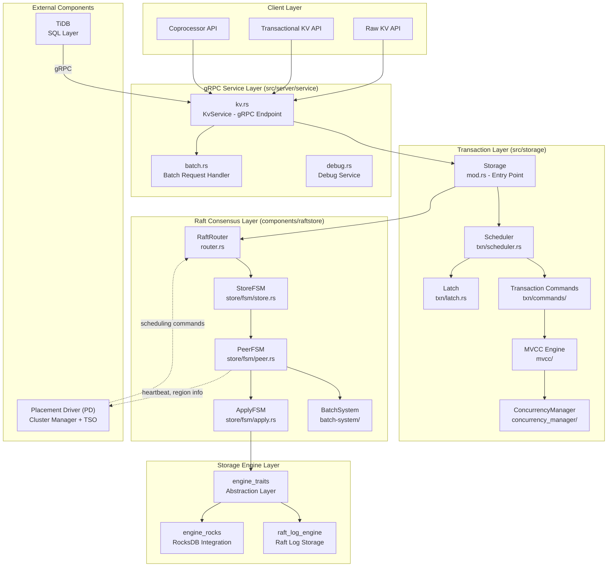
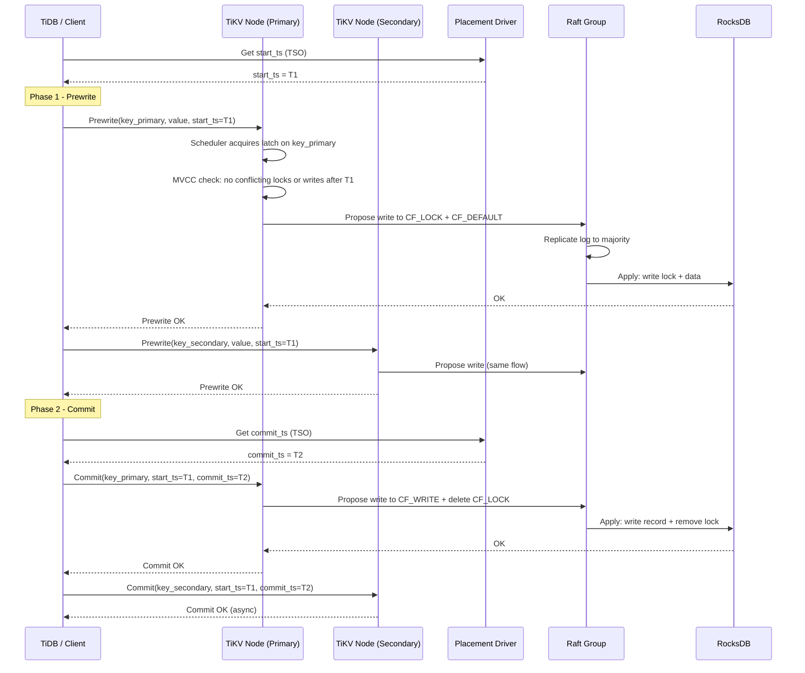
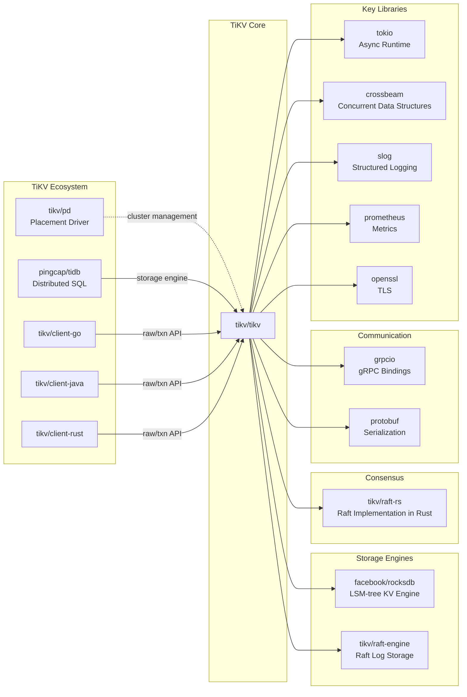

# TiKV

> A distributed transactional key-value database powered by Rust and Raft, originally created to complement TiDB

| Metadata | |
|---|---|
| Repository | https://github.com/tikv/tikv |
| License | Apache-2.0 |
| Primary Language | Rust |
| Analyzed Release | `v8.5.5` (2026-01-15) |
| Stars (approx.) | 16,500+ |
| Generated by | Claude Opus 4.6 (Anthropic) |
| Generated on | 2026-02-08 |

## Overview

TiKV is an open-source, distributed, transactional key-value database that provides both classical key-value APIs and transactional APIs with ACID compliance. Built in Rust and powered by the Raft consensus algorithm, it was originally created by PingCAP to serve as the storage layer for TiDB, a distributed HTAP database compatible with the MySQL protocol. TiKV is a graduated project of the Cloud Native Computing Foundation (CNCF).

Problems it solves:

- Providing a horizontally scalable, strongly consistent key-value storage layer that can serve as the foundation for distributed SQL databases
- Guaranteeing ACID-compliant distributed transactions across a sharded dataset using an optimized Percolator-based two-phase commit protocol
- Automatically balancing data across nodes through region-based sharding, splitting, and merging with no manual intervention required

Positioning:

TiKV occupies the distributed transactional key-value database space alongside systems like Google Spanner, CockroachDB's storage layer, and FoundationDB. Its design is inspired by Google's BigTable, Spanner, and Percolator. Unlike etcd (which targets metadata/configuration storage with strict size limits), TiKV is designed for large-scale data workloads (100+ TB). It differentiates itself by being both a standalone key-value store with raw and transactional APIs, and the storage engine underpinning the TiDB distributed SQL database.

## Architecture Overview

TiKV follows a layered architecture with four major tiers: a gRPC service layer for client communication, a transaction/storage layer implementing MVCC and Percolator-style 2PC, a Raft consensus layer for data replication via the Multi-Raft pattern (each Region forms its own Raft group), and a storage engine layer backed by RocksDB. The Placement Driver (PD), an external cluster manager, coordinates metadata, timestamp allocation (TSO), and data scheduling across all TiKV nodes.

## Core Components

### Raft Consensus Engine (`components/raftstore`)

- Responsibility: Data replication, leader election, Region lifecycle management (split, merge, transfer), and log persistence via the Multi-Raft pattern
- Key files: `components/raftstore/src/store/fsm/peer.rs`, `components/raftstore/src/store/fsm/apply.rs`, `components/raftstore/src/store/fsm/store.rs`, `components/raftstore/src/store/peer.rs`
- Design patterns: Finite State Machine (FSM) pattern via the BatchSystem, Actor model for concurrent Region processing

The raftstore is the heart of TiKV. It implements Multi-Raft, where data is divided into Regions (default 96 MB each), and each Region is replicated across multiple TiKV nodes as an independent Raft group. The `PeerFSM` drives the Raft state machine for each Region, handling proposals, log replication, and leader election. The `ApplyFSM` applies committed Raft entries to the underlying storage engine. The `StoreFSM` manages the overall store lifecycle and coordinates inter-Region operations like split and merge. All FSMs are driven by the `BatchSystem` (`components/batch-system/`), which polls multiple FSMs in batches on a configurable thread pool, achieving high throughput for clusters with millions of Regions.

### Transaction and MVCC Layer (`src/storage`)

- Responsibility: ACID-compliant distributed transactions using an optimized Percolator model with MVCC (Multi-Version Concurrency Control)
- Key files: `src/storage/txn/commands/prewrite.rs`, `src/storage/txn/commands/commit.rs`, `src/storage/txn/scheduler.rs`, `src/storage/txn/latch.rs`, `src/storage/mvcc/txn.rs`, `src/storage/mvcc/reader/`
- Design patterns: Command pattern (each transaction operation is a command struct), Scheduler pattern with latching for concurrency control

The transaction layer implements Percolator-style two-phase commit (2PC). In the Prewrite phase, each key is locked in CF_LOCK, and the value is written to CF_DEFAULT. In the Commit phase, a write record is placed in CF_WRITE and the lock is released. Three RocksDB Column Families (CF_DEFAULT, CF_LOCK, CF_WRITE) store data, locks, and write records respectively. The `Scheduler` dispatches transaction commands to a thread pool and uses a `Latch` mechanism to serialize conflicting operations on the same keys. The `ConcurrencyManager` (`components/concurrency_manager/`) tracks the maximum timestamp of active transactions to enable lock-free reads when safe. Short values are inlined directly into CF_LOCK during prewrite and moved to CF_WRITE during commit as an optimization to reduce I/O.

### gRPC Service Layer (`src/server/service`)

- Responsibility: Exposing TiKV's functionality to clients via gRPC, including raw KV, transactional KV, and coprocessor endpoints
- Key files: `src/server/service/kv.rs`, `src/server/service/batch.rs`, `src/server/service/debug.rs`, `src/server/raft_server.rs`
- Design patterns: Service facade pattern, Request batching for throughput optimization

The `KvService` in `kv.rs` implements the gRPC service definition for all client-facing APIs: `KvGet`, `KvPrewrite`, `KvCommit`, `RawGet`, `RawPut`, `Coprocessor`, and many more. Requests are dispatched to the `Storage` layer for transactional/raw operations or the coprocessor endpoint for push-down computation. The `batch.rs` module enables batching multiple requests into a single gRPC call to reduce RPC overhead. The `raft_server.rs` handles inter-node Raft message transport. A separate `status_server` (`src/server/status_server/`) provides HTTP endpoints for metrics, profiling, and health checks.

### Coprocessor Framework (`src/coprocessor`)

- Responsibility: Push-down computation from TiDB to TiKV, executing SQL operators (selection, aggregation, top-N, etc.) directly on the storage nodes
- Key files: `src/coprocessor/endpoint.rs`, `src/coprocessor/dag/`, `components/tidb_query_executors/`, `components/tidb_query_expr/`, `components/tidb_query_aggr/`
- Design patterns: Volcano/Iterator model for query execution, Vectorized execution for batch processing

The Coprocessor allows TiDB to push down SQL operators to TiKV, reducing data transfer between the SQL layer and the storage layer. The `endpoint.rs` handles incoming coprocessor requests and dispatches them to the appropriate handler. The `tidb_query_executors` component implements a vectorized execution engine with operators like `TableScanExecutor`, `IndexScanExecutor`, `SelectionExecutor`, `HashAggregationExecutor`, and `TopNExecutor`. Expression evaluation is handled by `tidb_query_expr`, supporting a wide range of SQL functions. This push-down architecture is critical for TiDB's performance, as it significantly reduces the volume of data that must be transferred over the network.

### Placement Driver Client (`components/pd_client`)

- Responsibility: Communication with the external PD (Placement Driver) cluster for timestamp allocation, region metadata management, and scheduling command reception
- Key files: `components/pd_client/src/client.rs`, `components/pd_client/src/tso.rs`, `components/pd_client/src/config.rs`
- Design patterns: Client-side load balancing, Timestamp Oracle (TSO) batching

The PD client connects each TiKV node to the PD cluster, which serves as the brain of the entire TiKV deployment. Key functions include: (1) TSO (Timestamp Oracle) requests via `tso.rs`, which allocates globally unique, monotonically increasing timestamps used for MVCC versioning and transaction ordering; (2) Region heartbeat reporting, where each TiKV node periodically sends Region metadata (size, key count, leader info) to PD; (3) Receiving scheduling commands from PD, such as Region transfer, split, and merge directives based on load balancing decisions. The TSO implementation batches multiple timestamp requests into a single RPC for efficiency.

## Data Flow

### Distributed Transaction Write (Percolator 2PC)

## Key Design Decisions

### 1. Multi-Raft with Region-Based Sharding

- Choice: Partition data into fixed-size Regions (default 96 MB), each forming an independent Raft group, instead of using a single monolithic Raft group or hash-based sharding
- Rationale: A single Raft group would become a bottleneck as data grows. Range-based partitioning preserves key ordering (essential for range scans in SQL workloads) while allowing each Region to independently elect leaders, replicate logs, and be scheduled across nodes. This enables fine-grained load balancing and fault isolation
- Trade-offs: Managing millions of Regions introduces metadata overhead. Heartbeat traffic grows linearly with Region count. Region split and merge operations add complexity. The `raftstore-v2` rewrite addresses some of these scaling challenges

### 2. Percolator-Based Distributed Transactions with Three Column Families

- Choice: Implementing Google's Percolator transaction model using three RocksDB Column Families (CF_DEFAULT for data, CF_LOCK for locks, CF_WRITE for commit records) rather than a custom WAL or lock manager
- Rationale: Percolator provides snapshot isolation with minimal coordination. Using RocksDB Column Families leverages its atomic WriteBatch across CFs, ensuring crash consistency. The decentralized lock management (locks stored per-key in CF_LOCK) avoids a centralized lock manager bottleneck
- Trade-offs: Write amplification from maintaining three CFs. Every transaction requires at least two round trips (prewrite + commit). Read operations must check CF_LOCK for active transactions, adding latency. Short value inlining and async commit optimizations mitigate some overhead

### 3. Rust as the Implementation Language

- Choice: Building the entire system in Rust rather than C++, Go, or Java
- Rationale: Rust provides memory safety guarantees without garbage collection, which is critical for a storage system where latency spikes from GC pauses are unacceptable. Its ownership model prevents data races at compile time, reducing concurrency bugs in a highly parallel system. Zero-cost abstractions allow high-level code without runtime overhead
- Trade-offs: Steeper learning curve limits the contributor pool. Longer compilation times (especially for a workspace with 70+ crates). FFI boundaries with C libraries (RocksDB, gRPC) require unsafe blocks

### 4. BatchSystem-Driven FSM Architecture

- Choice: Processing all Raft and Apply operations through a custom `BatchSystem` that polls multiple FSMs in batches on a fixed-size thread pool, rather than spawning a thread or async task per Region
- Rationale: With potentially millions of Regions per node, one-thread-per-Region is infeasible. The BatchSystem amortizes scheduling overhead by processing multiple FSMs per poll iteration. This Actor-model-inspired design provides natural isolation between Regions while enabling efficient batching of I/O operations (e.g., writing multiple Regions' Raft logs in a single RocksDB WriteBatch)
- Trade-offs: A slow FSM can delay other FSMs sharing the same batch. Debugging is harder than with simple thread-per-Region models. Tuning batch sizes and thread pool sizes requires careful benchmarking

### 5. Engine Trait Abstraction Layer

- Choice: Defining storage engine operations behind the `engine_traits` trait abstraction (`components/engine_traits/`) rather than coupling directly to RocksDB
- Rationale: Enables swapping storage engines without modifying upper layers. TiKV already supports multiple engine backends: `engine_rocks` (RocksDB) for data storage, `raft_log_engine` for Raft logs, and experimental engines like `engine_tirocks` and `hybrid_engine` (combining in-memory and on-disk engines). The `engine_panic` crate provides a stub implementation for testing
- Trade-offs: Adds an indirection layer that may slightly impact performance. The trait surface is large and must be kept in sync across all implementations. Not all engine features map cleanly to a common trait interface

## Dependencies

## Testing Strategy

TiKV employs a comprehensive, multi-layered testing strategy befitting a distributed database system.

Unit tests: Each crate within the workspace contains inline `#[test]` functions and dedicated test modules. The `components/` directory includes dedicated test crates such as `test_raftstore`, `test_storage`, `test_coprocessor`, `test_pd_client`, and `test_sst_importer` that provide test utilities and harnesses for the corresponding components.

Integration tests: The `tests/integrations/` directory contains integration tests organized by subsystem (raftstore, storage, coprocessor, server, pd, backup, import, resource_metering). These tests spin up multi-node TiKV clusters in-process to verify end-to-end behavior including Region split/merge, leader transfer, transaction conflict resolution, and snapshot operations.

Failpoint testing: TiKV extensively uses the `fail` crate (failpoints) to inject errors at specific code paths during testing. The `tests/failpoints/` directory contains tests that simulate disk failures, network partitions, and timing anomalies. This is enabled by the `failpoints` feature flag.

Fuzz testing: The `fuzz/` directory contains fuzz targets for critical code paths, helping discover edge cases in parsing and data handling.

CI/CD: TiKV uses a Jenkins-based CI pipeline (`ci.pingcap.net`) for primary build and test execution, supplemented by GitHub Actions for platform-specific checks (e.g., `tikv-clippy-darwin.yml` for macOS linting). The CI runs clippy lints, unit tests, integration tests, and failpoint tests across multiple configurations.

## Key Takeaways

1. Multi-Raft for scalable consensus: Rather than using a single Raft group (which limits throughput to one leader), TiKV partitions data into Regions that each run independent Raft groups. This Multi-Raft pattern allows linear scaling of write throughput by distributing leaders across nodes. The trade-off is managing Region lifecycle (split, merge, transfer), which TiKV handles through the PD scheduling system. This pattern is applicable to any distributed system needing both strong consistency and horizontal scalability.

2. BatchSystem as a high-performance actor framework: TiKV's custom `BatchSystem` demonstrates how to efficiently drive millions of concurrent state machines on a fixed thread pool. By polling multiple FSMs per iteration and batching I/O operations, it achieves far better throughput than a naive thread-per-actor model. This is a reusable architectural pattern for any system managing large numbers of independent but I/O-bound state machines.

3. Trait-based engine abstraction: The `engine_traits` crate provides a clean separation between the storage engine interface and its implementations. This has allowed TiKV to evolve from a pure RocksDB backend to supporting multiple engines (RocksDB, Raft Engine, hybrid in-memory engine) without modifying upper layers. This strategy of abstracting infrastructure dependencies behind well-defined trait boundaries is broadly applicable to systems expecting backend evolution.

4. Column Family design for transactional metadata: The use of three separate RocksDB Column Families (CF_DEFAULT, CF_LOCK, CF_WRITE) to implement Percolator transactions is an elegant mapping of a distributed transaction protocol onto a local storage engine's primitives. The atomic WriteBatch across CFs ensures crash consistency without a separate WAL, demonstrating how to leverage underlying storage guarantees to simplify distributed protocol implementation.

5. Coprocessor push-down for reducing data movement: TiKV's coprocessor framework pushes SQL operators (filter, aggregation, top-N) down to the storage layer, dramatically reducing network transfer between TiDB and TiKV. This compute-near-data pattern, with a vectorized execution engine in `tidb_query_executors`, shows how storage systems can evolve beyond simple get/put interfaces to become compute-capable, a principle increasingly relevant in disaggregated architectures.

## References

- [TiKV Official Documentation](https://tikv.org/docs/latest/concepts/overview/)
- [Deep Dive TiKV - Architecture and Internals](https://tikv.github.io/deep-dive-tikv/)
- [TiKV Architecture Overview](https://tikv.org/docs/4.0/concepts/architecture/)
- [How TiKV Reads and Writes](https://tikv.org/blog/how-tikv-reads-writes/)
- [TiKV Percolator Transaction Model](https://tikv.org/deep-dive/distributed-transaction/percolator/)
- [Optimized Percolator in TiKV](https://tikv.org/deep-dive/distributed-transaction/optimized-percolator/)
- [A Deep Dive into TiKV - PingCAP Blog](https://www.pingcap.com/blog/deep-dive-into-tikv/)
- [MVCC in TiKV](https://www.pingcap.com/blog/multi-version-concurrency-control-in-tikv/)
- [DeepWiki - tikv/tikv](https://deepwiki.com/tikv/tikv)
- [TiKV CNCF Graduated Project](https://www.cncf.io/projects/tikv/)
