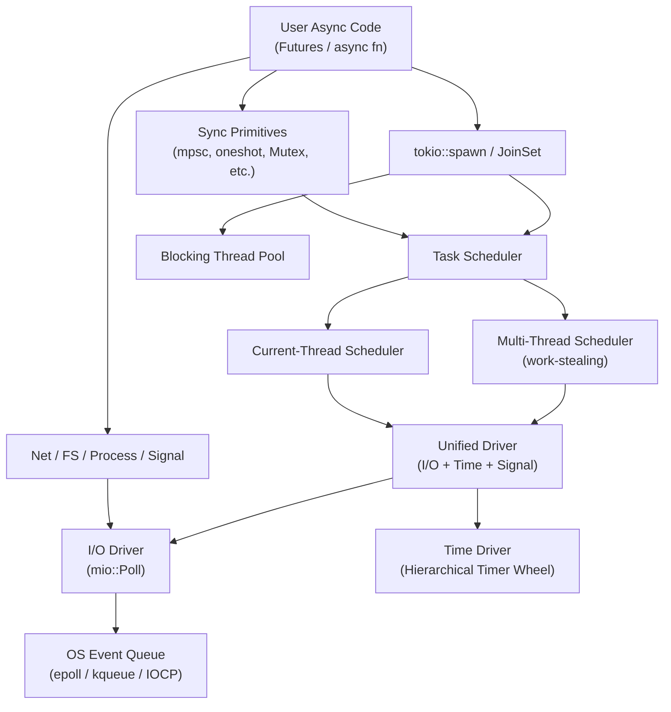
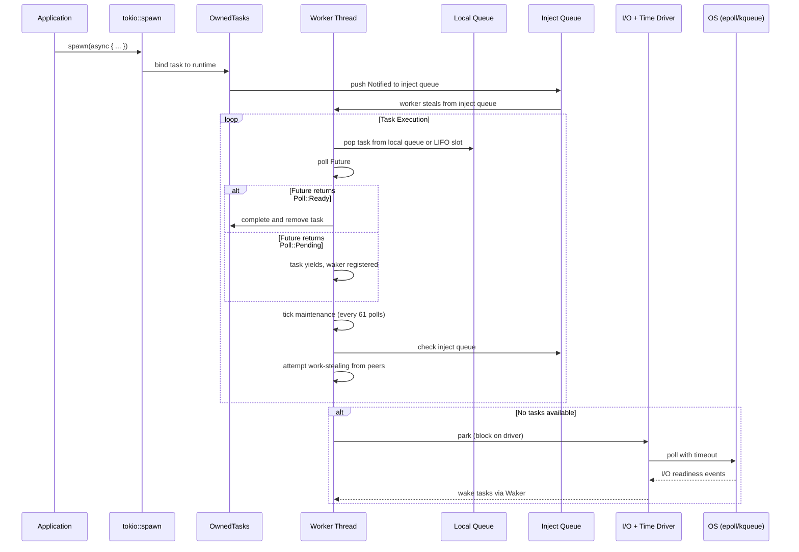
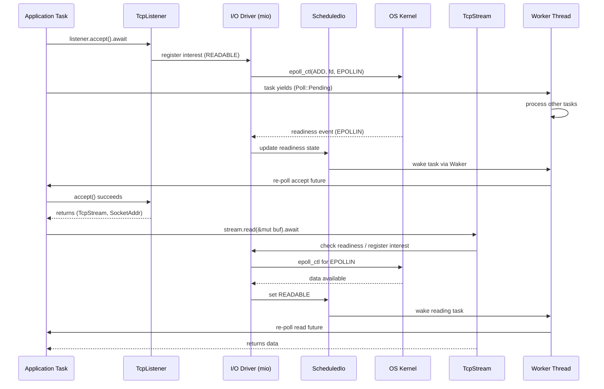
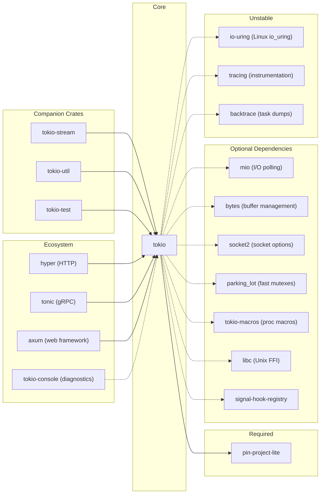

# Tokio

> A runtime for writing reliable asynchronous applications with Rust, providing I/O, networking, scheduling, and timers.

| Metadata | |
|---|---|
| Repository | https://github.com/tokio-rs/tokio |
| License | MIT License |
| Primary Language | Rust |
| Category | Runtime |
| Analyzed Release | `v1.49.0` (2026-01-03) |
| Stars (approx.) | 31,000 |
| Generated by | Claude Opus 4.6 (Anthropic) |
| Generated on | 2026-02-08 |

## Overview

Tokio is an event-driven, non-blocking I/O platform that provides the foundational runtime for asynchronous programming in Rust. It bundles a multithreaded work-stealing task scheduler, an I/O reactor backed by OS event queues (epoll on Linux, kqueue on BSD, IOCP on Windows), and a high-performance timer into a single cohesive runtime. Tokio enables developers to write highly concurrent network applications -- such as HTTP servers, RPC frameworks, and database drivers -- without the overhead of OS threads per connection.

Problems it solves:

- Eliminates the need for one-thread-per-connection models by multiplexing thousands of async tasks onto a small thread pool
- Provides zero-cost abstractions over OS async I/O primitives, hiding platform differences behind a unified API
- Offers cooperative scheduling to prevent any single task from starving others, while still maintaining high throughput
- Supplies async-aware synchronization primitives (Mutex, RwLock, channels) that avoid blocking the runtime

Positioning:

Tokio is the de facto standard async runtime in the Rust ecosystem, comparable in role to Node.js's libuv or Go's goroutine scheduler. Alternatives include async-std (similar API surface but smaller community), smol (minimalist approach), and glommio (thread-per-core with io_uring). Tokio differentiates itself through its work-stealing scheduler, mature ecosystem (Hyper, Tonic, Axum all build on Tokio), and broad production adoption at companies like Discord, Cloudflare, and AWS (Lambda, Firecracker).

## Architecture Overview

Tokio follows a layered architecture where user-facing async APIs sit atop a runtime engine composed of pluggable drivers and schedulers. The runtime orchestrates three subsystems -- the task scheduler, the I/O driver, and the time driver -- through a unified driver loop that parks and unparks worker threads based on event availability.

## Core Components

### 1. Runtime (`tokio/src/runtime/`)

- Responsibility: Bootstrap and manage the lifecycle of all runtime subsystems, including scheduler selection, driver initialization, and shutdown coordination
- Key files: `tokio/src/runtime/runtime.rs`, `tokio/src/runtime/builder.rs`, `tokio/src/runtime/handle.rs`, `tokio/src/runtime/mod.rs`
- Design patterns: Builder pattern for runtime configuration, RAII for shutdown

The Runtime is the entry point that ties everything together. It is constructed via `Runtime::new()` or the `Builder` API, which allows selecting between the `current_thread` and `multi_thread` scheduler flavors, configuring worker thread counts, enabling/disabling I/O and time drivers, and setting thread names. The `#[tokio::main]` attribute macro expands into a `Runtime::new()` call followed by `block_on()`, hiding the setup from application developers. Internally, the Runtime owns the `Driver` (composed of I/O + time + signal sub-drivers) and the `Scheduler`, and coordinates their lifecycle through a shared `Handle`.

### 2. Multi-Thread Scheduler (`tokio/src/runtime/scheduler/multi_thread/`)

- Responsibility: Distribute async tasks across multiple OS threads using a work-stealing algorithm for load balancing
- Key files: `tokio/src/runtime/scheduler/multi_thread/worker.rs`, `tokio/src/runtime/scheduler/multi_thread/queue.rs`, `tokio/src/runtime/scheduler/multi_thread/idle.rs`, `tokio/src/runtime/scheduler/inject/shared.rs`
- Design patterns: Work-stealing deque, LIFO slot optimization, lock-free concurrent data structures

The multi-thread scheduler is Tokio's default and most sophisticated scheduling strategy. Each worker thread owns a `Core` struct containing a local run queue (a fixed-size ring buffer of 256 slots defined in `queue.rs`), a LIFO slot for the most recently spawned task, and scheduling state. When a worker exhausts its local queue, it first checks the global inject queue, then attempts to steal tasks from other workers' queues -- taking half of the victim's tasks at a time. The LIFO slot is a key optimization: the last task spawned by a worker runs next, improving cache locality for message-passing patterns. Worker threads park themselves (via the driver) when no tasks are available, and are unparked when new tasks arrive or I/O events fire.

### 3. Current-Thread Scheduler (`tokio/src/runtime/scheduler/current_thread/`)

- Responsibility: Execute all async tasks on a single thread, suitable for lightweight or `!Send` workloads
- Key files: `tokio/src/runtime/scheduler/current_thread/mod.rs`
- Design patterns: Single-threaded event loop, cooperative multitasking

The current-thread scheduler runs all tasks on the thread that calls `block_on()`. It maintains a `VecDeque<Notified>` as its run queue and uses an inject queue for tasks spawned from external threads. The scheduler drives the I/O and time drivers directly during its poll loop. This flavor is used when `#[tokio::main(flavor = "current_thread")]` is specified, and is the foundation for `LocalRuntime` (unstable), which supports `!Send` futures.

### 4. I/O Driver (`tokio/src/runtime/io/`)

- Responsibility: Bridge OS event notification systems with Tokio's task waker mechanism, enabling non-blocking I/O
- Key files: `tokio/src/runtime/io/driver.rs`, `tokio/src/runtime/io/registration.rs`, `tokio/src/runtime/io/scheduled_io.rs`, `tokio/src/runtime/io/registration_set.rs`
- Design patterns: Reactor pattern, readiness-based I/O, token-based event dispatching

The I/O driver wraps `mio::Poll` to receive readiness notifications from the OS. Each I/O resource (TCP socket, UDP socket, Unix pipe, etc.) is registered with the driver via a `Registration`, which associates it with a `ScheduledIo` entry. When the driver polls for events, it receives `mio::Event` tokens that map back to `ScheduledIo` entries. Each `ScheduledIo` stores the readiness state and a list of wakers for tasks waiting on that resource. When readiness changes, the driver updates the state and wakes the appropriate tasks. The driver also handles signal readiness on Unix systems through a dedicated signal token.

### 5. Time Driver (`tokio/src/time/`)

- Responsibility: Provide async-aware timing facilities including sleep, timeout, and interval
- Key files: `tokio/src/time/sleep.rs`, `tokio/src/time/timeout.rs`, `tokio/src/time/interval.rs`, `tokio/src/time/clock.rs`
- Design patterns: Hierarchical timer wheel, test-time manipulation

The time driver manages timer state and integrates with the runtime's driver stack. It layers on top of the I/O driver: when the scheduler parks, it computes the nearest timer deadline and passes it as a timeout to the I/O driver's `poll()` call. Timer entries are stored in a hierarchical wheel structure that provides O(1) insertion and amortized O(1) expiration processing. The `test-util` feature allows pausing and advancing time programmatically, which is critical for deterministic testing of timeout-dependent code.

### 6. Blocking Thread Pool (`tokio/src/runtime/blocking/`)

- Responsibility: Execute synchronous/blocking operations without stalling the async worker threads
- Key files: `tokio/src/runtime/blocking/pool.rs`, `tokio/src/runtime/blocking/shutdown.rs`, `tokio/src/runtime/blocking/task.rs`
- Design patterns: Thread pool with on-demand spawning, bounded concurrency

The blocking pool provides a dedicated set of OS threads for operations that cannot be made asynchronous, such as file system I/O (via `tokio::fs`) and CPU-intensive computations (via `spawn_blocking`). Unlike the fixed-size async worker pool, the blocking pool spawns threads on demand up to a configurable maximum (default 512). Idle threads are reaped after a timeout period. The `block_in_place` API allows a multi-thread worker to temporarily hand off its scheduler core to a new thread, enabling the blocking call to run in-place without consuming a blocking pool slot.

### 7. Synchronization Primitives (`tokio/src/sync/`)

- Responsibility: Provide async-aware concurrency primitives that integrate with the task scheduler instead of blocking OS threads
- Key files: `tokio/src/sync/mpsc/chan.rs`, `tokio/src/sync/oneshot.rs`, `tokio/src/sync/notify.rs`, `tokio/src/sync/broadcast.rs`, `tokio/src/sync/mutex.rs`, `tokio/src/sync/rwlock.rs`, `tokio/src/sync/watch.rs`, `tokio/src/sync/batch_semaphore.rs`
- Design patterns: Intrusive linked lists for waiters, semaphore-based fairness, atomic state machines

Tokio provides a full suite of async synchronization primitives. The `mpsc` channel uses a linked-list of blocks for buffering messages, with a semaphore controlling backpressure in the bounded variant. The `broadcast` channel enables multi-consumer patterns with a shared ring buffer. The `Mutex` and `RwLock` are built on top of `batch_semaphore`, which batches waker notifications to reduce contention. The `Notify` primitive provides a low-level signaling mechanism used internally throughout the runtime. All primitives use `Waker`-based notification rather than thread parking, ensuring they cooperate with the async scheduler.

### 8. Networking (`tokio/src/net/`)

- Responsibility: Provide async TCP, UDP, and Unix domain socket APIs that integrate with the I/O driver
- Key files: `tokio/src/net/tcp/stream.rs`, `tokio/src/net/tcp/listener.rs`, `tokio/src/net/udp.rs`, `tokio/src/net/unix/stream.rs`, `tokio/src/net/unix/listener.rs`
- Design patterns: Readiness-based async I/O, split pattern for concurrent read/write

The networking module wraps standard library socket types with async registration into the I/O driver. `TcpStream` and `TcpListener` are backed by `mio::net` types registered via `PollEvented`, which bridges the readiness notification system with Rust's `AsyncRead`/`AsyncWrite` traits. Sockets can be split into independent read and write halves (both borrowed via `split()` and owned via `into_split()`) to allow concurrent bidirectional I/O from separate tasks.

## Data Flow

### Spawning and Executing an Async Task

### Async TCP Connection Lifecycle

## Key Design Decisions

### 1. Work-Stealing Scheduler with LIFO Slot

- Choice: A multi-threaded scheduler where each worker has a local run queue and can steal from peers, combined with a LIFO slot that prioritizes the most recently spawned task
- Rationale: Work-stealing provides automatic load balancing across cores without centralized coordination. The LIFO slot exploits temporal locality -- in message-passing patterns, the task that just sent a message likely made the receiver ready, so running the receiver immediately reduces latency and improves cache hit rates
- Trade-offs: Work-stealing adds complexity in the queue implementation (lock-free ring buffer with ABA protection). The LIFO slot can occasionally cause unfairness if tasks continuously spawn new work. The fixed local queue size (256) means overflow tasks spill to the shared inject queue, adding contention

### 2. Readiness-Based I/O Model via Mio

- Choice: Readiness notification (epoll/kqueue style) rather than completion-based I/O (io_uring/IOCP style), abstracted through the Mio library
- Rationale: Readiness-based I/O maps naturally to Rust's `poll`-based Future model. The application attempts the I/O operation, and if it would block, registers interest and yields. This avoids buffer ownership complexities inherent in completion-based models where buffers must remain valid until the kernel completes the operation
- Trade-offs: Readiness-based I/O requires an extra syscall (the actual read/write after notification) compared to completion-based models. For high-throughput scenarios, io_uring can outperform epoll. Tokio addresses this with an experimental `io-uring` feature flag, though it remains unstable

### 3. Cooperative Scheduling with Budget System

- Choice: A cooperative task budget that forces tasks to yield after a fixed number of poll operations (currently approximately 128 sub-polls per top-level poll)
- Rationale: Without preemption, a single task that is always ready (e.g., draining a hot channel) can starve all other tasks. The budget system injects automatic yield points in Tokio's own I/O and channel operations, ensuring fair scheduling without requiring users to manually insert yield points
- Trade-offs: The budget adds a small overhead to every I/O and channel operation (checking and decrementing a thread-local counter). It can also cause surprising behavior when wrapping third-party futures that do not participate in the budget system. The `unconstrained()` escape hatch exists but must be used carefully

### 4. Feature-Flag-Based Modularity

- Choice: Nearly every subsystem (runtime, I/O, net, time, sync, fs, process, signal) is gated behind Cargo feature flags, with no features enabled by default
- Rationale: Library authors can depend on Tokio with only the features they need, minimizing compile times and binary sizes for their downstream users. A library that only needs `tokio::spawn` can depend on just the `rt` feature without pulling in networking, file I/O, or timer code
- Trade-offs: The feature matrix creates significant complexity in the codebase through extensive `cfg` attribute usage. Conditional compilation makes the code harder to navigate and can lead to subtle bugs where code paths are only compiled under certain feature combinations. Testing all permutations is challenging

### 5. Loom-Based Concurrency Testing

- Choice: Using the `loom` crate to systematically test concurrent code by exploring all possible thread interleavings
- Rationale: Lock-free data structures (like the work-stealing queue) and atomic state machines (like those in sync primitives) are notoriously difficult to get right. Loom provides deterministic exploration of the concurrent state space, catching bugs that are nearly impossible to reproduce with random testing
- Trade-offs: Loom tests are extremely slow due to combinatorial explosion of interleavings. The codebase must use `loom`-compatible wrappers for all synchronization primitives (atomics, Mutex, thread::spawn), adding an abstraction layer (`tokio/src/loom/`) that wraps either `std` or `loom` types depending on the build configuration

## Dependencies

## Testing Strategy

Tokio employs a multi-layered testing approach that reflects the complexity of testing concurrent, async code.

Unit tests: Each module contains inline unit tests (`#[cfg(test)]`) that verify individual components in isolation. The sync primitives have particularly thorough unit tests covering edge cases in channel semantics, semaphore fairness, and waker behavior.

Loom tests: Critical concurrent data structures are tested using the `loom` crate (`tokio/src/sync/tests/loom_*.rs`). These tests exhaustively explore thread interleavings for the work-stealing queue, mpsc channels, broadcast channels, oneshot, notify, rwlock, and semaphore. The `tokio/src/loom/` module provides compatibility wrappers so the same code can run against both `std` and `loom` primitives.

Integration tests: The `tests-integration/` directory contains tests for cross-cutting concerns like process stdio handling, macro expansion correctness, and runtime yield behavior. The `tokio-test` companion crate provides test utilities including a deterministic mock runtime.

Stress tests: The `stress-test/` directory contains long-running tests designed to expose race conditions and memory leaks under sustained load.

CI/CD: GitHub Actions runs the test suite across multiple platforms (Linux, macOS, Windows, WASI) and Rust toolchain versions (stable, beta, nightly). The CI also runs Miri for undefined behavior detection, clippy for lint checks, and cross-compilation tests for embedded targets.

## Key Takeaways

1. Layered driver composition: Tokio composes I/O, time, and signal drivers into a single `Driver` stack where parking the scheduler transparently polls all subsystems. This design means adding a new driver type (like io_uring) requires implementing only the driver interface, not modifying the scheduler. The pattern of composing orthogonal event sources into a unified park/unpark mechanism is applicable to any event-driven system.

2. Work-stealing with locality optimization: The combination of per-worker local queues, a global inject queue, and a LIFO slot creates a scheduling strategy that balances throughput (work-stealing prevents idle cores) with latency (LIFO slot preserves cache locality for message-passing chains). This three-tier queue architecture is a proven approach for any work-scheduling system that needs both fairness and low latency.

3. Cooperative scheduling without language support: Since Rust lacks preemptive green threads, Tokio implements cooperative scheduling through a budget system that is threaded through its own APIs. This demonstrates how a runtime can enforce fairness in a language without built-in preemption, by making yield points a library-level concern rather than a language-level one.

4. Feature flags as an architecture tool: Tokio's aggressive use of Cargo feature flags turns compile-time configuration into an architectural boundary. Each subsystem is genuinely optional, allowing the same crate to serve both minimal embedded use cases and full-featured server applications. This approach trades code readability (pervasive `cfg` annotations) for deployment flexibility.

5. Concurrency correctness via Loom: By building the entire codebase against an abstraction layer that can swap between `std` and `loom`, Tokio can systematically verify lock-free algorithms and atomic state machines. This investment in testing infrastructure pays dividends in the reliability of primitives that would otherwise be nearly impossible to test thoroughly through conventional means.

## References

- [Tokio Official Website](https://tokio.rs)
- [Tokio Tutorial](https://tokio.rs/tokio/tutorial)
- [Tokio API Documentation](https://docs.rs/tokio/latest/tokio)
- [Tokio GitHub Repository](https://github.com/tokio-rs/tokio)
- [Tokio Architecture - DeepWiki](https://deepwiki.com/tokio-rs/tokio/2-architecture)
- [Tokio Internals: Understanding Rust's Asynchronous I/O Framework](https://cafbit.com/post/tokio_internals/)
- [The State of Async Rust: Runtimes](https://corrode.dev/blog/async/)
- [Async in Depth - Tokio Tutorial](https://tokio.rs/tokio/tutorial/async)
