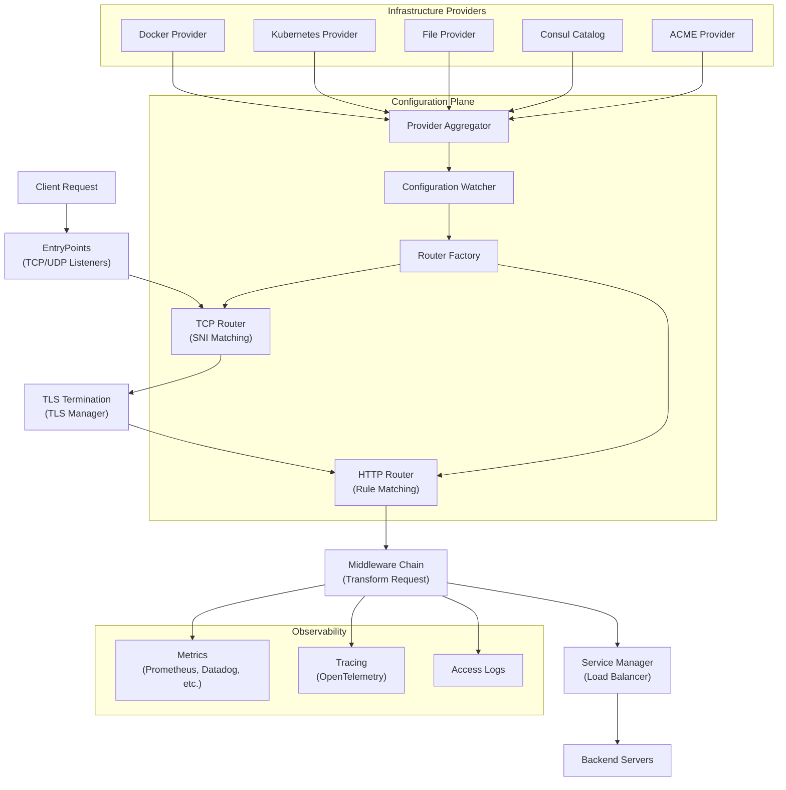
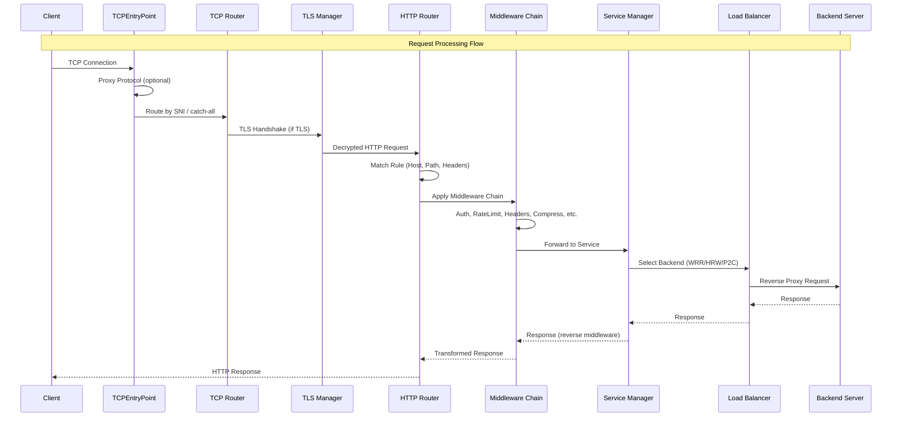
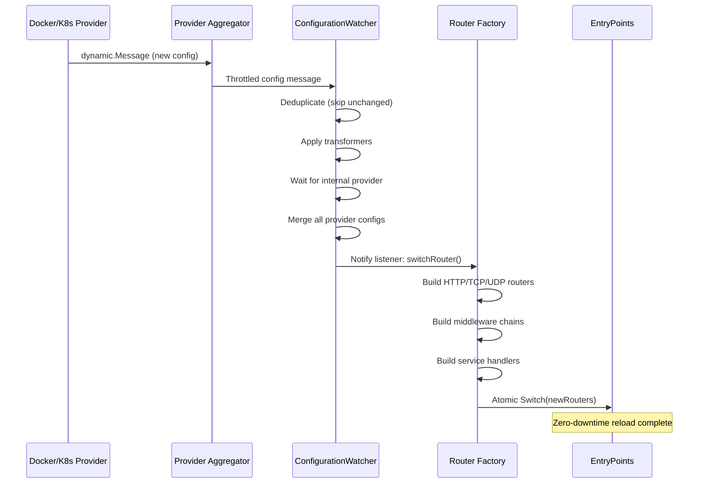
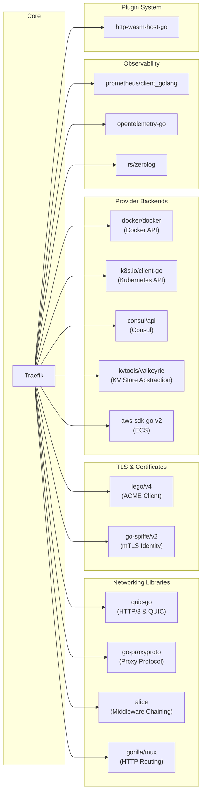

# Traefik

> The Cloud Native Application Proxy - a modern HTTP reverse proxy and load balancer for deploying microservices

| Metadata | |
|---|---|
| Repository | https://github.com/traefik/traefik |
| License | MIT License |
| Primary Language | Go |
| Category | Networking |
| Analyzed Release | `v2.11.36` (2026-02-02) |
| Stars (approx.) | 61,502 |
| Generated by | Claude Opus 4.6 (Anthropic) |
| Generated on | 2026-02-08 |

## Overview

Traefik (pronounced "traffic") is a cloud-native HTTP reverse proxy and load balancer that automatically discovers services and dynamically configures routing rules by integrating with orchestrators like Docker, Kubernetes, Consul, and others. It eliminates the need for manual route configuration by listening to service registry and orchestrator APIs, generating and updating routes in real time without restarts.

Problems it solves:

- Manual route configuration in dynamic microservice environments where services are constantly added, removed, scaled, and upgraded
- Automatic TLS certificate management via Let's Encrypt (ACME) and Tailscale, removing the burden of manual SSL certificate provisioning
- Unified ingress handling across heterogeneous infrastructure (Docker, Kubernetes, ECS, Consul, key-value stores) through a single proxy

Positioning:

Traefik competes with NGINX, HAProxy, Envoy, and Caddy in the reverse proxy space. Its primary differentiator is native dynamic configuration discovery from orchestrators, whereas NGINX and HAProxy traditionally require configuration file reloads. Compared to Envoy, Traefik provides a simpler configuration model and built-in Let's Encrypt support. Compared to Caddy, Traefik offers deeper orchestrator integration. Traefik is particularly well-suited for Docker and Kubernetes-centric environments where zero-touch configuration is valued.

## Architecture Overview

Traefik follows a pipeline architecture centered around four core abstractions: EntryPoints (network listeners), Routers (rule-based request matchers), Middlewares (request/response transformers), and Services (backend load balancers). Static configuration defines infrastructure-level settings (entrypoints, providers), while dynamic configuration from multiple providers is continuously aggregated, merged, and applied through a watcher pattern to hot-reload routing without downtime. The system supports HTTP, TCP, and UDP protocols, with each protocol having its own router and service manager hierarchy.

## Core Components

### Provider System (`pkg/provider/`)

- Responsibility: Discovers services from infrastructure backends and produces dynamic configuration
- Key files: `pkg/provider/provider.go`, `pkg/provider/aggregator/aggregator.go`
- Design patterns: Strategy Pattern (each provider implements the `Provider` interface), Aggregator Pattern (ProviderAggregator combines all providers), Throttling Decorator

The provider system defines the `Provider` interface with two methods: `Provide(configurationChan chan<- dynamic.Message, pool *safe.Pool) error` and `Init() error`. Each infrastructure backend (Docker, Kubernetes, Consul Catalog, File, ECS, Nomad, etcd, Redis, ZooKeeper, HTTP) implements this interface. The `ProviderAggregator` in `pkg/provider/aggregator/aggregator.go` launches all configured providers concurrently, with each sending `dynamic.Message` structs containing the provider name and a `*dynamic.Configuration`. The aggregator applies per-provider throttling via the `throttled` interface and a ring-channel mechanism, preventing excessive configuration churn. The internal provider (`pkg/provider/traefik/`) is always launched last so the `ConfigurationWatcher` knows when all providers have been initialized.

### Configuration Watcher (`pkg/server/configurationwatcher.go`)

- Responsibility: Receives, deduplicates, transforms, merges, and distributes dynamic configuration updates to listeners
- Key files: `pkg/server/configurationwatcher.go`, `pkg/server/aggregator.go`
- Design patterns: Observer Pattern (listener functions registered via AddListener), Pipeline Pattern (configuration transformers), Non-blocking Channel Pattern

The `ConfigurationWatcher` is the central coordination point between providers and the routing infrastructure. It runs two goroutines: `receiveConfigurations` reads messages from all providers, deduplicates them (skipping nil, empty, and unchanged configurations), applies registered transformers, and sends the full configuration set via a non-blocking channel. `applyConfigurations` waits for the required internal provider before applying configs, merges configurations from all providers using `mergeConfiguration()`, applies the default entrypoints model via `applyModel()`, and fans out the final merged `dynamic.Configuration` to all registered listeners. Listeners include the TLS manager, metrics counters, transport managers, and the critical `switchRouter` function that triggers route rebuilding.

### Router Factory and Router Managers (`pkg/server/routerfactory.go`, `pkg/server/router/`)

- Responsibility: Creates and rebuilds TCP, HTTP, and UDP routers from runtime configuration
- Key files: `pkg/server/routerfactory.go`, `pkg/server/router/router.go`, `pkg/server/router/tcp/`, `pkg/server/router/udp/`
- Design patterns: Factory Pattern, Builder Pattern, Tree Structure (router parent-child relationships)

The `RouterFactory` orchestrates the creation of all router types. On each configuration update, `CreateRouters()` builds the full routing pipeline: it creates an HTTP `service.Manager`, a `middleware.Builder`, and an HTTP `router.Manager`, then calls `ParseRouterTree()` to validate the router hierarchy (detecting cycles, unreachable nodes, and dead-ends). It builds HTTP handlers for both TLS and non-TLS entrypoints, then constructs TCP routers (which embed HTTP handling for TLS-terminated connections) and UDP routers. The TCP router manager (`pkg/server/router/tcp/`) handles SNI-based routing and ACME TLS-ALPN challenges. The `switchRouter` function atomically switches the running entrypoints to use the newly built router handlers.

### Middleware System (`pkg/middlewares/`, `pkg/server/middleware/`)

- Responsibility: Provides a composable chain of request/response transformations
- Key files: `pkg/server/middleware/middlewares.go`, `pkg/middlewares/` (30+ subdirectories)
- Design patterns: Chain of Responsibility, Decorator Pattern, alice middleware chaining

The middleware system uses the `alice` library (`github.com/containous/alice`) to compose HTTP middleware chains. The `middleware.Builder` in `pkg/server/middleware/middlewares.go` takes a list of middleware names, resolves each from the runtime configuration, performs recursion detection (to prevent infinite middleware loops), and builds an `alice.Chain`. Built-in middlewares include: `addprefix`, `auth` (BasicAuth, DigestAuth, ForwardAuth), `buffering`, `circuitbreaker`, `compress` (gzip/brotli), `headers`, `inflightreq`, `ipallowlist`, `ratelimiter`, `redirect`, `retry`, `stripprefix`, and more. The system also supports plugin-based middlewares via the `PluginsBuilder` interface.

### Service Manager and Load Balancers (`pkg/server/service/`)

- Responsibility: Builds HTTP handlers for backend services with load balancing, health checking, and failover
- Key files: `pkg/server/service/service.go`, `pkg/server/service/loadbalancer/wrr/`, `pkg/server/service/loadbalancer/hrw/`, `pkg/server/service/loadbalancer/mirror/`, `pkg/server/service/loadbalancer/failover/`
- Design patterns: Strategy Pattern (multiple load balancer algorithms), Proxy Pattern, Health Check Pattern

The `service.Manager` resolves service names to `http.Handler` instances. It supports multiple service types: `ServersLoadBalancer` (direct backend proxying with load balancing), `WeightedRoundRobin` (WRR), `HighestRandomWeight` (HRW/rendezvous hashing), `Power of Two Choices` (P2C/least-time), `Mirroring` (traffic duplication), and `Failover` (primary/fallback). Each load balancer type resides in its own subdirectory under `pkg/server/service/loadbalancer/`. The `ProxyBuilder` interface abstracts reverse proxy creation, with `httputil.NewProxyBuilder` as the default and an experimental `proxy.SmartBuilder` for high-performance proxying. Health checks are launched per-service via `LaunchHealthCheck()`, periodically probing backend servers and adjusting their weight in the load balancer.

### EntryPoints (`pkg/server/server_entrypoint_tcp.go`, `pkg/server/server_entrypoint_udp.go`)

- Responsibility: Manage network listeners for incoming TCP and UDP connections
- Key files: `pkg/server/server_entrypoint_tcp.go`, `pkg/server/server_entrypoint_udp.go`, `pkg/server/server_entrypoint_tcp_http3.go`
- Design patterns: Acceptor Pattern, Atomic Switch Pattern, Proxy Protocol support

`TCPEntryPoint` manages a TCP listener, handles Proxy Protocol v1/v2 (via `go-proxyproto`), and forwards connections to the current TCP router. The `httpForwarder` struct bridges TCP connections into Go's `net.Listener` interface for use with `http.Server`. EntryPoints support HTTP/3 via QUIC (`quic-go`), configured in `server_entrypoint_tcp_http3.go`. The `Switch()` method on `TCPEntryPoints` atomically replaces the active router handlers, enabling zero-downtime configuration reloads. UDP entry points follow a similar pattern with `UDPEntryPoint` managing datagram handling.

## Data Flow

### HTTP Request Routing with Dynamic Configuration Update

### Dynamic Configuration Reload

## Key Design Decisions

### 1. Dual Configuration Model (Static vs Dynamic)

- Choice: Traefik separates configuration into static (loaded once at startup) and dynamic (hot-reloadable at runtime) categories
- Rationale: Infrastructure concerns like entrypoints, provider selection, and observability backends rarely change, while routing rules, middlewares, and service definitions change frequently as services scale. This separation allows safe hot-reloading of routing without restarting the process.
- Trade-offs: Users must understand which settings belong where. Some configuration errors (like wrong entrypoint names in static config) require a full restart to fix, while dynamic config errors are handled gracefully at runtime.

### 2. Provider Aggregation with Throttled Fan-In

- Choice: All infrastructure providers feed into a single `ProviderAggregator` with per-provider throttling and a non-blocking channel to the `ConfigurationWatcher`
- Rationale: In environments with many providers (e.g., Docker + Kubernetes + File), configuration events can arrive in rapid bursts. Throttling prevents excessive router rebuilds, while the non-blocking channel ensures the watcher always processes the latest configuration state without queuing stale intermediate states.
- Trade-offs: Throttling introduces a small delay between provider events and route application. The "latest wins" non-blocking channel means some intermediate configurations are skipped entirely, which is acceptable since only the final state matters.

### 3. Atomic Router Switching via EntryPoint.Switch()

- Choice: New router handlers are built completely in memory and atomically swapped into running entrypoints via `Switch()`
- Rationale: This enables true zero-downtime configuration reloads. In-flight requests continue processing through the old router while new requests use the new router. No connections are dropped during the switch.
- Trade-offs: Each configuration change builds an entirely new router tree, consuming memory proportional to the routing configuration size. For very large configurations (thousands of routes), this can cause brief GC pressure spikes.

### 4. Plugin System via WebAssembly (http-wasm)

- Choice: Traefik supports custom middleware and provider plugins using the http-wasm standard (`github.com/http-wasm/http-wasm-host-go`)
- Rationale: Allows extending Traefik without forking the codebase or recompiling. The WebAssembly sandbox provides security isolation for third-party plugins.
- Trade-offs: WebAssembly execution has overhead compared to native Go code. Plugin functionality is limited to what the http-wasm API exposes. Plugin failures can be configured to either abort startup or be silently skipped.

### 5. Multi-Protocol Support with Shared EntryPoints

- Choice: TCP, HTTP, and UDP protocols share the same entrypoint configuration and infrastructure, with protocol-specific routing layers
- Rationale: Simplifies configuration for users who need both TCP passthrough and HTTP routing on the same port. A single entrypoint can handle TLS-terminated HTTP traffic and raw TCP simultaneously using SNI-based routing.
- Trade-offs: The shared entrypoint model adds complexity to the routing pipeline (TCP router wraps HTTP router). UDP requires separate handling since it is connectionless, but still shares the entrypoint naming convention.

## Dependencies

## Testing Strategy

Traefik employs a comprehensive three-tier testing strategy covering unit tests, integration tests, and conformance tests. Tests are organized alongside production code (unit tests) and in a dedicated `integration/` directory (integration tests).

Unit tests: Each package contains `_test.go` files co-located with the production code. The testing covers individual components like middleware behavior, provider configuration parsing, load balancer algorithms, TLS certificate management, and router rule matching. Tests use Go's standard `testing` package with table-driven test patterns. CI runs unit tests via `.github/workflows/test-unit.yaml`.

Integration tests: The `integration/` directory contains end-to-end tests for each provider (Docker, Consul, etcd, Kubernetes, file, HTTP) and cross-cutting features (ACME/TLS, access logs, headers, health checks, gRPC). These tests spin up real infrastructure using Docker Compose and verify full request routing pipelines. CI runs these via `.github/workflows/test-integration.yaml`.

CI/CD: GitHub Actions workflows handle validation (`validate.yaml`), unit tests (`test-unit.yaml`), integration tests (`test-integration.yaml`), Gateway API conformance testing (`test-gateway-api-conformance.yaml`), Knative conformance testing (`test-knative-conformance.yaml`), documentation checks (`check_doc.yaml`), CodeQL analysis (`codeql.yml`), builds (`build.yaml`), and releases (`release.yaml`). The WebUI has a separate template workflow (`template-webui.yaml`).

## Key Takeaways

1. Observer-based hot-reload architecture: Traefik's configuration watcher pattern (provider -> aggregator -> watcher -> listeners -> atomic switch) is an elegant solution for zero-downtime configuration updates. The separation of "receive and deduplicate" from "merge and apply" goroutines, connected by a non-blocking channel that always carries the latest state, ensures the system converges to the correct configuration without processing stale intermediate states. This pattern is applicable to any system that needs live configuration reloading.

2. Provider abstraction enables ecosystem extensibility: The simple two-method `Provider` interface (`Init()` and `Provide()`) combined with the `ProviderAggregator` allows Traefik to support 15+ infrastructure backends without the core routing engine knowing about any specific backend. Adding a new provider requires only implementing the interface and registering it in the aggregator. This clean boundary between "how to discover services" and "how to route requests" is a textbook example of the Dependency Inversion Principle.

3. Layered protocol handling through composition: Rather than building separate servers for TCP, HTTP, and UDP, Traefik composes them: the TCP router wraps HTTP handling, enabling a single network port to serve both raw TCP passthrough (via SNI matching) and HTTP routing (after TLS termination). This composition-over-inheritance approach keeps each protocol handler focused while enabling complex multi-protocol scenarios through assembly.

4. Non-blocking configuration propagation prevents backpressure: The ring-channel pattern used for provider throttling and the non-blocking send pattern in `receiveConfigurations` ensure that slow configuration consumers never block fast providers. Only the most recent configuration state is preserved, which is correct because routing configuration is convergent -- only the final state matters, not the sequence of intermediate states.

## References

- [Traefik Official Documentation](https://doc.traefik.io/traefik/)
- [Traefik Concepts - EntryPoints, Routers, Services, Middlewares](https://doc.traefik.io/traefik/getting-started/concepts/)
- [Traefik Providers Documentation](https://doc.traefik.io/traefik/providers/overview/)
- [Traefik Middleware Overview](https://doc.traefik.io/traefik/middlewares/overview/)
- [Traefik GitHub Repository](https://github.com/traefik/traefik)
- [Traefik Migration Guide v2 to v3](https://doc.traefik.io/traefik/migrate/v2-to-v3/)
