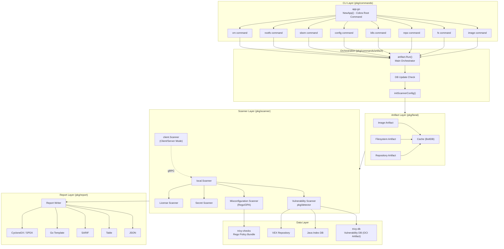
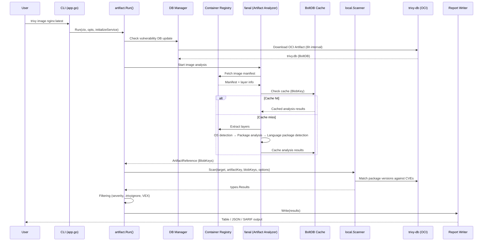
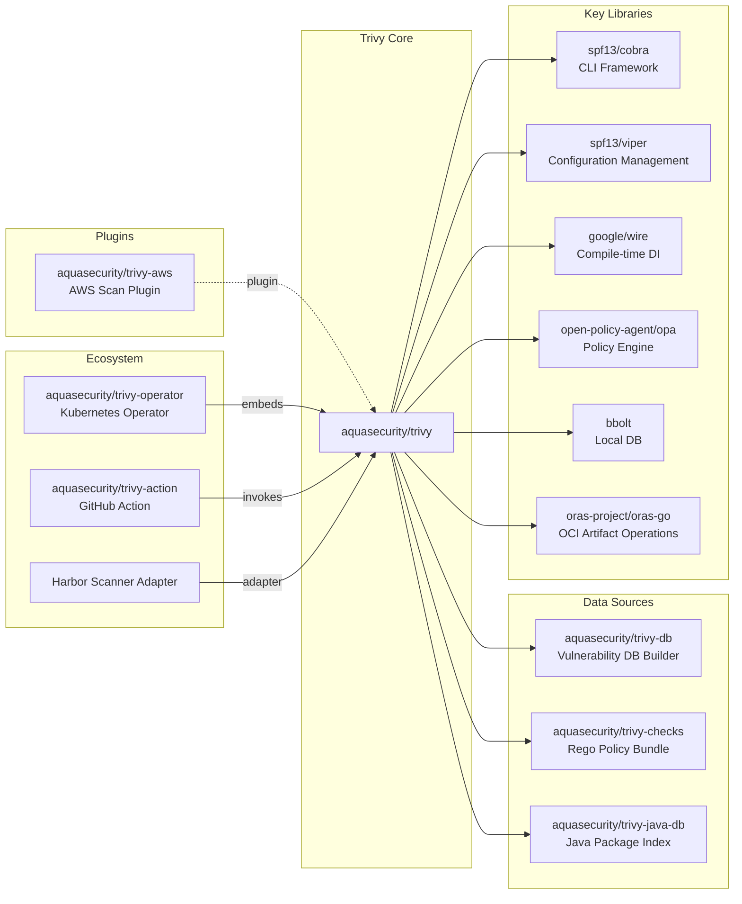

# Trivy

> A comprehensive security scanner for containers, Kubernetes, code repositories, and cloud environments

| Metadata | |
|---|---|
| Repository | https://github.com/aquasecurity/trivy |
| License | Apache-2.0 |
| Primary Language | Go |
| Category | Security |
| Analyzed Release | `v0.69.0` (2026-01-30) |
| Stars (approx.) | 31,000+ |
| Generated by | Claude Opus 4.6 (Anthropic) |
| Generated on | 2026-02-08 |

## Overview

Trivy is an open-source security scanner developed and maintained by Aqua Security. Its standout feature is the ability to run scans from a single binary with no dependencies on external databases or middleware.

Problems it solves:

- Unified detection of security risks scattered across container images, filesystems, Git repositories, VMs, Kubernetes clusters, and cloud environments (AWS, etc.)
- Consolidating vulnerability (CVE) detection, IaC misconfiguration, hardcoded secret detection, license violation checking, and SBOM generation into a single tool
- Easy integration into CI/CD pipelines (GitHub Actions, GitLab CI, Jenkins, etc.)

Positioning:

Adopted as Harbor's default scanner and also a Red Hat certified scanner. Widely used as the de facto standard in the DevSecOps toolchain.

## Architecture Overview

Trivy employs a modular pipeline architecture. The CLI serves as the entry point, and processing flows through a three-layer structure: artifact analysis based on target type, detection by multiple scanners, and output via report formatters.

## Core Components

### CLI Layer (`pkg/commands/app.go`)

- Responsibility: Command routing and flag management via the Cobra framework
- Key files: `pkg/commands/app.go`
- Design patterns: Command pattern, Flag Group pattern

`NewApp()` constructs the root command and registers subcommands such as `image`, `fs`, `repo`, `k8s`, `config`, `sbom`, `rootfs`, and `vm`. Each command is composed of flag group combinations implementing the `FlagGroup` interface, achieving type-safe configuration management.

Configuration values are resolved in priority order: CLI flags > environment variables > config file (`trivy.yaml`). YAML config file parsing via the Viper library is performed in the `PersistentPreRunE` hook.

### Orchestrator (`pkg/commands/artifact/run.go`)

- Responsibility: Control flow management for the entire scan pipeline
- Key files: `pkg/commands/artifact/run.go`
- Design patterns: Template Method pattern

`artifact.Run()` is the central function, controlling the following flow:

1. Database update check
2. Calling `InitializeScanService` based on the target type
3. Scanner configuration initialization (`initScannerConfig`)
4. Scan execution
5. Result filtering
6. Report output

Each scan command generates a `TargetKind` constant, which determines the entire subsequent workflow.

### Artifact Layer (`pkg/fanal`)

- Responsibility: Parsing and analyzing scan targets (container images, filesystems, etc.)
- Key files: `pkg/fanal/artifact/`, `pkg/fanal/analyzer/`, `pkg/fanal/types/`
- Design patterns: Strategy pattern, Analyzer pattern (plugin-style extension)

fanal (Trivy's internal artifact analysis library) handles container image layer extraction, OS/language package detection, and configuration file extraction. Each Analyzer is registered against specific file patterns and is invoked when matching files are found.

A BoltDB-based caching mechanism allows layer analysis to be skipped when re-scanning the same image.

### Scanner Layer (`pkg/scanner`)

- Responsibility: Actual security detection logic
- Key files: `pkg/scanner/`, `pkg/detector/`
- Design patterns: Driver interface, dependency injection via Wire

The `Scanner` struct holds a `Driver` interface and an `Artifact`. The `Driver` has two implementations: `local.Scanner` (standalone mode) and `client.Scanner` (client/server mode).

Wire (Google's DI tool) is used for assembling scan dependencies, with Wire Sets such as `StandaloneDockerSet` and `RemoteDockerSet` defined.

### Report Layer (`pkg/report`)

- Responsibility: Formatting and outputting scan results
- Key files: `pkg/report/writer.go`, `pkg/report/json.go`, `pkg/report/sarif.go`
- Design patterns: Strategy pattern (pluggable Writer)

Converts from the common `types.Report` struct to formats such as JSON, Table, SARIF, CycloneDX, SPDX, and Go Template. The `Writer` interface makes it easy to add new output formats.

## Data Flow

### Typical Container Image Scan Flow

## Key Design Decisions

### 1. Single Binary + Local DB Architecture

- Choice: Download the vulnerability database locally as an OCI Artifact and run all scans locally
- Rationale: Prioritizing use in CI/CD and air-gapped environments. By eliminating dependencies on external APIs, scans remain possible even during network failures
- Trade-offs: Latest CVEs may not be reflected due to DB update timing (default 24-hour interval). DB size growth (aggregated from 30+ sources)

### 2. Dependency Injection via Wire

- Choice: Using Google Wire for compile-time DI to resolve scan pipeline dependencies
- Rationale: The need to swap Scanner implementations between standalone and client/server modes. Wire Sets (`StandaloneDockerSet`, `RemoteDockerSet`, etc.) declaratively define the dependency graph per mode
- Trade-offs: Requires a Wire code generation step. Not suitable for dynamic plugin loading (supplemented by Wasm plugins)

### 3. Analyzer Plugin Architecture

- Choice: Implementing package detection for each language/OS as independent Analyzers, triggered by file pattern matching
- Rationale: With 60+ supported ecosystems (OS, language, IaC), individual Analyzers need to be independently developable and testable
- Trade-offs: Complex execution order control between Analyzers. Handling cases where some Analyzers depend on the results of others (Post-Analyzer)

### 4. Rego/OPA-based Misconfiguration Detection

- Choice: Writing security policies in Open Policy Agent (OPA)'s Rego language, distributed as the trivy-checks bundle
- Rationale: Allowing users to customize misconfiguration detection rules for IaC (Terraform, CloudFormation, Dockerfile, Kubernetes YAML, etc.). Also facilitates compliance with standards like CIS benchmarks
- Trade-offs: Learning curve for Rego. Version management complexity since the policy bundle update cycle is independent from the DB

### 5. DB Distribution via OCI Artifacts

- Choice: Distributing vulnerability DB, check bundles, and Java DB as OCI Artifacts via GHCR
- Rationale: Reuses container registry infrastructure and enables mirroring to private registries in air-gapped environments. Not retrievable via `docker pull` (not a container image), but fetchable via Trivy itself or the oras CLI
- Trade-offs: Requires understanding OCI Artifact mechanics. Potential impact from GitHub Rate Limits

## Dependencies

## Testing Strategy

Trivy employs a multi-layered testing strategy.

Unit tests: Each package has `_test.go` files with individual tests for Analyzers, Scanners, and Reporters. Test data is placed in `testdata/` directories using the golden file pattern.

Integration tests: End-to-end scan tests using actual container images and IaC files. Test images on Docker Hub and GHCR are used as targets.

Build system: Uses Mage (a Go-based build tool). Automates Wire code generation via `go generate`, Rego policy bundling, and cross-compilation.

CI/CD: Automated testing, release builds, and periodic DB updates (6-hour intervals) via GitHub Actions. Releases include signature verification via sigstore.

## Key Takeaways

1. Modular pipeline design: Designing scan targets (Target) and scan types (Scanner) as orthogonal axes avoids combinatorial explosion while maintaining extensibility. Adding new Targets or Scanners has minimal impact on existing code

2. Leveraging OCI Artifacts: The idea of using container registries as a general-purpose artifact distribution platform. Not using a package manager for DB distribution unifies infrastructure and simplifies operations

3. Declarative DI via Wire: While Go has few runtime reflection-based DI frameworks, Wire's compile-time DI enables mode-specific dependency graph switching while maintaining type safety

4. Analyzer pattern: The mechanism of triggering Analyzers via file pattern matching is a design pattern broadly applicable to tools requiring support for many ecosystems

5. Externalizing the policy engine: Externalizing policies via Rego/OPA allows adding and customizing rules without code changes — applicable not only to security tools but to configuration validation in general

6. Caching strategy: Per-layer caching for container images efficiently handles scanning many images sharing the same base image. The BlobKey-based cache design is applicable to other artifact processing scenarios

## References

- [Trivy Official Documentation](https://aquasecurity.github.io/trivy/)
- [The Architecture of Open Source Applications (AOSA)](https://aosabook.org/) — Prior art in OSS architecture documentation
- [DeepWiki - aquasecurity/trivy](https://deepwiki.com/aquasecurity/trivy) — AI-generated architecture documentation
- [trivy-aws ARCHITECTURE.md](https://github.com/aquasecurity/trivy-aws/blob/main/ARCHITECTURE.md) — Official architecture document
- [Trivy Releases](https://github.com/aquasecurity/trivy/releases) — Release notes and changelog
