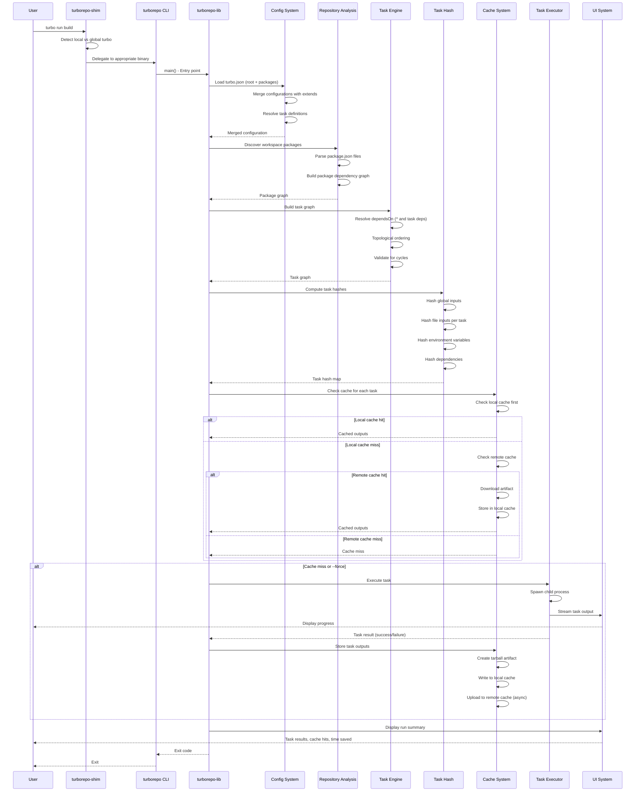
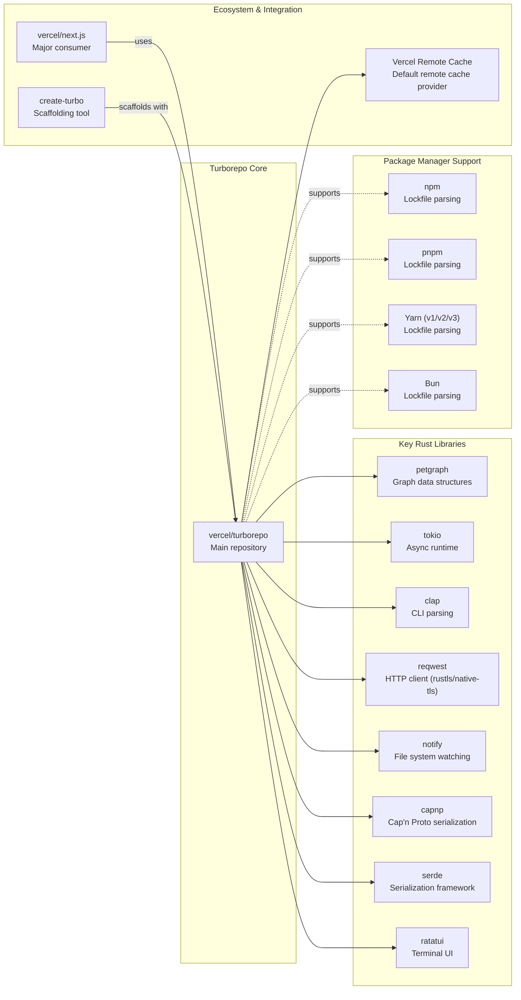

# Turborepo

> High-performance build system for JavaScript and TypeScript codebases, written in Rust

| Metadata | |
|---|---|
| Repository | https://github.com/vercel/turborepo |
| License | MIT License |
| Primary Language | Rust |
| Analyzed Release | `v2.8.3-canary.11` (2026-02-07) |
| Stars (approx.) | 29,757 |
| Generated by | Claude Sonnet 4.5 (Anthropic) |
| Generated on | 2026-02-08 |

## Overview

Turborepo is a high-performance build system for JavaScript and TypeScript monorepos, engineered in Rust for maximum performance. Originally developed in Go, Turborepo underwent a major rewrite to Rust in late 2023 to leverage Rust's superior performance for CPU-intensive operations like hashing and graph traversal. Maintained by Vercel, it has become a leading choice for monorepo tooling in the JavaScript ecosystem.

Problems it solves:

- Slow build times in large monorepos with hundreds or thousands of tasks across multiple packages
- Redundant task execution when the same work has already been completed (locally or on CI)
- Inefficient resource utilization during task execution in complex dependency graphs
- Difficulty in sharing build artifacts across development teams and CI environments

Positioning:

Turborepo is positioned as a performance-focused alternative to other monorepo tools like Nx and Lerna. While Nx provides a broader ecosystem with plugins and generators, Turborepo prioritizes simplicity and raw performance. It is the default choice for many Vercel-hosted projects and is widely adopted by major open-source projects including Next.js, tldraw, Tailwind CSS, and the Vercel CLI. The combination of remote caching, incremental builds, and parallel task execution makes it particularly suitable for teams prioritizing CI/CD speed.

## Architecture Overview

Turborepo follows a modular crate-based architecture characteristic of Rust projects. The system is organized into 50+ specialized crates, each handling a specific concern such as task graph construction, cache management, file watching, or hash computation. The CLI orchestrates these components through the central `turborepo-lib` crate, which coordinates task execution based on configuration files and dependency graphs.

```mermaid
graph TB
    subgraph CLI["CLI Layer"]
        Shim["turborepo-shim<br/>Entry point / version selection"]
        Main["turborepo binary<br/>Main entry point"]
        Lib["turborepo-lib<br/>Core CLI logic & command dispatch"]
    end

    subgraph Config["Configuration Layer"]
        TurboJson["turborepo-turbo-json<br/>turbo.json parsing"]
        Config["turborepo-config<br/>Configuration merging"]
        Scope["turborepo-scope<br/>Package filtering"]
    end

    subgraph Repository["Repository Analysis"]
        Repo["turborepo-repository<br/>Package graph construction"]
        Lockfiles["turborepo-lockfiles<br/>Dependency analysis (npm, pnpm, yarn)"]
        SCM["turborepo-scm<br/>Git integration"]
        Frameworks["turborepo-frameworks<br/>Framework detection"]
    end

    subgraph Engine["Task Execution Engine"]
        EngineBuilder["turborepo-engine<br/>Task graph builder"]
        TaskHash["turborepo-task-hash<br/>Task input hashing"]
        Executor["turborepo-task-executor<br/>Task execution"]
        RunCache["turborepo-run-cache<br/>Cache coordination"]
    end

    subgraph Cache["Caching System"]
        CacheCore["turborepo-cache<br/>Local & remote cache"]
        Hash["turborepo-hash<br/>xxHash64 + Cap'n Proto"]
        API["turborepo-api-client<br/>Vercel API client"]
    end

    subgraph Watch["File Watching"]
        Daemon["turborepo-daemon<br/>gRPC server"]
        FileWatch["turborepo-filewatch<br/>File system events"]
    end

    subgraph UI["User Interface"]
        UICore["turborepo-ui<br/>Terminal output"]
        VT100["turborepo-vt100<br/>Terminal emulation"]
    end

    Shim --> Main
    Main --> Lib
    Lib --> Config
    Lib --> Repository
    Lib --> Engine
    Lib --> Watch
    Lib --> UI

    Config --> TurboJson
    Config --> Scope

    Repository --> Lockfiles
    Repository --> SCM
    Repository --> Frameworks

    Engine --> EngineBuilder
    Engine --> TaskHash
    Engine --> Executor
    Engine --> RunCache

    RunCache --> Cache
    TaskHash --> Hash

    Cache --> CacheCore
    Cache --> API

    Watch --> Daemon
    Watch --> FileWatch
```

## Core Components

### CLI & Shim Layer (`crates/turborepo`, `crates/turborepo-shim`)

- Responsibility: Entry point, version selection, and command routing
- Key files: `crates/turborepo/src/main.rs`, `crates/turborepo-shim/src/lib.rs`
- Design patterns: Shim pattern for binary delegation, Command pattern via clap

The turborepo-shim serves as the initial entry point, implementing a version selection mechanism that delegates to the appropriate turbo binary (global vs local). This enables seamless integration in repositories with both global and local turbo installations. The main binary delegates immediately to turborepo-lib for all actual functionality, with only panic handling and exit code management at the binary level.

### Core Library (`crates/turborepo-lib`)

- Responsibility: Central orchestration hub containing all CLI logic, command parsing, and task execution coordination
- Key files: `crates/turborepo-lib/src/lib.rs`, `crates/turborepo-lib/src/commands/run.rs`, `crates/turborepo-lib/src/task_graph/`
- Design patterns: Builder pattern (RunBuilder), Visitor pattern (task graph traversal), Command pattern

turborepo-lib is the heart of Turborepo, tying together all other crates. It handles command-line argument parsing via clap, configuration resolution, and orchestrates the entire `turbo run` workflow. The RunBuilder constructs the execution context asynchronously, starting analytics, building the task graph, initializing the UI, and executing tasks with signal handling support.

### Configuration System (`crates/turborepo-turbo-json`, `crates/turborepo-config`)

- Responsibility: Loading, parsing, and merging turbo.json configuration from multiple sources
- Key files: `crates/turborepo-lib/src/turbo_json/loader.rs`, `crates/turborepo-lib/src/turbo_json/ARCHITECTURE.md`, `crates/turborepo-config/src/lib.rs`
- Design patterns: Builder pattern, Strategy pattern (schema differentiation)

The configuration system follows a multi-phase pipeline: (1) Configuration Resolution from CLI args, environment variables, and config files; (2) TurboJson Loading with schema differentiation between root and package turbo.json files; (3) Processed Task Definition with DSL token parsing ($TURBO_ROOT$, ! negation); (4) Task Definition Resolution with validation and inheritance. The system supports extending configurations via the extends field, allowing package-level turbo.json files to inherit from the root and other packages.

### Repository Analysis (`crates/turborepo-repository`)

- Responsibility: Discovering packages, constructing the package graph, and analyzing workspace structure
- Key files: `crates/turborepo-repository/src/discovery.rs`, `crates/turborepo-repository/src/package_graph/`, `crates/turborepo-repository/src/package_json.rs`
- Design patterns: Graph data structure (petgraph), Visitor pattern

The repository analysis layer discovers all workspace packages by reading package manager workspace configuration (pnpm-workspace.yaml, package.json workspaces, lerna.json). It constructs a directed graph representing package dependencies using the petgraph library, which is later used for topological task ordering. The discovery process integrates with the lockfile analysis to resolve external dependencies.

### Lockfile Analysis (`crates/turborepo-lockfiles`)

- Responsibility: Parsing and analyzing package manager lockfiles to detect external dependency changes
- Key files: `crates/turborepo-lockfiles/src/lib.rs`
- Design patterns: Strategy pattern (per-package-manager parsers)

Turborepo supports npm, pnpm, yarn (v1, v2, v3), and bun lockfiles, each with dedicated parsers. The lockfile analysis enables Turborepo to compute external dependency hashes, which are factored into task hashing. This ensures that tasks are re-executed when external dependencies change, even if source files remain unchanged.

### Task Graph Engine (`crates/turborepo-engine`)

- Responsibility: Constructing the task execution graph with topological dependencies and task relationships
- Key files: `crates/turborepo-engine/src/lib.rs`, `crates/turborepo-engine/src/builder.rs`, `crates/turborepo-engine/src/execute.rs`
- Design patterns: Builder pattern (EngineBuilder), Graph data structure (petgraph), Visitor pattern

The EngineBuilder transforms task definitions and package dependencies into an executable task graph. It handles task inheritance, resolves dependsOn relationships (both package-level ^ and task-level dependencies), and validates the graph for cycles. The execute module implements parallel task execution with respect to dependencies, supporting both topological and arbitrary task ordering.

### Task Hashing (`crates/turborepo-task-hash`, `crates/turborepo-hash`)

- Responsibility: Computing deterministic task hashes based on inputs, outputs, environment variables, and dependencies
- Key files: `crates/turborepo-hash/src/lib.rs`, `crates/turborepo-task-hash/src/lib.rs`
- Design patterns: Cap'n Proto for serialization, xxHash64 for hashing

Task hashing is the foundation of Turborepo's caching mechanism. Each task hash is computed from: (1) global hash (global environment, global dependencies, global file changes), (2) package directory and task name, (3) hash of input files, (4) external dependencies hash from lockfiles, (5) environment variables and passthrough environment, (6) task outputs configuration, (7) passthrough arguments, (8) hashes of dependent tasks. The use of Cap'n Proto ensures deterministic serialization across platforms, while xxHash64 provides fast hashing.

### Caching System (`crates/turborepo-cache`, `crates/turborepo-run-cache`)

- Responsibility: Local and remote cache management, artifact storage and retrieval
- Key files: `crates/turborepo-cache/src/lib.rs`, `crates/turborepo-cache/src/fs.rs`, `crates/turborepo-cache/src/http.rs`, `crates/turborepo-run-cache/src/lib.rs`
- Design patterns: Multiplexer pattern (local + remote cache), Async worker pool

The cache system operates in two layers: local filesystem cache and remote HTTP cache (Vercel Remote Cache or custom implementations). The multiplexer coordinates reads and writes across both layers, preferring local cache for reads and performing remote writes asynchronously. Cache artifacts are stored as gzipped tarballs containing task outputs and metadata. The signature_authentication module supports signing artifacts with private keys for integrity verification.

### Daemon & File Watching (`crates/turborepo-daemon`, `crates/turborepo-filewatch`)

- Responsibility: Background process that watches files and pre-computes data to accelerate turbo execution
- Key files: `crates/turborepo-daemon/src/lib.rs`, `crates/turborepo-daemon/src/server.rs`, `crates/turborepo-filewatch/src/lib.rs`
- Design patterns: gRPC server/client, Observer pattern (file system watching)

The daemon is a gRPC server that runs one instance per repository. It watches the file system for changes, maintains hash state, and responds to queries from turbo CLI invocations. The FileWatching struct coordinates the FileSystemWatcher with consumers like GlobWatcher and PackageWatcher. Cookie files are used to ensure proper event synchronization and avoid stale file system events during queries.

### Task Execution (`crates/turborepo-task-executor`)

- Responsibility: Executing individual tasks in isolated environments with proper output handling
- Key files: `crates/turborepo-task-executor/src/lib.rs`
- Design patterns: Process management, Stream multiplexing

The task executor spawns child processes for each task, capturing stdout/stderr and managing process lifecycle. It integrates with the UI layer to display task output in real-time, supports both persistent (long-running) and ephemeral tasks, and handles task interruptibility for watch mode.

### User Interface (`crates/turborepo-ui`, `crates/turborepo-vt100`)

- Responsibility: Terminal output rendering, including Table UI and Terminal UI (TUI)
- Key files: `crates/turborepo-ui/src/lib.rs`, `crates/turborepo-vt100/src/lib.rs`
- Design patterns: Terminal emulation, Event-driven UI

Turborepo supports multiple UI modes: table (default), tui (interactive terminal UI), and stream (raw output). The TUI mode uses ratatui for rendering an interactive dashboard showing task status, output, and progress. turborepo-vt100 provides terminal emulation capabilities to capture and replay task output in the TUI.

## Data Flow

### Typical Task Execution Flow (turbo run build)



## Key Design Decisions

### 1. Rust Rewrite from Go

- Choice: Migrating the entire codebase from Go to Rust in late 2023
- Rationale: Extract maximum performance for CPU-intensive operations like hashing, graph traversal, and file system operations. Rust's zero-cost abstractions and native performance enable sub-second cache hits and lightweight startup times that were difficult to achieve in Go
- Trade-offs: Increased development complexity and learning curve for contributors. Rust's stricter type system and ownership model require more upfront design but result in fewer runtime errors. The rewrite required significant engineering investment but positioned Turborepo for long-term performance leadership

### 2. Cap'n Proto + xxHash64 for Task Hashing

- Choice: Using Cap'n Proto for deterministic serialization followed by xxHash64 for fast hashing
- Rationale: Task hashing must be deterministic across different platforms, languages, and tool versions. Cap'n Proto provides zero-copy serialization with guaranteed canonical representation, while xxHash64 offers excellent performance for non-cryptographic hashing. This combination ensures consistent cache keys while maintaining high performance
- Trade-offs: Cap'n Proto adds a dependency and requires schema definitions, but eliminates entire classes of bugs related to serialization order. xxHash64 is not cryptographically secure, but security is not required for cache keys (only determinism and performance)

### 3. Multiplexed Local + Remote Cache

- Choice: Implementing a cache multiplexer that coordinates local filesystem cache and remote HTTP cache
- Rationale: Local cache provides instant cache hits for repeated builds on the same machine, while remote cache enables sharing artifacts across team members and CI environments. The multiplexer prefers local cache for reads (lowest latency) and performs remote writes asynchronously (non-blocking)
- Trade-offs: Complexity in managing two cache layers and ensuring consistency. Requires handling network failures gracefully and implementing retry logic. The async remote write pattern means cache uploads continue in the background, which can complicate error handling

### 4. Daemon-Based File Watching

- Choice: Running a background daemon process per repository that watches files and pre-computes data
- Rationale: File watching and hash computation are expensive operations that can be amortized across multiple turbo invocations. The daemon maintains state between runs, enabling instant cache lookups and incremental graph construction. The gRPC interface allows the CLI to query pre-computed data without repeating analysis
- Trade-offs: Daemon management complexity (starting, stopping, health checks, zombie processes). Requires synchronization mechanisms (cookie files) to ensure event consistency. Users must occasionally restart the daemon to pick up certain configuration changes

### 5. Modular Crate Architecture (50+ Crates)

- Choice: Organizing the codebase into 50+ specialized crates, each with a single responsibility
- Rationale: Rust's crate system enables strong modularity boundaries with explicit dependencies. This facilitates parallel compilation, reduces coupling, and allows selective testing. Crates like turborepo-hash, turborepo-lockfiles, and turborepo-repository can be consumed independently
- Trade-offs: Navigation complexity for newcomers due to the large number of crates. Requires discipline to maintain clean dependency graphs and avoid circular dependencies. Cargo workspace overhead for managing version bumps across many crates

### 6. Configuration Inheritance with Extends

- Choice: Supporting package-level turbo.json files that can extend from the root and other packages via the extends field
- Rationale: Large monorepos often have common task configurations that should be shared across packages. The extends mechanism enables DRY configuration while allowing package-specific overrides. This reduces duplication and makes it easier to apply organization-wide policy changes
- Trade-offs: Complexity in configuration resolution, particularly when multiple extends layers are involved. Requires careful ordering to ensure predictable inheritance semantics. The distinction between root and package schema adds cognitive overhead

## Dependencies



## Testing Strategy

Turborepo employs a comprehensive multi-layered testing strategy.

Unit tests: Each crate contains extensive unit tests in `_test.rs` files or tests/ directories. The modular crate structure enables targeted testing of individual components. Unit tests focus on specific functionality like hash computation, configuration parsing, and graph algorithms. The codebase uses the standard Rust testing framework with cargo test.

Integration tests: Integration tests are located in the turborepo-tests-integration package and are written using snapshot testing via the insta crate. These tests execute the turbo CLI against real monorepo structures and verify outputs using golden files. The `pnpm test:interactive` command allows updating snapshots when behavior intentionally changes.

Build system: The repository uses pnpm workspaces for JavaScript packages and Cargo workspace for Rust crates. Turborepo itself is used to orchestrate builds (via turbo.json), demonstrating self-hosting. The Makefile provides additional build targets for cross-compilation and release builds.

CI/CD: GitHub Actions workflows handle automated testing, release builds, and publishing. Separate workflows exist for Rust tests (cargo test), integration tests (pnpm test), and cross-platform builds (Linux, macOS, Windows). Releases are automated and include signing for security verification.

## Key Takeaways

1. Rust for Performance-Critical Infrastructure: Turborepo demonstrates that rewriting performance-critical tools in Rust can yield significant performance improvements. The migration from Go to Rust enabled sub-second cache hits and faster graph traversal, validating Rust's position in the build tooling ecosystem. This is applicable to any infrastructure tool where raw performance directly impacts developer productivity.

2. Deterministic Hashing is Foundational: The combination of Cap'n Proto for deterministic serialization and xxHash64 for fast hashing exemplifies the importance of correct cache key computation. A build tool's reliability hinges on deterministic hashing—any non-determinism leads to cache misses or incorrect cache hits. The architectural decision to invest in a robust hashing layer pays dividends across the entire system.

3. Multiplexed Caching Maximizes Performance: The local + remote cache multiplexer pattern optimizes for both individual developer experience (instant local cache hits) and team collaboration (shared remote cache). The async remote write pattern ensures local performance is not degraded by network latency. This pattern is broadly applicable to any system requiring multi-tier caching.

4. Daemon Architecture for Incremental Performance: Running a background daemon that watches files and maintains state between CLI invocations enables near-instant subsequent runs. This architecture trades increased complexity for significantly better UX in iterative workflows. The pattern is applicable to any CLI tool that is invoked repeatedly in a development workflow (linters, formatters, type checkers).

5. Modular Crate Design Scales: Organizing a large Rust project into 50+ crates with clear boundaries demonstrates effective large-scale Rust architecture. While navigation complexity increases, the benefits—parallel compilation, selective testing, reduced coupling, and independent crate consumption—justify the overhead. This approach is recommended for any Rust project expected to grow beyond 100k lines of code.

6. Configuration Inheritance Reduces Duplication: The extends mechanism in turbo.json enables DRY configuration in large monorepos, reducing the maintenance burden of managing hundreds of task definitions. The distinction between root and package schemas, while adding complexity, provides necessary flexibility. This design pattern is applicable to any configuration system in a multi-package repository.

## References

- [Turborepo Official Documentation](https://turborepo.dev)
- [Turborepo GitHub Repository](https://github.com/vercel/turborepo)
- [Turborepo Architecture: Configuration and Task Definition Loading](https://github.com/vercel/turborepo/blob/main/crates/turborepo-lib/src/turbo_json/ARCHITECTURE.md)
- [Turborepo Contributing Guide](https://github.com/vercel/turborepo/blob/main/CONTRIBUTING.md)
- [DeepWiki - vercel/turborepo](https://deepwiki.com/vercel/turborepo)
- [Why Turborepo Is Winning the JavaScript Build Race](https://www.gocodeo.com/post/why-turborepo-is-winning-the-javascript-build-race)
- [Turborepo, Nx, and Lerna: The Truth about Monorepo Tooling in 2026](https://dev.to/dataformathub/turborepo-nx-and-lerna-the-truth-about-monorepo-tooling-in-2026-71)
- [Optimizing CI/CD for Full-Stack Projects: Leveraging Turborepo's Remote Caching](https://leapcell.io/blog/optimizing-ci-cd-for-full-stack-projects-leveraging-turborepo-s-remote-caching-and-on-demand-builds)
