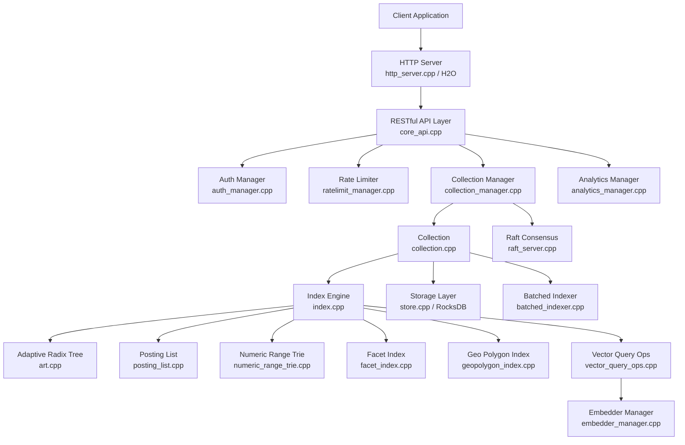
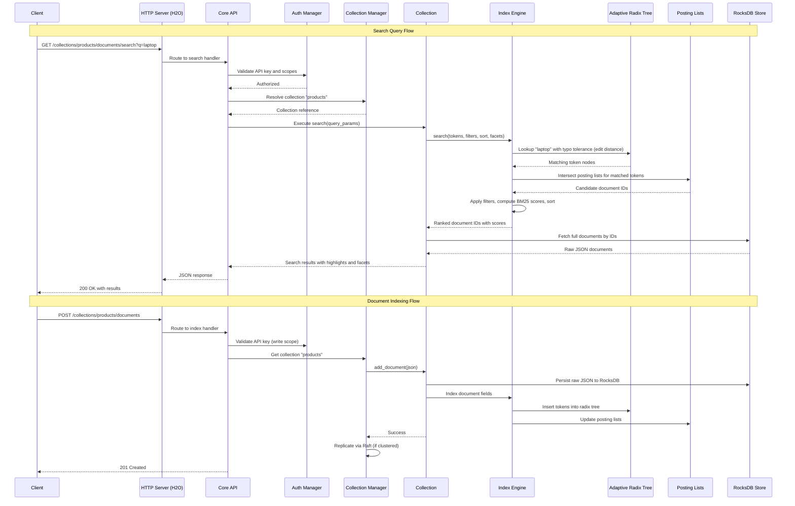
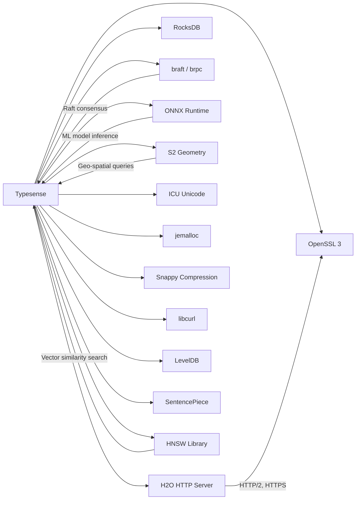

# Typesense

> Open-source, typo-tolerant, in-memory search engine optimized for instant search experiences with a simple RESTful API

| Metadata | |
|---|---|
| Repository | https://github.com/typesense/typesense |
| License | GNU General Public License v3.0 |
| Primary Language | C++ |
| Category | Search Engine |
| Analyzed Release | `v30.1` (2026-01-29) |
| Stars (approx.) | 25,000+ |
| Generated by | Claude Opus 4.6 (Anthropic) |
| Generated on | 2026-02-09 |

---

## Overview

### Problem Domain

Building search functionality into applications traditionally requires either expensive managed services like Algolia or complex self-hosted solutions like Elasticsearch. Developers need a search engine that delivers sub-50ms response times, handles typos gracefully, and is simple to operate without extensive DevOps expertise.

### Project Positioning

Typesense positions itself as an open-source alternative to Algolia and Pinecone, and an easier-to-use alternative to Elasticsearch. It is a single-binary, in-memory search engine written in C++ that prioritizes developer experience and instant search performance. The engine stores all indexed fields in RAM for fast lookups while persisting raw documents to disk via RocksDB for durability. It supports features like typo tolerance, faceting, geo-search, vector search, semantic search via embeddings, and Raft-based clustering for high availability.

---

## Architecture Overview

---

## Core Components

### 1. Collection Manager (collection_manager.cpp)

Responsibility: Orchestrates the lifecycle of search collections, including creation, deletion, schema management, and cluster-wide coordination via Raft consensus.

Key files:
- `src/collection_manager.cpp` / `include/collection_manager.h`
- `src/collection.cpp` / `include/collection.h`
- `src/field.cpp` / `include/field.h`

Design patterns:
- Singleton pattern for global collection registry
- Factory pattern for creating Collection instances based on schema definitions
- Observer pattern for propagating schema changes across Raft cluster nodes

The Collection Manager maintains a thread-safe mapping of collection names to Collection objects. Each Collection encapsulates its schema definition, field configurations, and associated Index instance. When a collection is created or modified, the manager serializes the operation through the Raft log to ensure consistency across cluster replicas.

### 2. Index Engine (index.cpp)

Responsibility: Core search and indexing logic including document insertion, deletion, and multi-field query execution with ranking, filtering, faceting, and typo tolerance.

Key files:
- `src/index.cpp` / `include/index.h`
- `src/art.cpp` / `include/art.h`
- `src/posting_list.cpp` / `include/posting_list.h`
- `src/filter_result_iterator.cpp` / `include/filter_result_iterator.h`
- `src/match_score.h`

Design patterns:
- Inverted index architecture with Adaptive Radix Tree (ART) for term lookups
- Iterator pattern for filter result traversal
- Strategy pattern for different scoring algorithms

The Index Engine is the heart of Typesense. It maintains an inverted index backed by an Adaptive Radix Tree (ART) data structure, which provides memory-efficient prefix-based lookups. Each indexed string field maps tokens to posting lists containing document IDs and positional information. Numeric fields use a numeric range trie for efficient range queries. The search path involves tokenization, ART traversal with optional fuzzy matching (edit distance), posting list intersection, and BM25-based scoring with custom ranking signals.

### 3. Storage Layer (store.cpp / RocksDB)

Responsibility: Durable persistence of raw JSON documents and metadata, crash recovery, and write-ahead logging.

Key files:
- `src/store.cpp` / `include/store.h`
- RocksDB integration (external dependency)

Design patterns:
- Repository pattern abstracting RocksDB key-value operations
- Write-ahead log (WAL) for crash recovery
- Separation of hot (in-memory index) and cold (on-disk documents) data

Typesense stores all raw JSON documents in RocksDB on disk while keeping indexed fields entirely in RAM. This dual-layer approach allows the system to recover its in-memory index from the persistent store on restart. The store also handles sequential document ID generation and metadata persistence for collection schemas.

### 4. Raft Consensus Layer (raft_server.cpp)

Responsibility: Distributed consensus for write operations, leader election, log replication, and cluster membership management.

Key files:
- `src/raft_server.cpp` / `include/raft_server.h`
- External dependencies: braft, brpc libraries

Design patterns:
- State machine replication via Raft protocol
- Leader-follower replication model
- Snapshot-based recovery for new or lagging nodes

The Raft layer ensures that all write operations (document inserts, updates, deletes, collection creation) are consistently replicated across cluster nodes. The system uses a single-master architecture where the Raft leader accepts writes and replicates them to followers. Read operations can be served by any node in the cluster, enabling horizontal read scaling.

### 5. HTTP Server and API Layer (http_server.cpp, core_api.cpp)

Responsibility: HTTP/HTTPS request handling, route dispatching, request parsing, response formatting, and connection management.

Key files:
- `src/http_server.cpp` / `include/http_server.h`
- `src/core_api.cpp` / `include/core_api.h`
- `src/core_api_utils.cpp` / `include/core_api_utils.h`

Design patterns:
- Router pattern for URL-to-handler mapping
- Middleware chain for authentication, rate limiting, and request validation
- Asynchronous I/O via the H2O HTTP server library

The API layer is built on top of the H2O HTTP server, which provides high-performance HTTP/1.1 and HTTP/2 support. The core_api module defines RESTful endpoints for collection management, document CRUD, search queries, analytics, and cluster operations. Each endpoint handler validates input, delegates to the appropriate manager, and returns JSON responses.

---

## Data Flow

---

## Key Design Decisions

### 1. In-Memory Indexing with Disk-Backed Persistence

Choice: Keep all indexed fields in RAM while storing raw documents on disk via RocksDB.

Rationale: Search latency is dominated by index lookup time. By keeping the inverted index entirely in memory, Typesense achieves sub-50ms p99 latencies. RocksDB provides durable storage with efficient write-ahead logging for crash recovery without impacting search performance.

Trade-offs: Memory usage scales linearly with indexed data size. Large datasets require proportionally large RAM allocations. The system is not suitable for datasets that exceed available memory, though only indexed fields (not raw documents) consume RAM.

### 2. Adaptive Radix Tree (ART) for Inverted Index

Choice: Use ART as the primary data structure for the token-to-posting-list mapping instead of hash maps or B-trees.

Rationale: ART provides O(k) lookup time (where k is key length) with excellent cache locality and memory efficiency through adaptive node sizes (4, 16, 48, 256 children). It naturally supports prefix queries and fuzzy matching by traversing the tree with allowed edit distances, which is essential for typo-tolerant search.

Trade-offs: More complex implementation compared to hash maps. Write performance is slightly lower than hash-based structures, but this trade-off is acceptable since Typesense optimizes for read-heavy workloads.

### 3. Raft-Based Clustering Instead of Masterless Replication

Choice: Single-master Raft consensus for write operations with read replicas.

Rationale: Raft provides strong consistency guarantees for write operations and simplifies conflict resolution compared to masterless systems. The single-master model avoids write conflicts entirely and makes reasoning about system state straightforward.

Trade-offs: Write throughput is bounded by a single leader node. Failover requires leader election (typically seconds). Not suitable for write-intensive workloads requiring horizontal write scaling.

### 4. Single Binary Deployment

Choice: Ship Typesense as a single self-contained binary with no external runtime dependencies.

Rationale: Dramatically simplifies deployment and operations. Users can get a production search engine running with a single command, which aligns with the project goal of being easier to use than Elasticsearch.

Trade-offs: Binary size is larger due to static linking. Updating individual components (like RocksDB) requires a full release cycle.

---

## Dependencies

---

## Testing Strategy

Typesense employs a multi-layered testing approach:

- Unit and Integration Tests: C++ test files in the `test/` directory cover individual components like the index engine, collection operations, filter parsing, and tokenization. Tests use Google Test framework conventions.

- API Tests: A comprehensive API test suite resides in `api_tests/` using TypeScript with Bun runtime. Tests in files like `collections.test.ts`, `documents.test.ts`, `embedding.test.ts`, and `analytics.test.ts` validate end-to-end API behavior including search accuracy, faceting, curation, and synonym handling.

- Benchmark Tests: The `benchmark/` directory contains performance benchmarks, and GitHub Actions workflows (`benchmark-testing.yml`) run automated benchmark suites on pull requests.

- CI Pipeline: GitHub Actions (`tests.yml`) runs the full test suite on every push and pull request, ensuring regressions are caught early.

---

## Key Takeaways

1. Memory-first architecture delivers exceptional search latency: By keeping the inverted index entirely in RAM with an Adaptive Radix Tree, Typesense achieves consistent sub-50ms response times. This design choice makes it particularly well-suited for user-facing instant search applications where latency directly impacts user experience.

2. Simplicity as a feature reduces operational burden: The single-binary deployment model, RESTful API design, and Raft-based clustering simplify operations compared to JVM-based alternatives. This architectural philosophy trades some flexibility for dramatically lower operational complexity.

3. Hybrid storage separates performance-critical and durable data: The split between in-memory indexes (ART, posting lists, numeric tries) and disk-backed document storage (RocksDB) is a practical compromise that maximizes search speed while ensuring data durability and recovery capability.

4. Vector search integration extends beyond keyword matching: The addition of ONNX Runtime for ML model inference and HNSW for vector similarity search demonstrates how the architecture has evolved to support semantic and hybrid search use cases alongside traditional keyword search.

---

## References

- Typesense GitHub Repository: https://github.com/typesense/typesense
- Typesense Design Document: https://github.com/typesense/typesense/blob/main/DESIGN.md
- Typesense Documentation: https://typesense.org/docs/guide/building-a-search-application.html
- DeepWiki Analysis: https://deepwiki.com/typesense/typesense
- Adaptive Radix Tree Paper: V. Leis et al., "The Adaptive Radix Tree: ARTful Indexing for Main-Memory Databases"
