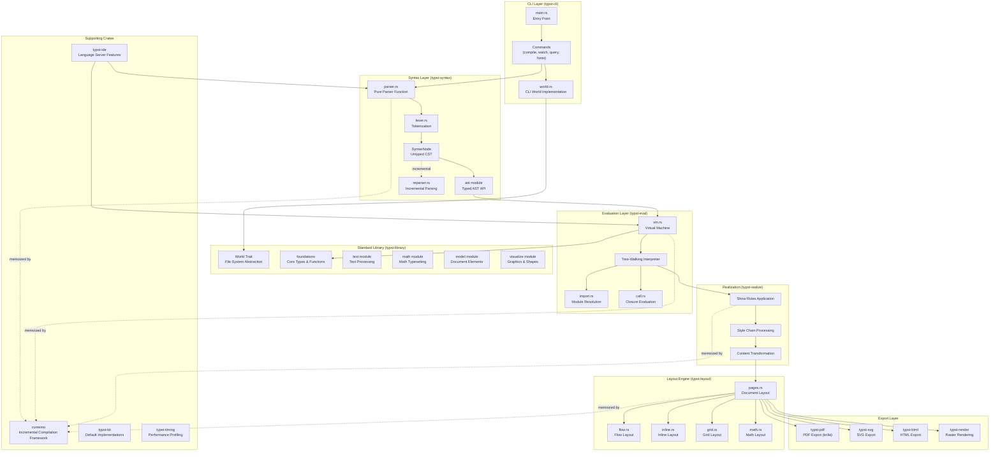
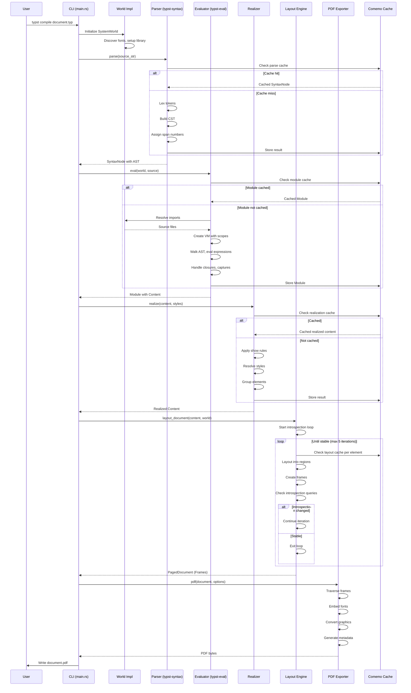
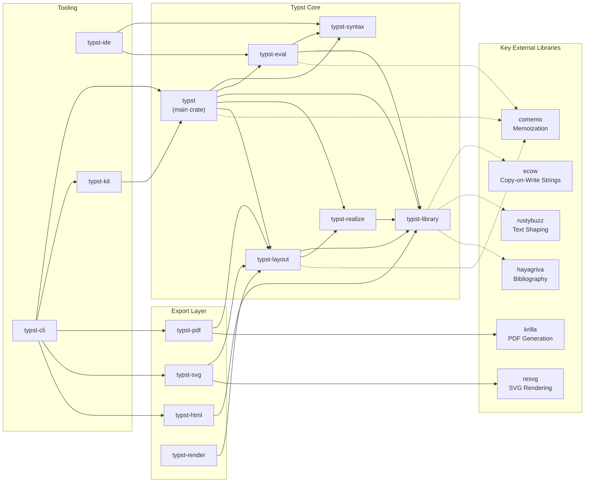

# Typst

> A markup-based typesetting system that is powerful and easy to learn

| Metadata | |
|---|---|
| Repository | https://github.com/typst/typst |
| License | Apache-2.0 |
| Primary Language | Rust |
| Analyzed Release | `v0.14.2` (December 12, 2025) |
| Stars (approx.) | 51,000+ |
| Generated by | Claude Sonnet 4.5 (Anthropic) |
| Generated on | 2026-02-08 |

## Overview

Typst is a modern markup-based typesetting system designed as a powerful alternative to LaTeX, offering fast compile times through incremental compilation, a tightly integrated scripting system, and friendly error messages. The project is built entirely in Rust with a modular crate architecture, leveraging the comemo framework for incremental compilation and memoization.

Problems it solves:

- LaTeX's steep learning curve and cryptic error messages make document creation unnecessarily difficult for most users
- Traditional typesetting systems lack interactive, instant preview capabilities due to slow compilation times
- Existing tools do not provide seamless integration between markup, scripting, and typesetting in a single coherent system

Positioning:

Typst positions itself as the next-generation typesetting system that combines the power of LaTeX with modern language design principles. Backed by Posit (RStudio) and NLnet, it has gained significant traction in academic and technical writing communities, with over 51,000 GitHub stars and an active ecosystem of packages and templates on Typst Universe.

## Architecture Overview

Typst employs a four-phase compilation pipeline (Parsing → Evaluation → Layout → Export) orchestrated by a modular Rust workspace architecture. The compiler is designed with incrementality as a core principle, using the comemo memoization framework to cache and reuse computation results across all compilation stages.

## Core Components

### Syntax Layer (`crates/typst-syntax`)

- Responsibility: Pure parsing of Typst source code into an untyped concrete syntax tree (CST)
- Key files: `crates/typst-syntax/src/parser.rs`, `crates/typst-syntax/src/lexer.rs`, `crates/typst-syntax/src/reparser.rs`
- Design patterns: Untyped CST pattern, Incremental parsing, Typed AST facade

The syntax layer implements a pure function that transforms source strings into syntax trees without any external dependencies. Parsing never fails; syntactic errors produce error nodes in the tree. The untyped `SyntaxNode` structure allows easy span attachment and traversal for syntax highlighting and IDE features, while the `typst::syntax::ast` module provides a typed API resembling a traditional AST for use by the interpreter.

A critical innovation is the incremental reparser that can selectively reparse modified segments (markup blocks or code segments) while preserving span number stability. Span numbers are unique identifiers assigned to each node after parsing, used throughout the compiler to trace errors back to source locations. The incremental reparser reassigns span numbers locally around edits, keeping distant spans stable to maximize memoization cache hits.

The syntax layer supports three modes: Markup (text and formatting), Math (mathematical notation), and Code (expressions and statements). This tri-modal design enables seamless transitions between markup writing, mathematical typesetting, and programmatic content generation.

### Evaluation Layer (`crates/typst-eval`)

- Responsibility: Executing Typst code to produce content and module bindings
- Key files: `crates/typst-eval/src/vm.rs`, `crates/typst-eval/src/call.rs`, `crates/typst-eval/src/import.rs`
- Design patterns: Tree-walking interpreter, Closure capture, Memoized evaluation

The evaluation phase implements a tree-walking interpreter that recursively evaluates the AST through trait implementations of the form `fn eval(&self, vm: &mut Vm) -> Result<Value>`. The `Vm` struct maintains a scope stack and provides access to the engine, which encapsulates the world (file system abstraction), introspector, and routing information.

Closure handling is particularly elegant: when the interpreter encounters a function definition, it walks the closure body to identify all variable accesses that aren't defined within the closure. It then captures (clones) the values of these free variables and stores them alongside the closure's syntactical definition. When the closure is called, a fresh VM is created with a scope stack initialized from the captured variables.

Evaluation is memoized at two granularities: entire source file modules and individual closure calls. Typst enforces function purity, enabling memoization of closure call results based on syntax, captures, and parameters. Even if a module is reevaluated, previous calls to closures defined in that module can be reused if the closure definition and captures haven't changed.

The eval layer integrates with the World trait for dependency resolution, accessing imported sources, images, and data files through an abstract interface implemented differently in the CLI, web app, and other environments.

### Standard Library (`crates/typst-library`)

- Responsibility: Core type system, standard functions, and World trait abstraction
- Key files: `crates/typst-library/src/lib.rs` (World trait), `crates/typst-library/src/foundations/`, `crates/typst-library/src/layout/`
- Design patterns: Trait-based abstraction (World), Module system, Tagged elements

The typst-library crate defines all central type definitions and the complete standard library. The World trait serves as the primary abstraction boundary, providing methods for accessing the standard library, fonts, source files, binary files, and the current date. All World methods are tracked by comemo, enabling automatic invalidation when world state changes.

The library is organized into functional modules: foundations (core types like Content, Value, Module, Scope), text (font handling, shaping, line breaking), math (equation rendering), model (document elements like headings, lists, citations), layout (sizing, alignment, pages, regions), and visualize (graphics, colors, shapes).

A key architectural choice is the Element system: all document elements implement the NativeElement trait, which provides metadata and behavior. The Content type is an enum over all element types, enabling type-safe manipulation while maintaining flexibility. The Style system uses StyleChain for efficient style inheritance and resolution.

### Realization Subsystem (`crates/typst-realize`)

- Responsibility: Applying show rules and styles to transform content into layoutable elements
- Key files: `crates/typst-realize/src/lib.rs`
- Design patterns: Visitor pattern, Recursive transformation, Arena allocation

Realization is the critical intermediate phase between evaluation and layout. It recursively applies show rules to content, transforming user-defined elements into well-known, layoutable elements. Show rules may be defined as Typst closures, so realization can trigger closure evaluation, which produces more content that is recursively realized.

The process is shallow: when collecting list items into a list, the content within list items isn't realized immediately. This happens lazily during layout, enabling better performance and avoiding unnecessary work.

The realization system uses arena allocation (bumpalo crate) for temporary storage during the transformation process. Different realization modes exist for different output targets: LayoutDocument, LayoutFragment, LayoutPar (paragraph), HtmlDocument, HtmlFragment, and Math. Each mode applies different grouping rules to produce appropriate output.

Style chains are processed during realization, resolving inherited styles and applying set rules. The system handles space collapsing, paragraph breaking, list grouping, citation grouping, and other semantic transformations that prepare content for layout.

### Layout Engine (`crates/typst-layout`)

- Responsibility: Positioning content within regions to produce frames (pages)
- Key files: `crates/typst-layout/src/pages.rs`, `crates/typst-layout/src/flow.rs`, `crates/typst-layout/src/inline.rs`
- Design patterns: Region-based layout, Introspection loop, Frame composition

The layout phase takes realized Content and produces one Frame per page. Elements layout themselves into regions, which describe the available space. An element is free to occupy multiple regions (e.g., a paragraph might span multiple columns), returning one Frame per region occupied.

A critical feature is the introspection loop: layout may depend on its own results through features like page numbers in a table of contents, counters, or state queries. Typst resolves these cyclical dependencies by running layout in a loop until results stabilize. Most introspections converge after one or two iterations; the system gives up after five attempts to prevent infinite loops.

Layout is cached at element granularity, which is essential because layout is the most expensive compilation phase. The layout engine handles diverse layout modes: flow layout for documents, inline layout for text, grid layout for tables, and specialized math layout for equations.

Regions carry information about available space, expansion direction, and backlog (content that couldn't fit and needs to flow to the next region). The layout engine manages page breaks, column breaks, and other flow interruptions, producing a sequence of frames that represent the final document pages.

### PDF Export (`crates/typst-pdf`)

- Responsibility: Converting layouted frames into PDF documents
- Key files: `crates/typst-pdf/src/lib.rs`, `crates/typst-pdf/src/convert.rs`
- Design patterns: Visitor pattern for frame traversal, PDF standard compliance (krilla)

The PDF exporter uses the krilla library (developed specifically for Typst) to generate PDF files with support for multiple PDF standards (PDF/A, PDF/UA-1 for accessibility). The export process traverses frames, converting Typst's internal representation of text, shapes, images, and graphics into PDF operations.

The exporter handles font embedding, color space management, image compression, metadata generation, and document structure (outlines, destinations, tagged PDF for accessibility). The PdfOptions structure allows configuration of document identifiers, timestamps, page ranges, and PDF standard compliance.

A notable feature is tagged PDF support by default (when not producing PDF/UA-1), providing a baseline level of accessibility. The exporter generates a PDF document identifier by hashing either a provided stable identifier or the document's title and author.

### HTML Export (`crates/typst-html`)

- Responsibility: Converting Typst content into HTML documents
- Key files: `crates/typst-html/src/lib.rs`, `crates/typst-html/src/document.rs`, `crates/typst-html/src/fragment.rs`
- Design patterns: DOM construction, CSS generation, Content-based export (not Frame-based)

HTML export is architecturally different from PDF/SVG export: it starts with Content rather than Frames, since layout is the browser's responsibility. The exporter constructs a DOM representation and generates CSS for styling, allowing the browser to handle text flow, line breaking, and responsive design.

The HTML exporter provides the `html.elem()` function for manual control over HTML generation, enabling users to wrap content in custom tags with attributes. Typst automatically generates appropriate tags for most elements, but explicit control is available when needed.

The exporter supports both full document export (with html, head, body tags) and fragment export (for embedding in existing HTML). It handles CSS class generation, style attribute creation, and proper semantic HTML structure.

### IDE Support (`crates/typst-ide`)

- Responsibility: Language server features like autocompletion, hover, go-to-definition
- Key files: `crates/typst-ide/src/`
- Design patterns: LinkedNode abstraction, Tracer-based semantic analysis

The IDE crate provides functionality for integrating Typst into code editors through language server protocol implementations (like Tinymist). It builds on the syntax and evaluation modules but requires additional abstractions for IDE use cases.

The LinkedNode abstraction wraps SyntaxNode to provide access to parents and siblings, enabling easier traversal for IDE features. Basic functionality like syntax highlighting and folding relies purely on syntax analysis.

Advanced features like autocompletion and hover tooltips require semantic analysis. The IDE performs this by evaluating and realizing the full document equipped with a Tracer that emits values whenever specific positions are visited. From the emitted values, the system computes type information. Thanks to incremental compilation, traced analysis reuses large parts of normal compilation, only re-running module evaluation of the active file and relevant layout code.

## Data Flow

### Complete Document Compilation Flow

## Key Design Decisions

### 1. Incremental Compilation with Comemo

- Choice: Build all compilation phases on top of the comemo memoization framework
- Rationale: Instant preview requires compilation times under 50ms for typical edits, which is only achievable through aggressive memoization and cache reuse
- Trade-offs: Requires all functions to be pure and tracked, adds complexity to function signatures with Tracked/TrackedMut parameters, but enables watch mode performance that rivals or exceeds LSP responsiveness

The comemo framework automatically tracks function dependencies and invalidates memoized results when inputs change. This pervasive incrementality means that changing a single character in a document typically only requires reparsing one file, re-evaluating one module, re-realizing affected content, and re-laying-out changed elements. The majority of the compilation work is reused.

### 2. Untyped CST with Typed AST Facade

- Choice: Store syntax as an untyped concrete syntax tree, provide typed access through an ast module facade
- Rationale: Untyped trees simplify span attachment (every node has a span), enable easier traversal for IDE features (no visitor pattern needed), and handle error nodes naturally
- Trade-offs: Type safety is deferred to the AST facade layer rather than enforced at the tree structure level, but this enables better error recovery and IDE functionality

This design is inspired by rust-analyzer's red-green tree approach. The SyntaxKind enum distinguishes node types, while the ast module provides typed wrappers that check kinds and provide safe accessors. IDE code can traverse the raw tree directly, while interpreter code uses the typed AST.

### 3. World Trait Abstraction

- Choice: Abstract all I/O and environment access through the World trait, marked with `#[comemo::track]`
- Rationale: Enables deployment in diverse environments (CLI, web app, language servers) with different I/O models, while maintaining automatic cache invalidation through comemo tracking
- Trade-offs: Adds an abstraction layer that all code must go through, but provides deployment flexibility and clean separation between compiler logic and environment interaction

The World trait allows the CLI to read from the file system, the web app to read from a virtual file system, and language servers to read from editor buffers. All World methods are automatically tracked, so when a source file changes, comemo invalidates all computations that depended on it.

### 4. Show Rules and Realization Layer

- Choice: Insert a realization phase between evaluation and layout that applies style transformations
- Rationale: Users need powerful styling capabilities (similar to CSS but more integrated), and layout code should only handle well-known element types for simplicity
- Trade-offs: Adds compilation phase and complexity, but enables expressive styling while keeping layout logic focused

Show rules allow users to completely redefine element appearance through Typst code, enabling powerful customization without modifying the compiler. The realization layer ensures that by the time content reaches layout, it consists only of well-known elements that the layout engine knows how to handle.

### 5. Introspection Loop

- Choice: Run layout in a loop until introspection queries stabilize
- Rationale: Features like table of contents with page numbers create inherent cyclical dependencies (page numbers depend on layout, but layout depends on the page numbers)
- Trade-offs: Layout may run up to 5 times, but most documents stabilize in 1-2 iterations, and the alternative would be disallowing these essential features

The introspection system allows querying document structure (headings, page numbers, counters, state) during compilation. The loop resolves cycles by iteratively refining the layout until queries return stable results. A 5-iteration limit prevents infinite loops from pathological documents.

## Dependencies

## Testing Strategy

Typst employs an extensive integration test suite covering parsing, evaluation, realization, layout, and rendering across hundreds of test cases organized by feature area in the `tests/` directory.

Unit tests: Most unit tests are embedded within crates as `#[test]` functions, testing individual components like parsers, evaluators, and layout algorithms in isolation.

Integration tests: The `tests/` directory contains reference-based integration tests that compile Typst documents and compare rendered output against reference images. Tests are organized by category (math, layout, text, visualize) with each test consisting of a `.typ` input file and a `.png` reference output. The test runner compiles documents and performs pixel-perfect comparison.

CI/CD: GitHub Actions workflows run on every commit, executing the test suite across multiple platforms (Linux, macOS, Windows) and Rust versions. The CI pipeline includes linting (clippy), formatting checks (rustfmt), and compilation with all feature flags. Release builds are automatically created and published when version tags are pushed.

## Key Takeaways

1. Incremental compilation is not optional for interactive tools: Typst's architecture demonstrates that achieving responsive instant preview (sub-50ms recompilation) requires designing the entire system around incrementality from day one. The comemo framework enables this by making memoization automatic and pervasive, but requires strict function purity.

2. Untyped CSTs enable better error handling and IDE features than typed ASTs: The untyped concrete syntax tree approach allows parsing to never fail (errors become nodes), simplifies span attachment for error reporting, and enables straightforward tree traversal for IDE features without visitor patterns, while still providing type safety through a facade layer.

3. Abstraction boundaries enable multi-environment deployment: The World trait demonstrates how a single compiler codebase can deploy to CLI, web, and language server environments by abstracting I/O behind a tracked trait, with automatic cache invalidation when environment state changes.

4. Separate realization from layout for flexibility and simplicity: Inserting a transformation phase between evaluation and layout allows powerful user-defined styling (show rules) while keeping layout logic focused on well-known elements, achieving both expressiveness and maintainability.

5. Iterative stabilization solves inherent cyclical dependencies: Document features like table of contents with page numbers create cycles between layout and content. Rather than restricting features or using approximations, running layout in an iterative loop until stabilization provides accurate results while handling the vast majority of documents efficiently.

## References

- [Typst Official Documentation](https://typst.app/docs/)
- [Typst GitHub Repository](https://github.com/typst/typst)
- [Typst Architecture Documentation](https://github.com/typst/typst/blob/main/docs/dev/architecture.md)
- [Comemo: Incremental Compilation Framework](https://github.com/typst/comemo/)
- [Typst on DeepWiki](https://deepwiki.com/typst/typst)
- [Krilla PDF Library](https://github.com/LaurenzV/krilla)
