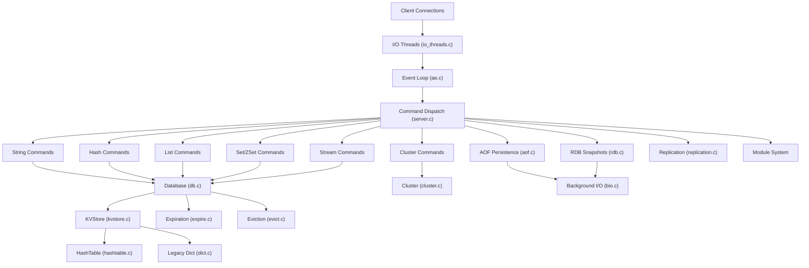
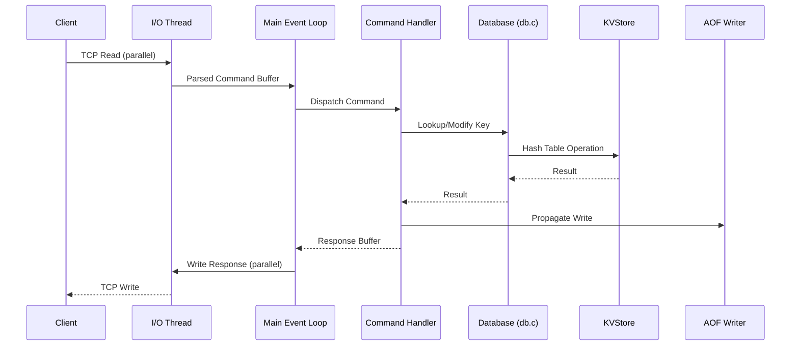
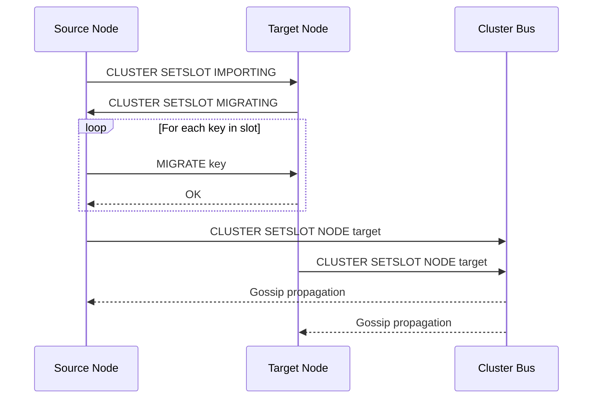
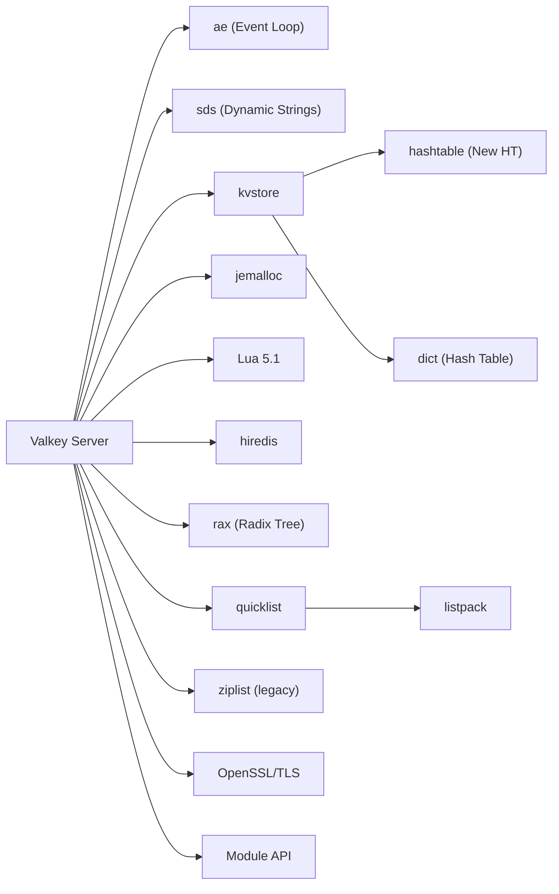

# Valkey

> A flexible distributed key-value database optimized for caching and other realtime workloads

| Metadata | |
|---|---|
| Repository | https://github.com/valkey-io/valkey |
| License | BSD 3-Clause |
| Primary Language | C |
| Category | Database |
| Analyzed Release | `9.0.2` (2026-02-03) |
| Stars (approx.) | 24,731 |
| Generated by | Claude Opus 4.6 (Anthropic) |
| Generated on | 2026-02-08 |

## Overview

Valkey is a community-driven fork of Redis 7.2.4, created in March 2024 when Redis changed its license from BSD to a dual SSPL/RSAL model. Backed by the Linux Foundation and supported by AWS, Google Cloud, Oracle, and other major technology companies, Valkey preserves the BSD 3-Clause license and extends the Redis codebase with significant performance improvements, new data structures, and enhanced clustering capabilities. It maintains full wire-protocol compatibility with Redis while introducing multi-threaded I/O, a new hashtable implementation, and features like per-hash-field expiration.

Problems it solves:
- Provides a fully open-source, permissively licensed alternative to Redis after the license change
- Improves throughput with multi-threaded I/O processing (37% higher SET throughput in benchmarks)
- Reduces memory overhead with a new hashtable implementation (20-30 bytes saved per key)
- Enables per-hash-field expiration (TTL on individual hash fields)
- Scales to 2,000-node clusters supporting over 1 billion requests per second

Positioning:
Valkey is the most prominent Redis fork and the primary open-source continuation of the Redis project under permissive licensing. It competes directly with Redis (proprietary), Dragonfly (multi-threaded from scratch), KeyDB (multi-threaded fork), and Garnet (Microsoft's .NET implementation). Valkey differentiates through its strong community governance under the Linux Foundation, conservative compatibility approach, and incremental architectural improvements that preserve the battle-tested Redis codebase while modernizing performance-critical paths.

## Architecture Overview

Valkey inherits Redis's event-driven, single-main-thread architecture but extends it with multi-threaded I/O for network processing. The core remains a single-threaded event loop (ae) that processes commands sequentially, ensuring atomicity without locks. I/O threads handle read/write operations in parallel, and background threads (BIO) manage persistence operations. The slot-based kvstore provides the foundation for cluster mode data partitioning.

## Core Components

### Event Loop (`src/ae.c`, `src/ae.h`)
- Responsibility: The central event-driven I/O multiplexer that drives the entire server. Supports multiple backends: epoll (Linux), kqueue (macOS/BSD), evport (Solaris), and select (fallback). Processes file events (client connections, replication) and time events (cron jobs, expiration) in a single loop.
- Key files: `ae.c` (core loop), `ae_epoll.c`, `ae_kqueue.c`, `ae_evport.c`, `ae_select.c` (platform-specific backends).
- Design patterns: Reactor pattern with platform-specific multiplexer backends. The single-threaded loop guarantees command atomicity without locks.

### I/O Threading (`src/io_threads.c`, `src/io_threads.h`)
- Responsibility: Offloads network read and write operations to dedicated I/O threads while maintaining the single-threaded command execution model. This is a key Valkey enhancement over Redis, significantly improving throughput on multi-core systems.
- Key files: `io_threads.c` manages the thread pool for parallel read/write processing, `networking.c` handles protocol parsing and response buffering.
- Design patterns: Producer-consumer pattern where the main thread distributes I/O work to worker threads and collects results before command processing.

### KVStore and HashTable (`src/kvstore.c`, `src/hashtable.c`)
- Responsibility: Slot-based key-value storage that partitions data across hash slots for cluster mode. The new `hashtable.c` is a Valkey-specific replacement for the legacy Redis `dict.c`, providing better memory efficiency with approximately 20-30 bytes less overhead per key.
- Key files: `kvstore.c` (slot-aware store), `kvstore.h`, `hashtable.c` (new hash table), `hashtable.h`, `dict.c` (legacy hash table retained for backward compatibility).
- Design patterns: The kvstore wraps multiple hash table instances (one per slot range), enabling efficient slot-level operations for cluster migration.

### Database Engine (`src/db.c`)
- Responsibility: Implements the core database operations: key lookup, insertion, deletion, key renaming, and random key selection. Manages multiple logical databases (numbered 0-15 by default, now supported in cluster mode with Valkey 9).
- Key files: `db.c` (database operations), `server.h` (server state and database structures), `entry.c`/`entry.h` (key-value entry abstraction).
- Design patterns: Key-value store pattern with a layered design where db.c provides the interface and kvstore/hashtable provide the implementation.

### Expiration and Eviction (`src/expire.c`, `src/evict.c`)
- Responsibility: Manages key expiration (TTL-based) and memory eviction (policy-based removal when maxmemory is reached). Valkey adds per-hash-field expiration, allowing individual fields within a hash to have their own TTLs.
- Key files: `expire.c`/`expire.h` (expiration logic and hash-field TTL), `evict.c` (LRU, LFU, and other eviction policies), `lrulfu.h` (LRU/LFU tracking).
- Design patterns: Lazy expiration (check on access) combined with active expiration (periodic scan). The `lrulfu.h` module tracks access frequency for intelligent eviction.

### Cluster System (`src/cluster.c`, `src/cluster_legacy.c`)
- Responsibility: Implements the Valkey Cluster protocol for data sharding across nodes, gossip-based failure detection, automatic failover, and slot migration. Valkey maintains the 16,384-slot hash space from Redis Cluster.
- Key files: `cluster.c` (new cluster interface), `cluster.h`, `cluster_legacy.c`/`cluster_legacy.h` (legacy Redis cluster code), `cluster_migrateslots.c` (slot migration), `cluster_slot_stats.c` (per-slot statistics).
- Design patterns: Gossip protocol for cluster state propagation, state machine for failover process, CRC16-based consistent hashing for slot assignment.

### Persistence (`src/rdb.c`, `src/aof.c`)
- Responsibility: Two persistence mechanisms: RDB (point-in-time snapshots) and AOF (append-only file logging). RDB creates compact binary dumps using fork(), while AOF logs every write command for durability.
- Key files: `rdb.c`/`rdb.h` (snapshot serialization/deserialization), `aof.c` (append-only file management), `bio.c`/`bio.h` (background I/O for fsync and file operations).
- Design patterns: Copy-on-write via fork() for RDB, write-ahead logging for AOF, background thread pool for fsync operations.

### Replication (`src/replication.c`)
- Responsibility: Implements primary-replica replication with support for full resynchronization (RDB transfer) and partial resynchronization (backlog-based). Valkey improves replication with RDMA support for ultra-low-latency scenarios.
- Key files: `replication.c` (full replication logic), `server.h` (replication state in `struct server`).
- Design patterns: Command propagation pattern where every write command is asynchronously sent to replicas. The replication backlog enables partial resync after brief disconnections.

## Data Flow

### Command Processing with I/O Threading

### Cluster Slot Migration

## Key Design Decisions

### 1. Preserve Single-Threaded Command Execution
- Choice: Keep the core command processing single-threaded while adding multi-threaded I/O, rather than moving to a fully multi-threaded model like Dragonfly.
- Rationale: Preserves the atomicity guarantees that Redis clients depend on without introducing lock contention. The I/O threading addresses the main bottleneck (network read/write) while keeping the simpler programming model for command logic.
- Trade-offs: CPU-bound commands still bottleneck on a single core. Complex operations like SUNIONSTORE or Lua scripts cannot benefit from parallelism. However, for most workloads, I/O is the bottleneck.

### 2. New HashTable Implementation Alongside Legacy Dict
- Choice: Introduce a new `hashtable.c` with better memory efficiency while retaining the legacy `dict.c` for backward compatibility.
- Rationale: The new hashtable reduces per-key memory overhead by 20-30 bytes, a significant improvement for large key spaces. Keeping dict.c ensures that modules and less-tested code paths continue to work.
- Trade-offs: Two hash table implementations increase code complexity and maintenance burden. The migration from dict to hashtable is ongoing and incremental.

### 3. BSD 3-Clause License Under Linux Foundation Governance
- Choice: Fork Redis 7.2.4 under BSD 3-Clause and place governance under the Linux Foundation with a Technical Steering Committee.
- Rationale: Ensures the project remains truly open source with permissive licensing. Foundation governance prevents any single company from changing the license again. Multiple corporate sponsors provide sustainability.
- Trade-offs: Community consensus can slow decision-making. Multiple competing interests from different corporate sponsors must be balanced.

### 4. Hash Field Expiration (Per-Field TTL)
- Choice: Add the ability to set TTL on individual fields within a hash data structure, not just on the top-level key.
- Rationale: Common use case in session management and caching where partial invalidation of a hash is needed without deleting the entire key. Previously required workarounds like separate keys per field.
- Trade-offs: Adds complexity to the hash data structure. Expiration of individual fields requires additional bookkeeping and memory per hash entry.

### 5. Cluster V2 Architecture Direction
- Choice: Develop a new clustering architecture (Cluster V2) that supports multiple logical databases per cluster, improved rebalancing, and larger cluster sizes (up to 2,000 nodes).
- Rationale: The original Redis Cluster design has scaling limitations and only supports database 0. Modern deployments need larger clusters with better resource utilization across multiple applications.
- Trade-offs: Significant engineering effort to redesign the cluster bus protocol. Must maintain backward compatibility with existing Redis Cluster deployments during transition.

## Dependencies

## Testing Strategy

Valkey maintains a comprehensive testing infrastructure inherited from Redis and extended with new tests:

- Unit Tests: C-based unit tests in `src/unit/` directory (e.g., `test_hashtable.c`, `test_kvstore.c`, `test_networking.c`) that test individual data structures and subsystems in isolation.
- TCL Integration Tests: The `tests/` directory contains extensive TCL-based integration tests inherited from Redis that exercise the full server through client connections.
- Fuzz Testing: `fuzzer_client.c` and `fuzzer_command_generator.c`/`.h` provide infrastructure for fuzz testing command parsing and execution.
- Cluster Tests: Dedicated tests for cluster operations including slot migration, failover, and gossip protocol behavior.
- Tracing: The `src/trace/` directory provides LTTng-based tracing for AOF (`trace_aof.c`), cluster (`trace_cluster.c`), and RDB (`trace_rdb.c`) operations for debugging in production.
- CI/CD: Tests run on multiple platforms and architectures including x86 and ARM (Graviton).

## Key Takeaways

1. Valkey demonstrates that evolutionary improvement of a proven codebase can deliver substantial gains without a complete rewrite. The I/O threading layer, new hashtable implementation, and per-field expiration are targeted improvements that address specific bottlenecks while preserving Redis's battle-tested command processing model.

2. The governance model under the Linux Foundation with BSD licensing is as important as the technical decisions. By ensuring no single entity can change the license, Valkey provides the stability guarantees that enterprises need for long-term adoption in critical infrastructure.

3. The dual hashtable approach (new `hashtable.c` alongside legacy `dict.c`) exemplifies pragmatic engineering. Rather than a risky big-bang replacement, the gradual migration allows the new implementation to be validated incrementally while maintaining full backward compatibility.

## References

- Repository: https://github.com/valkey-io/valkey
- Valkey Documentation: https://valkey.io/docs/
- Linux Foundation Announcement: https://www.linuxfoundation.org/press/linux-foundation-launches-open-source-valkey-community
- Replication Internals: https://frostzt.com/blog/redis-valkey-replication-internals
- Valkey vs Redis Comparison: https://betterstack.com/community/comparisons/redis-vs-valkey/
