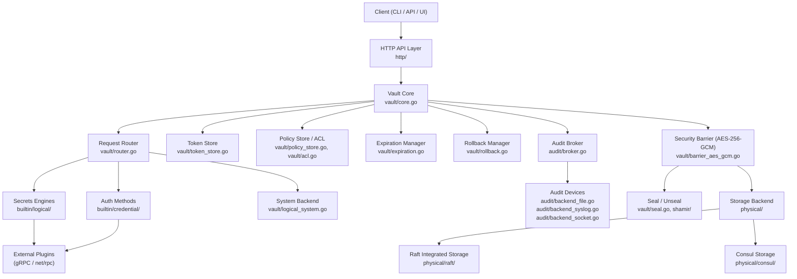
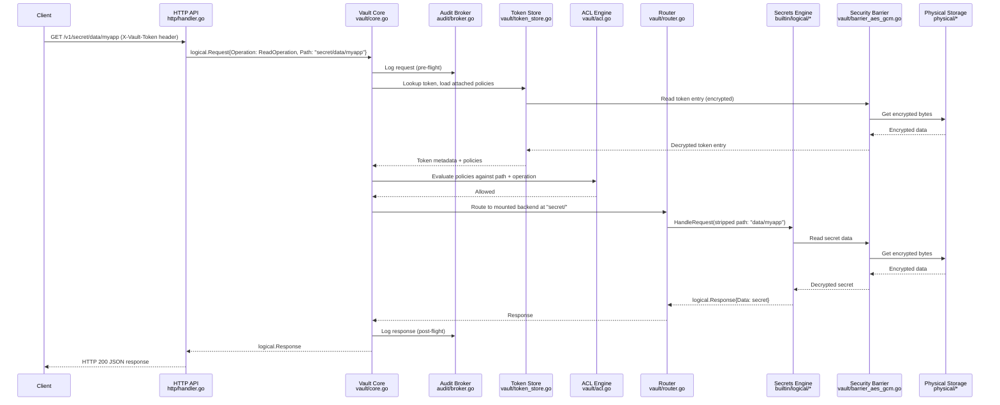
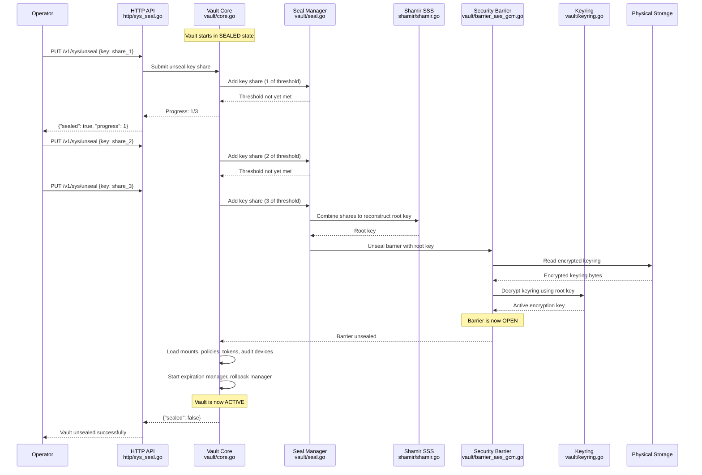
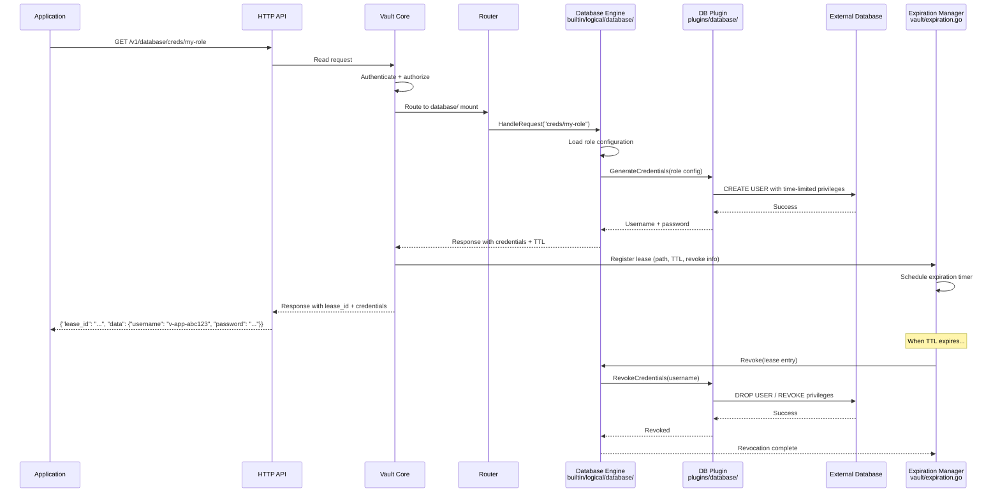
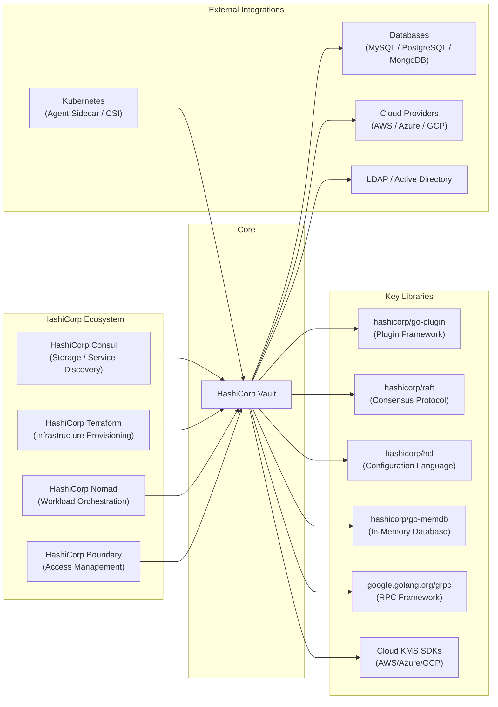

# HashiCorp Vault

> A tool for secrets management, encryption as a service, and privileged access management

| Metadata | |
|---|---|
| Repository | https://github.com/hashicorp/vault |
| License | BSL (Business Source License) |
| Primary Language | Go |
| Category | Security |
| Analyzed Release | `v1.21.2` (2026-01-07) |
| Stars (approx.) | ~35,000 |
| Generated by | Claude Opus 4.6 (Anthropic) |
| Generated on | 2026-02-08 |

## Overview

HashiCorp Vault is a secrets management platform that provides a unified interface for securely storing, accessing, and distributing secrets such as API keys, passwords, certificates, and database credentials. It acts as both a secrets broker and an encryption-as-a-service system, centralizing secret lifecycle management with strong access controls, automatic lease-based revocation, and comprehensive audit logging.

Problems it solves:

- Secret sprawl: credentials scattered across configuration files, environment variables, and application code with no centralized access control or audit trail
- Static credentials: long-lived passwords and API keys that are never rotated, creating a growing attack surface over time
- Encryption complexity: developers forced to implement their own cryptographic systems rather than delegating encryption to a dedicated, auditable service
- Dynamic credential provisioning: the need to generate short-lived, just-in-time credentials for databases, cloud providers, and other systems to minimize blast radius

Positioning:

Vault occupies a central position in the secrets management ecosystem. Compared to cloud-provider-specific solutions like AWS Secrets Manager, Azure Key Vault, or GCP Secret Manager, Vault provides a cloud-agnostic abstraction layer that works across multi-cloud and hybrid environments. Against simpler tools like Mozilla SOPS or git-crypt (which focus on encrypting files at rest), Vault provides dynamic secret generation, lease management, and a full API-driven workflow. CyberArk and Thales CipherTrust compete in the enterprise PAM space but lack Vault's developer-centric API model. Vault's plugin architecture and open-source core give it unmatched extensibility.

## Architecture Overview

Vault is designed as a layered security architecture where all persistent data passes through an encryption barrier before reaching the storage backend. The core orchestrates request processing by routing authenticated, authorized requests through a mount table to the appropriate secrets engine or auth method, while the expiration manager tracks all leases and the audit broker ensures every operation is logged. High availability is achieved through leader election using either integrated Raft storage or external coordination via Consul.

## Core Components

### Vault Core (`vault/core.go`)

- Responsibility: Central coordinator that manages the lifecycle of a Vault server and orchestrates all subsystems
- Key files: `vault/core.go`, `vault/core_util.go`, `vault/request_handling.go`
- Design patterns: Mediator pattern (coordinates between subsystems), State pattern (sealed/standby/active states)

The Core struct is the heart of Vault. It holds references to every major subsystem: the barrier, mount table, router, token store, policy store, expiration manager, rollback manager, and audit broker. On startup, the core initializes in a sealed state and transitions through unseal to active (or standby in HA mode). It manages request lifecycle by accepting HTTP requests, performing authentication and authorization checks, routing to the appropriate backend, and ensuring audit logging at every step. The core also handles cluster state management, leader forwarding in HA configurations, and step-down logic.

### Security Barrier (`vault/barrier_aes_gcm.go`)

- Responsibility: Encrypts all data before it reaches the storage backend and decrypts it on retrieval, forming the trust boundary
- Key files: `vault/barrier.go`, `vault/barrier_aes_gcm.go`, `vault/barrier_view.go`, `vault/keyring.go`
- Design patterns: Decorator pattern (wraps storage operations with encryption), Envelope encryption (key hierarchy)

The barrier implements a two-layer encryption model. A keyring holds one or more encryption keys (each is a 256-bit AES key used in GCM mode with 96-bit nonces). The keyring itself is encrypted by the root key. In the default Shamir seal configuration, the root key is split into shares using Shamir's Secret Sharing (implemented in `shamir/shamir.go`). When enough key shares are provided during unseal, the root key is reconstructed, the keyring is decrypted, and the barrier "opens," allowing encrypted read/write access to storage. The barrier_view provides scoped, prefix-restricted access to the barrier, giving each mounted backend its own isolated namespace within the encrypted storage.

### Request Router (`vault/router.go`)

- Responsibility: Routes incoming requests to the correct mounted backend based on the request path
- Key files: `vault/router.go`, `vault/mount.go`, `vault/mount_util.go`
- Design patterns: Chain of Responsibility (path matching), Registry pattern (mount table)

The router maintains a radix tree of mounted backends. Each mount entry maps a path prefix to a specific auth method, secrets engine, or the system backend. When a request arrives, the router performs a longest-prefix match to find the appropriate backend and strips the mount prefix before forwarding. The mount table (`vault/mount.go`) manages mount configurations including options, tuning parameters, seal wrapping settings, and plugin information. Mount entries are persisted in the barrier-encrypted storage and loaded on unseal.

### Auth Methods (`builtin/credential/`)

- Responsibility: Authenticate clients and map verified identities to Vault policies
- Key files: `builtin/credential/token/`, `builtin/credential/userpass/`, `builtin/credential/approle/`, `builtin/credential/aws/`, `builtin/credential/ldap/`, `builtin/credential/github/`, `builtin/credential/cert/`, `builtin/credential/okta/`
- Design patterns: Strategy pattern (pluggable authentication), Plugin architecture (external auth via gRPC)

Vault ships with multiple built-in auth methods: Token (the foundational method, always enabled), UserPass, AppRole (for machine-to-machine authentication), AWS IAM/EC2, LDAP, GitHub, TLS Certificates, Okta, and RADIUS. Each auth method implements the `logical.Backend` interface from the SDK. On successful authentication, the auth method returns a set of policies and metadata, which the token store uses to generate a client token. Auth methods can be built-in (compiled into the binary) or external (running as separate plugin processes communicating over gRPC with mutual TLS).

### Secrets Engines (`builtin/logical/`)

- Responsibility: Generate, store, or compute secrets on behalf of clients
- Key files: `builtin/logical/transit/`, `builtin/logical/pki/`, `builtin/logical/database/`, `builtin/logical/aws/`, `builtin/logical/ssh/`, `builtin/logical/consul/`, `builtin/logical/rabbitmq/`, `builtin/logical/totp/`, `builtin/logical/nomad/`
- Design patterns: Strategy pattern, Factory pattern (dynamic secret generation), Plugin architecture

Secrets engines are the workhorses of Vault. Each engine implements the `logical.Backend` interface and handles a specific category of secrets. The Transit engine provides encryption-as-a-service without storing plaintext. The PKI engine acts as a certificate authority. The Database engine generates dynamic, time-limited database credentials using database-specific plugins (`plugins/database/`). The AWS engine generates IAM credentials or STS tokens on demand. The KV engine (implemented directly in `vault/logical_passthrough.go` for v1, and as an external plugin for v2) provides encrypted key-value storage. The Cubbyhole engine (`vault/logical_cubbyhole.go`) provides per-token private storage.

### Expiration Manager (`vault/expiration.go`)

- Responsibility: Tracks all leases (tokens and secrets) and automatically revokes them when they expire
- Key files: `vault/expiration.go`, `vault/token_store.go`
- Design patterns: Observer pattern (lease lifecycle events), Priority queue (expiration scheduling)

The expiration manager is a critical background subsystem. When a secret is generated or a token is created, the expiration manager assigns a lease with a TTL and stores the lease entry in barrier-encrypted storage. At startup, it loads all lease entries into memory and starts goroutines to process expirations. When a lease expires, the manager routes a revocation request back to the originating backend. If revocation fails, exponential backoff with up to six retries is applied. After exhausting retries, the lease is marked irrevocable (since Vault 1.8). The manager also handles explicit revocation, renewal, and prefix-based bulk revocation. Throttling (configurable via `VAULT_LEASE_REVOCATION_WORKERS`, default 200) prevents storage overload during mass expirations.

### Policy Store and ACL Engine (`vault/policy_store.go`, `vault/acl.go`)

- Responsibility: Stores named policies and evaluates access control decisions against request paths
- Key files: `vault/policy.go`, `vault/policy_store.go`, `vault/acl.go`, `vault/acl_util.go`
- Design patterns: Policy pattern, Default-deny access model

Vault implements a default-deny access control system. Policies are named HCL documents that define capabilities (create, read, update, delete, list, sudo, deny) on path patterns. The policy store persists policies in the barrier and caches them in memory. When a request is processed, the ACL engine loads all policies associated with the client token and evaluates them against the request path. Glob patterns and path templating (using identity attributes) are supported. Two built-in policies always exist: "default" (applied to all tokens unless excluded) and "root" (grants unrestricted access). Sentinel policies (enterprise) add fine-grained Role Governing Policies (RGPs) and Endpoint Governing Policies (EGPs).

### Audit Broker (`audit/`)

- Responsibility: Distributes audit log entries to all enabled audit devices, ensuring at least one device successfully logs before the operation proceeds
- Key files: `audit/broker.go`, `audit/backend_file.go`, `audit/backend_syslog.go`, `audit/backend_socket.go`, `audit/entry_formatter.go`
- Design patterns: Observer/Pub-Sub pattern, Chain of Responsibility (formatter pipeline)

The audit subsystem is designed with a fail-closed approach: if audit logging is enabled and all configured audit devices fail to log a request, Vault blocks the operation entirely. This guarantees a complete audit trail. The broker fans out each audit entry (request and response) to all enabled audit devices concurrently. Audit entries are formatted using a configurable pipeline that can hash sensitive values (using HMAC with a per-salt derived from the backend's accessor) to prevent secrets from appearing in plaintext in logs. Audit devices support file, syslog, and socket (TCP/UDP) outputs.

### Physical Storage Backends (`physical/`)

- Responsibility: Provide durable persistence for encrypted data; the storage layer sits outside the security barrier
- Key files: `physical/raft/`, `physical/consul/`, `physical/s3/`, `physical/dynamodb/`, `physical/gcs/`, `physical/postgresql/`, `physical/mysql/`, `physical/cockroachdb/`, `physical/azure/`, `physical/spanner/`
- Design patterns: Adapter pattern (uniform interface over heterogeneous storage systems), Interface segregation (`physical.Backend`)

The physical storage layer implements a simple key-value interface (`Put`, `Get`, `Delete`, `List`) defined in `sdk/physical/`. All data arriving at this layer is already encrypted by the barrier. Raft Integrated Storage (`physical/raft/`) is the recommended backend for production, providing both persistence and HA leader election without external dependencies. It implements the Raft consensus protocol to replicate data across cluster nodes. Consul (`physical/consul/`) was historically the primary HA-capable backend. Other backends (S3, DynamoDB, GCS, PostgreSQL, MySQL, CockroachDB, Azure, Spanner, Aerospike, Cassandra, etcd, ZooKeeper, FoundationDB, etc.) provide varying levels of HA support. The simple interface means backends are easy to add but must guarantee basic consistency.

### HTTP API Layer (`http/`)

- Responsibility: Translates HTTP requests into logical requests for the core and formats responses
- Key files: `http/handler.go`, `http/logical.go`, `http/sys_seal.go`, `http/sys_init.go`, `http/sys_health.go`, `http/sys_leader.go`, `http/sys_raft.go`
- Design patterns: Adapter pattern (HTTP to internal request translation), Middleware chain

The HTTP layer is the primary entry point for all client interactions. It registers route handlers for system endpoints (`/v1/sys/*`), logical paths (`/v1/*`), and health/status endpoints. The handler converts incoming HTTP requests into `logical.Request` structs, passes them through the core for processing, and translates `logical.Response` structs back into HTTP responses. It also handles special operations like seal/unseal, initialization, leader status, and Raft join operations. CORS handling, custom response headers, and request forwarding to the active node in HA mode are managed here.

### SDK and Plugin Framework (`sdk/`)

- Responsibility: Provides the framework for building secrets engines, auth methods, and other Vault plugins
- Key files: `sdk/logical/`, `sdk/framework/`, `sdk/plugin/`, `sdk/physical/`, `sdk/helper/`, `sdk/database/`
- Design patterns: Template Method pattern (framework callbacks), Interface-driven design

The SDK is published as a separate Go module (`github.com/hashicorp/vault/sdk`) and defines the core interfaces that all plugins must implement. The `sdk/logical/` package defines `Backend`, `Request`, `Response`, `Storage`, and related types. The `sdk/framework/` package provides the `Framework` struct, a higher-level abstraction that lets plugin authors define paths, fields, callbacks, and help text declaratively. The `sdk/plugin/` package handles the gRPC-based plugin communication protocol, including multiplexing (one process serving multiple mounts of the same type). External plugins are verified via SHA-256 checksums and communicate over mutually authenticated TLS connections.

## Data Flow

### Secret Read Request (Authenticated Client)

### Seal / Unseal Process

### Dynamic Secret Generation (Database Credentials)

## Key Design Decisions

### 1. Security Barrier as Trust Boundary

- Choice: All data is encrypted with AES-256-GCM before reaching the storage backend, creating an explicit trust boundary between Vault and its persistence layer
- Rationale: The storage backend is treated as untrusted infrastructure. By encrypting everything before it leaves the barrier, Vault can use any storage system (even a shared or multi-tenant one) without trusting it to protect confidentiality. This decouples the security model from the storage implementation
- Trade-offs: Every read and write incurs encryption/decryption overhead. The barrier must be in memory, meaning the active Vault node holds encryption keys in RAM. Storage backends cannot index or query Vault data, limiting query capabilities to key-prefix listing

### 2. Shamir's Secret Sharing for Root Key Protection

- Choice: The root key that protects the keyring is split into multiple shares using Shamir's Secret Sharing scheme, requiring a quorum of key holders to unseal Vault
- Rationale: No single operator can unseal Vault alone, enforcing separation of duties. This prevents a single compromised operator from gaining access to all secrets. The threshold can be configured (e.g., 3-of-5)
- Trade-offs: Manual unseal requires operator coordination after every restart, which is operationally burdensome. This led to the introduction of auto-unseal via cloud KMS (AWS KMS, Azure Key Vault, GCP Cloud KMS) or HSM, which trades the human-quorum property for automated availability at the cost of trusting the external KMS

### 3. Plugin Architecture with Process Isolation

- Choice: Secrets engines, auth methods, and audit devices are implemented as plugins that can run as separate processes communicating over gRPC with mutual TLS
- Rationale: External plugins cannot crash the Vault server, and a vulnerability in a plugin does not directly compromise the Vault core. This also enables third-party extensibility and independent plugin versioning. Plugin multiplexing (one process for all mounts of the same type) reduces resource overhead
- Trade-offs: Inter-process communication adds latency compared to in-process function calls. Plugin management (registration, pinning, upgrades) adds operational complexity. Built-in plugins (compiled into the binary) exist as a performance shortcut but increase the binary size

### 4. Lease-Based Secret Lifecycle Management

- Choice: Every dynamic secret and every token is associated with a lease that has a time-to-live (TTL). The expiration manager automatically revokes secrets when leases expire
- Rationale: Short-lived credentials drastically reduce the window of exposure if a secret is compromised. Automatic revocation eliminates the need for manual credential rotation and ensures stale access is cleaned up
- Trade-offs: The expiration manager must track all active leases in memory, which can become a bottleneck at scale (hundreds of thousands of leases). Revocation failures require retry logic and can lead to irrevocable leases. Applications must implement lease renewal logic or accept periodic credential rotation

### 5. Raft Integrated Storage as Default Backend

- Choice: Since Vault 1.4, Raft-based integrated storage has been the recommended production backend, removing the dependency on external storage systems like Consul
- Rationale: Integrated storage simplifies the operational model by eliminating an external dependency for both persistence and HA leader election. Raft provides strong consistency and automatic failover within the Vault cluster. Each node holds a full data replica, enabling straightforward backup and restore
- Trade-offs: Raft storage requires a minimum of 3 or 5 nodes for production quorum. Data is replicated to all nodes, increasing storage costs linearly with cluster size. Extremely large datasets may face performance challenges compared to purpose-built storage systems. Network partitions can cause leader election disruption

## Dependencies

## Testing Strategy

Vault employs a multi-layered testing strategy spanning unit tests, integration tests, acceptance tests, and end-to-end scenario tests.

Unit tests: Each package contains `_test.go` files co-located with the source code. The `vault/` package alone contains extensive test files for every subsystem (e.g., `vault/barrier_aes_gcm_test.go`, `vault/expiration_test.go`, `vault/token_store_test.go`, `vault/acl_test.go`, `vault/router_test.go`). Tests use the `testing.go` helper within `vault/` which provides a full in-memory Vault cluster for integration-style unit tests. The `vault/external_tests/` directory contains tests that exercise Vault from outside the package boundary.

Integration tests: Secrets engines and auth methods have acceptance tests (guarded by environment variables like `VAULT_ACC`) that test against real external services (databases, cloud APIs, LDAP servers). The `plugins/database/` directory contains database-specific integration tests. The `enos/` directory contains end-to-end scenario tests using HashiCorp's Enos framework for testing Vault in realistic infrastructure configurations including multi-node clusters, upgrades, and seal migrations.

CI/CD: GitHub Actions workflows (`.github/workflows/`) run builds (`build.yml`) and CI tests (`ci.yml`). The Makefile provides `make test` (unit tests, requires Docker), `make testacc` (acceptance tests), and various other targets. The `scripts/` directory contains helper scripts for CI automation, cross-compilation, and release processes.

## Key Takeaways

1. Defense in depth through layered encryption: Vault's architecture demonstrates that treating the storage layer as fundamentally untrusted and encrypting all data through a barrier is a powerful security pattern. The envelope encryption hierarchy (data key inside keyring inside root key inside Shamir shares) provides multiple layers of protection, each addressing a different threat. This pattern is applicable to any system handling sensitive data where the persistence layer cannot be fully trusted.

2. Pluggable architecture with strong isolation boundaries: Vault's plugin system shows how to build an extensible platform without compromising core stability. By running external plugins as separate processes with gRPC communication and mutual TLS, Vault achieves fault isolation (a crashing plugin does not crash Vault), security isolation (a compromised plugin has limited access), and independent versioning. The tradeoff of added latency is acceptable given the security benefits. Plugin multiplexing further optimizes resource usage.

3. Lease-based lifecycle management as a universal pattern: The concept of attaching a TTL to every issued credential and automatically revoking it on expiry is a transferable architectural pattern. Rather than relying on consumers to clean up after themselves, the system proactively manages the lifecycle. This pattern applies broadly to temporary resources, session management, and any system where stale state creates risk.

4. Seal/unseal as a startup ceremony: The deliberate separation of "process is running" from "process is operational" is a powerful security concept. Vault's sealed state means that even if an attacker gains access to the running process and its storage, they cannot read any secrets without the unseal keys. This cold-start security model is worth considering for any security-critical service.

5. Fail-closed audit design: Vault's decision to block all operations if audit logging fails (rather than silently continuing without audit) is a principled approach to security logging. This guarantees a complete audit trail at the cost of availability, which is the correct tradeoff for a secrets management system. This design choice illustrates the importance of deciding upfront whether a system prioritizes availability or auditability when they conflict.

## References

- [Vault Official Documentation](https://developer.hashicorp.com/vault/docs)
- [Architecture Internals](https://developer.hashicorp.com/vault/docs/internals/architecture)
- [Seal/Unseal Concepts](https://developer.hashicorp.com/vault/docs/concepts/seal)
- [Security Model](https://developer.hashicorp.com/vault/docs/internals/security)
- [High Availability Internals](https://developer.hashicorp.com/vault/docs/internals/high-availability)
- [Raft Integrated Storage](https://developer.hashicorp.com/vault/docs/internals/integrated-storage)
- [Plugin Architecture](https://developer.hashicorp.com/vault/docs/plugins/plugin-architecture)
- [Policies and ACL](https://developer.hashicorp.com/vault/docs/concepts/policies)
- [Lease, Renew, and Revoke](https://developer.hashicorp.com/vault/docs/concepts/lease)
- [DeepWiki - Vault Plugin Architecture](https://deepwiki.com/hashicorp/vault/5-plugin-architecture)
- [DeepWiki - Vault Storage and High Availability](https://deepwiki.com/hashicorp/vault/3-storage-and-high-availability)
- [GitHub Repository](https://github.com/hashicorp/vault)
