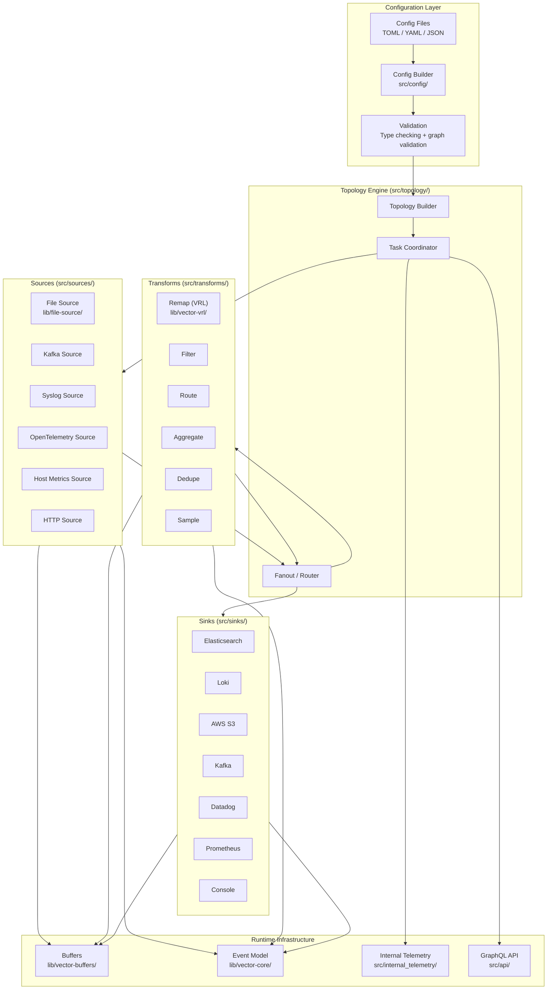
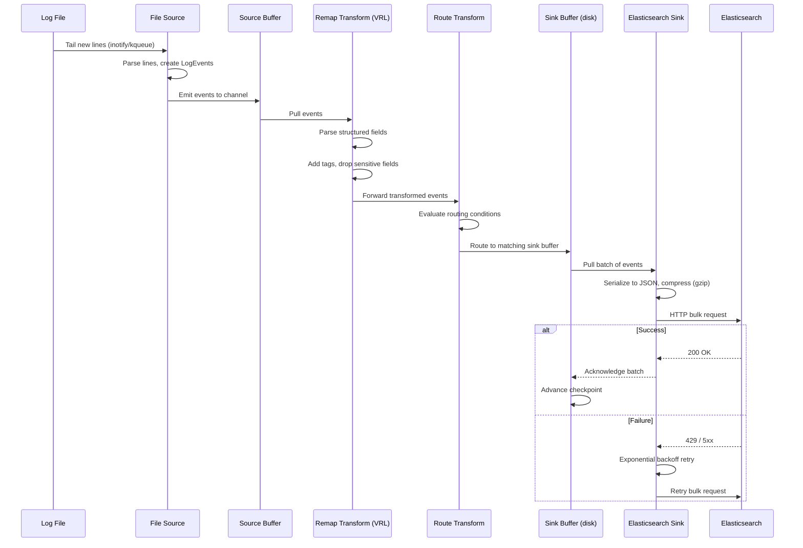
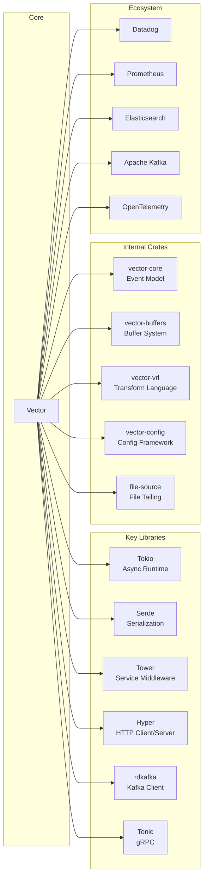

# Vector

> High-performance observability data pipeline for collecting, transforming, and routing logs, metrics, and traces

| Metadata | |
|---|---|
| Repository | https://github.com/vectordotdev/vector |
| License | MPL-2.0 |
| Primary Language | Rust |
| Category | Monitoring |
| Analyzed Release | `v0.53.0` (2026-01-27) |
| Stars (approx.) | 21,000+ |
| Generated by | Claude Opus 4.6 (Anthropic) |
| Generated on | 2026-02-09 |

## Overview

Vector is a high-performance observability data pipeline built in Rust that collects, transforms, and routes logs, metrics, and traces. It deploys as either an agent (on each host) or an aggregator (centralized), providing a unified tool for all observability data. Vector processes data through a directed acyclic graph (DAG) of components: sources ingest data, transforms process it, and sinks deliver it to destinations. The Rust implementation ensures memory safety without garbage collection pauses, resulting in predictable low-latency performance.

Problems it solves:

- Fragmented observability pipelines requiring separate tools for logs, metrics, and traces
- High resource consumption from agents like Logstash, Fluentd, or Filebeat on memory-constrained hosts
- Vendor lock-in from proprietary data pipelines that restrict where observability data can be sent
- Data quality issues due to lack of in-pipeline transformation, filtering, and enrichment capabilities
- Operational complexity from managing multiple data collection agents with different configurations

Positioning:

Vector competes with Fluentd/Fluent Bit, Logstash, Telegraf, and the OpenTelemetry Collector. Compared to Logstash (JVM-based), Vector consumes significantly less memory and CPU. Compared to Fluent Bit (C-based), Vector offers a richer transformation language (VRL) and native metrics/traces support. Unlike the OpenTelemetry Collector (which focuses on OTEL protocols), Vector provides a broader set of sources and sinks for legacy systems. Vector is developed by Datadog and serves as a vendor-neutral pipeline that works with any observability backend, though it has native Datadog integration.

## Architecture Overview

Vector is implemented as a Rust workspace containing 30+ crates organized in a monorepo. The core architecture is a topology engine that builds and manages a DAG of components connected by bounded channels. Each component (source, transform, sink) runs as one or more Tokio async tasks. The configuration system validates component definitions, resolves connections between them, and constructs the runtime topology. Hot reloading allows topology changes without data loss by gracefully draining existing components while spinning up new ones.

## Core Components

### Topology Engine (`src/topology/`)

- Responsibility: Building, running, and hot-reloading the DAG of sources, transforms, and sinks
- Key files: `src/topology/mod.rs`, `src/topology/builder.rs`, `src/topology/running.rs`, `src/topology/controller.rs`
- Design patterns: Builder pattern for topology construction, DAG-based dataflow graph, Graceful shutdown with drain signals

The topology engine is the heart of Vector. It takes a validated configuration and constructs the runtime pipeline. TopologyBuilder resolves component connections, creates bounded channels between them, and spawns Tokio tasks for each component. The running topology tracks all active tasks and their shutdown handles. When configuration changes are detected (via file watch or API signal), the controller performs a diff between the current and desired topology, gracefully drains removed/modified components (allowing in-flight events to complete), and spawns new components. This hot-reload mechanism enables zero-downtime configuration changes in production.

### Event Model (`lib/vector-core/`, `lib/vector-common/`)

- Responsibility: Defining the unified data model for logs, metrics, and traces flowing through the pipeline
- Key files: `lib/vector-core/src/event/log_event.rs`, `lib/vector-core/src/event/metric/mod.rs`, `lib/vector-core/src/event/trace.rs`, `lib/vector-core/src/event/mod.rs`
- Design patterns: Enum-based polymorphism (Event enum wrapping LogEvent, Metric, TraceEvent), Value type system for semi-structured data, Copy-on-write semantics for efficiency

The event model defines three primary data types: LogEvent (semi-structured key-value data), Metric (counters, gauges, histograms, distributions, summaries), and TraceEvent (spans with attributes). LogEvents use a Value enum that supports strings, integers, floats, booleans, timestamps, arrays, objects, and null, forming an in-memory JSON-like structure. The event model includes metadata for tracking source information, schema definitions, and internal telemetry. Events flow through the pipeline as owned values, with the buffer system providing backpressure when sinks cannot keep up with sources.

### VRL - Vector Remap Language (`lib/vector-vrl/`)

- Responsibility: Providing a safe, fast, domain-specific language for in-pipeline data transformation and filtering
- Key files: `lib/vector-vrl/`, `lib/vector-vrl-metrics/`, `src/transforms/remap.rs`
- Design patterns: Custom compiler and runtime for DSL, Expression-based evaluation, Fail-safe with compile-time error checking

VRL (Vector Remap Language) is a purpose-built expression-oriented language for transforming observability data. Unlike general-purpose languages (Lua, JavaScript) used in other pipelines, VRL is designed to be safe (no unbounded loops, no network access), performant (compiled to an internal representation), and ergonomic for common observability tasks (parsing, coercing, enriching). VRL programs are type-checked at compile time, catching errors before the pipeline starts. The language includes 100+ built-in functions for parsing formats (JSON, syslog, Apache, regex), type coercion, string manipulation, cryptographic hashing, and enrichment table lookups.

### Buffer System (`lib/vector-buffers/`)

- Responsibility: Providing backpressure-aware buffering between pipeline stages with memory and disk-backed options
- Key files: `lib/vector-buffers/src/`, `lib/vector-buffers/src/variants/memory_buffer.rs`, `lib/vector-buffers/src/variants/disk_v2/`
- Design patterns: Strategy pattern for buffer variants (memory vs. disk), Bounded channels with backpressure propagation, Write-ahead log for disk buffers

The buffer system manages the flow of events between components, providing resilience against downstream failures and traffic bursts. Memory buffers offer the lowest latency using bounded Tokio channels. Disk buffers provide durability through a write-ahead log implementation, ensuring events survive process restarts. When a buffer reaches capacity, backpressure propagates upstream: transforms stop pulling from sources, and sources may pause ingestion (e.g., stop reading from files). The buffer configuration is per-sink, allowing different durability and capacity settings for different destinations.

### Source and Sink Framework (`src/sources/`, `src/sinks/`)

- Responsibility: Ingesting data from external systems (sources) and delivering data to destinations (sinks)
- Key files: `src/sources/file/mod.rs`, `src/sources/kafka/mod.rs`, `src/sources/opentelemetry/mod.rs`, `src/sinks/elasticsearch/mod.rs`, `src/sinks/aws_s3/mod.rs`, `src/sinks/datadog/`
- Design patterns: Trait-based component interface (SourceConfig, SinkConfig), Async stream processing with Tokio, Batching and compression for sink efficiency

Vector ships with 30+ sources and 50+ sinks covering the observability ecosystem. Sources implement the SourceConfig trait, which validates configuration and produces an async task that emits events. File source (lib/file-source/) implements reliable file tailing with checkpointing, glob pattern watching, and file rotation detection. Sinks implement the VectorSink trait with three variants: StreamSink (event-by-event), BatchSink (batched delivery with configurable size/timeout), and the general Sink trait. Most HTTP-based sinks share common infrastructure for retry logic, rate limiting, authentication, and compression through the tower middleware stack.

## Data Flow

### Log Collection and Delivery Pipeline

## Key Design Decisions

### 1. Rust as Implementation Language

- Choice: Implement Vector in Rust rather than Go, Java, or C++
- Rationale: Rust provides memory safety without garbage collection, eliminating GC pauses that cause latency spikes in data pipelines. The ownership system prevents data races in concurrent code. Performance is comparable to C++ while being significantly safer. Rust's async ecosystem (Tokio) enables efficient I/O multiplexing
- Trade-offs: Steeper learning curve for contributors compared to Go. Longer compile times, especially for the full workspace. Smaller ecosystem of libraries compared to JVM or Node.js. The borrow checker can make certain patterns (like self-referential data structures) more complex

### 2. DAG-based Topology with Bounded Channels

- Choice: Model the pipeline as a directed acyclic graph with bounded async channels between components
- Rationale: DAG topology allows flexible routing (fan-out, fan-in, conditional routing) beyond simple linear pipelines. Bounded channels provide natural backpressure, preventing fast sources from overwhelming slow sinks. Each component runs independently as async tasks, maximizing CPU utilization
- Trade-offs: DAG validation must catch cycles at configuration time. Bounded channels can cause head-of-line blocking when one sink is slow. Channel capacity tuning affects latency vs. throughput trade-offs. Complex topologies are harder to reason about than linear pipelines

### 3. VRL as a Custom DSL

- Choice: Create a custom domain-specific language (VRL) instead of embedding Lua, JavaScript, or using a configuration-based approach
- Rationale: VRL provides safety guarantees (no infinite loops, no side effects) that general-purpose languages cannot. Compile-time type checking catches transformation errors before the pipeline starts. The language is tailored to observability use cases with built-in functions for common parsing and transformation tasks
- Trade-offs: Users must learn a new language. VRL is less flexible than general-purpose languages for unusual transformations. The language requires ongoing development and maintenance. Editor tooling and debugging support is less mature than mainstream languages

### 4. Disk-backed Buffers for Durability

- Choice: Offer disk-backed write-ahead log buffers as an alternative to memory-only buffering
- Rationale: In production environments, pipeline restarts or downstream outages should not cause data loss. Disk buffers persist events through process restarts and extended outages. This is critical for compliance and audit log pipelines where every event matters
- Trade-offs: Disk I/O adds latency compared to memory buffers. Disk capacity management requires monitoring. Write-ahead log implementation adds code complexity. Disk buffers consume storage proportional to the backlog size

### 5. Monorepo Workspace Architecture

- Choice: Organize the project as a Rust workspace with 30+ internal crates
- Rationale: Crate boundaries enforce module isolation and API boundaries. Independent crates can be compiled in parallel, reducing incremental build times. Shared libraries (vector-core, vector-common) prevent code duplication. The workspace allows selective testing of changed crates
- Trade-offs: Full clean builds are slow due to the number of crates. Dependency management across crates requires careful coordination. Internal crate versioning is not meaningful (all released together). New contributors may find the crate structure overwhelming

## Dependencies

## Testing Strategy

Vector has a multi-layered testing strategy emphasizing correctness and integration validation.

Unit tests: Rust unit tests are colocated with source code using the standard #[cfg(test)] convention. Each component (source, transform, sink) has unit tests verifying configuration parsing, event transformation logic, and error handling. The event model has extensive tests for serialization roundtrips and type coercion.

Integration tests: Integration tests in the repository verify end-to-end behavior with real external systems (Kafka, Elasticsearch, S3, etc.) using Docker containers managed by the test framework. VRL has a comprehensive test suite validating all built-in functions and edge cases. The `src/config/unit_test/` module provides a built-in unit testing framework that lets users validate their VRL transforms and pipeline configurations without running external services.

CI/CD: GitHub Actions runs the full test suite across Linux, macOS, and Windows. The CI pipeline includes clippy linting, rustfmt formatting checks, unit tests, integration tests (with containerized dependencies), and binary builds for multiple platforms. Performance benchmarks using Criterion.rs detect throughput and latency regressions. The project also runs end-to-end "soak tests" that measure resource consumption (CPU, memory) under sustained load over extended periods.

## Key Takeaways

1. Rust delivers predictable performance for data pipelines: Vector demonstrates that Rust's zero-cost abstractions and absence of garbage collection produce consistently low-latency data processing. This is particularly important for observability pipelines where agents must have minimal impact on host system performance, making Rust an excellent choice for infrastructure-level software.

2. Custom DSLs can be superior to embedded languages: VRL shows that a purpose-built language with safety guarantees (no infinite loops, compile-time type checking) can be more appropriate than embedding a general-purpose language. The key insight is that restricting expressiveness enables stronger correctness guarantees, which matters in production data pipelines.

3. Hot-reloadable topology enables zero-downtime operations: Vector's ability to diff configurations and gracefully transition between topologies demonstrates that stateful data pipelines can be reconfigured without data loss. This requires careful design of component lifecycle management, drain signals, and buffer persistence.

4. Backpressure propagation prevents cascading failures: The bounded channel architecture ensures that downstream problems (slow sinks, storage outages) propagate upstream as backpressure rather than causing unbounded memory growth. Combined with disk-backed buffers, this creates a resilient system that degrades gracefully under pressure.

## References

- [Vector Official Documentation](https://vector.dev/docs/)
- [Vector GitHub Repository](https://github.com/vectordotdev/vector)
- [Vector DeepWiki](https://deepwiki.com/vectordotdev/vector)
- [VRL Reference](https://vector.dev/docs/reference/vrl/)
- [Vector Architecture - Better Stack Guide](https://betterstack.com/community/guides/logging/vector-explained/)
- [Datadog Open Source - Vector](https://opensource.datadoghq.com/projects/vector/)
