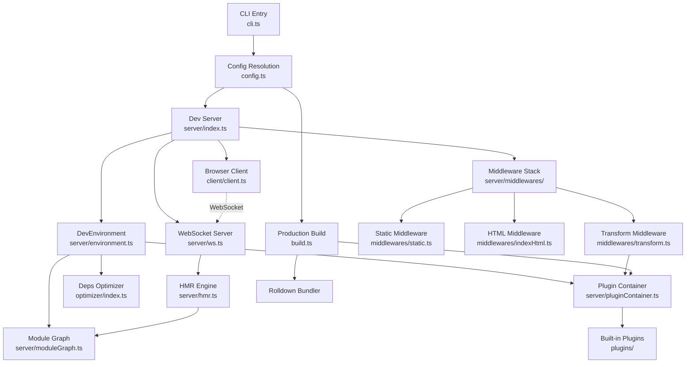
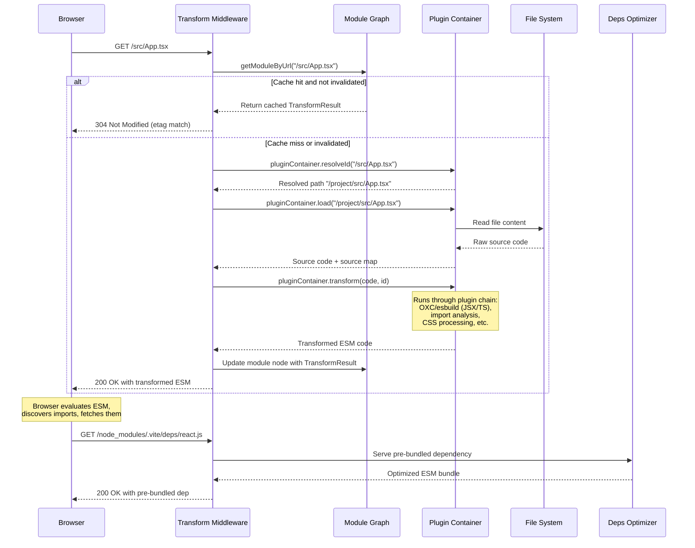
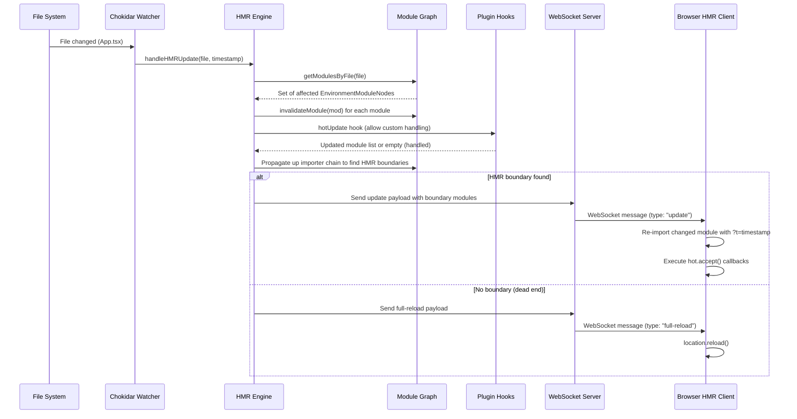
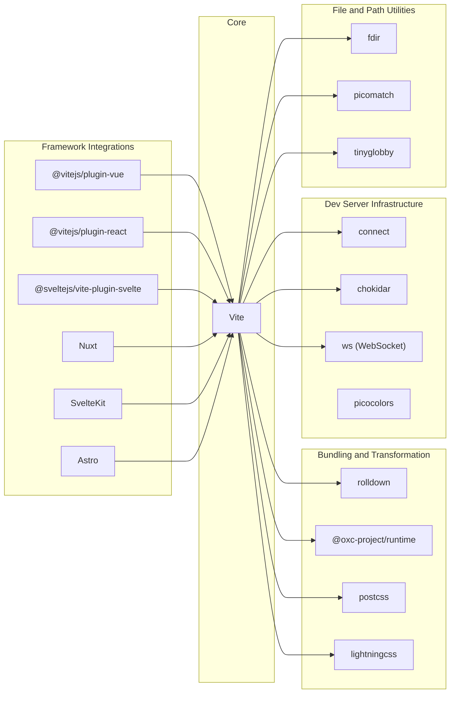

# Vite

> Next generation frontend tooling that provides instant server start and lightning fast Hot Module Replacement (HMR).

| Metadata | |
|---|---|
| Repository | https://github.com/vitejs/vite |
| License | MIT License |
| Primary Language | TypeScript |
| Category | Build Tool |
| Analyzed Release | `v8.0.0-beta.13` (2026-02-05) |
| Stars (approx.) | 78,000 |
| Generated by | Claude Opus 4.6 (Anthropic) |
| Generated on | 2026-02-08 |

## Overview

Vite is a modern frontend build tool that leverages native ES modules in the browser to deliver an extraordinarily fast development experience. It consists of two major parts: a dev server that serves source files over native ESM with rich built-in features and instantaneous HMR, and a production build pipeline powered by Rolldown (previously Rollup) that outputs highly optimized static assets.

Problems it solves:

- Slow development server startup in large projects caused by traditional bundler-based approaches that must process the entire dependency graph before serving
- Sluggish Hot Module Replacement that degrades as application size grows, because conventional bundlers must re-bundle portions of the application on each change
- Fragmented tooling ecosystem where developers must manually configure and integrate transpilers, bundlers, dev servers, and HMR systems
- CommonJS and bare import incompatibility in the browser, requiring pre-bundling of node_modules dependencies into ESM format

Positioning:

Vite occupies the position of a unified frontend build tool and dev server, competing directly with webpack, Parcel, and Turbopack. Unlike webpack which bundles everything during development, Vite serves unbundled ESM to the browser and only bundles for production. Compared to Snowpack (now unmaintained) which pioneered the unbundled development approach, Vite provides a more integrated solution with its Rolldown-powered production build, universal plugin API compatible with Rollup, and first-class support for frameworks like Vue, React, Svelte, and Solid through its plugin ecosystem. Vite has become the default build tool for most major frontend frameworks and meta-frameworks including Nuxt, SvelteKit, Astro, and Remix.

## Architecture Overview

Vite is organized as a monorepo with the core `vite` package at its center, supplemented by `create-vite` (scaffolding) and `@vitejs/plugin-legacy` (legacy browser support). The core package is split into a Node.js server-side runtime (`packages/vite/src/node/`) and a browser-side client (`packages/vite/src/client/`). The architecture follows a middleware-based pipeline pattern for request handling and a Rollup-compatible plugin container pattern for code transformation, unified by an Environment abstraction that allows the same server to handle multiple target runtimes (client, SSR) independently.

## Core Components

### Dev Server (`packages/vite/src/node/server/`)

- Responsibility: Orchestrating the development experience by managing HTTP request handling, file watching, environment lifecycle, and HMR coordination
- Key files: `server/index.ts`, `server/environment.ts`, `server/transformRequest.ts`
- Design patterns: Middleware Pipeline (Connect), Observer (file watcher via Chokidar), Facade (ViteDevServer wraps environments)

The dev server is created via `createServer()` in `server/index.ts`. It initializes a Connect-based HTTP server, resolves configuration, creates DevEnvironment instances for each target (client, SSR), sets up Chokidar file watching, and wires together a middleware stack in a deliberate order: request validation, CORS, host checking, proxy, cached transforms, main transforms, static file serving, HTML fallback, and error handling. The server exposes a `ViteDevServer` interface that acts as the central coordination point, providing access to environments, the WebSocket server, the resolved config, and module transformation APIs. When a file changes on disk, the server delegates to the HMR engine which traverses the module graph to compute update boundaries and sends targeted update payloads to the browser client over WebSocket.

### Plugin Container (`packages/vite/src/node/server/pluginContainer.ts`)

- Responsibility: Executing the plugin pipeline for module resolution, loading, and transformation in a Rollup-compatible manner
- Key files: `server/pluginContainer.ts`, `plugin.ts`, `plugins/index.ts`
- Design patterns: Chain of Responsibility (sequential hook execution), Adapter (Rollup plugin compatibility), Strategy (plugin ordering via `enforce` field)

The plugin container is modeled after Rollup's plugin execution engine, originally inspired by WMR's implementation. Each DevEnvironment has its own `EnvironmentPluginContainer` instance which manages plugin state and executes hooks (`resolveId`, `load`, `transform`, `buildStart`, etc.) in the correct order. Plugins are sorted into three tiers (pre, normal, post) based on their `enforce` property, and within each tier they execute sequentially. The container provides a `PluginContext` to each hook that mimics Rollup's context API, allowing plugins to emit files, resolve IDs, parse ASTs, and access module information. Vite extends the Rollup plugin interface with additional hooks such as `configureServer`, `transformIndexHtml`, and `hotUpdate` for dev-server-specific behavior. The built-in plugin pipeline registered in `plugins/index.ts` includes alias resolution, CSS processing (PostCSS, Lightning CSS), OXC/esbuild transpilation, JSON handling, asset processing, import analysis, define replacement, and worker support.

### Module Graph (`packages/vite/src/node/server/moduleGraph.ts`)

- Responsibility: Tracking import relationships, URL-to-file mappings, transformation cache, and HMR state for all modules processed by the dev server
- Key files: `server/moduleGraph.ts`, `server/mixedModuleGraph.ts`
- Design patterns: Graph data structure with bidirectional edges, Registry (URL/ID/file lookups), Cache (transformResult storage)

The `EnvironmentModuleGraph` maintains four lookup maps: `urlToModuleMap`, `idToModuleMap`, `etagToModuleMap`, and `fileToModulesMap`. Each module is represented as an `EnvironmentModuleNode` that records its URL, resolved file path, type (js/css/asset), importers (reverse dependencies), imported modules (forward dependencies), accepted HMR dependencies, and cached `TransformResult`. When a file changes, `onFileChange()` invalidates the module and its transitive importers, clearing their transform caches. The `mixedModuleGraph.ts` provides a backward-compatible `ModuleGraph` facade that aggregates module nodes across environments (client and SSR) into a unified view, ensuring API compatibility with plugins that predate the multi-environment architecture.

### Dependency Optimizer (`packages/vite/src/node/optimizer/`)

- Responsibility: Pre-bundling third-party dependencies from node_modules into optimized ESM bundles for efficient browser loading
- Key files: `optimizer/index.ts`, `optimizer/scan.ts`, `optimizer/optimizer.ts`, `optimizer/rolldownDepPlugin.ts`
- Design patterns: Lazy Initialization (scan-on-first-request), Cache with metadata persistence, Background Processing

The optimizer solves two key problems: converting CommonJS/UMD dependencies to ESM format, and collapsing deep import chains (e.g., lodash-es with hundreds of internal modules) into single files to reduce browser request count. On server start, the `ScanEnvironment` performs a fast scan of the application source using Rolldown's `scan()` API to discover bare import specifiers. These discovered dependencies are then bundled using Rolldown with the `rolldownDepPlugin` which handles resolution, CommonJS interop, and external marking. The results are cached in `node_modules/.vite/deps/` alongside a `_metadata.json` file containing a hash of the lock file, config, and dependency versions. If the hash matches on subsequent starts, the cached bundles are reused. During development, if a new dependency is encountered that was not in the initial scan, the optimizer triggers re-optimization and the server issues a full page reload to pick up the new pre-bundled modules.

### HMR System (`packages/vite/src/node/server/hmr.ts` + `packages/vite/src/client/client.ts`)

- Responsibility: Detecting file changes, computing minimal update boundaries in the module graph, and delivering targeted updates to the browser without full page reloads
- Key files: `server/hmr.ts`, `client/client.ts`, `client/overlay.ts`, `shared/hmr.ts`
- Design patterns: Publish-Subscribe (WebSocket messaging), Boundary Propagation (graph traversal), Observer (Chokidar file watcher)

The HMR system spans both server and client. On the server side, `handleHMRUpdate()` is triggered by Chokidar file change events. It resolves the changed file to its module graph nodes, invokes the `hotUpdate` plugin hook for custom handling, then propagates up the import chain to find HMR boundaries -- modules that have called `import.meta.hot.accept()`. The `updateModules()` function computes the minimal set of `Update` payloads (containing module URL, timestamp, and accepted dependencies) and sends them to all connected clients via WebSocket. On the client side, `client.ts` establishes a WebSocket connection to the dev server and instantiates an `HMRClient` from the shared HMR module. When an update payload arrives, the client dynamically re-imports the changed module with a cache-busting timestamp query parameter, then invokes the registered HMR callbacks. If a module without an HMR boundary is updated, or if the update propagation reaches the root, a full page reload is triggered. The error overlay (`overlay.ts`) displays compilation errors directly in the browser during development.

## Data Flow

### Dev Server Module Request

### Hot Module Replacement Flow

## Key Design Decisions

### 1. Unbundled ESM for Development, Bundled Output for Production

- Choice: Serve individual source files as native ES modules during development while using Rolldown (Rollup-compatible) for production bundling
- Rationale: Native ESM in the browser eliminates the need to bundle during development, making server start nearly instantaneous regardless of application size. The browser itself performs the module resolution, so Vite only needs to transform files on-demand as they are requested. For production, bundling remains necessary because unbundled ESM over HTTP/2 still has performance issues with deep import chains, tree-shaking, and code splitting.
- Trade-offs: The dev/prod behavior gap can occasionally cause subtle differences where code works in development but breaks in production (or vice versa) due to different module resolution semantics. The dependency pre-bundling step is required to bridge the gap between CommonJS node_modules and native ESM. Rolldown adoption (replacing esbuild for pre-bundling and Rollup for production builds) aims to reduce this gap further.

### 2. Rollup-Compatible Plugin Interface

- Choice: Extend Rollup's plugin API with Vite-specific hooks rather than designing an entirely new plugin system
- Rationale: Leveraging Rollup's well-established plugin API provides immediate access to a large ecosystem of existing Rollup plugins while allowing Vite to add dev-server-specific hooks (configureServer, transformIndexHtml, hotUpdate) on top. This means plugin authors familiar with Rollup can easily write Vite plugins, and many Rollup plugins work in Vite without modification.
- Trade-offs: Vite is constrained by Rollup's hook semantics, which were designed for a bundler context rather than an unbundled dev server. Some Rollup hooks (output-phase hooks like renderChunk, generateBundle) only run during production build, not during development serving. The transition to Rolldown as the underlying engine adds complexity in maintaining backward compatibility with the Rollup plugin API surface.

### 3. Per-Environment Architecture

- Choice: Introduce the Environment API where each target runtime (client browser, SSR Node.js, custom runtimes) gets its own isolated DevEnvironment with independent module graph, plugin container, and deps optimizer
- Rationale: Modern frameworks like Nuxt and SvelteKit simultaneously process code for multiple targets (browser client, server-side rendering, edge workers). Sharing a single module graph and plugin pipeline across these targets led to cross-contamination of module resolution and transformation state. Per-environment isolation ensures that client-specific plugins do not interfere with SSR processing, and each environment can have its own dependency optimization strategy.
- Trade-offs: Increased memory usage and complexity since module graphs and plugin containers are duplicated per environment. Plugin authors must be aware of the environment context and may need to handle environment-specific behavior. The backward-compatible `mixedModuleGraph.ts` adds an abstraction layer to maintain API stability for existing plugins.

### 4. Connect-Based Middleware Stack

- Choice: Use Connect (a minimal HTTP middleware framework) as the foundation for the dev server rather than Express, Koa, or a custom HTTP handler
- Rationale: Connect is extremely lightweight (no routing, no template engine, no view system) and provides just the middleware composition pattern needed. This keeps Vite's dependency footprint small while allowing middleware ordering to be precisely controlled. The middleware stack is composed in a specific order: security validation first, then proxy, then transforms, then static serving, then HTML fallback, then error handling.
- Trade-offs: Connect lacks higher-level abstractions found in Express (routing, templating), but Vite does not need these. Users who want to embed Vite in an Express app can use `middlewareMode` to get Vite's middlewares as a Connect-compatible middleware function. The sequential middleware model means request processing is straightforward to reason about but does not support parallel middleware execution.

### 5. Pre-bundling Dependencies with Rolldown

- Choice: Pre-bundle node_modules dependencies using Rolldown (formerly esbuild) into optimized ESM chunks cached in `node_modules/.vite/deps/`
- Rationale: Third-party packages often ship as CommonJS or have deep import chains (lodash-es has 600+ internal modules). Serving these unbundled would cause hundreds of cascading HTTP requests and CommonJS cannot be natively imported via ESM. Pre-bundling converts everything to ESM and collapses deep import trees into single files, dramatically reducing browser request count.
- Trade-offs: The initial dependency scan and bundling adds startup time on first run (subsequent runs use the cache). Discovery of new dependencies during development triggers re-optimization and a full page reload, which can be disruptive. The heuristic for determining what needs pre-bundling versus what can be served directly is complex, especially with workspaces, linked packages, and optional dependencies.

## Dependencies

## Testing Strategy

Vite employs a comprehensive two-tier testing strategy with clear separation between unit tests and integration (end-to-end) tests, all powered by Vitest.

Unit tests: Located in `__tests__` directories within each package (e.g., `packages/vite/src/node/__tests__/`, `packages/vite/src/node/server/__tests__/`). Unit tests validate individual functions and modules in isolation, covering areas like configuration resolution, path utilities, plugin hook ordering, and module graph operations. Run via `pnpm run test-unit`.

Integration tests: Located in the `playground/` directory, where each subdirectory is a complete Vite application with its own `__tests__/` folder. These tests use Vitest combined with Playwright to launch a real Vite dev server (or production build), navigate a Chromium browser to the served page, and assert on DOM content and behavior. Each integration test runs in two modes: `serve` (dev server) and `build` (production output), ensuring consistency across development and production. Test utilities in `playground/test-utils.ts` provide helpers for page interaction, file editing, and dev server control.

CI/CD: The `ci.yml` GitHub Actions workflow runs the full test suite on every pull request and push to main. It covers linting, type checking, unit tests, and integration tests across multiple operating systems and Node.js versions. The `ecosystem-ci-trigger.yml` workflow enables testing Vite changes against downstream projects (Nuxt, SvelteKit, Astro, etc.) to catch regressions before release. Publishing is automated via `publish.yml` which handles npm releases, and `preview-release.yml` provides preview releases for PRs.

## Key Takeaways

1. On-demand transformation over eager bundling: Vite's core architectural insight is that during development, letting the browser drive module loading via native ESM and transforming files only when requested eliminates the O(n) startup cost of traditional bundlers. This "lazy" approach means development server startup time is decoupled from application size, a principle applicable to any tool where deferring work to the point of actual need yields significant performance gains.

2. Extending an existing plugin interface rather than inventing a new one: By building on Rollup's plugin API instead of creating a proprietary system, Vite inherited a mature ecosystem and familiar mental model. The key lesson is that extending a well-known interface with targeted additions (Vite-specific hooks) provides the best of both worlds: ecosystem compatibility and domain-specific capabilities. This approach dramatically lowers adoption barriers for plugin authors.

3. Environment-aware isolation for multi-target processing: The per-environment architecture (separate module graphs, plugin containers, and optimizers for client vs. SSR vs. custom targets) demonstrates how to handle multi-target code processing without state contamination. This pattern is broadly applicable to any system that must process the same source code differently for multiple output targets while sharing a single server process.

4. Middleware composition for predictable request handling: The use of Connect's middleware pipeline gives Vite a clear, ordered, and extensible request processing architecture. Each concern (security, proxying, transformation, static serving, error handling) is isolated in its own middleware, making the system easy to reason about, debug, and extend. This pattern shows how minimal middleware frameworks can be more appropriate than full-featured web frameworks when the use case is specialized.

5. Aggressive caching with content-hash invalidation: The dependency optimizer's caching strategy (hash-based invalidation using lockfile content, config, and dependency versions) demonstrates an effective pattern for expensive computation results. By persisting pre-bundled dependencies and only recomputing when inputs change, Vite ensures that subsequent server starts are nearly instant while guaranteeing correctness through deterministic cache keys.

## References

- [Vite Official Documentation](https://vite.dev/)
- [Why Vite - Design Philosophy](https://vite.dev/guide/why)
- [Vite Plugin API](https://vite.dev/guide/api-plugin)
- [Vite HMR API](https://vite.dev/guide/api-hmr)
- [Vite GitHub Repository](https://github.com/vitejs/vite)
- [Inside Vite's Dev Server Orchestrator](https://zalt.me/blog/2025/09/inside-vites-dev-server)
- [DeepWiki - vitejs/vite Architecture](https://deepwiki.com/vitejs/vite)
- [Vite Contributing Guide](https://github.com/vitejs/vite/blob/main/CONTRIBUTING.md)
