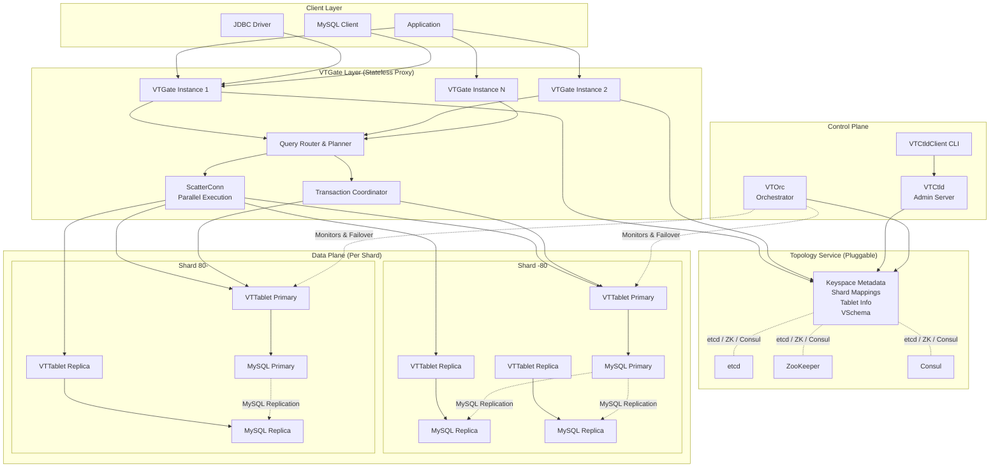
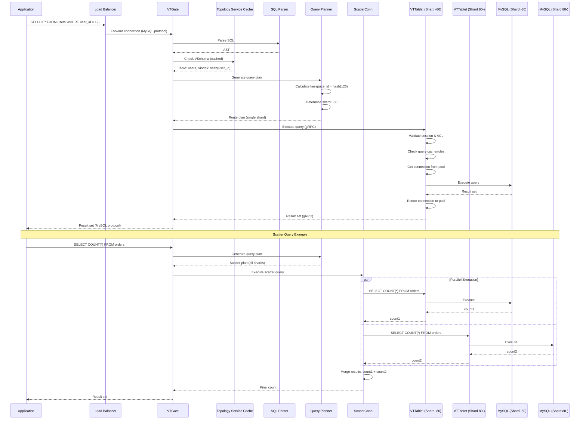
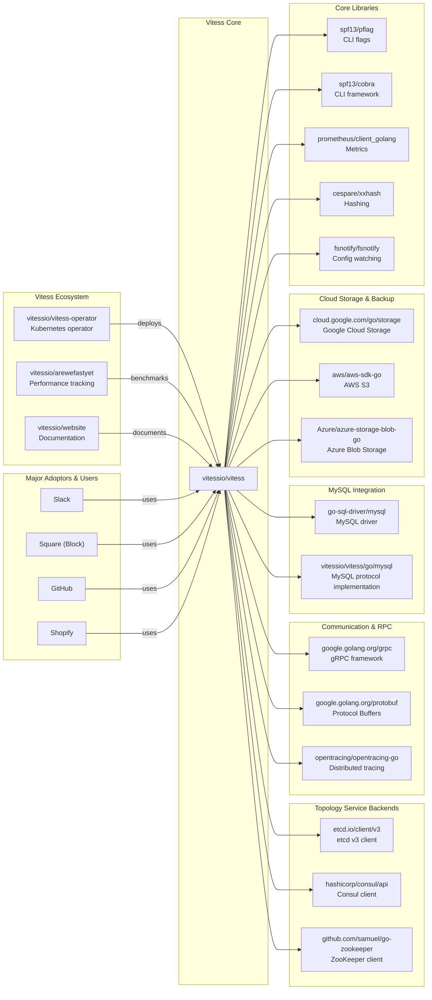

# Vitess

> A cloud-native horizontally-scalable distributed database system built around MySQL

| Metadata | |
|---|---|
| Repository | https://github.com/vitessio/vitess |
| License | Apache-2.0 |
| Primary Language | Go |
| Category | Database |
| Analyzed Release | `v23.0.1` (2026-02-04) |
| Stars (approx.) | 20,679 |
| Generated by | Claude Opus 4.6 (Anthropic) |
| Generated on | 2026-02-08 |

## Overview

Vitess is a cloud-native database clustering system for horizontal scaling of MySQL. Originally developed at YouTube in 2011 to handle tens of thousands of MySQL nodes, Vitess has since been adopted by major companies including Slack, Square (now Block), and JD.com. It achieves unlimited scaling through generalized sharding while keeping application code and database queries agnostic to data distribution.

Problems it solves:

- Horizontal scaling limitations of MySQL: Traditional MySQL struggles to scale beyond a single server, requiring complex manual sharding
- Application complexity from sharding awareness: Applications typically need to know about shard topology and routing logic
- Operational overhead during maintenance: Reparenting, server restarts, and resharding events disrupt application connectivity
- Connection pooling and resource management: Direct MySQL connections consume excessive memory at scale
- Schema changes and migrations: DDL operations on large sharded databases are operationally challenging

Positioning:

Vitess positions itself as a transparent scaling layer for MySQL, competing with solutions like Citus (for PostgreSQL), CockroachDB, and TiDB. Unlike NewSQL databases that replace MySQL entirely, Vitess preserves MySQL's reliability and ecosystem while adding distributed database capabilities. It is a graduated CNCF project and powers some of the world's largest MySQL deployments.

## Architecture Overview

Vitess employs a proxy-based architecture with three primary layers: VTGate (query routing and connection pooling), VTTablet (query execution and MySQL mediation), and a pluggable Topology Service (metadata and coordination). Applications connect to stateless VTGate proxies, which route queries to appropriate VTTablet instances based on sharding configuration stored in the Topology Service.

## Core Components

### VTGate (`go/vt/vtgate`)

- Responsibility: Stateless query proxy, routing, connection pooling, and distributed transaction coordination
- Key files: `go/vt/vtgate/vtgate.go`, `go/vt/vtgate/executor.go`, `go/vt/vtgate/scatter_conn.go`
- Design patterns: Proxy pattern, Connection pooling, Scatter-gather pattern

VTGate serves as the entry point for all client connections, presenting a standard MySQL protocol interface. It parses incoming SQL queries using the sqlparser library, generates query plans based on VSchema configuration, and routes queries to appropriate VTTablet instances. For queries spanning multiple shards (scatter queries), VTGate executes them in parallel via ScatterConn and merges results. It maintains no persistent state, making it horizontally scalable behind a load balancer.

VTGate implements connection pooling to VTTablets, dramatically reducing connection overhead compared to direct MySQL connections. It also handles distributed transaction coordination using two-phase commit when transactions span multiple shards.

### VTTablet (`go/vt/vttablet`)

- Responsibility: Query execution, connection pooling to MySQL, query rewriting, caching, and tablet lifecycle management
- Key files: `go/vt/vttablet/tabletserver/tabletserver.go`, `go/vt/vttablet/tabletmanager/tm.go`
- Design patterns: Mediator pattern, State machine pattern, Connection pooling

VTTablet acts as a mediator between VTGate and MySQL. Each MySQL instance has a corresponding VTTablet process running alongside it. VTTablet performs query validation, applies ACL rules, manages connection pooling to MySQL, and optionally maintains a row cache for read queries. It also handles query consolidation to prevent duplicate queries from overwhelming MySQL.

The TabletManager component within VTTablet manages the tablet's lifecycle, including health checks, replication management, backups, and schema changes. VTTablet exposes metrics and health status to VTGate and the control plane, enabling automatic failover when primary tablets become unhealthy.

### Topology Service (`go/vt/topo`)

- Responsibility: Distributed metadata store and coordination service for cluster configuration
- Key files: `go/vt/topo/server.go`, `go/vt/topo/etcd2topo`, `go/vt/topo/zk2topo`, `go/vt/topo/consultopo`
- Design patterns: Adapter pattern (pluggable backends), Watch pattern for change notifications

The Topology Service is a pluggable abstraction layer supporting etcd, ZooKeeper, and Consul as backend implementations. It stores keyspace definitions, shard mappings, tablet metadata, VSchema configurations, and the replication graph. Critically, the Topology Service is never in the hot path for queries—it is accessed during startup and updated asynchronously as metadata changes.

VTGate and VTTablet instances watch for topology changes and update their in-memory caches accordingly. This design ensures that topology service unavailability does not impact query execution, only administrative operations and startup.

### SQL Parser and Planner (`go/vt/sqlparser`)

- Responsibility: SQL parsing, abstract syntax tree (AST) manipulation, and query planning
- Key files: `go/vt/sqlparser/sql.y`, `go/vt/sqlparser/ast.go`, `go/vt/vtgate/engine`
- Design patterns: Visitor pattern for AST traversal, Builder pattern for query plans

Vitess implements a complete MySQL-compatible SQL parser built with yacc/goyacc. The parser generates an AST that is analyzed by the query planner to determine query routing. The planner consults VSchema to identify sharding keys, vindexes, and table locations. For simple queries with sharding key filters, the planner generates single-shard routes. For complex queries, it generates scatter-gather plans or handles them via the more advanced Gen4 planner.

The query engine (`go/vt/vtgate/engine`) implements various query execution primitives including Route (single shard), ScatterConn (multi-shard parallel), Join (cross-shard joins), and Aggregate (distributed aggregation).

### VSchema and Vindexes (`go/vt/vindexes`)

- Responsibility: Sharding configuration and keyspace ID calculation
- Key files: `go/vt/vindexes/vschema.go`, `go/vt/vindexes/hash.go`, `go/vt/vindexes/lookup.go`
- Design patterns: Strategy pattern (pluggable vindex implementations), Configuration-as-code

VSchema (Vitess Schema) is a JSON configuration that defines how tables are sharded across keyspaces and shards. Vindexes (Vitess Indexes) are functions that map column values to keyspace IDs, determining which shard stores a particular row. Primary vindexes are used during INSERT to assign rows to shards. Secondary vindexes provide alternative lookup paths, avoiding scatter queries.

Vitess provides built-in vindex implementations including hash (xxhash, consistent lookup), numeric (range-based), and lookup (external mapping table). Custom vindexes can be implemented by satisfying the Vindex interface.

### Control Plane: VTCtld and VTOrc (`go/vt/vtctl`, `go/vt/vtorc`)

- Responsibility: Administrative operations, schema management, resharding orchestration, and automated failover
- Key files: `go/vt/vtctl/vtctl.go`, `go/vt/vtctld/server.go`, `go/vt/vtorc/inst`
- Design patterns: Command pattern (vtctlclient), Orchestration pattern

VTCtld is the administrative daemon providing both CLI (via vtctlclient) and gRPC/HTTP APIs for cluster management. It handles operations like keyspace creation, resharding workflows (split/merge), schema migrations, backups, and emergency reparenting.

VTOrc (Vitess Orchestrator) is an automated failover and recovery system that continuously monitors tablet health and replication topology. When it detects a primary failure, VTOrc automatically promotes a replica to primary and updates the topology service, minimizing downtime.

## Data Flow

### Typical Query Execution Flow

## Key Design Decisions

### 1. Proxy-Based Architecture Instead of Smart Client

- Choice: Implementing VTGate as a stateless proxy layer between applications and MySQL, rather than a smart client library
- Rationale: Allows any MySQL-compatible client to connect to Vitess without code changes. Simplifies application deployment and enables polyglot environments. Centralizes query routing logic, making it easier to update and debug. Enables connection pooling at scale without per-application configuration
- Trade-offs: Introduces an additional network hop (application → VTGate → VTTablet → MySQL). Requires deploying and managing VTGate infrastructure. However, the benefits of operational simplicity and MySQL compatibility outweigh the latency cost, which is typically negligible (sub-millisecond) for most workloads

### 2. VSchema and Vindexes for Declarative Sharding

- Choice: Using a declarative VSchema configuration file with vindex functions to define sharding logic, instead of embedding sharding awareness in application code
- Rationale: Decouples sharding logic from application code, enabling resharding without application changes. Provides a single source of truth for data distribution. Allows Vitess to automatically route queries based on sharding keys. Supports multiple sharding strategies (hash, range, lookup) via pluggable vindexes
- Trade-offs: Requires careful upfront schema design and vindex selection. Poorly chosen sharding keys can lead to hotspots or difficult resharding. Query performance depends heavily on whether queries include vindex columns—queries without them require scatter operations across all shards

### 3. Pluggable Topology Service with Caching

- Choice: Abstracting the topology service behind a plugin interface supporting etcd, ZooKeeper, and Consul, with aggressive client-side caching
- Rationale: Allows organizations to leverage existing coordination infrastructure. Avoids vendor lock-in to a specific distributed consensus system. Client-side caching ensures topology service outages don't impact query execution, only administrative operations. Watch-based invalidation keeps caches eventually consistent
- Trade-offs: Increases complexity by supporting multiple backend implementations. Cache staleness can temporarily cause routing errors during topology changes (mitigated by short TTLs and watch notifications). Requires careful tuning of cache refresh intervals and watch timeouts

### 4. Two-Phase Commit for Distributed Transactions

- Choice: Implementing distributed transactions across shards using a two-phase commit protocol coordinated by VTGate
- Rationale: Provides ACID guarantees for multi-shard transactions, critical for correctness in sharded environments. Allows applications to use standard SQL transaction syntax without awareness of sharding. Leverages MySQL's transaction support at the shard level
- Trade-offs: Distributed transactions are significantly slower than single-shard transactions due to coordination overhead and multiple round-trips. Increases failure surface—if any participant fails during commit, the transaction must be resolved. Can lead to distributed deadlocks. Best practice is to design schemas to minimize cross-shard transactions

### 5. Resharding via Vertical and Horizontal Splits with VReplication

- Choice: Using VReplication (streaming MySQL binlog replication) to perform online resharding workflows including shard splits and merges
- Rationale: Enables resharding with minimal downtime by continuously streaming changes from source shards to target shards. Allows verification and rollback before cutover. Supports both horizontal resharding (splitting/merging shards) and vertical resharding (moving tables between keyspaces). Leverages MySQL's built-in replication for reliability
- Trade-offs: Resharding is operationally complex and requires careful planning. The cutover window, though brief (seconds), still requires stopping writes. Large backfills can take hours or days. Requires double storage capacity during the resharding process. VReplication adds overhead to source tablets

### 6. Built on MySQL Rather Than Building a New Database

- Choice: Using vanilla MySQL as the underlying storage engine instead of implementing a custom distributed database
- Rationale: Leverages decades of MySQL reliability, tooling, and ecosystem. Allows gradual adoption—organizations can migrate existing MySQL databases to Vitess incrementally. Developers already understand MySQL semantics, reducing learning curve. Benefits from ongoing MySQL improvements and bug fixes. Enables use of existing MySQL backup, monitoring, and troubleshooting tools
- Trade-offs: Inherits MySQL limitations, including single-threaded replication (mitigated in newer MySQL versions). Scaling requires sharding, which introduces complexity. Cannot implement distributed database features that require storage engine changes (e.g., distributed transactions without 2PC overhead). MySQL-specific quirks and performance characteristics propagate to Vitess

## Dependencies

## Testing Strategy

Vitess employs a comprehensive multi-layered testing strategy to ensure correctness and reliability across its complex distributed system.

Unit tests: Each package includes extensive unit tests in `_test.go` files. The codebase uses table-driven tests for parser validation, vindex behavior, and query planning. Mock implementations of interfaces (like topology service and MySQL connections) enable isolated testing of components.

Integration tests: End-to-end tests in `go/test/endtoend` spin up complete Vitess clusters using local processes or Docker containers. These tests validate query routing, resharding workflows, failover scenarios, and backup/restore operations. The `vtcombo` binary (all-in-one Vitess for testing) simplifies integration test setup.

Compatibility tests: The test suite includes MySQL compatibility tests that verify Vitess query results match vanilla MySQL. This is critical for ensuring application compatibility when migrating to Vitess.

CI/CD: GitHub Actions runs the test suite on every pull request across multiple MySQL versions (5.7, 8.0). The CI pipeline includes unit tests, integration tests, static analysis (golangci-lint), and build verification. Performance regression tests run via the arewefastyet project, tracking query latency and throughput across releases.

Load testing: PlanetScale and other adopters perform large-scale load testing in production-like environments. The Vitess team maintains benchmark suites for common query patterns and resharding operations.

## Key Takeaways

1. Transparent scaling layer pattern: Vitess demonstrates how a proxy layer can add distributed database capabilities to an existing single-node database without requiring application changes. This pattern is applicable beyond MySQL—similar architectures power pgpool-II, ProxySQL, and HAProxy for PostgreSQL. The key insight is maintaining protocol compatibility while adding routing, pooling, and coordination behind the scenes.

2. Declarative sharding configuration: Externalizing sharding logic into a configuration file (VSchema) rather than embedding it in application code enables operational flexibility. Organizations can change sharding strategies, add secondary indexes (vindexes), and perform resharding without application code changes. This separation of concerns is broadly applicable to distributed systems design.

3. Optimistic caching with watch-based invalidation: Vitess aggressively caches topology metadata in VTGate and VTTablet processes, using watch notifications for invalidation. This design keeps the coordination service off the hot path, ensuring query latency remains low even during topology service slowdowns. The pattern trades strict consistency for availability and performance—appropriate for metadata that changes infrequently.

4. Composition over replacement: Rather than replacing MySQL entirely (like NewSQL databases), Vitess composes with it, adding capabilities through layering. This approach minimizes risk during adoption, leverages existing ecosystems, and enables incremental migration. The trade-off is inheriting underlying system limitations, but the reduced migration barrier often outweighs this cost.

5. Resharding as a first-class operation: Vitess treats resharding not as a one-time migration but as an ongoing operational capability. VReplication enables online resharding with minimal downtime, allowing organizations to adapt their sharding strategy as data grows. This operational flexibility is a key differentiator from systems that make resharding prohibitively difficult.

6. Pluggable architecture for portability: By abstracting topology services, backup storage, and tablet types behind interfaces, Vitess avoids vendor lock-in and enables deployment across diverse environments. This plugin-based extensibility pattern increases complexity but provides critical flexibility for large-scale adoption.

7. Connection pooling at every layer: Vitess implements connection pooling at both VTGate (pooling to VTTablets) and VTTablet (pooling to MySQL), dramatically reducing connection overhead. At YouTube's scale, this translated to supporting hundreds of thousands of application connections with only thousands of MySQL connections—a critical scaling enabler.

## References

- [Vitess Official Documentation](https://vitess.io/docs/)
- [Vitess Architecture Overview](https://vitess.io/docs/archive/17.0/overview/architecture/)
- [Understanding the Architecture of Vitess](https://andrewjdawson2016.medium.com/understanding-the-architecture-of-vitess-5f3c042c4cdd)
- [Scaling Datastores at Slack with Vitess](https://slack.engineering/scaling-datastores-at-slack-with-vitess/)
- [Life of a Query Design Doc](https://github.com/vitessio/vitess/blob/main/doc/design-docs/LifeOfAQuery.md)
- [V3 High Level Design](https://github.com/vitessio/vitess/blob/main/doc/design-docs/V3HighLevelDesign.md)
- [Vitess Topology Service](https://vitess.io/docs/21.0/reference/features/topology-service/)
- [Vitess Vindexes Documentation](https://vitess.io/docs/23.0/reference/features/vindexes/)
- [Vitess Sharding Guide](https://vitess.io/docs/23.0/reference/features/sharding/)
- [PlanetScale and Vitess: A Technical Deepdive](https://www.yld.com/blog/planet-scale-and-vitess-a-technical-deepdive)
- [Vitess MySQL System Design Analysis](https://newsletter.systemdesign.one/p/vitess-mysql)
- [Massively Scaling MySQL Using Vitess - InfoQ](https://www.infoq.com/presentations/vitess/)
