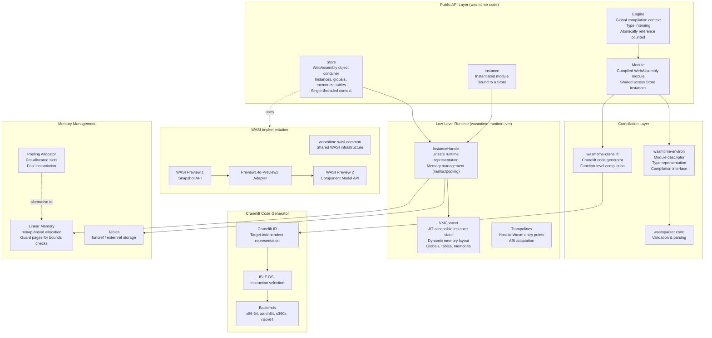
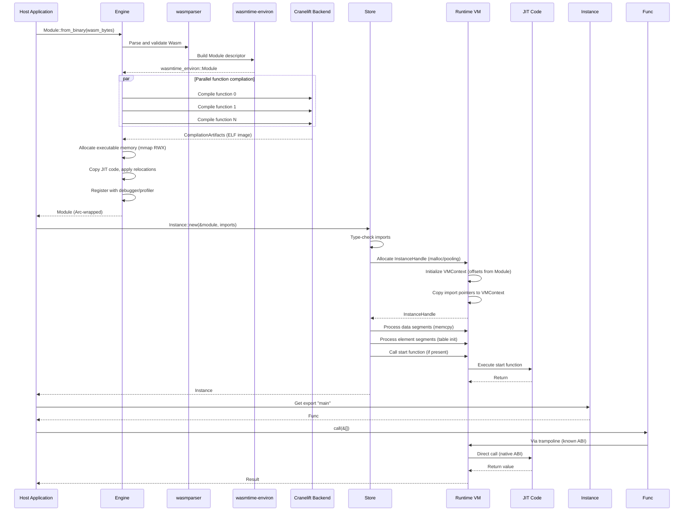
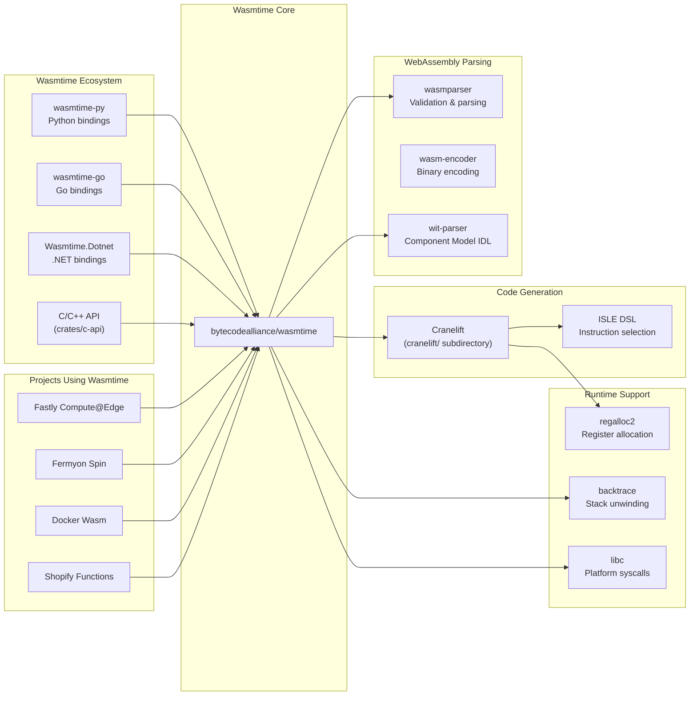

# Wasmtime

> A lightweight WebAssembly runtime that is fast, secure, and standards-compliant

| Metadata | |
|---|---|
| Repository | https://github.com/bytecodealliance/wasmtime |
| License | Apache-2.0 |
| Primary Language | Rust |
| Analyzed Release | `dev` (2022-09-28) |
| Stars (approx.) | 17,553 |
| Generated by | Claude Opus 4.6 (Anthropic) |
| Generated on | 2026-02-08 |

## Overview

Wasmtime is an open-source standalone runtime for WebAssembly developed by the Bytecode Alliance. It is designed to execute WebAssembly code outside of web browsers, serving as a universal runtime for cloud-native applications, serverless functions, edge computing, and embedded systems.

Problems it solves:

- Enabling safe execution of untrusted code across diverse platforms through WebAssembly's sandboxing capabilities
- Providing a high-performance JIT compiler (Cranelift) optimized for fast instantiation and low-overhead calls between host and WebAssembly
- Supporting the WebAssembly System Interface (WASI) for portable system-level capabilities like filesystem access, networking, and threading
- Offering ahead-of-time (AOT) compilation for scenarios where JIT compilation is not feasible or desired

Positioning:

Wasmtime is the reference implementation of the WebAssembly Component Model and WASI standards. It serves as a foundational runtime for projects like Fastly's Compute@Edge, Fermyon's Spin framework, and Docker's Wasm support. Cranelift, its code generator, is also being developed as an alternative backend for the Rust compiler (rustc_codegen_cranelift).

## Architecture Overview

Wasmtime employs a layered architecture with clear separation between the safe public API (wasmtime crate), compilation infrastructure (wasmtime-environ, wasmtime-cranelift), and low-level runtime (wasmtime::runtime::vm). The Engine manages global compilation state, Store provides per-instance isolation, and InstanceHandle represents the runtime memory layout of WebAssembly instances.

## Core Components

### Engine (`wasmtime::Engine`)

- Responsibility: Global compilation context and configuration management
- Key files: `crates/wasmtime/src/engine.rs`
- Design patterns: Singleton pattern with atomic reference counting, Type interning

The Engine is the root context for all Wasmtime operations. It stores compilation configuration (optimization level, target architecture, memory limits), manages type interning for VMSharedSignatureIndex values used in call_indirect operations, and coordinates code caching. Engine is designed to be shared across threads via Arc internally, but all mutations require lock acquisition. Each Engine maintains a registry of all compiled modules to support operations like trap handling and stack unwinding.

### Store (`wasmtime::Store`)

- Responsibility: Per-execution-context isolation and lifetime management
- Key files: `crates/wasmtime/src/store.rs`, `crates/wasmtime/src/store/data.rs`
- Design patterns: Context object pattern, Arena allocation for instances

Store represents the WebAssembly specification's concept of a "store" - a collection of related WebAssembly objects (instances, memories, tables, globals, functions). It provides strict isolation: objects from different stores cannot interact with each other. Store uses mutable references (&mut self) for almost all operations, enforcing single-threaded access. It maintains a ModuleRegistry holding strong references to compiled modules and their metadata, and manages deallocation of InstanceHandle values. Store also implements deferred reference counting for externref values via the Store::gc method.

### Cranelift Code Generator (`cranelift/`)

- Responsibility: Translating WebAssembly to optimized machine code
- Key files: `cranelift/codegen/`, `cranelift/frontend/`, `cranelift/isle/`
- Design patterns: Visitor pattern for IR traversal, DSL for instruction selection (ISLE)

Cranelift is a low-level retargetable code generator that compiles from target-independent intermediate representation (Cranelift IR) to native machine code. It consists of several subcomponents: cranelift-codegen (core compilation), cranelift-frontend (utilities for building IR), cranelift-module (multi-function compilation), and cranelift-isle (the ISLE DSL for instruction selection). Cranelift supports four backends: x86-64, aarch64, s390x, and riscv64. The instruction selection phase was significantly reworked to use ISLE, a domain-specific language that makes backend development more maintainable. Cranelift's code quality is competitive with browser JIT engines (~2% slower than V8's TurboFan) while achieving approximately 10x faster compilation speed than LLVM.

### Runtime Layer (`wasmtime::runtime::vm`)

- Responsibility: Low-level unsafe operations for WebAssembly execution
- Key files: `crates/wasmtime/src/runtime/vm/instance.rs`, `crates/wasmtime/src/runtime/vm/vmcontext.rs`
- Design patterns: Unsafe pointer manipulation, Dynamic memory layout

The runtime layer implements InstanceHandle and VMContext, the core runtime representations. InstanceHandle is an unsafe type containing Rust-owned dynamic state (memories, tables, etc.) followed by VMContext in memory. VMContext is a zero-sized type with contents dynamically determined by VMOffsets based on the source WebAssembly module. This structure is optimized for JIT code access - globals, function pointers, memory base addresses, and table pointers are all stored at fixed offsets known at compile time. VMContext also holds a stack limit pointer for overflow detection and a pointer to the Store for libcall operations. The runtime layer manages trap handling via platform-specific signal handlers, leveraging the GLOBAL_MODULES map to determine if a faulting instruction pointer corresponds to valid WebAssembly code.

### WASI Implementation (`crates/wasi-*`)

- Responsibility: WebAssembly System Interface implementation
- Key files: `crates/wasi-common/`, `crates/wasi-preview1-component-adapter/`, `crates/wasi-http/`, `crates/wasi-nn/`
- Design patterns: Capability-based security, Component Model composition

Wasmtime implements both WASI Preview 1 (the original snapshot_preview1 API) and WASI Preview 2 (built on the Component Model). WASI provides portable system interfaces for filesystem access, networking, random number generation, clocks, and environment variables. The implementation follows a capability-based security model where access to resources must be explicitly granted. The wasi-preview1-component-adapter crate bridges Preview 1 modules to Preview 2 APIs, allowing legacy code to run on the new infrastructure. Additional WASI extensions include wasi-http (HTTP client/server), wasi-nn (neural network inference), wasi-keyvalue (key-value storage), and wasi-threads (threading support).

### Memory Management (`crates/wasmtime/src/runtime/vm/mmap.rs`)

- Responsibility: Linear memory allocation and protection
- Key files: `crates/wasmtime/src/runtime/vm/mmap.rs`, `crates/wasmtime/src/runtime/vm/memory.rs`
- Design patterns: Guard page technique, Copy-on-write optimization (CoW)

Wasmtime implements WebAssembly linear memory using mmap (or platform equivalents) with configurable guard pages. On 64-bit platforms, the default configuration allocates 8GiB of virtual memory per linear memory: 2GiB guard region before, 4GiB for the memory itself (initially only 64KiB mapped), and 2GiB guard region after. The guard regions eliminate bounds checks for most memory accesses since out-of-bounds accesses trigger segfaults caught by Wasmtime's signal handler. The pooling allocator provides an alternative strategy with pre-allocated memory slots, reducing instantiation time and improving scalability by avoiding mmap locks. The pooling allocator also supports copy-on-write (CoW) initialization using memfd and madvise on Linux, significantly speeding up instances with large initialized data sections.

## Data Flow

### WebAssembly Module Compilation and Instantiation

## Key Design Decisions

### 1. Safe Rust API with Unsafe Runtime Core

- Choice: Exposing a nearly 100% safe Rust API (wasmtime crate) while implementing the runtime in unsafe code (wasmtime::runtime::vm)
- Rationale: Provides memory safety guarantees to embedders while allowing low-level optimizations in the runtime. The safe API enforces invariants like Store ownership and prevents use-after-free bugs, while unsafe runtime code can directly manipulate memory layouts and pointers for performance
- Trade-offs: The safe/unsafe boundary is not always clearly documented, with some methods that should be unsafe not marked as such. Requires careful auditing to ensure safety invariants are maintained. Performance-critical code paths may sacrifice some Rust safety idioms for speed

### 2. Cranelift as the Compilation Backend

- Choice: Developing and integrating Cranelift, a custom code generator, rather than using LLVM
- Rationale: Cranelift prioritizes fast compilation speed (approximately 10x faster than LLVM) while maintaining competitive code quality (~14% slower than LLVM, ~2% slower than V8). This makes it ideal for JIT scenarios and serverless environments where cold-start time is critical. Cranelift's simpler architecture (no callstack recursion, minimal dependencies) also makes it easier to audit for security
- Trade-offs: Cranelift's generated code is slightly slower than LLVM for compute-intensive workloads. Less mature than LLVM with fewer optimization passes. Limited to four target architectures (x86-64, aarch64, s390x, riscv64) compared to LLVM's dozens. However, Cranelift is production-ready and used in critical paths at Fastly, Shopify, and other organizations

### 3. Guard Pages for Bounds Check Elimination

- Choice: Using mmap guard pages before and after linear memory to catch out-of-bounds accesses via segfaults
- Rationale: Eliminates explicit bounds checks for most memory accesses, significantly improving performance. WebAssembly memory accesses include a static offset that can be up to 4GiB, so a 2GiB guard region ensures even the largest offset from a valid address will fault. Signal handler checks if the fault occurred within expected ranges and converts it to a WebAssembly trap
- Trade-offs: Requires 8GiB virtual address space per linear memory on 64-bit systems (6GiB with pooling allocator). Not feasible on 32-bit systems or platforms without virtual memory. Memory accesses with variable offsets still require bounds checks. Defense-in-depth 2GiB guard before memory should never be accessed but protects against Cranelift bugs

### 4. Pooling Allocator for High-Density Deployments

- Choice: Implementing an alternative instance allocation strategy using pre-allocated memory pools
- Rationale: Eliminates per-instance mmap syscalls and virtual memory locks, dramatically improving instantiation speed and scalability in multi-tenant scenarios like serverless platforms. All instances share a large upfront virtual memory reservation with individual "slots" for each instance. Copy-on-write (CoW) via memfd further optimizes initialization of data segments
- Trade-offs: Requires enormous virtual address space reservation (e.g., 6GiB per slot × 1000 slots = 6TiB). Instances are limited to pre-configured maximum memory/table sizes. Not tuned for all platforms (primarily optimized for Linux). Complexity in slot management and memory protection. Best suited for environments with predictable workload characteristics

### 5. Engine-Level Type Interning for call_indirect

- Choice: Interning function types at the Engine level and assigning VMSharedSignatureIndex values to enable fast type checking in call_indirect
- Rationale: The call_indirect instruction requires comparing function signatures at runtime. Interning types allows this to be a single integer comparison rather than deep structural comparison. Engine-level interning (rather than Store-level) allows compiled code to be shared across Stores, since the same function type may have different indices in different Stores
- Trade-offs: Type registration requires locking the Engine, which can be a synchronization bottleneck. Type deduplication across modules is not perfect (per-module trampolines are duplicated). The VMSharedSignatureIndex for a module may change if inserted into different Engines, requiring runtime resolution rather than compile-time constants in generated code

### 6. Dual WASI Support: Preview 1 and Preview 2

- Choice: Maintaining parallel support for both WASI Preview 1 (snapshot_preview1) and WASI Preview 2 (Component Model-based)
- Rationale: Preview 1 has broad ecosystem adoption but is frozen and considered legacy. Preview 2 provides a more robust foundation with the Component Model, enabling true composability and better resource management. The adapter allows Preview 1 code to run on Preview 2 infrastructure, smoothing the migration path
- Trade-offs: Increased maintenance burden supporting two APIs. Adapter introduces overhead for Preview 1 code. Component Model has a learning curve and requires new tooling. Ecosystem fragmentation as some tools/languages support only one version. Long-term dual support increases codebase complexity

## Dependencies

## Testing Strategy

Wasmtime employs comprehensive multi-layered testing and verification to ensure correctness and security.

Unit tests: Each crate contains extensive unit tests with the standard Rust test framework. The cranelift-codegen crate uses property-based testing with the proptest crate to generate random IR and verify invariants.

Integration tests: The crates/test-programs directory contains end-to-end tests running actual WebAssembly modules. These tests cover WASI functionality, memory management, threading, and component model scenarios.

Differential fuzzing: Wasmtime is continuously fuzzed via Google's OSS-Fuzz infrastructure. Fuzzers include differential execution against V8 and the WebAssembly reference interpreter, ensuring identical semantics. The wasmtime-fuzzing crate implements custom fuzzers for specific subsystems like the pooling allocator and component model.

Formal verification: Ongoing collaboration with academic researchers to formally verify critical Cranelift components. The ISLE-generated instruction lowering rules are designed to be amenable to automated verification. The register allocator (regalloc2) is separately fuzzed with symbolic verification.

CI/CD: GitHub Actions runs tests on every pull request across multiple platforms (Linux x86-64/aarch64, macOS, Windows) and configurations (default allocator, pooling allocator, async support). The test-all.sh script enforces code formatting, clippy lints, and documentation checks. Releases are cut from the main branch on a monthly cadence following semantic versioning.

## Key Takeaways

1. Safe abstractions over unsafe foundations: The pattern of exposing a safe Rust API while implementing the core runtime in unsafe code demonstrates how to balance safety and performance. The wasmtime crate enforces lifetime and ownership invariants at compile time, preventing entire classes of bugs, while the runtime can optimize critical paths with direct pointer manipulation. This is broadly applicable to systems programming where both safety and performance are requirements.

2. Compilation speed as a first-class metric: Unlike traditional compilers that optimize for code quality above all else, Cranelift treats compilation speed as equally important. This reflects Wasmtime's target use cases (serverless, JIT) where cold-start time dominates. The tradeoff is a simpler mid-end (fewer optimization passes) and backend (ISLE DSL instead of complex hand-written lowering). This design philosophy can apply to any JIT scenario where compilation is on the critical path.

3. Leveraging virtual memory for safety and performance: Guard pages eliminate bounds checks by converting a correctness issue (out-of-bounds access) into a hardware-enforced trap (segfault). This technique dramatically improves performance while maintaining safety. The pooling allocator extends this idea to pre-allocate an entire "universe" of memory upfront, trading virtual address space for instantiation speed. These are general techniques applicable to sandboxing, memory allocators, and garbage collectors.

4. Gradual migration strategies for evolving standards: Maintaining parallel support for WASI Preview 1 and Preview 2 via an adapter demonstrates how to manage ecosystem transitions. Rather than forcing a flag-day migration, the adapter allows legacy code to run on new infrastructure while new code can adopt improved APIs. This pattern is relevant for any platform managing a breaking change to a widely-adopted interface.

5. Type interning for fast runtime checks: Converting structural type equality into integer comparison via interning is a classic technique, but Wasmtime's implementation shows nuances: interning at Engine level (not Store) to enable code sharing, requiring runtime lookups in VMContext since index values aren't known at compile time, and accepting synchronization costs during type registration as a reasonable tradeoff. This design pattern applies to any runtime needing fast type/shape checks (JavaScript engines, dynamic language VMs, etc.).

6. Modular crate structure for embedders: Wasmtime is split into numerous crates (wasmtime-environ, wasmtime-cranelift, wasmtime-wasi, etc.) with the wasmtime crate serving as a facade. This allows embedders to depend on only the parts they need and even swap components (e.g., replacing Cranelift with a different compiler). However, all internal crates are considered private, avoiding the burden of maintaining stable APIs for internals. This architecture pattern balances modularity with maintenance overhead.

## References

- [Wasmtime Official Documentation](https://docs.wasmtime.dev/)
- [Architecture - Wasmtime](https://docs.wasmtime.dev/contributing-architecture.html)
- [Cranelift Code Generator](https://cranelift.dev/)
- [Security and Correctness in Wasmtime - Bytecode Alliance](https://bytecodealliance.org/articles/security-and-correctness-in-wasmtime)
- [Wasmtime 1.0: A Look at Performance - Bytecode Alliance](https://bytecodealliance.org/articles/wasmtime-10-performance)
- [Wasmtime and Cranelift in 2023 - Bytecode Alliance](https://bytecodealliance.org/articles/wasmtime-and-cranelift-in-2023)
- [WASI and the WebAssembly Component Model: Current Status](https://eunomia.dev/blog/2025/02/16/wasi-and-the-webassembly-component-model-current-status/)
- [WASIp2 - Wasmtime Examples](https://docs.wasmtime.dev/examples-wasip2.html)
- [PoolingAllocationConfig in wasmtime - Rust](https://docs.wasmtime.dev/api/wasmtime/struct.PoolingAllocationConfig.html)
- [wasmtime GitHub Repository](https://github.com/bytecodealliance/wasmtime)
