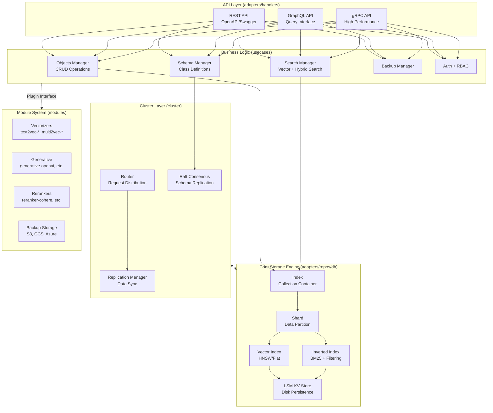
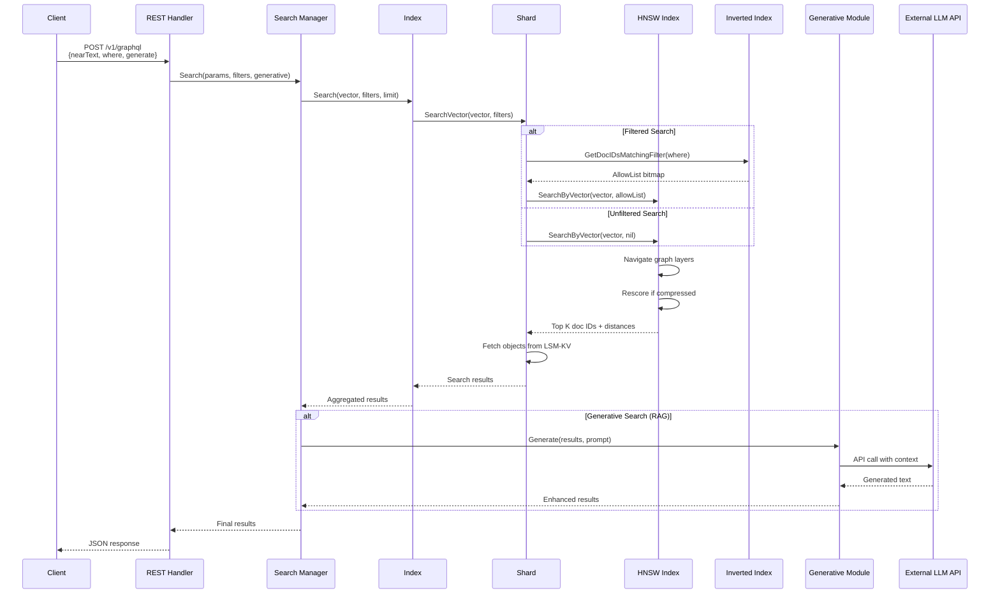
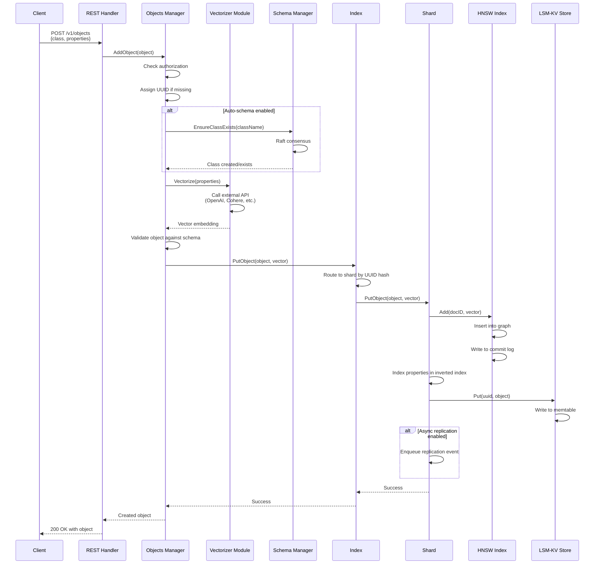
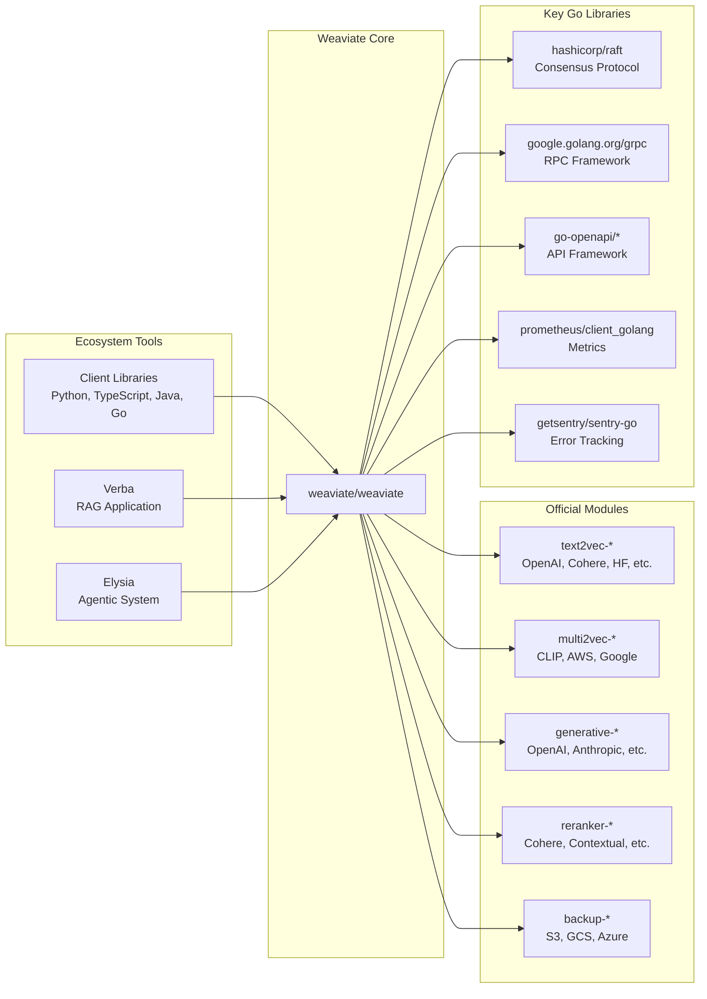

# Weaviate

> An open-source, cloud-native vector database that stores both objects and vectors, enabling semantic search and RAG applications at scale

| Metadata | |
|---|---|
| Repository | https://github.com/weaviate/weaviate |
| License | BSD 3-Clause |
| Primary Language | Go |
| Analyzed Release | `v1.35.7` (2026-02-04) |
| Stars (approx.) | 15,545 |
| Generated by | Claude Sonnet 4.5 (Anthropic) |
| Generated on | 2026-02-08 |

## Overview

Weaviate is an open-source vector database designed for AI-native applications. It combines vector similarity search with traditional filtering, integrated vectorization, retrieval-augmented generation (RAG), and reranking capabilities in a production-ready system. Built in Go for performance and reliability, Weaviate handles billions of vectors with millisecond search latency.

Problems it solves:

- Unified storage and retrieval for both structured data and vector embeddings, eliminating the need for separate databases
- Production-grade semantic search at scale with horizontal scaling, multi-tenancy, replication, and RBAC
- Seamless integration with AI model providers (OpenAI, Cohere, HuggingFace, Google) for automatic vectorization at import time
- Cost-efficient vector operations through built-in compression (PQ, BQ, SQ, RQ) reducing memory usage by up to 90%

Positioning:

Weaviate competes with Pinecone, Milvus, and Qdrant in the vector database space. Its differentiators include native multi-modal support, integrated generative search (RAG), production-ready multi-tenancy, and a modular architecture enabling both embedded and distributed deployment modes. Unlike Pinecone (SaaS-only), Weaviate offers self-hosted options and can run on Kubernetes, AWS, GCP, or Docker.

## Architecture Overview

Weaviate employs a layered hexagonal architecture with clean separation between API handlers, business logic (use cases), and data persistence (adapters). The core is organized around Indexes (collections) containing Shards, with each Shard managing its own vector index (HNSW/Flat) and inverted index (LSM-KV store) for filtering. Cluster coordination is handled via Raft consensus for schema management and HTTP/gRPC for data replication.

## Core Components

### REST API Handler (`adapters/handlers/rest/configure_api.go`)

- Responsibility: HTTP request routing, middleware setup, and API server lifecycle management
- Key files: `adapters/handlers/rest/configure_api.go`, `adapters/handlers/rest/operations/`
- Design patterns: Dependency injection, middleware chain pattern

The REST handler is generated from OpenAPI specifications using go-swagger. The `ConfigureAPI` function assembles all dependencies including schema manager, vectorizer clients, backup providers, and cluster components. It registers handlers for objects, schema, batch operations, GraphQL, and cluster endpoints. Middleware handles authentication (API key, OIDC), authorization (RBAC), CORS, and request logging.

Module initialization follows a plugin pattern where each module (vectorizers, generative, rerankers, backup) is instantiated based on enabled modules configuration and registered with the dependency container.

### Objects Manager (`usecases/objects/manager.go`)

- Responsibility: Orchestrating CRUD operations for data objects with validation, authorization, and auto-schema
- Key files: `usecases/objects/add.go`, `usecases/objects/batch_add.go`, `usecases/objects/delete.go`
- Design patterns: Manager pattern, strategy pattern for batch operations

The Objects Manager coordinates between the API layer and storage layer. It handles:

1. Authorization checks via RBAC
2. Auto-schema creation (creating classes/properties on-the-fly if enabled)
3. Auto-tenant provisioning for multi-tenant collections
4. Object validation against schema
5. Memory pressure checks before large operations
6. Routing requests to the appropriate shard based on consistent hashing

Batch operations use a separate batch manager that accumulates objects and dispatches them in optimized batches to shards, reducing write amplification.

### Index (`adapters/repos/db/index.go`)

- Responsibility: Representing a collection (class) and managing its shards
- Key files: `adapters/repos/db/index.go`, `adapters/repos/db/shard.go`
- Design patterns: Repository pattern, lazy loading for shards

An Index corresponds to a single Weaviate class (collection). It contains:

- ShardMap: Thread-safe map of shard names to shard instances
- Sharding state: Current shard distribution and replication configuration
- Queue: Async replication queue for cross-shard operations

The Index routes operations to the correct shard based on object UUID or tenant name. It supports dynamic shard creation for multi-tenant workloads and implements lazy loading to minimize memory footprint when dealing with thousands of tenants.

### Shard (`adapters/repos/db/shard.go`)

- Responsibility: Managing all data for a single partition including vector index, inverted index, and object storage
- Key files: `adapters/repos/db/shard.go`, `adapters/repos/db/shard_write_put.go`, `adapters/repos/db/shard_read.go`
- Design patterns: Facade pattern, write-ahead log pattern

A Shard is the fundamental unit of data storage in Weaviate. Each shard maintains:

- Vector index (HNSW or Flat) for ANN search
- Multiple inverted indexes (one per property) for filtering and BM25 search
- Object store (LSM-KV bucket) for complete object payloads
- Dimension tracking for multi-dimensional vectors
- Async replication state

Shards use fine-grained locking (sharded RW locks) to allow concurrent reads and writes. Write operations follow a transactional pattern: validate, write to vector index, write to inverted index, write to object store, update async replication queue.

### HNSW Vector Index (`adapters/repos/db/vector/hnsw/index.go`)

- Responsibility: Approximate nearest neighbor search using Hierarchical Navigable Small World graphs
- Key files: `adapters/repos/db/vector/hnsw/index.go`, `adapters/repos/db/vector/hnsw/hnsw.go`, `adapters/repos/db/vector/hnsw/insert.go`
- Design patterns: Graph data structure, layered index structure

The HNSW implementation is Weaviate's primary vector index, providing fast ANN search with configurable recall/speed trade-offs. Key characteristics:

- Multi-layer graph structure with exponentially decaying layer assignment
- Commit log for crash recovery
- Support for vector compression (PQ, BQ, SQ, RQ) to reduce memory footprint
- Flat search fallback for small result sets or filtered searches
- Tombstone-based deletion with periodic cleanup
- Concurrent insert protection via RW locks (read = insert, write = delete)

The index maintains a vertex array where each vertex stores connections to neighbors at each layer. Search navigates from the entry point down through layers, using beam search with configurable ef parameter. Compression is applied post-construction via a background compressor that converts float32 vectors to quantized representations.

### LSM-KV Store (`adapters/repos/db/lsmkv/store.go`)

- Responsibility: Disk-based key-value storage using Log-Structured Merge trees
- Key files: `adapters/repos/db/lsmkv/store.go`, `adapters/repos/db/lsmkv/bucket.go`, `adapters/repos/db/lsmkv/segment.go`
- Design patterns: LSM tree architecture, compaction strategies

Weaviate implements its own LSM-KV store optimized for vector database workloads. Features:

- Multiple bucket types: Replace (simple KV), Map (nested KV), Set (deduplicated lists), RoaringSet (compressed bitmaps)
- Memtable with configurable flush threshold
- Immutable on-disk segments with bloom filters
- Background compaction with configurable strategies (replace, map, set)
- Support for mmap and regular file I/O
- Crash recovery via commit logs

Inverted indexes use RoaringSet buckets for posting lists, enabling efficient bitmap operations for AND/OR filters. Object storage uses Replace buckets with object UUID as key.

### Schema Manager (`usecases/schema/handler.go`)

- Responsibility: Strongly consistent schema operations via Raft consensus
- Key files: `usecases/schema/handler.go`, `cluster/schema/`, `cluster/store.go`
- Design patterns: Command pattern, proxy pattern for leader forwarding

Schema operations (add class, update class, add property, tenant management) must be consistent across all cluster nodes. The Schema Manager uses Raft consensus:

1. Schema write requests are converted to Raft commands
2. Commands are forwarded to the Raft leader
3. Leader appends to Raft log and replicates to followers
4. Once committed, schema is applied to local state
5. Followers apply schema changes from replicated log

Schema reads can be eventually consistent (local read) or strongly consistent (query through Raft). The `WaitForUpdate` method allows waiting until local schema catches up to a specific version, enabling read-after-write consistency.

### Module System (`modules/`)

- Responsibility: Pluggable integrations for vectorizers, generative models, rerankers, and backup providers
- Key files: `modules/*/`, `usecases/modulecomponents/`, `entities/modulecapabilities/`
- Design patterns: Plugin architecture, capability-based interfaces

Weaviate's module system enables extending functionality without modifying core code. Modules implement capability interfaces:

- Vectorizers: `text2vec-*` (OpenAI, Cohere, HuggingFace), `multi2vec-*` (CLIP, AWS, Google)
- Generative: `generative-*` (OpenAI, Anthropic, Cohere, Google) for RAG
- Rerankers: `reranker-*` (Cohere, Contextual, JinaAI) for result reranking
- Backup storage: `backup-*` (S3, GCS, Azure, filesystem)

Modules are initialized at startup based on `ENABLE_MODULES` environment variable. Each module registers its capabilities (vectorization, generative, reranking, backup) with the module registry, which the Objects Manager and Search Manager query when processing requests.

## Data Flow

### Vector Search with Filtering and RAG

### Object Insert with Auto-Vectorization

## Key Design Decisions

### 1. Custom LSM-KV Store Instead of Embedded Database

- Choice: Implementing a custom LSM-KV store rather than using RocksDB, LevelDB, or BadgerDB
- Rationale: Vector database workloads have unique characteristics - large values (vectors), specialized bucket types (RoaringSet for inverted indexes), and need for mmap support. Custom implementation allows optimization for these patterns and eliminates CGo dependency (required by RocksDB)
- Trade-offs: Increased maintenance burden and need to implement features like compaction, bloom filters, and crash recovery. However, Go-native implementation improves portability and simplifies deployment

### 2. HNSW as Primary Vector Index

- Choice: Using Hierarchical Navigable Small World graphs for approximate nearest neighbor search
- Rationale: HNSW provides excellent recall/speed trade-off and supports efficient incremental updates (unlike IVF-based indexes requiring periodic retraining). The graph structure naturally supports filtered searches via allow-lists
- Trade-offs: Higher memory usage compared to quantization-only approaches. Mitigated by compression support (PQ, BQ, SQ, RQ) that can reduce memory by 90% while maintaining acceptable recall

### 3. Raft for Schema Consensus, HTTP/gRPC for Data Replication

- Choice: Using Raft consensus only for schema operations, not for data path
- Rationale: Schema changes are infrequent and require strong consistency. Data writes are high-throughput and can tolerate eventual consistency. Using Raft for all writes would create a bottleneck at the leader
- Trade-offs: Asymmetric replication model increases architectural complexity. Applications must understand that schema is strongly consistent while data is eventually consistent (tunable consistency level available)

### 4. Multi-Tenancy via Tenant-Per-Shard

- Choice: Implementing multi-tenancy by creating separate shards for each tenant, with lazy loading
- Rationale: Provides strong isolation between tenants (data, performance, indexing). Lazy loading ensures memory is only used for active tenants. Allows per-tenant configuration (vector index, replication)
- Trade-offs: Can create thousands of shards in large multi-tenant deployments. Requires careful resource management and shard lifecycle handling. Benefits from Go's efficient goroutine scheduling for concurrent shard operations

### 5. Modular Plugin Architecture for AI Integrations

- Choice: Externalized AI model integrations (vectorizers, generative, rerankers) as separate modules
- Rationale: AI ecosystem evolves rapidly with new providers and models. Plugin architecture allows users to add only needed integrations, reducing binary size and dependencies. Modules can be updated independently from core
- Trade-offs: Interface maintenance burden when core changes. Module discovery and initialization complexity. However, enables ecosystem growth without core code changes

### 6. Compression Post-Construction

- Choice: Building full-precision HNSW index first, then compressing vectors in background
- Rationale: Indexing on quantized vectors reduces graph quality. Post-construction compression with rescoring maintains recall while reducing memory. Allows using full precision during construction when memory is available
- Trade-offs: Requires 2x memory during compression (original + compressed). Compression is long-running and must coordinate with ongoing writes. Rescoring during search adds CPU cost (mitigated by rescoring only top candidates)

## Dependencies

## Testing Strategy

Weaviate employs a comprehensive multi-layered testing strategy across unit, integration, and end-to-end tests.

Unit tests: Each package contains standard `_test.go` files with table-driven tests. Critical components like HNSW index, LSM-KV store, and inverted index have extensive unit test coverage with property-based testing for correctness. Mock generators use `mockery` tool.

Integration tests: Use build tag `integrationTest` to separate long-running tests. Integration tests verify multi-component interactions such as vector index + inverted index + object store, schema replication via Raft, and module integration. Tests use real dependencies (local Raft cluster, file system) rather than mocks.

End-to-end tests: Modern e2e tests use testcontainers to spin up full Weaviate clusters with dependencies. Separate test packages for each major feature area (multi-tenancy, replication, backup). Old-style e2e tests require pre-running Weaviate instance but are being migrated to testcontainers approach.

CI/CD: GitHub Actions workflow runs linters (golangci-lint, custom goroutine leak detector), unit tests, integration tests (subset), and build verification. Full e2e suite runs on dedicated infrastructure. Docker images are built for each commit to main and tagged releases. Release process includes signing with sigstore/cosign.

## Key Takeaways

1. Layered architecture with dependency inversion: The clean separation between use cases (business logic) and adapters (infrastructure) enables testing business logic without I/O dependencies. The hexagonal architecture pattern makes it easy to swap implementations (e.g., different cluster backends, storage engines)

2. Custom storage layer optimized for workload: Building a custom LSM-KV store specifically for vector database patterns (RoaringSet buckets, large values, mmap support) demonstrates the value of workload-specific optimization over generic embedded databases

3. Asymmetric consistency model: Using Raft consensus for schema (infrequent, requires consistency) while using async replication for data (high throughput, eventual consistency acceptable) shows a pragmatic approach to distributed systems design. Not all data needs the same consistency guarantees

4. Compression as post-processing: The design decision to compress vectors after index construction rather than during construction demonstrates a two-phase approach that optimizes for quality first, memory second. This pattern is applicable to other indexing systems where quality degrades with compression

5. Modular plugin system for ecosystem integration: The capability-based module system where modules declare what they can do (vectorize, generate, rerank) rather than core knowing about each module enables open ecosystem growth. This inversion of dependency makes the system extensible without modification

## References

- [Weaviate Official Documentation](https://docs.weaviate.io)
- [Weaviate GitHub Repository](https://github.com/weaviate/weaviate)
- [HNSW Algorithm Paper](https://arxiv.org/abs/1603.09320)
- [Weaviate Blog - Vector Search Explained](https://weaviate.io/blog/vector-search-explained)
- [Weaviate Architecture Contributor Guide](https://weaviate.io/developers/contributor-guide/current/weaviate-core/structure.html)
