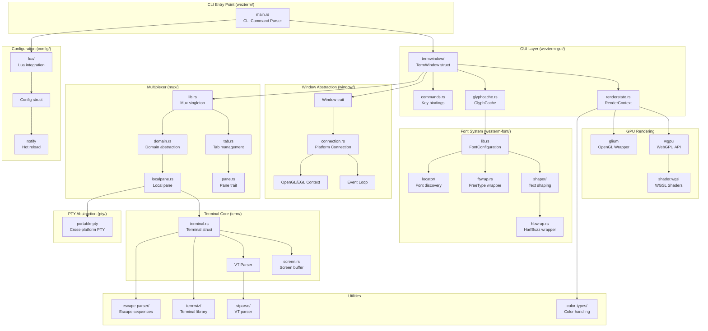
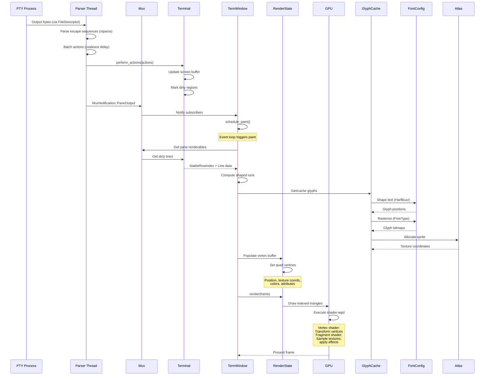
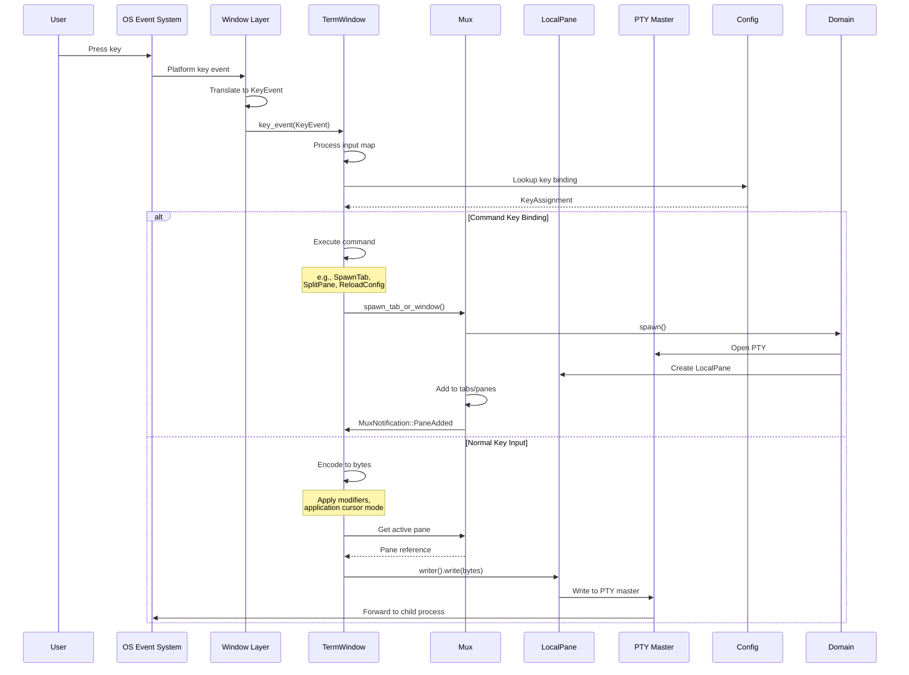
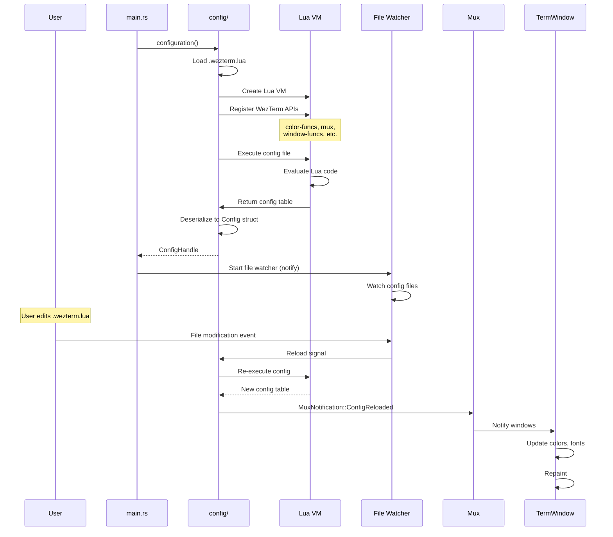
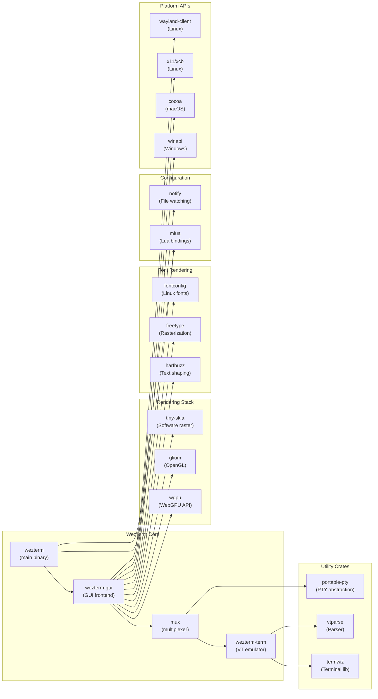

# WezTerm

> A GPU-accelerated cross-platform terminal emulator and multiplexer written in Rust

| Metadata | |
|---|---|
| Repository | https://github.com/wezterm/wezterm |
| License | MIT (Other) |
| Primary Language | Rust |
| Category | Editor / Terminal |
| Analyzed Release | `20240203-110809-5046fc22` (2024-02-03) |
| Stars (approx.) | 23,978 |
| Generated by | Claude Sonnet 4.5 (Anthropic) |
| Generated on | 2026-02-08 |

## Overview

WezTerm is a GPU-accelerated terminal emulator and multiplexer implemented in Rust by @wez. It stands out for its comprehensive feature set including ligature support, color emoji rendering, extensive Lua-based configuration, and client-server multiplexing capabilities.

Problems it solves:

- Providing GPU-accelerated text rendering for smooth scrolling and high performance across platforms
- Offering a unified terminal experience across Windows, macOS, and Linux with consistent feature parity
- Enabling powerful scripting and customization through a Lua configuration API
- Supporting both standalone and multiplexing modes for remote session management

Positioning:

WezTerm positions itself as a modern alternative to traditional terminal emulators like iTerm2, Alacritty, and Kitty. Unlike Alacritty's minimalist approach, WezTerm provides extensive built-in features. Compared to iTerm2, it offers cross-platform consistency. It competes with tmux/screen through built-in multiplexing capabilities while maintaining a rich GUI interface.

## Architecture Overview

WezTerm employs a layered modular architecture built as a Rust workspace. The system separates concerns across multiple crates: terminal emulation core (wezterm-term), multiplexing layer (mux), windowing abstraction (window), font rendering (wezterm-font), GUI frontend (wezterm-gui), and Lua configuration (config). This design enables clean separation between platform-agnostic logic and platform-specific implementations.

## Core Components

### Terminal Emulation Core (`term/`)

- Responsibility: VT sequence parsing and terminal state management
- Key files: `term/src/terminal.rs`, `term/src/screen.rs`, `term/src/terminalstate/`
- Design patterns: State pattern, Observer pattern (alerts)

The terminal core implements a virtual terminal emulator through the `Terminal` struct, which wraps a `TerminalState` and an escape sequence `Parser`. The `TerminalState` maintains the screen buffer, scrollback, cursor position, color palette, and rendering attributes. The architecture uses trait-based abstractions for clipboard access (`Clipboard` trait), alerts (`AlertHandler` trait), and device control (`DeviceControlHandler` trait).

The terminal processes input bytes through the `Parser` which generates `Action` enums representing escape sequences. These actions are then applied to the `TerminalState` through the `Performer` implementation. The screen buffer is implemented as a `Screen` struct in `screen.rs` with efficient line management and dirty region tracking for optimized rendering.

### Multiplexer Layer (`mux/`)

- Responsibility: Managing multiple terminal sessions, tabs, and panes
- Key files: `mux/src/lib.rs`, `mux/src/tab.rs`, `mux/src/pane.rs`, `mux/src/domain.rs`
- Design patterns: Singleton (Mux), Abstract Factory (Domain), Observer (MuxNotification)

The `Mux` struct is the central singleton managing all terminal sessions. It maintains `HashMap` collections for tabs, panes, windows, and domains, all protected by `RwLock` for thread-safe access. The mux implements a publish-subscribe mechanism through `MuxNotification` events that notify GUI components of state changes.

The `Domain` trait abstracts different types of terminal backends (local, SSH, serial, WSL). Each domain can spawn new panes through the `spawn()` method. The `LocalDomain` implementation uses the `portable-pty` crate to create local PTY processes. Tabs manage split pane layouts using the `SplitRequest` enum for horizontal and vertical splits.

A critical component is the PTY output parser thread in `parse_buffered_data()`. This function runs in a background thread, reading PTY output through a `FileDescriptor`, parsing it through `termwiz::escape::parser::Parser`, and batching actions before sending them to the mux via `send_actions_to_mux()`. This design decouples PTY I/O from the GUI event loop.

### GUI Frontend (`wezterm-gui/`)

- Responsibility: Rendering terminal content and handling user interaction
- Key files: `wezterm-gui/src/termwindow/mod.rs`, `wezterm-gui/src/renderstate.rs`, `wezterm-gui/src/glyphcache.rs`
- Design patterns: MVC (TermWindow as controller), Adapter (RenderContext), Cache (GlyphCache)

The `TermWindow` struct in `termwindow/mod.rs` is the primary GUI component implementing the `WindowCallbacks` trait. It manages rendering, input handling, and GUI state. The window maintains references to the `Mux`, `FontConfiguration`, `RenderState`, and `GlyphCache`.

`RenderState` provides an abstraction over GPU rendering backends through the `RenderContext` enum with variants for `Glium` (OpenGL) and `WebGpu`. This allows WezTerm to support both traditional OpenGL and modern WebGPU rendering paths. The render state manages vertex buffers, index buffers, and texture atlases through platform-agnostic interfaces.

The `GlyphCache` in `glyphcache.rs` implements a sophisticated caching system for shaped and rasterized glyphs. Glyphs are identified by `GlyphKey` structs containing font index, glyph position, style, and metrics. The cache uses an `Atlas` structure to pack glyphs into GPU texture atlases. It also handles animated images and color emoji through sprite management.

### Font Rendering System (`wezterm-font/`)

- Responsibility: Font discovery, text shaping, and glyph rasterization
- Key files: `wezterm-font/src/lib.rs`, `wezterm-font/src/shaper/`, `wezterm-font/src/locator/`, `wezterm-font/src/ftwrap.rs`, `wezterm-font/src/hbwrap.rs`
- Design patterns: Facade (FontConfiguration), Adapter (platform-specific locators), Strategy (shaping algorithms)

The `FontConfiguration` struct in `lib.rs` provides the main interface for font operations. It manages a database of loaded fonts, font fallback chains, and caching. The configuration uses platform-specific font locators implemented in `locator/` subdirectory (fontconfig for Linux, Core Text for macOS, DirectWrite for Windows).

Text shaping is performed through HarfBuzz wrappers in `hbwrap.rs`. The shaper handles complex scripts, ligatures, and bidirectional text. The shaping process converts character sequences into glyph positions with detailed placement information. The system supports advanced typography features including font variations, color fonts, and emoji.

Font rasterization uses FreeType through wrappers in `ftwrap.rs`. The system can render both grayscale and subpixel anti-aliased glyphs. Rasterized glyphs are converted to `BitmapImage` structures and uploaded to GPU texture atlases. The font system implements sophisticated caching using LFU (Least Frequently Used) eviction policies.

### Window Abstraction Layer (`window/`)

- Responsibility: Cross-platform window creation and event handling
- Key files: `window/src/lib.rs`, `window/src/connection.rs`, `window/os/`
- Design patterns: Abstract Factory (Connection), Strategy (platform implementations), Observer (WindowCallbacks)

The window layer provides platform-agnostic window management through the `Window` and `Connection` traits. The `Connection` trait represents the platform-specific connection to the windowing system (X11, Wayland, Win32, Cocoa). Implementations are in `window/os/` subdirectory with separate modules for each platform.

Windows are created through `Connection::new_window()` which returns a `Window` trait object. Applications implement the `WindowCallbacks` trait to receive events like `paint()`, `resize()`, `key_event()`, and `mouse_event()`. The callbacks are invoked from the platform event loop.

The layer also manages OpenGL contexts through EGL on Linux/Windows and CGL on macOS. It provides a `glium::backend::Backend` implementation for integration with the Glium OpenGL wrapper. For WebGPU support, it exposes raw window handles via the `raw-window-handle` crate.

### Configuration System (`config/`)

- Responsibility: Loading and managing user configuration via Lua
- Key files: `config/src/lib.rs`, `config/src/lua/`, `config/src/config.rs`
- Design patterns: Singleton (CONFIG), Builder (configuration structs), Interpreter (Lua)

Configuration is managed through a Lua scripting interface using the `mlua` crate. The system loads `.wezterm.lua` from standard configuration directories. The configuration file is evaluated in a Lua VM with WezTerm-specific APIs exposed through the `lua/` modules.

The `Config` struct in `config.rs` contains all configuration options with strongly-typed Rust fields. The struct uses custom derive macros (`wezterm-config-derive`) to automatically generate Lua binding code. Configuration values can be specified via Lua files, TOML files, environment variables, or command-line flags with defined precedence.

Hot-reloading is implemented using the `notify` crate to watch configuration files. When changes are detected, the configuration is re-evaluated and a `ConfigReloaded` notification is sent to the mux. The Lua API is extensive, exposing functions for color manipulation (`color-funcs`), window management (`window-funcs`), process spawning (`spawn-funcs`), and SSH operations (`ssh-funcs`).

### PTY Abstraction (`pty/`)

- Responsibility: Cross-platform pseudo-terminal management
- Key files: `pty/src/lib.rs`, `pty/src/unix.rs`, `pty/src/win.rs`
- Design patterns: Abstract Factory (PtySystem), Adapter (platform PTY APIs)

The `portable-pty` crate provides a unified interface for creating and managing pseudo-terminals across Unix and Windows platforms. The core abstractions are the `PtySystem` trait for PTY creation and the `MasterPty` and `SlavePty` traits for interacting with PTY endpoints.

On Unix platforms, the implementation uses POSIX PTY APIs (`openpty`, `forkpty`) with proper terminal attribute configuration. On Windows, it uses the ConPTY (Pseudoconsole) API introduced in Windows 10. The abstraction handles platform differences in resize signaling, process spawning, and I/O operations.

The crate supports spawning processes through `CommandBuilder`, which provides a cross-platform builder API for process configuration including environment variables, working directory, and argument handling.

### Escape Sequence Parser (`vtparse/`, `wezterm-escape-parser/`)

- Responsibility: Parsing VT/ANSI escape sequences
- Key files: `vtparse/src/lib.rs`, `wezterm-escape-parser/src/lib.rs`
- Design patterns: State Machine, Interpreter

The parser implements a state machine based on Paul Williams' VT parser state diagram. It processes input bytes and generates high-level `Action` enums representing escape sequences, control characters, and printable text. The parser is incremental, supporting streaming input without buffering.

The `wezterm-escape-parser` crate extends the base parser with WezTerm-specific extensions including image protocols (iTerm2, Sixel, Kitty), OSC sequences for title setting, and tmux control mode parsing. The parser is designed to be permissive, handling malformed sequences gracefully.

## Data Flow

### Terminal Output Rendering Flow

### User Input Processing Flow

### Configuration Loading and Hot Reload

## Key Design Decisions

### 1. Rust Workspace with Modular Crates

- Choice: Structure the project as a Cargo workspace with 50+ separate crates
- Rationale: Enables clear separation of concerns, parallel compilation, and potential for code reuse. Allows components like `portable-pty`, `termwiz`, and `vtparse` to be used independently in other projects
- Trade-offs: Increased build complexity and inter-crate dependency management overhead. New contributors face a steeper learning curve navigating the crate structure

### 2. Dual GPU Rendering Backend (OpenGL via Glium + WebGPU)

- Choice: Support both legacy OpenGL through Glium and modern WebGPU through wgpu
- Rationale: Glium provides stability and broad compatibility with older hardware, while WebGPU enables access to modern GPU features and better performance on newer systems. The abstraction via `RenderContext` enum allows runtime selection
- Trade-offs: Maintaining two rendering paths increases code complexity and testing burden. However, it ensures WezTerm works across a wide range of hardware from old laptops to cutting-edge systems

### 3. Lua for Configuration

- Choice: Use Lua scripting via mlua for configuration instead of YAML/TOML
- Rationale: Lua provides programmatic configuration with conditionals, functions, and dynamic behavior. Users can write complex logic for per-host configurations, computed color schemes, and dynamic key bindings. The Lua API can also be extended to enable runtime scripting
- Trade-offs: Higher learning curve for users unfamiliar with Lua. Configuration errors can be harder to debug than static formats. Requires security considerations for untrusted configuration files

### 4. Threaded PTY Output Parsing

- Choice: Parse PTY output in dedicated threads (`parse_buffered_data`) with batching and coalescing
- Rationale: Decouples I/O-bound PTY reading from GUI rendering, preventing blocking. Batching actions reduces context switches and improves throughput for high-volume output. The coalescing delay (configurable via `mux_output_parser_coalesce_delay_ms`) allows multiple writes to be processed together
- Trade-offs: Introduces minimal latency (default 3ms) between output and screen updates. Adds complexity with thread synchronization and weak pointer management

### 5. Mux as Central Singleton with RwLock Collections

- Choice: Implement `Mux` as a global singleton accessed via `Mux::get()`, with internal state protected by `RwLock`
- Rationale: Simplifies access from any component without explicit threading. `RwLock` allows concurrent readers for performance while ensuring exclusive writes for mutations. The notification system via callbacks enables loose coupling between mux and GUI
- Trade-offs: Global mutable state can complicate testing and reasoning about state flow. Potential for deadlocks if locks are acquired in inconsistent order (mitigated by careful lock ordering)

### 6. Custom Glyph Atlas with Texture Packing

- Choice: Implement a custom texture atlas system (`window/bitmaps/atlas.rs`) using guillotiere 2D packing
- Rationale: GPU texture switches are expensive, so packing all glyphs into large shared textures minimizes draw calls. The guillotiere algorithm efficiently handles dynamic allocation and deallocation. Supports both grayscale and color glyphs in separate atlases
- Trade-offs: Complexity in cache eviction and texture reallocation. Out-of-texture-space conditions require atlas resizing or cache clearing, which can cause temporary rendering artifacts

### 7. Platform-Specific Font Locator Abstraction

- Choice: Implement separate font discovery backends using native APIs (fontconfig on Linux, Core Text on macOS, DirectWrite on Windows)
- Rationale: Each platform has different font management systems with varying capabilities. Using native APIs ensures correct font discovery, matching, and access to system fonts. Enables platform-specific features like font variations and color fonts
- Trade-offs: Requires maintaining three separate implementations with platform-specific code. Testing requires access to all three platforms. Font behavior can differ across platforms despite best efforts

## Dependencies

Key external dependencies:

- wgpu (25.0.2): Modern cross-platform GPU API abstraction (WebGPU)
- glium (0.35): Safe OpenGL wrapper for legacy compatibility
- mlua (0.9): High-level Lua bindings for configuration
- harfbuzz: Industry-standard text shaping engine for complex scripts
- freetype: Font rasterization with subpixel rendering
- tiny-skia (0.11): Software rasterization fallback
- notify (5.0): Cross-platform file system watcher for config hot-reload
- tokio (1.43): Async runtime for SSH and network operations
- smol (2.0): Lightweight async executor

## Testing Strategy

WezTerm employs a multi-layered testing approach focused on core functionality while acknowledging the challenges of testing GUI and platform-specific code.

Unit tests: Each crate contains unit tests using Rust's built-in test framework. The parser (`vtparse`), terminal emulation (`wezterm-term`), and font system (`wezterm-font`) have extensive test coverage. The test suite uses the `k9` crate for snapshot testing, comparing terminal output against expected golden files.

Integration tests: The `test-data/` directory contains test cases for escape sequence parsing and terminal behavior. Tests verify compatibility with standard terminal test suites like vttest. The `wezterm-term` crate includes tests that simulate complete terminal sessions.

CI/CD: The `.cirrus.yml` configuration defines CI pipelines using Cirrus CI. Builds run on multiple platforms (Linux, macOS, Windows) with different architectures (x86_64, ARM). The CI includes:
- Compilation checks with `cargo build`
- Test execution with `cargo test`
- Release builds with optimizations
- Package generation for distribution

The repository lacks extensive automated GUI testing due to the complexity of testing graphical output across platforms. Manual testing and user feedback play significant roles in quality assurance.

## Key Takeaways

1. Workspace-based modularity for large Rust projects: WezTerm demonstrates effective use of Cargo workspaces to manage complexity in a large codebase. Separating concerns into focused crates (terminal emulation, font rendering, windowing) with clear interfaces enables parallel development and potential code reuse. This pattern is applicable to any large Rust project requiring clear architectural boundaries.

2. Abstraction over heterogeneous GPU APIs: The `RenderContext` abstraction showcases how to support multiple rendering backends (OpenGL, WebGPU) behind a unified interface. Using enums for statically-known variants avoids trait object overhead while enabling runtime selection. This technique applies to any system needing backend flexibility without dynamic dispatch costs.

3. Threaded parsing with batching for throughput: The PTY output parsing architecture demonstrates effective decoupling of I/O and rendering through dedicated threads with batched action processing. The coalescing delay parameter allows tuning the latency-throughput tradeoff. This pattern applies to any high-throughput data processing pipeline where individual events are cheap but coordination overhead is significant.

4. Lua for domain-specific configuration languages: WezTerm's Lua-based configuration shows the power of embedding a scripting language for user extensibility. The `mlua` crate provides safe Rust-Lua interop with custom type marshaling. This approach gives users full programming capabilities while maintaining type safety on the Rust side, applicable to any application requiring sophisticated user configuration.

5. Platform-native API usage through conditional compilation: The font locator and window layer demonstrate effective use of conditional compilation (`cfg` attributes) to use platform-specific APIs while maintaining a common interface. This maximizes platform integration and feature access while keeping platform differences localized. The pattern applies to any cross-platform application where native API usage is important.

## References

- [WezTerm Official Website](https://wezterm.org/)
- [WezTerm GitHub Repository](https://github.com/wezterm/wezterm)
- [WezTerm Documentation](https://wezterm.org/docs/)
- [GitHub - wezterm/wezterm: A GPU-accelerated cross-platform terminal emulator](https://github.com/wezterm/wezterm)
- [WezTerm – GPU Powered Cross-Platform Terminal](https://wezterm.com/)
- [wezterm/wezterm | DeepWiki](https://deepwiki.com/wezterm/wezterm)
- [Hacker News Discussion: WezTerm is a GPU-accelerated cross-platform terminal emulator](https://news.ycombinator.com/item?id=35137153)
