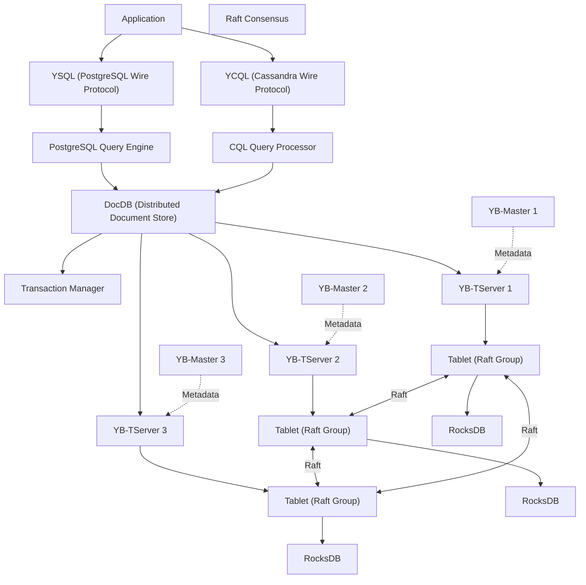
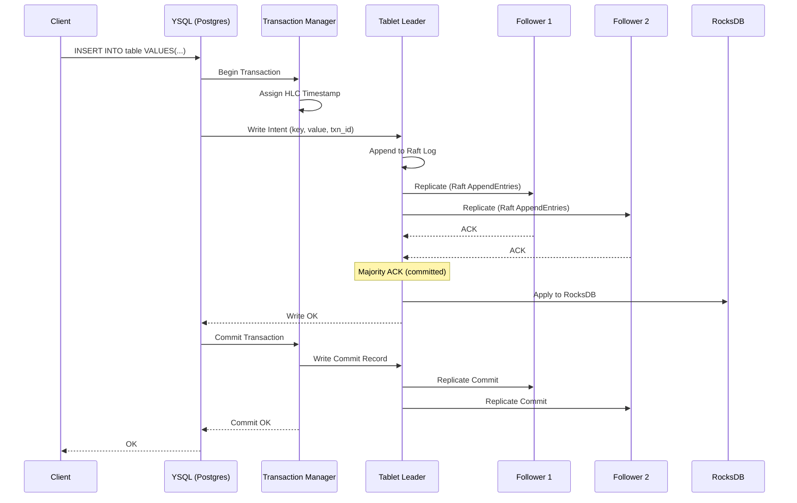
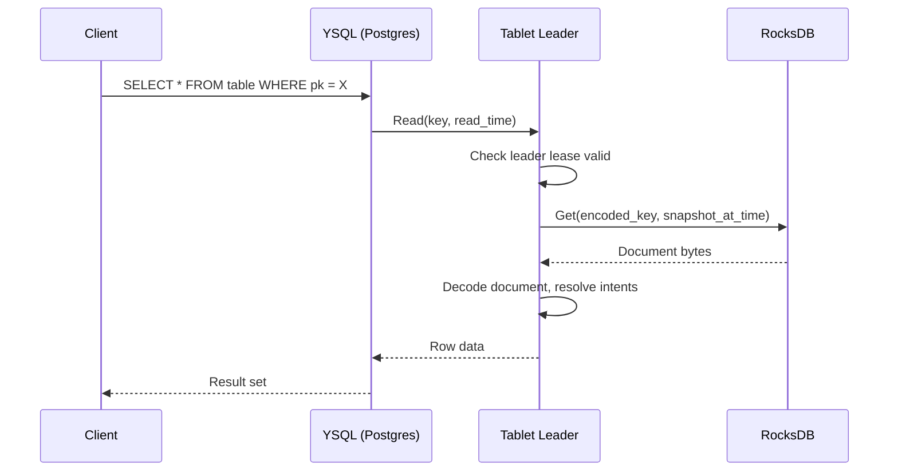
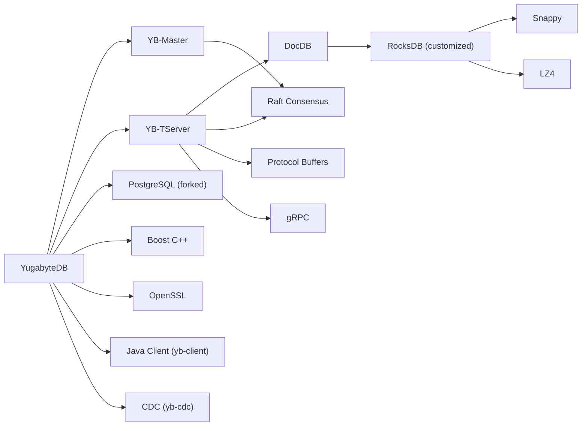

# YugabyteDB

> The cloud native distributed SQL database for mission-critical applications

| Metadata | |
|---|---|
| Repository | https://github.com/yugabyte/yugabyte-db |
| License | Apache 2.0 (core) / Polyform Free Trial (enterprise) |
| Primary Language | C / C++ |
| Category | Database |
| Analyzed Release | `v2025.1.3.1` (2026-02-06) |
| Stars (approx.) | 10,094 |
| Generated by | Claude Opus 4.6 (Anthropic) |
| Generated on | 2026-02-08 |

## Overview

YugabyteDB is a distributed SQL database designed for cloud-native, mission-critical applications that require high availability, horizontal scalability, and global data distribution. It combines a PostgreSQL-compatible SQL layer (YSQL) and a Cassandra-compatible NoSQL layer (YCQL) on top of DocDB, a custom distributed document storage engine built on a heavily modified version of RocksDB. Data is automatically sharded into tablets and replicated across nodes using the Raft consensus protocol, providing strong consistency and automatic failover.

Problems it solves:
- Single-region databases cannot survive zone or region failures; YugabyteDB provides multi-region, multi-cloud deployments with automatic failover
- Traditional RDBMS cannot horizontally scale writes; YugabyteDB distributes writes across shards using Raft consensus
- Application teams must choose between SQL (consistency) and NoSQL (scalability); YugabyteDB provides both via YSQL and YCQL on the same storage engine
- Distributed transactions across shards are complex; YugabyteDB provides transparent distributed ACID transactions with serializable isolation
- Data locality requirements vary by application; YugabyteDB supports geo-partitioning to pin data to specific regions

Positioning:
YugabyteDB is positioned in the distributed SQL (NewSQL) space alongside Google Spanner, CockroachDB, and TiDB. It differentiates through its dual API approach (PostgreSQL and Cassandra compatibility), its architecture inspired by Google Spanner with a Raft-based replication layer derived from Apache Kudu, and its use of a customized RocksDB as the per-node storage engine. Unlike CockroachDB which uses a custom SQL parser, YugabyteDB reuses the actual PostgreSQL query engine for maximum compatibility.

## Architecture Overview

YugabyteDB has a two-layer architecture: the query layer (YSQL for SQL, YCQL for NoSQL) and the storage layer (DocDB). YB-Master servers manage cluster metadata, tablet-to-node mapping, and DDL operations. YB-TServer processes host the tablet replicas, execute queries, and manage the local RocksDB instances. DocDB uses Raft consensus for replication and a hybrid logical clock (HLC) for distributed transaction ordering.

## Core Components

### YB-Master (`src/yb/master/`)
- Responsibility: Cluster metadata management including the catalog of tables, tablets, and their mapping to TServer nodes. Handles DDL operations (CREATE TABLE, ALTER TABLE), tablet splitting/merging, load balancing across TServers, and cluster-wide configuration. Runs as a Raft group of typically 3 or 5 masters for high availability.
- Key files: `catalog_manager.cc`/`.h` (central catalog management, the "brain" of the cluster), `catalog_entity_info.cc` (table and tablet metadata), `catalog_loaders.cc` (loading catalog from disk), `catalog_manager_bg_tasks.cc` (background maintenance), `cluster_balance.cc` (load balancer), `async_rpc_tasks.cc` (async tablet operations), `master_main.cc` (entry point).
- Design patterns: Raft consensus for master HA, registry pattern for catalog entities, background task scheduling for maintenance operations. The catalog manager is the single most complex component, handling table creation, tablet assignment, and schema changes.

### YB-TServer (`src/yb/tserver/`)
- Responsibility: Hosts tablet replicas, executes read/write operations, manages local RocksDB instances, participates in Raft replication, and communicates with masters for heartbeats and tablet assignments. Each TServer can host hundreds of tablet replicas.
- Key files: `tablet_server.cc`/`.h` (main server class), `tablet_server_main.cc` (entry point), `tserver_service.cc` (RPC service handling), `ts_tablet_manager.cc` (local tablet lifecycle management).
- Design patterns: RPC service pattern for client and inter-node communication, manager pattern for tablet lifecycle. The TServer registers with masters and receives tablet assignments.

### DocDB Storage Engine (`src/yb/docdb/`)
- Responsibility: The core document storage engine that stores all data as key-value documents on top of a customized RocksDB. Handles document encoding/decoding, conflict resolution for transactions, compaction filtering (for expired data and resolved intents), and both CQL and PostgreSQL data operations.
- Key files: `docdb.cc`/`.h` (core operations), `doc_write_batch.cc` (write batch assembly), `doc_reader.cc` (document reading), `doc_reader_redis.cc` (Redis-compatible reads for YEDIS), `doc_rowwise_iterator.cc` (SQL row iteration), `doc_pgsql_scanspec.cc` (PostgreSQL scan specifications), `conflict_resolution.cc` (transaction conflict detection), `docdb_compaction_context.cc` (custom RocksDB compaction), `deadlock_detector.cc`, `doc_vector_index.cc` (vector search support).
- Design patterns: Document model encoded into RocksDB's sorted key-value pairs, hybrid timestamp versioning for MVCC, intent-based transaction protocol with conflict resolution.

### Raft Consensus (`src/yb/consensus/`)
- Responsibility: Implements the Raft consensus protocol for replicating data across tablet replicas. Based on Apache Kudu's Raft implementation with enhancements including leader leases (for fast reads), pre-voting (to avoid disruption), and multi-Raft batching (to reduce RPC overhead when a node hosts many tablets).
- Key files: `raft_consensus.cc`/`.h` (core Raft state machine), `consensus.cc`/`.h` (consensus interface), `consensus_queue.cc` (log replication queue), `consensus_peers.cc` (peer management), `leader_election.cc` (election logic), `log.cc`/`.h` (write-ahead log), `log_cache.cc` (in-memory log cache), `log_reader.cc` (log reading), `peer_manager.cc` (peer lifecycle), `multi_raft_batcher.cc` (RPC batching across tablets), `leader_lease.h` (leader lease for linearizable reads).
- Design patterns: State machine replication, leader-based consensus with heartbeats, WAL for durability. Leader leases enable serving reads from the leader without a consensus round.

### Tablet (`src/yb/tablet/`)
- Responsibility: Represents a single shard of a table. Each tablet contains a RocksDB instance, participates in one Raft group, handles local read/write operations, manages its own compaction, and supports tablet splitting for dynamic resharding.
- Key files: Located in `src/yb/tablet/` with files for tablet lifecycle, operation application, and maintenance.
- Design patterns: Shard-per-tablet model, each tablet is an independent unit of replication, migration, and compaction.

### YSQL Query Layer (`src/postgres/`)
- Responsibility: A modified PostgreSQL server that serves as the SQL query processing layer. YugabyteDB uses the actual PostgreSQL source code (forked from PostgreSQL 11, upgraded to 15) with modifications to route storage operations to DocDB instead of the PostgreSQL heap storage.
- Key files: Located under `src/postgres/` as a modified PostgreSQL source tree with custom storage interface hooks.
- Design patterns: Fork-and-modify approach to PostgreSQL for maximum SQL compatibility. The query parser, optimizer, and executor are largely unmodified; only the storage access methods are redirected to DocDB.

## Data Flow

### Distributed Write Path

### Read Path with Leader Lease

## Key Design Decisions

### 1. Dual API: YSQL (PostgreSQL) + YCQL (Cassandra)
- Choice: Support both PostgreSQL wire protocol (full SQL with joins, transactions, indexes) and Cassandra Query Language (NoSQL with eventual consistency option) on the same storage engine.
- Rationale: Different workloads have different requirements. YSQL serves applications needing full ACID SQL, while YCQL serves applications needing high-throughput, low-latency NoSQL access. Both share DocDB, enabling a single operational platform.
- Trade-offs: Supporting two query languages doubles the API surface to maintain and test. The PostgreSQL integration is complex because the forked Postgres code must be carefully synced with upstream. YCQL may receive less development focus as YSQL is the primary differentiator.

### 2. Modified RocksDB as Per-Node Storage Engine
- Choice: Use a heavily customized fork of RocksDB rather than building a storage engine from scratch or using an alternative like WiredTiger.
- Rationale: RocksDB is a proven, high-performance LSM-tree engine. The customizations include hybrid timestamp-aware compaction, intent cleanup during compaction (via `docdb_compaction_filter_intents.cc`), and custom filter policies (`docdb_filter_policy.cc`).
- Trade-offs: Maintaining a RocksDB fork is expensive as upstream evolves. Custom compaction strategies add complexity. LSM trees have write amplification that can impact sustained write performance.

### 3. Raft Consensus with Leader Leases (Inspired by Spanner)
- Choice: Use Raft for replication with leader leases that allow the leader to serve linearizable reads without a consensus round, and use a hybrid logical clock (HLC) for transaction ordering instead of GPS/atomic clocks.
- Rationale: Raft is well-understood and provides strong consistency. Leader leases significantly reduce read latency by avoiding consensus for reads. HLC provides "good enough" time synchronization without specialized hardware (unlike Google Spanner's TrueTime).
- Trade-offs: Leader leases add complexity to failover (must wait for lease expiration). HLC requires reasonable clock synchronization between nodes (NTP is sufficient). Multi-Raft with many tablets per node requires batching via `multi_raft_batcher.cc` to manage RPC overhead.

### 4. Tablet-Based Sharding with Automatic Splitting
- Choice: Automatically shard tables into tablets (typically 1-N per table depending on size) that are distributed across TServer nodes, with automatic splitting when tablets grow too large.
- Rationale: Tablets are the unit of replication, migration, and load balancing. Automatic splitting ensures that hot tables are distributed across more nodes as they grow. The deterministic hash-based or range-based sharding ensures predictable key-to-tablet mapping.
- Trade-offs: Many small tablets increase per-tablet overhead (each has its own RocksDB instance, Raft group, and WAL). Tablet splitting and merging are complex operations that must maintain data availability during the process.

### 5. Forking PostgreSQL Source Code for YSQL
- Choice: Use the actual PostgreSQL source code (forked) rather than implementing a PostgreSQL-compatible parser/optimizer from scratch.
- Rationale: Provides extremely high SQL compatibility including extensions, stored procedures, triggers, and complex query optimization. Much less engineering effort than building a PostgreSQL-compatible engine from scratch.
- Trade-offs: Merging upstream PostgreSQL changes is a significant ongoing effort. The storage interface modifications are invasive and must be carefully maintained across PostgreSQL major version upgrades (currently supporting PostgreSQL 11 through 15).

## Dependencies

## Testing Strategy

YugabyteDB maintains an extensive testing infrastructure:

- C++ Unit Tests: Google Test-based tests colocated with source files (e.g., `raft_consensus-test.cc`, `consensus_queue-test.cc`, `leader_election-test.cc`, `compact_object_test.cc`, `log-test.cc`, `consensus_meta-test.cc`). Tests cover consensus, DocDB, master, and tablet components.
- Java Integration Tests: Located in `java/` directory, including `yb-cdc/src/test/java/` for CDC tests, `yb-client/` for client library tests. Uses JUnit framework.
- SQL Regression Tests: PostgreSQL's regression test suite adapted for YugabyteDB to verify SQL compatibility.
- Multi-Node Tests: Tests that spin up multiple TServers and masters to verify distributed behaviors like replication, failover, and tablet splitting.
- CDC Tests: `java/yb-cdc/src/test/java/org/yb/cdc/` contains tests for Change Data Capture including snapshot tests, datatype tests, and DDL tests.
- The build system uses CMake for C++ components and Maven for Java components, with Protocol Buffers for service definitions.

## Key Takeaways

1. YugabyteDB's architecture closely follows the Google Spanner model (distributed tablets with Raft consensus, a SQL layer on top) but makes it accessible without specialized hardware by using HLC instead of TrueTime and commodity servers instead of custom infrastructure. The `catalog_manager.cc` in YB-Master is the architectural centerpiece that orchestrates the entire distributed system.

2. The decision to fork actual PostgreSQL source code for the YSQL layer is a bold trade-off that provides unmatched SQL compatibility at the cost of significant maintenance burden. This approach enables existing PostgreSQL applications to migrate with minimal changes, a critical advantage over competitors that implement PostgreSQL compatibility from scratch.

3. DocDB's document model on top of RocksDB, combined with the intent-based transaction protocol in `conflict_resolution.cc` and `docdb_compaction_filter_intents.cc`, provides distributed ACID transactions with serializable isolation. The hybrid timestamp versioning in `src/yb/common/hybrid_time.h` and the Raft consensus in `src/yb/consensus/` together form the backbone that makes this possible across a globally distributed cluster.

## References

- Repository: https://github.com/yugabyte/yugabyte-db
- Architecture Documentation: https://docs.yugabyte.com/stable/architecture/
- DocDB Storage Layer: https://docs.yugabyte.com/preview/architecture/docdb/
- Raft Replication: https://docs.yugabyte.com/stable/architecture/docdb-replication/raft/
- YugabyteDB Architecture Overview (Vlad Mihalcea): https://vladmihalcea.com/yugabytedb-architecture/
- Database of Databases Entry: https://dbdb.io/db/yugabytedb
