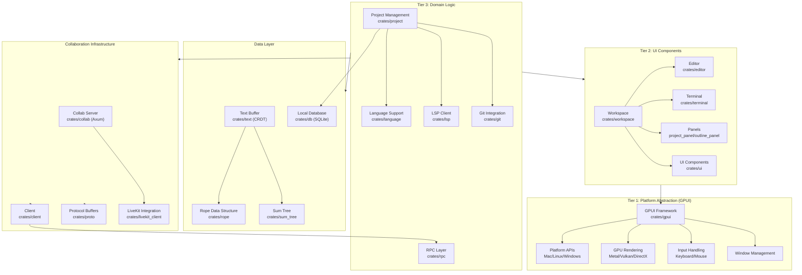
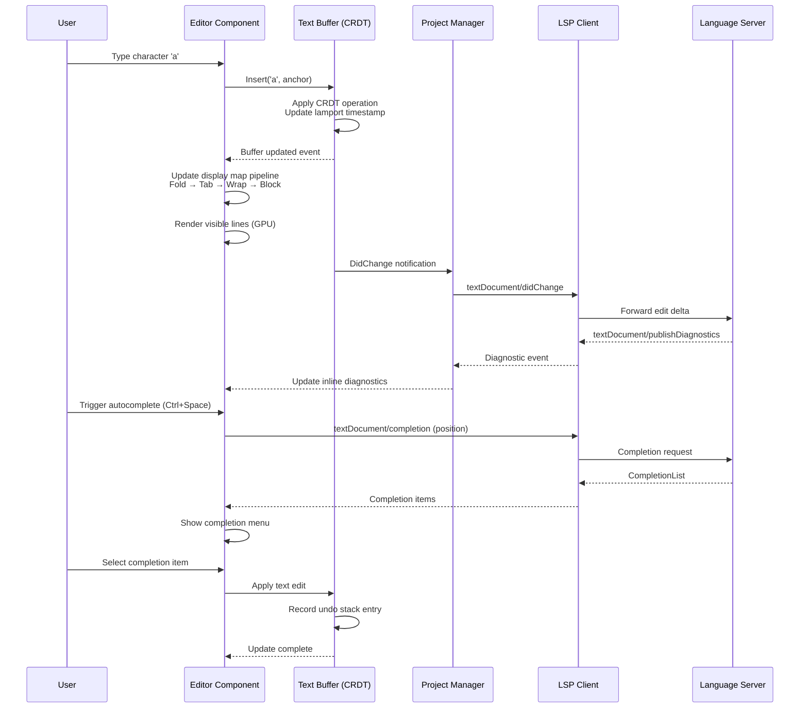
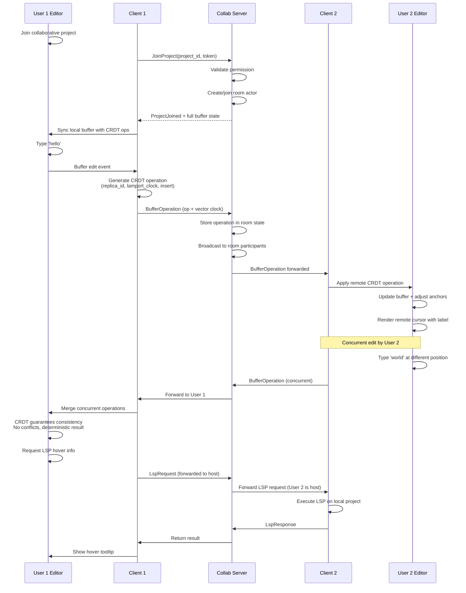
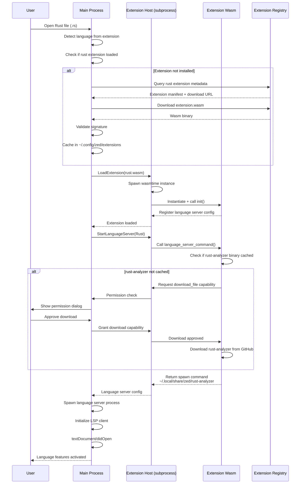
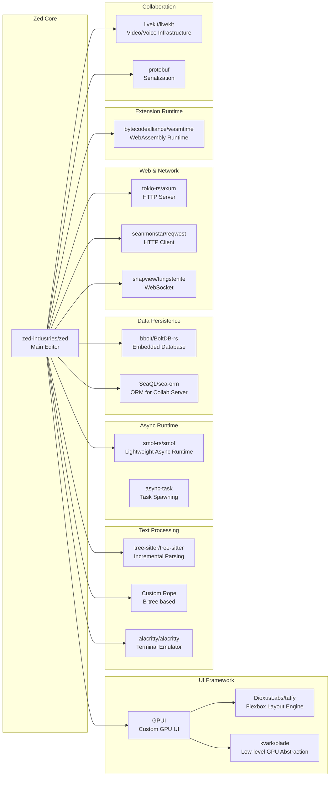

# Zed

> A high-performance, multiplayer code editor written in Rust with GPU-accelerated UI rendering

| Metadata | |
|---|---|
| Repository | https://github.com/zed-industries/zed |
| License | GPL-3.0-or-later (Editor), AGPL-3.0-or-later (Collab Server) |
| Primary Language | Rust |
| Analyzed Release | `v0.222.4` (2026-02-06) |
| Stars (approx.) | 74,948 |
| Generated by | Claude Sonnet 4.5 (Anthropic) |
| Generated on | 2026-02-08 |

## Overview

Zed is a next-generation code editor developed by the creators of Atom and Tree-sitter. It combines extreme performance with collaborative features, targeting 120 FPS responsiveness through GPU-accelerated rendering and Rust's zero-cost abstractions. The editor is built on GPUI, a custom UI framework that bypasses traditional CPU-bound UI toolkits.

Problems it solves:

- Editor latency and sluggishness in large codebases by leveraging GPU acceleration and aggressive parallelization
- Real-time collaborative editing with CRDT-based conflict resolution, allowing simultaneous editing without blocking
- Cross-platform native performance without JavaScript overhead or garbage collection pauses
- Extension system that uses WebAssembly for safe third-party code execution

Positioning:

Positioned as a modern alternative to VS Code and JetBrains IDEs, Zed differentiates itself through raw performance (Rust + GPU), native platform integration, and built-in collaboration features. It competes with VS Code on extensibility while offering performance comparable to Vim/Neovim, and includes first-class AI integration with multiple LLM providers.

## Architecture Overview

Zed employs a three-tier layered architecture separating platform concerns (Tier 1: GPUI), UI components (Tier 2: Workspace/Editor), and domain logic (Tier 3: Project/Language/LSP). The codebase is organized as a Cargo workspace with approximately 200 crates, enabling modular development and parallel compilation.

## Core Components

### GPUI Framework (`crates/gpui`)

- Responsibility: GPU-accelerated, cross-platform UI framework providing windowing, input handling, and declarative/imperative rendering
- Key files: `crates/gpui/src/app.rs`, `crates/gpui/src/window.rs`, `crates/gpui/src/element.rs`, `crates/gpui/src/platform.rs`
- Design patterns: Hybrid immediate/retained mode rendering, Entity-Component pattern, Platform abstraction with trait objects

GPUI is the foundation of Zed's architecture, implementing a custom UI framework that directly utilizes GPU for all rendering operations targeting 120 FPS. It employs a three-register architecture: Entity system for state management (similar to Rc<RefCell> but with global context), View system for declarative UI (implementing the Render trait), and Element system for imperative low-level rendering control.

The framework abstracts platform-specific APIs through trait-based interfaces: Metal on macOS (using the metal-rs crate), Vulkan on Linux (via Blade graphics), and DirectX on Windows. This enables zero-copy rendering directly to GPU surfaces without intermediate framebuffers. The hybrid rendering model allows Views to emit Element trees declaratively while Elements can drop down to imperative rendering for complex cases like code editor text layout.

Key innovations include frame scheduling synchronized with display refresh rates (CADisplayLink on macOS, equivalent APIs on other platforms), input event coalescing to prevent frame drops under heavy input load, and a sophisticated action system that maps keyboard shortcuts to typed Rust structs rather than string commands.

### Editor Component (`crates/editor`)

- Responsibility: Core text editing functionality including display mapping, selections, multi-cursor support, and inline diagnostics
- Key files: `crates/editor/src/editor.rs`, `crates/editor/src/display_map.rs`, `crates/editor/src/selections.rs`
- Design patterns: Display-map pipeline architecture, Anchor-based position tracking, Streaming iterator pattern

The Editor is Zed's most complex component, implementing a sophisticated multi-stage pipeline that transforms raw buffer content into rendered output. The display map pipeline consists of fold map (code folding), tab map (tab expansion), wrap map (soft wrapping), block map (inline widgets), and inlay map (inline hints). Each stage processes the text incrementally and can be updated independently.

Position tracking uses a novel anchor-based system where cursor positions and selections reference logical positions in the underlying CRDT rather than absolute line/column coordinates. This enables selections to remain valid across concurrent edits in collaborative sessions. When remote edits arrive, anchors automatically adjust to maintain semantic meaning (e.g., "end of this function" rather than "line 42").

The Editor integrates tightly with LSP for features like diagnostics, code actions, hover information, and completions. Diagnostics are rendered inline as overlays using GPUI's block decoration API. The component supports Vim emulation through a separate vim crate that hooks into the editor's command system.

Performance optimizations include view frustum culling (only rendering visible lines), incremental syntax highlighting using Tree-sitter's edit API, and aggressive parallelization of text processing operations across CPU cores. Benchmarks show consistent 60+ FPS during typing in files with 100,000+ lines.

### Project Management (`crates/project`)

- Responsibility: Project-wide operations including file system watching, LSP server lifecycle, diagnostics aggregation, and symbol indexing
- Key files: `crates/project/src/project.rs`, `crates/project/src/project_settings.rs`, `crates/project/src/lsp_store.rs`
- Design patterns: Repository pattern, Event-driven architecture, Async state machine

The Project component serves as the domain model layer, coordinating between the file system, LSP servers, and UI components. It maintains a collection of Worktrees (crates/worktree) representing file system roots, each with its own background file watcher. File system events are debounced and batched to prevent excessive reindexing.

LSP server lifecycle management is sophisticated: servers are started on-demand per language per worktree, with automatic restart on crash and graceful shutdown. The component handles LSP initialization sequences, capability negotiation, and workspace/didChangeConfiguration updates. Multiple editors can share the same language server instance, with request multiplexing handled transparently.

Symbol indexing uses a background task system to build a searchable database of code symbols (functions, classes, etc.) across the entire project. The index is persisted to SQLite (crates/db) and incrementally updated as files change. Search queries execute in constant time regardless of project size by leveraging FTS5 full-text search indices.

Remote development is supported through an RPC protocol: a Project can be local (backed by the local file system) or remote (backed by RPC calls to a zed remote-server process running on the dev machine). The abstraction is seamless—LSP servers run on the remote host while UI renders locally with sub-100ms latency.

### Text Buffer with CRDT (`crates/text`)

- Responsibility: CRDT-based text buffer supporting concurrent editing with eventual consistency
- Key files: `crates/text/src/buffer.rs`, `crates/text/src/anchor.rs`, `crates/text/src/operation_queue.rs`
- Design patterns: CRDT (Conflict-free Replicated Data Type), Operational transformation, Logical clock

Zed's text buffer implements a custom CRDT algorithm that represents text as a sequence of insertions and deletions with vector clock timestamps. Each character is assigned a unique ID (replica_id, lamport_timestamp, offset) that remains stable across edits. This enables conflict-free merging of concurrent edits without a central authority.

The buffer is internally represented using a Rope data structure (crates/rope) backed by B-trees, providing O(log n) edits and O(1) cloning via structural sharing. Anchors reference logical positions in the CRDT rather than byte offsets, automatically adjusting as edits are applied. This is critical for collaborative editing where cursors must track semantic positions.

Operation queues maintain the total ordering of edits across replicas using vector clocks. When a remote edit arrives, it's inserted into the operation queue according to its timestamp, and the buffer is replayed from that point. The undo stack is CRDT-aware, allowing users to undo their own edits without affecting concurrent collaborator edits.

The implementation handles complex edge cases like concurrent deletion of the same range (idempotent), undo/redo in collaborative sessions (per-user undo stacks), and split cursors across line boundaries. Performance is optimized through operation batching and incremental buffer updates rather than full recomputation.

### Collaboration Server (`crates/collab`)

- Responsibility: Real-time collaboration infrastructure including room management, presence, voice chat, and AI integration
- Key files: `crates/collab/src/lib.rs`, `crates/collab/src/db.rs`, `crates/collab/src/api.rs`
- Design patterns: Event sourcing, CQRS, Async-actor pattern

The collaboration server is a separate Rust binary built on the Axum web framework and PostgreSQL (via SeaORM). It implements the server-side logic for channels (persistent chat rooms), projects (shared editing sessions), and calls (voice/video via LiveKit). Clients connect via WebSocket and communicate using Protocol Buffers (crates/proto).

Architecture follows event sourcing: all mutations generate events stored in Postgres, enabling audit logs and replaying room state. The server broadcasts events to connected clients who update their local state. Database operations use optimistic locking (versioned rows) to handle concurrent mutations.

Room state management uses an in-memory actor model: each room has a RoomManager actor holding connected participants, shared projects, and screen shares. Actors process messages sequentially avoiding locks. When a client joins, the server sends a snapshot of current room state followed by incremental updates.

LSP requests in collaborative sessions are proxied through the room host: follower clients send LSP requests to the server, which forwards to the host, executes against the host's project, and returns results. This centralizes LSP server instances (one per project) rather than requiring each collaborator to run their own.

LiveKit integration handles voice/video/screen sharing: the collab server generates short-lived LiveKit tokens, clients connect to LiveKit rooms directly for media, while text editing flows through the Zed collab server. This hybrid architecture keeps media routing efficient while centralizing permission control.

### Extension System (`crates/extension`, `crates/extension_host`)

- Responsibility: WebAssembly-based extension runtime providing third-party language support, themes, and slash commands
- Key files: `crates/extension/src/extension_manifest.rs`, `crates/extension_host/src/extension_host.rs`, `crates/extension_api`
- Design patterns: Sandbox pattern, Host-Guest communication, Capability-based security

Zed's extension system uses WebAssembly (via wasmtime) to run untrusted code safely. Extensions are written in Rust (compiled to wasm32-wasip1) and communicate with the host via a typed API defined in crates/extension_api. This design prevents extensions from accessing arbitrary system APIs while enabling powerful customization.

Extensions can contribute language servers, Tree-sitter grammars, snippets, themes, and slash commands (AI assistant integrations). The extension host (separate process) loads extension wasm modules and proxies capability requests (e.g., spawn LSP server, read file) back to the main process for permission checks.

Extension distribution uses an extension registry hosted by Zed Industries. Extensions are versioned, signed, and cached locally. The extension host process can be killed/restarted without affecting the main editor, providing fault isolation. If an extension crashes, only that extension's features are affected.

Language server integration allows extensions to specify language server download URLs and spawn commands. The extension host handles downloads, caching, and lifecycle management. For example, the rust-analyzer extension downloads the language server binary on first use and keeps it updated.

Tree-sitter grammar loading supports both bundled grammars (compiled into Zed) and extension-provided grammars (dynamically loaded wasm modules). The extension API provides hooks for syntax highlighting, code navigation, and folding ranges based on Tree-sitter AST queries.

### Workspace (`crates/workspace`)

- Responsibility: Window-level UI container managing panes, panels, modal dialogs, and global actions
- Key files: `crates/workspace/src/workspace.rs`, `crates/workspace/src/pane.rs`, `crates/workspace/src/dock.rs`
- Design patterns: Composite pattern (Pane tree), MVC architecture, Command pattern

The Workspace is the top-level UI container in each Zed window, implementing a flexible pane system with split support, tabs, and dockable panels. Panes form a tree structure (binary splits) where leaves are ItemViews (Editor, Terminal, Image Viewer, etc.). Users can split panes horizontally/vertically, drag tabs between panes, and resize splits.

Docks (left, right, bottom) host panels like project tree, outline, diagnostics, and terminal. Panels can be toggled, resized, and reordered. Dock state persists across sessions in SQLite (crates/db), restoring the previous layout on relaunch.

Modal systems include command palette (fuzzy search over all actions), file finder (fuzzy file search), go-to-line, and various picker UIs. Modals are implemented as overlay layers that capture keyboard focus but don't block the underlying UI updates (unlike traditional OS modal dialogs).

Global actions flow through the Workspace's focus system: keyboard shortcuts dispatch typed Action structs, which are routed to the focused UI element. If unhandled, actions bubble up the element tree until caught by a handler. This enables context-sensitive keyboard shortcuts (e.g., vim motions only active when editor is focused).

Session management serializes workspace layout including open files, cursor positions, split configuration, and panel states. On restart, Zed asynchronously restores the previous session, progressively opening files as metadata loads. Unsaved buffers are persisted and recovered after crashes.

## Data Flow

### Code Editing with LSP Integration

### Collaborative Editing Flow

### Extension Loading and Language Server Activation

## Key Design Decisions

### 1. Custom GPU-Accelerated UI Framework (GPUI)

- Choice: Building a custom UI framework from scratch instead of using existing solutions like egui, iced, or gtk-rs
- Rationale: Existing Rust UI frameworks couldn't achieve the 120 FPS target for a code editor. Traditional CPU-bound frameworks bottleneck on layout and rasterization. GPUI bypasses this by rendering text glyphs directly to GPU textures, using compute shaders for text shaping, and minimizing CPU-GPU roundtrips. Platform integration (macOS menu bars, Linux Wayland protocols) requires deep native API access
- Trade-offs: Massive engineering investment (40%+ of codebase). Requires platform-specific code for macOS/Linux/Windows. Third-party UI components don't exist—every widget must be built from scratch. Learning curve for contributors familiar with web or native UI frameworks

### 2. CRDT-Based Text Buffers for Collaboration

- Choice: Implementing a custom CRDT (Conflict-free Replicated Data Type) for text buffers rather than using operational transformation (OT) or cloud-based diffing
- Rationale: CRDTs provide strong eventual consistency without requiring a central authority. This enables local-first editing where users can type without waiting for server acknowledgment, with offline editing support and conflict resolution happening automatically. Unlike OT, CRDTs don't require reliable ordering of operations. The anchor-based position tracking naturally extends to collaborative cursors and selections
- Trade-offs: CRDT metadata overhead (each character has an ID and timestamp). More complex than simple string buffers. Requires careful handling of undo/redo in collaborative contexts. Tombstones for deleted characters must be garbage collected. Cannot use standard diff algorithms—must work with CRDT operations

### 3. WebAssembly Extension Sandbox

- Choice: Using WebAssembly and wasmtime for extension runtime instead of native dynamic libraries (like VS Code's Node.js extensions) or scripting languages
- Rationale: Wasm provides strong sandboxing: extensions cannot access arbitrary system APIs, file system, or network without explicit host-granted capabilities. This prevents malicious extensions from stealing credentials or exfiltrating code. Wasm is platform-agnostic (same extension.wasm runs on macOS/Linux/Windows). Faster startup than Node.js V8 engine. Extension crashes isolated to extension host subprocess
- Trade-offs: More restrictive than full native code. Requires compile-to-Wasm toolchain (Rust, TinyGo, C/C++). Cannot reuse npm ecosystem like VS Code. Capability-based API requires careful design for ergonomics. Some language servers need workarounds (extensions spawn native binaries using host capabilities)

### 4. Monorepo with ~200 Crates

- Choice: Organizing codebase as a Cargo workspace with granular crate boundaries rather than a single large crate
- Rationale: Fine-grained crate structure enables parallel compilation—Cargo compiles independent crates concurrently using all CPU cores. Clear module boundaries prevent architectural violations (e.g., gpui cannot depend on editor, enforced by Cargo). Makes testing easier (test only relevant crates). Enables code reuse (rope crate used by multiple consumers). Optional features (test-support) isolate test code
- Trade-offs: Navigating 200 crates is overwhelming for newcomers. Dependency management complexity (workspace-level version pinning required). Cargo workspace rebuild times still long (10+ minutes full rebuild). Circular dependencies must be broken (sometimes forcing awkward API designs)

### 5. Tree-sitter for Syntax Highlighting and Code Navigation

- Choice: Using Tree-sitter incremental parsing for syntax highlighting instead of regex-based TextMate grammars or IDE-grade parsers
- Rationale: Tree-sitter provides accurate syntax trees (not just tokenization) enabling semantic code navigation, folding, and structured editing. Incremental parsing handles edits in O(edits) time rather than reparsing the entire file. Error recovery allows highlighting of partially invalid code. WASM-based grammars are sandboxed and platform-agnostic. Same grammars used by GitHub for code highlighting
- Trade-offs: Tree-sitter grammars harder to write than TextMate regex patterns (requires grammar authoring skills). Parser errors on cutting-edge language features (grammar update lag). Query language for highlights has limitations compared to full semantic analysis. Binary size increase (bundling grammars)

### 6. SQLite for Local State Persistence

- Choice: Using SQLite (via sqlez crate) for workspace state, key-value settings, and symbol indices
- Rationale: Reliable ACID transactions for editor state. Efficient indexing for symbol search (FTS5 full-text search). Single-file database simplifies backups and synchronization. Battle-tested concurrency control. Much faster than JSON file I/O for large datasets. Migrations handled via schema versioning
- Trade-offs: SQLite lock contention on concurrent writes (mitigated by async I/O and batching). Schema migrations required for upgrades. Database corruption on unclean shutdown (mitigated by WAL mode). Overhead for simple key-value lookups compared to in-memory data structures

### 7. Protocol Buffers for RPC Communication

- Choice: Using Protocol Buffers (protobuf) for client-server and inter-process communication instead of JSON, MessagePack, or Cap'n Proto
- Rationale: Protobuf provides schema evolution (forward/backward compatibility), compact binary encoding (smaller than JSON), and code generation for type-safe APIs. Efficient deserialization (faster than JSON parsing). Wide tooling support. Well-understood in industry
- Trade-offs: Less human-readable than JSON during debugging (requires protobuf decoder). Schema updates require recompilation. Protobuf v2/v3 compatibility issues. Code generation step adds build complexity. Not self-describing (requires .proto files to interpret messages)

## Dependencies

## Testing Strategy

Zed employs a comprehensive multi-layered testing approach balancing unit tests, integration tests, and visual regression tests.

Unit tests: Each crate contains tests in adjacent test modules or _test.rs files. The gpui crate provides test-support features enabling headless UI testing without spawning real windows. Mock implementations of file system (fs::FakeFs), HTTP clients (http_client::FakeHttpClient), and language servers (lsp::FakeLanguageServer) enable deterministic testing. Crates use the test-support feature flag pattern to avoid test code in release builds.

Integration tests: The collab crate has extensive integration tests in crates/collab/tests that spawn real collaboration servers, simulate multiple clients, and verify CRDT convergence. Tests use SQLite in-memory databases for isolation. Project tests in crates/project/tests verify LSP integration, file watching, and symbol indexing against real language servers.

Visual regression tests: Zed includes visual tests (--features visual-tests) that capture screenshots of real UI components and compare against baseline images. Tests require macOS Screen Recording permission and use the scap crate for screen capture. Baselines are gitignored and generated locally to avoid repository bloat. Tests verify pixel-perfect rendering of complex UI like the editor, terminal, and markdown preview.

Property-based testing: Some components use quickcheck-style property testing to verify invariants. For example, CRDT tests generate random sequences of concurrent operations and verify eventual consistency. Rope tests ensure sum tree invariants hold after arbitrary edits.

Benchmarks: The repository includes criterion-based benchmarks in crates/*/benches for performance-critical paths. Key benchmarks include editor rendering (target: 120 FPS), buffer editing (target: <1ms latency), syntax highlighting, and file system scanning. CI tracks benchmark regressions.

CI/CD: GitHub Actions runs tests on macOS, Linux, and Windows with matrix testing across platforms. CI includes cargo test --workspace, integration tests, clippy lints, rustfmt checks, and license validation (cargo-about). Releases are built via GitHub Actions with codesigning on macOS and Windows. Crash reports are collected via minidumper crate and uploaded to Zed's telemetry service.

## Key Takeaways

1. GPU acceleration for UI responsiveness: Bypassing CPU-bound UI toolkits by rendering directly to GPU textures achieves unprecedented responsiveness for code editors. The insight applies to any latency-sensitive desktop application where frame rate matters (DAWs, CAD tools, creative software). The trade-off is engineering complexity, but the performance gain is non-negotiable for tools users spend hours in daily

2. CRDTs for local-first collaboration: Using CRDTs instead of operational transformation enables offline-capable, real-time collaboration without central coordination. This architecture generalizes beyond text editors to any collaborative document editing (diagrams, spreadsheets, data structures). The key is designing anchor-based references that maintain semantic meaning across concurrent edits

3. WebAssembly as safe extension runtime: Wasm provides the security of sandboxing with the performance of native code. This pattern is applicable to any application needing third-party extensibility without full system access (browsers already do this). The capability-based API design is critical—extensions should request specific permissions rather than having blanket access

4. Monorepo with granular crate boundaries: Fine-grained module boundaries enforced by Cargo's dependency system prevent architectural decay while enabling parallel compilation. This applies to any large Rust codebase. The pattern balances modularity with discoverability—too many crates overwhelms, too few loses parallelism

5. Hybrid immediate/retained mode rendering: GPUI's model where Views are declarative but Elements are imperative provides flexibility: simple UI is easy (declarative), complex rendering is powerful (imperative). This pattern applies to any UI framework targeting both application developers and framework authors. It's similar to React (declarative) plus Canvas API (imperative)

6. Tree-sitter for incremental parsing: Using an incremental parser that survives errors enables syntax features (highlighting, folding, navigation) without requiring compilable code. This insight applies to any developer tool—users work with invalid code while typing. Tree-sitter's WASM portability and error recovery make it the right abstraction level

7. Platform abstraction with Rust traits: GPUI abstracts macOS/Linux/Windows using trait objects (dyn Platform, dyn Window), enabling 90%+ code sharing with platform-specific backends. This demonstrates Rust traits as effective abstraction boundaries for cross-platform code, preferable to #[cfg] conditional compilation which scatters platform logic

## References

- [Zed Official Website](https://zed.dev/)
- [Zed Documentation](https://zed.dev/docs)
- [GPUI Framework Documentation](https://www.gpui.rs/)
- [Zed GitHub Repository](https://github.com/zed-industries/zed)
- [GPUI Technical Overview](https://beckmoulton.medium.com/gpui-a-technical-overview-of-the-high-performance-rust-ui-framework-powering-zed-ac65975cda9f)
- [DeepWiki - zed-industries/zed](https://deepwiki.com/zed-industries/zed)
- [Tree-sitter](https://tree-sitter.github.io/tree-sitter/)
- [Zed Blog](https://zed.dev/blog)
