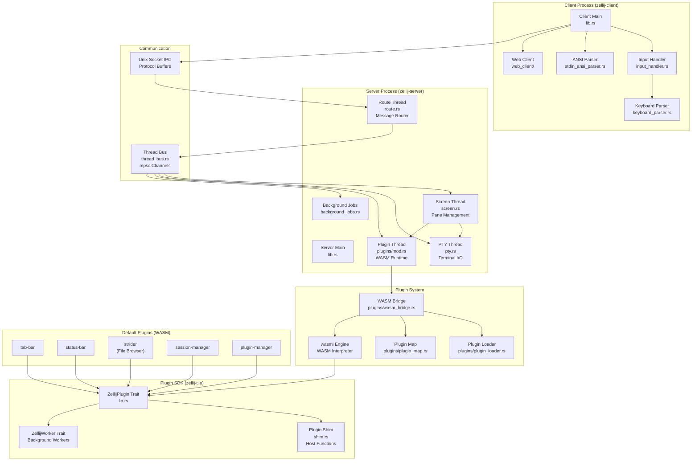
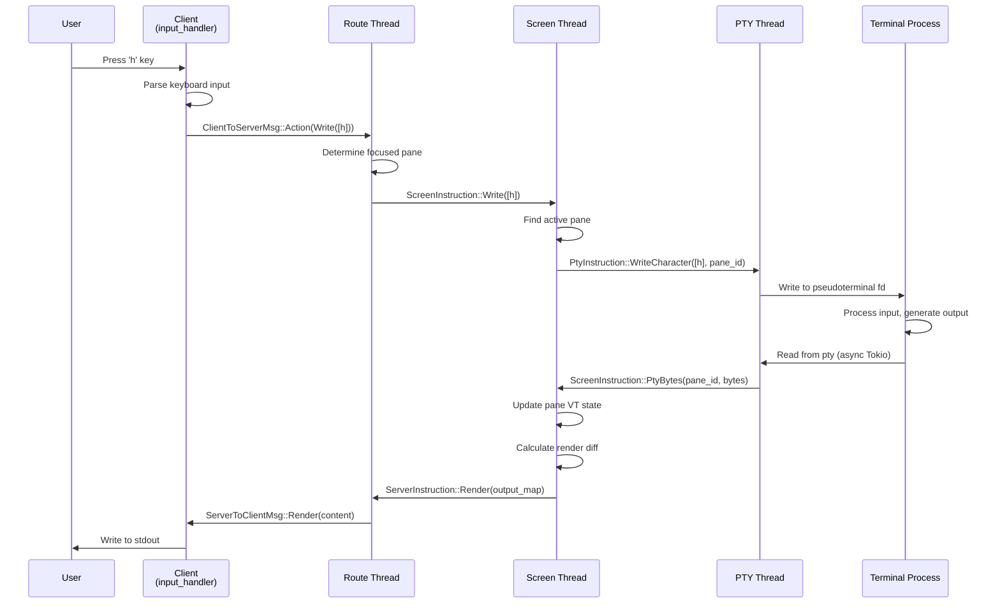
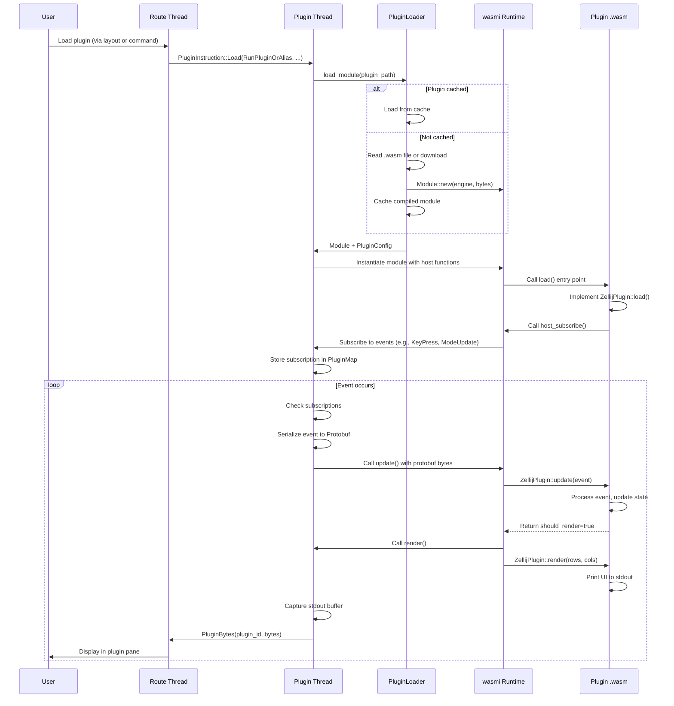
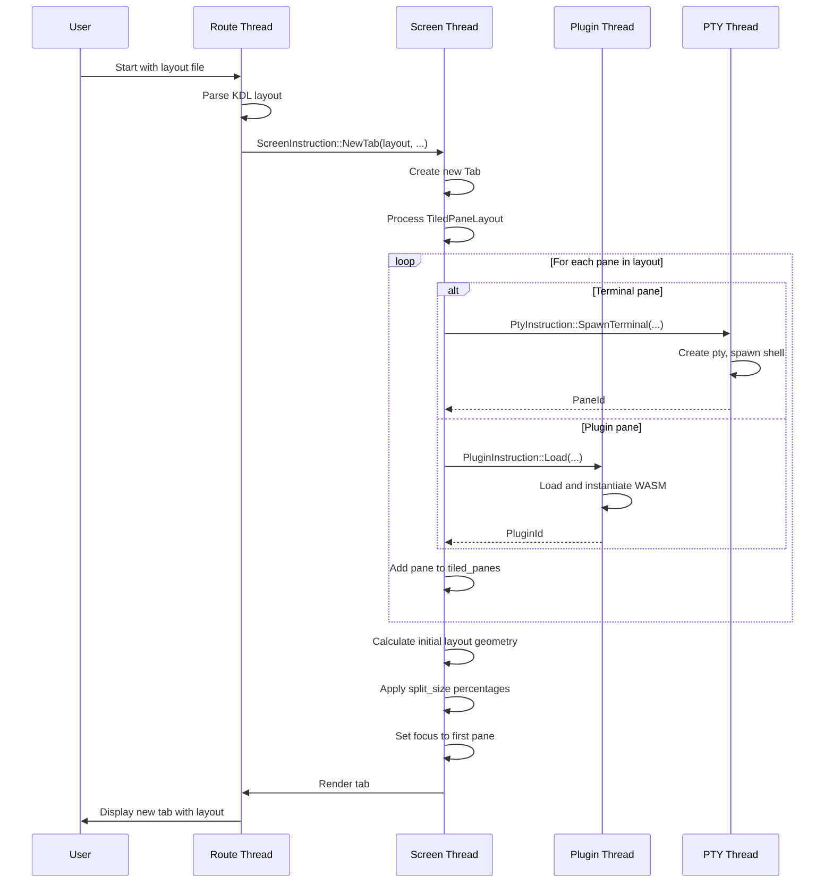
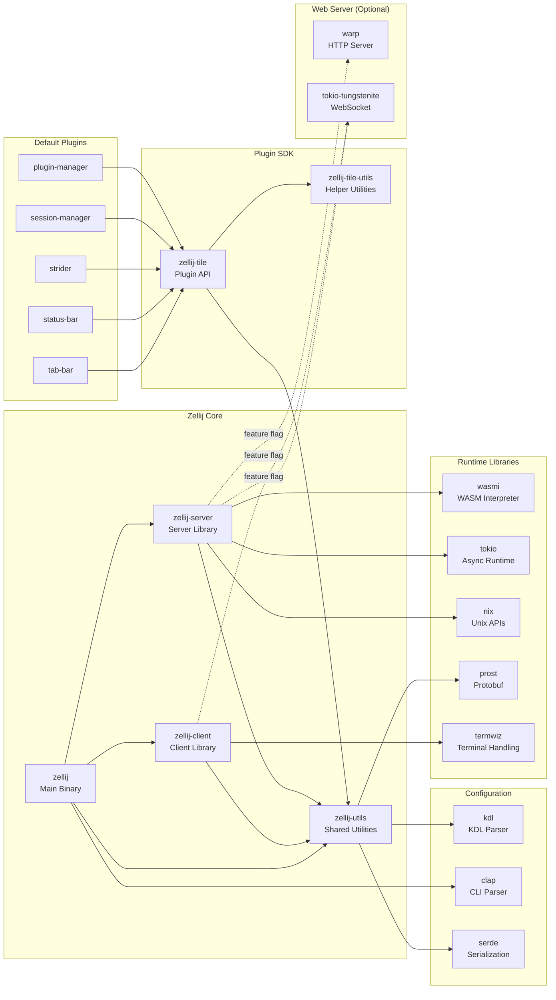

# Zellij

> A terminal workspace with batteries included - a modern terminal multiplexer featuring WebAssembly plugins and collaborative workflows

| Metadata | |
|---|---|
| Repository | https://github.com/zellij-org/zellij |
| License | MIT |
| Primary Language | Rust |
| Category | Editor / Terminal |
| Analyzed Release | `v0.43.1` (2025-08-08) |
| Stars (approx.) | 28,826 |
| Generated by | Claude Sonnet 4.5 (Anthropic) |
| Generated on | 2026-02-08 |

## Overview

Zellij is a modern terminal multiplexer (similar to tmux or screen) that provides a workspace aimed at developers and operations-oriented users. It features floating and stacked panes, layouts, a WebAssembly-based plugin system, and a built-in web client that makes terminal access optional.

Problems it solves:

- Providing a multiplexer with excellent out-of-the-box UX while maintaining powerful customization for advanced users
- Enabling plugin development in any language that compiles to WebAssembly through a sandboxed runtime
- Supporting true multiplayer collaboration with multiple users simultaneously editing and working in the same session
- Offering unique pane management features like floating panes, stacked panes, and flexible layouts

Positioning:

Zellij positions itself as a next-generation terminal multiplexer that doesn't sacrifice simplicity for power. Unlike tmux (written in C, harder to extend) or screen (legacy), Zellij embraces modern architecture with Rust, WASM plugins, and collaborative features. It competes with tools like tmux and Zellux but offers a more accessible configuration system and extensibility model.

## Architecture Overview

Zellij employs a client-server architecture with a multi-threaded server design. The server runs multiple dedicated threads (PTY management, screen rendering, plugin runtime, routing) that communicate via message-passing channels. Plugins run in isolated WASM runtimes using the wasmi interpreter, communicating with the host through Protocol Buffers.

## Core Components

### Client Layer (`zellij-client/src/lib.rs`)

- Responsibility: Terminal input capture, ANSI parsing, and IPC communication with server
- Key files: `zellij-client/src/lib.rs`, `zellij-client/src/input_handler.rs`, `zellij-client/src/keyboard_parser.rs`
- Design patterns: Event loop pattern, Parser pattern

The client is a thin layer that captures terminal input (keyboard, mouse, resize events), parses incoming ANSI sequences from stdin, and communicates with the server via Unix domain sockets. The `input_loop` function runs in a dedicated thread, reading from termwiz's `InputEvent` stream and sending messages to the server. The client also handles rendering output received from the server directly to stdout.

The client supports multiple modes: standard CLI client, web client (when web_server_capability feature is enabled), and watch mode for observing sessions without interaction. The web client uses WebSocket communication instead of Unix sockets.

### Server Main (`zellij-server/src/lib.rs`)

- Responsibility: Session lifecycle management and thread orchestration
- Key files: `zellij-server/src/lib.rs`, `zellij-server/src/thread_bus.rs`
- Design patterns: Thread-per-subsystem pattern, Message-passing concurrency

The server process spawns five main threads at startup:

1. PTY thread - manages pseudoterminal allocation and I/O
2. Screen thread - handles pane layout, rendering, and state management
3. Plugin thread - runs the WASM runtime and manages plugin lifecycle
4. Route thread - routes messages between client and other threads
5. Background jobs thread - handles async tasks like config watching

Communication between threads uses typed mpsc channels wrapped in the `Bus` abstraction (`thread_bus.rs`). Each thread has a dedicated instruction enum (e.g., `ScreenInstruction`, `PtyInstruction`) for type-safe message passing.

### Route Thread (`zellij-server/src/route.rs`)

- Responsibility: Message routing between client IPC and server threads
- Key files: `zellij-server/src/route.rs`
- Design patterns: Message router pattern, Command pattern

The route thread (`route_thread_main`) receives messages from clients via IPC and dispatches them to appropriate server threads. It maintains client session state, handles action blocking/unblocking (for CLI commands that wait for completion), and manages the `NotificationEnd` mechanism for asynchronous action completion signaling.

User actions are converted from `Action` enums to thread-specific instructions. For example, a NewPane action generates `ScreenInstruction::NewPane` and `PtyInstruction::SpawnTerminal` messages sent to respective threads.

### Screen Thread (`zellij-server/src/screen.rs`)

- Responsibility: Pane management, layout computation, and rendering pipeline
- Key files: `zellij-server/src/screen.rs`, `zellij-server/src/tab/mod.rs`, `zellij-server/src/panes/`
- Design patterns: Composite pattern (panes), State pattern (floating/tiled)

The screen thread maintains the session's visual state: tabs, panes (terminal and plugin), layouts, and rendering. It handles:

- Pane lifecycle (creation, closing, resizing)
- Focus management and pane navigation
- Layout computation (tiled, floating, stacked modes)
- Rendering coordination with plugins and terminals
- Per-client view differences (multiple users can have different focused panes)

Each tab contains collections of tiled panes, floating panes, and suppressed panes (stacked mode). The screen thread calculates pane positions and sizes, generates render instructions, and sends output to clients via the server thread.

### PTY Thread (`zellij-server/src/pty.rs`)

- Responsibility: Pseudoterminal allocation and terminal I/O multiplexing
- Key files: `zellij-server/src/pty.rs`, `zellij-server/src/pty_writer.rs`
- Design patterns: I/O multiplexing pattern, Async runtime (Tokio)

The PTY thread manages terminal processes using the nix crate's pty APIs. It spawns shell processes (or arbitrary commands) in pseudoterminals, reads their output asynchronously using Tokio, and sends data to the screen thread for rendering.

A separate PTY writer thread handles writing user input to terminal file descriptors. This separation prevents blocking during write operations. The PTY thread monitors process exit codes and handles terminal lifecycle events (suspension, termination).

### Plugin System (`zellij-server/src/plugins/`)

- Responsibility: WASM plugin loading, runtime management, and host function interface
- Key files: `zellij-server/src/plugins/wasm_bridge.rs`, `zellij-server/src/plugins/plugin_loader.rs`, `zellij-server/src/plugins/plugin_map.rs`
- Design patterns: Bridge pattern, Sandbox pattern, Actor model

The plugin system uses wasmi (a WebAssembly interpreter) to run plugins in isolated environments. Key components:

- WasmBridge: Main orchestrator managing plugin lifecycle, event distribution, and permissions
- PluginLoader: Compiles .wasm files into wasmi Modules, handles caching and downloading from URLs
- PluginMap: Maintains running plugin instances with their environments, subscriptions, and state
- Plugin workers: Separate WASM entry points for long-running background tasks

Plugins communicate with the host through:

1. Host functions (exported Rust functions callable from WASM) defined in `zellij_exports.rs`
2. Event updates pushed to plugins via Protocol Buffers serialization
3. Stdin/stdout for passing data (read via `wasi_read_string`, write via `wasi_write_object`)

Each plugin has isolated file system access, dedicated data directories, and permission-gated capabilities (e.g., filesystem access, command execution).

### Plugin SDK (`zellij-tile/src/lib.rs`)

- Responsibility: Rust API for developing Zellij plugins
- Key files: `zellij-tile/src/lib.rs`, `zellij-tile/src/shim.rs`
- Design patterns: Trait-based plugin pattern, Macro-based registration

The zellij-tile crate provides the plugin development API:

- `ZellijPlugin` trait: Implement `load()`, `update()`, and `render()` methods
- `register_plugin!` macro: Generates WASM entry points and manages plugin state
- `ZellijWorker` trait: For background worker implementation
- Shim functions: Wrapper API for calling host functions (e.g., `open_file()`, `set_timeout()`)

Plugins render by printing to stdout. The host captures this output and displays it in the plugin's pane. Protocol Buffers are used for structured data exchange (events, configuration, pipe messages).

Example plugins included:

- tab-bar: Displays tab navigation
- status-bar: Shows session status and keybind hints
- strider: File browser with directory navigation
- session-manager: Session creation and management UI
- plugin-manager: Install/update plugins from repositories

### Data Serialization (`zellij-utils/`)

- Responsibility: Shared types, IPC protocol definitions, and utility functions
- Key files: `zellij-utils/src/ipc.rs`, `zellij-utils/src/data.rs`, `zellij-utils/src/input/`
- Design patterns: Protocol Buffers for IPC, Shared library pattern

zellij-utils is a workspace crate containing:

- IPC message definitions (`ClientToServerMsg`, `ServerToClientMsg`)
- Core data types (`Event`, `Action`, `LayoutInfo`, `PaneId`)
- Configuration parsing (KDL format for layouts and config)
- Input handling utilities (keybinds, actions, modes)

Protocol Buffers are used for client-server IPC and plugin communication, ensuring version compatibility and efficient serialization.

## Data Flow

### Terminal Input to Pane Output Flow

### Plugin Loading and Event Subscription Flow

### Layout Application Flow

## Key Design Decisions

### 1. Client-Server Architecture with Unix Domain Sockets

- Choice: Separate client and server processes communicating via Unix domain sockets with Protocol Buffers
- Rationale: Enables session persistence (detach/reattach like tmux), multiple clients per session, and clean separation of concerns. The server manages state while clients are stateless UI frontends
- Trade-offs: Adds IPC overhead and complexity compared to a single-process model. Requires careful message protocol design and versioning. The socket-based model doesn't work natively on Windows (though WSL support exists)

### 2. WebAssembly Plugin System with wasmi

- Choice: Using WebAssembly as the plugin interface with wasmi (interpreter) instead of native shared libraries or a scripting language
- Rationale: WASM provides platform-independent binaries (compile once, run anywhere), strong sandboxing at the instruction level, and language-agnostic development (any language compiling to WASM). wasmi interpreter provides better security and portability than wasmtime JIT
- Trade-offs: WASM interpreter performance is slower than native code or JIT. Memory is limited (32-bit address space). Async operations require special handling (no threads in WASM MVP). Plugin size is larger than native code due to including entire standard library

### 3. Thread-per-Subsystem with Message Passing

- Choice: Dedicated threads for PTY, screen, plugins, routing, and background jobs communicating via typed mpsc channels
- Rationale: Clear separation of concerns and independent scaling (PTY I/O doesn't block rendering). Rust's ownership system enforces thread safety at compile time. mpsc channels provide backpressure and buffering
- Trade-offs: More complex than single-threaded or async-only design. Thread synchronization overhead for cross-thread operations. Debugging multi-threaded issues is harder. The design predates Tokio's widespread adoption; a modern implementation might use async tasks instead

### 4. Protocol Buffers for Serialization

- Choice: Using Protocol Buffers for client-server IPC and plugin event passing
- Rationale: Efficient binary serialization with backward/forward compatibility through optional fields. Strong schema definition prevents version mismatches. Works across language boundaries (future non-Rust clients possible)
- Trade-offs: Requires .proto file maintenance and code generation. More verbose than JSON for debugging. Schema evolution requires careful field numbering management

### 5. KDL for Configuration and Layouts

- Choice: Using KDL (KDL Document Language) instead of YAML, TOML, or JSON for configuration and layout files
- Rationale: KDL provides a cleaner, more human-friendly syntax for nested structures common in layouts. It supports both flat key-value pairs and hierarchical documents. Better error messages than YAML's significant whitespace
- Trade-offs: Less widely known than YAML/JSON, so steeper learning curve for new users. Fewer ecosystem tools (linters, formatters) available. Requires custom parser implementation (using the kdl crate)

### 6. Per-Client State Differentiation

- Choice: Allowing each connected client to have independent focused panes, modes, and keybinds
- Rationale: Enables true multiplayer collaboration where users can work in different parts of the session simultaneously without fighting for focus. Each user can have personalized keybinds and color schemes
- Trade-offs: Increases state management complexity in the screen thread. Rendering must be per-client instead of global. Synchronization challenges when multiple users modify shared state (e.g., pane layout)

## Dependencies

## Testing Strategy

Zellij employs a multi-layered testing approach focused on integration and end-to-end tests.

Unit tests: Core data structures, parsers (ANSI, keyboard), and utilities have traditional unit tests in `_test.rs` files. The VT parser (terminal emulation) has extensive unit tests for control sequences.

Integration tests: The test suite uses a custom test framework (`tests/fixtures/`) that spawns actual Zellij sessions and simulates keyboard input. Tests verify complex scenarios like pane creation, plugin loading, and layout application by inspecting rendered output snapshots.

End-to-end tests: The repository includes example plugins and test fixtures in `default-plugins/fixture-plugin-for-tests/` used to verify the plugin API contract. These tests ensure protocol buffer compatibility between host and plugins.

Build system: The project uses cargo-xtask (custom build tasks in `xtask/`) to coordinate building the main binary and all plugins. Running `cargo xtask run` builds everything in the correct order with appropriate WASM target flags.

CI/CD: GitHub Actions run tests on Linux, macOS, and FreeBSD. The CI includes format checks (rustfmt), lints (clippy), and the full integration test suite. Release builds are produced for multiple architectures with automated publishing to GitHub Releases and package managers.

## Key Takeaways

1. WASM as a plugin boundary: Using WebAssembly for plugins provides true language-agnostic extensibility with strong sandboxing. The pattern of "host functions + event passing + stdout rendering" is applicable to any tool needing safe, isolated extensions. The Protocol Buffers serialization layer enables version evolution

2. Thread-per-subsystem architecture: Dedicating threads to distinct concerns (I/O, rendering, plugins) with message-passing enables independent scaling and clear ownership. The typed instruction enums prevent message routing errors at compile time. This pattern works well for I/O-heavy applications but requires careful channel design to avoid deadlocks

3. Separation of client and server: The Unix socket IPC model enables session persistence, multiple simultaneous clients, and clean state management. This architecture is essential for multiplexer functionality and could be applied to other interactive CLI tools needing detach/reattach capabilities

4. Per-client state management: Allowing each connected client to have independent state (focus, mode, keybinds) enables true collaborative workflows but requires careful separation in the screen rendering path. The pattern of "global layout + per-client view state" is applicable to any collaborative tool

5. KDL for structured configuration: Using a modern configuration language with first-class support for nested structures simplifies complex layout definitions. The choice demonstrates the value of selecting domain-appropriate DSLs rather than defaulting to JSON/YAML

6. Plugin workers for background tasks: The pattern of separating long-running plugin work into dedicated WASM worker entry points (separate from the render loop) prevents UI blocking. This is analogous to Web Workers in browsers and applicable to any plugin system

## References

- [Zellij Official Documentation](https://zellij.dev/documentation/)
- [GitHub - zellij-org/zellij](https://github.com/zellij-org/zellij)
- [Build Zellij WebAssembly (Rust) Plugins for your Terminal](https://zellij.dev/news/new-plugin-system/)
- [Plugin API and Development | DeepWiki](https://deepwiki.com/zellij-org/zellij/3.3-creating-plugins)
- [Zellij New WASM Plugin System | Hacker News](https://news.ycombinator.com/item?id=36494935)
- [zellij-org/rust-plugin-example](https://github.com/zellij-org/rust-plugin-example) - Official plugin example repository
