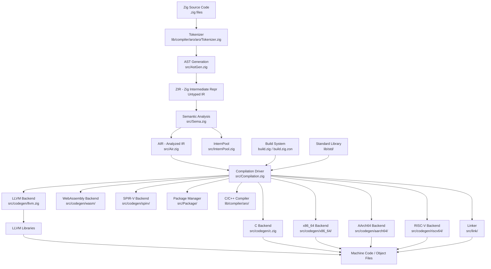
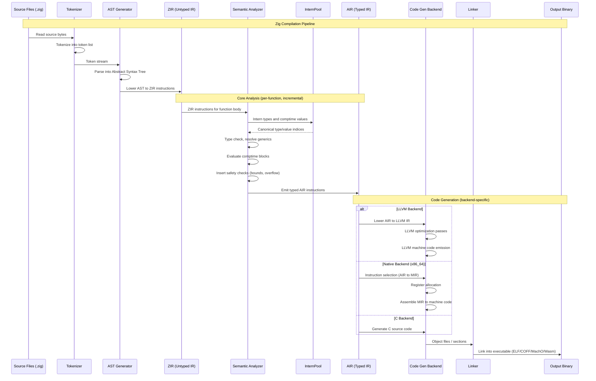
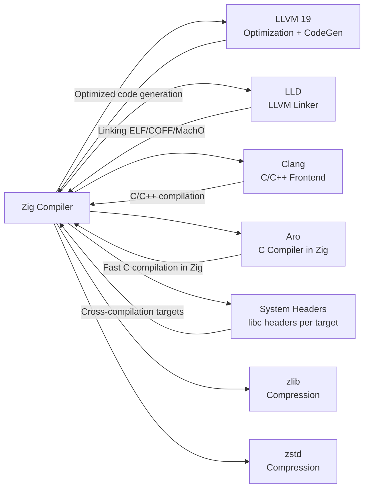

# Zig

> General-purpose systems programming language and toolchain designed for robust, optimal, and reusable software with comptime evaluation and a self-hosted compiler

| Metadata | |
|---|---|
| Repository | https://github.com/ziglang/zig |
| License | MIT License |
| Primary Language | Zig |
| Category | Runtime |
| Analyzed Release | `0.15.1` (2025-08-29) |
| Stars (approx.) | 42,000+ |
| Generated by | Claude Opus 4.6 (Anthropic) |
| Generated on | 2026-02-09 |

---

## Overview

### Problem Domain

Systems programming languages face a fundamental tension between low-level control, safety, and developer productivity. C and C++ provide hardware-level control but are plagued by undefined behavior, memory safety issues, and complex build systems. Rust addresses safety through a sophisticated type system but introduces significant learning curve with its borrow checker. Developers need a language that provides C-level control with better safety guarantees, simpler tooling, and a gentler learning curve.

### Project Positioning

Zig is a systems programming language that aims to be a practical alternative to C and C++. It features compile-time code execution (comptime), optional safety checks, manual memory management with allocator-aware standard library, seamless C/C++ interoperability, and a self-hosted compiler. The language avoids hidden control flow, hidden allocations, and implicit conversions that make C/C++ programs difficult to reason about. Zig also functions as a toolchain, providing a drop-in replacement for C/C++ compilers with cross-compilation support for 50+ targets out of the box, leveraging bundled LLVM and platform-specific system libraries.

---

## Architecture Overview

---

## Core Components

### 1. Semantic Analyzer - Sema (src/Sema.zig)

Responsibility: The central analysis pass that transforms ZIR (untyped intermediate representation) into AIR (analyzed intermediate representation). Performs type checking, comptime evaluation, generic instantiation, safety check insertion, and compile-time function execution.

Key files:
- `src/Sema.zig` - Main semantic analysis module (the largest file in the compiler)
- `src/Sema/arith.zig` - Arithmetic operation analysis
- `src/Sema/bitcast.zig` - Bitcast validation and lowering
- `src/Sema/comptime_ptr_access.zig` - Compile-time pointer dereference
- `src/Sema/LowerZon.zig` - ZON (Zig Object Notation) lowering

Design patterns:
- Instruction-by-instruction lowering: Each ZIR instruction is dispatched to a handler that produces AIR instructions
- Lazy evaluation: Types and values are only fully resolved when needed
- Comptime interpreter: A subset of the language is executed at compile time, producing values that are embedded in the output
- Memoization: Identical generic instantiations are deduplicated via InternPool

Sema is the heart of the Zig compiler. It processes ZIR instructions one at a time, resolving types, evaluating comptime expressions, checking safety, and producing AIR. When it encounters a comptime block or generic function instantiation, it executes the code at compile time using an interpreter built into Sema itself. This is what enables Zig's powerful metaprogramming: any function can be called at compile time if its inputs are known.

### 2. InternPool (src/InternPool.zig)

Responsibility: Global deduplication and interning of types, values, and other compile-time objects. Ensures that identical types always have the same identity, enabling O(1) type equality checks.

Key files:
- `src/InternPool.zig` - Type and value interning
- `src/Type.zig` - Type representation and queries
- `src/Value.zig` - Compile-time value representation

Design patterns:
- Flyweight pattern: Identical types and values share a single canonical instance
- Hash consing: Types are identified by structural hashing and stored in a global pool
- Compact encoding: Types are represented as indices into the pool, minimizing memory usage

The InternPool is critical for both correctness and performance. Since Zig supports generics through comptime, the compiler must create and compare potentially millions of type instantiations. By interning all types, equality checking becomes a simple integer comparison. The pool also ensures that generic function instantiations with identical parameters produce the same code, avoiding code bloat.

### 3. Code Generation Backends (src/codegen/)

Responsibility: Translate AIR into machine code or another target representation. Multiple backends support different output formats and optimization levels.

Key files:
- `src/codegen/llvm.zig` - LLVM IR generation (highest optimization, widest platform support)
- `src/codegen/c.zig` - C code generation (portability backend)
- `src/codegen/x86_64/` - Native x86_64 code generation (Select.zig, Assemble.zig, Mir.zig)
- `src/codegen/aarch64/` - Native AArch64 code generation
- `src/codegen/riscv64/` - Native RISC-V 64-bit code generation
- `src/codegen/wasm/` - WebAssembly code generation
- `src/codegen/spirv/` - SPIR-V code generation (GPU compute)
- `src/codegen.zig` - Backend dispatcher

Design patterns:
- Strategy pattern: Backend selection at compilation time based on target and optimization level
- Multi-stage lowering: AIR -> backend-specific MIR -> machine code
- Instruction selection: Pattern matching on AIR to emit optimal instruction sequences

The LLVM backend produces the best-optimized code and supports the most targets, but it is slow and has a large binary footprint. The native backends (x86_64, aarch64, riscv64) are much faster for debug builds because they skip LLVM entirely, generating machine code directly from AIR. The C backend enables bootstrapping the compiler on platforms where no native backend exists yet. Each native backend has its own Machine IR (MIR) representation and instruction selection pass.

### 4. Compilation Driver (src/Compilation.zig)

Responsibility: Orchestrates the entire compilation pipeline from source files through code generation and linking. Manages incremental compilation, multi-threaded work distribution, and C/C++ compilation integration.

Key files:
- `src/Compilation.zig` - Main compilation orchestration
- `src/Compilation/Config.zig` - Compilation configuration
- `src/Zcu.zig` - Zig Compilation Unit (per-module state)
- `src/Zcu/PerThread.zig` - Thread-local compilation state
- `src/link/` - Linker implementations (ELF, COFF, MachO, Wasm)

Design patterns:
- Incremental compilation: Only reanalyze and regenerate changed functions
- Work queue: Functions to be analyzed are queued and processed by worker threads
- Multi-threaded pipeline: Parsing, semantic analysis, and code generation can run concurrently on different compilation units

The Compilation driver ties all compiler stages together. It parses command-line options, discovers source files and dependencies, schedules work across threads, and invokes the linker. For incremental builds, it tracks which source files have changed and only reanalyzes affected functions, dramatically reducing rebuild times during development.

### 5. Package Manager and Build System (src/Package/, build.zig)

Responsibility: Dependency resolution, package fetching from URLs and git repositories, and the declarative build system that replaces Makefiles and CMake.

Key files:
- `src/Package/Manifest.zig` - build.zig.zon manifest parsing
- `src/Package/Fetch.zig` - Package download and extraction
- `src/Package/Fetch/git.zig` - Git repository fetching
- `src/Package/Module.zig` - Module resolution and linking
- `build.zig` - Zig's own build configuration

Design patterns:
- Convention over configuration: build.zig is a Zig program that uses the build system API
- Content-addressed caching: Downloaded packages are cached by hash
- Lazy dependencies: Packages are only fetched when actually needed

The build system is itself written in Zig, and build.zig files are compiled and executed by the compiler. This means build scripts have access to the full Zig language including comptime, making complex build logic straightforward. The package manager uses build.zig.zon (Zig Object Notation) manifests to declare dependencies with URL and hash, ensuring reproducible builds.

---

## Data Flow

---

## Key Design Decisions

### 1. Comptime Instead of Macros or Templates

Choice: Provide compile-time code execution (comptime) as a first-class language feature rather than a macro system or C++ templates.

Rationale: Comptime allows any Zig function to be executed at compile time if its inputs are known at compile time. This subsumes the use cases of C preprocessor macros, C++ templates, and constexpr, all with regular Zig syntax. Developers learn one language, not two (code + metaprogramming language).

Trade-offs: Compile-time execution makes the compiler more complex (Sema must include an interpreter). Comptime errors can be difficult to diagnose because they occur during compilation rather than at runtime. Very complex comptime logic can slow down compilation.

### 2. Self-Hosted Compiler Written in Zig

Choice: Write the compiler in Zig itself rather than in C or C++.

Rationale: Self-hosting validates the language for systems programming tasks. It also allows the compiler to use Zig-specific features (comptime, safety checks, allocator-aware data structures) for its own implementation, leading to a more maintainable and performant codebase. The bootstrapping chain uses a C-compiled stage1 or pre-built binary.

Trade-offs: Bootstrapping requires a pre-built Zig binary or a C-based bootstrap compiler (bootstrap.c). Changes to fundamental language features can temporarily break the compiler's ability to compile itself.

### 3. Multiple Native Backends Alongside LLVM

Choice: Develop custom native code generation backends (x86_64, aarch64, riscv64, wasm, spirv) in addition to the LLVM backend.

Rationale: LLVM produces highly optimized code but is slow (seconds for even small programs) and has a massive dependency footprint. Native backends provide near-instant compilation for debug builds, enabling a tight edit-compile-run loop. The x86_64 backend can compile and link a Zig program in milliseconds.

Trade-offs: Native backends produce less optimized code than LLVM. Each native backend requires significant architecture-specific implementation work. Feature parity between backends is an ongoing effort.

### 4. Explicit Allocator Parameter Pattern

Choice: Require all standard library functions that allocate memory to take an explicit Allocator parameter rather than using a global allocator.

Rationale: Explicit allocators make memory allocation visible in function signatures, enabling custom allocation strategies (arena, fixed-buffer, page), making resource usage analyzable, and preventing hidden allocations that cause performance surprises.

Trade-offs: More verbose function signatures. Every allocating function in a call chain must thread the allocator parameter through. However, this is considered a feature, not a bug: it makes the cost model explicit and enables powerful allocation patterns for embedded and real-time systems.

### 5. C ABI Compatibility as a First-Class Feature

Choice: Design Zig to be fully interoperable with C at the ABI level, including the ability to import C header files and link with C libraries directly.

Rationale: The vast ecosystem of C libraries represents decades of engineering effort. By making C interop seamless (including translating C headers to Zig declarations at compile time), Zig programs can immediately access this ecosystem. The Zig compiler also functions as a C/C++ compiler (via the bundled Aro C compiler and Clang), enabling gradual migration from C/C++ to Zig.

Trade-offs: C ABI compatibility constrains some language design decisions. Supporting C's many platform-specific quirks adds complexity. The bundled C compiler (Aro) and system headers increase the compiler distribution size.

---

## Dependencies

---

## Testing Strategy

Zig employs a rigorous multi-faceted testing approach:

- Behavior Tests: The `test/` directory contains thousands of Zig programs that test specific language features and compiler behavior. Each test is a small program that should compile and run correctly (or fail to compile with a specific error message).

- Standard Library Tests: Every module in `lib/std/` includes inline tests (using Zig's built-in `test` declarations) that validate library functionality. Running `zig test` on any standard library file executes its tests.

- Compile Error Tests: Tests that verify the compiler produces the correct error messages for invalid code. These ensure that error reporting quality does not regress.

- Cross-Compilation Tests: The CI matrix tests compilation across many target architectures to verify that code generation backends produce correct output.

- Incremental Compilation Tests: Specific tests verify that the incremental compilation system correctly handles source file changes without full rebuilds.

- Bootstrap Test: The compiler is built using a previous version of itself, verifying that the self-hosting chain works correctly.

- Fuzzing: Critical compiler components are fuzzed to find crashes and miscompilations.

---

## Key Takeaways

1. Comptime unifies metaprogramming with regular code: By allowing any function to execute at compile time, Zig eliminates the need for separate macro languages, preprocessors, or template systems. This dramatically reduces language complexity while providing equivalent power for code generation, generic programming, and build-time computation.

2. Multiple backends trade optimization for compilation speed: The architecture of having both LLVM (for optimized release builds) and native backends (for fast debug builds) recognizes that development-time and release-time needs are fundamentally different. Millisecond compilation in debug mode enables a rapid development workflow.

3. Explicit resource management enables systems-level reasoning: The allocator parameter pattern and lack of hidden control flow make every resource allocation and deallocation visible in the code. This design philosophy produces programs that are easier to audit for resource usage and more predictable in their runtime behavior.

4. C interoperability leverages the existing ecosystem: Rather than building everything from scratch, Zig's seamless C ABI compatibility and built-in C compiler allow gradual adoption. Projects can start using Zig for new modules while continuing to link with existing C/C++ code.

5. Self-hosting validates the language's systems programming claims: A compiler is one of the most demanding systems programming tasks. By successfully writing its own compiler in Zig, the project demonstrates that the language is practical for large-scale, performance-critical software.

---

## References

- Zig GitHub Repository: https://github.com/ziglang/zig
- Zig Official Website: https://ziglang.org/
- Zig Language Overview: https://ziglang.org/learn/overview/
- Zig Internals: https://github.com/mikdusan/zig.internals/blob/master/internals.rst
- Zig Compiler Architecture (Augment Code): https://www.augmentcode.com/open-source/ziglang/zig
- Zig Design Revisited (Sourcegraph): https://sourcegraph.com/blog/zig-programming-language-revisiting-design-approach
- Zig Codeberg (New Home): https://codeberg.org/ziglang/zig
